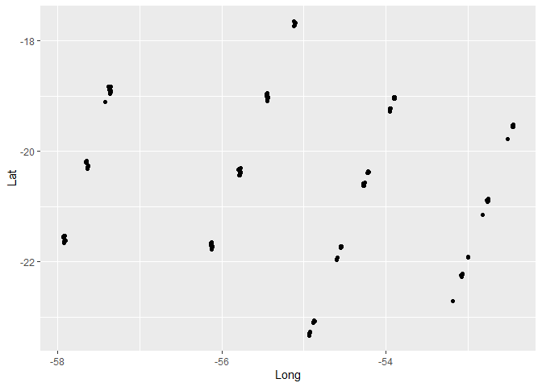
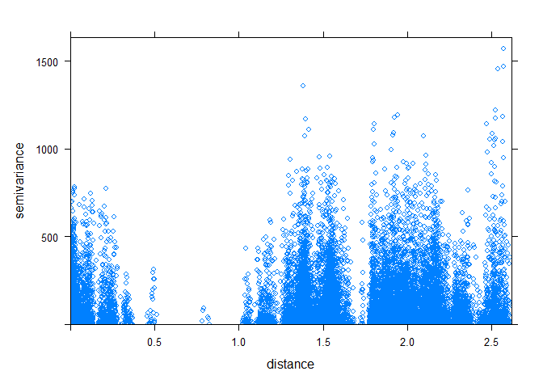
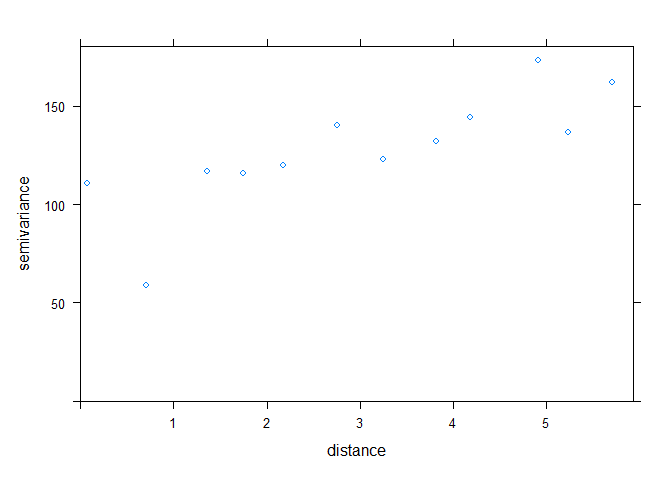
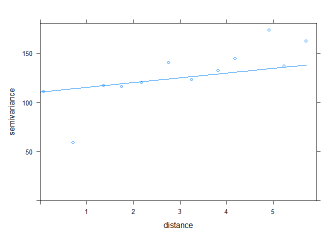

<!-- README.md is generated from README.Rmd. Please edit that file -->

# metano\_GOSAT

### Carregando os Pacotes

``` r
# Lendo os pacotes 
library(tidyverse)
library(ggpubr)
library(geobr)
library(sp)
library(gstat)
```

``` r
#################################################################
# Diretório de uso do R
# Baixando arquivo em .csv
dados <- readr::read_csv("data/dados_MS.csv") |> 
  mutate(data = lubridate::make_date(year, month, day))
#> Warning: Missing column names filled in: 'X1' [1]
#> 
#> -- Column specification --------------------------------------------------------
#> cols(
#>   X1 = col_double(),
#>   X.1 = col_double(),
#>   OBJECTID = col_double(),
#>   Field1 = col_double(),
#>   X = col_double(),
#>   Lat = col_double(),
#>   Long = col_double(),
#>   ch4 = col_double(),
#>   Date = col_character(),
#>   day = col_double(),
#>   month = col_double(),
#>   year = col_double()
#> )
glimpse(dados)
#> Rows: 6,152
#> Columns: 13
#> $ X1       <dbl> 9, 14, 15, 35, 39, 40, 52, 57, 58, 59, 60, 61, 62, 65, 66, 67~
#> $ X.1      <dbl> 9, 14, 15, 35, 39, 40, 52, 57, 58, 59, 60, 61, 62, 65, 66, 67~
#> $ OBJECTID <dbl> 9, 14, 15, 35, 39, 40, 52, 57, 58, 59, 60, 61, 62, 65, 66, 67~
#> $ Field1   <dbl> 1941, 1946, 1947, 3010, 3016, 3017, 5244, 5249, 5250, 5251, 5~
#> $ X        <dbl> 1941, 1946, 1947, 3010, 3016, 3017, 5244, 5249, 5250, 5251, 5~
#> $ Lat      <dbl> -19.02840, -20.91971, -22.27301, -18.90268, -20.22064, -21.61~
#> $ Long     <dbl> -55.43237, -52.75982, -53.07330, -57.34810, -57.64355, -57.90~
#> $ ch4      <dbl> 1787.438, 1767.357, 1759.968, 1789.462, 1767.558, 1771.425, 1~
#> $ Date     <chr> "4/24/2009", "4/24/2009", "4/24/2009", "4/25/2009", "4/25/200~
#> $ day      <dbl> 24, 24, 24, 25, 25, 25, 27, 27, 27, 27, 27, 27, 27, 27, 27, 2~
#> $ month    <dbl> 4, 4, 4, 4, 4, 4, 4, 4, 4, 4, 4, 4, 4, 4, 4, 4, 4, 4, 4, 4, 4~
#> $ year     <dbl> 2009, 2009, 2009, 2009, 2009, 2009, 2009, 2009, 2009, 2009, 2~
#> $ data     <date> 2009-04-24, 2009-04-24, 2009-04-24, 2009-04-25, 2009-04-25, ~
```

``` r
dados %>% 
  filter(year==2009) %>% 
  ggplot(aes(x=Long, y=Lat))+
  geom_point()
```

<!-- -->

``` r
dados_ax <- dados %>% 
  filter(year==2009) %>% 
  group_by(Lat,Long) %>% 
  summarise(ch4_mean=mean(ch4,na.rm=TRUE))
#> `summarise()` has grouped output by 'Lat'. You can override using the `.groups` argument.
```

``` r
dados_ax %>% 
  ggplot(aes(x=Long, y=Lat))+
  geom_point()
```

<!-- -->

``` r
# Filtrando apenas ano de 2010
dados2 <- dados_ax
coordinates(dados2) = ~ Long + Lat
# Variograma de nuvens de pontos
vgm.cloud <- variogram(ch4_mean ~ 1, dados2[
  -c(28,29,30,74,75,77,78,83,84,90,98,109,
111,112,113,114,115,116,117,118,119,120,121,122,
123,124,146,165,173,177,191,195,196,200,203,213,
214,228,236,237,267,272,273,275,277,289,299,309,
310,314,315,321),], 
                       width=.5,
                       cloud = TRUE)
plot(vgm.cloud)
```

<!-- -->

``` r
my_vgm <- print(vgm.cloud)
#>               dist        gamma dir.hor dir.ver   id left right
#> 1     0.0094519246 6.730980e+01       0       0 var1    2     1
#> 2     0.0118812964 2.331704e+01       0       0 var1    3     1
#> 3     0.0058803305 1.139389e+01       0       0 var1    3     2
#> 4     0.0384919516 1.273362e+02       0       0 var1    4     1
#> 5     0.0294388668 9.486876e+00       0       0 var1    4     2
#> 6     0.0271691810 4.167426e+01       0       0 var1    4     3
#> 7     0.0403911371 8.024049e+01       0       0 var1    5     1
#> 8     0.0312213225 5.676877e-01       0       0 var1    5     2
#> 9     0.0292333356 1.704809e+01       0       0 var1    5     3
#> 10    0.0024471798 5.413192e+00       0       0 var1    5     4
#> 11    0.0522555285 8.679757e+00       0       0 var1    6     1
#> 12    0.0428697386 1.243314e+02       0       0 var1    6     2
#> 13    0.0431249710 6.044930e+01       0       0 var1    6     3
#> 14    0.0211843616 2.025064e+02       0       0 var1    6     4
#> 15    0.0189096117 1.417016e+02       0       0 var1    6     5
#> 16    0.0642979890 3.878965e+01       0       0 var1    7     1
#> 17    0.0549250368 3.905057e+00       0       0 var1    7     2
#> 18    0.0551466327 1.958213e+00       0       0 var1    7     3
#> 19    0.0317332642 2.556515e+01       0       0 var1    7     4
#> 20    0.0293082862 7.450564e+00       0       0 var1    7     5
#> 21    0.0120637087 8.416735e+01       0       0 var1    7     6
#> 22    0.2325623317 4.728551e+02       0       0 var1    8     1
#> 23    0.2232200057 1.833581e+02       0       0 var1    8     2
#> 24    0.2232964004 2.861666e+02       0       0 var1    8     3
#> 25    0.1977344973 1.094304e+02       0       0 var1    8     4
#> 26    0.1953484163 1.635208e+02       0       0 var1    8     5
#> 27    0.1803666812 6.096640e+02       0       0 var1    8     6
#> 28    0.1683038251 2.407803e+02       0       0 var1    8     7
#> 29    0.2328290746 5.993956e+01       0       0 var1    9     1
#> 30    0.2234795950 2.136207e-01       0       0 var1    9     2
#> 31    0.2235254686 8.487270e+00       0       0 var1    9     3
#> 32    0.1979128416 1.254767e+01       0       0 var1    9     4
#> 33    0.1955300398 1.477785e+00       0       0 var1    9     5
#> 34    0.1806201472 1.142378e+02       0       0 var1    9     6
#> 35    0.1685585089 2.291985e+00       0       0 var1    9     7
#> 36    0.0011849605 1.960887e+02       0       0 var1    9     8
#> 37    0.2363016056 9.062764e+01       0       0 var1   10     1
#> 38    0.2269335099 1.730803e+00       0       0 var1   10     2
#> 39    0.2268934443 2.200626e+01       0       0 var1   10     3
#> 40    0.2011385203 3.113381e+00       0       0 var1   10     4
#> 41    0.1987658350 3.160117e-01       0       0 var1   10     5
#> 42    0.1840645087 1.554011e+02       0       0 var1   10     6
#> 43    0.1720090526 1.083543e+01       0       0 var1   10     7
#> 44    0.0057649399 1.494598e+02       0       0 var1   10     8
#> 45    0.0047401323 3.160540e+00       0       0 var1   10     9
#> 46    0.2389889515 1.884232e+02       0       0 var1   11     1
#> 47    0.2296239777 3.049775e+01       0       0 var1   11     2
#> 48    0.2295976069 7.917368e+01       0       0 var1   11     3
#> 49    0.2038605300 5.965314e+00       0       0 var1   11     4
#> 50    0.2014866844 2.274361e+01       0       0 var1   11     5
#> 51    0.1867558274 2.779847e+02       0       0 var1   11     6
#> 52    0.1746990241 5.622897e+01       0       0 var1   11     7
#> 53    0.0074845743 6.429635e+01       0       0 var1   11     8
#> 54    0.0067129113 3.581625e+01       0       0 var1   11     9
#> 55    0.0027494216 1.769781e+01       0       0 var1   11    10
#> 56    0.2407070006 4.908991e+02       0       0 var1   12     1
#> 57    0.2313398697 1.946580e+02       0       0 var1   12     2
#> 58    0.2313026429 3.002413e+02       0       0 var1   12     3
#> 59    0.2055463428 1.181984e+02       0       0 var1   12     4
#> 60    0.2031740022 1.742014e+02       0       0 var1   12     5
#> 61    0.1884710820 6.301298e+02       0       0 var1   12     6
#> 62    0.1764152179 2.537047e+02       0       0 var1   12     7
#> 63    0.0091817991 1.689304e-01       0       0 var1   12     8
#> 64    0.0084538706 2.077686e+02       0       0 var1   12     9
#> 65    0.0044095296 1.596783e+02       0       0 var1   12    10
#> 66    0.0017627243 7.105667e+01       0       0 var1   12    11
#> 67    0.2432802184 2.349677e+02       0       0 var1   13     1
#> 68    0.2339056226 5.075709e+01       0       0 var1   13     2
#> 69    0.2338311522 1.102476e+02       0       0 var1   13     3
#> 70    0.2080142072 1.635656e+01       0       0 var1   13     4
#> 71    0.2056466098 4.058901e+01       0       0 var1   13     5
#> 72    0.1910358848 3.339683e+02       0       0 var1   13     6
#> 73    0.1789838003 8.281952e+01       0       0 var1   13     7
#> 74    0.0121228123 4.117244e+01       0       0 var1   13     8
#> 75    0.0113737219 5.755639e+01       0       0 var1   13     9
#> 76    0.0070848754 3.374218e+01       0       0 var1   13    10
#> 77    0.0046608139 2.566164e+00       0       0 var1   13    11
#> 78    0.0029426593 4.661594e+01       0       0 var1   13    12
#> 79    0.2441520025 1.330779e+02       0       0 var1   14     1
#> 80    0.2347946532 1.110013e+01       0       0 var1   14     2
#> 81    0.2348012642 4.498611e+01       0       0 var1   14     3
#> 82    0.2091095363 6.330678e-02       0       0 var1   14     4
#> 83    0.2067327240 6.647296e+00       0       0 var1   14     5
#> 84    0.1919298034 2.097307e+02       0       0 var1   14     6
#> 85    0.1798703018 2.817282e+01       0       0 var1   14     7
#> 86    0.0118562574 1.042296e+02       0       0 var1   14     8
#> 87    0.0113994417 1.439350e+01       0       0 var1   14     9
#> 88    0.0080951936 4.064602e+00       0       0 var1   14    10
#> 89    0.0053485550 4.799564e+00       0       0 var1   14    11
#> 90    0.0038869012 1.127908e+02       0       0 var1   14    12
#> 91    0.0033622467 1.438469e+01       0       0 var1   14    13
#> 92    0.2449855532 2.038866e+01       0       0 var1   15     1
#> 93    0.2356109052 1.360780e+01       0       0 var1   15     2
#> 94    0.2355355329 9.821445e-02       0       0 var1   15     3
#> 95    0.2097151526 4.581871e+01       0       0 var1   15     4
#> 96    0.2073479129 1.973426e+01       0       0 var1   15     5
#> 97    0.1927411682 5.567433e+01       0       0 var1   15     6
#> 98    0.1806891182 2.933524e+00       0       0 var1   15     7
#> 99    0.0136644860 2.968678e+02       0       0 var1   15     8
#> 100   0.0129657096 1.041149e+01       0       0 var1   15     9
#> 101   0.0087710044 2.504477e+01       0       0 var1   15    10
#> 102   0.0062699741 8.484899e+01       0       0 var1   15    11
#> 103   0.0045139094 3.112001e+02       0       0 var1   15    12
#> 104   0.0017053455 1.169269e+02       0       0 var1   15    13
#> 105   0.0033694179 4.928827e+01       0       0 var1   15    14
#> 106   0.2499360635 4.296854e+01       0       0 var1   16     1
#> 107   0.2405861990 2.719914e+00       0       0 var1   16     2
#> 108   0.2406236369 2.979997e+00       0       0 var1   16     3
#> 109   0.2149738630 2.236622e+01       0       0 var1   16     4
#> 110   0.2125944482 5.772808e+00       0       0 var1   16     5
#> 111   0.1977260738 9.027245e+01       0       0 var1   16     6
#> 112   0.1856646621 1.068671e-01       0       0 var1   16     7
#> 113   0.0174159352 2.307420e+02       0       0 var1   16     8
#> 114   0.0171069959 1.409029e+00       0       0 var1   16     9
#> 115   0.0140345826 8.790134e+00       0       0 var1   16    10
#> 116   0.0112869306 5.143318e+01       0       0 var1   16    11
#> 117   0.0097556630 2.433976e+02       0       0 var1   16    12
#> 118   0.0081097278 7.697637e+01       0       0 var1   16    13
#> 119   0.0059395738 2.480938e+01       0       0 var1   16    14
#> 120   0.0067957734 4.160208e+00       0       0 var1   16    15
#> 121   0.2507031545 4.226168e-02       0       0 var1   17     1
#> 122   0.2413309579 7.072527e+01       0       0 var1   17     2
#> 123   0.2412655821 2.534467e+01       0       0 var1   17     3
#> 124   0.2154537359 1.320180e+02       0       0 var1   17     4
#> 125   0.2130861227 8.396574e+01       0       0 var1   17     5
#> 126   0.1984612992 7.510704e+00       0       0 var1   17     6
#> 127   0.1864079373 4.139262e+01       0       0 var1   17     7
#> 128   0.0188894058 4.818380e+02       0       0 var1   17     8
#> 129   0.0183314554 6.316499e+01       0       0 var1   17     9
#> 130   0.0144211442 9.458402e+01       0       0 var1   17    10
#> 131   0.0117922142 1.941092e+02       0       0 var1   17    11
#> 132   0.0100416820 5.000510e+02       0       0 var1   17    12
#> 133   0.0074395308 2.413124e+02       0       0 var1   17    13
#> 134   0.0071240124 1.378632e+02       0       0 var1   17    14
#> 135   0.0057398165 2.228743e+01       0       0 var1   17    15
#> 136   0.0042695684 4.570592e+01       0       0 var1   17    16
#> 137   0.2513189149 5.908078e+01       0       0 var1   18     1
#> 138   0.2419587210 2.681719e-01       0       0 var1   18     2
#> 139   0.2419497894 8.166049e+00       0       0 var1   18     3
#> 140   0.2162245815 1.294510e+01       0       0 var1   18     4
#> 141   0.2138505141 1.616213e+00       0       0 var1   18     5
#> 142   0.1990923571 1.130510e+02       0       0 var1   18     6
#> 143   0.1870338409 2.126547e+00       0       0 var1   18     7
#> 144   0.0189992751 1.976507e+02       0       0 var1   18     8
#> 145   0.0185800422 3.098262e-03       0       0 var1   18     9
#> 146   0.0150930356 3.361550e+00       0       0 var1   18    10
#> 147   0.0123641987 3.648558e+01       0       0 var1   18    11
#> 148   0.0106945800 2.093763e+02       0       0 var1   18    12
#> 149   0.0085100327 5.840405e+01       0       0 var1   18    13
#> 150   0.0071845162 1.481895e+01       0       0 var1   18    14
#> 151   0.0069282528 1.005538e+01       0       0 var1   18    15
#> 152   0.0023325819 1.279982e+00       0       0 var1   18    16
#> 153   0.0024103593 6.228332e+01       0       0 var1   18    17
#> 154   0.2517068567 5.279809e+02       0       0 var1   19     1
#> 155   0.2423177421 2.182586e+02       0       0 var1   19     2
#> 156   0.2421643455 3.293885e+02       0       0 var1   19     3
#> 157   0.2162204104 1.367380e+02       0       0 var1   19     4
#> 158   0.2138636941 1.965640e+02       0       0 var1   19     5
#> 159   0.1994525191 6.720526e+02       0       0 var1   19     6
#> 160   0.1874106018 2.805525e+02       0       0 var1   19     7
#> 161   0.0210475114 1.519309e+00       0       0 var1   19     8
#> 162   0.0203314388 2.321287e+02       0       0 var1   19     9
#> 163   0.0159810583 1.811172e+02       0       0 var1   19    10
#> 164   0.0136201712 8.558290e+01       0       0 var1   19    11
#> 165   0.0118800569 6.750116e-01       0       0 var1   19    12
#> 166   0.0089622515 5.850992e+01       0       0 var1   19    13
#> 167   0.0098756190 1.309169e+02       0       0 var1   19    14
#> 168   0.0073835798 3.408622e+02       0       0 var1   19    15
#> 169   0.0080042666 2.697082e+02       0       0 var1   19    16
#> 170   0.0037403745 5.374705e+02       0       0 var1   19    17
#> 171   0.0059552037 2.338279e+02       0       0 var1   19    18
#> 172   0.2543022840 3.052208e+02       0       0 var1   20     1
#> 173   0.2449476222 8.586460e+01       0       0 var1   20     2
#> 174   0.2449624898 1.598151e+02       0       0 var1   20     3
#> 175   0.2192713074 3.826954e+01       0       0 var1   20     4
#> 176   0.2168949618 7.246887e+01       0       0 var1   20     5
#> 177   0.2020841883 4.168422e+02       0       0 var1   20     6
#> 178   0.1900239886 1.263924e+02       0       0 var1   20     7
#> 179   0.0218361034 1.827273e+01       0       0 var1   20     8
#> 180   0.0214896639 9.464384e+01       0       0 var1   20     9
#> 181   0.0181769089 6.321388e+01       0       0 var1   20    10
#> 182   0.0154353098 1.401633e+01       0       0 var1   20    11
#> 183   0.0137969566 2.195553e+01       0       0 var1   20    12
#> 184   0.0116685908 4.587796e+00       0       0 var1   20    13
#> 185   0.0101634406 3.521983e+01       0       0 var1   20    14
#> 186   0.0100807739 1.678370e+02       0       0 var1   20    15
#> 187   0.0044491324 1.191488e+02       0       0 var1   20    16
#> 188   0.0049377016 3.124462e+02       0       0 var1   20    17
#> 189   0.0031586313 9.572996e+01       0       0 var1   20    18
#> 190   0.0074806404 3.032995e+01       0       0 var1   20    19
#> 191   0.2584889900 4.016062e+02       0       0 var1   21     1
#> 192   0.2491407195 1.400876e+02       0       0 var1   21     2
#> 193   0.2491819846 2.313849e+02       0       0 var1   21     3
#> 194   0.2235280081 7.666371e+01       0       0 var1   21     4
#> 195   0.2211492845 1.228198e+02       0       0 var1   21     5
#> 196   0.2062816171 5.283680e+02       0       0 var1   21     6
#> 197   0.1942199358 1.907708e+02       0       0 var1   21     7
#> 198   0.0259434563 2.907427e+00       0       0 var1   21     8
#> 199   0.0256614784 1.512420e+02       0       0 var1   21     9
#> 200   0.0224913126 1.106759e+02       0       0 var1   21    10
#> 201   0.0197446427 3.985880e+01       0       0 var1   21    11
#> 202   0.0181269445 4.478004e+00       0       0 var1   21    12
#> 203   0.0160150643 2.219783e+01       0       0 var1   21    13
#> 204   0.0144350058 7.232096e+01       0       0 var1   21    14
#> 205   0.0144138025 2.410174e+02       0       0 var1   21    15
#> 206   0.0085585349 1.818472e+02       0       0 var1   21    16
#> 207   0.0090338439 4.098880e+02       0       0 var1   21    17
#> 208   0.0075061808 1.526142e+02       0       0 var1   21    18
#> 209   0.0106792726 8.630201e+00       0       0 var1   21    19
#> 210   0.0043503358 6.602553e+00       0       0 var1   21    20
#> 211   0.2607773315 2.410778e+02       0       0 var1   22     1
#> 212   0.2514630908 5.361793e+01       0       0 var1   22     2
#> 213   0.2516391999 1.144453e+02       0       0 var1   22     3
#> 214   0.2262060798 1.799753e+01       0       0 var1   22     4
#> 215   0.2238136740 4.315145e+01       0       0 var1   22     5
#> 216   0.2086418329 3.412452e+02       0       0 var1   22     6
#> 217   0.1965787578 8.646300e+01       0       0 var1   22     7
#> 218   0.0285791916 3.867037e+01       0       0 var1   22     8
#> 219   0.0285382826 6.060027e+01       0       0 var1   22     9
#> 220   0.0261583498 3.608197e+01       0       0 var1   22    10
#> 221   0.0234508976 3.239821e+00       0       0 var1   22    11
#> 222   0.0220433404 4.395109e+01       0       0 var1   22    12
#> 223   0.0204832105 3.921400e-02       0       0 var1   22    13
#> 224   0.0181602759 1.592601e+01       0       0 var1   22    14
#> 225   0.0190715015 1.212488e+02       0       0 var1   22    15
#> 226   0.0123897941 8.049038e+01       0       0 var1   22    16
#> 227   0.0144052685 2.475040e+02       0       0 var1   22    17
#> 228   0.0123448026 6.146999e+01       0       0 var1   22    18
#> 229   0.0166741362 5.551967e+01       0       0 var1   22    19
#> 230   0.0094792817 3.778704e+00       0       0 var1   22    20
#> 231   0.0062194518 2.037107e+01       0       0 var1   22    21
#> 232   0.2621029068 4.388057e+02       0       0 var1   23     1
#> 233   0.2527918192 1.623951e+02       0       0 var1   23     2
#> 234   0.2529791396 2.598195e+02       0       0 var1   23     3
#> 235   0.2275635803 9.338046e+01       0       0 var1   23     4
#> 236   0.2251702362 1.437597e+02       0       0 var1   23     5
#> 237   0.2099750117 5.709152e+02       0       0 var1   23     6
#> 238   0.1979122654 2.166653e+02       0       0 var1   23     7
#> 239   0.0299668229 6.360747e-01       0       0 var1   23     8
#> 240   0.0299366928 1.743885e+02       0       0 var1   23     9
#> 241   0.0275765121 1.305954e+02       0       0 var1   23    10
#> 242   0.0248693923 5.214223e+01       0       0 var1   23    11
#> 243   0.0234605778 1.460604e+00       0       0 var1   23    12
#> 244   0.0218845401 3.157353e+01       0       0 var1   23    13
#> 245   0.0195779749 8.858100e+01       0       0 var1   23    14
#> 246   0.0204611284 2.700208e+02       0       0 var1   23    15
#> 247   0.0137977541 2.071484e+02       0       0 var1   23    16
#> 248   0.0157156296 4.474606e+02       0       0 var1   23    17
#> 249   0.0136995169 1.758617e+02       0       0 var1   23    18
#> 250   0.0178601339 4.121490e+00       0       0 var1   23    19
#> 251   0.0107793339 1.209035e+01       0       0 var1   23    20
#> 252   0.0072634395 8.236925e-01       0       0 var1   23    21
#> 253   0.0014185012 2.938732e+01       0       0 var1   23    22
#> 254   0.2616971839 6.997489e+01       0       0 var1   24     1
#> 255   0.2523305467 2.587085e-02       0       0 var1   24     2
#> 256   0.2522881291 1.250561e+01       0       0 var1   24     3
#> 257   0.2264992959 8.521922e+00       0       0 var1   24     4
#> 258   0.2241304338 3.511823e-01       0       0 var1   24     5
#> 259   0.2094617964 1.279442e+02       0       0 var1   24     6
#> 260   0.1974058462 4.566623e+00       0       0 var1   24     7
#> 261   0.0294464699 1.790279e+02       0       0 var1   24     8
#> 262   0.0290288179 3.881730e-01       0       0 var1   24     9
#> 263   0.0253979585 1.333460e+00       0       0 var1   24    10
#> 264   0.0227097401 2.874710e+01       0       0 var1   24    11
#> 265   0.0209907194 1.901957e+02       0       0 var1   24    12
#> 266   0.0184897771 4.849113e+01       0       0 var1   24    13
#> 267   0.0176298483 1.005424e+01       0       0 var1   24    14
#> 268   0.0167930156 1.482034e+01       0       0 var1   24    15
#> 269   0.0121740903 3.276319e+00       0       0 var1   24    16
#> 270   0.0110539103 7.345648e+01       0       0 var1   24    17
#> 271   0.0104509620 4.606301e-01       0       0 var1   24    18
#> 272   0.0110977897 2.135320e+02       0       0 var1   24    19
#> 273   0.0077432879 8.290961e+01       0       0 var1   24    20
#> 274   0.0047584416 1.363060e+02       0       0 var1   24    21
#> 275   0.0093935585 5.128826e+01       0       0 var1   24    22
#> 276   0.0098862462 1.583216e+02       0       0 var1   24    23
#> 277   0.2642003823 4.709734e+02       0       0 var1   25     1
#> 278   0.2548689547 1.821870e+02       0       0 var1   25     2
#> 279   0.2549778112 2.847032e+02       0       0 var1   25     3
#> 280   0.2294273055 1.085262e+02       0       0 var1   25     4
#> 281   0.2270420712 1.624151e+02       0       0 var1   25     5
#> 282   0.2120256539 6.075271e+02       0       0 var1   25     6
#> 283   0.1999620358 2.394381e+02       0       0 var1   25     7
#> 284   0.0316949641 1.875720e-03       0       0 var1   25     8
#> 285   0.0315270856 1.948776e+02       0       0 var1   25     9
#> 286   0.0286666047 1.484028e+02       0       0 var1   25    10
#> 287   0.0259186822 6.360367e+01       0       0 var1   25    11
#> 288   0.0243626102 2.064076e-01       0       0 var1   25    12
#> 289   0.0223902755 4.061852e+01       0       0 var1   25    13
#> 290   0.0205715618 1.033472e+02       0       0 var1   25    14
#> 291   0.0208189387 2.953772e+02       0       0 var1   25    15
#> 292   0.0146320303 2.294281e+02       0       0 var1   25    16
#> 293   0.0154813900 4.799385e+02       0       0 var1   25    17
#> 294   0.0138914276 1.964348e+02       0       0 var1   25    18
#> 295   0.0168431961 1.627951e+00       0       0 var1   25    19
#> 296   0.0107394674 1.790434e+01       0       0 var1   25    20
#> 297   0.0064497234 2.761607e+00       0       0 var1   25    21
#> 298   0.0044459326 3.813360e+01       0       0 var1   25    22
#> 299   0.0039546171 5.688679e-01       0       0 var1   25    23
#> 300   0.0070286582 1.778708e+02       0       0 var1   25    24
#> 301   0.2642041717 5.651865e+00       0       0 var1   26     1
#> 302   0.2548339035 1.119707e+02       0       0 var1   26     2
#> 303   0.2547733236 5.192841e+01       0       0 var1   26     3
#> 304   0.2289541989 1.866420e+02       0       0 var1   26     4
#> 305   0.2265877847 1.284838e+02       0       0 var1   26     5
#> 306   0.2119644308 3.235080e-01       0       0 var1   26     6
#> 307   0.1999101562 7.405461e+01       0       0 var1   26     7
#> 308   0.0320332775 5.818997e+02       0       0 var1   26     8
#> 309   0.0316001653 1.024028e+02       0       0 var1   26     9
#> 310   0.0279048338 1.415438e+02       0       0 var1   26    10
#> 311   0.0252339492 2.593419e+02       0       0 var1   26    11
#> 312   0.0235038649 6.018980e+02       0       0 var1   26    12
#> 313   0.0209446851 3.135032e+02       0       0 var1   26    13
#> 314   0.0202013718 1.935801e+02       0       0 var1   26    14
#> 315   0.0192416535 4.750994e+01       0       0 var1   26    15
#> 316   0.0147873404 7.978784e+01       0       0 var1   26    16
#> 317   0.0135078071 4.716666e+00       0       0 var1   26    17
#> 318   0.0130340081 1.012794e+02       0       0 var1   26    18
#> 319   0.0131614369 6.428861e+02       0       0 var1   26    19
#> 320   0.0103577304 3.939406e+02       0       0 var1   26    20
#> 321   0.0071332803 5.025434e+02       0       0 var1   26    21
#> 322   0.0106974167 3.205549e+02       0       0 var1   26    22
#> 323   0.0108725632 5.440582e+02       0       0 var1   26    23
#> 324   0.0026144976 1.154005e+02       0       0 var1   26    24
#> 325   0.0073446942 5.798121e+02       0       0 var1   26    25
#> 326   0.2662826573 6.638176e+01       0       0 var1   27     1
#> 327   0.2569201533 3.221155e-03       0       0 var1   27     2
#> 328   0.2568955533 1.101395e+01       0       0 var1   27     3
#> 329   0.2311293489 9.839718e+00       0       0 var1   27     4
#> 330   0.2287589824 6.564334e-01       0       0 var1   27     5
#> 331   0.2140527000 1.230689e+02       0       0 var1   27     6
#> 332   0.2019951172 3.683967e+00       0       0 var1   27     7
#> 333   0.0339026421 1.848983e+02       0       0 var1   27     8
#> 334   0.0335310425 1.643783e-01       0       0 var1   27     9
#> 335   0.0300033212 1.883358e+00       0       0 var1   27    10
#> 336   0.0272991593 3.112783e+01       0       0 var1   27    11
#> 337   0.0255938120 1.962449e+02       0       0 var1   27    12
#> 338   0.0231347169 5.156901e+01       0       0 var1   27    13
#> 339   0.0221498730 1.148153e+01       0       0 var1   27    14
#> 340   0.0214416370 1.319229e+01       0       0 var1   27    15
#> 341   0.0165137204 2.535932e+00       0       0 var1   27    16
#> 342   0.0157058599 6.977389e+01       0       0 var1   27    17
#> 343   0.0149693862 2.126113e-01       0       0 var1   27    18
#> 344   0.0156527278 2.199388e+02       0       0 var1   27    19
#> 345   0.0120716166 8.691965e+01       0       0 var1   27    20
#> 346   0.0082490818 1.414343e+02       0       0 var1   27    21
#> 347   0.0101980480 5.445232e+01       0       0 var1   27    22
#> 348   0.0100288855 1.638448e+02       0       0 var1   27    23
#> 349   0.0046630786 4.734949e-02       0       0 var1   27    24
#> 350   0.0061379138 1.837224e+02       0       0 var1   27    25
#> 351   0.0026228378 1.107728e+02       0       0 var1   27    26
#> 352   1.8517713358 4.711235e+02       0       0 var1   28     1
#> 353   1.8480023271 1.822803e+02       0       0 var1   28     2
#> 354   1.8529758286 2.848199e+02       0       0 var1   28     3
#> 355   1.8460824122 1.085982e+02       0       0 var1   28     4
#> 356   1.8442604886 1.625032e+02       0       0 var1   28     5
#> 357   1.8263854139 6.076975e+02       0       0 var1   28     6
#> 358   1.8199991163 2.395451e+02       0       0 var1   28     7
#> 359   1.7390527172 1.588281e-03       0       0 var1   28     8
#> 360   1.7399794812 1.949742e+02       0       0 var1   28     9
#> 361   1.7414429811 1.484870e+02       0       0 var1   28    10
#> 362   1.7398006852 6.365881e+01       0       0 var1   28    11
#> 363   1.7394489211 2.032790e-01       0       0 var1   28    12
#> 364   1.7396989811 4.066259e+01       0       0 var1   28    13
#> 365   1.7363808471 1.034175e+02       0       0 var1   28    14
#> 366   1.7390135678 2.954960e+02       0       0 var1   28    15
#> 367   1.7327298358 2.295328e+02       0       0 var1   28    16
#> 368   1.7362401693 4.800900e+02       0       0 var1   28    17
#> 369   1.7338614765 1.965317e+02       0       0 var1   28    18
#> 370   1.7391493778 1.619143e+00       0       0 var1   28    19
#> 371   1.7316821354 1.793360e+01       0       0 var1   28    20
#> 372   1.7288641747 2.773107e+00       0       0 var1   28    21
#> 373   1.7226579894 3.817630e+01       0       0 var1   28    22
#> 374   1.7216227949 5.740936e-01       0       0 var1   28    23
#> 375   1.7307526705 1.779631e+02       0       0 var1   28    24
#> 376   1.7237380926 1.194627e-05       0       0 var1   28    25
#> 377   1.7304270649 5.799786e+02       0       0 var1   28    26
#> 378   1.7281274424 1.838161e+02       0       0 var1   28    27
#> 379   2.1380850408 2.214014e+02       0       0 var1   29     1
#> 380   2.1328304520 4.455972e+01       0       0 var1   29     2
#> 381   2.1371629697 1.010184e+02       0       0 var1   29     3
#> 382   2.1256516779 1.292567e+01       0       0 var1   29     4
#> 383   2.1235635458 3.506838e+01       0       0 var1   29     5
#> 384   2.1048625938 3.177557e+02       0       0 var1   29     6
#> 385   2.0966996926 7.484721e+01       0       0 var1   29     7
#> 386   1.9885837105 4.713743e+01       0       0 var1   29     8
#> 387   1.9893400292 5.094387e+01       0       0 var1   29     9
#> 388   1.9898509033 2.872646e+01       0       0 var1   29    10
#> 389   1.9877919805 1.329017e+00       0       0 var1   29    11
#> 390   1.9870936365 5.295010e+01       0       0 var1   29    12
#> 391   1.9867368182 2.016862e-01       0       0 var1   29    13
#> 392   1.9836009604 1.117980e+01       0       0 var1   29    14
#> 393   1.9857453184 1.074163e+02       0       0 var1   29    15
#> 394   1.9790633875 6.929768e+01       0       0 var1   29    16
#> 395   1.9819970237 2.275614e+02       0       0 var1   29    17
#> 396   1.9797498030 5.174155e+01       0       0 var1   29    18
#> 397   1.9843592407 6.558202e+01       0       0 var1   29    19
#> 398   1.9771451740 6.713327e+00       0       0 var1   29    20
#> 399   1.9737020484 2.663130e+01       0       0 var1   29    21
#> 400   1.9677154183 4.187644e-01       0       0 var1   29    22
#> 401   1.9665011229 3.682217e+01       0       0 var1   29    23
#> 402   1.9746435824 4.243822e+01       0       0 var1   29    24
#> 403   1.9678745894 4.654461e+01       0       0 var1   29    25
#> 404   1.9737864995 2.978015e+02       0       0 var1   29    26
#> 405   1.9712748872 4.532066e+01       0       0 var1   29    27
#> 406   0.4563290331 4.659178e+01       0       0 var1   29    28
#> 407   2.1391487844 4.753296e+02       0       0 var1   30     1
#> 408   2.1338880299 1.849001e+02       0       0 var1   30     2
#> 409   2.1382174191 2.880923e+02       0       0 var1   30     3
#> 410   2.1266866604 1.106225e+02       0       0 var1   30     4
#> 411   2.1245975124 1.649773e+02       0       0 var1   30     5
#> 412   2.1058943223 6.124733e+02       0       0 var1   30     6
#> 413   2.0977242509 2.425470e+02       0       0 var1   30     7
#> 414   1.9894990199 3.228784e-03       0       0 var1   30     8
#> 415   1.9902545311 1.976833e+02       0       0 var1   30     9
#> 416   1.9907612330 1.508524e+02       0       0 var1   30    10
#> 417   1.9887006959 6.521084e+01       0       0 var1   30    11
#> 418   1.9880009159 1.254499e-01       0       0 var1   30    12
#> 419   1.9876415035 4.190488e+01       0       0 var1   30    13
#> 420   1.9845067254 1.053931e+02       0       0 var1   30    14
#> 421   1.9866487707 2.988291e+02       0       0 var1   30    15
#> 422   1.9799657388 2.324715e+02       0       0 var1   30    16
#> 423   1.9828966057 4.843358e+02       0       0 var1   30    17
#> 424   1.9806501639 1.992516e+02       0       0 var1   30    18
#> 425   1.9852562355 1.382459e+00       0       0 var1   30    19
#> 426   1.9780439392 1.876175e+01       0       0 var1   30    20
#> 427   1.9745984337 3.104434e+00       0       0 var1   30    21
#> 428   1.9686133195 3.938030e+01       0       0 var1   30    22
#> 429   1.9673983652 7.299401e-01       0       0 var1   30    23
#> 430   1.9755357839 1.805518e+02       0       0 var1   30    24
#> 431   1.9687684945 1.002641e-02       0       0 var1   30    25
#> 432   1.9746764840 5.846443e+02       0       0 var1   30    26
#> 433   1.9721641934 1.864469e+02       0       0 var1   30    27
#> 434   0.4582740949 9.346179e-03       0       0 var1   30    28
#> 435   0.0019840335 4.792090e+01       0       0 var1   30    29
#> 436   2.1421045920 1.846373e+02       0       0 var1   31     1
#> 437   2.1368382216 2.898612e+01       0       0 var1   31     2
#> 438   2.1411647474 7.672638e+01       0       0 var1   31     3
#> 439   2.1296160390 5.307491e+00       0       0 var1   31     4
#> 440   2.1275259478 2.144084e+01       0       0 var1   31     5
#> 441   2.1088206859 2.733822e+02       0       0 var1   31     6
#> 442   2.1006439240 5.416957e+01       0       0 var1   31     7
#> 443   1.9923125987 6.653829e+01       0       0 var1   31     8
#> 444   1.9930672966 3.417651e+01       0       0 var1   31     9
#> 445   1.9935697927 1.655087e+01       0       0 var1   31    10
#> 446   1.9915076273 1.920996e-02       0       0 var1   31    11
#> 447   1.9908063966 7.341254e+01       0       0 var1   31    12
#> 448   1.9904443595 3.029427e+00       0       0 var1   31    13
#> 449   1.9873106769 4.211487e+00       0       0 var1   31    14
#> 450   1.9894503785 8.231482e+01       0       0 var1   31    15
#> 451   1.9827662359 4.946439e+01       0       0 var1   31    16
#> 452   1.9856942900 1.902664e+02       0       0 var1   31    17
#> 453   1.9834486409 3.483041e+01       0       0 var1   31    18
#> 454   1.9880512880 8.816652e+01       0       0 var1   31    19
#> 455   1.9808407975 1.507333e+01       0       0 var1   31    20
#> 456   1.9773928749 4.162808e+01       0       0 var1   31    21
#> 457   1.9714093074 3.757977e+00       0       0 var1   31    22
#> 458   1.9701936841 5.416309e+01       0       0 var1   31    23
#> 459   1.9783259614 2.728007e+01       0       0 var1   31    24
#> 460   1.9715604146 6.583360e+01       0       0 var1   31    25
#> 461   1.9774643992 2.548971e+02       0       0 var1   31    26
#> 462   1.9749514178 2.960047e+01       0       0 var1   31    27
#> 463   0.4614214133 6.588970e+01       0       0 var1   31    28
#> 464   0.0051374658 1.667792e+00       0       0 var1   31    29
#> 465   0.0033255416 6.746853e+01       0       0 var1   31    30
#> 466   2.1407355438 6.163127e+02       0       0 var1   32     1
#> 467   2.1354272015 2.762706e+02       0       0 var1   32     2
#> 468   2.1397323333 3.998749e+02       0       0 var1   32     3
#> 469   2.1280519466 1.833671e+02       0       0 var1   32     4
#> 470   2.1259550451 2.517915e+02       0       0 var1   32     5
#> 471   2.1072350851 7.712722e+02       0       0 var1   32     6
#> 472   2.0990102611 3.458674e+02       0       0 var1   32     7
#> 473   1.9899644774 9.488945e+00       0       0 var1   32     8
#> 474   1.9907139796 2.918487e+02       0       0 var1   32     9
#> 475   1.9911897400 2.342672e+02       0       0 var1   32    10
#> 476   1.9891172955 1.231859e+02       0       0 var1   32    11
#> 477   1.9884069002 7.125705e+00       0       0 var1   32    12
#> 478   1.9880282994 9.019279e+01       0       0 var1   32    13
#> 479   1.9849015865 1.766162e+02       0       0 var1   32    14
#> 480   1.9870264711 4.125069e+02       0       0 var1   32    15
#> 481   1.9803354630 3.338150e+02       0       0 var1   32    16
#> 482   1.9832457926 6.265621e+02       0       0 var1   32    17
#> 483   1.9810051601 2.937537e+02       0       0 var1   32    18
#> 484   1.9855862579 3.414405e+00       0       0 var1   32    19
#> 485   1.9783872116 5.409712e+01       0       0 var1   32    20
#> 486   1.9749242211 2.290131e+01       0       0 var1   32    21
#> 487   1.9689504467 8.647072e+01       0       0 var1   32    22
#> 488   1.9677306579 1.503854e+01       0       0 var1   32    23
#> 489   1.9758306840 2.709496e+02       0       0 var1   32    24
#> 490   1.9690761258 9.757643e+00       0       0 var1   32    25
#> 491   1.9749550651 7.400038e+02       0       0 var1   32    26
#> 492   1.9724378401 2.781605e+02       0       0 var1   32    27
#> 493   0.4687807110 9.736062e+00       0       0 var1   32    28
#> 494   0.0148858873 9.892457e+01       0       0 var1   32    29
#> 495   0.0130725274 9.142101e+00       0       0 var1   32    30
#> 496   0.0115418034 1.262817e+02       0       0 var1   32    31
#> 497   2.1440404620 4.699474e+02       0       0 var1   33     1
#> 498   2.1387321807 1.815491e+02       0       0 var1   33     2
#> 499   2.1430373267 2.839056e+02       0       0 var1   33     3
#> 500   2.1313567732 1.080339e+02       0       0 var1   33     4
#> 501   2.1292598513 1.618128e+02       0       0 var1   33     5
#> 502   2.1105398439 6.063617e+02       0       0 var1   33     6
#> 503   2.1023148248 2.387067e+02       0       0 var1   33     7
#> 504   1.9932592003 4.483856e-03       0       0 var1   33     8
#> 505   1.9940085822 1.942178e+02       0       0 var1   33     9
#> 506   1.9944837134 1.478271e+02       0       0 var1   33    10
#> 507   1.9924110230 6.322697e+01       0       0 var1   33    11
#> 508   1.9917004056 2.284583e-01       0       0 var1   33    12
#> 509   1.9913213974 4.031760e+01       0       0 var1   33    13
#> 510   1.9881948581 1.028668e+02       0       0 var1   33    14
#> 511   1.9903193739 2.945648e+02       0       0 var1   33    15
#> 512   1.9836281962 2.287121e+02       0       0 var1   33    16
#> 513   1.9865380737 4.789028e+02       0       0 var1   33    17
#> 514   1.9842975706 1.957724e+02       0       0 var1   33    18
#> 515   1.9888781099 1.688867e+00       0       0 var1   33    19
#> 516   1.9816793638 1.770474e+01       0       0 var1   33    20
#> 517   1.9782159829 2.683556e+00       0       0 var1   33    21
#> 518   1.9722424665 3.784204e+01       0       0 var1   33    22
#> 519   1.9710225699 5.337491e-01       0       0 var1   33    23
#> 520   1.9791217385 1.772405e+02       0       0 var1   33    24
#> 521   1.9723674774 5.594178e-04       0       0 var1   33    25
#> 522   1.9782457392 5.786736e+02       0       0 var1   33    26
#> 523   1.9757283993 1.830817e+02       0       0 var1   33    27
#> 524   0.4710319367 7.348628e-04       0       0 var1   33    28
#> 525   0.0158018117 4.622244e+01       0       0 var1   33    29
#> 526   0.0138553956 1.532248e-02       0       0 var1   33    30
#> 527   0.0116089719 6.545035e+01       0       0 var1   33    31
#> 528   0.0033049964 9.905968e+00       0       0 var1   33    32
#> 529   2.1425988177 3.985644e+02       0       0 var1   34     1
#> 530   2.1372839009 1.382934e+02       0       0 var1   34     2
#> 531   2.1415856525 2.290775e+02       0       0 var1   34     3
#> 532   2.1298844007 7.533797e+01       0       0 var1   34     4
#> 533   2.1277864167 1.211402e+02       0       0 var1   34     5
#> 534   2.1090641561 5.248782e+02       0       0 var1   34     6
#> 535   2.1008316428 1.886762e+02       0       0 var1   34     7
#> 536   1.9916671528 3.172512e+00       0       0 var1   34     8
#> 537   1.9924157565 1.493776e+02       0       0 var1   34     9
#> 538   1.9928868969 1.090818e+02       0       0 var1   34    10
#> 539   1.9908126804 3.890448e+01       0       0 var1   34    11
#> 540   1.9901007000 4.805592e+00       0       0 var1   34    12
#> 541   1.9897192278 2.148713e+01       0       0 var1   34    13
#> 542   1.9865937344 7.103349e+01       0       0 var1   34    14
#> 543   1.9887160402 2.386622e+02       0       0 var1   34    15
#> 544   1.9820238614 1.798023e+02       0       0 var1   34    16
#> 545   1.9849310981 4.068149e+02       0       0 var1   34    17
#> 546   1.9826913462 1.507413e+02       0       0 var1   34    18
#> 547   1.9872686749 9.082731e+00       0       0 var1   34    19
#> 548   1.9800716471 6.217576e+00       0       0 var1   34    20
#> 549   1.9766060415 5.781566e-03       0       0 var1   34    21
#> 550   1.9706339945 1.969048e+01       0       0 var1   34    22
#> 551   1.9694134838 9.674920e-01       0       0 var1   34    23
#> 552   1.9775078514 1.345363e+02       0       0 var1   34    24
#> 553   1.9707552365 3.020105e+00       0       0 var1   34    25
#> 554   1.9766297755 4.991401e+02       0       0 var1   34    26
#> 555   1.9741118156 1.396315e+02       0       0 var1   34    27
#> 556   0.4713649642 3.032130e+00       0       0 var1   34    28
#> 557   0.0170566699 2.585230e+01       0       0 var1   34    29
#> 558   0.0151735746 3.378159e+00       0       0 var1   34    30
#> 559   0.0132703906 4.065268e+01       0       0 var1   34    31
#> 560   0.0025874568 2.363484e+01       0       0 var1   34    32
#> 561   0.0023213556 2.938458e+00       0       0 var1   34    33
#> 562   2.1439669483 7.874866e+02       0       0 var1   35     1
#> 563   2.1386479880 3.943376e+02       0       0 var1   35     2
#> 564   2.1429476570 5.397918e+02       0       0 var1   35     3
#> 565   2.1312335468 2.814965e+02       0       0 var1   35     4
#> 566   2.1291348954 3.649814e+02       0       0 var1   35     5
#> 567   2.1104112217 9.615168e+02       0       0 var1   35     6
#> 568   2.1021739625 4.767261e+02       0       0 var1   35     7
#> 569   1.9929357563 3.990397e+01       0       0 var1   35     8
#> 570   1.9936837982 4.129076e+02       0       0 var1   35     9
#> 571   1.9941520512 3.438182e+02       0       0 var1   35    10
#> 572   1.9920767280 2.055054e+02       0       0 var1   35    11
#> 573   1.9913637570 3.488022e+01       0       0 var1   35    12
#> 574   1.9909804896 1.621429e+02       0       0 var1   35    13
#> 575   1.9878557604 2.731169e+02       0       0 var1   35    14
#> 576   1.9899764525 5.544523e+02       0       0 var1   35    15
#> 577   1.9832835446 4.625576e+02       0       0 var1   35    16
#> 578   1.9861888450 7.990667e+02       0       0 var1   35    17
#> 579   1.9839496452 4.151728e+02       0       0 var1   35    18
#> 580   1.9885246133 2.585068e+01       0       0 var1   35    19
#> 581   1.9813288521 1.121824e+02       0       0 var1   35    20
#> 582   1.9778616118 6.435372e+01       0       0 var1   35    21
#> 583   1.9718906489 1.571390e+02       0       0 var1   35    22
#> 584   1.9706696870 5.061614e+01       0       0 var1   35    23
#> 585   1.9787605086 3.879754e+02       0       0 var1   35    24
#> 586   1.9720091137 4.045302e+01       0       0 var1   35    25
#> 587   1.9778808947 9.265666e+02       0       0 var1   35    26
#> 588   1.9753624760 3.965949e+02       0       0 var1   35    27
#> 589   0.4731074266 4.040906e+01       0       0 var1   35    28
#> 590   0.0185168215 1.737817e+02       0       0 var1   35    29
#> 591   0.0165997306 3.918931e+01       0       0 var1   35    30
#> 592   0.0144905871 2.094984e+02       0       0 var1   35    31
#> 593   0.0043422412 1.047523e+01       0       0 var1   35    32
#> 594   0.0029264414 4.075444e+01       0       0 var1   35    33
#> 595   0.0017587180 6.557944e+01       0       0 var1   35    34
#> 596   2.1449301009 1.636582e+02       0       0 var1   36     1
#> 597   2.1395992761 2.105564e+01       0       0 var1   36     2
#> 598   2.1438928393 6.342730e+01       0       0 var1   36     3
#> 599   2.1321413230 2.275770e+00       0       0 var1   36     4
#> 600   2.1300407432 1.470870e+01       0       0 var1   36     5
#> 601   2.1113130130 2.477174e+02       0       0 var1   36     6
#> 602   2.1030620765 4.309613e+01       0       0 var1   36     7
#> 603   1.9936176459 8.014428e+01       0       0 var1   36     8
#> 604   1.9943641551 2.551092e+01       0       0 var1   36     9
#> 605   1.9948245459 1.071281e+01       0       0 var1   36    10
#> 606   1.9927462177 8.720450e-01       0       0 var1   36    11
#> 607   1.9920305566 8.767224e+01       0       0 var1   36    12
#> 608   1.9916424169 6.430071e+00       0       0 var1   36    13
#> 609   1.9885197672 1.579942e+00       0       0 var1   36    14
#> 610   1.9906360776 6.851730e+01       0       0 var1   36    15
#> 611   1.9839412066 3.891089e+01       0       0 var1   36    16
#> 612   1.9868412576 1.689603e+02       0       0 var1   36    17
#> 613   1.9846035565 2.607630e+01       0       0 var1   36    18
#> 614   1.9891721299 1.037329e+02       0       0 var1   36    19
#> 615   1.9819798077 2.188062e+01       0       0 var1   36    20
#> 616   1.9785081542 5.252214e+01       0       0 var1   36    21
#> 617   1.9725401335 7.473573e+00       0       0 var1   36    22
#> 618   1.9713179540 6.650062e+01       0       0 var1   36    23
#> 619   1.9793991846 1.960540e+01       0       0 var1   36    24
#> 620   1.9726510947 7.937071e+01       0       0 var1   36    25
#> 621   1.9785154263 2.301369e+02       0       0 var1   36    26
#> 622   1.9759957762 2.157972e+01       0       0 var1   36    27
#> 623   0.4761360819 7.943231e+01       0       0 var1   36    28
#> 624   0.0219063627 4.354165e+00       0       0 var1   36    29
#> 625   0.0199914149 8.116490e+01       0       0 var1   36    30
#> 626   0.0178494905 6.323963e-01       0       0 var1   36    31
#> 627   0.0074450424 1.447870e+02       0       0 var1   36    32
#> 628   0.0062421837 7.894984e+01       0       0 var1   36    33
#> 629   0.0049411127 5.142581e+01       0       0 var1   36    34
#> 630   0.0033918558 2.331513e+02       0       0 var1   36    35
#> 631   2.1466849301 3.188789e+02       0       0 var1   37     1
#> 632   2.1413503805 9.317897e+01       0       0 var1   37     2
#> 633   2.1456420159 1.697394e+02       0       0 var1   37     3
#> 634   2.1338785972 4.320233e+01       0       0 var1   37     4
#> 635   2.1317773993 7.920065e+01       0       0 var1   37     5
#> 636   2.1130483747 4.327783e+02       0       0 var1   37     6
#> 637   2.1047930301 1.352347e+02       0       0 var1   37     7
#> 638   1.9952791303 1.511694e+01       0       0 var1   37     8
#> 639   1.9960251015 1.023156e+02       0       0 var1   37     9
#> 640   1.9964827299 6.951100e+01       0       0 var1   37    10
#> 641   1.9944033453 1.706061e+01       0       0 var1   37    11
#> 642   1.9936867367 1.848194e+01       0       0 var1   37    12
#> 643   1.9932968779 6.393434e+00       0       0 var1   37    13
#> 644   1.9901749644 3.995807e+01       0       0 var1   37    14
#> 645   1.9922897259 1.780036e+02       0       0 var1   37    15
#> 646   1.9855941652 1.277384e+02       0       0 var1   37    16
#> 647   1.9884923557 3.262632e+02       0       0 var1   37    17
#> 648   1.9862551870 1.034447e+02       0       0 var1   37    18
#> 649   1.9908214897 2.622109e+01       0       0 var1   37    19
#> 650   1.9836303925 1.494672e-01       0       0 var1   37    20
#> 651   1.9801571753 4.765198e+00       0       0 var1   37    21
#> 652   1.9741902030 5.431225e+00       0       0 var1   37    22
#> 653   1.9729675923 9.551243e+00       0       0 var1   37    23
#> 654   1.9810454074 9.009961e+01       0       0 var1   37    24
#> 655   1.9742984984 1.478204e+01       0       0 var1   37    25
#> 656   1.9801601726 4.094368e+02       0       0 var1   37    26
#> 657   1.9776400849 9.427790e+01       0       0 var1   37    27
#> 658   0.4780812353 1.480863e+01       0       0 var1   37    28
#> 659   0.0234685179 8.866214e+00       0       0 var1   37    29
#> 660   0.0215256867 1.556203e+01       0       0 var1   37    30
#> 661   0.0192048813 1.822478e+01       0       0 var1   37    31
#> 662   0.0093185631 4.855950e+01       0       0 var1   37    32
#> 663   0.0076707454 1.460073e+01       0       0 var1   37    33
#> 664   0.0067538132 4.439014e+00       0       0 var1   37    34
#> 665   0.0050642274 1.041422e+02       0       0 var1   37    35
#> 666   0.0020295935 2.564696e+01       0       0 var1   37    36
#> 667   2.1466814786 2.746787e+02       0       0 var1   38     1
#> 668   2.1413295145 7.004314e+01       0       0 var1   38     2
#> 669   2.1456121583 1.379371e+02       0       0 var1   38     3
#> 670   2.1337939617 2.797459e+01       0       0 var1   38     4
#> 671   2.1316899529 5.799930e+01       0       0 var1   38     5
#> 672   2.1129550944 3.810138e+02       0       0 var1   38     6
#> 673   2.1046798000 1.070252e+02       0       0 var1   38     7
#> 674   1.9948679836 2.674750e+01       0       0 var1   38     8
#> 675   1.9956117514 7.799308e+01       0       0 var1   38     9
#> 676   1.9960581027 4.975297e+01       0       0 var1   38    10
#> 677   1.9939744240 8.103710e+00       0       0 var1   38    11
#> 678   1.9932539650 3.116777e+01       0       0 var1   38    12
#> 679   1.9928571291 1.549469e+00       0       0 var1   38    13
#> 680   1.9897382138 2.537633e+01       0       0 var1   38    14
#> 681   1.9918466866 1.453966e+02       0       0 var1   38    15
#> 682   1.9851483574 1.003682e+02       0       0 var1   38    16
#> 683   1.9880390161 2.815352e+02       0       0 var1   38    17
#> 684   1.9858040062 7.897932e+01       0       0 var1   38    18
#> 685   1.9903611305 4.101635e+01       0       0 var1   38    19
#> 686   1.9831749987 8.048557e-01       0       0 var1   38    20
#> 687   1.9796954903 1.201788e+01       0       0 var1   38    21
#> 688   1.9737327647 1.095688e+00       0       0 var1   38    22
#> 689   1.9725084201 1.913411e+01       0       0 var1   38    23
#> 690   1.9805724693 6.737674e+01       0       0 var1   38    24
#> 691   1.9738303280 2.630140e+01       0       0 var1   38    25
#> 692   1.9796813178 3.591328e+02       0       0 var1   38    26
#> 693   1.9771594869 7.099635e+01       0       0 var1   38    27
#> 694   0.4815714772 2.633687e+01       0       0 var1   38    28
#> 695   0.0279690290 2.869201e+00       0       0 var1   38    29
#> 696   0.0260562808 2.733848e+01       0       0 var1   38    30
#> 697   0.0238770877 8.912026e+00       0       0 var1   38    31
#> 698   0.0133514390 6.809900e+01       0       0 var1   38    32
#> 699   0.0122738558 2.605936e+01       0       0 var1   38    33
#> 700   0.0109512386 1.149647e+01       0       0 var1   38    34
#> 701   0.0094568036 1.319916e+02       0       0 var1   38    35
#> 702   0.0060649570 1.429245e+01       0       0 var1   38    36
#> 703   0.0047888234 1.648007e+00       0       0 var1   38    37
#> 704   2.1510410991 8.594161e+01       0       0 var1   39     1
#> 705   2.1456960893 1.136813e+00       0       0 var1   39     2
#> 706   2.1499823055 1.972868e+01       0       0 var1   39     3
#> 707   2.1381855184 4.055643e+00       0       0 var1   39     4
#> 708   2.1360825921 9.782128e-02       0       0 var1   39     5
#> 709   2.1173499665 1.492456e+02       0       0 var1   39     6
#> 710   2.1090822929 9.255809e+00       0       0 var1   39     7
#> 711   1.9993752844 1.556197e+02       0       0 var1   39     8
#> 712   2.0001197651 2.336024e+00       0       0 var1   39     9
#> 713   2.0005697492 6.219300e-02       0       0 var1   39    10
#> 714   1.9984874459 1.985827e+01       0       0 var1   39    11
#> 715   1.9977682180 1.660432e+02       0       0 var1   39    12
#> 716   1.9973736061 3.670163e+01       0       0 var1   39    13
#> 717   1.9942537341 5.132359e+00       0       0 var1   39    14
#> 718   1.9963642087 2.261088e+01       0       0 var1   39    15
#> 719   1.9896667535 7.373564e+00       0       0 var1   39    16
#> 720   1.9925597959 8.979545e+01       0       0 var1   39    17
#> 721   1.9903241031 2.509270e+00       0       0 var1   39    18
#> 722   1.9948841218 1.878918e+02       0       0 var1   39    19
#> 723   1.9876964232 6.724166e+01       0       0 var1   39    20
#> 724   1.9842188913 1.159852e+02       0       0 var1   39    21
#> 725   1.9782548271 3.914019e+01       0       0 var1   39    22
#> 726   1.9770310272 1.363575e+02       0       0 var1   39    23
#> 727   1.9850993912 8.196954e-01       0       0 var1   39    24
#> 728   1.9783557571 1.545410e+02       0       0 var1   39    25
#> 729   1.9842100802 1.356721e+02       0       0 var1   39    26
#> 730   1.9816887889 1.261061e+00       0       0 var1   39    27
#> 731   0.4831602534 1.546270e+02       0       0 var1   39    28
#> 732   0.0279121085 3.146191e+01       0       0 var1   39    29
#> 733   0.0259364424 1.570406e+02       0       0 var1   39    30
#> 734   0.0233175378 1.864220e+01       0       0 var1   39    31
#> 735   0.0143919472 2.419635e+02       0       0 var1   39    32
#> 736   0.0122697631 1.539535e+02       0       0 var1   39    33
#> 737   0.0118045851 1.143532e+02       0       0 var1   39    34
#> 738   0.0100554055 3.531288e+02       0       0 var1   39    35
#> 739   0.0072441512 1.240750e+01       0       0 var1   39    36
#> 740   0.0052169445 7.373160e+01       0       0 var1   39    37
#> 741   0.0047649305 5.333328e+01       0       0 var1   39    38
#> 742   2.1485756187 7.224944e+01       0       0 var1   40     1
#> 743   2.1432065742 8.744562e-02       0       0 var1   40     2
#> 744   2.1474803545 1.347767e+01       0       0 var1   40     3
#> 745   2.1356082018 7.752689e+00       0       0 var1   40     4
#> 746   2.1335014250 2.095245e-01       0       0 var1   40     5
#> 747   2.1147608916 1.310134e+02       0       0 var1   40     6
#> 748   2.1064658916 5.161228e+00       0       0 var1   40     7
#> 749   1.9963558370 1.754370e+02       0       0 var1   40     8
#> 750   1.9970973625 5.744173e-01       0       0 var1   40     9
#> 751   1.9975322513 1.040171e+00       0       0 var1   40    10
#> 752   1.9954442183 2.731907e+01       0       0 var1   40    11
#> 753   1.9947198470 1.864939e+02       0       0 var1   40    12
#> 754   1.9943159130 4.663100e+01       0       0 var1   40    13
#> 755   1.9912000676 9.217136e+00       0       0 var1   40    14
#> 756   1.9933021265 1.587693e+01       0       0 var1   40    15
#> 757   1.9866010175 3.782746e+00       0       0 var1   40    16
#> 758   1.9894839858 7.578649e+01       0       0 var1   40    17
#> 759   1.9872511891 6.618884e-01       0       0 var1   40    18
#> 760   1.9917989309 2.096086e+02       0       0 var1   40    19
#> 761   1.9846179037 8.047173e+01       0       0 var1   40    20
#> 762   1.9811320019 1.331750e+02       0       0 var1   40    21
#> 763   1.9751736420 4.937472e+01       0       0 var1   40    22
#> 764   1.9739475370 1.549458e+02       0       0 var1   40    23
#> 765   1.9819974945 1.818935e-02       0       0 var1   40    24
#> 766   1.9752602590 1.742916e+02       0       0 var1   40    25
#> 767   1.9811003072 1.183164e+02       0       0 var1   40    26
#> 768   1.9785767111 1.242332e-01       0       0 var1   40    27
#> 769   0.4863028463 1.743829e+02       0       0 var1   40    28
#> 770   0.0330303194 4.069923e+01       0       0 var1   40    29
#> 771   0.0311116256 1.769455e+02       0       0 var1   40    30
#> 772   0.0288766780 2.588942e+01       0       0 var1   40    31
#> 773   0.0184087802 2.665278e+02       0       0 var1   40    32
#> 774   0.0172965903 1.736677e+02       0       0 var1   40    33
#> 775   0.0160210822 1.314258e+02       0       0 var1   40    34
#> 776   0.0145137222 3.826806e+02       0       0 var1   40    35
#> 777   0.0111242413 1.842926e+01       0       0 var1   40    36
#> 778   0.0096800993 8.755744e+01       0       0 var1   40    37
#> 779   0.0050698554 6.518085e+01       0       0 var1   40    38
#> 780   0.0070749253 5.936740e-01       0       0 var1   40    39
#> 781   2.1542253824 9.509761e+01       0       0 var1   41     1
#> 782   2.1488645399 2.394895e+00       0       0 var1   41     2
#> 783   2.1531425467 2.423620e+01       0       0 var1   41     3
#> 784   2.1412956041 2.348655e+00       0       0 var1   41     4
#> 785   2.1391900968 6.305858e-01       0       0 var1   41     5
#> 786   2.1204521503 1.612378e+02       0       0 var1   41     6
#> 787   2.1121660956 1.241623e+01       0       0 var1   41     7
#> 788   2.0021780575 1.438424e+02       0       0 var1   41     8
#> 789   2.0029204085 4.039039e+00       0       0 var1   41     9
#> 790   2.0033594941 5.379856e-02       0       0 var1   41    10
#> 791   2.0012730445 1.580008e+01       0       0 var1   41    11
#> 792   2.0005500922 1.538702e+02       0       0 var1   41    12
#> 793   2.0001487231 3.110133e+01       0       0 var1   41    13
#> 794   1.9970317678 3.183158e+00       0       0 var1   41    14
#> 795   1.9991361396 2.742009e+01       0       0 var1   41    15
#> 796   1.9924360243 1.021928e+01       0       0 var1   41    16
#> 797   1.9953217458 9.914935e+01       0       0 var1   41    17
#> 798   1.9930881575 4.265869e+00       0       0 var1   41    18
#> 799   1.9976392430 1.749280e+02       0       0 var1   41    19
#> 800   1.9904563963 5.957942e+01       0       0 var1   41    20
#> 801   1.9869727637 1.058494e+02       0       0 var1   41    21
#> 802   1.9810128497 3.334926e+01       0       0 var1   41    22
#> 803   1.9797873695 1.253479e+02       0       0 var1   41    23
#> 804   1.9878423107 1.922939e+00       0       0 var1   41    24
#> 805   1.9811033435 1.428054e+02       0       0 var1   41    25
#> 806   1.9869472387 1.471166e+02       0       0 var1   41    26
#> 807   1.9844242578 2.573779e+00       0       0 var1   41    27
#> 808   0.4885171448 1.428880e+02       0       0 var1   41    28
#> 809   0.0332693470 2.629394e+01       0       0 var1   41    29
#> 810   0.0312898715 1.452086e+02       0       0 var1   41    30
#> 811   0.0286028893 1.471744e+01       0       0 var1   41    31
#> 812   0.0197366232 2.272208e+02       0       0 var1   41    32
#> 813   0.0176711527 1.422407e+02       0       0 var1   41    33
#> 814   0.0171535671 1.042906e+02       0       0 var1   41    34
#> 815   0.0154166232 3.352704e+02       0       0 var1   41    35
#> 816   0.0124288545 9.248277e+00       0       0 var1   41    36
#> 817   0.0104480874 6.569719e+01       0       0 var1   41    37
#> 818   0.0079271284 4.653468e+01       0       0 var1   41    38
#> 819   0.0054021272 2.316790e-01       0       0 var1   41    39
#> 820   0.0060905976 1.567085e+00       0       0 var1   41    40
#> 821   2.1552958798 2.054684e+01       0       0 var1   42     1
#> 822   2.1499301846 1.347913e+01       0       0 var1   42     2
#> 823   2.1542056690 8.756276e-02       0       0 var1   42     3
#> 824   2.1423433399 4.558235e+01       0       0 var1   42     4
#> 825   2.1402370419 1.957924e+01       0       0 var1   42     5
#> 826   2.1214974774 5.593551e+01       0       0 var1   42     6
#> 827   2.1132057841 2.873946e+00       0       0 var1   42     7
#> 828   2.0031313462 2.962657e+02       0       0 var1   42     8
#> 829   2.0038730395 1.029898e+01       0       0 var1   42     9
#> 830   2.0043087630 2.487010e+01       0       0 var1   42    10
#> 831   2.0022210366 8.452724e+01       0       0 var1   42    11
#> 832   2.0014969362 3.105836e+02       0       0 var1   42    12
#> 833   2.0010934828 1.165492e+02       0       0 var1   42    13
#> 834   1.9979774307 4.904311e+01       0       0 var1   42    14
#> 835   2.0000799174 3.056134e-04       0       0 var1   42    15
#> 836   1.9933789887 4.089199e+00       0       0 var1   42    16
#> 837   1.9962624480 2.245280e+01       0       0 var1   42    17
#> 838   1.9940295115 9.944814e+00       0       0 var1   42    18
#> 839   1.9985778353 3.402170e+02       0       0 var1   42    19
#> 840   1.9913964938 1.673843e+02       0       0 var1   42    20
#> 841   1.9879109823 2.404749e+02       0       0 var1   42    21
#> 842   1.9819523557 1.208641e+02       0       0 var1   42    22
#> 843   1.9807263583 2.694465e+02       0       0 var1   42    23
#> 844   1.9887771479 1.468604e+01       0       0 var1   42    24
#> 845   1.9820396286 2.947766e+02       0       0 var1   42    25
#> 846   1.9878802986 4.775124e+01       0       0 var1   42    26
#> 847   1.9853567990 1.306561e+01       0       0 var1   42    27
#> 848   0.4902257779 2.948953e+02       0       0 var1   42    28
#> 849   0.0349633856 1.070542e+02       0       0 var1   42    29
#> 850   0.0329828775 2.982250e+02       0       0 var1   42    30
#> 851   0.0302751938 8.199791e+01       0       0 var1   42    31
#> 852   0.0214463143 4.117970e+02       0       0 var1   42    32
#> 853   0.0193836935 2.939650e+02       0       0 var1   42    33
#> 854   0.0188643176 2.381224e+02       0       0 var1   42    34
#> 855   0.0171291286 5.536293e+02       0       0 var1   42    35
#> 856   0.0141213494 6.822820e+01       0       0 var1   42    36
#> 857   0.0121498493 1.775375e+02       0       0 var1   42    37
#> 858   0.0094044639 1.449754e+02       0       0 var1   42    38
#> 859   0.0071159635 2.244493e+01       0       0 var1   42    39
#> 860   0.0067853279 1.573792e+01       0       0 var1   42    40
#> 861   0.0017150062 2.723731e+01       0       0 var1   42    41
#> 862   2.1515810601 5.780439e+01       0       0 var1   43     1
#> 863   2.1462030255 3.616045e-01       0       0 var1   43     2
#> 864   2.1504721166 7.695894e+00       0       0 var1   43     3
#> 865   2.1385713403 1.355280e+01       0       0 var1   43     4
#> 866   2.1364630911 1.835446e+00       0       0 var1   43     5
#> 867   2.1177195665 1.112827e+02       0       0 var1   43     6
#> 868   2.1094140425 1.890037e+00       0       0 var1   43     7
#> 869   1.9991406155 2.000050e+02       0       0 var1   43     8
#> 870   1.9998808804 1.936118e-02       0       0 var1   43     9
#> 871   2.0003093276 3.674641e+00       0       0 var1   43    10
#> 872   1.9982188505 3.750107e+01       0       0 var1   43    11
#> 873   1.9974922788 2.117992e+02       0       0 var1   43    12
#> 874   1.9970843474 5.968701e+01       0       0 var1   43    13
#> 875   1.9939702400 1.546866e+01       0       0 var1   43    14
#> 876   1.9960686783 9.532899e+00       0       0 var1   43    15
#> 877   1.9893660190 1.098054e+00       0       0 var1   43    16
#> 878   1.9922446388 6.097261e+01       0       0 var1   43    17
#> 879   1.9900130977 6.969318e-03       0       0 var1   43    18
#> 880   1.9945555267 2.363880e+02       0       0 var1   43    19
#> 881   1.9873774034 9.737054e+01       0       0 var1   43    20
#> 882   1.9838878973 1.546838e+02       0       0 var1   43    21
#> 883   1.9779320212 6.278601e+01       0       0 var1   43    22
#> 884   1.9767049245 1.780829e+02       0       0 var1   43    23
#> 885   1.9847468873 5.809180e-01       0       0 var1   43    24
#> 886   1.9780124475 1.987819e+02       0       0 var1   43    25
#> 887   1.9838462822 9.960608e+01       0       0 var1   43    26
#> 888   1.9813216920 2.965678e-01       0       0 var1   43    27
#> 889   0.4901644083 1.988794e+02       0       0 var1   43    28
#> 890   0.0364070284 5.294952e+01       0       0 var1   43    29
#> 891   0.0344621806 2.016154e+02       0       0 var1   43    30
#> 892   0.0320676358 3.582276e+01       0       0 var1   43    31
#> 893   0.0219993604 2.966223e+02       0       0 var1   43    32
#> 894   0.0206069496 1.981155e+02       0       0 var1   43    33
#> 895   0.0195360484 1.527982e+02       0       0 var1   43    34
#> 896   0.0179424784 4.185818e+02       0       0 var1   43    35
#> 897   0.0145958501 2.693588e+01       0       0 var1   43    36
#> 898   0.0129386154 1.051499e+02       0       0 var1   43    37
#> 899   0.0086942325 8.047011e+01       0       0 var1   43    38
#> 900   0.0091307331 2.780723e+00       0       0 var1   43    39
#> 901   0.0038948047 8.046945e-01       0       0 var1   43    40
#> 902   0.0054426413 4.617688e+00       0       0 var1   43    41
#> 903   0.0050488520 9.425253e+00       0       0 var1   43    42
#> 904   2.1582854552 1.907209e+02       0       0 var1   44     1
#> 905   2.1529175800 3.142634e+01       0       0 var1   44     2
#> 906   2.1571919174 8.066560e+01       0       0 var1   44     3
#> 907   2.1453224082 6.379881e+00       0       0 var1   44     4
#> 908   2.1432157327 2.354646e+01       0       0 var1   44     5
#> 909   2.1244753955 2.807742e+02       0       0 var1   44     6
#> 910   2.1161809735 5.748735e+01       0       0 var1   44     7
#> 911   2.0060596884 6.296513e+01       0       0 var1   44     8
#> 912   2.0068009902 3.682197e+01       0       0 var1   44     9
#> 913   2.0072347051 1.840685e+01       0       0 var1   44    10
#> 914   2.0051462130 6.962826e-03       0       0 var1   44    11
#> 915   2.0044214222 6.965686e+01       0       0 var1   44    12
#> 916   2.0040167114 2.305786e+00       0       0 var1   44    13
#> 917   2.0009012057 5.172142e+00       0       0 var1   44    14
#> 918   2.0030025521 8.639321e+01       0       0 var1   44    15
#> 919   1.9963011320 5.263700e+01       0       0 var1   44    16
#> 920   1.9991832155 1.964413e+02       0       0 var1   44    17
#> 921   1.9969506764 3.750060e+01       0       0 var1   44    18
#> 922   2.0014973146 8.404598e+01       0       0 var1   44    19
#> 923   1.9943168941 1.339850e+01       0       0 var1   44    20
#> 924   1.9908302357 3.881214e+01       0       0 var1   44    21
#> 925   1.9848723975 2.946395e+00       0       0 var1   44    22
#> 926   1.9836460845 5.094411e+01       0       0 var1   44    23
#> 927   1.9916943252 2.964885e+01       0       0 var1   44    24
#> 928   1.9849576981 6.227967e+01       0       0 var1   44    25
#> 929   1.9907963800 2.620365e+02       0       0 var1   44    26
#> 930   1.9882725604 3.206589e+01       0       0 var1   44    27
#> 931   0.4927231750 6.233424e+01       0       0 var1   44    28
#> 932   0.0370433543 1.143588e+00       0       0 var1   44    29
#> 933   0.0350593379 6.387013e+01       0       0 var1   44    30
#> 934   0.0322227581 4.930334e-02       0       0 var1   44    31
#> 935   0.0239880555 1.213406e+02       0       0 var1   44    32
#> 936   0.0217142279 6.190692e+01       0       0 var1   44    33
#> 937   0.0214008559 3.787051e+01       0       0 var1   44    34
#> 938   0.0196470693 2.031200e+02       0       0 var1   44    35
#> 939   0.0168007524 1.034853e+00       0       0 var1   44    36
#> 940   0.0147899275 1.637825e+01       0       0 var1   44    37
#> 941   0.0124005020 7.635595e+00       0       0 var1   44    38
#> 942   0.0096040874 2.060893e+01       0       0 var1   44    39
#> 943   0.0097158166 2.819831e+01       0       0 var1   44    40
#> 944   0.0044992538 1.647041e+01       0       0 var1   44    41
#> 945   0.0030488320 8.606854e+01       0       0 var1   44    42
#> 946   0.0072748511 3.853002e+01       0       0 var1   44    43
#> 947   2.1591742616 1.610007e+01       0       0 var1   45     1
#> 948   2.1537983359 1.757090e+01       0       0 var1   45     2
#> 949   2.1580684851 6.663174e-01       0       0 var1   45     3
#> 950   2.1461735395 5.287970e+01       0       0 var1   45     4
#> 951   2.1440655616 2.445516e+01       0       0 var1   45     5
#> 952   2.1253225782 4.842256e+01       0       0 var1   45     6
#> 953   2.1170188748 4.909079e+00       0       0 var1   45     7
#> 954   2.0067571690 3.144502e+02       0       0 var1   45     8
#> 955   2.0074974119 1.390973e+01       0       0 var1   45     9
#> 956   2.0079257219 3.033107e+01       0       0 var1   45    10
#> 957   2.0058351819 9.436650e+01       0       0 var1   45    11
#> 958   2.0051085484 3.291958e+02       0       0 var1   45    12
#> 959   2.0047004922 1.280556e+02       0       0 var1   45    13
#> 960   2.0015864412 5.660232e+01       0       0 var1   45    14
#> 961   2.0036847589 2.528992e-01       0       0 var1   45    15
#> 962   1.9969820442 6.464558e+00       0       0 var1   45    16
#> 963   1.9998604954 1.779208e+01       0       0 var1   45    17
#> 964   1.9976290050 1.349763e+01       0       0 var1   45    18
#> 965   2.0021712091 3.596843e+02       0       0 var1   45    19
#> 966   1.9949932123 1.811200e+02       0       0 var1   45    20
#> 967   1.9915035484 2.568847e+02       0       0 var1   45    21
#> 968   1.9855477828 1.325766e+02       0       0 var1   45    22
#> 969   1.9843206429 2.868010e+02       0       0 var1   45    23
#> 970   1.9923622210 1.894521e+01       0       0 var1   45    24
#> 971   1.9856279231 3.129160e+02       0       0 var1   45    25
#> 972   1.9914614327 4.083024e+01       0       0 var1   45    26
#> 973   1.9889367872 1.709831e+01       0       0 var1   45    27
#> 974   0.4949485313 3.130383e+02       0       0 var1   45    28
#> 975   0.0393968278 1.180933e+02       0       0 var1   45    29
#> 976   0.0374128676 3.164686e+02       0       0 var1   45    30
#> 977   0.0345971935 9.169292e+01       0       0 var1   45    31
#> 978   0.0261747613 4.331874e+02       0       0 var1   45    32
#> 979   0.0239905379 3.120798e+02       0       0 var1   45    33
#> 980   0.0235882929 2.544532e+02       0       0 var1   45    34
#> 981   0.0218423006 5.783881e+02       0       0 var1   45    35
#> 982   0.0188975312 7.709558e+01       0       0 var1   45    36
#> 983   0.0169102267 1.916755e+02       0       0 var1   45    37
#> 984   0.0141280122 1.577773e+02       0       0 var1   45    38
#> 985   0.0117882781 2.764636e+01       0       0 var1   45    39
#> 986   0.0107648467 2.013746e+01       0       0 var1   45    40
#> 987   0.0064698187 3.293969e+01       0       0 var1   45    41
#> 988   0.0047993559 2.707877e-01       0       0 var1   45    42
#> 989   0.0076166907 1.289119e+01       0       0 var1   45    43
#> 990   0.0024008342 9.599465e+01       0       0 var1   45    44
#> 991   2.1588613210 3.136110e+01       0       0 var1   46     1
#> 992   2.1534798698 6.781633e+00       0       0 var1   46     2
#> 993   2.1577471446 5.949441e-01       0       0 var1   46     3
#> 994   2.1458348351 3.231052e+01       0       0 var1   46     4
#> 995   2.1437259723 1.127353e+01       0       0 var1   46     5
#> 996   2.1249812009 7.303824e+01       0       0 var1   46     6
#> 997   2.1166712003 3.944283e-01       0       0 var1   46     7
#> 998   2.0063160762 2.606653e+02       0       0 var1   46     8
#> 999   2.0070556266 4.588017e+00       0       0 var1   46     9
#> 1000  2.0074804068 1.536449e+01       0       0 var1   46    10
#> 1001  2.0053885322 6.604217e+01       0       0 var1   46    11
#> 1002  2.0046606976 2.741059e+02       0       0 var1   46    12
#> 1003  2.0042504619 9.464485e+01       0       0 var1   46    13
#> 1004  2.0011373607 3.523423e+01       0       0 var1   46    14
#> 1005  2.0032337042 1.176613e+00       0       0 var1   46    15
#> 1006  1.9965301517 9.119116e-01       0       0 var1   46    16
#> 1007  1.9994062378 3.370586e+01       0       0 var1   46    17
#> 1008  1.9971754310 4.352663e+00       0       0 var1   46    18
#> 1009  2.0017147495 3.019857e+02       0       0 var1   46    19
#> 1010  1.9945383330 1.409081e+02       0       0 var1   46    20
#> 1011  1.9910467185 2.085141e+02       0       0 var1   46    21
#> 1012  1.9850923038 9.853706e+01       0       0 var1   46    22
#> 1013  1.9838646275 2.355485e+02       0       0 var1   46    23
#> 1014  1.9919018743 7.645231e+00       0       0 var1   46    24
#> 1015  1.9851690925 2.592687e+02       0       0 var1   46    25
#> 1016  1.9909992431 6.363992e+01       0       0 var1   46    26
#> 1017  1.9884740640 6.489255e+00       0       0 var1   46    27
#> 1018  0.4958411853 2.593801e+02       0       0 var1   46    28
#> 1019  0.0405306219 8.610844e+01       0       0 var1   46    29
#> 1020  0.0385478940 2.625034e+02       0       0 var1   46    30
#> 1021  0.0357841686 6.380868e+01       0       0 var1   46    31
#> 1022  0.0270682299 3.696216e+02       0       0 var1   46    32
#> 1023  0.0250069207 2.585076e+02       0       0 var1   46    33
#> 1024  0.0244887127 2.063239e+02       0       0 var1   46    34
#> 1025  0.0227569987 5.045456e+02       0       0 var1   46    35
#> 1026  0.0197122792 5.173637e+01       0       0 var1   46    36
#> 1027  0.0177600457 1.502361e+02       0       0 var1   46    37
#> 1028  0.0146419869 1.204141e+02       0       0 var1   46    38
#> 1029  0.0127445877 1.347163e+01       0       0 var1   46    39
#> 1030  0.0108374805 8.409240e+00       0       0 var1   46    40
#> 1031  0.0073463818 1.723663e+01       0       0 var1   46    41
#> 1032  0.0056314435 1.138993e+00       0       0 var1   46    42
#> 1033  0.0073398259 4.011293e+00       0       0 var1   46    43
#> 1034  0.0038071447 6.740536e+01       0       0 var1   46    44
#> 1035  0.0015651687 2.520502e+00       0       0 var1   46    45
#> 1036  2.1608298668 3.148858e+01       0       0 var1   47     1
#> 1037  2.1554476924 6.722542e+00       0       0 var1   47     2
#> 1038  2.1597145805 6.126138e-01       0       0 var1   47     3
#> 1039  2.1477997856 3.218138e+01       0       0 var1   47     4
#> 1040  2.1456907892 1.119730e+01       0       0 var1   47     5
#> 1041  2.1269457467 7.323271e+01       0       0 var1   47     6
#> 1042  2.1186347662 3.802757e-01       0       0 var1   47     7
#> 1043  2.0082610179 2.602983e+02       0       0 var1   47     8
#> 1044  2.0090004010 4.539437e+00       0       0 var1   47     9
#> 1045  2.0094243219 1.527548e+01       0       0 var1   47    10
#> 1046  2.0073321198 6.585749e+01       0       0 var1   47    11
#> 1047  2.0066039889 2.737296e+02       0       0 var1   47    12
#> 1048  2.0061932120 9.442374e+01       0       0 var1   47    13
#> 1049  2.0030803474 3.509937e+01       0       0 var1   47    14
#> 1050  2.0051761985 1.201410e+00       0       0 var1   47    15
#> 1051  1.9984724366 8.903250e-01       0       0 var1   47    16
#> 1052  2.0013479263 3.383801e+01       0       0 var1   47    17
#> 1053  1.9991172924 4.305349e+00       0       0 var1   47    18
#> 1054  2.0036558780 3.015907e+02       0       0 var1   47    19
#> 1055  1.9964798642 1.406383e+02       0       0 var1   47    20
#> 1056  1.9929877534 2.081858e+02       0       0 var1   47    21
#> 1057  1.9870336836 9.831145e+01       0       0 var1   47    22
#> 1058  1.9858058709 2.351997e+02       0       0 var1   47    23
#> 1059  1.9938420048 7.582482e+00       0       0 var1   47    24
#> 1060  1.9871096149 2.589027e+02       0       0 var1   47    25
#> 1061  1.9929388952 6.382146e+01       0       0 var1   47    26
#> 1062  1.9904135773 6.431455e+00       0       0 var1   47    27
#> 1063  0.4973441539 2.590139e+02       0       0 var1   47    28
#> 1064  0.0417517866 8.589755e+01       0       0 var1   47    29
#> 1065  0.0397677594 2.621351e+02       0       0 var1   47    30
#> 1066  0.0369287335 6.362715e+01       0       0 var1   47    31
#> 1067  0.0285697867 3.691846e+02       0       0 var1   47    32
#> 1068  0.0263799279 2.581421e+02       0       0 var1   47    33
#> 1069  0.0259834609 2.059974e+02       0       0 var1   47    34
#> 1070  0.0242377896 5.040349e+02       0       0 var1   47    35
#> 1071  0.0212837588 5.157293e+01       0       0 var1   47    36
#> 1072  0.0193005655 1.499575e+02       0       0 var1   47    37
#> 1073  0.0164168300 1.201647e+02       0       0 var1   47    38
#> 1074  0.0141839012 1.338829e+01       0       0 var1   47    39
#> 1075  0.0127755645 8.343425e+00       0       0 var1   47    40
#> 1076  0.0088550083 1.714235e+01       0       0 var1   47    41
#> 1077  0.0071694078 1.163392e+00       0       0 var1   47    42
#> 1078  0.0093176390 3.965877e+00       0       0 var1   47    43
#> 1079  0.0047088445 6.721879e+01       0       0 var1   47    44
#> 1080  0.0023956237 2.556734e+00       0       0 var1   47    45
#> 1081  0.0019783974 1.292832e-04       0       0 var1   47    46
#> 1082  2.1600806457 6.905107e+02       0       0 var1   48     1
#> 1083  2.1546945920 3.266447e+02       0       0 var1   48     2
#> 1084  2.1589594623 4.600510e+02       0       0 var1   48     3
#> 1085  2.1470325309 2.247972e+02       0       0 var1   48     4
#> 1086  2.1449229184 2.999777e+02       0       0 var1   48     5
#> 1087  2.1261766366 8.540254e+02       0       0 var1   48     6
#> 1088  2.1178612769 4.019799e+02       0       0 var1   48     7
#> 1089  2.0074236359 2.054209e+01       0       0 var1   48     8
#> 1090  2.0081625524 3.435650e+02       0       0 var1   48     9
#> 1091  2.0085840981 2.808210e+02       0       0 var1   48    10
#> 1092  2.0064909996 1.575236e+02       0       0 var1   48    11
#> 1093  2.0057620620 1.698534e+01       0       0 var1   48    12
#> 1094  2.0053498215 1.198787e+02       0       0 var1   48    13
#> 1095  2.0022375960 2.173157e+02       0       0 var1   48    14
#> 1096  2.0043321210 4.735929e+02       0       0 var1   48    15
#> 1097  1.9976277996 3.889783e+02       0       0 var1   48    16
#> 1098  2.0005017022 7.013571e+02       0       0 var1   48    17
#> 1099  1.9982715275 3.456316e+02       0       0 var1   48    18
#> 1100  2.0028081776 1.088826e+01       0       0 var1   48    19
#> 1101  1.9956332254 7.756325e+01       0       0 var1   48    20
#> 1102  1.9921398094 3.890587e+01       0       0 var1   48    21
#> 1103  1.9861866470 1.155816e+02       0       0 var1   48    22
#> 1104  1.9849584753 2.840764e+01       0       0 var1   48    23
#> 1105  1.9929917068 3.208566e+02       0       0 var1   48    24
#> 1106  1.9862603340 2.093656e+01       0       0 var1   48    25
#> 1107  1.9920873655 8.211054e+02       0       0 var1   48    26
#> 1108  1.9895616921 3.286995e+02       0       0 var1   48    27
#> 1109  0.4976057648 2.090494e+01       0       0 var1   48    28
#> 1110  0.0422557893 1.299146e+02       0       0 var1   48    29
#> 1111  0.0402724823 2.003025e+01       0       0 var1   48    30
#> 1112  0.0374887123 1.610219e+02       0       0 var1   48    31
#> 1113  0.0288323252 2.108088e+00       0       0 var1   48    32
#> 1114  0.0267589373 2.115356e+01       0       0 var1   48    33
#> 1115  0.0262524469 3.986020e+01       0       0 var1   48    34
#> 1116  0.0245199161 3.184869e+00       0       0 var1   48    35
#> 1117  0.0214763319 1.818364e+02       0       0 var1   48    36
#> 1118  0.0195246121 7.090297e+01       0       0 var1   48    37
#> 1119  0.0163679683 9.417029e+01       0       0 var1   48    38
#> 1120  0.0145014815 2.892415e+02       0       0 var1   48    39
#> 1121  0.0124232758 3.160432e+02       0       0 var1   48    40
#> 1122  0.0091065962 2.731011e+02       0       0 var1   48    41
#> 1123  0.0073921469 4.728324e+02       0       0 var1   48    42
#> 1124  0.0087814056 3.487426e+02       0       0 var1   48    43
#> 1125  0.0053499499 1.554360e+02       0       0 var1   48    44
#> 1126  0.0029522074 4.957338e+02       0       0 var1   48    45
#> 1127  0.0017645802 4.275579e+02       0       0 var1   48    46
#> 1128  0.0013135044 4.270878e+02       0       0 var1   48    47
#> 1129  2.1678612954 5.382087e+01       0       0 var1   49     1
#> 1130  2.1624878082 7.533965e-01       0       0 var1   49     2
#> 1131  2.1667591810 6.287551e+00       0       0 var1   49     3
#> 1132  2.1548709936 1.558719e+01       0       0 var1   49     4
#> 1133  2.1527633308 2.629051e+00       0       0 var1   49     5
#> 1134  2.1340209770 1.057280e+02       0       0 var1   49     6
#> 1135  2.1257193909 1.227969e+00       0       0 var1   49     7
#> 1136  2.0154717354 2.076182e+02       0       0 var1   49     8
#> 1137  2.0162119590 1.646680e-01       0       0 var1   49     9
#> 1138  2.0166401416 4.768039e+00       0       0 var1   49    10
#> 1139  2.0145495409 4.083799e+01       0       0 var1   49    11
#> 1140  2.0138228469 2.196316e+02       0       0 var1   49    12
#> 1141  2.0134146667 6.387823e+01       0       0 var1   49    13
#> 1142  2.0103006719 1.763723e+01       0       0 var1   49    14
#> 1143  2.0123988687 7.957425e+00       0       0 var1   49    15
#> 1144  2.0056960980 6.103236e-01       0       0 var1   49    16
#> 1145  2.0085743768 5.687946e+01       0       0 var1   49    17
#> 1146  2.0063429384 1.225917e-01       0       0 var1   49    18
#> 1147  2.0108849103 2.446585e+02       0       0 var1   49    19
#> 1148  2.0037070446 1.027040e+02       0       0 var1   49    20
#> 1149  2.0002172173 1.613876e+02       0       0 var1   49    21
#> 1150  1.9942615663 6.708283e+01       0       0 var1   49    22
#> 1151  1.9930343817 1.852707e+02       0       0 var1   49    23
#> 1152  2.0010755581 1.058488e+00       0       0 var1   49    24
#> 1153  1.9943414090 2.063719e+02       0       0 var1   49    25
#> 1154  2.0001745766 9.435473e+01       0       0 var1   49    26
#> 1155  1.9976498726 6.580924e-01       0       0 var1   49    27
#> 1156  0.5004991288 2.064713e+02       0       0 var1   49    28
#> 1157  0.0441916518 5.690123e+01       0       0 var1   49    29
#> 1158  0.0422362486 2.092589e+02       0       0 var1   49    30
#> 1159  0.0391340492 3.908576e+01       0       0 var1   49    31
#> 1160  0.0325130907 3.058782e+02       0       0 var1   49    32
#> 1161  0.0298336049 2.056929e+02       0       0 var1   49    33
#> 1162  0.0299705865 1.594615e+02       0       0 var1   49    34
#> 1163  0.0282227188 4.295638e+02       0       0 var1   49    35
#> 1164  0.0257674262 2.977478e+01       0       0 var1   49    36
#> 1165  0.0237406191 1.106895e+02       0       0 var1   49    37
#> 1166  0.0219915435 8.532516e+01       0       0 var1   49    38
#> 1167  0.0185653411 3.741125e+00       0       0 var1   49    39
#> 1168  0.0193227559 1.354189e+00       0       0 var1   49    40
#> 1169  0.0140737691 5.834781e+00       0       0 var1   49    41
#> 1170  0.0127463392 7.859102e+00       0       0 var1   49    42
#> 1171  0.0163313453 7.110145e-02       0       0 var1   49    43
#> 1172  0.0096991270 4.191143e+01       0       0 var1   49    44
#> 1173  0.0087146585 1.104752e+01       0       0 var1   49    45
#> 1174  0.0092721164 3.014296e+00       0       0 var1   49    46
#> 1175  0.0074390087 2.974943e+00       0       0 var1   49    47
#> 1176  0.0085352133 3.587728e+02       0       0 var1   49    48
#> 1177  2.1617533858 5.931507e+02       0       0 var1   50     1
#> 1178  2.1563631081 2.608364e+02       0       0 var1   50     2
#> 1179  2.1606257667 3.812613e+02       0       0 var1   50     3
#> 1180  2.1486853558 1.708341e+02       0       0 var1   50     4
#> 1181  2.1465750506 2.370670e+02       0       0 var1   50     5
#> 1182  2.1278273780 7.453352e+02       0       0 var1   50     6
#> 1183  2.1195070580 3.285719e+02       0       0 var1   50     7
#> 1184  2.0089919455 6.809246e+00       0       0 var1   50     8
#> 1185  2.0097302587 2.759792e+02       0       0 var1   50     9
#> 1186  2.0101487259 2.200722e+02       0       0 var1   50    10
#> 1187  2.0080544627 1.129534e+02       0       0 var1   50    11
#> 1188  2.0073244745 4.833146e+00       0       0 var1   50    12
#> 1189  2.0069103235 8.146919e+01       0       0 var1   50    13
#> 1190  2.0037989341 1.643202e+02       0       0 var1   50    14
#> 1191  2.0058917244 3.935980e+02       0       0 var1   50    15
#> 1192  1.9991866727 3.168274e+02       0       0 var1   50    16
#> 1193  2.0020584906 6.032064e+02       0       0 var1   50    17
#> 1194  1.9998289203 2.778317e+02       0       0 var1   50    18
#> 1195  2.0043630211 1.895718e+00       0       0 var1   50    19
#> 1196  1.9971894703 4.739103e+01       0       0 var1   50    20
#> 1197  1.9936943357 1.861552e+01       0       0 var1   50    21
#> 1198  1.9877423716 7.793364e+01       0       0 var1   50    22
#> 1199  1.9865137276 1.160762e+01       0       0 var1   50    23
#> 1200  1.9945431195 2.556669e+02       0       0 var1   50    24
#> 1201  1.9878130962 7.037150e+00       0       0 var1   50    25
#> 1202  1.9936371435 7.146025e+02       0       0 var1   50    26
#> 1203  1.9911109984 2.626728e+02       0       0 var1   50    27
#> 1204  0.4996080401 7.018824e+00       0       0 var1   50    28
#> 1205  0.0441405752 8.977796e+01       0       0 var1   50    29
#> 1206  0.0421566122 6.515924e+00       0       0 var1   50    30
#> 1207  0.0393355313 1.159187e+02       0       0 var1   50    31
#> 1208  0.0308284306 2.218033e-01       0       0 var1   50    32
#> 1209  0.0287090057 7.163196e+00       0       0 var1   50    33
#> 1210  0.0282458267 1.927744e+01       0       0 var1   50    34
#> 1211  0.0265083534 1.374560e+01       0       0 var1   50    35
#> 1212  0.0234902435 1.336749e+02       0       0 var1   50    36
#> 1213  0.0215294131 4.221756e+01       0       0 var1   50    37
#> 1214  0.0184097963 6.054788e+01       0       0 var1   50    38
#> 1215  0.0164713812 2.275336e+02       0       0 var1   50    39
#> 1216  0.0144207637 2.513721e+02       0       0 var1   50    40
#> 1217  0.0110923040 2.132442e+02       0       0 var1   50    41
#> 1218  0.0093823031 3.929047e+02       0       0 var1   50    42
#> 1219  0.0107179998 2.806216e+02       0       0 var1   50    43
#> 1220  0.0071145712 1.111867e+02       0       0 var1   50    44
#> 1221  0.0047437511 4.138049e+02       0       0 var1   50    45
#> 1222  0.0037881246 3.517345e+02       0       0 var1   50    46
#> 1223  0.0024325197 3.513082e+02       0       0 var1   50    47
#> 1224  0.0020418297 3.697489e+00       0       0 var1   50    48
#> 1225  0.0076966338 2.896264e+02       0       0 var1   50    49
#> 1226  2.1627490753 6.375719e+02       0       0 var1   51     1
#> 1227  2.1573599867 2.905637e+02       0       0 var1   51     2
#> 1228  2.1616232605 4.170341e+02       0       0 var1   51     3
#> 1229  2.1496864889 1.950451e+02       0       0 var1   51     4
#> 1230  2.1475763657 2.654449e+02       0       0 var1   51     5
#> 1231  2.1288290566 7.950329e+02       0       0 var1   51     6
#> 1232  2.1205100195 3.618385e+02       0       0 var1   51     7
#> 1233  2.0100120578 1.228470e+01       0       0 var1   51     8
#> 1234  2.0107504851 3.065343e+02       0       0 var1   51     9
#> 1235  2.0111695298 2.474433e+02       0       0 var1   51    10
#> 1236  2.0090754832 1.327900e+02       0       0 var1   51    11
#> 1237  2.0083456895 9.572478e+00       0       0 var1   51    12
#> 1238  2.0079318901 9.843674e+01       0       0 var1   51    13
#> 1239  2.0048203471 1.880805e+02       0       0 var1   51    14
#> 1240  2.0069134554 4.299322e+02       0       0 var1   51    15
#> 1241  2.0002085367 3.495085e+02       0       0 var1   51    16
#> 1242  2.0030807327 6.479958e+02       0       0 var1   51    17
#> 1243  2.0008510530 3.084865e+02       0       0 var1   51    18
#> 1244  2.0053856129 5.163580e+00       0       0 var1   51    19
#> 1245  1.9982118102 6.052241e+01       0       0 var1   51    20
#> 1246  1.9947169839 2.714485e+01       0       0 var1   51    21
#> 1247  1.9887648048 9.454653e+01       0       0 var1   51    22
#> 1248  1.9875362456 1.851148e+01       0       0 var1   51    23
#> 1249  1.9955663210 2.851061e+02       0       0 var1   51    24
#> 1250  1.9888360586 1.259017e+01       0       0 var1   51    25
#> 1251  1.9946606326 7.632816e+02       0       0 var1   51    26
#> 1252  1.9921345701 2.925019e+02       0       0 var1   51    27
#> 1253  0.5000572418 1.256566e+01       0       0 var1   51    28
#> 1254  0.0444141760 1.075498e+02       0       0 var1   51    29
#> 1255  0.0424303655 1.188961e+01       0       0 var1   51    30
#> 1256  0.0395662391 1.360035e+02       0       0 var1   51    31
#> 1257  0.0312834581 1.802347e-01       0       0 var1   51    32
#> 1258  0.0290835197 1.275858e+01       0       0 var1   51    33
#> 1259  0.0286971203 2.794294e+01       0       0 var1   51    34
#> 1260  0.0269512951 7.907374e+00       0       0 var1   51    35
#> 1261  0.0239928448 1.551840e+02       0       0 var1   51    36
#> 1262  0.0220122913 5.465652e+01       0       0 var1   51    37
#> 1263  0.0190546696 7.528603e+01       0       0 var1   51    38
#> 1264  0.0168970663 2.553513e+02       0       0 var1   51    39
#> 1265  0.0152129464 2.805698e+02       0       0 var1   51    40
#> 1266  0.0115651826 2.402000e+02       0       0 var1   51    41
#> 1267  0.0098736826 4.292075e+02       0       0 var1   51    42
#> 1268  0.0115757864 3.114260e+02       0       0 var1   51    43
#> 1269  0.0073833725 1.308738e+02       0       0 var1   51    44
#> 1270  0.0051089948 4.510397e+02       0       0 var1   51    45
#> 1271  0.0044257727 3.861259e+02       0       0 var1   51    46
#> 1272  0.0027136716 3.856792e+02       0       0 var1   51    47
#> 1273  0.0027971658 1.055520e+00       0       0 var1   51    48
#> 1274  0.0067132834 3.209083e+02       0       0 var1   51    49
#> 1275  0.0010497332 8.019212e-01       0       0 var1   51    50
#> 1276  2.1735348917 2.084085e+02       0       0 var1   52     1
#> 1277  2.1681221970 3.883912e+01       0       0 var1   52     2
#> 1278  2.1723730675 9.230573e+01       0       0 var1   52     3
#> 1279  2.1603607965 9.935273e+00       0       0 var1   52     4
#> 1280  2.1582467979 3.001564e+01       0       0 var1   52     5
#> 1281  2.1394917827 3.021514e+02       0       0 var1   52     6
#> 1282  2.1311449359 6.737497e+01       0       0 var1   52     7
#> 1283  2.0202100157 5.341962e+01       0       0 var1   52     8
#> 1284  2.0209450111 4.481359e+01       0       0 var1   52     9
#> 1285  2.0213465652 2.417201e+01       0       0 var1   52    10
#> 1286  2.0192459169 5.035714e-01       0       0 var1   52    11
#> 1287  2.0185101587 5.959661e+01       0       0 var1   52    12
#> 1288  2.0180855037 7.961945e-01       0       0 var1   52    13
#> 1289  2.0149787373 8.412427e+00       0       0 var1   52    14
#> 1290  2.0170619689 9.842582e+01       0       0 var1   52    15
#> 1291  2.0103529506 6.211521e+01       0       0 var1   52    16
#> 1292  2.0132132704 2.143863e+02       0       0 var1   52    17
#> 1293  2.0109870449 4.556192e+01       0       0 var1   52    18
#> 1294  2.0155070704 7.295680e+01       0       0 var1   52    19
#> 1295  2.0083412945 9.206439e+00       0       0 var1   52    20
#> 1296  2.0048367210 3.140207e+01       0       0 var1   52    21
#> 1297  1.9988914057 1.188803e+00       0       0 var1   52    22
#> 1298  1.9976601698 4.239742e+01       0       0 var1   52    23
#> 1299  2.0056683366 3.686020e+01       0       0 var1   52    24
#> 1300  1.9989458074 5.278841e+01       0       0 var1   52    25
#> 1301  2.0047533525 2.827013e+02       0       0 var1   52    26
#> 1302  2.0022246258 3.954975e+01       0       0 var1   52    27
#> 1303  0.5122827652 5.283864e+01       0       0 var1   52    28
#> 1304  0.0561629233 1.964285e-01       0       0 var1   52    29
#> 1305  0.0541907542 5.425347e+01       0       0 var1   52    30
#> 1306  0.0511675549 7.194901e-01       0       0 var1   52    31
#> 1307  0.0436620777 1.079373e+02       0       0 var1   52    32
#> 1308  0.0412686949 5.244528e+01       0       0 var1   52    33
#> 1309  0.0410767808 3.055567e+01       0       0 var1   52    34
#> 1310  0.0393198866 1.856633e+02       0       0 var1   52    35
#> 1311  0.0364865165 2.700964e+00       0       0 var1   52    36
#> 1312  0.0344805251 1.170202e+01       0       0 var1   52    37
#> 1313  0.0316832421 4.567085e+00       0       0 var1   52    38
#> 1314  0.0292942155 2.668641e+01       0       0 var1   52    39
#> 1315  0.0277331370 3.524075e+01       0       0 var1   52    40
#> 1316  0.0240839692 2.194509e+01       0       0 var1   52    41
#> 1317  0.0224277174 9.807926e+01       0       0 var1   52    42
#> 1318  0.0239636628 4.669590e+01       0       0 var1   52    43
#> 1319  0.0196924472 3.921065e-01       0       0 var1   52    44
#> 1320  0.0176284865 1.086571e+02       0       0 var1   52    45
#> 1321  0.0170511253 7.807951e+01       0       0 var1   52    46
#> 1322  0.0152811795 7.787869e+01       0       0 var1   52    47
#> 1323  0.0153586269 1.402143e+02       0       0 var1   52    48
#> 1324  0.0123240973 5.041125e+01       0       0 var1   52    49
#> 1325  0.0133300078 9.837319e+01       0       0 var1   52    50
#> 1326  0.0126296040 1.169388e+02       0       0 var1   52    51
#> 1327  1.3982617176 8.783986e+01       0       0 var1   53     1
#> 1328  1.3889409724 1.364311e+00       0       0 var1   53     2
#> 1329  1.3890214507 2.064358e+01       0       0 var1   53     3
#> 1330  1.3632072970 3.655897e+00       0       0 var1   53     4
#> 1331  1.3608493016 1.718821e-01       0       0 var1   53     5
#> 1332  1.3461008943 1.517438e+02       0       0 var1   53     6
#> 1333  1.3340373079 9.885734e+00       0       0 var1   53     7
#> 1334  1.1657393188 1.530896e+02       0       0 var1   53     8
#> 1335  1.1654995184 2.657644e+00       0       0 var1   53     9
#> 1336  1.1621406561 2.177471e-02       0       0 var1   53    10
#> 1337  1.1594315429 1.896114e+01       0       0 var1   53    11
#> 1338  1.1577311281 1.634294e+02       0       0 var1   53    12
#> 1339  1.1552258173 3.547827e+01       0       0 var1   53    13
#> 1340  1.1542208435 4.681375e+00       0       0 var1   53    14
#> 1341  1.1535228587 2.358960e+01       0       0 var1   53    15
#> 1342  1.1483989410 7.936917e+00       0       0 var1   53    16
#> 1343  1.1477875685 9.173557e+01       0       0 var1   53    17
#> 1344  1.1470755766 2.842226e+00       0       0 var1   53    18
#> 1345  1.1469869423 1.851108e+02       0       0 var1   53    19
#> 1346  1.1440592014 6.558211e+01       0       0 var1   53    20
#> 1347  1.1398408456 1.138024e+02       0       0 var1   53    21
#> 1348  1.1374847698 3.787651e+01       0       0 var1   53    22
#> 1349  1.1361607626 1.339898e+02       0       0 var1   53    23
#> 1350  1.1367532238 1.014438e+00       0       0 var1   53    24
#> 1351  1.1340753056 1.520198e+02       0       0 var1   53    25
#> 1352  1.1342812245 1.380545e+02       0       0 var1   53    26
#> 1353  1.1321373953 1.500116e+00       0       0 var1   53    27
#> 1354  1.5974075150 1.521050e+02       0       0 var1   53    28
#> 1355  1.5549780558 3.033002e+01       0       0 var1   53    29
#> 1356  1.5546897665 1.544990e+02       0       0 var1   53    30
#> 1357  1.5559354541 1.777330e+01       0       0 var1   53    31
#> 1358  1.5474242724 2.388061e+02       0       0 var1   53    32
#> 1359  1.5499458089 1.514371e+02       0       0 var1   53    33
#> 1360  1.5476668135 1.121859e+02       0       0 var1   53    34
#> 1361  1.5479850593 3.493123e+02       0       0 var1   53    35
#> 1362  1.5465991514 1.170054e+01       0       0 var1   53    36
#> 1363  1.5472686793 7.199333e+01       0       0 var1   53    37
#> 1364  1.5441526321 5.185643e+01       0       0 var1   53    38
#> 1365  1.5487167096 1.036786e-02       0       0 var1   53    39
#> 1366  1.5425368801 7.609511e-01       0       0 var1   53    40
#> 1367  1.5483128477 1.440261e-01       0       0 var1   53    41
#> 1368  1.5482611681 2.342009e+01       0       0 var1   53    42
#> 1369  1.5432162067 3.130680e+00       0       0 var1   53    43
#> 1370  1.5501543397 1.969480e+01       0       0 var1   53    44
#> 1371  1.5493916456 2.872749e+01       0       0 var1   53    45
#> 1372  1.5481620790 1.422945e+01       0       0 var1   53    46
#> 1373  1.5495378794 1.414380e+01       0       0 var1   53    47
#> 1374  1.5482692381 2.857884e+02       0       0 var1   53    48
#> 1375  1.5564799811 4.145383e+00       0       0 var1   53    49
#> 1376  1.5487914115 2.244721e+02       0       0 var1   53    50
#> 1377  1.5497667977 2.521075e+02       0       0 var1   53    51
#> 1378  1.5538030358 2.564477e+01       0       0 var1   53    52
#> 1379  1.3998176111 8.401902e+01       0       0 var1   54     1
#> 1380  1.3905012354 9.253169e-01       0       0 var1   54     2
#> 1381  1.3905979885 1.881319e+01       0       0 var1   54     3
#> 1382  1.3648075579 4.486531e+00       0       0 var1   54     4
#> 1383  1.3624477301 4.346531e-02       0       0 var1   54     5
#> 1384  1.3476658128 1.467086e+02       0       0 var1   54     6
#> 1385  1.3356021202 8.632170e+00       0       0 var1   54     7
#> 1386  1.1673092521 1.582323e+02       0       0 var1   54     8
#> 1387  1.1670732787 2.028132e+00       0       0 var1   54     9
#> 1388  1.1637254698 1.250795e-01       0       0 var1   54    10
#> 1389  1.1610148205 2.079855e+01       0       0 var1   54    11
#> 1390  1.1593159538 1.687415e+02       0       0 var1   54    12
#> 1391  1.1568157774 3.797600e+01       0       0 var1   54    13
#> 1392  1.1558001461 5.615723e+00       0       0 var1   54    14
#> 1393  1.1551131278 2.163002e+01       0       0 var1   54    15
#> 1394  1.1499743517 6.818105e+00       0       0 var1   54    16
#> 1395  1.1493771099 8.782999e+01       0       0 var1   54    17
#> 1396  1.1486574212 2.189770e+00       0       0 var1   54    18
#> 1397  1.1485886935 1.907615e+02       0       0 var1   54    19
#> 1398  1.1456379219 6.896275e+01       0       0 var1   54    20
#> 1399  1.1414160133 1.182422e+02       0       0 var1   54    21
#> 1400  1.1390405126 4.045587e+01       0       0 var1   54    22
#> 1401  1.1377147891 1.388037e+02       0       0 var1   54    23
#> 1402  1.1383406197 6.417448e-01       0       0 var1   54    24
#> 1403  1.1356407336 1.571446e+02       0       0 var1   54    25
#> 1404  1.1358715104 1.332536e+02       0       0 var1   54    26
#> 1405  1.1337225782 1.037728e+00       0       0 var1   54    27
#> 1406  1.5940432943 1.572313e+02       0       0 var1   54    28
#> 1407  1.5510579177 3.264263e+01       0       0 var1   54    29
#> 1408  1.5507678936 1.596651e+02       0       0 var1   54    30
#> 1409  1.5520108690 1.955358e+01       0       0 var1   54    31
#> 1410  1.5434928877 2.452186e+02       0       0 var1   54    32
#> 1411  1.5460125727 1.565522e+02       0       0 var1   54    33
#> 1412  1.5437331967 1.165944e+02       0       0 var1   54    34
#> 1413  1.5440499501 3.570589e+02       0       0 var1   54    35
#> 1414  1.5426613832 1.315302e+01       0       0 var1   54    36
#> 1415  1.5433292724 7.553333e+01       0       0 var1   54    37
#> 1416  1.5402101309 5.486726e+01       0       0 var1   54    38
#> 1417  1.5447730478 1.087444e-02       0       0 var1   54    39
#> 1418  1.5385903162 4.438516e-01       0       0 var1   54    40
#> 1419  1.5443646610 3.429402e-01       0       0 var1   54    41
#> 1420  1.5443115513 2.146772e+01       0       0 var1   54    42
#> 1421  1.5392664264 2.443812e+00       0       0 var1   54    43
#> 1422  1.5462027378 2.156661e+01       0       0 var1   54    44
#> 1423  1.5454381631 2.656062e+01       0       0 var1   54    45
#> 1424  1.5442077989 1.271700e+01       0       0 var1   54    46
#> 1425  1.5455824301 1.263604e+01       0       0 var1   54    47
#> 1426  1.5443135099 2.927994e+02       0       0 var1   54    48
#> 1427  1.5525223468 3.348600e+00       0       0 var1   54    49
#> 1428  1.5448340668 2.306904e+02       0       0 var1   54    50
#> 1429  1.5458091359 2.586949e+02       0       0 var1   54    51
#> 1430  1.5498357390 2.777469e+01       0       0 var1   54    52
#> 1431  0.0041542697 4.247855e-02       0       0 var1   54    53
#> 1432  1.4209523551 2.658013e+00       0       0 var1   55     1
#> 1433  1.4116206884 4.321634e+01       0       0 var1   55     2
#> 1434  1.4116589711 1.022996e+01       0       0 var1   55     3
#> 1435  1.3857834313 9.319954e+01       0       0 var1   55     4
#> 1436  1.3834303765 5.369027e+01       0       0 var1   55     5
#> 1437  1.3687701605 2.094421e+01       0       0 var1   55     6
#> 1438  1.3567073089 2.113969e+01       0       0 var1   55     7
#> 1439  1.1884034946 4.046088e+02       0       0 var1   55     8
#> 1440  1.1881537962 3.735315e+01       0       0 var1   55     9
#> 1441  1.1847663374 6.224442e+01       0       0 var1   55    10
#> 1442  1.1820613744 1.463227e+02       0       0 var1   55    11
#> 1443  1.1803570056 4.213127e+02       0       0 var1   55    12
#> 1444  1.1778383898 1.876438e+02       0       0 var1   55    13
#> 1445  1.1768613033 9.812090e+01       0       0 var1   55    14
#> 1446  1.1761347101 8.323449e+00       0       0 var1   55    15
#> 1447  1.1710498172 2.425265e+01       0       0 var1   55    16
#> 1448  1.1704016299 3.370595e+00       0       0 var1   55    17
#> 1449  1.1697097894 3.667587e+01       0       0 var1   55    18
#> 1450  1.1695689201 4.557155e+02       0       0 var1   55    19
#> 1451  1.1667017071 2.509129e+02       0       0 var1   55    20
#> 1452  1.1624928020 3.389197e+02       0       0 var1   55    21
#> 1453  1.1601869025 1.931083e+02       0       0 var1   55    22
#> 1454  1.1588673543 3.731599e+02       0       0 var1   55    23
#> 1455  1.1593734913 4.535696e+01       0       0 var1   55    24
#> 1456  1.1567527468 4.028684e+02       0       0 var1   55    25
#> 1457  1.1568940587 1.606171e+01       0       0 var1   55    26
#> 1458  1.1547636963 4.247336e+01       0       0 var1   55    27
#> 1459  1.6127515683 4.030071e+02       0       0 var1   55    28
#> 1460  1.5641614325 1.755418e+02       0       0 var1   55    29
#> 1461  1.5638441871 4.068980e+02       0       0 var1   55    30
#> 1462  1.5650441897 1.429887e+02       0       0 var1   55    31
#> 1463  1.5564183530 5.380221e+02       0       0 var1   55    32
#> 1464  1.5589078298 4.019195e+02       0       0 var1   55    33
#> 1465  1.5566225186 3.361259e+02       0       0 var1   55    34
#> 1466  1.5569149707 6.986427e+02       0       0 var1   55    35
#> 1467  1.5554830702 1.246027e+02       0       0 var1   55    36
#> 1468  1.5561239389 2.633103e+02       0       0 var1   55    37
#> 1469  1.5529539078 2.232960e+02       0       0 var1   55    38
#> 1470  1.5574970200 5.837156e+01       0       0 var1   55    39
#> 1471  1.5512663517 4.719176e+01       0       0 var1   55    40
#> 1472  1.5570127417 6.595809e+01       0       0 var1   55    41
#> 1473  1.5569354376 8.424626e+00       0       0 var1   55    42
#> 1474  1.5518880738 3.567169e+01       0       0 var1   55    43
#> 1475  1.5587926693 1.483483e+02       0       0 var1   55    44
#> 1476  1.5579960199 5.674629e+00       0       0 var1   55    45
#> 1477  1.5567520945 1.575897e+01       0       0 var1   55    46
#> 1478  1.5581064544 1.584937e+01       0       0 var1   55    47
#> 1479  1.5568328585 6.074859e+02       0       0 var1   55    48
#> 1480  1.5650078438 3.255763e+01       0       0 var1   55    49
#> 1481  1.5573253983 5.163958e+02       0       0 var1   55    50
#> 1482  1.5582948625 5.578970e+02       0       0 var1   55    51
#> 1483  1.5621514029 1.639941e+02       0       0 var1   55    52
#> 1484  0.0247868160 5.993780e+01       0       0 var1   55    53
#> 1485  0.0252765488 5.678900e+01       0       0 var1   55    54
#> 1486  1.4228381579 6.773809e+00       0       0 var1   56     1
#> 1487  1.4135070677 3.137793e+01       0       0 var1   56     2
#> 1488  1.4135475899 4.955601e+00       0       0 var1   56     3
#> 1489  1.3876751798 7.537154e+01       0       0 var1   56     4
#> 1490  1.3853218712 4.038668e+01       0       0 var1   56     5
#> 1491  1.3706570421 3.078915e+01       0       0 var1   56     6
#> 1492  1.3585941345 1.314410e+01       0       0 var1   56     7
#> 1493  1.1902903610 3.664383e+02       0       0 var1   56     8
#> 1494  1.1900411880 2.641353e+01       0       0 var1   56     9
#> 1495  1.1866552255 4.784767e+01       0       0 var1   56    10
#> 1496  1.1839500409 1.237451e+02       0       0 var1   56    11
#> 1497  1.1822458754 3.823428e+02       0       0 var1   56    12
#> 1498  1.1797279458 1.619511e+02       0       0 var1   56    13
#> 1499  1.1787494032 7.980361e+01       0       0 var1   56    14
#> 1500  1.1780243002 3.658521e+00       0       0 var1   56    15
#> 1501  1.1729373572 1.562134e+01       0       0 var1   56    16
#> 1502  1.1722910949 7.886160e+00       0       0 var1   56    17
#> 1503  1.1715982038 2.584449e+01       0       0 var1   56    18
#> 1504  1.1714600299 4.151480e+02       0       0 var1   56    19
#> 1505  1.1685896804 2.210549e+02       0       0 var1   56    20
#> 1506  1.1643802686 3.040650e+02       0       0 var1   56    21
#> 1507  1.1620716717 1.670305e+02       0       0 var1   56    22
#> 1508  1.1607518779 3.365403e+02       0       0 var1   56    23
#> 1509  1.1612626135 3.320577e+01       0       0 var1   56    24
#> 1510  1.1586388442 3.647820e+02       0       0 var1   56    25
#> 1511  1.1587835615 2.480059e+01       0       0 var1   56    26
#> 1512  1.1566524955 3.074531e+01       0       0 var1   56    27
#> 1513  1.6127171967 3.649141e+02       0       0 var1   56    28
#> 1514  1.5635735850 1.507225e+02       0       0 var1   56    29
#> 1515  1.5632539949 3.686170e+02       0       0 var1   56    30
#> 1516  1.5644502863 1.206807e+02       0       0 var1   56    31
#> 1517  1.5558152697 4.938613e+02       0       0 var1   56    32
#> 1518  1.5583021382 3.638791e+02       0       0 var1   56    33
#> 1519  1.5560163403 3.014190e+02       0       0 var1   56    34
#> 1520  1.5563067126 6.481880e+02       0       0 var1   56    35
#> 1521  1.5548711265 1.038411e+02       0       0 var1   56    36
#> 1522  1.5555096865 2.327006e+02       0       0 var1   56    37
#> 1523  1.5523353544 1.951827e+02       0       0 var1   56    38
#> 1524  1.5568767423 4.445976e+01       0       0 var1   56    39
#> 1525  1.5506420640 3.477830e+01       0       0 var1   56    40
#> 1526  1.5563860332 5.111029e+01       0       0 var1   56    41
#> 1527  1.5563066825 3.725702e+00       0       0 var1   56    42
#> 1528  1.5512591756 2.500265e+01       0       0 var1   56    43
#> 1529  1.5581610275 1.256085e+02       0       0 var1   56    44
#> 1530  1.5573616781 1.987635e+00       0       0 var1   56    45
#> 1531  1.5561166205 8.984671e+00       0       0 var1   56    46
#> 1532  1.5574692600 9.052964e+00       0       0 var1   56    47
#> 1533  1.5561952819 5.605017e+02       0       0 var1   56    48
#> 1534  1.5643673439 2.240713e+01       0       0 var1   56    49
#> 1535  1.5566854592 4.731508e+02       0       0 var1   56    50
#> 1536  1.5576544431 5.129107e+02       0       0 var1   56    51
#> 1537  1.5614966964 1.400366e+02       0       0 var1   56    52
#> 1538  0.0263281862 4.582800e+01       0       0 var1   56    53
#> 1539  0.0266033641 4.307999e+01       0       0 var1   56    54
#> 1540  0.0019626776 9.453923e-01       0       0 var1   56    55
#> 1541  2.3936414921 2.337298e+02       0       0 var1   57     1
#> 1542  2.3875404780 5.018260e+01       0       0 var1   57     2
#> 1543  2.3913992502 1.094001e+02       0       0 var1   57     3
#> 1544  2.3771765362 1.603114e+01       0       0 var1   57     4
#> 1545  2.3749563596 4.007545e+01       0       0 var1   57     5
#> 1546  2.3560574568 3.324921e+02       0       0 var1   57     6
#> 1547  2.3469213031 8.208522e+01       0       0 var1   57     7
#> 1548  2.2238160432 4.169297e+01       0       0 var1   57     8
#> 1549  2.2244483427 5.694451e+01       0       0 var1   57     9
#> 1550  2.2243463273 3.327407e+01       0       0 var1   57    10
#> 1551  2.2220689683 2.438255e+00       0       0 var1   57    11
#> 1552  2.2211668294 4.716971e+01       0       0 var1   57    12
#> 1553  2.2204341461 1.634891e-03       0       0 var1   57    13
#> 1554  2.2174823484 1.407962e+01       0       0 var1   57    14
#> 1555  2.2192708478 1.160541e+02       0       0 var1   57    15
#> 1556  2.2124845299 7.626850e+01       0       0 var1   57    16
#> 1557  2.2149886012 2.400578e+02       0       0 var1   57    17
#> 1558  2.2128742871 5.778768e+01       0       0 var1   57    18
#> 1559  2.2169524308 5.913013e+01       0       0 var1   57    19
#> 1560  2.2100585861 4.762642e+00       0       0 var1   57    20
#> 1561  2.2062969895 2.258047e+01       0       0 var1   57    21
#> 1562  2.2005833328 5.686271e-02       0       0 var1   57    22
#> 1563  2.1992832156 3.202956e+01       0       0 var1   57    23
#> 1564  2.2066184371 4.792964e+01       0       0 var1   57    24
#> 1565  2.2001569838 4.113554e+01       0       0 var1   57    25
#> 1566  2.2054442336 3.120730e+02       0       0 var1   57    26
#> 1567  2.2028550203 5.098992e+01       0       0 var1   57    27
#> 1568  0.8157557751 4.117989e+01       0       0 var1   57    28
#> 1569  0.3595251194 1.670039e-01       0       0 var1   57    29
#> 1570  0.3575690658 4.243000e+01       0       0 var1   57    30
#> 1571  0.3544580932 2.890310e+00       0       0 var1   57    31
#> 1572  0.3469832467 9.096242e+01       0       0 var1   57    32
#> 1573  0.3447247744 4.083271e+01       0       0 var1   57    33
#> 1574  0.3443979641 2.186362e+01       0       0 var1   57    34
#> 1575  0.3426536715 1.631743e+02       0       0 var1   57    35
#> 1576  0.3396423299 6.226645e+00       0       0 var1   57    36
#> 1577  0.3376894280 6.599544e+00       0       0 var1   57    37
#> 1578  0.3342676762 1.651766e+00       0       0 var1   57    38
#> 1579  0.3325995214 3.621335e+01       0       0 var1   57    39
#> 1580  0.3296008224 4.608041e+01       0       0 var1   57    40
#> 1581  0.3272485393 3.065198e+01       0       0 var1   57    41
#> 1582  0.3255415448 1.156778e+02       0       0 var1   57    42
#> 1583  0.3257228539 5.906389e+01       0       0 var1   57    43
#> 1584  0.3230329762 2.184625e+00       0       0 var1   57    44
#> 1585  0.3208115046 1.271422e+02       0       0 var1   57    45
#> 1586  0.3199316657 9.385976e+01       0       0 var1   57    46
#> 1587  0.3184159497 9.363957e+01       0       0 var1   57    47
#> 1588  0.3181672204 1.207658e+02       0       0 var1   57    48
#> 1589  0.3153335193 6.323354e+01       0       0 var1   57    49
#> 1590  0.3161601678 8.220074e+01       0       0 var1   57    50
#> 1591  0.3157025510 9.924070e+01       0       0 var1   57    51
#> 1592  0.3034827839 7.256715e-01       0       0 var1   57    52
#> 1593  1.6034174162 3.499823e+01       0       0 var1   57    53
#> 1594  1.5992886845 3.747930e+01       0       0 var1   57    54
#> 1595  1.6072118690 1.865377e+02       0       0 var1   57    55
#> 1596  1.6062199191 1.609236e+02       0       0 var1   57    56
#> 1597  1.4522381644 3.514418e+02       0       0 var1   58     1
#> 1598  1.4429137784 1.111448e+02       0       0 var1   58     2
#> 1599  1.4429798866 1.937110e+02       0       0 var1   58     3
#> 1600  1.4171432684 5.568813e+01       0       0 var1   58     4
#> 1601  1.4147871129 9.582598e+01       0       0 var1   58     5
#> 1602  1.4000699630 4.705829e+02       0       0 var1   58     6
#> 1603  1.3880065494 1.567165e+02       0       0 var1   58     7
#> 1604  1.2197053966 8.990712e+00       0       0 var1   58     8
#> 1605  1.2194622093 1.211038e+02       0       0 var1   58     9
#> 1606  1.2160932965 8.513615e+01       0       0 var1   58    10
#> 1607  1.2133856369 2.520089e+01       0       0 var1   58    11
#> 1608  1.2116838006 1.162444e+01       0       0 var1   58    12
#> 1609  1.2091736839 1.168357e+01       0       0 var1   58    13
#> 1610  1.2081786413 5.199621e+01       0       0 var1   58    14
#> 1611  1.2074704489 2.025327e+02       0       0 var1   58    15
#> 1612  1.2023603151 1.486386e+02       0       0 var1   58    16
#> 1613  1.2017359089 3.591918e+02       0       0 var1   58    17
#> 1614  1.2010311154 1.223320e+02       0       0 var1   58    18
#> 1615  1.2009234448 1.790182e+01       0       0 var1   58    19
#> 1616  1.1980176278 1.628711e+00       0       0 var1   58    20
#> 1617  1.1938025196 1.672712e+00       0       0 var1   58    21
#> 1618  1.1914631948 1.036903e+01       0       0 var1   58    22
#> 1619  1.1901406121 4.843999e+00       0       0 var1   58    23
#> 1620  1.1907037037 1.077793e+02       0       0 var1   58    24
#> 1621  1.1880455899 8.732865e+00       0       0 var1   58    25
#> 1622  1.1882289993 4.462295e+02       0       0 var1   58    26
#> 1623  1.1860899938 1.123447e+02       0       0 var1   58    27
#> 1624  1.6145056716 8.753305e+00       0       0 var1   58    28
#> 1625  1.5568038639 1.495538e+01       0       0 var1   58    29
#> 1626  1.5564475640 9.334700e+00       0       0 var1   58    30
#> 1627  1.5575854210 2.661166e+01       0       0 var1   58    31
#> 1628  1.5488079957 3.695260e+01       0       0 var1   58    32
#> 1629  1.5512534606 8.593634e+00       0       0 var1   58    33
#> 1630  1.5489604526 1.481812e+00       0       0 var1   58    34
#> 1631  1.5492181247 8.677687e+01       0       0 var1   58    35
#> 1632  1.5477249502 3.544871e+01       0       0 var1   58    36
#> 1633  1.5483271395 7.913877e-01       0       0 var1   58    37
#> 1634  1.5450858617 4.723438e+00       0       0 var1   58    38
#> 1635  1.5495993125 8.980046e+01       0       0 var1   58    39
#> 1636  1.5433028161 1.049972e+02       0       0 var1   58    40
#> 1637  1.5490076705 8.090967e+01       0       0 var1   58    41
#> 1638  1.5488961765 2.020355e+02       0       0 var1   58    42
#> 1639  1.5438473708 1.241856e+02       0       0 var1   58    43
#> 1640  1.5507048099 2.437007e+01       0       0 var1   58    44
#> 1641  1.5498631754 2.170993e+02       0       0 var1   58    45
#> 1642  1.5486005548 1.728352e+02       0       0 var1   58    46
#> 1643  1.5499258953 1.725364e+02       0       0 var1   58    47
#> 1644  1.5486461477 5.671280e+01       0       0 var1   58    48
#> 1645  1.5567707328 1.301997e+02       0       0 var1   58    49
#> 1646  1.5490990904 3.144860e+01       0       0 var1   58    50
#> 1647  1.5500603424 4.229428e+01       0       0 var1   58    51
#> 1648  1.5536771695 1.857973e+01       0       0 var1   58    52
#> 1649  0.0540765370 8.788102e+01       0       0 var1   58    53
#> 1650  0.0529148841 9.178773e+01       0       0 var1   58    54
#> 1651  0.0320272682 2.929725e+02       0       0 var1   58    55
#> 1652  0.0300687390 2.606328e+02       0       0 var1   58    56
#> 1653  1.5930388245 1.196162e+01       0       0 var1   58    57
#> 1654  2.3970085100 2.583813e+02       0       0 var1   59     1
#> 1655  2.3908931534 6.193674e+01       0       0 var1   59     2
#> 1656  2.3947430759 1.264607e+02       0       0 var1   59     3
#> 1657  2.3804739728 2.294326e+01       0       0 var1   59     4
#> 1658  2.3782517224 5.064513e+01       0       0 var1   59     5
#> 1659  2.3593515677 3.617751e+02       0       0 var1   59     6
#> 1660  2.3501993362 9.694591e+01       0       0 var1   59     7
#> 1661  2.2268486638 3.216010e+01       0       0 var1   59     8
#> 1662  2.2274787227 6.942524e+01       0       0 var1   59     9
#> 1663  2.2273661127 4.296003e+01       0       0 var1   59    10
#> 1664  2.2250853107 5.510818e+00       0       0 var1   59    11
#> 1665  2.2241797800 3.699071e+01       0       0 var1   59    12
#> 1666  2.2234407047 5.559018e-01       0       0 var1   59    13
#> 1667  2.2204925297 2.059620e+01       0       0 var1   59    14
#> 1668  2.2222746090 1.336073e+02       0       0 var1   59    15
#> 1669  2.2154875019 9.061528e+01       0       0 var1   59    16
#> 1670  2.2179837738 2.650326e+02       0       0 var1   59    17
#> 1671  2.2158720738 7.035591e+01       0       0 var1   59    18
#> 1672  2.2199404255 4.765955e+01       0       0 var1   59    19
#> 1673  2.2130531499 1.949726e+00       0       0 var1   59    20
#> 1674  2.2092866217 1.572812e+01       0       0 var1   59    21
#> 1675  2.2035785463 2.998252e-01       0       0 var1   59    22
#> 1676  2.2022771453 2.375046e+01       0       0 var1   59    23
#> 1677  2.2095973154 5.943092e+01       0       0 var1   59    24
#> 1678  2.2031421544 3.167076e+01       0       0 var1   59    25
#> 1679  2.2084178178 3.404619e+02       0       0 var1   59    26
#> 1680  2.2058276607 6.283328e+01       0       0 var1   59    27
#> 1681  0.8214039262 3.170967e+01       0       0 var1   59    28
#> 1682  0.3651984881 1.427268e+00       0       0 var1   59    29
#> 1683  0.3632412372 3.280780e+01       0       0 var1   59    30
#> 1684  0.3601345771 6.180759e+00       0       0 var1   59    31
#> 1685  0.3526256687 7.658701e+01       0       0 var1   59    32
#> 1686  0.3503770570 3.140510e+01       0       0 var1   59    33
#> 1687  0.3500408466 1.513080e+01       0       0 var1   59    34
#> 1688  0.3482975025 1.437109e+02       0       0 var1   59    35
#> 1689  0.3452796121 1.076724e+01       0       0 var1   59    36
#> 1690  0.3433290862 3.178860e+00       0       0 var1   59    37
#> 1691  0.3398927282 2.491891e-01       0       0 var1   59    38
#> 1692  0.3382441113 4.629136e+01       0       0 var1   59    39
#> 1693  0.3352169005 5.736968e+01       0       0 var1   59    40
#> 1694  0.3328899711 3.997331e+01       0       0 var1   59    41
#> 1695  0.3311822653 1.332035e+02       0       0 var1   59    42
#> 1696  0.3313406576 7.176335e+01       0       0 var1   59    43
#> 1697  0.3286813138 5.126011e+00       0       0 var1   59    44
#> 1698  0.3264558645 1.454859e+02       0       0 var1   59    45
#> 1699  0.3255702452 1.097077e+02       0       0 var1   59    46
#> 1700  0.3240602526 1.094697e+02       0       0 var1   59    47
#> 1701  0.3238057193 1.041079e+02       0       0 var1   59    48
#> 1702  0.3210069575 7.635219e+01       0       0 var1   59    49
#> 1703  0.3218003921 6.856569e+01       0       0 var1   59    50
#> 1704  0.3213470537 8.419789e+01       0       0 var1   59    51
#> 1705  0.3091417591 2.682669e+00       0       0 var1   59    52
#> 1706  1.6035316409 4.491617e+01       0       0 var1   59    53
#> 1707  1.5994012642 4.772123e+01       0       0 var1   59    54
#> 1708  1.6072372164 2.086263e+02       0       0 var1   59    55
#> 1709  1.6062391347 1.814838e+02       0       0 var1   59    56
#> 1710  0.0058236910 6.178306e-01       0       0 var1   59    57
#> 1711  1.5929597361 7.142446e+00       0       0 var1   59    58
#> 1712  2.3991587477 4.361599e+02       0       0 var1   60     1
#> 1713  2.3930315029 1.607871e+02       0       0 var1   60     2
#> 1714  2.3968740699 2.577845e+02       0       0 var1   60     3
#> 1715  2.3825665511 9.216207e+01       0       0 var1   60     4
#> 1716  2.3803425896 1.422470e+02       0       0 var1   60     5
#> 1717  2.3614414568 5.678967e+02       0       0 var1   60     6
#> 1718  2.3522759406 2.148073e+02       0       0 var1   60     7
#> 1719  2.2287233365 7.409620e-01       0       0 var1   60     8
#> 1720  2.2293515528 1.727221e+02       0       0 var1   60     9
#> 1721  2.2292302431 1.291538e+02       0       0 var1   60    10
#> 1722  2.2269466228 5.123280e+01       0       0 var1   60    11
#> 1723  2.2260383110 1.617483e+00       0       0 var1   60    12
#> 1724  2.2252939919 3.086674e+01       0       0 var1   60    13
#> 1725  2.2223488013 8.739445e+01       0       0 var1   60    14
#> 1726  2.2241256048 2.679461e+02       0       0 var1   60    15
#> 1727  2.2173378757 2.053317e+02       0       0 var1   60    16
#> 1728  2.2198277385 4.447888e+02       0       0 var1   60    17
#> 1729  2.2177181913 1.741882e+02       0       0 var1   60    18
#> 1730  2.2217784941 4.382298e+00       0       0 var1   60    19
#> 1731  2.2148966339 1.165451e+01       0       0 var1   60    20
#> 1732  2.2111260742 7.128873e-01       0       0 var1   60    21
#> 1733  2.2054225995 2.870558e+01       0       0 var1   60    22
#> 1734  2.2041201502 4.000383e-03       0       0 var1   60    23
#> 1735  2.2114279466 1.567339e+02       0       0 var1   60    24
#> 1736  2.2049779708 6.682767e-01       0       0 var1   60    25
#> 1737  2.2102441125 5.411116e+02       0       0 var1   60    26
#> 1738  2.2076531916 1.622297e+02       0       0 var1   60    27
#> 1739  0.8256065906 6.739396e-01       0       0 var1   60    28
#> 1740  0.3694330791 3.605857e+01       0       0 var1   60    29
#> 1741  0.3674744995 8.420152e-01       0       0 var1   60    30
#> 1742  0.3643727977 5.323612e+01       0       0 var1   60    31
#> 1743  0.3568258962 1.553309e+01       0       0 var1   60    32
#> 1744  0.3545882236 6.301659e-01       0       0 var1   60    33
#> 1745  0.3542416318 8.470683e-01       0       0 var1   60    34
#> 1746  0.3524993661 5.152010e+01       0       0 var1   60    35
#> 1747  0.3494743498 6.547306e+01       0       0 var1   60    36
#> 1748  0.3475264669 9.164302e+00       0       0 var1   60    37
#> 1749  0.3440742741 1.858478e+01       0       0 var1   60    38
#> 1750  0.3424470170 1.348843e+02       0       0 var1   60    39
#> 1751  0.3393888786 1.533752e+02       0       0 var1   60    40
#> 1752  0.3370895214 1.239357e+02       0       0 var1   60    41
#> 1753  0.3353810734 2.673741e+02       0       0 var1   60    42
#> 1754  0.3355145841 1.763988e+02       0       0 var1   60    43
#> 1755  0.3328885575 5.004523e+01       0       0 var1   60    44
#> 1756  0.3306587753 2.846627e+02       0       0 var1   60    45
#> 1757  0.3297668370 2.336111e+02       0       0 var1   60    46
#> 1758  0.3282631553 2.332637e+02       0       0 var1   60    47
#> 1759  0.3280022642 2.908585e+01       0       0 var1   60    48
#> 1760  0.3252424301 1.835529e+02       0       0 var1   60    49
#> 1761  0.3259988725 1.204260e+01       0       0 var1   60    50
#> 1762  0.3255502389 1.905973e+01       0       0 var1   60    51
#> 1763  0.3133612458 4.157775e+01       0       0 var1   60    52
#> 1764  1.6030961721 1.325296e+02       0       0 var1   60    53
#> 1765  1.5989645678 1.373174e+02       0       0 var1   60    54
#> 1766  1.6067334382 3.707203e+02       0       0 var1   60    55
#> 1767  1.6057306592 3.342237e+02       0       0 var1   60    56
#> 1768  0.0103030091 3.131765e+01       0       0 var1   60    57
#> 1769  1.5923760086 4.569591e+00       0       0 var1   60    58
#> 1770  0.0044975238 2.313798e+01       0       0 var1   60    59
#> 1771  1.9560998545 3.650997e+02       0       0 var1   61     1
#> 1772  1.9490774761 1.188825e+02       0       0 var1   61     2
#> 1773  1.9445088456 2.038844e+02       0       0 var1   61     3
#> 1774  1.9220006014 6.120323e+01       0       0 var1   61     4
#> 1775  1.9210906657 1.030200e+02       0       0 var1   61     5
#> 1776  1.9215699626 4.863668e+02       0       0 var1   61     6
#> 1777  1.9143332782 1.658802e+02       0       0 var1   61     7
#> 1778  1.8169822500 6.957200e+00       0       0 var1   61     8
#> 1779  1.8158759576 1.291750e+02       0       0 var1   61     9
#> 1780  1.8112494588 9.192450e+01       0       0 var1   61    10
#> 1781  1.8101928711 2.895355e+01       0       0 var1   61    11
#> 1782  1.8088902721 9.294339e+00       0       0 var1   61    12
#> 1783  1.8062473795 1.428027e+01       0       0 var1   61    13
#> 1784  1.8084244251 5.732974e+01       0       0 var1   61    14
#> 1785  1.8052637847 2.129323e+02       0       0 var1   61    15
#> 1786  1.8063141098 1.575663e+02       0       0 var1   61    16
#> 1787  1.8024096202 3.729981e+02       0       0 var1   61    17
#> 1788  1.8039836383 1.304433e+02       0       0 var1   61    18
#> 1789  1.7988857490 1.497886e+01       0       0 var1   61    19
#> 1790  1.8031772217 2.679805e+00       0       0 var1   61    20
#> 1791  1.8018445068 8.696167e-01       0       0 var1   61    21
#> 1792  1.8054760384 1.282284e+01       0       0 var1   61    22
#> 1793  1.8052044497 3.385996e+00       0       0 var1   61    23
#> 1794  1.7971396870 1.154009e+02       0       0 var1   61    24
#> 1795  1.8012498460 6.730604e+00       0       0 var1   61    25
#> 1796  1.7951164711 4.616029e+02       0       0 var1   61    26
#> 1797  1.7952780766 1.201234e+02       0       0 var1   61    27
#> 1798  1.5402090697 9.477586e+01       0       0 var1   61    53
#> 1799  1.5442177084 9.883128e+01       0       0 var1   61    54
#> 1800  1.5330389427 3.054539e+02       0       0 var1   61    55
#> 1801  1.5338150588 2.724126e+02       0       0 var1   61    56
#> 1802  1.5441032576 1.301775e-01       0       0 var1   61    58
#> 1803  1.9556446139 3.187247e+02       0       0 var1   62     1
#> 1804  1.9486120357 9.309561e+01       0       0 var1   62     2
#> 1805  1.9440494023 1.696269e+02       0       0 var1   62     3
#> 1806  1.9215164009 4.314558e+01       0       0 var1   62     4
#> 1807  1.9206027459 7.912380e+01       0       0 var1   62     5
#> 1808  1.9210511064 4.325986e+02       0       0 var1   62     6
#> 1809  1.9137986272 1.351343e+02       0       0 var1   62     7
#> 1810  1.8162182475 1.515055e+01       0       0 var1   62     8
#> 1811  1.8151126793 1.022282e+02       0       0 var1   62     9
#> 1812  1.8104844286 6.943900e+01       0       0 var1   62    10
#> 1813  1.8094235098 1.702495e+01       0       0 var1   62    11
#> 1814  1.8081188847 1.851910e+01       0       0 var1   62    12
#> 1815  1.8054737844 6.371611e+00       0       0 var1   62    13
#> 1816  1.8076464481 3.990349e+01       0       0 var1   62    14
#> 1817  1.8044878080 1.778884e+02       0       0 var1   62    15
#> 1818  1.8055266533 1.276408e+02       0       0 var1   62    16
#> 1819  1.8016251239 3.261072e+02       0       0 var1   62    17
#> 1820  1.8031960157 1.033569e+02       0       0 var1   62    18
#> 1821  1.7981034078 2.626535e+01       0       0 var1   62    19
#> 1822  1.8023843765 1.461463e-01       0       0 var1   62    20
#> 1823  1.8010445797 4.784073e+00       0       0 var1   62    21
#> 1824  1.8046674801 5.411112e+00       0       0 var1   62    22
#> 1825  1.8043935166 9.577957e+00       0       0 var1   62    23
#> 1826  1.7963385466 9.001763e+01       0       0 var1   62    24
#> 1827  1.8004389362 1.481527e+01       0       0 var1   62    25
#> 1828  1.7943124924 4.092621e+02       0       0 var1   62    26
#> 1829  1.7944696050 9.419404e+01       0       0 var1   62    27
#> 1830  1.5376508631 7.192005e+01       0       0 var1   62    53
#> 1831  1.5416581583 7.545828e+01       0       0 var1   62    54
#> 1832  1.5304517549 2.631702e+02       0       0 var1   62    55
#> 1833  1.5312256887 2.325688e+02       0       0 var1   62    56
#> 1834  1.5414802762 7.990907e-01       0       0 var1   62    58
#> 1835  0.0031839121 1.574322e+00       0       0 var1   62    61
#> 1836  1.9615265783 1.361375e+01       0       0 var1   63     1
#> 1837  1.9544826885 2.038137e+01       0       0 var1   63     2
#> 1838  1.9499267408 1.297527e+00       0       0 var1   63     3
#> 1839  1.9273661207 5.767872e+01       0       0 var1   63     4
#> 1840  1.9264482749 2.775208e+01       0       0 var1   63     5
#> 1841  1.9268614043 4.403417e+01       0       0 var1   63     6
#> 1842  1.9195907238 6.443738e+00       0       0 var1   63     7
#> 1843  1.8217275925 3.260029e+02       0       0 var1   63     8
#> 1844  1.8206229785 1.642180e+01       0       0 var1   63     9
#> 1845  1.8159924510 3.399092e+01       0       0 var1   63    10
#> 1846  1.8149258490 1.007424e+02       0       0 var1   63    11
#> 1847  1.8136185646 3.410139e+02       0       0 var1   63    12
#> 1848  1.8109705687 1.354657e+02       0       0 var1   63    13
#> 1849  1.8131374425 6.156378e+01       0       0 var1   63    14
#> 1850  1.8099814569 6.817780e-01       0       0 var1   63    15
#> 1851  1.8110051079 8.210272e+00       0       0 var1   63    16
#> 1852  1.8071075216 1.517304e+01       0       0 var1   63    17
#> 1853  1.8086742603 1.597377e+01       0       0 var1   63    18
#> 1854  1.8035886752 3.720328e+02       0       0 var1   63    19
#> 1855  1.8078556842 1.899129e+02       0       0 var1   63    20
#> 1856  1.8065064518 2.673366e+02       0       0 var1   63    21
#> 1857  1.8101177819 1.401146e+02       0       0 var1   63    22
#> 1858  1.8098406318 2.978388e+02       0       0 var1   63    23
#> 1859  1.8017988192 2.185953e+01       0       0 var1   63    24
#> 1860  1.8058861009 3.244408e+02       0       0 var1   63    25
#> 1861  1.7997689784 3.680906e+01       0       0 var1   63    26
#> 1862  1.7999200700 1.987214e+01       0       0 var1   63    27
#> 1863  1.5393170820 3.229206e+01       0       0 var1   63    53
#> 1864  1.5433196213 2.999213e+01       0       0 var1   63    54
#> 1865  1.5320152922 4.240883e+00       0       0 var1   63    55
#> 1866  1.5327813731 1.181629e+00       0       0 var1   63    56
#> 1867  1.5429130743 2.267162e+02       0       0 var1   63    58
#> 1868  0.0085849137 2.377116e+02       0       0 var1   63    61
#> 1869  0.0068423950 2.005957e+02       0       0 var1   63    62
#> 1870  1.9705145498 5.330595e+02       0       0 var1   64     1
#> 1871  1.9634546137 2.215283e+02       0       0 var1   64     2
#> 1872  1.9589081990 3.334024e+02       0       0 var1   64     3
#> 1873  1.9363084201 1.393285e+02       0       0 var1   64     4
#> 1874  1.9353846155 1.996675e+02       0       0 var1   64     5
#> 1875  1.9357475728 6.777808e+02       0       0 var1   64     6
#> 1876  1.9284509976 2.842578e+02       0       0 var1   64     7
#> 1877  1.8301841284 1.803245e+00       0       0 var1   64     8
#> 1878  1.8290808932 2.355003e+02       0       0 var1   64     9
#> 1879  1.8244471391 1.840968e+02       0       0 var1   64    10
#> 1880  1.8233723911 8.763487e+01       0       0 var1   64    11
#> 1881  1.8220613017 8.683221e-01       0       0 var1   64    12
#> 1882  1.8194091737 6.020868e+01       0       0 var1   64    13
#> 1883  1.8215677177 1.334520e+02       0       0 var1   64    14
#> 1884  1.8184155703 3.449452e+02       0       0 var1   64    15
#> 1885  1.8194173999 2.733415e+02       0       0 var1   64    16
#> 1886  1.8155255099 5.425945e+02       0       0 var1   64    17
#> 1887  1.8170862718 2.372117e+02       0       0 var1   64    18
#> 1888  1.8120108150 1.215443e-02       0       0 var1   64    19
#> 1889  1.8162577425 3.155643e+01       0       0 var1   64    20
#> 1890  1.8148949719 9.290106e+00       0       0 var1   64    21
#> 1891  1.8184896493 5.717477e+01       0       0 var1   64    22
#> 1892  1.8182079236 4.581280e+00       0       0 var1   64    23
#> 1893  1.8101850853 2.167662e+02       0       0 var1   64    24
#> 1894  1.8142535003 1.921437e+00       0       0 var1   64    25
#> 1895  1.8081498243 6.484890e+02       0       0 var1   64    26
#> 1896  1.8082922658 2.232210e+02       0       0 var1   64    27
#> 1897  1.5421449456 1.881229e+02       0       0 var1   64    53
#> 1898  1.5461402750 1.938191e+02       0       0 var1   64    54
#> 1899  1.5346906683 4.604346e+02       0       0 var1   64    55
#> 1900  1.5354450374 4.196527e+02       0       0 var1   64    56
#> 1901  1.5453934558 1.884690e+01       0       0 var1   64    58
#> 1902  0.0185337287 1.584438e+01       0       0 var1   64    61
#> 1903  0.0171207460 2.740753e+01       0       0 var1   64    62
#> 1904  0.0102798849 3.762979e+02       0       0 var1   64    63
#> 1905  1.9675375940 9.619498e+01       0       0 var1   65     1
#> 1906  1.9604643323 2.571690e+00       0       0 var1   65     2
#> 1907  1.9559258648 2.479176e+01       0       0 var1   65     3
#> 1908  1.9332938870 2.179841e+00       0       0 var1   65     4
#> 1909  1.9323652245 7.228372e-01       0       0 var1   65     5
#> 1910  1.9326877899 1.626657e+02       0       0 var1   65     6
#> 1911  1.9253707820 1.281476e+01       0       0 var1   65     7
#> 1912  1.8268139082 1.424998e+02       0       0 var1   65     8
#> 1913  1.8257115903 4.267695e+00       0       0 var1   65     9
#> 1914  1.8210757310 8.297231e-02       0       0 var1   65    10
#> 1915  1.8199956197 1.535721e+01       0       0 var1   65    11
#> 1916  1.8186820356 1.524815e+02       0       0 var1   65    12
#> 1917  1.8160272096 3.047871e+01       0       0 var1   65    13
#> 1918  1.8181802859 2.986111e+00       0       0 var1   65    14
#> 1919  1.8150306679 2.801081e+01       0       0 var1   65    15
#> 1920  1.8160182629 1.058113e+01       0       0 var1   65    16
#> 1921  1.8121300976 1.002698e+02       0       0 var1   65    17
#> 1922  1.8136869658 4.500771e+00       0       0 var1   65    18
#> 1923  1.8086181265 1.734471e+02       0       0 var1   65    19
#> 1924  1.8128519919 5.871646e+01       0       0 var1   65    20
#> 1925  1.8114804967 1.046981e+02       0       0 var1   65    21
#> 1926  1.8150644750 3.270442e+01       0       0 var1   65    22
#> 1927  1.8147798288 1.240948e+02       0       0 var1   65    23
#> 1928  1.8067691876 2.081685e+00       0       0 var1   65    24
#> 1929  1.8108254966 1.414677e+02       0       0 var1   65    25
#> 1930  1.8047304580 1.484808e+02       0       0 var1   65    26
#> 1931  1.8048673596 2.756942e+00       0       0 var1   65    27
#> 1932  1.5370871518 1.897576e-01       0       0 var1   65    53
#> 1933  1.5410818510 4.117981e-01       0       0 var1   65    54
#> 1934  1.5296203190 6.687253e+01       0       0 var1   65    55
#> 1935  1.5303737730 5.191562e+01       0       0 var1   65    56
#> 1936  1.5403088316 7.990351e+01       0       0 var1   65    58
#> 1937  0.0195077390 8.648400e+01       0       0 var1   65    61
#> 1938  0.0173559366 6.472134e+01       0       0 var1   65    62
#> 1939  0.0109504891 3.743264e+01       0       0 var1   65    63
#> 1940  0.0051295129 1.763631e+02       0       0 var1   65    64
#> 1941  1.9695899057 3.502259e-01       0       0 var1   66     1
#> 1942  1.9625120462 5.794949e+01       0       0 var1   66     2
#> 1943  1.9579763337 1.795194e+01       0       0 var1   66     3
#> 1944  1.9353331679 1.143303e+02       0       0 var1   66     4
#> 1945  1.9344027987 6.998840e+01       0       0 var1   66     5
#> 1946  1.9347109985 1.251703e+01       0       0 var1   66     6
#> 1947  1.9273866178 3.176827e+01       0       0 var1   66     7
#> 1948  1.8287162594 4.474677e+02       0       0 var1   66     8
#> 1949  1.8276143302 5.112629e+01       0       0 var1   66     9
#> 1950  1.8229775883 7.971019e+01       0       0 var1   66    10
#> 1951  1.8218952101 1.725265e+02       0       0 var1   66    11
#> 1952  1.8205805706 4.650253e+02       0       0 var1   66    12
#> 1953  1.8179246031 2.171750e+02       0       0 var1   66    13
#> 1954  1.8200753510 1.197742e+02       0       0 var1   66    14
#> 1955  1.8169268139 1.539449e+01       0       0 var1   66    15
#> 1956  1.8179083297 3.556023e+01       0       0 var1   66    16
#> 1957  1.8140217646 6.358074e-01       0       0 var1   66    17
#> 1958  1.8155769635 5.033339e+01       0       0 var1   66    18
#> 1959  1.8105109625 5.011346e+02       0       0 var1   66    19
#> 1960  1.8147392237 2.848929e+02       0       0 var1   66    20
#> 1961  1.8133639694 3.782370e+02       0       0 var1   66    21
#> 1962  1.8169433067 2.230507e+02       0       0 var1   66    22
#> 1963  1.8166573907 4.143623e+02       0       0 var1   66    23
#> 1964  1.8086520519 6.042420e+01       0       0 var1   66    24
#> 1965  1.8127031036 4.456373e+02       0       0 var1   66    25
#> 1966  1.8066118239 8.815935e+00       0       0 var1   66    26
#> 1967  1.8067463218 5.708862e+01       0       0 var1   66    27
#> 1968  1.5375233603 7.709707e+01       0       0 var1   66    53
#> 1969  1.5415162259 7.352017e+01       0       0 var1   66    54
#> 1970  1.5300184507 1.078571e+00       0       0 var1   66    55
#> 1971  1.5307689730 4.043540e+00       0       0 var1   66    56
#> 1972  1.5406582128 3.296034e+02       0       0 var1   66    58
#> 1973  0.0218947494 3.428342e+02       0       0 var1   66    61
#> 1974  0.0198179697 2.979443e+02       0       0 var1   66    62
#> 1975  0.0133136256 9.596878e+00       0       0 var1   66    63
#> 1976  0.0056944722 5.060827e+02       0       0 var1   66    64
#> 1977  0.0025061649 8.493660e+01       0       0 var1   66    65
#> 1978  1.9689505525 1.713027e+02       0       0 var1   67     1
#> 1979  1.9618609550 2.385357e+01       0       0 var1   67     2
#> 1980  1.9573322903 6.821926e+01       0       0 var1   67     3
#> 1981  1.9346607373 3.254181e+00       0       0 var1   67     4
#> 1982  1.9337260619 1.706154e+01       0       0 var1   67     5
#> 1983  1.9339983064 2.571023e+02       0       0 var1   67     6
#> 1984  1.9266557029 4.706143e+01       0       0 var1   67     7
#> 1985  1.8277209526 7.494304e+01       0       0 var1   67     8
#> 1986  1.8266198859 2.858189e+01       0       0 var1   67     9
#> 1987  1.8219812061 1.273357e+01       0       0 var1   67    10
#> 1988  1.8208938257 4.076368e-01       0       0 var1   67    11
#> 1989  1.8195768628 8.222819e+01       0       0 var1   67    12
#> 1990  1.8169183888 5.019344e+00       0       0 var1   67    13
#> 1991  1.8190640094 2.409717e+00       0       0 var1   67    14
#> 1992  1.8159178575 7.349439e+01       0       0 var1   67    15
#> 1993  1.8168860371 4.268307e+01       0       0 var1   67    16
#> 1994  1.8130029858 1.767263e+02       0       0 var1   67    17
#> 1995  1.8145545261 2.918015e+01       0       0 var1   67    18
#> 1996  1.8094947559 9.780354e+01       0       0 var1   67    19
#> 1997  1.8137107461 1.920458e+01       0       0 var1   67    20
#> 1998  1.8123273062 4.832817e+01       0       0 var1   67    21
#> 1999  1.8158965589 5.945866e+00       0       0 var1   67    22
#> 2000  1.8156078947 6.177051e+01       0       0 var1   67    23
#> 2001  1.8076140793 2.230831e+01       0       0 var1   67    24
#> 2002  1.8116537165 7.419506e+01       0       0 var1   67    25
#> 2003  1.8055706020 2.391858e+02       0       0 var1   67    26
#> 2004  1.8056998864 2.441118e+01       0       0 var1   67    27
#> 2005  1.5344655590 1.380847e+01       0       0 var1   67    53
#> 2006  1.5384568117 1.538270e+01       0       0 var1   67    54
#> 2007  1.5269277331 1.312841e+02       0       0 var1   67    55
#> 2008  1.5276757520 1.099481e+02       0       0 var1   67    56
#> 2009  1.5375264966 3.201877e+01       0       0 var1   67    58
#> 2010  0.0245499923 3.623215e+01       0       0 var1   67    61
#> 2011  0.0221868016 2.270136e+01       0       0 var1   67    62
#> 2012  0.0160883578 8.833341e+01       0       0 var1   67    63
#> 2013  0.0094375655 9.999629e+01       0       0 var1   67    64
#> 2014  0.0053156549 1.076078e+01       0       0 var1   67    65
#> 2015  0.0037432277 1.561617e+02       0       0 var1   67    66
#> 2016  1.9754471341 7.258768e+02       0       0 var1   68     1
#> 2017  1.9683749846 3.511068e+02       0       0 var1   68     2
#> 2018  1.9638358616 4.889993e+02       0       0 var1   68     3
#> 2019  1.9412063608 2.451657e+02       0       0 var1   68     4
#> 2020  1.9402780325 3.234385e+02       0       0 var1   68     5
#> 2021  1.9406029669 8.933071e+02       0       0 var1   68     6
#> 2022  1.9332868739 4.290684e+02       0       0 var1   68     7
#> 2023  1.8347210934 2.700744e+01       0       0 var1   68     8
#> 2024  1.8336188728 3.686414e+02       0       0 var1   68     9
#> 2025  1.8289827915 3.035346e+02       0       0 var1   68    10
#> 2026  1.8279021012 1.746460e+02       0       0 var1   68    11
#> 2027  1.8265882427 2.290443e+01       0       0 var1   68    12
#> 2028  1.8239331162 1.348721e+02       0       0 var1   68    13
#> 2029  1.8260855692 2.373498e+02       0       0 var1   68    14
#> 2030  1.8229362422 5.029578e+02       0       0 var1   68    15
#> 2031  1.8239221575 4.156323e+02       0       0 var1   68    16
#> 2032  1.8200344438 7.369964e+02       0       0 var1   68    17
#> 2033  1.8215908405 3.707819e+02       0       0 var1   68    18
#> 2034  1.8165227982 1.571541e+01       0       0 var1   68    19
#> 2035  1.8207550686 8.970988e+01       0       0 var1   68    20
#> 2036  1.8193824557 4.763742e+01       0       0 var1   68    21
#> 2037  1.8229650024 1.303118e+02       0       0 var1   68    22
#> 2038  1.8226799544 3.593297e+01       0       0 var1   68    23
#> 2039  1.8146709617 3.451050e+02       0       0 var1   68    24
#> 2040  1.8187256362 2.745947e+01       0       0 var1   68    25
#> 2041  1.8126317734 8.596311e+02       0       0 var1   68    26
#> 2042  1.8127679272 3.532370e+02       0       0 var1   68    27
#> 2043  1.5429476679 3.086982e+02       0       0 var1   68    53
#> 2044  1.5469384044 3.159830e+02       0       0 var1   68    54
#> 2045  1.5353982783 6.406851e+02       0       0 var1   68    55
#> 2046  1.5361453233 5.924086e+02       0       0 var1   68    56
#> 2047  1.5459793326 6.716327e+01       0       0 var1   68    58
#> 2048  0.0247741832 6.137969e+01       0       0 var1   68    61
#> 2049  0.0233144403 8.261426e+01       0       0 var1   68    62
#> 2050  0.0164743920 5.406750e+02       0       0 var1   68    63
#> 2051  0.0062410785 1.485346e+01       0       0 var1   68    64
#> 2052  0.0079178056 2.935807e+02       0       0 var1   68    65
#> 2053  0.0061284906 6.943384e+02       0       0 var1   68    66
#> 2054  0.0085098465 1.919287e+02       0       0 var1   68    67
#> 2055  1.9764084870 4.315963e+02       0       0 var1   69     1
#> 2056  1.9693297523 1.580210e+02       0       0 var1   69     2
#> 2057  1.9647945725 2.542789e+02       0       0 var1   69     3
#> 2058  1.9421491028 9.007081e+01       0       0 var1   69     4
#> 2059  1.9412183489 1.396460e+02       0       0 var1   69     5
#> 2060  1.9415229711 5.626877e+02       0       0 var1   69     6
#> 2061  1.9341965253 2.116083e+02       0       0 var1   69     7
#> 2062  1.8354768629 9.415501e-01       0       0 var1   69     8
#> 2063  1.8343751539 1.698547e+02       0       0 var1   69     9
#> 2064  1.8297379141 1.266760e+02       0       0 var1   69    10
#> 2065  1.8286542452 4.967663e+01       0       0 var1   69    11
#> 2066  1.8273390012 1.908118e+00       0       0 var1   69    12
#> 2067  1.8246823780 2.966153e+01       0       0 var1   69    13
#> 2068  1.8268317768 8.535831e+01       0       0 var1   69    14
#> 2069  1.8236838683 2.643719e+02       0       0 var1   69    15
#> 2070  1.8246618242 2.022044e+02       0       0 var1   69    16
#> 2071  1.8207762050 4.401803e+02       0       0 var1   69    17
#> 2072  1.8223304179 1.713087e+02       0       0 var1   69    18
#> 2073  1.8172660908 4.852933e+00       0       0 var1   69    19
#> 2074  1.8214910333 1.091857e+01       0       0 var1   69    20
#> 2075  1.8201135182 5.399060e-01       0       0 var1   69    21
#> 2076  1.8236900226 2.754376e+01       0       0 var1   69    22
#> 2077  1.8234033245 2.985713e-02       0       0 var1   69    23
#> 2078  1.8154012340 1.540031e+02       0       0 var1   69    24
#> 2079  1.8194490669 8.593762e-01       0       0 var1   69    25
#> 2080  1.8133600956 5.360272e+02       0       0 var1   69    26
#> 2081  1.8134931223 1.594512e+02       0       0 var1   69    27
#> 2082  1.5421721095 1.300194e+02       0       0 var1   69    53
#> 2083  1.5461612377 1.347621e+02       0       0 var1   69    54
#> 2084  1.5345898713 3.665140e+02       0       0 var1   69    55
#> 2085  1.5353343920 3.302304e+02       0       0 var1   69    56
#> 2086  1.5451291662 4.113257e+00       0       0 var1   69    58
#> 2087  0.0268335398 2.779941e+00       0       0 var1   69    61
#> 2088  0.0252508452 8.538290e+00       0       0 var1   69    62
#> 2089  0.0184326693 2.919046e+02       0       0 var1   69    63
#> 2090  0.0083346215 5.350823e+00       0       0 var1   69    64
#> 2091  0.0090332640 1.202749e+02       0       0 var1   69    65
#> 2092  0.0068237024 4.073574e+02       0       0 var1   69    66
#> 2093  0.0082090149 5.908428e+01       0       0 var1   69    67
#> 2094  0.0022832131 3.803440e+01       0       0 var1   69    68
#> 2095  1.6253242334 5.020600e+02       0       0 var1   70     1
#> 2096  1.6160001539 2.017093e+02       0       0 var1   70     2
#> 2097  1.6160658093 3.089834e+02       0       0 var1   70     3
#> 2098  1.5902240295 1.237070e+02       0       0 var1   70     4
#> 2099  1.5878684800 1.808753e+02       0       0 var1   70     5
#> 2100  1.5731564672 6.427664e+02       0       0 var1   70     6
#> 2101  1.5610930509 2.617459e+02       0       0 var1   70     7
#> 2102  1.3927918944 4.375343e-01       0       0 var1   70     8
#> 2103  1.3925485812 2.150514e+02       0       0 var1   70     9
#> 2104  1.3891785404 1.660707e+02       0       0 var1   70    10
#> 2105  1.3864711128 7.534178e+01       0       0 var1   70    11
#> 2106  1.3847690539 6.272634e-02       0       0 var1   70    12
#> 2107  1.3822580331 5.009864e+01       0       0 var1   70    13
#> 2108  1.3812646053 1.181733e+02       0       0 var1   70    14
#> 2109  1.3805547412 3.200992e+02       0       0 var1   70    15
#> 2110  1.3754466077 2.512750e+02       0       0 var1   70    16
#> 2111  1.3748203667 5.113149e+02       0       0 var1   70    17
#> 2112  1.3741168067 2.166870e+02       0       0 var1   70    18
#> 2113  1.3740048095 3.261993e-01       0       0 var1   70    19
#> 2114  1.3711036648 2.436533e+01       0       0 var1   70    20
#> 2115  1.3668888357 5.600709e+00       0       0 var1   70    21
#> 2116  1.3645489156 4.733459e+01       0       0 var1   70    22
#> 2117  1.3632261088 2.128700e+00       0       0 var1   70    23
#> 2118  1.3637885942 1.971664e+02       0       0 var1   70    24
#> 2119  1.3611320463 4.967054e-01       0       0 var1   70    25
#> 2120  1.3613133563 6.142497e+02       0       0 var1   70    26
#> 2121  1.3591752588 2.033247e+02       0       0 var1   70    27
#> 2122  1.6699235680 4.918455e-01       0       0 var1   70    28
#> 2123  1.5645092809 5.665775e+01       0       0 var1   70    29
#> 2124  1.5639392125 3.655912e-01       0       0 var1   70    30
#> 2125  1.5647243665 7.776707e+01       0       0 var1   70    31
#> 2126  1.5551696533 5.851316e+00       0       0 var1   70    32
#> 2127  1.5573527353 5.306035e-01       0       0 var1   70    33
#> 2128  1.5550337305 5.966384e+00       0       0 var1   70    34
#> 2129  1.5550962043 3.198463e+01       0       0 var1   70    35
#> 2130  1.5532732297 9.242510e+01       0       0 var1   70    36
#> 2131  1.5536557826 2.069809e+01       0       0 var1   70    37
#> 2132  1.5500416656 3.402695e+01       0       0 var1   70    38
#> 2133  1.5543567199 1.725604e+02       0       0 var1   70    39
#> 2134  1.5477396443 1.933971e+02       0       0 var1   70    40
#> 2135  1.5531708598 1.601464e+02       0       0 var1   70    41
#> 2136  1.5528694238 3.194739e+02       0       0 var1   70    42
#> 2137  1.5478497335 2.191518e+02       0       0 var1   70    43
#> 2138  1.5543935236 7.390017e+01       0       0 var1   70    44
#> 2139  1.5533068131 3.383468e+02       0       0 var1   70    45
#> 2140  1.5519490064 2.824617e+02       0       0 var1   70    46
#> 2141  1.5531024499 2.820797e+02       0       0 var1   70    47
#> 2142  1.5517977057 1.498367e+01       0       0 var1   70    48
#> 2143  1.5595811327 2.271177e+02       0       0 var1   70    49
#> 2144  1.5520259357 3.794663e+00       0       0 var1   70    50
#> 2145  1.5529342108 8.085435e+00       0       0 var1   70    51
#> 2146  1.5551820948 6.352626e+01       0       0 var1   70    52
#> 2147  0.2270836190 1.698957e+02       0       0 var1   70    53
#> 2148  0.2256231483 1.753110e+02       0       0 var1   70    54
#> 2149  0.2045144360 4.316569e+02       0       0 var1   70    55
#> 2150  0.2026090518 3.922001e+02       0       0 var1   70    56
#> 2151  1.5612184632 5.067266e+01       0       0 var1   70    57
#> 2152  0.1730865098 1.339498e+01       0       0 var1   70    58
#> 2153  1.5605126693 4.009993e+01       0       0 var1   70    59
#> 2154  1.5594521512 2.317261e+00       0       0 var1   70    60
#> 2155  1.5795453820 1.088415e+01       0       0 var1   70    61
#> 2156  1.5767421748 2.073741e+01       0       0 var1   70    62
#> 2157  1.5774402606 3.503266e+02       0       0 var1   70    63
#> 2158  1.5788229705 4.642866e-01       0       0 var1   70    64
#> 2159  1.5736948660 1.587296e+02       0       0 var1   70    65
#> 2160  1.5737718314 4.758897e+02       0       0 var1   70    66
#> 2161  1.5704351664 8.683311e+01       0       0 var1   70    67
#> 2162  1.5787306192 2.056990e+01       0       0 var1   70    68
#> 2163  1.5776551999 2.662767e+00       0       0 var1   70    69
#> 2164  1.9867149493 3.133305e+02       0       0 var1   71     1
#> 2165  1.9796034435 9.019091e+01       0       0 var1   71     2
#> 2166  1.9750880392 1.656980e+02       0       0 var1   71     3
#> 2167  1.9523630563 4.117548e+01       0       0 var1   71     4
#> 2168  1.9514201543 7.644773e+01       0       0 var1   71     5
#> 2169  1.9516226207 4.263105e+02       0       0 var1   71     6
#> 2170  1.9442440426 1.316300e+02       0       0 var1   71     7
#> 2171  1.8447344617 1.635464e+01       0       0 var1   71     8
#> 2172  1.8436354559 9.918329e+01       0       0 var1   71     9
#> 2173  1.8389922549 6.693350e+01       0       0 var1   71    10
#> 2174  1.8378930093 1.579596e+01       0       0 var1   71    11
#> 2175  1.8365705355 1.984790e+01       0       0 var1   71    12
#> 2176  1.8339061272 5.628700e+00       0       0 var1   71    13
#> 2177  1.8360394597 3.800974e+01       0       0 var1   71    14
#> 2178  1.8328990631 1.738644e+02       0       0 var1   71    15
#> 2179  1.8338352180 1.242357e+02       0       0 var1   71    16
#> 2180  1.8299606887 3.206507e+02       0       0 var1   71    17
#> 2181  1.8315033959 1.002951e+02       0       0 var1   71    18
#> 2182  1.8264586963 2.784345e+01       0       0 var1   71    19
#> 2183  1.8306450438 5.316441e-02       0       0 var1   71    20
#> 2184  1.8292417736 5.470777e+00       0       0 var1   71    21
#> 2185  1.8327863715 4.728289e+00       0       0 var1   71    22
#> 2186  1.8324909824 1.054005e+01       0       0 var1   71    23
#> 2187  1.8245254396 8.716174e+01       0       0 var1   71    24
#> 2188  1.8285371367 1.600622e+01       0       0 var1   71    25
#> 2189  1.8224740815 4.031466e+02       0       0 var1   71    26
#> 2190  1.8225906320 9.127213e+01       0       0 var1   71    27
#> 2191  1.5422267294 6.936978e+01       0       0 var1   71    53
#> 2192  1.5462047027 7.284547e+01       0       0 var1   71    54
#> 2193  1.5344206227 2.582707e+02       0       0 var1   71    55
#> 2194  1.5351478180 2.279644e+02       0       0 var1   71    56
#> 2195  1.5446724142 1.093354e+00       0       0 var1   71    58
#> 2196  0.0414171559 1.978064e+00       0       0 var1   71    61
#> 2197  0.0397016259 2.301800e-02       0       0 var1   71    62
#> 2198  0.0329413253 1.963211e+02       0       0 var1   71    63
#> 2199  0.0229506191 2.901909e+01       0       0 var1   71    64
#> 2200  0.0226488948 6.230325e+01       0       0 var1   71    65
#> 2201  0.0201459223 2.927297e+02       0       0 var1   71    66
#> 2202  0.0190591777 2.127864e+01       0       0 var1   71    67
#> 2203  0.0167826582 8.539526e+01       0       0 var1   71    68
#> 2204  0.0146161263 9.447952e+00       0       0 var1   71    69
#> 2205  1.5756107949 2.214221e+01       0       0 var1   71    70
#> 2206  1.9860058036 5.245661e+02       0       0 var1   72     1
#> 2207  1.9788634075 2.160651e+02       0       0 var1   72     2
#> 2208  1.9743668557 3.266924e+02       0       0 var1   72     3
#> 2209  1.9515673542 1.350029e+02       0       0 var1   72     4
#> 2210  1.9506130551 1.944826e+02       0       0 var1   72     5
#> 2211  1.9507200124 6.681992e+02       0       0 var1   72     6
#> 2212  1.9432932638 2.780647e+02       0       0 var1   72     7
#> 2213  1.8430819719 1.341370e+00       0       0 var1   72     8
#> 2214  1.8419853258 2.298663e+02       0       0 var1   72     9
#> 2215  1.8373371363 1.791195e+02       0       0 var1   72    10
#> 2216  1.8362245330 8.421137e+01       0       0 var1   72    11
#> 2217  1.8348958904 5.582536e-01       0       0 var1   72    12
#> 2218  1.8322248817 5.737685e+01       0       0 var1   72    13
#> 2219  1.8343443740 1.292193e+02       0       0 var1   72    14
#> 2220  1.8312105117 3.381195e+02       0       0 var1   72    15
#> 2221  1.8321108642 2.672691e+02       0       0 var1   72    16
#> 2222  1.8282459322 5.340251e+02       0       0 var1   72    17
#> 2223  1.8297787585 2.315572e+02       0       0 var1   72    18
#> 2224  1.8247509951 5.539413e-03       0       0 var1   72    19
#> 2225  1.8289042432 2.951571e+01       0       0 var1   72    20
#> 2226  1.8274790751 8.198448e+00       0       0 var1   72    21
#> 2227  1.8309964492 5.441608e+01       0       0 var1   72    22
#> 2228  1.8306936960 3.824833e+00       0       0 var1   72    23
#> 2229  1.8227594412 2.113624e+02       0       0 var1   72    24
#> 2230  1.8267403216 1.443566e+00       0       0 var1   72    25
#> 2231  1.8206994569 6.391174e+02       0       0 var1   72    26
#> 2232  1.8208020099 2.177368e+02       0       0 var1   72    27
#> 2233  1.5348024527 1.830911e+02       0       0 var1   72    53
#> 2234  1.5387753116 1.887112e+02       0       0 var1   72    54
#> 2235  1.5268970779 4.525433e+02       0       0 var1   72    55
#> 2236  1.5276166251 4.121206e+02       0       0 var1   72    56
#> 2237  1.5370233682 1.727755e+01       0       0 var1   72    58
#> 2238  0.0481050227 1.440829e+01       0       0 var1   72    61
#> 2239  0.0459569321 2.550801e+01       0       0 var1   72    62
#> 2240  0.0395224792 3.691672e+02       0       0 var1   72    63
#> 2241  0.0303337208 3.410462e-02       0       0 var1   72    64
#> 2242  0.0286219943 1.714922e+02       0       0 var1   72    65
#> 2243  0.0262103435 4.978079e+02       0       0 var1   72    66
#> 2244  0.0238880795 9.633697e+01       0       0 var1   72    67
#> 2245  0.0246496873 1.631104e+01       0       0 var1   72    68
#> 2246  0.0223664852 4.530556e+00       0       0 var1   72    69
#> 2247  1.5673219249 2.467222e-01       0       0 var1   72    70
#> 2248  0.0098919622 2.706353e+01       0       0 var1   72    71
#> 2249  1.6444626193 2.484439e+02       0       0 var1   73     1
#> 2250  1.6351418302 5.712104e+01       0       0 var1   73     2
#> 2251  1.6352197712 1.195377e+02       0       0 var1   73     3
#> 2252  1.6093952733 2.005042e+01       0       0 var1   73     4
#> 2253  1.6070383735 4.629980e+01       0       0 var1   73     5
#> 2254  1.5923014290 3.499984e+02       0       0 var1   73     6
#> 2255  1.5802378591 9.089655e+01       0       0 var1   73     7
#> 2256  1.4119393213 3.579785e+01       0       0 var1   73     8
#> 2257  1.4116988133 6.432100e+01       0       0 var1   73     9
#> 2258  1.4083367806 3.896564e+01       0       0 var1   73    10
#> 2259  1.4056282164 4.142731e+00       0       0 var1   73    11
#> 2260  1.4039272601 4.088505e+01       0       0 var1   73    12
#> 2261  1.4014199108 1.878747e-01       0       0 var1   73    13
#> 2262  1.4004187781 1.786044e+01       0       0 var1   73    14
#> 2263  1.3997168233 1.264887e+02       0       0 var1   73    15
#> 2264  1.3945978955 8.477000e+01       0       0 var1   73    16
#> 2265  1.3939818676 2.549667e+02       0       0 var1   73    17
#> 2266  1.3932727551 6.521693e+01       0       0 var1   73    18
#> 2267  1.3931749994 5.206680e+01       0       0 var1   73    19
#> 2268  1.3902573206 2.918866e+00       0       0 var1   73    20
#> 2269  1.3860398696 1.830139e+01       0       0 var1   73    21
#> 2270  1.3836856323 5.542252e-02       0       0 var1   73    22
#> 2271  1.3823615385 2.689032e+01       0       0 var1   73    23
#> 2272  1.3829484418 5.471564e+01       0       0 var1   73    24
#> 2273  1.3802759013 3.528147e+01       0       0 var1   73    25
#> 2274  1.3804752496 3.290403e+02       0       0 var1   73    26
#> 2275  1.3783334687 5.798216e+01       0       0 var1   73    27
#> 2276  1.6738612743 3.532254e+01       0       0 var1   73    28
#> 2277  1.5631266933 7.788768e-01       0       0 var1   73    29
#> 2278  1.5625330938 3.648103e+01       0       0 var1   73    30
#> 2279  1.5632781059 4.726146e+00       0       0 var1   73    31
#> 2280  1.5536436158 8.214782e+01       0       0 var1   73    32
#> 2281  1.5557956044 3.500105e+01       0       0 var1   73    33
#> 2282  1.5534754781 1.765660e+01       0       0 var1   73    34
#> 2283  1.5535160284 1.512922e+02       0       0 var1   73    35
#> 2284  1.5516575093 8.816170e+00       0       0 var1   73    36
#> 2285  1.5520151558 4.389356e+00       0       0 var1   73    37
#> 2286  1.5483620730 6.582588e-01       0       0 var1   73    38
#> 2287  1.5526515522 4.214129e+01       0       0 var1   73    39
#> 2288  1.5460037077 5.273860e+01       0       0 var1   73    40
#> 2289  1.5514000495 3.612373e+01       0       0 var1   73    41
#> 2290  1.5510775733 1.260958e+02       0       0 var1   73    42
#> 2291  1.5460650468 6.657225e+01       0       0 var1   73    43
#> 2292  1.5525686276 3.810017e+00       0       0 var1   73    44
#> 2293  1.5514553136 1.380534e+02       0       0 var1   73    45
#> 2294  1.5500879002 1.032663e+02       0       0 var1   73    46
#> 2295  1.5512212020 1.030354e+02       0       0 var1   73    47
#> 2296  1.5499146701 1.105751e+02       0       0 var1   73    48
#> 2297  1.5576538948 7.099462e+01       0       0 var1   73    49
#> 2298  1.5501175629 7.383249e+01       0       0 var1   73    50
#> 2299  1.5510192030 9.002374e+01       0       0 var1   73    51
#> 2300  1.5531121172 1.757593e+00       0       0 var1   73    52
#> 2301  0.2462009166 4.082966e+01       0       0 var1   73    53
#> 2302  0.2446792237 4.350606e+01       0       0 var1   73    54
#> 2303  0.2237761261 1.997066e+02       0       0 var1   73    55
#> 2304  0.2218649328 1.731711e+02       0       0 var1   73    56
#> 2305  1.5554353717 2.245612e-01       0       0 var1   73    57
#> 2306  0.1922591723 8.908307e+00       0       0 var1   73    58
#> 2307  1.5546607765 9.743331e-02       0       0 var1   73    59
#> 2308  1.5535482996 2.623835e+01       0       0 var1   73    60
#> 2309  1.5878810150 1.119224e+01       0       0 var1   73    61
#> 2310  1.5850612132 4.371277e+00       0       0 var1   73    62
#> 2311  1.5856835142 1.457433e+02       0       0 var1   73    63
#> 2312  1.5869525741 5.366998e+01       0       0 var1   73    64
#> 2313  1.5818234464 3.545247e+01       0       0 var1   73    65
#> 2314  1.5818723489 2.301381e+02       0       0 var1   73    66
#> 2315  1.5785168593 7.149391e+00       0       0 var1   73    67
#> 2316  1.5867905171 1.249924e+02       0       0 var1   73    68
#> 2317  1.5856926303 2.512812e+01       0       0 var1   73    69
#> 2318  0.0194467608 4.415063e+01       0       0 var1   73    70
#> 2319  1.5834858819 3.759888e+00       0       0 var1   73    71
#> 2320  1.5751365626 5.099824e+01       0       0 var1   73    72
#> 2321  1.6462602838 6.045054e+02       0       0 var1   74     1
#> 2322  1.6369422371 2.683843e+02       0       0 var1   74     2
#> 2323  1.6370304164 3.903754e+02       0       0 var1   74     3
#> 2324  1.6112207327 1.769528e+02       0       0 var1   74     4
#> 2325  1.6088626757 2.442652e+02       0       0 var1   74     5
#> 2326  1.5941047032 7.580570e+02       0       0 var1   74     6
#> 2327  1.5820410488 3.370367e+02       0       0 var1   74     7
#> 2328  1.4137453601 8.073898e+00       0       0 var1   74     8
#> 2329  1.4135071916 2.837415e+02       0       0 var1   74     9
#> 2330  1.4101519034 2.270096e+02       0       0 var1   74    10
#> 2331  1.4074423911 1.179388e+02       0       0 var1   74    11
#> 2332  1.4057423739 5.907083e+00       0       0 var1   74    12
#> 2333  1.4032381482 8.571123e+01       0       0 var1   74    13
#> 2334  1.4022305082 1.703221e+02       0       0 var1   74    14
#> 2335  1.4015352420 4.028576e+02       0       0 var1   74    15
#> 2336  1.3964072335 3.251405e+02       0       0 var1   74    16
#> 2337  1.3957998182 6.146566e+02       0       0 var1   74    17
#> 2338  1.3950860116 2.856198e+02       0       0 var1   74    18
#> 2339  1.3950003862 2.588425e+00       0       0 var1   74    19
#> 2340  1.3920686628 5.063919e+01       0       0 var1   74    20
#> 2341  1.3878490345 2.067138e+01       0       0 var1   74    21
#> 2342  1.3854829615 8.208379e+01       0       0 var1   74    22
#> 2343  1.3841578210 1.324235e+01       0       0 var1   74    23
#> 2344  1.3847650398 2.631401e+02       0       0 var1   74    24
#> 2345  1.3820791223 8.321899e+00       0       0 var1   74    25
#> 2346  1.3822935953 7.270604e+02       0       0 var1   74    26
#> 2347  1.3801487021 2.702471e+02       0       0 var1   74    27
#> 2348  1.6718964094 8.301969e+00       0       0 var1   74    28
#> 2349  1.5604918916 9.422839e+01       0       0 var1   74    29
#> 2350  1.5598957416 7.754209e+00       0       0 var1   74    30
#> 2351  1.5606363951 1.209683e+02       0       0 var1   74    31
#> 2352  1.5509933769 5.709834e-02       0       0 var1   74    32
#> 2353  1.5531419983 8.458919e+00       0       0 var1   74    33
#> 2354  1.5508217728 2.136857e+01       0       0 var1   74    34
#> 2355  1.5508599666 1.207909e+01       0       0 var1   74    35
#> 2356  1.5489976512 1.390936e+02       0       0 var1   74    36
#> 2357  1.5493526273 4.528633e+01       0       0 var1   74    37
#> 2358  1.5456954138 6.421232e+01       0       0 var1   74    38
#> 2359  1.5499821256 2.345867e+02       0       0 var1   74    39
#> 2360  1.5433310661 2.587827e+02       0       0 var1   74    40
#> 2361  1.5487236527 2.200740e+02       0       0 var1   74    41
#> 2362  1.5483989476 4.021561e+02       0       0 var1   74    42
#> 2363  1.5433872266 2.884485e+02       0       0 var1   74    43
#> 2364  1.5498864891 1.161333e+02       0       0 var1   74    44
#> 2365  1.5487703733 4.232978e+02       0       0 var1   74    45
#> 2366  1.5474019581 3.604908e+02       0       0 var1   74    46
#> 2367  1.5485331251 3.600591e+02       0       0 var1   74    47
#> 2368  1.5472264166 2.859069e+00       0       0 var1   74    48
#> 2369  1.5549609192 2.975770e+02       0       0 var1   74    49
#> 2370  1.5474266391 5.382743e-02       0       0 var1   74    50
#> 2371  1.5483275730 4.402231e-01       0       0 var1   74    51
#> 2372  1.5504042474 1.030293e+02       0       0 var1   74    52
#> 2373  0.2480134501 2.314780e+02       0       0 var1   74    53
#> 2374  0.2464470031 2.377919e+02       0       0 var1   74    54
#> 2375  0.2257158291 5.269941e+02       0       0 var1   74    55
#> 2376  0.2237992710 4.832979e+02       0       0 var1   74    56
#> 2377  1.5523881059 8.646154e+01       0       0 var1   74    57
#> 2378  0.1941255921 3.410457e+01       0       0 var1   74    58
#> 2379  1.5516081604 7.246177e+01       0       0 var1   74    59
#> 2380  1.5504916698 1.370667e+01       0       0 var1   74    60
#> 2381  1.5911133241 3.002066e+01       0       0 var1   74    61
#> 2382  1.5882926243 4.534448e+01       0       0 var1   74    62
#> 2383  1.5889107456 4.366851e+02       0       0 var1   74    63
#> 2384  1.5901734406 2.245835e+00       0       0 var1   74    64
#> 2385  1.5850442743 2.184126e+02       0       0 var1   74    65
#> 2386  1.5850915884 5.757549e+02       0       0 var1   74    66
#> 2387  1.5817350422 1.322138e+02       0       0 var1   74    67
#> 2388  1.5900074269 5.547947e+00       0       0 var1   74    68
#> 2389  1.5889082598 1.452979e+01       0       0 var1   74    69
#> 2390  0.0218600983 4.752386e+00       0       0 var1   74    70
#> 2391  1.5866921077 4.741077e+01       0       0 var1   74    71
#> 2392  1.5783392590 2.833450e+00       0       0 var1   74    72
#> 2393  0.0033728514 7.787340e+01       0       0 var1   74    73
#> 2394  1.6436478829 1.722194e+02       0       0 var1   75     1
#> 2395  1.6343194408 2.419640e+01       0       0 var1   75     2
#> 2396  1.6343681982 6.879819e+01       0       0 var1   75     3
#> 2397  1.6085018112 3.381578e+00       0       0 var1   75     4
#> 2398  1.6061482625 1.735167e+01       0       0 var1   75     5
#> 2399  1.5914716050 2.582250e+02       0       0 var1   75     6
#> 2400  1.5794084891 4.754248e+01       0       0 var1   75     7
#> 2401  1.4111051870 7.433876e+01       0       0 var1   75     8
#> 2402  1.4108580129 2.895705e+01       0       0 var1   75     9
#> 2403  1.4074768055 1.298438e+01       0       0 var1   75    10
#> 2404  1.4047710095 3.642030e-01       0       0 var1   75    11
#> 2405  1.4030674101 8.159516e+01       0       0 var1   75    12
#> 2406  1.4005511935 4.863865e+00       0       0 var1   75    13
#> 2407  1.3995686676 2.519516e+00       0       0 var1   75    14
#> 2408  1.3988476263 7.409524e+01       0       0 var1   75    15
#> 2409  1.3937547438 4.314126e+01       0       0 var1   75    16
#> 2410  1.3931141391 1.776573e+02       0       0 var1   75    17
#> 2411  1.3924184507 2.955920e+01       0       0 var1   75    18
#> 2412  1.3922860250 9.711304e+01       0       0 var1   75    19
#> 2413  1.3894085495 1.889929e+01       0       0 var1   75    20
#> 2414  1.3851974085 4.784316e+01       0       0 var1   75    21
#> 2415  1.3828769537 5.776536e+00       0       0 var1   75    22
#> 2416  1.3815558699 6.122201e+01       0       0 var1   75    23
#> 2417  1.3820848321 2.263990e+01       0       0 var1   75    24
#> 2418  1.3794505219 7.359380e+01       0       0 var1   75    25
#> 2419  1.3796067040 2.402687e+02       0       0 var1   75    26
#> 2420  1.3774738648 2.475798e+01       0       0 var1   75    27
#> 2421  1.6810649851 7.365312e+01       0       0 var1   75    28
#> 2422  1.5710968754 3.084668e+00       0       0 var1   75    29
#> 2423  1.5705053661 7.532183e+01       0       0 var1   75    30
#> 2424  1.5712539285 2.161249e-01       0       0 var1   75    31
#> 2425  1.5616263270 1.369463e+02       0       0 var1   75    32
#> 2426  1.5637810011 7.318856e+01       0       0 var1   75    33
#> 2427  1.5614609567 4.679707e+01       0       0 var1   75    34
#> 2428  1.5615033789 2.231723e+02       0       0 var1   75    35
#> 2429  1.5596478618 1.091253e-01       0       0 var1   75    36
#> 2430  1.5600076062 2.241020e+01       0       0 var1   75    37
#> 2431  1.5563577547 1.190384e+01       0       0 var1   75    38
#> 2432  1.5606493772 1.484383e+01       0       0 var1   75    39
#> 2433  1.5540040236 2.137464e+01       0       0 var1   75    40
#> 2434  1.5594032408 1.136660e+01       0       0 var1   75    41
#> 2435  1.5590824661 7.379458e+01       0       0 var1   75    42
#> 2436  1.5540693316 3.047393e+01       0       0 var1   75    43
#> 2437  1.5605761857 4.718809e-01       0       0 var1   75    44
#> 2438  1.5594649874 8.300576e+01       0       0 var1   75    45
#> 2439  1.5580983290 5.659765e+01       0       0 var1   75    46
#> 2440  1.5592332302 5.642670e+01       0       0 var1   75    47
#> 2441  1.5579268318 1.730364e+02       0       0 var1   75    48
#> 2442  1.5656695640 3.348900e+01       0       0 var1   75    49
#> 2443  1.5581317166 1.261454e+02       0       0 var1   75    50
#> 2444  1.5590338809 1.470628e+02       0       0 var1   75    51
#> 2445  1.5611386689 1.724284e+00       0       0 var1   75    52
#> 2446  0.2454976688 1.406960e+01       0       0 var1   75    53
#> 2447  0.2441050326 1.565825e+01       0       0 var1   75    54
#> 2448  0.2227208428 1.320867e+02       0       0 var1   75    55
#> 2449  0.2208271636 1.106827e+02       0       0 var1   75    56
#> 2450  1.5635910430 4.687153e+00       0       0 var1   75    57
#> 2451  0.1914509728 3.162421e+01       0       0 var1   75    58
#> 2452  1.5628159043 8.708433e+00       0       0 var1   75    59
#> 2453  1.5617029426 6.023624e+01       0       0 var1   75    60
#> 2454  1.5798407149 3.581235e+01       0       0 var1   75    61
#> 2455  1.5770196345 2.236933e+01       0       0 var1   75    62
#> 2456  1.5776361248 8.899201e+01       0       0 var1   75    63
#> 2457  1.5788967696 9.929808e+01       0       0 var1   75    64
#> 2458  1.5737675928 1.099145e+01       0       0 var1   75    65
#> 2459  1.5738144744 1.570370e+02       0       0 var1   75    66
#> 2460  1.5704576577 1.223047e-03       0       0 var1   75    67
#> 2461  1.5787297331 1.909609e+02       0       0 var1   75    68
#> 2462  1.5776302749 5.854786e+01       0       0 var1   75    69
#> 2463  0.0188971015 8.618256e+01       0       0 var1   75    70
#> 2464  1.5754125538 2.095722e+01       0       0 var1   75    71
#> 2465  1.5670593645 9.565168e+01       0       0 var1   75    72
#> 2466  0.0081567354 6.963595e+00       0       0 var1   75    73
#> 2467  0.0112801956 1.314108e+02       0       0 var1   75    74
#> 2468  1.6515272608 1.766129e+02       0       0 var1   76     1
#> 2469  1.6422035829 2.586053e+01       0       0 var1   76     2
#> 2470  1.6422705503 7.158527e+01       0       0 var1   76     3
#> 2471  1.6164300588 4.021017e+00       0       0 var1   76     4
#> 2472  1.6140744325 1.876513e+01       0       0 var1   76     5
#> 2473  1.5993602680 2.635987e+02       0       0 var1   76     6
#> 2474  1.5872968315 4.986402e+01       0       0 var1   76     7
#> 2475  1.4189959220 7.149805e+01       0       0 var1   76     8
#> 2476  1.4187529056 3.077493e+01       0       0 var1   76     9
#> 2477  1.4153836197 1.421083e+01       0       0 var1   76    10
#> 2478  1.4126760927 1.911017e-01       0       0 var1   76    11
#> 2479  1.4109741293 7.861772e+01       0       0 var1   76    12
#> 2480  1.4084634082 4.157834e+00       0       0 var1   76    13
#> 2481  1.4074693160 3.075250e+00       0       0 var1   76    14
#> 2482  1.4067601318 7.698658e+01       0       0 var1   76    15
#> 2483  1.4016510351 4.535404e+01       0       0 var1   76    16
#> 2484  1.4010257108 1.821192e+02       0       0 var1   76    17
#> 2485  1.4003216803 3.139560e+01       0       0 var1   76    18
#> 2486  1.4002107508 9.386228e+01       0       0 var1   76    19
#> 2487  1.3973083238 1.748068e+01       0       0 var1   76    20
#> 2488  1.3930932351 4.556971e+01       0       0 var1   76    21
#> 2489  1.3907516513 5.004625e+00       0       0 var1   76    22
#> 2490  1.3894286743 5.864664e+01       0       0 var1   76    23
#> 2491  1.3899938029 2.425051e+01       0       0 var1   76    24
#> 2492  1.3873356623 7.076751e+01       0       0 var1   76    25
#> 2493  1.3875187283 2.454532e+02       0       0 var1   76    26
#> 2494  1.3853803287 2.644098e+01       0       0 var1   76    27
#> 2495  1.6793546306 7.082567e+01       0       0 var1   76    28
#> 2496  1.5669586989 2.528043e+00       0       0 var1   76    29
#> 2497  1.5663570347 7.246222e+01       0       0 var1   76    30
#> 2498  1.5670882119 8.913318e-02       0       0 var1   76    31
#> 2499  1.5574265698 1.330808e+02       0       0 var1   76    32
#> 2500  1.5595677438 7.037013e+01       0       0 var1   76    33
#> 2501  1.5572473137 4.454892e+01       0       0 var1   76    34
#> 2502  1.5572802851 2.182300e+02       0       0 var1   76    35
#> 2503  1.5554095359 2.466927e-01       0       0 var1   76    36
#> 2504  1.5557585439 2.086298e+01       0       0 var1   76    37
#> 2505  1.5520920853 1.078369e+01       0       0 var1   76    38
#> 2506  1.5563725319 1.615325e+01       0       0 var1   76    39
#> 2507  1.5497142416 2.294039e+01       0       0 var1   76    40
#> 2508  1.5550982578 1.251589e+01       0       0 var1   76    41
#> 2509  1.5547684693 7.668011e+01       0       0 var1   76    42
#> 2510  1.5497586209 3.233810e+01       0       0 var1   76    43
#> 2511  1.5562479557 2.710195e-01       0       0 var1   76    44
#> 2512  1.5551254040 8.606441e+01       0       0 var1   76    45
#> 2513  1.5537546883 5.912813e+01       0       0 var1   76    46
#> 2514  1.5548809162 5.895339e+01       0       0 var1   76    47
#> 2515  1.5535738077 1.686879e+02       0       0 var1   76    48
#> 2516  1.5612972989 3.544189e+01       0       0 var1   76    49
#> 2517  1.5537678395 1.224366e+02       0       0 var1   76    50
#> 2518  1.5546671268 1.430561e+02       0       0 var1   76    51
#> 2519  1.5567056374 1.315103e+00       0       0 var1   76    52
#> 2520  0.2532801121 1.534514e+01       0       0 var1   76    53
#> 2521  0.2518043238 1.700235e+01       0       0 var1   76    54
#> 2522  0.2307172562 1.359378e+02       0       0 var1   76    55
#> 2523  0.2288127883 1.142104e+02       0       0 var1   76    56
#> 2524  1.5576404810 3.994574e+00       0       0 var1   76    57
#> 2525  0.1992907245 2.978104e+01       0       0 var1   76    58
#> 2526  1.5568385520 7.754359e+00       0       0 var1   76    59
#> 2527  1.5557054117 5.768191e+01       0       0 var1   76    60
#> 2528  1.5868573450 3.384914e+01       0       0 var1   76    61
#> 2529  1.5840304704 2.082354e+01       0       0 var1   76    62
#> 2530  1.5846200069 9.215804e+01       0       0 var1   76    63
#> 2531  1.5858400768 9.601064e+01       0       0 var1   76    64
#> 2532  1.5807107063 1.212207e+01       0       0 var1   76    65
#> 2533  1.5807475516 1.612336e+02       0       0 var1   76    66
#> 2534  1.5773841112 4.052676e-02       0       0 var1   76    67
#> 2535  1.5856481015 1.863913e+02       0       0 var1   76    68
#> 2536  1.5845406267 5.602997e+01       0       0 var1   76    69
#> 2537  0.0262066484 8.312180e+01       0       0 var1   76    70
#> 2538  1.5822645939 1.946191e+01       0       0 var1   76    71
#> 2539  1.5738898644 9.242568e+01       0       0 var1   76    72
#> 2540  0.0076905378 6.113365e+00       0       0 var1   76    73
#> 2541  0.0079093646 1.276248e+02       0       0 var1   76    74
#> 2542  0.0093832470 2.766916e-02       0       0 var1   76    75
#> 2543  1.6502783287 4.307017e+02       0       0 var1   77     1
#> 2544  1.6409493501 1.574799e+02       0       0 var1   77     2
#> 2545  1.6409959739 2.535923e+02       0       0 var1   77     3
#> 2546  1.6151264011 8.966239e+01       0       0 var1   77     4
#> 2547  1.6127731184 1.391373e+02       0       0 var1   77     5
#> 2548  1.5981010210 5.616662e+02       0       0 var1   77     6
#> 2549  1.5860379502 2.109821e+02       0       0 var1   77     7
#> 2550  1.4177344961 9.838201e-01       0       0 var1   77     8
#> 2551  1.4174868370 1.692937e+02       0       0 var1   77     9
#> 2552  1.4141042133 1.261915e+02       0       0 var1   77    10
#> 2553  1.4113986284 4.937344e+01       0       0 var1   77    11
#> 2554  1.4096948332 1.968096e+00       0       0 var1   77    12
#> 2555  1.4071779506 2.942735e+01       0       0 var1   77    13
#> 2556  1.4061968215 8.496072e+01       0       0 var1   77    14
#> 2557  1.4054743494 2.636718e+02       0       0 var1   77    15
#> 2558  1.4003834182 2.015922e+02       0       0 var1   77    16
#> 2559  1.3997409815 4.392768e+02       0       0 var1   77    17
#> 2560  1.3990463027 1.707453e+02       0       0 var1   77    18
#> 2561  1.3989112347 4.948309e+00       0       0 var1   77    19
#> 2562  1.3960368162 1.077667e+01       0       0 var1   77    20
#> 2563  1.3918261451 5.087126e-01       0       0 var1   77    21
#> 2564  1.3895081101 2.731811e+01       0       0 var1   77    22
#> 2565  1.3881872377 3.776576e-02       0       0 var1   77    23
#> 2566  1.3887120012 1.534689e+02       0       0 var1   77    24
#> 2567  1.3860805026 8.997803e-01       0       0 var1   77    25
#> 2568  1.3862335032 5.350302e+02       0       0 var1   77    26
#> 2569  1.3841013415 1.589076e+02       0       0 var1   77    27
#> 2570  1.6841272699 9.063494e-01       0       0 var1   77    28
#> 2571  1.5724522091 3.450145e+01       0       0 var1   77    29
#> 2572  1.5718528515 1.099771e+00       0       0 var1   77    30
#> 2573  1.5725879668 5.134043e+01       0       0 var1   77    31
#> 2574  1.5629339513 1.658355e+01       0       0 var1   77    32
#> 2575  1.5650781441 8.554686e-01       0       0 var1   77    33
#> 2576  1.5627577942 6.229590e-01       0       0 var1   77    34
#> 2577  1.5627928680 5.341908e+01       0       0 var1   77    35
#> 2578  1.5609254904 6.336887e+01       0       0 var1   77    36
#> 2579  1.5612768699 8.387826e+00       0       0 var1   77    37
#> 2580  1.5576140543 1.747175e+01       0       0 var1   77    38
#> 2581  1.5618969591 1.318567e+02       0       0 var1   77    39
#> 2582  1.5552414753 1.501455e+02       0       0 var1   77    40
#> 2583  1.5606288076 1.210342e+02       0       0 var1   77    41
#> 2584  1.5603009697 2.631044e+02       0       0 var1   77    42
#> 2585  1.5552903983 1.729339e+02       0       0 var1   77    43
#> 2586  1.5617835300 4.820775e+01       0       0 var1   77    44
#> 2587  1.5606634150 2.802566e+02       0       0 var1   77    45
#> 2588  1.5592935658 2.296212e+02       0       0 var1   77    46
#> 2589  1.5604216518 2.292767e+02       0       0 var1   77    47
#> 2590  1.5591146920 3.051696e+01       0       0 var1   77    48
#> 2591  1.5668422990 1.800181e+02       0       0 var1   77    49
#> 2592  1.5593110385 1.296958e+01       0       0 var1   77    50
#> 2593  1.5602109400 2.022149e+01       0       0 var1   77    51
#> 2594  1.5622634040 3.990443e+01       0       0 var1   77    52
#> 2595  0.2521418054 1.295286e+02       0       0 var1   77    53
#> 2596  0.2507544581 1.342624e+02       0       0 var1   77    54
#> 2597  0.2293434221 3.656896e+02       0       0 var1   77    55
#> 2598  0.2274512472 3.294479e+02       0       0 var1   77    56
#> 2599  1.5634266098 2.986767e+01       0       0 var1   77    57
#> 2600  0.1980918269 4.026342e+00       0       0 var1   77    58
#> 2601  1.5626269113 2.189407e+01       0       0 var1   77    59
#> 2602  1.5614954027 1.718343e-02       0       0 var1   77    60
#> 2603  1.5810479416 2.708570e+00       0       0 var1   77    61
#> 2604  1.5782207667 8.412862e+00       0       0 var1   77    62
#> 2605  1.5788089697 2.911689e+02       0       0 var1   77    63
#> 2606  1.5800272460 5.450948e+00       0       0 var1   77    64
#> 2607  1.5748978692 1.198029e+02       0       0 var1   77    65
#> 2608  1.5749343102 4.064883e+02       0       0 var1   77    66
#> 2609  1.5715706125 5.875357e+01       0       0 var1   77    67
#> 2610  1.5798342939 3.830057e+01       0       0 var1   77    68
#> 2611  1.5787265254 4.640581e-04       0       0 var1   77    69
#> 2612  0.0254905939 2.733536e+00       0       0 var1   77    70
#> 2613  1.5764486428 9.315987e+00       0       0 var1   77    71
#> 2614  1.5680733578 4.622725e+00       0       0 var1   77    72
#> 2615  0.0104719869 2.491261e+01       0       0 var1   77    73
#> 2616  0.0122499824 1.469448e+01       0       0 var1   77    74
#> 2617  0.0066554336 5.821866e+01       0       0 var1   77    75
#> 2618  0.0058186117 5.570794e+01       0       0 var1   77    76
#> 2619  1.6524931098 3.064745e+02       0       0 var1   78     1
#> 2620  1.6431652137 8.653013e+01       0       0 var1   78     2
#> 2621  1.6432160110 1.607226e+02       0       0 var1   78     3
#> 2622  1.6173523354 3.871428e+01       0       0 var1   78     4
#> 2623  1.6149985749 7.308039e+01       0       0 var1   78     5
#> 2624  1.6003178726 4.183070e+02       0       0 var1   78     6
#> 2625  1.5882547141 1.271996e+02       0       0 var1   78     7
#> 2626  1.4199515858 1.796759e+01       0       0 var1   78     8
#> 2627  1.4197048794 9.534250e+01       0       0 var1   78     9
#> 2628  1.4163249818 6.378510e+01       0       0 var1   78    10
#> 2629  1.4136189965 1.428599e+01       0       0 var1   78    11
#> 2630  1.4119155734 2.162093e+01       0       0 var1   78    12
#> 2631  1.4093999453 4.742621e+00       0       0 var1   78    13
#> 2632  1.4084161659 3.564653e+01       0       0 var1   78    14
#> 2633  1.4076964081 1.687669e+02       0       0 var1   78    15
#> 2634  1.4026017555 1.199326e+02       0       0 var1   78    16
#> 2635  1.4019628178 3.137146e+02       0       0 var1   78    17
#> 2636  1.4012662277 9.643261e+01       0       0 var1   78    18
#> 2637  1.4011360798 2.993646e+01       0       0 var1   78    19
#> 2638  1.3982559449 1.284637e-03       0       0 var1   78    20
#> 2639  1.3940443628 6.419643e+00       0       0 var1   78    21
#> 2640  1.3917214786 3.919334e+00       0       0 var1   78    22
#> 2641  1.3904001696 1.184238e+01       0       0 var1   78    23
#> 2642  1.3909332252 8.356361e+01       0       0 var1   78    24
#> 2643  1.3882962615 1.760230e+01       0       0 var1   78    25
#> 2644  1.3884554225 3.953646e+02       0       0 var1   78    26
#> 2645  1.3863219843 8.758924e+01       0       0 var1   78    27
#> 2646  1.6838951224 1.763132e+01       0       0 var1   78    28
#> 2647  1.5715566482 6.900345e+00       0       0 var1   78    29
#> 2648  1.5709544761 1.845254e+01       0       0 var1   78    30
#> 2649  1.5716847661 1.535293e+01       0       0 var1   78    31
#> 2650  1.5620213362 5.357117e+01       0       0 var1   78    32
#> 2651  1.5641617744 1.740440e+01       0       0 var1   78    33
#> 2652  1.5618413252 6.040117e+00       0       0 var1   78    34
#> 2653  1.5618737750 1.114245e+02       0       0 var1   78    35
#> 2654  1.5600021740 2.221722e+01       0       0 var1   78    36
#> 2655  1.5603505705 1.230383e-01       0       0 var1   78    37
#> 2656  1.5566831542 8.704504e-01       0       0 var1   78    38
#> 2657  1.5609629395 6.783075e+01       0       0 var1   78    39
#> 2658  1.5543038832 8.111606e+01       0       0 var1   78    40
#> 2659  1.5596869726 6.013401e+01       0       0 var1   78    41
#> 2660  1.5593566302 1.683130e+02       0       0 var1   78    42
#> 2661  1.5543469892 9.807917e+01       0       0 var1   78    43
#> 2662  1.5608352283 1.366217e+01       0       0 var1   78    44
#> 2663  1.5597119601 1.820860e+02       0       0 var1   78    45
#> 2664  1.5583409872 1.417603e+02       0       0 var1   78    46
#> 2665  1.5594666572 1.414897e+02       0       0 var1   78    47
#> 2666  1.5581595042 7.693322e+01       0       0 var1   78    48
#> 2667  1.5658817328 1.034318e+02       0       0 var1   78    49
#> 2668  1.5583528312 4.689884e+01       0       0 var1   78    50
#> 2669  1.5592519293 5.996602e+01       0       0 var1   78    51
#> 2670  1.5612859399 9.425227e+00       0       0 var1   78    52
#> 2671  0.2543242417 6.616391e+01       0       0 var1   78    53
#> 2672  0.2529175658 6.955933e+01       0       0 var1   78    54
#> 2673  0.2315739008 2.520496e+02       0       0 var1   78    55
#> 2674  0.2296791511 2.221220e+02       0       0 var1   78    56
#> 2675  1.5620215488 4.920366e+00       0       0 var1   78    57
#> 2676  0.2002842819 1.538512e+00       0       0 var1   78    58
#> 2677  1.5612142009 2.051104e+00       0       0 var1   78    59
#> 2678  1.5600769298 1.141107e+01       0       0 var1   78    60
#> 2679  1.5827712576 2.563742e+00       0       0 var1   78    61
#> 2680  1.5799423987 1.200270e-01       0       0 var1   78    62
#> 2681  1.5805227281 1.909020e+02       0       0 var1   78    63
#> 2682  1.5817291616 3.115503e+01       0       0 var1   78    64
#> 2683  1.5765997448 5.926703e+01       0       0 var1   78    65
#> 2684  1.5766332594 2.861042e+02       0       0 var1   78    66
#> 2685  1.5732676416 1.952001e+01       0       0 var1   78    67
#> 2686  1.5815289401 8.903221e+01       0       0 var1   78    68
#> 2687  1.5804188392 1.068299e+01       0       0 var1   78    69
#> 2688  0.0274680638 2.401278e+01       0       0 var1   78    70
#> 2689  1.5781239875 3.792065e-02       0       0 var1   78    71
#> 2690  1.5697424651 2.912755e+01       0       0 var1   78    72
#> 2691  0.0110188783 3.042620e+00       0       0 var1   78    73
#> 2692  0.0121332058 5.013036e+01       0       0 var1   78    74
#> 2693  0.0088650568 1.921221e+01       0       0 var1   78    75
#> 2694  0.0046169810 1.778168e+01       0       0 var1   78    76
#> 2695  0.0025055451 1.054264e+01       0       0 var1   78    77
#> 2696  1.9939808507 1.660020e+02       0       0 var1   79     1
#> 2697  1.9867955165 2.190165e+01       0       0 var1   79     2
#> 2698  1.9823255496 6.488952e+01       0       0 var1   79     3
#> 2699  1.9594224903 2.559496e+00       0       0 var1   79     4
#> 2700  1.9584522007 1.541716e+01       0       0 var1   79     5
#> 2701  1.9584243315 2.505990e+02       0       0 var1   79     6
#> 2702  1.9509295888 4.430289e+01       0       0 var1   79     7
#> 2703  1.8497032414 7.851833e+01       0       0 var1   79     8
#> 2704  1.8486101596 2.644130e+01       0       0 var1   79     9
#> 2705  1.8439547955 1.131865e+01       0       0 var1   79    10
#> 2706  1.8428223815 7.099017e-01       0       0 var1   79    11
#> 2707  1.8414846266 8.597125e+01       0       0 var1   79    12
#> 2708  1.8388039299 5.975490e+00       0       0 var1   79    13
#> 2709  1.8409026894 1.817735e+00       0       0 var1   79    14
#> 2710  1.8377787298 7.003673e+01       0       0 var1   79    15
#> 2711  1.8386256272 4.005796e+01       0       0 var1   79    16
#> 2712  1.8347752276 1.713416e+02       0       0 var1   79    17
#> 2713  1.8362932208 2.701684e+01       0       0 var1   79    18
#> 2714  1.8312910029 1.018820e+02       0       0 var1   79    19
#> 2715  1.8353945995 2.103503e+01       0       0 var1   79    20
#> 2716  1.8339367453 5.120746e+01       0       0 var1   79    21
#> 2717  1.8374131390 6.982842e+00       0       0 var1   79    22
#> 2718  1.8370993545 6.502026e+01       0       0 var1   79    23
#> 2719  1.8292124213 2.042204e+01       0       0 var1   79    24
#> 2720  1.8331468966 7.775267e+01       0       0 var1   79    25
#> 2721  1.8271396258 2.329146e+02       0       0 var1   79    26
#> 2722  1.8272211914 2.243609e+01       0       0 var1   79    27
#> 2723  1.5308151809 1.233332e+01       0       0 var1   79    53
#> 2724  1.5347756165 1.382342e+01       0       0 var1   79    54
#> 2725  1.5226732665 1.266488e+02       0       0 var1   79    55
#> 2726  1.5233743571 1.057097e+02       0       0 var1   79    56
#> 2727  1.5324942733 3.437014e+01       0       0 var1   79    58
#> 2728  0.0639074544 3.873079e+01       0       0 var1   79    61
#> 2729  0.0616515699 2.468785e+01       0       0 var1   79    62
#> 2730  0.0553411150 8.453871e+01       0       0 var1   79    63
#> 2731  0.0462876929 1.041197e+02       0       0 var1   79    64
#> 2732  0.0443997324 9.463443e+00       0       0 var1   79    65
#> 2733  0.0420368036 1.511025e+02       0       0 var1   79    66
#> 2734  0.0394718088 4.165364e-02       0       0 var1   79    67
#> 2735  0.0405815208 1.976253e+02       0       0 var1   79    68
#> 2736  0.0382994767 6.226349e+01       0       0 var1   79    69
#> 2737  1.5611385691 9.067840e+01       0       0 var1   79    70
#> 2738  0.0247977964 2.320320e+01       0       0 var1   79    71
#> 2739  0.0159566627 1.003850e+02       0       0 var1   79    72
#> 2740  1.5687862202 8.282462e+00       0       0 var1   79    73
#> 2741  1.5719789393 1.369489e+02       0       0 var1   79    74
#> 2742  1.5606987667 5.715175e-02       0       0 var1   79    75
#> 2743  1.5674689525 1.643531e-01       0       0 var1   79    76
#> 2744  1.5616512402 6.192399e+01       0       0 var1   79    77
#> 2745  1.5633028461 2.136508e+01       0       0 var1   79    78
#> 2746  1.6567110205 2.617912e+02       0       0 var1   80     1
#> 2747  1.6473840007 6.361191e+01       0       0 var1   80     2
#> 2748  1.6474381441 1.288495e+02       0       0 var1   80     3
#> 2749  1.6215791516 2.396720e+01       0       0 var1   80     4
#> 2750  1.6192250157 5.216100e+01       0       0 var1   80     5
#> 2751  1.6045374706 3.658079e+02       0       0 var1   80     6
#> 2752  1.5924742464 9.903891e+01       0       0 var1   80     7
#> 2753  1.4241714536 3.097222e+01       0       0 var1   80     8
#> 2754  1.4239255112 7.119814e+01       0       0 var1   80     9
#> 2755  1.4205477920 4.435704e+01       0       0 var1   80    10
#> 2756  1.4178414890 6.018344e+00       0       0 var1   80    11
#> 2757  1.4161383632 3.571593e+01       0       0 var1   80    12
#> 2758  1.4136237335 7.247225e-01       0       0 var1   80    13
#> 2759  1.4126378445 2.156694e+01       0       0 var1   80    14
#> 2760  1.4119202480 1.360625e+02       0       0 var1   80    15
#> 2761  1.4068226318 9.263916e+01       0       0 var1   80    16
#> 2762  1.4061864839 2.684859e+02       0       0 var1   80    17
#> 2763  1.4054883730 7.214058e+01       0       0 var1   80    18
#> 2764  1.4053621271 4.621106e+01       0       0 var1   80    19
#> 2765  1.4024774563 1.665668e+00       0       0 var1   80    20
#> 2766  1.3982651477 1.490077e+01       0       0 var1   80    21
#> 2767  1.3959383617 4.267762e-01       0       0 var1   80    22
#> 2768  1.3946167001 2.273121e+01       0       0 var1   80    23
#> 2769  1.3951564101 6.107209e+01       0       0 var1   80    24
#> 2770  1.3925150756 3.049204e+01       0       0 var1   80    25
#> 2771  1.3926791610 3.443744e+02       0       0 var1   80    26
#> 2772  1.3905447091 6.452046e+01       0       0 var1   80    27
#> 2773  1.6846440285 3.053022e+01       0       0 var1   80    28
#> 2774  1.5711314801 1.691043e+00       0       0 var1   80    29
#> 2775  1.5705241338 3.160791e+01       0       0 var1   80    30
#> 2776  1.5712455391 6.717590e+00       0       0 var1   80    31
#> 2777  1.5615648237 7.474782e+01       0       0 var1   80    32
#> 2778  1.5636983276 3.023139e+01       0       0 var1   80    33
#> 2779  1.5613777087 1.431952e+01       0       0 var1   80    34
#> 2780  1.5614053189 1.411873e+02       0       0 var1   80    35
#> 2781  1.5595259365 1.147221e+01       0       0 var1   80    36
#> 2782  1.5598688247 2.813059e+00       0       0 var1   80    37
#> 2783  1.5561929332 1.548189e-01       0       0 var1   80    38
#> 2784  1.5604669299 4.774110e+01       0       0 var1   80    39
#> 2785  1.5538013095 5.898233e+01       0       0 var1   80    40
#> 2786  1.5591765208 4.132128e+01       0       0 var1   80    41
#> 2787  1.5588415467 1.356550e+02       0       0 var1   80    42
#> 2788  1.5538336565 7.356567e+01       0       0 var1   80    43
#> 2789  1.5603128030 5.615894e+00       0       0 var1   80    44
#> 2790  1.5591837026 1.480474e+02       0       0 var1   80    45
#> 2791  1.5578106564 1.119335e+02       0       0 var1   80    46
#> 2792  1.5589318441 1.116931e+02       0       0 var1   80    47
#> 2793  1.5576243409 1.019617e+02       0       0 var1   80    48
#> 2794  1.5653365557 7.821089e+01       0       0 var1   80    49
#> 2795  1.5578120708 6.682608e+01       0       0 var1   80    50
#> 2796  1.5587096745 8.226894e+01       0       0 var1   80    51
#> 2797  1.5607094254 3.040154e+00       0       0 var1   80    52
#> 2798  0.2585191402 4.634438e+01       0       0 var1   80    53
#> 2799  0.2570960153 4.919302e+01       0       0 var1   80    54
#> 2800  0.2358075596 2.116915e+02       0       0 var1   80    55
#> 2801  0.2339108895 1.843433e+02       0       0 var1   80    56
#> 2802  1.5606269930 7.952005e-01       0       0 var1   80    57
#> 2803  0.2044886794 6.588552e+00       0       0 var1   80    58
#> 2804  1.5598045381 1.117632e-02       0       0 var1   80    59
#> 2805  1.5586558765 2.213211e+01       0       0 var1   80    60
#> 2806  1.5848261280 8.570951e+00       0       0 var1   80    61
#> 2807  1.5819937644 2.798590e+00       0       0 var1   80    62
#> 2808  1.5825576658 1.560071e+02       0       0 var1   80    63
#> 2809  1.5837394424 4.772210e+01       0       0 var1   80    64
#> 2810  1.5786099646 4.060313e+01       0       0 var1   80    65
#> 2811  1.5786373972 2.429909e+02       0       0 var1   80    66
#> 2812  1.5752678061 9.558582e+00       0       0 var1   80    67
#> 2813  1.5835241210 1.158236e+02       0       0 var1   80    68
#> 2814  1.5824091850 2.111342e+01       0       0 var1   80    69
#> 2815  0.0315403313 3.877220e+01       0       0 var1   80    70
#> 2816  1.5800792026 2.313994e+00       0       0 var1   80    71
#> 2817  1.5716848327 4.520470e+01       0       0 var1   80    72
#> 2818  0.0139178033 1.746080e-01       0       0 var1   80    73
#> 2819  0.0141080538 7.067310e+01       0       0 var1   80    74
#> 2820  0.0131534261 9.343559e+00       0       0 var1   80    75
#> 2821  0.0062959431 8.354315e+00       0       0 var1   80    76
#> 2822  0.0067730571 2.091591e+01       0       0 var1   80    77
#> 2823  0.0043230651 1.759469e+00       0       0 var1   80    78
#> 2824  1.5652091775 1.086222e+01       0       0 var1   80    79
#> 2825  1.6632275795 3.543349e+02       0       0 var1   81     1
#> 2826  1.6539056204 1.127744e+02       0       0 var1   81     2
#> 2827  1.6539790034 1.958604e+02       0       0 var1   81     3
#> 2828  1.6281474944 5.684337e+01       0       0 var1   81     4
#> 2829  1.6257911661 9.733955e+01       0       0 var1   81     5
#> 2830  1.6110640103 4.739298e+02       0       0 var1   81     6
#> 2831  1.5990004898 1.586505e+02       0       0 var1   81     7
#> 2832  1.4307008875 8.534844e+00       0       0 var1   81     8
#> 2833  1.4304593328 1.228046e+02       0       0 var1   81     9
#> 2834  1.4270942132 8.656314e+01       0       0 var1   81    10
#> 2835  1.4243860939 2.597997e+01       0       0 var1   81    11
#> 2836  1.4226847031 1.110527e+01       0       0 var1   81    12
#> 2837  1.4201758888 1.221593e+01       0       0 var1   81    13
#> 2838  1.4191777902 5.311269e+01       0       0 var1   81    14
#> 2839  1.4184727178 2.047305e+02       0       0 var1   81    15
#> 2840  1.4133580049 1.505222e+02       0       0 var1   81    16
#> 2841  1.4127379922 3.621166e+02       0       0 var1   81    17
#> 2842  1.4120310751 1.240413e+02       0       0 var1   81    18
#> 2843  1.4119275405 1.725611e+01       0       0 var1   81    19
#> 2844  1.4090165244 1.831193e+00       0       0 var1   81    20
#> 2845  1.4048000690 1.479453e+00       0       0 var1   81    21
#> 2846  1.4024510174 1.087090e+01       0       0 var1   81    22
#> 2847  1.4011273676 4.510963e+00       0       0 var1   81    23
#> 2848  1.4017052200 1.093841e+02       0       0 var1   81    24
#> 2849  1.3990387529 8.283667e+00       0       0 var1   81    25
#> 2850  1.3992312069 4.494888e+02       0       0 var1   81    26
#> 2851  1.3970908924 1.139831e+02       0       0 var1   81    27
#> 2852  1.6821653263 8.303575e+00       0       0 var1   81    28
#> 2853  1.5665618952 1.555691e+01       0       0 var1   81    29
#> 2854  1.5659459633 8.870080e+00       0       0 var1   81    30
#> 2855  1.5666526102 2.741208e+01       0       0 var1   81    31
#> 2856  1.5569434120 3.602231e+01       0       0 var1   81    32
#> 2857  1.5590654073 8.148079e+00       0       0 var1   81    33
#> 2858  1.5567445464 1.300264e+00       0       0 var1   81    34
#> 2859  1.5567641549 8.534812e+01       0       0 var1   81    35
#> 2860  1.5548719488 3.637161e+01       0       0 var1   81    36
#> 2861  1.5552057392 9.343267e-01       0       0 var1   81    37
#> 2862  1.5515159322 5.064089e+00       0       0 var1   81    38
#> 2863  1.5557803205 9.126586e+01       0       0 var1   81    39
#> 2864  1.5491040033 1.065812e+02       0       0 var1   81    40
#> 2865  1.5544661673 8.230093e+01       0       0 var1   81    41
#> 2866  1.5541235866 2.042305e+02       0       0 var1   81    42
#> 2867  1.5491186561 1.259079e+02       0       0 var1   81    43
#> 2868  1.5555827615 2.513630e+01       0       0 var1   81    44
#> 2869  1.5544441096 2.193745e+02       0       0 var1   81    45
#> 2870  1.5530676856 1.748659e+02       0       0 var1   81    46
#> 2871  1.5541815065 1.745653e+02       0       0 var1   81    47
#> 2872  1.5528734509 5.555890e+01       0       0 var1   81    48
#> 2873  1.5605691398 1.319630e+02       0       0 var1   81    49
#> 2874  1.5530520083 3.059084e+01       0       0 var1   81    50
#> 2875  1.5539471502 4.129861e+01       0       0 var1   81    51
#> 2876  1.5558908971 1.924952e+01       0       0 var1   81    52
#> 2877  0.2649679116 8.933074e+01       0       0 var1   81    53
#> 2878  0.2634621593 9.326918e+01       0       0 var1   81    54
#> 2879  0.2424745466 2.956145e+02       0       0 var1   81    55
#> 2880  0.2405672328 2.631251e+02       0       0 var1   81    56
#> 2881  1.5545481942 1.250021e+01       0       0 var1   81    57
#> 2882  0.2110045181 5.929932e-03       0       0 var1   81    58
#> 2883  1.5537039215 7.559979e+00       0       0 var1   81    59
#> 2884  1.5525388529 4.246295e+00       0       0 var1   81    60
#> 2885  1.5918297593 8.053971e-02       0       0 var1   81    61
#> 2886  1.5889930318 9.426949e-01       0       0 var1   81    62
#> 2887  1.5895363152 2.290411e+02       0       0 var1   81    63
#> 2888  1.5906869900 1.818421e+01       0       0 var1   81    64
#> 2889  1.5855574782 8.128613e+01       0       0 var1   81    65
#> 2890  1.5855772133 3.324054e+02       0       0 var1   81    66
#> 2891  1.5822026162 3.289618e+01       0       0 var1   81    67
#> 2892  1.5904525400 6.590702e+01       0       0 var1   81    68
#> 2893  1.5893314732 3.806832e+00       0       0 var1   81    69
#> 2894  0.0379702305 1.283724e+01       0       0 var1   81    70
#> 2895  1.5869566916 1.260324e+00       0       0 var1   81    71
#> 2896  1.5785459145 1.664331e+01       0       0 var1   81    72
#> 2897  0.0188048041 9.373913e+00       0       0 var1   81    73
#> 2898  0.0174542851 3.321109e+01       0       0 var1   81    74
#> 2899  0.0207728984 3.249624e+01       0       0 var1   81    75
#> 2900  0.0118425845 3.062744e+01       0       0 var1   81    76
#> 2901  0.0149807171 3.723235e+00       0       0 var1   81    77
#> 2902  0.0124778536 1.735474e+00       0       0 var1   81    78
#> 2903  1.5720238364 3.527898e+01       0       0 var1   81    79
#> 2904  0.0084751919 6.989803e+00       0       0 var1   81    80
#> 2905  2.0184089512 1.055276e+02       0       0 var1   82     1
#> 2906  2.0112488477 4.278301e+00       0       0 var1   82     2
#> 2907  2.0067632396 2.963592e+01       0       0 var1   82     3
#> 2908  1.9839202704 1.023480e+00       0       0 var1   82     4
#> 2909  1.9829591323 1.729106e+00       0       0 var1   82     5
#> 2910  1.9830069794 1.747368e+02       0       0 var1   82     6
#> 2911  1.9755493668 1.635820e+01       0       0 var1   82     7
#> 2912  1.8748006523 1.316199e+02       0       0 var1   82     8
#> 2913  1.8737061246 6.403919e+00       0       0 var1   82     9
#> 2914  1.8690536181 5.667164e-01       0       0 var1   82    10
#> 2915  1.8679291476 1.193061e+01       0       0 var1   82    11
#> 2916  1.8665950233 1.412195e+02       0       0 var1   82    12
#> 2917  1.8639181653 2.556309e+01       0       0 var1   82    13
#> 2918  1.8660251579 1.595877e+00       0       0 var1   82    14
#> 2919  1.8628972569 3.314628e+01       0       0 var1   82    15
#> 2920  1.8637651603 1.382071e+01       0       0 var1   82    16
#> 2921  1.8599090592 1.097935e+02       0       0 var1   82    17
#> 2922  1.8614328535 6.688734e+00       0       0 var1   82    18
#> 2923  1.8564206093 1.614214e+02       0       0 var1   82    19
#> 2924  1.8605435744 5.180991e+01       0       0 var1   82    20
#> 2925  1.8590982669 9.540314e+01       0       0 var1   82    21
#> 2926  1.8625902382 2.760474e+01       0       0 var1   82    22
#> 2927  1.8622806011 1.139562e+02       0       0 var1   82    23
#> 2928  1.8543756981 3.638790e+00       0       0 var1   82    24
#> 2929  1.8583277695 1.306280e+02       0       0 var1   82    25
#> 2930  1.8523077641 1.600232e+02       0       0 var1   82    26
#> 2931  1.8523972748 4.516308e+00       0       0 var1   82    27
#> 2932  1.5541071148 8.106630e-01       0       0 var1   82    53
#> 2933  1.5580584637 1.224279e+00       0       0 var1   82    54
#> 2934  1.5457944841 7.468968e+01       0       0 var1   82    55
#> 2935  1.5464819111 5.882900e+01       0       0 var1   82    56
#> 2936  1.5553847257 7.181070e+01       0       0 var1   82    58
#> 2937  0.0760589448 7.805583e+01       0       0 var1   82    61
#> 2938  0.0746492432 5.745945e+01       0       0 var1   82    62
#> 2939  0.0678145320 4.333561e+01       0       0 var1   82    63
#> 2940  0.0575705906 1.642350e+02       0       0 var1   82    64
#> 2941  0.0579208478 2.159986e-01       0       0 var1   82    65
#> 2942  0.0554294245 9.371908e+01       0       0 var1   82    66
#> 2943  0.0543413413 7.927640e+00       0       0 var1   82    67
#> 2944  0.0513438918 2.778702e+02       0       0 var1   82    68
#> 2945  0.0494120026 1.102970e+02       0       0 var1   82    69
#> 2946  1.5825924368 1.472348e+02       0       0 var1   82    70
#> 2947  0.0353356079 5.518238e+01       0       0 var1   82    71
#> 2948  0.0328965004 1.595358e+02       0       0 var1   82    72
#> 2949  1.5900761256 3.013396e+01       0       0 var1   82    73
#> 2950  1.5932587017 2.048915e+02       0       0 var1   82    74
#> 2951  1.5819792197 8.125799e+00       0       0 var1   82    75
#> 2952  1.5886888783 9.101801e+00       0       0 var1   82    76
#> 2953  1.5828704663 1.098450e+02       0       0 var1   82    77
#> 2954  1.5845044444 5.232717e+01       0       0 var1   82    78
#> 2955  0.0257822689 6.820007e+00       0       0 var1   82    79
#> 2956  1.5863744838 3.489622e+01       0       0 var1   82    80
#> 2957  1.5931417601 7.312175e+01       0       0 var1   82    81
#> 2958  2.0234389548 2.769497e+01       0       0 var1   83     1
#> 2959  2.0162672758 8.653328e+00       0       0 var1   83     2
#> 2960  2.0117888429 1.882077e-01       0       0 var1   83     3
#> 2961  1.9889178975 3.626125e+01       0       0 var1   83     4
#> 2962  1.9879524248 1.365380e+01       0       0 var1   83     5
#> 2963  1.9879635748 6.738348e+01       0       0 var1   83     6
#> 2964  1.9804873699 9.322528e-01       0       0 var1   83     7
#> 2965  1.8794540732 2.716771e+02       0       0 var1   83     8
#> 2966  1.8783605730 6.147736e+00       0       0 var1   83     9
#> 2967  1.8737060275 1.812421e+01       0       0 var1   83    10
#> 2968  1.8725758734 7.164150e+01       0       0 var1   83    11
#> 2969  1.8712391368 2.853951e+02       0       0 var1   83    12
#> 2970  1.8685595061 1.013255e+02       0       0 var1   83    13
#> 2971  1.8706605262 3.935479e+01       0       0 var1   83    14
#> 2972  1.8675354880 5.583391e-01       0       0 var1   83    15
#> 2973  1.8683879955 1.670395e+00       0       0 var1   83    16
#> 2974  1.8645361001 2.990097e+01       0       0 var1   83    17
#> 2975  1.8660556128 5.874810e+00       0       0 var1   83    18
#> 2976  1.8610507515 3.138295e+02       0       0 var1   83    19
#> 2977  1.8651593854 1.490345e+02       0       0 var1   83    20
#> 2978  1.8637046464 2.183749e+02       0       0 var1   83    21
#> 2979  1.8671847486 1.053514e+02       0       0 var1   83    22
#> 2980  1.8668719191 2.460220e+02       0       0 var1   83    23
#> 2981  1.8589807450 9.625495e+00       0       0 var1   83    24
#> 2982  1.8629193726 2.702513e+02       0       0 var1   83    25
#> 2983  1.8569091177 5.836909e+01       0       0 var1   83    26
#> 2984  1.8569925568 8.322641e+00       0       0 var1   83    27
#> 2985  1.5551357441 1.688956e+01       0       0 var1   83    53
#> 2986  1.5590819464 1.523800e+01       0       0 var1   83    54
#> 2987  1.5467295668 1.319331e+01       0       0 var1   83    55
#> 2988  1.5474095910 7.075318e+00       0       0 var1   83    56
#> 2989  1.5561969565 1.818231e+02       0       0 var1   83    58
#> 2990  0.0823455210 1.916835e+02       0       0 var1   83    61
#> 2991  0.0809216288 1.585147e+02       0       0 var1   83    62
#> 2992  0.0740892055 2.474076e+00       0       0 var1   83    63
#> 2993  0.0638511519 3.177477e+02       0       0 var1   83    64
#> 2994  0.0641463565 2.065978e+01       0       0 var1   83    65
#> 2995  0.0616510076 2.181639e+01       0       0 var1   83    66
#> 2996  0.0604929577 6.124105e+01       0       0 var1   83    67
#> 2997  0.0576215784 4.700007e+02       0       0 var1   83    68
#> 2998  0.0556782828 2.406313e+02       0       0 var1   83    69
#> 2999  1.5827208960 2.939200e+02       0       0 var1   83    70
#> 3000  0.0415305710 1.547174e+02       0       0 var1   83    71
#> 3001  0.0386035274 3.111980e+02       0       0 var1   83    72
#> 3002  1.5901333355 1.102395e+02       0       0 var1   83    73
#> 3003  1.5933114716 3.734205e+02       0       0 var1   83    74
#> 3004  1.5820325811 6.178963e+01       0       0 var1   83    75
#> 3005  1.5887161515 6.443239e+01       0       0 var1   83    76
#> 3006  1.5828975940 2.399635e+02       0       0 var1   83    77
#> 3007  1.5845240121 1.499109e+02       0       0 var1   83    78
#> 3008  0.0297995253 5.808839e+01       0       0 var1   83    79
#> 3009  1.5863785669 1.191888e+02       0       0 var1   83    80
#> 3010  1.5931255944 1.839057e+02       0       0 var1   83    81
#> 3011  0.0062926361 2.510070e+01       0       0 var1   83    82
#> 3012  2.0361248658 8.934598e+01       0       0 var1   84     1
#> 3013  2.0289375643 1.557616e+00       0       0 var1   84     2
#> 3014  2.0244688715 2.137701e+01       0       0 var1   84     3
#> 3015  2.0015600680 3.356343e+00       0       0 var1   84     4
#> 3016  2.0005886874 2.446235e-01       0       0 var1   84     5
#> 3017  2.0005494815 1.537214e+02       0       0 var1   84     6
#> 3018  1.9930476178 1.039525e+01       0       0 var1   84     7
#> 3019  1.8916070297 1.511162e+02       0       0 var1   84     8
#> 3020  1.8905150583 2.924907e+00       0       0 var1   84     9
#> 3021  1.8858575425 4.563659e-03       0       0 var1   84    10
#> 3022  1.8847189922 1.827076e+01       0       0 var1   84    11
#> 3023  1.8833784013 1.613902e+02       0       0 var1   84    12
#> 3024  1.8806946894 3.453157e+01       0       0 var1   84    13
#> 3025  1.8827868364 4.341559e+00       0       0 var1   84    14
#> 3026  1.8796660729 2.437318e+01       0       0 var1   84    15
#> 3027  1.8804957164 8.394122e+00       0       0 var1   84    16
#> 3028  1.8766501083 9.327458e+01       0       0 var1   84    17
#> 3029  1.8781632434 3.118396e+00       0       0 var1   84    18
#> 3030  1.8731693992 1.829401e+02       0       0 var1   84    19
#> 3031  1.8772566876 6.429266e+01       0       0 var1   84    20
#> 3032  1.8757879099 1.121018e+02       0       0 var1   84    21
#> 3033  1.8792502577 3.689811e+01       0       0 var1   84    22
#> 3034  1.8789326585 1.321440e+02       0       0 var1   84    23
#> 3035  1.8710620679 1.182005e+00       0       0 var1   84    24
#> 3036  1.8749805776 1.500532e+02       0       0 var1   84    25
#> 3037  1.8689849502 1.399410e+02       0       0 var1   84    26
#> 3038  1.8690593206 1.702503e+00       0       0 var1   84    27
#> 3039  1.5608192651 6.401235e-03       0       0 var1   84    53
#> 3040  1.5647549804 8.185948e-02       0       0 var1   84    54
#> 3041  1.5522259159 6.118304e+01       0       0 var1   84    55
#> 3042  1.5528910273 4.691765e+01       0       0 var1   84    56
#> 3043  1.5614452399 8.638736e+01       0       0 var1   84    58
#> 3044  0.0957563869 9.322446e+01       0       0 var1   84    61
#> 3045  0.0944138932 7.056943e+01       0       0 var1   84    62
#> 3046  0.0875739080 3.320777e+01       0       0 var1   84    63
#> 3047  0.0773115599 1.859345e+02       0       0 var1   84    64
#> 3048  0.0777499950 1.264542e-01       0       0 var1   84    65
#> 3049  0.0752600680 7.850848e+01       0       0 var1   84    66
#> 3050  0.0741584495 1.322026e+01       0       0 var1   84    67
#> 3051  0.0710996475 3.058931e+02       0       0 var1   84    68
#> 3052  0.0692000050 1.282012e+02       0       0 var1   84    69
#> 3053  1.5865639485 1.678164e+02       0       0 var1   84    70
#> 3054  0.0551673983 6.804344e+01       0       0 var1   84    71
#> 3055  0.0521869606 1.809323e+02       0       0 var1   84    72
#> 3056  1.5938272327 3.981360e+01       0       0 var1   84    73
#> 3057  1.5969959212 2.290498e+02       0       0 var1   84    74
#> 3058  1.5857188408 1.347579e+01       0       0 var1   84    75
#> 3059  1.5923474683 1.472472e+01       0       0 var1   84    76
#> 3060  1.5865289030 1.277138e+02       0       0 var1   84    77
#> 3061  1.5881394031 6.486873e+01       0       0 var1   84    78
#> 3062  0.0421480081 1.177777e+01       0       0 var1   84    79
#> 3063  1.5899614137 4.526145e+01       0       0 var1   84    80
#> 3064  1.5966656303 8.782476e+01       0       0 var1   84    81
#> 3065  0.0198331023 6.729914e-01       0       0 var1   84    82
#> 3066  0.0136837861 1.755358e+01       0       0 var1   84    83
#> 3067  2.0422577642 9.341662e+00       0       0 var1   85     1
#> 3068  2.0350683861 2.650028e+01       0       0 var1   85     2
#> 3069  2.0306009972 3.141256e+00       0       0 var1   85     3
#> 3070  2.0076870607 6.769866e+01       0       0 var1   85     4
#> 3071  2.0067148573 3.482525e+01       0       0 var1   85     5
#> 3072  2.0066684164 3.603068e+01       0       0 var1   85     6
#> 3073  1.9991627270 1.005981e+01       0       0 var1   85     7
#> 3074  1.8976506775 3.492719e+02       0       0 var1   85     8
#> 3075  1.8965590084 2.195532e+01       0       0 var1   85     9
#> 3076  1.8919009139 4.177608e+01       0       0 var1   85    10
#> 3077  1.8907607076 1.138557e+02       0       0 var1   85    11
#> 3078  1.8894193555 3.648035e+02       0       0 var1   85    12
#> 3079  1.8867348377 1.506080e+02       0       0 var1   85    13
#> 3080  1.8888252171 7.190239e+01       0       0 var1   85    14
#> 3081  1.8857053089 2.128585e+00       0       0 var1   85    15
#> 3082  1.8865303802 1.224038e+01       0       0 var1   85    16
#> 3083  1.8826860391 1.064058e+01       0       0 var1   85    17
#> 3084  1.8841978924 2.143680e+01       0       0 var1   85    18
#> 3085  1.8792062635 3.968630e+02       0       0 var1   85    19
#> 3086  1.8832892579 2.077679e+02       0       0 var1   85    20
#> 3087  1.8818176405 2.884461e+02       0       0 var1   85    21
#> 3088  1.8852763651 1.555076e+02       0       0 var1   85    22
#> 3089  1.8849577899 3.200978e+02       0       0 var1   85    23
#> 3090  1.8770914111 2.818215e+01       0       0 var1   85    24
#> 3091  1.8810058102 3.476550e+02       0       0 var1   85    25
#> 3092  1.8750131796 2.952595e+01       0       0 var1   85    26
#> 3093  1.8750856995 2.591916e+01       0       0 var1   85    27
#> 3094  1.5648240291 3.989033e+01       0       0 var1   85    53
#> 3095  1.5687557363 3.732936e+01       0       0 var1   85    54
#> 3096  1.5561602477 2.033681e+00       0       0 var1   85    55
#> 3097  1.5568197068 2.058971e-01       0       0 var1   85    56
#> 3098  1.5652852382 2.461876e+02       0       0 var1   85    58
#> 3099  0.1013281173 2.576400e+02       0       0 var1   85    61
#> 3100  0.1000618623 2.189349e+02       0       0 var1   85    62
#> 3101  0.0932194673 4.010291e-01       0       0 var1   85    63
#> 3102  0.0829438947 4.012677e+02       0       0 var1   85    64
#> 3103  0.0835309927 4.558263e+01       0       0 var1   85    65
#> 3104  0.0810496792 6.074324e+00       0       0 var1   85    66
#> 3105  0.0800406359 1.006381e+02       0       0 var1   85    67
#> 3106  0.0767547911 5.705261e+02       0       0 var1   85    68
#> 3107  0.0748981865 3.139447e+02       0       0 var1   85    69
#> 3108  1.5898569815 3.744334e+02       0       0 var1   85    70
#> 3109  0.0610111422 2.144682e+02       0       0 var1   85    71
#> 3110  0.0582793323 3.939032e+02       0       0 var1   85    72
#> 3111  1.5970608797 1.614345e+02       0       0 var1   85    73
#> 3112  1.6002257473 4.635529e+02       0       0 var1   85    74
#> 3113  1.5889496032 1.013410e+02       0       0 var1   85    75
#> 3114  1.5955562171 1.047177e+02       0       0 var1   85    76
#> 3115  1.5897377606 3.131817e+02       0       0 var1   85    77
#> 3116  1.5913418830 2.088025e+02       0       0 var1   85    78
#> 3117  0.0482931833 9.658490e+01       0       0 var1   85    79
#> 3118  1.5931508746 1.722276e+02       0       0 var1   85    80
#> 3119  1.5998378658 2.486101e+02       0       0 var1   85    81
#> 3120  0.0257107744 5.207423e+01       0       0 var1   85    82
#> 3121  0.0196966851 4.867266e+00       0       0 var1   85    83
#> 3122  0.0061704276 4.090737e+01       0       0 var1   85    84
#> 3123  2.0350081571 7.469530e+02       0       0 var1   86     1
#> 3124  2.0277856066 3.658110e+02       0       0 var1   86     2
#> 3125  2.0233390728 5.063251e+02       0       0 var1   86     3
#> 3126  2.0003457070 2.574776e+02       0       0 var1   86     4
#> 3127  1.9993612075 3.375574e+02       0       0 var1   86     5
#> 3128  1.9992114509 9.166715e+02       0       0 var1   86     6
#> 3129  1.9916544215 4.453074e+02       0       0 var1   86     7
#> 3130  1.8894112524 3.119456e+01       0       0 var1   86     8
#> 3131  1.8883221148 3.837045e+02       0       0 var1   86     9
#> 3132  1.8836592907 3.172170e+02       0       0 var1   86    10
#> 3133  1.8825054161 1.850609e+02       0       0 var1   86    11
#> 3134  1.8811578287 2.677232e+01       0       0 var1   86    12
#> 3135  1.8784667553 1.440428e+02       0       0 var1   86    13
#> 3136  1.8805427010 2.494662e+02       0       0 var1   86    14
#> 3137  1.8774297986 5.205270e+02       0       0 var1   86    15
#> 3138  1.8782179872 4.316173e+02       0       0 var1   86    16
#> 3139  1.8743838539 7.582322e+02       0       0 var1   86    17
#> 3140  1.8758854198 3.858883e+02       0       0 var1   86    18
#> 3141  1.8709116462 1.894518e+01       0       0 var1   86    19
#> 3142  1.8749602776 9.721704e+01       0       0 var1   86    20
#> 3143  1.8734663442 5.314886e+01       0       0 var1   86    21
#> 3144  1.8768968845 1.393287e+02       0       0 var1   86    22
#> 3145  1.8765708077 4.073952e+01       0       0 var1   86    23
#> 3146  1.8687371673 3.596842e+02       0       0 var1   86    24
#> 3147  1.8726196713 3.168022e+01       0       0 var1   86    25
#> 3148  1.8666502936 8.825537e+02       0       0 var1   86    26
#> 3149  1.8667084832 3.679852e+02       0       0 var1   86    27
#> 3150  1.5519749995 3.224951e+02       0       0 var1   86    53
#> 3151  1.5559040526 3.299400e+02       0       0 var1   86    54
#> 3152  1.5432665887 6.604951e+02       0       0 var1   86    55
#> 3153  1.5439226076 6.114634e+02       0       0 var1   86    56
#> 3154  1.5523369736 7.367923e+01       0       0 var1   86    58
#> 3155  0.1016295470 6.761541e+01       0       0 var1   86    61
#> 3156  0.0999918813 8.982451e+01       0       0 var1   86    62
#> 3157  0.0932135472 5.588855e+02       0       0 var1   86    63
#> 3158  0.0830984857 1.799761e+01       0       0 var1   86    64
#> 3159  0.0828706915 3.070393e+02       0       0 var1   86    65
#> 3160  0.0803650418 7.149550e+02       0       0 var1   86    66
#> 3161  0.0787783106 2.028395e+02       0       0 var1   86    67
#> 3162  0.0768615662 1.508081e-01       0       0 var1   86    68
#> 3163  0.0748024380 4.297515e+01       0       0 var1   86    69
#> 3164  1.5766986524 2.424327e+01       0       0 var1   86    70
#> 3165  0.0602928860 9.272334e+01       0       0 var1   86    71
#> 3166  0.0555221796 1.959863e+01       0       0 var1   86    72
#> 3167  1.5838896264 1.338265e+02       0       0 var1   86    73
#> 3168  1.5870537203 7.528155e+00       0       0 var1   86    74
#> 3169  1.5757777790 2.018446e+02       0       0 var1   86    75
#> 3170  1.5823800822 1.971458e+02       0       0 var1   86    76
#> 3171  1.5765616537 4.325806e+01       0       0 var1   86    77
#> 3172  1.5781645726 9.651153e+01       0       0 var1   86    78
#> 3173  0.0427935408 2.086946e+02       0       0 var1   86    79
#> 3174  1.5799711723 1.243332e+02       0       0 var1   86    80
#> 3175  1.5866551234 7.236317e+01       0       0 var1   86    81
#> 3176  0.0264336376 2.909679e+02       0       0 var1   86    82
#> 3177  0.0203990242 4.869895e+02       0       0 var1   86    83
#> 3178  0.0117624204 3.196279e+02       0       0 var1   86    84
#> 3179  0.0132138597 5.892284e+02       0       0 var1   86    85
#> 3180  2.0431179363 3.192289e+02       0       0 var1   87     1
#> 3181  2.0359236532 9.336822e+01       0       0 var1   87     2
#> 3182  2.0314593333 1.699948e+02       0       0 var1   87     3
#> 3183  2.0085335964 4.333123e+01       0       0 var1   87     4
#> 3184  2.0075595621 7.937514e+01       0       0 var1   87     5
#> 3185  2.0074976564 4.331860e+02       0       0 var1   87     6
#> 3186  1.9999842033 1.354627e+02       0       0 var1   87     7
#> 3187  1.8983566577 1.504085e+01       0       0 var1   87     8
#> 3188  1.8972654025 1.025139e+02       0       0 var1   87     9
#> 3189  1.8926065211 6.967447e+01       0       0 var1   87    10
#> 3190  1.8914640635 1.714164e+01       0       0 var1   87    11
#> 3191  1.8901216815 1.839780e+01       0       0 var1   87    12
#> 3192  1.8874360775 6.443077e+00       0       0 var1   87    13
#> 3193  1.8895240789 4.008203e+01       0       0 var1   87    14
#> 3194  1.8864053211 1.782652e+02       0       0 var1   87    15
#> 3195  1.8872242931 1.279600e+02       0       0 var1   87    16
#> 3196  1.8833816353 3.266172e+02       0       0 var1   87    17
#> 3197  1.8848917873 1.036441e+02       0       0 var1   87    18
#> 3198  1.8799031049 2.612085e+01       0       0 var1   87    19
#> 3199  1.8839804117 1.571390e-01       0       0 var1   87    20
#> 3200  1.8825050797 4.722519e+00       0       0 var1   87    21
#> 3201  1.8859591097 5.476988e+00       0       0 var1   87    22
#> 3202  1.8856392798 9.490779e+00       0       0 var1   87    23
#> 3203  1.8777783495 9.028570e+01       0       0 var1   87    24
#> 3204  1.8816874330 1.470680e+01       0       0 var1   87    25
#> 3205  1.8756986732 4.098334e+02       0       0 var1   87    26
#> 3206  1.8757688014 9.446826e+01       0       0 var1   87    27
#> 3207  1.5643380185 7.215969e+01       0       0 var1   87    53
#> 3208  1.5682682013 7.570373e+01       0       0 var1   87    54
#> 3209  1.5556478431 2.636284e+02       0       0 var1   87    55
#> 3210  1.5563051998 2.329996e+02       0       0 var1   87    56
#> 3211  1.5647381089 7.740517e-01       0       0 var1   87    58
#> 3212  0.1029087134 1.539097e+00       0       0 var1   87    61
#> 3213  0.1016146045 1.992806e-04       0       0 var1   87    62
#> 3214  0.0947725642 2.009957e+02       0       0 var1   87    63
#> 3215  0.0845009461 2.725992e+01       0       0 var1   87    64
#> 3216  0.0850253938 6.494868e+01       0       0 var1   87    65
#> 3217  0.0825397074 2.984318e+02       0       0 var1   87    66
#> 3218  0.0814812368 2.283608e+01       0       0 var1   87    67
#> 3219  0.0783024097 8.235784e+01       0       0 var1   87    68
#> 3220  0.0764283868 8.455991e+00       0       0 var1   87    69
#> 3221  1.5891222183 2.060903e+01       0       0 var1   87    70
#> 3222  0.0624713183 2.750075e-02       0       0 var1   87    71
#> 3223  0.0595453866 2.536562e+01       0       0 var1   87    72
#> 3224  1.5963070012 4.430505e+00       0       0 var1   87    73
#> 3225  1.5994706406 4.515456e+01       0       0 var1   87    74
#> 3226  1.5881948216 2.250306e+01       0       0 var1   87    75
#> 3227  1.5947944027 2.095258e+01       0       0 var1   87    76
#> 3228  1.5889759943 8.331170e+00       0       0 var1   87    77
#> 3229  1.5905780857 1.300077e-01       0       0 var1   87    78
#> 3230  0.0492204683 2.482833e+01       0       0 var1   87    79
#> 3231  1.5923829428 2.846021e+00       0       0 var1   87    80
#> 3232  1.5990644704 9.154818e-01       0       0 var1   87    81
#> 3233  0.0271404370 5.767366e+01       0       0 var1   87    82
#> 3234  0.0210377074 1.588703e+02       0       0 var1   87    83
#> 3235  0.0073636706 7.080681e+01       0       0 var1   87    84
#> 3236  0.0018425453 2.193528e+02       0       0 var1   87    85
#> 3237  0.0124325602 8.955712e+01       0       0 var1   87    86
#> 3238  2.0450587308 4.660604e+02       0       0 var1   88     1
#> 3239  2.0378518032 1.791362e+02       0       0 var1   88     2
#> 3240  2.0333954213 2.808862e+02       0       0 var1   88     3
#> 3241  2.0104392889 1.061744e+02       0       0 var1   88     4
#> 3242  2.0094605321 1.595352e+02       0       0 var1   88     5
#> 3243  2.0093587266 6.019453e+02       0       0 var1   88     6
#> 3244  2.0018252754 2.359387e+02       0       0 var1   88     7
#> 3245  1.8999009291 2.458653e-02       0       0 var1   88     8
#> 3246  1.8988107402 1.917219e+02       0       0 var1   88     9
#> 3247  1.8941498558 1.456505e+02       0       0 var1   88    10
#> 3248  1.8930016232 6.180632e+01       0       0 var1   88    11
#> 3249  1.8916566025 3.224109e-01       0       0 var1   88    12
#> 3250  1.8889682203 3.918478e+01       0       0 var1   88    13
#> 3251  1.8910501102 1.010526e+02       0       0 var1   88    14
#> 3252  1.8879343167 2.914891e+02       0       0 var1   88    15
#> 3253  1.8887376322 2.260029e+02       0       0 var1   88    16
#> 3254  1.8848993084 4.749788e+02       0       0 var1   88    17
#> 3255  1.8864050889 1.932664e+02       0       0 var1   88    18
#> 3256  1.8814239870 1.930442e+00       0       0 var1   88    19
#> 3257  1.8854866828 1.695677e+01       0       0 var1   88    20
#> 3258  1.8840018255 2.397286e+00       0       0 var1   88    21
#> 3259  1.8874437991 3.674480e+01       0       0 var1   88    22
#> 3260  1.8871207519 4.105503e-01       0       0 var1   88    23
#> 3261  1.8792738285 1.748565e+02       0       0 var1   88    24
#> 3262  1.8831692610 1.288029e-02       0       0 var1   88    25
#> 3263  1.8771904535 5.743594e+02       0       0 var1   88    26
#> 3264  1.8772544459 1.806586e+02       0       0 var1   88    27
#> 3265  1.5628785097 1.492340e+02       0       0 var1   88    53
#> 3266  1.5668048939 1.543121e+02       0       0 var1   88    54
#> 3267  1.5541230120 3.983253e+02       0       0 var1   88    55
#> 3268  1.5547751604 3.604597e+02       0       0 var1   88    56
#> 3269  1.5631273091 8.074979e+00       0       0 var1   88    58
#> 3270  0.1067916583 6.154614e+00       0       0 var1   88    61
#> 3271  0.1054256866 1.395448e+01       0       0 var1   88    62
#> 3272  0.0985878624 3.203652e+02       0       0 var1   88    63
#> 3273  0.0883323061 2.248951e+00       0       0 var1   88    64
#> 3274  0.0886960880 1.387808e+02       0       0 var1   88    65
#> 3275  0.0862011657 4.408586e+02       0       0 var1   88    66
#> 3276  0.0850181423 7.225279e+01       0       0 var1   88    67
#> 3277  0.0821139068 2.866178e+01       0       0 var1   88    68
#> 3278  0.0801969899 6.618378e-01       0       0 var1   88    69
#> 3279  1.5870487936 6.695571e-01       0       0 var1   88    70
#> 3280  0.0660790846 1.511099e+01       0       0 var1   88    71
#> 3281  0.0626783130 1.729162e+00       0       0 var1   88    72
#> 3282  1.5941866014 3.394611e+01       0       0 var1   88    73
#> 3283  1.5973472112 8.989572e+00       0       0 var1   88    74
#> 3284  1.5860722430 7.165947e+01       0       0 var1   88    75
#> 3285  1.5926545321 6.887093e+01       0       0 var1   88    76
#> 3286  1.5868362689 6.973522e-01       0       0 var1   88    77
#> 3287  1.5884333687 1.666288e+01       0       0 var1   88    78
#> 3288  0.0515587279 7.576407e+01       0       0 var1   88    79
#> 3289  1.5902280727 2.925153e+01       0       0 var1   88    80
#> 3290  1.5968961659 7.643260e+00       0       0 var1   88    81
#> 3291  0.0307887807 1.280467e+02       0       0 var1   88    82
#> 3292  0.0245503449 2.665327e+02       0       0 var1   88    83
#> 3293  0.0110550000 1.472857e+02       0       0 var1   88    84
#> 3294  0.0064771938 3.434357e+02       0       0 var1   88    85
#> 3295  0.0113277402 3.297068e+01       0       0 var1   88    86
#> 3296  0.0046366619 1.384921e+01       0       0 var1   88    87
#> 3297  2.0501889084 6.111984e+02       0       0 var1   89     1
#> 3298  2.0429535906 2.728500e+02       0       0 var1   89     2
#> 3299  2.0385151732 3.957575e+02       0       0 var1   89     3
#> 3300  2.0154908761 1.805824e+02       0       0 var1   89     4
#> 3301  2.0145014842 2.485265e+02       0       0 var1   89     5
#> 3302  2.0143096529 7.655498e+02       0       0 var1   89     6
#> 3303  2.0067311786 3.420389e+02       0       0 var1   89     7
#> 3304  1.9041367412 8.863696e+00       0       0 var1   89     8
#> 3305  1.9030489940 2.883328e+02       0       0 var1   89     9
#> 3306  1.8983836553 2.311182e+02       0       0 var1   89    10
#> 3307  1.8972223369 1.209053e+02       0       0 var1   89    11
#> 3308  1.8958713532 6.585303e+00       0       0 var1   89    12
#> 3309  1.8931767176 8.824294e+01       0       0 var1   89    13
#> 3310  1.8952446910 1.738834e+02       0       0 var1   89    14
#> 3311  1.8921356897 4.083248e+02       0       0 var1   89    15
#> 3312  1.8929034394 3.300540e+02       0       0 var1   89    16
#> 3313  1.8890750344 6.214054e+02       0       0 var1   89    17
#> 3314  1.8905708578 2.902262e+02       0       0 var1   89    18
#> 3315  1.8856070693 3.043607e+00       0       0 var1   89    19
#> 3316  1.8896365038 5.258943e+01       0       0 var1   89    20
#> 3317  1.8881300409 2.192406e+01       0       0 var1   89    21
#> 3318  1.8915445558 8.456175e+01       0       0 var1   89    22
#> 3319  1.8912142052 1.424865e+01       0       0 var1   89    23
#> 3320  1.8833992620 2.675622e+02       0       0 var1   89    24
#> 3321  1.8872636025 9.123454e+00       0       0 var1   89    25
#> 3322  1.8813075270 7.343988e+02       0       0 var1   89    26
#> 3323  1.8813575789 2.747282e+02       0       0 var1   89    27
#> 3324  1.5601442527 2.356267e+02       0       0 var1   89    53
#> 3325  1.5640614790 2.419966e+02       0       0 var1   89    54
#> 3326  1.5512336098 5.332445e+02       0       0 var1   89    55
#> 3327  1.5518733374 4.892844e+02       0       0 var1   89    56
#> 3328  1.5600328078 3.570837e+01       0       0 var1   89    58
#> 3329  0.1163559643 3.152650e+01       0       0 var1   89    61
#> 3330  0.1148578789 4.719094e+01       0       0 var1   89    62
#> 3331  0.1080406609 4.423764e+02       0       0 var1   89    63
#> 3332  0.0978368495 2.671089e+00       0       0 var1   89    64
#> 3333  0.0979035463 2.224430e+02       0       0 var1   89    65
#> 3334  0.0953987613 5.822873e+02       0       0 var1   89    66
#> 3335  0.0939877886 1.353537e+02       0       0 var1   89    67
#> 3336  0.0915981939 4.926946e+00       0       0 var1   89    68
#> 3337  0.0896091153 1.558300e+01       0       0 var1   89    69
#> 3338  1.5828460037 5.362616e+00       0       0 var1   89    70
#> 3339  0.0752578994 4.929842e+01       0       0 var1   89    71
#> 3340  0.0710198246 3.308837e+00       0       0 var1   89    72
#> 3341  1.5898706122 8.028745e+01       0       0 var1   89    73
#> 3342  1.5930238440 1.842413e-02       0       0 var1   89    74
#> 3343  1.5817512333 1.345412e+02       0       0 var1   89    75
#> 3344  1.5882917159 1.307100e+02       0       0 var1   89    76
#> 3345  1.5824739619 1.575354e+01       0       0 var1   89    77
#> 3346  1.5840589993 5.207088e+01       0       0 var1   89    78
#> 3347  0.0585578762 1.401442e+02       0       0 var1   89    79
#> 3348  1.5858292043 7.297371e+01       0       0 var1   89    80
#> 3349  1.5924647575 3.479397e+01       0       0 var1   89    81
#> 3350  0.0403626648 2.087958e+02       0       0 var1   89    82
#> 3351  0.0340723391 3.786849e+02       0       0 var1   89    83
#> 3352  0.0213072344 2.331768e+02       0       0 var1   89    84
#> 3353  0.0172765760 4.694162e+02       0       0 var1   89    85
#> 3354  0.0157650516 6.801730e+00       0       0 var1   89    86
#> 3355  0.0154341822 4.699719e+01       0       0 var1   89    87
#> 3356  0.0108032797 9.821937e+00       0       0 var1   89    88
#> 3357  2.0511105135 5.474324e+02       0       0 var1   90     1
#> 3358  2.0438662279 2.308278e+02       0       0 var1   90     2
#> 3359  2.0394335252 3.447892e+02       0       0 var1   90     3
#> 3360  2.0163877408 1.467233e+02       0       0 var1   90     4
#> 3361  2.0153949877 2.085011e+02       0       0 var1   90     5
#> 3362  2.0151747001 6.939756e+02       0       0 var1   90     6
#> 3363  2.0075820529 2.947794e+02       0       0 var1   90     7
#> 3364  1.9047784096 2.729240e+00       0       0 var1   90     8
#> 3365  1.9036914270 2.450856e+02       0       0 var1   90     9
#> 3366  1.8990247307 1.925827e+02       0       0 var1   90    10
#> 3367  1.8978593545 9.351937e+01       0       0 var1   90    11
#> 3368  1.8965065266 1.540155e+00       0       0 var1   90    12
#> 3369  1.8938099646 6.510257e+01       0       0 var1   90    13
#> 3370  1.8958736065 1.406912e+02       0       0 var1   90    14
#> 3371  1.8927667310 3.565259e+02       0       0 var1   90    15
#> 3372  1.8935234405 2.836609e+02       0       0 var1   90    16
#> 3373  1.8896981340 5.570945e+02       0       0 var1   90    17
#> 3374  1.8911908601 2.468315e+02       0       0 var1   90    18
#> 3375  1.8862324710 1.759289e-01       0       0 var1   90    19
#> 3376  1.8902515656 3.512580e+01       0       0 var1   90    20
#> 3377  1.8887384137 1.127052e+01       0       0 var1   90    21
#> 3378  1.8921444015 6.194621e+01       0       0 var1   90    22
#> 3379  1.8918117908 6.000462e+00       0       0 var1   90    23
#> 3380  1.8840067996 2.259662e+02       0       0 var1   90    24
#> 3381  1.8878614857 2.874214e+00       0       0 var1   90    25
#> 3382  1.8819124861 6.643320e+02       0       0 var1   90    26
#> 3383  1.8819582188 2.325556e+02       0       0 var1   90    27
#> 3384  1.5587617067 1.967001e+02       0       0 var1   90    53
#> 3385  1.5626764126 2.025238e+02       0       0 var1   90    54
#> 3386  1.5498090133 4.737993e+02       0       0 var1   90    55
#> 3387  1.5504453699 4.324162e+02       0       0 var1   90    56
#> 3388  1.5585526793 2.162708e+01       0       0 var1   90    58
#> 3389  0.1188597258 1.840145e+01       0       0 var1   90    61
#> 3390  0.1173148889 3.074050e+01       0       0 var1   90    62
#> 3391  0.1105090061 3.883892e+02       0       0 var1   90    63
#> 3392  0.1003304153 9.559947e-02       0       0 var1   90    64
#> 3393  0.1002935569 1.846710e+02       0       0 var1   90    65
#> 3394  0.0977875752 5.200897e+02       0       0 var1   90    66
#> 3395  0.0963007424 1.062756e+02       0       0 var1   90    67
#> 3396  0.0940895198 1.256580e+01       0       0 var1   90    68
#> 3397  0.0920770376 6.876857e+00       0       0 var1   90    69
#> 3398  1.5810704820 9.812436e-01       0       0 var1   90    70
#> 3399  0.0776632658 3.244588e+01       0       0 var1   90    71
#> 3400  0.0731639680 2.439036e-01       0       0 var1   90    72
#> 3401  1.5880653392 5.829584e+01       0       0 var1   90    73
#> 3402  1.5912166178 1.414718e+00       0       0 var1   90    74
#> 3403  1.5799446971 1.055558e+02       0       0 var1   90    75
#> 3404  1.5864741903 1.021655e+02       0       0 var1   90    76
#> 3405  1.5806566068 6.990304e+00       0       0 var1   90    77
#> 3406  1.5822384775 3.470224e+01       0       0 var1   90    78
#> 3407  0.0603348611 1.105252e+02       0       0 var1   90    79
#> 3408  1.5840022635 5.208957e+01       0       0 var1   90    80
#> 3409  1.5906292705 2.091678e+01       0       0 var1   90    81
#> 3410  0.0429763259 1.722555e+02       0       0 var1   90    82
#> 3411  0.0367004355 3.288663e+02       0       0 var1   90    83
#> 3412  0.0242135584 1.944623e+02       0       0 var1   90    84
#> 3413  0.0203880248 4.137506e+02       0       0 var1   90    85
#> 3414  0.0176640141 1.546981e+01       0       0 var1   90    86
#> 3415  0.0185471520 3.058416e+01       0       0 var1   90    87
#> 3416  0.0139108367 3.271910e+00       0       0 var1   90    88
#> 3417  0.0031571506 1.756035e+00       0       0 var1   90    89
#> 3418  2.0536640906 1.072669e+02       0       0 var1   91     1
#> 3419  2.0464273918 4.634186e+00       0       0 var1   91     2
#> 3420  2.0419898565 3.056098e+01       0       0 var1   91     3
#> 3421  2.0189621751 8.599991e-01       0       0 var1   91     4
#> 3422  2.0179722390 1.957943e+00       0       0 var1   91     5
#> 3423  2.0177756381 1.769728e+02       0       0 var1   91     6
#> 3424  2.0101946783 1.704730e+01       0       0 var1   91     7
#> 3425  1.9075553249 1.296925e+02       0       0 var1   91     8
#> 3426  1.9064677690 6.837739e+00       0       0 var1   91     9
#> 3427  1.9018020888 7.007634e-01       0       0 var1   91    10
#> 3428  1.9006397490 1.135529e+01       0       0 var1   91    11
#> 3429  1.8992882989 1.392228e+02       0       0 var1   91    12
#> 3430  1.8965931747 2.471766e+01       0       0 var1   91    13
#> 3431  1.8986600469 1.389970e+00       0       0 var1   91    14
#> 3432  1.8955515863 3.412418e+01       0       0 var1   91    15
#> 3433  1.8963165071 1.445469e+01       0       0 var1   91    16
#> 3434  1.8924888993 1.115674e+02       0       0 var1   91    17
#> 3435  1.8939839252 7.131939e+00       0       0 var1   91    18
#> 3436  1.8890215242 1.592862e+02       0       0 var1   91    19
#> 3437  1.8930482915 5.060330e+01       0       0 var1   91    20
#> 3438  1.8915400829 9.376326e+01       0       0 var1   91    21
#> 3439  1.8949523517 2.672591e+01       0       0 var1   91    22
#> 3440  1.8946214014 1.121633e+02       0       0 var1   91    23
#> 3441  1.8868090838 3.967553e+00       0       0 var1   91    24
#> 3442  1.8906708768 1.287079e+02       0       0 var1   91    25
#> 3443  1.8847166706 1.621633e+02       0       0 var1   91    26
#> 3444  1.8847655825 4.881763e+00       0       0 var1   91    27
#> 3445  1.5623763859 9.695922e-01       0       0 var1   91    53
#> 3446  1.5662912136 1.417962e+00       0       0 var1   91    54
#> 3447  1.5534253523 7.615406e+01       0       0 var1   91    55
#> 3448  1.5540618079 6.012943e+01       0       0 var1   91    56
#> 3449  1.5621699901 7.038890e+01       0       0 var1   91    58
#> 3450  0.1194757035 7.657318e+01       0       0 var1   91    61
#> 3451  0.1180151817 5.618837e+01       0       0 var1   91    62
#> 3452  0.1111906433 4.445275e+01       0       0 var1   91    63
#> 3453  0.1009693578 1.620812e+02       0       0 var1   91    64
#> 3454  0.1011130095 3.014746e-01       0       0 var1   91    65
#> 3455  0.0986096738 9.535859e+01       0       0 var1   91    66
#> 3456  0.0972473880 7.459978e+00       0       0 var1   91    67
#> 3457  0.0947343694 2.750665e+02       0       0 var1   91    68
#> 3458  0.0927643851 1.085332e+02       0       0 var1   91    69
#> 3459  1.5846676713 1.451959e+02       0       0 var1   91    70
#> 3460  0.0784641214 5.393689e+01       0       0 var1   91    71
#> 3461  0.0743727907 1.574131e+02       0       0 var1   91    72
#> 3462  1.5916579324 2.921544e+01       0       0 var1   91    73
#> 3463  1.5948088907 2.024850e+02       0       0 var1   91    74
#> 3464  1.5835370860 7.652240e+00       0       0 var1   91    75
#> 3465  1.5900647434 8.600194e+00       0       0 var1   91    76
#> 3466  1.5842471904 1.080848e+02       0       0 var1   91    77
#> 3467  1.5858285195 5.111451e+01       0       0 var1   91    78
#> 3468  0.0620269553 6.386759e+00       0       0 var1   91    79
#> 3469  1.5875911898 3.390723e+01       0       0 var1   91    80
#> 3470  1.5942166723 7.168696e+01       0       0 var1   91    81
#> 3471  0.0434291947 7.108254e-03       0       0 var1   91    82
#> 3472  0.0371374625 2.595260e+01       0       0 var1   91    83
#> 3473  0.0240656850 8.184296e-01       0       0 var1   91    84
#> 3474  0.0195037553 5.329815e+01       0       0 var1   91    85
#> 3475  0.0192423235 2.880987e+02       0       0 var1   91    86
#> 3476  0.0176798469 5.640021e+01       0       0 var1   91    87
#> 3477  0.0131739097 1.261457e+02       0       0 var1   91    88
#> 3478  0.0035054941 2.063664e+02       0       0 var1   91    89
#> 3479  0.0036173351 1.700495e+02       0       0 var1   91    90
#> 3480  1.7952314063 5.097122e+02       0       0 var1   92    61
#> 3481  1.7978949293 4.546313e+02       0       0 var1   92    62
#> 3482  1.7966497129 5.124994e+01       0       0 var1   92    63
#> 3483  1.7945504260 7.052905e+02       0       0 var1   92    64
#> 3484  1.7996600967 1.762821e+02       0       0 var1   92    65
#> 3485  1.7994258276 1.649191e+01       0       0 var1   92    66
#> 3486  1.8026541026 2.741505e+02       0       0 var1   92    67
#> 3487  1.7942621689 9.248487e+02       0       0 var1   92    68
#> 3488  1.7952230221 5.877774e+02       0       0 var1   92    69
#> 3489  1.7965966055 4.481845e+02       0       0 var1   92    71
#> 3490  1.8046955688 6.955157e+02       0       0 var1   92    72
#> 3491  1.8105511725 2.674337e+02       0       0 var1   92    79
#> 3492  1.7890278560 1.888394e+02       0       0 var1   92    82
#> 3493  1.7889457008 7.624478e+01       0       0 var1   92    83
#> 3494  1.7853521174 1.669658e+02       0       0 var1   92    84
#> 3495  1.7822166332 4.258394e+01       0       0 var1   92    85
#> 3496  1.7954082213 9.486194e+02       0       0 var1   92    86
#> 3497  1.7830084845 4.552335e+02       0       0 var1   92    87
#> 3498  1.7852358873 6.278861e+02       0       0 var1   92    88
#> 3499  1.7898899219 7.947693e+02       0       0 var1   92    89
#> 3500  1.7918017319 7.218087e+02       0       0 var1   92    90
#> 3501  1.7882309406 1.911637e+02       0       0 var1   92    91
#> 3502  2.0490212154 1.299764e+02       0       0 var1   93     1
#> 3503  2.0417585610 1.021738e+01       0       0 var1   93     2
#> 3504  2.0373376217 4.319049e+01       0       0 var1   93     3
#> 3505  2.0142479542 1.354592e-02       0       0 var1   93     4
#> 3506  2.0132483366 5.968316e+00       0       0 var1   93     5
#> 3507  2.0129700705 2.058325e+02       0       0 var1   93     6
#> 3508  2.0053487285 2.675564e+01       0       0 var1   93     7
#> 3509  1.9021312741 1.070089e+02       0       0 var1   93     8
#> 3510  1.9010457820 1.338576e+01       0       0 var1   93     9
#> 3511  1.8963764889 3.537651e+00       0       0 var1   93    10
#> 3512  1.8952032596 5.410333e+00       0       0 var1   93    11
#> 3513  1.8938468712 1.156813e+02       0       0 var1   93    12
#> 3514  1.8911466010 1.542869e+01       0       0 var1   93    13
#> 3515  1.8932018491 1.828484e-02       0       0 var1   93    14
#> 3516  1.8900991077 4.740790e+01       0       0 var1   93    15
#> 3517  1.8908344818 2.348062e+01       0       0 var1   93    16
#> 3518  1.8870151857 1.347061e+02       0       0 var1   93    17
#> 3519  1.8885019216 1.379615e+01       0       0 var1   93    18
#> 3520  1.8835539956 1.340296e+02       0       0 var1   93    19
#> 3521  1.8875531050 3.684309e+01       0       0 var1   93    20
#> 3522  1.8860270786 7.463914e+01       0       0 var1   93    21
#> 3523  1.8894166400 1.702357e+01       0       0 var1   93    22
#> 3524  1.8890796897 9.114463e+01       0       0 var1   93    23
#> 3525  1.8812938927 9.214989e+00       0       0 var1   93    24
#> 3526  1.8851299860 1.061148e+02       0       0 var1   93    25
#> 3527  1.8791946334 1.898356e+02       0       0 var1   93    26
#> 3528  1.8792320607 1.058344e+01       0       0 var1   93    27
#> 3529  1.5530032594 4.114516e+00       0       0 var1   93    53
#> 3530  1.5569151773 4.993125e+00       0       0 var1   93    54
#> 3531  1.5440047748 9.546029e+01       0       0 var1   93    55
#> 3532  1.5446374965 7.740595e+01       0       0 var1   93    56
#> 3533  1.5526893606 5.396461e+01       0       0 var1   93    58
#> 3534  0.1209611217 5.939572e+01       0       0 var1   93    61
#> 3535  0.1192729106 4.163014e+01       0       0 var1   93    62
#> 3536  0.1125154232 5.946010e+01       0       0 var1   93    63
#> 3537  0.1024383664 1.365944e+02       0       0 var1   93    64
#> 3538  0.1020851482 2.537061e+00       0       0 var1   93    65
#> 3539  0.0995822348 1.168328e+02       0       0 var1   93    66
#> 3540  0.0978765459 2.847818e+00       0       0 var1   93    67
#> 3541  0.0962068839 2.415345e+02       0       0 var1   93    68
#> 3542  0.0941276859 8.787520e+01       0       0 var1   93    69
#> 3543  1.5749234230 1.211315e+02       0       0 var1   93    70
#> 3544  0.0795755687 3.969536e+01       0       0 var1   93    71
#> 3545  0.0743567110 1.323118e+02       0       0 var1   93    72
#> 3546  1.5818927847 1.902166e+01       0       0 var1   93    73
#> 3547  1.5850424053 1.738699e+02       0       0 var1   93    74
#> 3548  1.5737710912 2.967075e+00       0       0 var1   93    75
#> 3549  1.5802913238 3.567794e+00       0       0 var1   93    76
#> 3550  1.5744738950 8.747179e+01       0       0 var1   93    77
#> 3551  1.5760531132 3.727949e+01       0       0 var1   93    78
#> 3552  0.0606657252 2.200640e+00       0       0 var1   93    79
#> 3553  1.5778115472 2.284117e+01       0       0 var1   93    80
#> 3554  1.5844314655 5.510192e+01       0       0 var1   93    81
#> 3555  0.0457705447 1.272517e+00       0       0 var1   93    82
#> 3556  0.0396245887 3.767649e+01       0       0 var1   93    83
#> 3557  0.0283016637 3.796338e+00       0       0 var1   93    84
#> 3558  0.0254635493 6.962745e+01       0       0 var1   93    85
#> 3559  0.0194161402 2.537560e+02       0       0 var1   93    86
#> 3560  0.0236699084 4.181250e+01       0       0 var1   93    87
#> 3561  0.0191307447 1.037895e+02       0       0 var1   93    88
#> 3562  0.0092963313 1.774679e+02       0       0 var1   93    89
#> 3563  0.0065482507 1.439173e+02       0       0 var1   93    90
#> 3564  0.0099237401 1.089411e+00       0       0 var1   93    91
#> 3565  1.7980654073 2.211152e+02       0       0 var1   93    92
#> 3566  2.0547333984 5.473437e+01       0       0 var1   94     1
#> 3567  2.0474865351 6.496153e-01       0       0 var1   94     2
#> 3568  2.0430554821 6.602309e+00       0       0 var1   94     3
#> 3569  2.0200034492 1.510150e+01       0       0 var1   94     4
#> 3570  2.0190097023 2.431846e+00       0       0 var1   94     5
#> 3571  2.0187808334 1.070068e+02       0       0 var1   94     6
#> 3572  2.0111838063 1.369215e+00       0       0 var1   94     7
#> 3573  1.9083072505 2.058354e+02       0       0 var1   94     8
#> 3574  1.9072205631 1.181957e-01       0       0 var1   94     9
#> 3575  1.9025533472 4.501131e+00       0       0 var1   94    10
#> 3576  1.9013864052 4.004945e+01       0       0 var1   94    11
#> 3577  1.9000328645 2.177978e+02       0       0 var1   94    12
#> 3578  1.8973355575 6.289106e+01       0       0 var1   94    13
#> 3579  1.8993975140 1.712034e+01       0       0 var1   94    14
#> 3580  1.8962914679 8.311042e+00       0       0 var1   94    15
#> 3581  1.8970438636 7.110353e-01       0       0 var1   94    16
#> 3582  1.8932197747 5.781845e+01       0       0 var1   94    17
#> 3583  1.8947112855 8.302120e-02       0       0 var1   94    18
#> 3584  1.8897550146 2.427229e+02       0       0 var1   94    19
#> 3585  1.8937700480 1.014513e+02       0       0 var1   94    20
#> 3586  1.8922542525 1.598163e+02       0       0 var1   94    21
#> 3587  1.8956568441 6.607111e+01       0       0 var1   94    22
#> 3588  1.8953233300 1.835868e+02       0       0 var1   94    23
#> 3589  1.8875223106 9.347628e-01       0       0 var1   94    24
#> 3590  1.8913731470 2.045945e+02       0       0 var1   94    25
#> 3591  1.8854269743 9.556300e+01       0       0 var1   94    26
#> 3592  1.8854709862 5.613485e-01       0       0 var1   94    27
#> 3593  1.5608274629 3.896772e+00       0       0 var1   94    53
#> 3594  1.5647394010 3.125545e+00       0       0 var1   94    54
#> 3595  1.5518285004 3.326898e+01       0       0 var1   94    55
#> 3596  1.5524611081 2.299791e+01       0       0 var1   94    56
#> 3597  1.5605097499 1.287887e+02       0       0 var1   94    58
#> 3598  0.1223096471 1.371080e+02       0       0 var1   94    61
#> 3599  0.1207966017 1.092985e+02       0       0 var1   94    62
#> 3600  0.1139830288 1.375361e+01       0       0 var1   94    63
#> 3601  0.1037868968 2.461702e+02       0       0 var1   94    64
#> 3602  0.1038154163 5.806346e+00       0       0 var1   94    65
#> 3603  0.1013099801 4.632802e+01       0       0 var1   94    66
#> 3604  0.0998632084 3.237609e+01       0       0 var1   94    67
#> 3605  0.0975472849 3.819614e+02       0       0 var1   94    68
#> 3606  0.0955505364 1.789342e+02       0       0 var1   94    69
#> 3607  1.5826700684 2.252529e+02       0       0 var1   94    70
#> 3608  0.0811747145 1.061493e+02       0       0 var1   94    71
#> 3609  0.0767944724 2.404093e+02       0       0 var1   94    72
#> 3610  1.5896263058 6.995371e+01       0       0 var1   94    73
#> 3611  1.5927750202 2.954419e+02       0       0 var1   94    74
#> 3612  1.5815040464 3.277530e+01       0       0 var1   94    75
#> 3613  1.5880191199 3.470755e+01       0       0 var1   94    76
#> 3614  1.5822017837 1.783583e+02       0       0 var1   94    77
#> 3615  1.5837794877 1.021746e+02       0       0 var1   94    78
#> 3616  0.0640459731 3.009517e+01       0       0 var1   94    79
#> 3617  1.5855348148 7.711816e+01       0       0 var1   94    80
#> 3618  1.5921505044 1.305425e+02       0       0 var1   94    81
#> 3619  0.0463361862 8.262133e+00       0       0 var1   94    82
#> 3620  0.0400471376 4.561073e+00       0       0 var1   94    83
#> 3621  0.0272432773 4.219048e+00       0       0 var1   94    84
#> 3622  0.0229349815 1.885170e+01       0       0 var1   94    85
#> 3623  0.0213348543 3.972915e+02       0       0 var1   94    86
#> 3624  0.0210996898 1.095939e+02       0       0 var1   94    87
#> 3625  0.0165277043 2.013607e+02       0       0 var1   94    88
#> 3626  0.0059801214 3.001265e+02       0       0 var1   94    89
#> 3627  0.0037247117 2.559682e+02       0       0 var1   94    90
#> 3628  0.0035926957 8.753924e+00       0       0 var1   94    91
#> 3629  1.7903954972 1.181024e+02       0       0 var1   94    92
#> 3630  0.0078242469 1.601962e+01       0       0 var1   94    93
#> 3631  2.0505177559 3.991785e+02       0       0 var1   95     1
#> 3632  2.0432472744 1.386553e+02       0       0 var1   95     2
#> 3633  2.0388313755 2.295431e+02       0       0 var1   95     3
#> 3634  2.0157229737 7.560510e+01       0       0 var1   95     4
#> 3635  2.0147204073 1.214789e+02       0       0 var1   95     5
#> 3636  2.0144170927 5.255829e+02       0       0 var1   95     6
#> 3637  2.0067832970 1.890988e+02       0       0 var1   95     7
#> 3638  1.9033802764 3.117979e+00       0       0 var1   95     8
#> 3639  1.9022954780 1.497537e+02       0       0 var1   95     9
#> 3640  1.8976249980 1.094032e+02       0       0 var1   95    10
#> 3641  1.8964481331 3.909651e+01       0       0 var1   95    11
#> 3642  1.8950900977 4.738421e+00       0       0 var1   95    12
#> 3643  1.8923881156 2.162990e+01       0       0 var1   95    13
#> 3644  1.8944394575 7.129288e+01       0       0 var1   95    14
#> 3645  1.8913386478 2.391375e+02       0       0 var1   95    15
#> 3646  1.8920640924 1.802149e+02       0       0 var1   95    16
#> 3647  1.8882476091 4.074354e+02       0       0 var1   95    17
#> 3648  1.8897315495 1.511191e+02       0       0 var1   95    18
#> 3649  1.8847885127 8.990297e+00       0       0 var1   95    19
#> 3650  1.8887782956 6.294486e+00       0       0 var1   95    20
#> 3651  1.8872462602 3.679876e-03       0       0 var1   95    21
#> 3652  1.8906281197 1.982716e+01       0       0 var1   95    22
#> 3653  1.8902891357 9.374830e-01       0       0 var1   95    23
#> 3654  1.8825123555 1.348932e+02       0       0 var1   95    24
#> 3655  1.8863397277 2.966904e+00       0       0 var1   95    25
#> 3656  1.8804107894 4.998273e+02       0       0 var1   95    26
#> 3657  1.8804443269 1.399951e+02       0       0 var1   95    27
#> 3658  1.5522936041 1.125118e+02       0       0 var1   95    53
#> 3659  1.5562028556 1.169267e+02       0       0 var1   95    54
#> 3660  1.5432511003 3.366899e+02       0       0 var1   95    55
#> 3661  1.5438802761 3.019531e+02       0       0 var1   95    56
#> 3662  1.5518771494 1.519479e+00       0       0 var1   95    58
#> 3663  0.1237890046 7.601581e-01       0       0 var1   95    61
#> 3664  0.1220753252 4.522387e+00       0       0 var1   95    62
#> 3665  0.1153288754 2.653566e+02       0       0 var1   95    63
#> 3666  0.1052734221 9.663577e+00       0       0 var1   95    64
#> 3667  0.1048624710 1.034604e+02       0       0 var1   95    65
#> 3668  0.1023612854 3.758811e+02       0       0 var1   95    66
#> 3669  0.1006130992 4.748843e+01       0       0 var1   95    67
#> 3670  0.0990460704 4.847847e+01       0       0 var1   95    68
#> 3671  0.0969562303 6.327326e-01       0       0 var1   95    69
#> 3672  1.5737947680 5.891512e+00       0       0 var1   95    70
#> 3673  0.0823876604 5.190684e+00       0       0 var1   95    71
#> 3674  0.0770293162 8.549514e+00       0       0 var1   95    72
#> 3675  1.5807317015 1.778604e+01       0       0 var1   95    73
#> 3676  1.5838791749 2.122667e+01       0       0 var1   95    74
#> 3677  1.5726086750 4.700765e+01       0       0 var1   95    75
#> 3678  1.5791168796 4.475439e+01       0       0 var1   95    76
#> 3679  1.5732996687 5.989257e-01       0       0 var1   95    77
#> 3680  1.5748754201 6.115924e+00       0       0 var1   95    78
#> 3681  0.0631498709 5.034296e+01       0       0 var1   95    79
#> 3682  1.5766268305 1.443612e+01       0       0 var1   95    80
#> 3683  1.5832373671 1.335563e+00       0       0 var1   95    81
#> 3684  0.0487383529 9.422180e+01       0       0 var1   95    82
#> 3685  0.0426119004 2.165857e+02       0       0 var1   95    83
#> 3686  0.0313410990 1.108209e+02       0       0 var1   95    84
#> 3687  0.0284272824 2.863892e+02       0       0 var1   95    85
#> 3688  0.0223428053 5.403704e+01       0       0 var1   95    86
#> 3689  0.0266228754 4.462545e+00       0       0 var1   95    87
#> 3690  0.0220538008 2.588814e+00       0       0 var1   95    88
#> 3691  0.0118787295 2.249582e+01       0       0 var1   95    89
#> 3692  0.0088767828 1.168150e+01       0       0 var1   95    90
#> 3693  0.0118495504 9.259214e+01       0       0 var1   95    91
#> 3694  1.7993582689 5.498404e+02       0       0 var1   95    92
#> 3695  0.0030410767 7.359465e+01       0       0 var1   95    93
#> 3696  0.0090427142 1.582862e+02       0       0 var1   95    94
#> 3697  1.8001448958 2.123216e+02       0       0 var1   96    61
#> 3698  1.8028030408 1.773303e+02       0       0 var1   96    62
#> 3699  1.8015371011 7.167972e-01       0       0 var1   96    63
#> 3700  1.7994066630 3.441678e+02       0       0 var1   96    64
#> 3701  1.8045149110 2.778959e+01       0       0 var1   96    65
#> 3702  1.8042729082 1.555925e+01       0       0 var1   96    66
#> 3703  1.8074952930 7.313579e+01       0       0 var1   96    67
#> 3704  1.7990990129 5.020190e+02       0       0 var1   96    68
#> 3705  1.8000534065 2.636914e+02       0       0 var1   96    69
#> 3706  1.8013814820 1.733126e+02       0       0 var1   96    71
#> 3707  1.8094626074 3.373499e+02       0       0 var1   96    72
#> 3708  1.8152716249 6.968667e+01       0       0 var1   96    79
#> 3709  1.7937034023 3.290560e+01       0       0 var1   96    82
#> 3710  1.7936010794 5.274836e-01       0       0 var1   96    83
#> 3711  1.7899649630 2.416686e+01       0       0 var1   96    84
#> 3712  1.7868122646 2.190126e+00       0       0 var1   96    85
#> 3713  1.8000013008 5.195719e+02       0       0 var1   96    86
#> 3714  1.7875987057 1.777064e+02       0       0 var1   96    87
#> 3715  1.7898128771 2.907745e+02       0       0 var1   96    88
#> 3716  1.7944351581 4.074789e+02       0       0 var1   96    89
#> 3717  1.7963387743 3.557355e+02       0       0 var1   96    90
#> 3718  1.7927661158 3.387997e+01       0       0 var1   96    91
#> 3719  0.0073982346 6.408875e+01       0       0 var1   96    92
#> 3720  1.8025962053 4.711997e+01       0       0 var1   96    93
#> 3721  1.7949212998 8.190744e+00       0       0 var1   96    94
#> 3722  1.8038801159 2.384903e+02       0       0 var1   96    95
#> 3723  1.8051268352 2.478419e+01       0       0 var1   97    61
#> 3724  1.8077790229 3.885143e+01       0       0 var1   97    62
#> 3725  1.8064902576 4.160079e+02       0       0 var1   97    63
#> 3726  1.8043255226 9.957484e-01       0       0 var1   97    64
#> 3727  1.8094321465 2.038627e+02       0       0 var1   97    65
#> 3728  1.8091816281 5.519753e+02       0       0 var1   97    66
#> 3729  1.8123974895 1.209491e+02       0       0 var1   97    67
#> 3730  1.8039965166 8.157576e+00       0       0 var1   97    68
#> 3731  1.8049437862 1.096310e+01       0       0 var1   97    69
#> 3732  1.8062217491 4.076578e+01       0       0 var1   97    71
#> 3733  1.8142831534 1.398416e+00       0       0 var1   97    72
#> 3734  1.8200408587 1.254798e+02       0       0 var1   97    79
#> 3735  1.7984235166 1.908071e+02       0       0 var1   97    82
#> 3736  1.7982990317 3.543186e+02       0       0 var1   97    83
#> 3737  1.7946162342 2.141438e+02       0       0 var1   97    84
#> 3738  1.7914446702 4.422416e+02       0       0 var1   97    85
#> 3739  1.8046307450 1.052670e+01       0       0 var1   97    86
#> 3740  1.7922251612 3.867565e+01       0       0 var1   97    87
#> 3741  1.7944247786 6.237618e+00       0       0 var1   97    88
#> 3742  1.7990121493 4.050999e-01       0       0 var1   97    89
#> 3743  1.8009067503 4.742805e-01       0       0 var1   97    90
#> 3744  1.7973320866 1.884850e+02       0       0 var1   97    91
#> 3745  0.0152807913 7.592878e+02       0       0 var1   97    92
#> 3746  1.8071572529 1.609152e+02       0       0 var1   97    93
#> 3747  1.7994769599 2.784788e+02       0       0 var1   97    94
#> 3748  1.8084313264 1.686335e+01       0       0 var1   97    95
#> 3749  0.0078865669 3.821881e+02       0       0 var1   97    96
#> 3750  2.0616637965 1.314213e+02       0       0 var1   98     1
#> 3751  2.0543716082 1.062537e+01       0       0 var1   98     2
#> 3752  2.0499697749 4.402509e+01       0       0 var1   98     3
#> 3753  2.0268093252 3.224911e-02       0       0 var1   98     4
#> 3754  2.0257985116 6.281074e+00       0       0 var1   98     5
#> 3755  2.0254247261 2.076497e+02       0       0 var1   98     6
#> 3756  2.0177557412 2.741338e+01       0       0 var1   98     7
#> 3757  1.9138115856 1.057055e+02       0       0 var1   98     8
#> 3758  1.9127288855 1.385216e+01       0       0 var1   98     9
#> 3759  1.9080548995 3.779361e+00       0       0 var1   98    10
#> 3760  1.9068671192 5.120349e+00       0       0 var1   98    11
#> 3761  1.9055041461 1.143259e+02       0       0 var1   98    12
#> 3762  1.9027970461 1.493624e+01       0       0 var1   98    13
#> 3763  1.9048365937 5.188035e-03       0       0 var1   98    14
#> 3764  1.9017416453 4.828210e+01       0       0 var1   98    15
#> 3765  1.9024371250 2.409704e+01       0       0 var1   98    16
#> 3766  1.8986291860 1.361770e+02       0       0 var1   98    17
#> 3767  1.9001046652 1.426959e+01       0       0 var1   98    18
#> 3768  1.8951764534 1.325704e+02       0       0 var1   98    19
#> 3769  1.8991380099 3.607994e+01       0       0 var1   98    20
#> 3770  1.8975878034 7.355123e+01       0       0 var1   98    21
#> 3771  1.9009462564 1.650609e+01       0       0 var1   98    22
#> 3772  1.9006010999 8.994201e+01       0       0 var1   98    23
#> 3773  1.8928517839 9.602645e+00       0       0 var1   98    24
#> 3774  1.8966526428 1.048168e+02       0       0 var1   98    25
#> 3775  1.8907432531 1.915810e+02       0       0 var1   98    26
#> 3776  1.8907649880 1.099859e+01       0       0 var1   98    27
#> 3777  1.5554556734 4.374876e+00       0       0 var1   98    53
#> 3778  1.5593530552 5.279534e+00       0       0 var1   98    54
#> 3779  1.5462197006 9.669913e+01       0       0 var1   98    55
#> 3780  1.5468331713 7.852190e+01       0       0 var1   98    56
#> 3781  1.5545853751 5.304016e+01       0       0 var1   98    58
#> 3782  0.1370978080 5.842567e+01       0       0 var1   98    61
#> 3783  0.1354068538 4.081867e+01       0       0 var1   98    62
#> 3784  0.1286513744 6.043867e+01       0       0 var1   98    63
#> 3785  0.1185746133 1.351213e+02       0       0 var1   98    64
#> 3786  0.1182097892 2.742365e+00       0       0 var1   98    65
#> 3787  0.1157076384 1.182029e+02       0       0 var1   98    66
#> 3788  0.1139752060 2.638527e+00       0       0 var1   98    67
#> 3789  0.1123426477 2.395743e+02       0       0 var1   98    68
#> 3790  0.1102643960 8.669442e+01       0       0 var1   98    69
#> 3791  1.5750510466 1.197445e+02       0       0 var1   98    70
#> 3792  0.0957110204 3.890306e+01       0       0 var1   98    71
#> 3793  0.0903929967 1.308620e+02       0       0 var1   98    72
#> 3794  1.5818344421 1.847443e+01       0       0 var1   98    73
#> 3795  1.5849716025 1.722073e+02       0       0 var1   98    74
#> 3796  1.5737054491 2.753364e+00       0       0 var1   98    75
#> 3797  1.5801562951 3.333060e+00       0       0 var1   98    76
#> 3798  1.5743403709 8.629373e+01       0       0 var1   98    77
#> 3799  1.5758995801 3.651180e+01       0       0 var1   98    78
#> 3800  0.0764201263 2.017145e+00       0       0 var1   98    79
#> 3801  1.5776175097 2.224113e+01       0       0 var1   98    80
#> 3802  1.5841830753 5.416774e+01       0       0 var1   98    81
#> 3803  0.0617606975 1.419082e+00       0       0 var1   98    82
#> 3804  0.0555577391 3.845627e+01       0       0 var1   98    83
#> 3805  0.0435424820 4.046586e+00       0       0 var1   98    84
#> 3806  0.0397016429 7.068605e+01       0       0 var1   98    85
#> 3807  0.0355185983 2.517467e+02       0       0 var1   98    86
#> 3808  0.0378593747 4.099925e+01       0       0 var1   98    87
#> 3809  0.0332367920 1.025059e+02       0       0 var1   98    88
#> 3810  0.0224379745 1.757882e+02       0       0 var1   98    89
#> 3811  0.0193829431 1.424051e+02       0       0 var1   98    90
#> 3812  0.0204651962 1.225320e+00       0       0 var1   98    91
#> 3813  1.7990154176 2.229986e+02       0       0 var1   98    92
#> 3814  0.0161367363 3.993409e-03       0       0 var1   98    93
#> 3815  0.0168924043 1.652947e+01       0       0 var1   98    94
#> 3816  0.0133656587 7.251441e+01       0       0 var1   98    95
#> 3817  1.8034937123 4.799154e+01       0       0 var1   98    96
#> 3818  1.8079971530 1.593159e+02       0       0 var1   98    97
#> 3819  1.6077919041 9.750559e+00       0       0 var1   99    28
#> 3820  1.1515444460 9.897077e+01       0       0 var1   99    29
#> 3821  1.1495913293 9.156149e+00       0       0 var1   99    30
#> 3822  1.1464693758 1.263339e+02       0       0 var1   99    31
#> 3823  1.1390120782 5.392328e-06       0       0 var1   99    32
#> 3824  1.1367640802 9.920590e+00       0       0 var1   99    33
#> 3825  1.1364275582 2.365742e+01       0       0 var1   99    34
#> 3826  1.1346847234 1.046020e+01       0       0 var1   99    35
#> 3827  1.1316614360 1.448429e+02       0       0 var1   99    36
#> 3828  1.1297134510 4.859187e+01       0       0 var1   99    37
#> 3829  1.1262527244 6.813733e+01       0       0 var1   99    38
#> 3830  1.1246317007 2.420357e+02       0       0 var1   99    39
#> 3831  1.1215521817 2.666036e+02       0       0 var1   99    40
#> 3832  1.1192759167 2.272908e+02       0       0 var1   99    41
#> 3833  1.1175677082 4.118913e+02       0       0 var1   99    42
#> 3834  1.1176818538 2.967023e+02       0       0 var1   99    43
#> 3835  1.1150694660 1.213917e+02       0       0 var1   99    44
#> 3836  1.1128434256 4.332841e+02       0       0 var1   99    45
#> 3837  1.1119539010 3.697109e+02       0       0 var1   99    46
#> 3838  1.1104478046 3.692738e+02       0       0 var1   99    47
#> 3839  1.1101893309 2.101350e+00       0       0 var1   99    48
#> 3840  1.1073552649 3.059594e+02       0       0 var1   99    49
#> 3841  1.1081855770 2.239960e-01       0       0 var1   99    50
#> 3842  1.1077346900 1.782684e-01       0       0 var1   99    51
#> 3843  1.0955226070 1.079855e+02       0       0 var1   99    52
#> 3844  1.9626565022 2.388779e+02       0       0 var1   99    53
#> 3845  1.9586758108 2.452913e+02       0       0 var1   99    54
#> 3846  1.9565624027 5.381298e+02       0       0 var1   99    55
#> 3847  1.9549847899 4.939645e+02       0       0 var1   99    56
#> 3848  0.7920402018 9.100672e+01       0       0 var1   99    57
#> 3849  1.9321733774 3.698083e+01       0       0 var1   99    58
#> 3850  0.7863881749 7.662766e+01       0       0 var1   99    59
#> 3851  0.7821871239 1.555140e+01       0       0 var1   99    60
#> 3852  1.8326918648 5.862556e+00       0       0 var1   99    70
#> 3853  1.8194717164 8.218992e+01       0       0 var1   99    73
#> 3854  1.8160989085 5.821350e-02       0       0 var1   99    74
#> 3855  1.8267703965 1.370007e+02       0       0 var1   99    75
#> 3856  1.8182686695 1.331344e+02       0       0 var1   99    76
#> 3857  1.8237508484 1.660247e+01       0       0 var1   99    77
#> 3858  1.8215870838 5.360516e+01       0       0 var1   99    78
#> 3859  1.8185582794 7.478798e+01       0       0 var1   99    80
#> 3860  1.8105174278 3.605019e+01       0       0 var1   99    81
#> 3861  1.8453983628 2.563477e+00       0       0 var1  100    28
#> 3862  1.3891340821 2.729781e+01       0       0 var1  100    29
#> 3863  1.3871819861 2.882396e+00       0       0 var1  100    30
#> 3864  1.3840566472 4.246035e+01       0       0 var1  100    31
#> 3865  1.3766205205 2.229117e+01       0       0 var1  100    32
#> 3866  1.3743678578 2.477407e+00       0       0 var1  100    33
#> 3867  1.3740357885 1.966026e-02       0       0 var1  100    34
#> 3868  1.3722925360 6.332815e+01       0       0 var1  100    35
#> 3869  1.3692718461 5.345649e+01       0       0 var1  100    36
#> 3870  1.3673229433 5.049511e+00       0       0 var1  100    37
#> 3871  1.3638668780 1.246697e+01       0       0 var1  100    38
#> 3872  1.3622391304 1.173717e+02       0       0 var1  100    39
#> 3873  1.3591682522 1.346604e+02       0       0 var1  100    40
#> 3874  1.3568846245 1.071741e+02       0       0 var1  100    41
#> 3875  1.3551766833 2.424694e+02       0       0 var1  100    42
#> 3876  1.3552975348 1.562843e+02       0       0 var1  100    43
#> 3877  1.3526751888 3.961591e+01       0       0 var1  100    44
#> 3878  1.3504508913 2.589461e+02       0       0 var1  100    45
#> 3879  1.3495636381 2.103716e+02       0       0 var1  100    46
#> 3880  1.3480552811 2.100419e+02       0       0 var1  100    47
#> 3881  1.3477990804 3.810937e+01       0       0 var1  100    48
#> 3882  1.3449464645 1.630224e+02       0       0 var1  100    49
#> 3883  1.3457946641 1.806584e+01       0       0 var1  100    50
#> 3884  1.3453420683 2.648022e+01       0       0 var1  100    51
#> 3885  1.3331230988 3.212547e+01       0       0 var1  100    52
#> 3886  2.1190983938 1.151758e+02       0       0 var1  100    53
#> 3887  2.1152372143 1.196421e+02       0       0 var1  100    54
#> 3888  2.1109086365 3.412869e+02       0       0 var1  100    55
#> 3889  2.1092335072 3.063073e+02       0       0 var1  100    56
#> 3890  1.0296430935 2.319453e+01       0       0 var1  100    57
#> 3891  2.0847552174 1.842839e+00       0       0 var1  100    58
#> 3892  1.0239950385 1.624128e+01       0       0 var1  100    59
#> 3893  1.0197978257 6.086310e-01       0       0 var1  100    60
#> 3894  1.9721594336 5.301061e+00       0       0 var1  100    70
#> 3895  1.9575574363 1.885462e+01       0       0 var1  100    73
#> 3896  1.9542041181 2.009191e+01       0       0 var1  100    74
#> 3897  1.9644456526 4.873510e+01       0       0 var1  100    75
#> 3898  1.9555820129 4.644031e+01       0       0 var1  100    76
#> 3899  1.9608351975 4.212821e-01       0       0 var1  100    77
#> 3900  1.9585532575 6.748980e+00       0       0 var1  100    78
#> 3901  1.9552233767 1.540036e+01       0       0 var1  100    80
#> 3902  1.9469490242 1.639696e+00       0       0 var1  100    81
#> 3903  0.2376184531 2.231310e+01       0       0 var1  100    99
#> 3904  1.8468886925 1.454570e-02       0       0 var1  101    28
#> 3905  1.3906256983 4.825279e+01       0       0 var1  101    29
#> 3906  1.3886735351 5.726405e-04       0       0 var1  101    30
#> 3907  1.3855484117 6.786222e+01       0       0 var1  101    31
#> 3908  1.3781105783 8.997965e+00       0       0 var1  101    32
#> 3909  1.3758583910 2.181940e-02       0       0 var1  101    33
#> 3910  1.3755258697 3.466697e+00       0       0 var1  101    34
#> 3911  1.3737826632 3.889027e+01       0       0 var1  101    35
#> 3912  1.3707616672 8.159665e+01       0       0 var1  101    36
#> 3913  1.3688128773 1.575140e+01       0       0 var1  101    37
#> 3914  1.3653561465 2.758929e+01       0       0 var1  101    38
#> 3915  1.3637292977 1.576409e+02       0       0 var1  101    39
#> 3916  1.3606571334 1.775827e+02       0       0 var1  101    40
#> 3917  1.3583746489 1.457859e+02       0       0 var1  101    41
#> 3918  1.3566666766 2.990521e+02       0       0 var1  101    42
#> 3919  1.3567865046 2.022956e+02       0       0 var1  101    43
#> 3920  1.3541655311 6.425320e+01       0       0 var1  101    44
#> 3921  1.3519410527 3.173206e+02       0       0 var1  101    45
#> 3922  1.3510535399 2.632794e+02       0       0 var1  101    46
#> 3923  1.3495454410 2.629105e+02       0       0 var1  101    47
#> 3924  1.3492889805 1.981662e+01       0       0 var1  101    48
#> 3925  1.3464379664 2.099518e+02       0       0 var1  101    49
#> 3926  1.3472846429 6.394328e+00       0       0 var1  101    50
#> 3927  1.3468322382 1.172515e+01       0       0 var1  101    51
#> 3928  1.3346139113 5.460656e+01       0       0 var1  101    52
#> 3929  2.1199196784 1.550944e+02       0       0 var1  101    53
#> 3930  2.1160594206 1.602704e+02       0       0 var1  101    54
#> 3931  2.1117157980 4.078640e+02       0       0 var1  101    55
#> 3932  2.1100400479 3.695364e+02       0       0 var1  101    56
#> 3933  1.0311336166 4.274233e+01       0       0 var1  101    57
#> 3934  2.0855510604 9.481497e+00       0       0 var1  101    58
#> 3935  1.0254851884 3.308251e+01       0       0 var1  101    59
#> 3936  1.0212875451 8.865047e-01       0       0 var1  101    60
#> 3937  1.9728701382 3.372258e-01       0       0 var1  101    70
#> 3938  1.9582593876 3.677067e+01       0       0 var1  101    73
#> 3939  1.9549063188 7.621510e+00       0       0 var1  101    74
#> 3940  1.9651446110 7.573777e+01       0       0 var1  101    75
#> 3941  1.9562788619 7.287020e+01       0       0 var1  101    76
#> 3942  1.9615303267 1.150534e+00       0       0 var1  101    77
#> 3943  1.9592476768 1.865870e+01       0       0 var1  101    78
#> 3944  1.9559159000 3.187756e+01       0       0 var1  101    80
#> 3945  1.9476402831 9.013192e+00       0       0 var1  101    81
#> 3946  0.2391063303 9.011902e+00       0       0 var1  101    99
#> 3947  0.0015146500 2.964223e+00       0       0 var1  101   100
#> 3948  1.8494281724 8.593887e+00       0       0 var1  102    28
#> 3949  1.3931607553 1.516545e+01       0       0 var1  102    29
#> 3950  1.3912088307 9.170049e+00       0       0 var1  102    30
#> 3951  1.3880829415 2.689163e+01       0       0 var1  102    31
#> 3952  1.3806510376 3.662428e+01       0       0 var1  102    32
#> 3953  1.3783972307 8.435684e+00       0       0 var1  102    33
#> 3954  1.3780662499 1.416652e+00       0       0 var1  102    34
#> 3955  1.3763228878 8.627336e+01       0       0 var1  102    35
#> 3956  1.3733029254 3.577173e+01       0       0 var1  102    36
#> 3957  1.3713537558 8.402746e-01       0       0 var1  102    37
#> 3958  1.3678992460 4.841815e+00       0       0 var1  102    38
#> 3959  1.3662693882 9.031415e+01       0       0 var1  102    39
#> 3960  1.3632015060 1.055526e+02       0       0 var1  102    40
#> 3961  1.3609152240 8.139730e+01       0       0 var1  102    41
#> 3962  1.3592073571 2.028056e+02       0       0 var1  102    42
#> 3963  1.3593305879 1.247896e+02       0       0 var1  102    43
#> 3964  1.3567050274 2.463802e+01       0       0 var1  102    44
#> 3965  1.3544811649 2.178976e+02       0       0 var1  102    45
#> 3966  1.3535945297 1.735476e+02       0       0 var1  102    46
#> 3967  1.3520855589 1.732482e+02       0       0 var1  102    47
#> 3968  1.3518299765 5.630589e+01       0       0 var1  102    48
#> 3969  1.3489734356 1.308181e+02       0       0 var1  102    49
#> 3970  1.3498253739 3.114577e+01       0       0 var1  102    50
#> 3971  1.3493723223 4.194298e+01       0       0 var1  102    51
#> 3972  1.3371517950 1.881379e+01       0       0 var1  102    52
#> 3973  2.1223304841 8.838920e+01       0       0 var1  102    53
#> 3974  2.1184711105 9.230706e+01       0       0 var1  102    54
#> 3975  2.1141129721 2.938997e+02       0       0 var1  102    55
#> 3976  2.1124366186 2.615074e+02       0       0 var1  102    56
#> 3977  1.0336725645 1.214957e+01       0       0 var1  102    57
#> 3978  2.0879371758 7.325261e-04       0       0 var1  102    58
#> 3979  1.0280254101 7.287844e+00       0       0 var1  102    59
#> 3980  1.0238292176 4.454611e+00       0       0 var1  102    60
#> 3981  1.9751692257 1.319760e+01       0       0 var1  102    70
#> 3982  1.9605491644 9.070601e+00       0       0 var1  102    73
#> 3983  1.9571963639 3.378919e+01       0       0 var1  102    74
#> 3984  1.9674311834 3.192935e+01       0       0 var1  102    75
#> 3985  1.9585631783 3.007717e+01       0       0 var1  102    76
#> 3986  1.9638127943 3.918457e+00       0       0 var1  102    77
#> 3987  1.9615293830 1.606387e+00       0       0 var1  102    78
#> 3988  1.9581955689 6.728227e+00       0       0 var1  102    80
#> 3989  1.9499185949 2.494087e-03       0       0 var1  102    81
#> 3990  0.2416548819 3.665239e+01       0       0 var1  102    99
#> 3991  0.0040823215 1.770089e+00       0       0 var1  102   100
#> 3992  0.0027022097 9.315551e+00       0       0 var1  102   101
#> 3993  1.8557584378 9.920234e+00       0       0 var1  103    28
#> 3994  1.3995123972 1.351428e+01       0       0 var1  103    29
#> 3995  1.3975594041 1.053857e+01       0       0 var1  103    30
#> 3996  1.3944369738 2.467712e+01       0       0 var1  103    31
#> 3997  1.3869780894 3.931173e+01       0       0 var1  103    32
#> 3998  1.3847317399 9.750206e+00       0       0 var1  103    33
#> 3999  1.3843936766 1.983419e+00       0       0 var1  103    34
#> 4000  1.3826510390 9.037264e+01       0       0 var1  103    35
#> 4001  1.3796263096 3.321033e+01       0       0 var1  103    36
#> 4002  1.3776789051 4.879831e-01       0       0 var1  103    37
#> 4003  1.3742140831 3.929534e+00       0       0 var1  103    38
#> 4004  1.3725981950 8.621622e+01       0       0 var1  103    39
#> 4005  1.3695103942 1.011185e+02       0       0 var1  103    40
#> 4006  1.3672418160 7.750933e+01       0       0 var1  103    41
#> 4007  1.3655334683 1.966411e+02       0       0 var1  103    42
#> 4008  1.3656408497 1.199642e+02       0       0 var1  103    43
#> 4009  1.3630366052 2.252037e+01       0       0 var1  103    44
#> 4010  1.3608099170 2.115061e+02       0       0 var1  103    45
#> 4011  1.3599192325 1.678486e+02       0       0 var1  103    46
#> 4012  1.3584142939 1.675541e+02       0       0 var1  103    47
#> 4013  1.3581546573 5.962669e+01       0       0 var1  103    48
#> 4014  1.3553233822 1.258764e+02       0       0 var1  103    49
#> 4015  1.3561512880 3.362778e+01       0       0 var1  103    50
#> 4016  1.3557012237 4.481562e+01       0       0 var1  103    51
#> 4017  1.3434908326 1.696929e+01       0       0 var1  103    52
#> 4018  2.1235618606 8.433568e+01       0       0 var1  103    53
#> 4019  2.1197079688 8.816364e+01       0       0 var1  103    54
#> 4020  2.1152612165 2.864691e+02       0       0 var1  103    55
#> 4021  2.1135812309 2.545009e+02       0       0 var1  103    56
#> 4022  1.0400082799 1.067666e+01       0       0 var1  103    57
#> 4023  2.0890193035 3.649700e-02       0       0 var1  103    58
#> 4024  1.0343553156 6.157811e+00       0       0 var1  103    59
#> 4025  1.0301524501 5.422853e+00       0       0 var1  103    60
#> 4026  1.9757618473 1.482987e+01       0       0 var1  103    70
#> 4027  1.9610923193 7.804406e+00       0       0 var1  103    73
#> 4028  1.9577409707 3.637241e+01       0       0 var1  103    74
#> 4029  1.9679573203 2.951205e+01       0       0 var1  103    75
#> 4030  1.9590774912 2.773243e+01       0       0 var1  103    76
#> 4031  1.9643173270 4.829518e+00       0       0 var1  103    77
#> 4032  1.9620299323 1.101085e+00       0       0 var1  103    78
#> 4033  1.9586854522 5.644309e+00       0       0 var1  103    80
#> 4034  1.9504014408 7.184969e-02       0       0 var1  103    81
#> 4035  0.2479684220 3.934085e+01       0       0 var1  103    99
#> 4036  0.0109683059 2.398019e+00       0       0 var1  103   100
#> 4037  0.0094749837 1.069451e+01       0       0 var1  103   101
#> 4038  0.0076302946 4.757070e-02       0       0 var1  103   102
#> 4039  1.8613994812 1.863459e+02       0       0 var1  104    28
#> 4040  1.4051756432 4.658116e+01       0       0 var1  104    29
#> 4041  1.4032216948 1.889946e+02       0       0 var1  104    30
#> 4042  1.4001024325 3.062083e+01       0       0 var1  104    31
#> 4043  1.3926190950 2.812706e+02       0       0 var1  104    32
#> 4044  1.3903795386 1.856065e+02       0       0 var1  104    33
#> 4045  1.3900350439 1.418375e+02       0       0 var1  104    34
#> 4046  1.3882930791 4.003068e+02       0       0 var1  104    35
#> 4047  1.3852640444 2.245220e+01       0       0 var1  104    36
#> 4048  1.3833182595 9.609211e+01       0       0 var1  104    37
#> 4049  1.3798440999 7.257184e+01       0       0 var1  104    38
#> 4050  1.3782409144 1.478528e+00       0       0 var1  104    39
#> 4051  1.3751350479 1.984210e-01       0       0 var1  104    40
#> 4052  1.3728825687 2.880751e+00       0       0 var1  104    41
#> 4053  1.3711737988 1.240209e+01       0       0 var1  104    42
#> 4054  1.3712667840 2.039452e-01       0       0 var1  104    43
#> 4055  1.3686819222 3.312754e+01       0       0 var1  104    44
#> 4056  1.3664526864 1.633803e+01       0       0 var1  104    45
#> 4057  1.3655583316 6.024198e+00       0       0 var1  104    46
#> 4058  1.3640570683 5.968513e+00       0       0 var1  104    47
#> 4059  1.3637937516 3.320795e+02       0       0 var1  104    48
#> 4060  1.3609854509 5.158852e-01       0       0 var1  104    49
#> 4061  1.3617915197 2.656953e+02       0       0 var1  104    50
#> 4062  1.3613441726 2.956908e+02       0       0 var1  104    51
#> 4063  1.3491430937 4.072784e+01       0       0 var1  104    52
#> 4064  2.1245980208 1.736517e+00       0       0 var1  104    53
#> 4065  2.1207490991 1.235803e+00       0       0 var1  104    54
#> 4066  2.1162227249 4.127010e+01       0       0 var1  104    55
#> 4067  2.1145394923 2.972287e+01       0       0 var1  104    56
#> 4068  1.0456609386 5.232642e+01       0       0 var1  104    57
#> 4069  2.0899216622 1.143244e+02       0       0 var1  104    58
#> 4070  1.0400027940 6.431595e+01       0       0 var1  104    59
#> 4071  1.0357939468 1.646068e+02       0       0 var1  104    60
#> 4072  1.9762256120 2.059849e+02       0       0 var1  104    70
#> 4073  1.9615118244 5.940678e+01       0       0 var1  104    73
#> 4074  1.9581618234 2.733126e+02       0       0 var1  104    74
#> 4075  1.9683614470 2.569189e+01       0       0 var1  104    75
#> 4076  1.9594711083 2.740582e+01       0       0 var1  104    76
#> 4077  1.9647020895 1.612603e+02       0       0 var1  104    77
#> 4078  1.9624111452 8.933822e+01       0       0 var1  104    78
#> 4079  1.9590571253 6.602278e+01       0       0 var1  104    80
#> 4080  1.9507668984 1.159770e+02       0       0 var1  104    81
#> 4081  0.2536491295 2.813484e+02       0       0 var1  104    99
#> 4082  0.0176663052 1.451970e+02       0       0 var1  104   100
#> 4083  0.0162073161 1.896532e+02       0       0 var1  104   101
#> 4084  0.0144828738 1.149039e+02       0       0 var1  104   102
#> 4085  0.0068529168 1.102755e+02       0       0 var1  104   103
#> 4086  1.8631085357 2.722061e+01       0       0 var1  105    28
#> 4087  1.4068843216 2.587207e+00       0       0 var1  105    29
#> 4088  1.4049303896 2.823873e+01       0       0 var1  105    30
#> 4089  1.4018110718 8.409478e+00       0       0 var1  105    31
#> 4090  1.3943281303 6.951563e+01       0       0 var1  105    32
#> 4091  1.3920884707 2.693848e+01       0       0 var1  105    33
#> 4092  1.3917440736 1.208283e+01       0       0 var1  105    34
#> 4093  1.3900020987 1.339609e+02       0       0 var1  105    35
#> 4094  1.3869731269 1.365409e+01       0       0 var1  105    36
#> 4095  1.3850273184 1.874542e+00       0       0 var1  105    37
#> 4096  1.3815532895 7.291730e-03       0       0 var1  105    38
#> 4097  1.3799499233 5.209334e+01       0       0 var1  105    39
#> 4098  1.3768443079 6.380933e+01       0       0 var1  105    40
#> 4099  1.3745916065 4.537695e+01       0       0 var1  105    41
#> 4100  1.3728828427 1.429263e+02       0       0 var1  105    42
#> 4101  1.3729760273 7.894539e+01       0       0 var1  105    43
#> 4102  1.3703908913 7.170969e+00       0       0 var1  105    44
#> 4103  1.3681616939 1.556394e+02       0       0 var1  105    45
#> 4104  1.3672673933 1.185473e+02       0       0 var1  105    46
#> 4105  1.3657660756 1.182998e+02       0       0 var1  105    47
#> 4106  1.3655028132 9.583488e+01       0       0 var1  105    48
#> 4107  1.3626941468 8.375490e+01       0       0 var1  105    49
#> 4108  1.3635005645 6.188408e+01       0       0 var1  105    50
#> 4109  1.3630531771 7.677517e+01       0       0 var1  105    51
#> 4110  1.3508519526 4.209400e+00       0       0 var1  105    52
#> 4111  2.1258125070 5.063389e+01       0       0 var1  105    53
#> 4112  2.1219644719 5.360952e+01       0       0 var1  105    54
#> 4113  2.1174238986 2.207513e+02       0       0 var1  105    55
#> 4114  2.1157400855 1.928040e+02       0       0 var1  105    56
#> 4115  1.0473697652 1.439565e+00       0       0 var1  105    57
#> 4116  2.0911122214 5.101901e+00       0       0 var1  105    58
#> 4117  1.0417117029 1.712278e-01       0       0 var1  105    59
#> 4118  1.0375029471 1.932832e+01       0       0 var1  105    60
#> 4119  1.9773349785 3.503047e+01       0       0 var1  105    70
#> 4120  1.9626127692 5.269887e-01       0       0 var1  105    73
#> 4121  1.9592630306 6.558815e+01       0       0 var1  105    74
#> 4122  1.9694594391 1.132189e+01       0       0 var1  105    75
#> 4123  1.9605670983 1.023016e+01       0       0 var1  105    76
#> 4124  1.9657963733 1.819290e+01       0       0 var1  105    77
#> 4125  1.9635047506 1.037079e+00       0       0 var1  105    78
#> 4126  1.9601489022 9.491245e-02       0       0 var1  105    80
#> 4127  1.9518574915 5.455704e+00       0       0 var1  105    81
#> 4128  0.2553569964 6.955436e+01       0       0 var1  105    99
#> 4129  0.0192072141 1.307727e+01       0       0 var1  105   100
#> 4130  0.0177321251 2.849363e+01       0       0 var1  105   101
#> 4131  0.0158975215 5.224900e+00       0       0 var1  105   102
#> 4132  0.0082908987 4.275370e+00       0       0 var1  105   103
#> 4133  0.0017100051 7.112424e+01       0       0 var1  105   104
#> 4134  1.8639345487 2.824706e+02       0       0 var1  106    28
#> 4135  1.4077199658 9.962123e+01       0       0 var1  106    29
#> 4136  1.4057656538 2.857295e+02       0       0 var1  106    30
#> 4137  1.4026476165 7.550938e+01       0       0 var1  106    31
#> 4138  1.3951548818 3.970904e+02       0       0 var1  106    32
#> 4139  1.3929179463 2.815601e+02       0       0 var1  106    33
#> 4140  1.3925709755 2.269711e+02       0       0 var1  106    34
#> 4141  1.3908292734 5.365557e+02       0       0 var1  106    35
#> 4142  1.3877985867 6.232123e+01       0       0 var1  106    36
#> 4143  1.3858534298 1.679269e+02       0       0 var1  106    37
#> 4144  1.3823756795 1.363036e+02       0       0 var1  106    38
#> 4145  1.3807773916 1.911396e+01       0       0 var1  106    39
#> 4146  1.3776645703 1.297043e+01       0       0 var1  106    40
#> 4147  1.3754183000 2.355434e+01       0       0 var1  106    41
#> 4148  1.3737093711 1.337045e-01       0       0 var1  106    42
#> 4149  1.3737968086 7.313786e+00       0       0 var1  106    43
#> 4150  1.3712194204 7.941763e+01       0       0 var1  106    44
#> 4151  1.3689892083 7.850471e-01       0       0 var1  106    45
#> 4152  1.3680934419 4.922145e-01       0       0 var1  106    46
#> 4153  1.3665935973 5.082981e-01       0       0 var1  106    47
#> 4154  1.3663288638 4.570639e+02       0       0 var1  106    48
#> 4155  1.3635294127 5.942638e+00       0       0 var1  106    49
#> 4156  1.3643270744 3.785424e+02       0       0 var1  106    50
#> 4157  1.3638807748 4.141904e+02       0       0 var1  106    51
#> 4158  1.3516833077 9.097041e+01       0       0 var1  106    52
#> 4159  2.1252437212 2.001465e+01       0       0 var1  106    53
#> 4160  2.1213969209 1.821301e+01       0       0 var1  106    54
#> 4161  2.1168367534 1.068098e+01       0       0 var1  106    55
#> 4162  2.1151521467 5.270991e+00       0       0 var1  106    56
#> 4163  1.0482021693 1.079460e+02       0       0 var1  106    57
#> 4164  2.0905106401 1.917744e+02       0       0 var1  106    58
#> 4165  1.0425420554 1.248969e+02       0       0 var1  106    59
#> 4166  1.0383309250 2.555497e+02       0       0 var1  106    60
#> 4167  1.9766281207 3.065363e+02       0       0 var1  106    70
#> 4168  1.9618954828 1.180174e+02       0       0 var1  106    73
#> 4169  1.9585460700 3.876242e+02       0       0 var1  106    74
#> 4170  1.9687385095 6.764604e+01       0       0 var1  106    75
#> 4171  1.9598437127 7.040991e+01       0       0 var1  106    76
#> 4172  1.9650708905 2.513758e+02       0       0 var1  106    77
#> 4173  1.9627784376 1.589590e+02       0       0 var1  106    78
#> 4174  1.9594203526 1.272710e+02       0       0 var1  106    80
#> 4175  1.9511274998 1.939131e+02       0       0 var1  106    81
#> 4176  0.2562127321 3.971829e+02       0       0 var1  106    99
#> 4177  0.0206015023 2.312156e+02       0       0 var1  106   100
#> 4178  0.0191479687 2.865391e+02       0       0 var1  106   101
#> 4179  0.0174264449 1.925247e+02       0       0 var1  106   102
#> 4180  0.0097962383 1.865197e+02       0       0 var1  106   103
#> 4181  0.0029479160 9.960363e+00       0       0 var1  106   104
#> 4182  0.0017672032 1.343170e+02       0       0 var1  106   105
#> 4183  1.8661136474 4.670166e+02       0       0 var1  107    28
#> 4184  1.4098956397 2.185889e+02       0       0 var1  107    29
#> 4185  1.4079414625 4.712044e+02       0       0 var1  107    30
#> 4186  1.4048229692 1.820697e+02       0       0 var1  107    31
#> 4187  1.3973336751 6.116142e+02       0       0 var1  107    32
#> 4188  1.3950957917 4.658457e+02       0       0 var1  107    33
#> 4189  1.3947497163 3.947877e+02       0       0 var1  107    34
#> 4190  1.3930079194 7.821743e+02       0       0 var1  107    35
#> 4191  1.3899778256 1.612414e+02       0       0 var1  107    36
#> 4192  1.3880324434 3.155018e+02       0       0 var1  107    37
#> 4193  1.3845559726 2.715450e+02       0       0 var1  107    38
#> 4194  1.3829559342 8.419271e+01       0       0 var1  107    39
#> 4195  1.3798455882 7.064665e+01       0       0 var1  107    40
#> 4196  1.3775971105 9.325744e+01       0       0 var1  107    41
#> 4197  1.3758882386 1.969630e+01       0       0 var1  107    42
#> 4198  1.3759776494 5.637169e+01       0       0 var1  107    43
#> 4199  1.3733975927 1.881112e+02       0       0 var1  107    44
#> 4200  1.3711677332 1.534820e+01       0       0 var1  107    45
#> 4201  1.3702724745 3.030819e+01       0       0 var1  107    46
#> 4202  1.3687721193 3.043351e+01       0       0 var1  107    47
#> 4203  1.3685078955 6.855369e+02       0       0 var1  107    48
#> 4204  1.3657052147 5.243874e+01       0       0 var1  107    49
#> 4205  1.3665059469 5.885415e+02       0       0 var1  107    50
#> 4206  1.3660592700 6.327929e+02       0       0 var1  107    51
#> 4207  1.3538604888 2.056800e+02       0       0 var1  107    52
#> 4208  2.1271332828 8.607166e+01       0       0 var1  107    53
#> 4209  2.1232873778 8.228990e+01       0       0 var1  107    54
#> 4210  2.1187128787 2.357854e+00       0       0 var1  107    55
#> 4211  2.1170276854 6.289278e+00       0       0 var1  107    56
#> 4212  1.0503789221 2.308398e+02       0       0 var1  107    57
#> 4213  2.0923760119 3.478960e+02       0       0 var1  107    58
#> 4214  1.0447195273 2.553423e+02       0       0 var1  107    59
#> 4215  1.0405092245 4.322087e+02       0       0 var1  107    60
#> 4216  1.9784096490 4.978202e+02       0       0 var1  107    70
#> 4217  1.9636681747 2.454640e+02       0       0 var1  107    73
#> 4218  1.9603190416 5.998523e+02       0       0 var1  107    74
#> 4219  1.9705080847 1.697399e+02       0       0 var1  107    75
#> 4220  1.9616111871 1.741019e+02       0       0 var1  107    76
#> 4221  1.9668365598 4.267754e+02       0       0 var1  107    77
#> 4222  1.9645433936 3.031639e+02       0       0 var1  107    78
#> 4223  1.9611833822 2.587321e+02       0       0 var1  107    80
#> 4224  1.9528892882 3.507745e+02       0       0 var1  107    81
#> 4225  0.2583801594 6.117290e+02       0       0 var1  107    99
#> 4226  0.0223754821 4.003793e+02       0       0 var1  107   100
#> 4227  0.0208966325 4.722439e+02       0       0 var1  107   101
#> 4228  0.0190169888 3.489063e+02       0       0 var1  107   102
#> 4229  0.0114389212 3.408058e+02       0       0 var1  107   103
#> 4230  0.0048119768 6.335701e+01       0       0 var1  107   104
#> 4231  0.0031743996 2.687380e+02       0       0 var1  107   105
#> 4232  0.0022451333 2.307560e+01       0       0 var1  107   106
#> 4233  1.8696345339 4.978047e+00       0       0 var1  108    28
#> 4234  1.4133694701 2.111093e+01       0       0 var1  108    29
#> 4235  1.4114174297 5.418790e+00       0       0 var1  108    30
#> 4236  1.4082919070 3.464609e+01       0       0 var1  108    31
#> 4237  1.4008567892 2.863770e+01       0       0 var1  108    32
#> 4238  1.3986039463 4.857816e+00       0       0 var1  108    33
#> 4239  1.3982720501 2.399554e-01       0       0 var1  108    34
#> 4240  1.3965287830 7.375316e+01       0       0 var1  108    35
#> 4241  1.3935081768 4.464013e+01       0       0 var1  108    36
#> 4242  1.3915592467 2.614832e+00       0       0 var1  108    37
#> 4243  1.3881032830 8.414593e+00       0       0 var1  108    38
#> 4244  1.3864753644 1.041166e+02       0       0 var1  108    39
#> 4245  1.3834046520 1.204343e+02       0       0 var1  108    40
#> 4246  1.3811209032 9.452554e+01       0       0 var1  108    41
#> 4247  1.3794129708 2.232443e+02       0       0 var1  108    42
#> 4248  1.3795339398 1.409279e+02       0       0 var1  108    43
#> 4249  1.3769113589 3.208146e+01       0       0 var1  108    44
#> 4250  1.3746871273 2.390653e+02       0       0 var1  108    45
#> 4251  1.3737999498 1.924914e+02       0       0 var1  108    46
#> 4252  1.3722915177 1.921760e+02       0       0 var1  108    47
#> 4253  1.3720353926 4.628552e+01       0       0 var1  108    48
#> 4254  1.3691819470 1.473299e+02       0       0 var1  108    49
#> 4255  1.3700309558 2.381889e+01       0       0 var1  108    50
#> 4256  1.3695783015 3.336172e+01       0       0 var1  108    51
#> 4257  1.3573590464 2.538009e+01       0       0 var1  108    52
#> 4258  2.1358110038 1.020490e+02       0       0 var1  108    53
#> 4259  2.1319626087 1.062556e+02       0       0 var1  108    54
#> 4260  2.1274271242 3.184042e+02       0       0 var1  108    55
#> 4261  2.1257434889 2.846499e+02       0       0 var1  108    56
#> 4262  1.0538791924 1.752261e+01       0       0 var1  108    57
#> 4263  2.1011183301 5.291756e-01       0       0 var1  108    58
#> 4264  1.0482312821 1.155986e+01       0       0 var1  108    59
#> 4265  1.0440341795 1.988708e+00       0       0 var1  108    60
#> 4266  1.9873391277 8.599385e+00       0       0 var1  108    70
#> 4267  1.9726144544 1.377986e+01       0       0 var1  108    73
#> 4268  1.9692647988 2.613732e+01       0       0 var1  108    74
#> 4269  1.9794601649 4.033502e+01       0       0 var1  108    75
#> 4270  1.9705671472 3.824984e+01       0       0 var1  108    76
#> 4271  1.9757958264 1.636174e+00       0       0 var1  108    77
#> 4272  1.9735039628 3.872286e+00       0       0 var1  108    78
#> 4273  1.9701474522 1.085216e+01       0       0 var1  108    80
#> 4274  1.9618556038 4.230703e-01       0       0 var1  108    81
#> 4275  0.2618545951 2.866256e+01       0       0 var1  108    99
#> 4276  0.0242364085 3.969851e-01       0       0 var1  108   100
#> 4277  0.0227490058 5.530772e+00       0       0 var1  108   101
#> 4278  0.0202138331 4.905313e-01       0       0 var1  108   102
#> 4279  0.0143694321 8.436174e-01       0       0 var1  108   103
#> 4280  0.0112361258 1.304096e+02       0       0 var1  108   104
#> 4281  0.0100103005 8.917291e+00       0       0 var1  108   105
#> 4282  0.0107863844 2.124512e+02       0       0 var1  108   106
#> 4283  0.0093125631 3.755617e+02       0       0 var1  108   107
#> 4284  1.8712101802 1.228302e+00       0       0 var1  109    28
#> 4285  1.4149436745 3.269014e+01       0       0 var1  109    29
#> 4286  1.4129917125 1.451938e+00       0       0 var1  109    30
#> 4287  1.4098659381 4.912551e+01       0       0 var1  109    31
#> 4288  1.4024327571 1.788067e+01       0       0 var1  109    32
#> 4289  1.4001793881 1.168950e+00       0       0 var1  109    33
#> 4290  1.3998479923 4.007058e-01       0       0 var1  109    34
#> 4291  1.3981046748 5.572772e+01       0       0 var1  109    35
#> 4292  1.3950844034 6.090542e+01       0       0 var1  109    36
#> 4293  1.3931353505 7.507107e+00       0       0 var1  109    37
#> 4294  1.3896801038 1.618982e+01       0       0 var1  109    38
#> 4295  1.3880512128 1.282923e+02       0       0 var1  109    39
#> 4296  1.3849818819 1.463404e+02       0       0 var1  109    40
#> 4297  1.3826969087 1.176203e+02       0       0 var1  109    41
#> 4298  1.3809890105 2.580594e+02       0       0 var1  109    42
#> 4299  1.3811110768 1.688485e+02       0       0 var1  109    43
#> 4300  1.3784870144 4.606222e+01       0       0 var1  109    44
#> 4301  1.3762629828 2.750490e+02       0       0 var1  109    45
#> 4302  1.3753760897 2.249098e+02       0       0 var1  109    46
#> 4303  1.3738673751 2.245689e+02       0       0 var1  109    47
#> 4304  1.3736115345 3.226785e+01       0       0 var1  109    48
#> 4305  1.3707562879 1.758493e+02       0       0 var1  109    49
#> 4306  1.3716070119 1.411952e+01       0       0 var1  109    50
#> 4307  1.3711541479 2.165129e+01       0       0 var1  109    51
#> 4308  1.3589341774 3.795461e+01       0       0 var1  109    52
#> 4309  2.1371184205 1.259961e+02       0       0 var1  109    53
#> 4310  2.1332707077 1.306655e+02       0       0 var1  109    54
#> 4311  2.1287242814 3.597376e+02       0       0 var1  109    55
#> 4312  2.1270401980 3.237997e+02       0       0 var1  109    56
#> 4313  1.0554546751 2.818408e+01       0       0 var1  109    57
#> 4314  2.1024072802 3.423648e+00       0       0 var1  109    58
#> 4315  1.0498071765 2.045613e+01       0       0 var1  109    59
#> 4316  1.0456105410 8.256991e-02       0       0 var1  109    60
#> 4317  1.9885644831 3.274670e+00       0       0 var1  109    70
#> 4318  1.9738331393 2.337712e+01       0       0 var1  109    73
#> 4319  1.9704836934 1.591692e+01       0       0 var1  109    74
#> 4320  1.9806765028 5.585845e+01       0       0 var1  109    75
#> 4321  1.9717818986 5.339972e+01       0       0 var1  109    76
#> 4322  1.9770092196 2.441851e-02       0       0 var1  109    77
#> 4323  1.9747168177 9.552292e+00       0       0 var1  109    78
#> 4324  1.9713588547 1.951102e+01       0       0 var1  109    80
#> 4325  1.9630660684 3.144608e+00       0       0 var1  109    81
#> 4326  0.2634330204 1.790032e+01       0       0 var1  109    99
#> 4327  0.0258150788 2.428501e-01       0       0 var1  109   100
#> 4328  0.0243310680 1.510179e+00       0       0 var1  109   101
#> 4329  0.0217834018 3.324223e+00       0       0 var1  109   102
#> 4330  0.0159707388 4.167119e+00       0       0 var1  109   103
#> 4331  0.0126285680 1.573160e+02       0       0 var1  109   104
#> 4332  0.0113145683 1.688428e+01       0       0 var1  109   105
#> 4333  0.0119387692 2.464452e+02       0       0 var1  109   106
#> 4334  0.0102817090 4.203435e+02       0       0 var1  109   107
#> 4335  0.0016048941 1.260828e+00       0       0 var1  109   108
#> 4336  1.8714157591 5.895459e+01       0       0 var1  110    28
#> 4337  1.4151899205 7.265380e-01       0       0 var1  110    29
#> 4338  1.4132360605 6.044852e+01       0       0 var1  110    30
#> 4339  1.4101164995 1.927721e-01       0       0 var1  110    31
#> 4340  1.4026352773 1.166066e+02       0       0 var1  110    32
#> 4341  1.4003951734 5.853903e+01       0       0 var1  110    33
#> 4342  1.4000511971 3.524663e+01       0       0 var1  110    34
#> 4343  1.3983091789 1.969813e+02       0       0 var1  110    35
#> 4344  1.3952804767 1.523476e+00       0       0 var1  110    36
#> 4345  1.3933345673 1.466883e+01       0       0 var1  110    37
#> 4346  1.3898610967 6.483356e+00       0       0 var1  110    38
#> 4347  1.3882569575 2.262639e+01       0       0 var1  110    39
#> 4348  1.3851524133 3.055019e+01       0       0 var1  110    40
#> 4349  1.3828987651 1.827896e+01       0       0 var1  110    41
#> 4350  1.3811900275 9.014226e+01       0       0 var1  110    42
#> 4351  1.3812840619 4.127125e+01       0       0 var1  110    43
#> 4352  1.3786977540 4.709534e-02       0       0 var1  110    44
#> 4353  1.3764687221 1.002942e+02       0       0 var1  110    45
#> 4354  1.3755746540 7.101587e+01       0       0 var1  110    46
#> 4355  1.3740731029 7.082436e+01       0       0 var1  110    47
#> 4356  1.3738100739 1.500718e+02       0       0 var1  110    48
#> 4357  1.3709998233 4.476839e+01       0       0 var1  110    49
#> 4358  1.3718077534 1.066572e+02       0       0 var1  110    50
#> 4359  1.3713601925 1.259556e+02       0       0 var1  110    51
#> 4360  1.3591583389 1.674196e-01       0       0 var1  110    52
#> 4361  2.1317031903 2.166807e+01       0       0 var1  110    53
#> 4362  2.1278594833 2.362933e+01       0       0 var1  110    54
#> 4363  2.1232498980 1.536818e+02       0       0 var1  110    55
#> 4364  2.1215632709 1.305200e+02       0       0 var1  110    56
#> 4365  1.0556760211 1.590204e+00       0       0 var1  110    57
#> 4366  2.0968867454 2.227454e+01       0       0 var1  110    58
#> 4367  1.0500183155 4.190434e+00       0       0 var1  110    59
#> 4368  1.0458099537 4.702189e+01       0       0 var1  110    60
#> 4369  1.9827155066 7.021612e+01       0       0 var1  110    70
#> 4370  1.9679524652 3.009919e+00       0       0 var1  110    73
#> 4371  1.9646040225 1.115031e+02       0       0 var1  110    74
#> 4372  1.9747847440 8.171264e-01       0       0 var1  110    75
#> 4373  1.9658827311 5.440684e-01       0       0 var1  110    76
#> 4374  1.9711036816 4.524130e+01       0       0 var1  110    77
#> 4375  1.9688087770 1.210499e+01       0       0 var1  110    78
#> 4376  1.9654440652 4.634432e+00       0       0 var1  110    80
#> 4377  1.9571469559 2.300734e+01       0       0 var1  110    81
#> 4378  0.2636592815 1.166568e+02       0       0 var1  110    99
#> 4379  0.0269969192 3.693118e+01       0       0 var1  110   100
#> 4380  0.0254891478 6.082120e+01       0       0 var1  110   101
#> 4381  0.0233540367 2.253074e+01       0       0 var1  110   102
#> 4382  0.0160657019 2.050775e+01       0       0 var1  110   103
#> 4383  0.0100208525 3.567275e+01       0       0 var1  110   104
#> 4384  0.0083108571 6.055792e+00       0       0 var1  110   105
#> 4385  0.0076974155 8.333264e+01       0       0 var1  110   106
#> 4386  0.0054523254 1.941112e+02       0       0 var1  110   107
#> 4387  0.0075737926 2.967019e+01       0       0 var1  110   108
#> 4388  0.0076723551 4.316360e+01       0       0 var1  110   109
#> 4389  1.8712801244 1.063366e+02       0       0 var1  111    28
#> 4390  1.4150837576 1.215323e+01       0       0 var1  111    29
#> 4391  1.4131287788 1.083398e+02       0       0 var1  111    30
#> 4392  1.4100130159 4.816787e+00       0       0 var1  111    31
#> 4393  1.4025028839 1.804248e+02       0       0 var1  111    32
#> 4394  1.4002708239 1.057783e+02       0       0 var1  111    33
#> 4395  1.3999192546 7.345628e+01       0       0 var1  111    34
#> 4396  1.3981780464 2.778481e+02       0       0 var1  111    35
#> 4397  1.3951442970 1.958557e+00       0       0 var1  111    36
#> 4398  1.3932003146 4.178028e+01       0       0 var1  111    37
#> 4399  1.3897158902 2.683260e+01       0       0 var1  111    38
#> 4400  1.3881267219 4.506891e+00       0       0 var1  111    39
#> 4401  1.3850009596 8.372031e+00       0       0 var1  111    40
#> 4402  1.3827662607 2.694895e+00       0       0 var1  111    41
#> 4403  1.3810570418 4.706717e+01       0       0 var1  111    42
#> 4404  1.3811341473 1.436784e+01       0       0 var1  111    43
#> 4405  1.3785706773 5.840737e+00       0       0 var1  111    44
#> 4406  1.3763386590 5.447804e+01       0       0 var1  111    45
#> 4407  1.3754402713 3.356250e+01       0       0 var1  111    46
#> 4408  1.3739430689 3.343089e+01       0       0 var1  111    47
#> 4409  1.3736757027 2.215381e+02       0       0 var1  111    48
#> 4410  1.3708926720 1.646041e+01       0       0 var1  111    49
#> 4411  1.3716747423 1.679946e+02       0       0 var1  111    50
#> 4412  1.3712303909 1.920101e+02       0       0 var1  111    51
#> 4413  1.3590396659 9.259518e+00       0       0 var1  111    52
#> 4414  2.1282497420 4.084931e+00       0       0 var1  111    53
#> 4415  2.1244083283 4.960529e+00       0       0 var1  111    54
#> 4416  2.1197627989 9.531758e+01       0       0 var1  111    55
#> 4417  2.1180747297 7.727745e+01       0       0 var1  111    56
#> 4418  1.0555616749 1.516954e+01       0       0 var1  111    57
#> 4419  2.0933734795 5.407200e+01       0       0 var1  111    58
#> 4420  1.0498979498 2.191018e+01       0       0 var1  111    59
#> 4421  1.0456826151 9.007959e+01       0       0 var1  111    60
#> 4422  1.9790166634 1.212924e+02       0       0 var1  111    70
#> 4423  1.9642358089 1.908544e+01       0       0 var1  111    73
#> 4424  1.9608879403 1.740626e+02       0       0 var1  111    74
#> 4425  1.9710618296 2.992297e+00       0       0 var1  111    75
#> 4426  1.9621556718 3.595446e+00       0       0 var1  111    76
#> 4427  1.9673730239 8.760850e+01       0       0 var1  111    77
#> 4428  1.9650767177 3.736876e+01       0       0 var1  111    78
#> 4429  1.9617082190 2.291105e+01       0       0 var1  111    80
#> 4430  1.9534087011 5.521044e+01       0       0 var1  111    81
#> 4431  0.2636290243 1.804872e+02       0       0 var1  111    99
#> 4432  0.0284470480 7.587941e+01       0       0 var1  111   100
#> 4433  0.0269827260 1.088385e+02       0       0 var1  111   101
#> 4434  0.0251624289 5.447078e+01       0       0 var1  111   102
#> 4435  0.0175600105 5.129890e+01       0       0 var1  111   103
#> 4436  0.0107824526 1.114819e+01       0       0 var1  111   104
#> 4437  0.0092694721 2.595523e+01       0       0 var1  111   105
#> 4438  0.0078651132 4.218366e+01       0       0 var1  111   106
#> 4439  0.0061598880 1.276584e+02       0       0 var1  111   107
#> 4440  0.0121031513 6.529951e+01       0       0 var1  111   108
#> 4441  0.0123011400 8.470767e+01       0       0 var1  111   109
#> 4442  0.0046338742 6.936777e+00       0       0 var1  111   110
#> 4443  1.8771415692 1.335318e+02       0       0 var1  112    28
#> 4444  1.4209192677 2.237081e+01       0       0 var1  112    29
#> 4445  1.4189652685 1.357754e+02       0       0 var1  112    30
#> 4446  1.4158461730 1.182224e+01       0       0 var1  112    31
#> 4447  1.4083612929 2.153809e+02       0       0 var1  112    32
#> 4448  1.4061222266 1.329060e+02       0       0 var1  112    33
#> 4449  1.4057772698 9.632037e+01       0       0 var1  112    34
#> 4450  1.4040353558 3.208544e+02       0       0 var1  112    35
#> 4451  1.4010059927 6.986057e+00       0       0 var1  112    36
#> 4452  1.3990603345 5.940398e+01       0       0 var1  112    37
#> 4453  1.3955854137 4.126328e+01       0       0 var1  112    38
#> 4454  1.3939832446 7.731921e-01       0       0 var1  112    39
#> 4455  1.3908758870 2.721892e+00       0       0 var1  112    40
#> 4456  1.3886247539 1.583905e-01       0       0 var1  112    41
#> 4457  1.3869159525 3.154980e+01       0       0 var1  112    42
#> 4458  1.3870077411 6.486514e+00       0       0 var1  112    43
#> 4459  1.3844244433 1.339847e+01       0       0 var1  112    44
#> 4460  1.3821950241 3.766637e+01       0       0 var1  112    45
#> 4461  1.3813003929 2.069963e+01       0       0 var1  112    46
#> 4462  1.3797994071 2.059630e+01       0       0 var1  112    47
#> 4463  1.3795358132 2.601055e+02       0       0 var1  112    48
#> 4464  1.3767290221 7.915850e+00       0       0 var1  112    49
#> 4465  1.3775336690 2.017792e+02       0       0 var1  112    50
#> 4466  1.3770865251 2.280222e+02       0       0 var1  112    51
#> 4467  1.3648860892 1.837473e+01       0       0 var1  112    52
#> 4468  2.1352108547 6.044919e-01       0       0 var1  112    53
#> 4469  2.1313705316 9.674572e-01       0       0 var1  112    54
#> 4470  2.1267074046 7.258089e+01       0       0 var1  112    55
#> 4471  2.1250186055 5.695915e+01       0       0 var1  112    56
#> 4472  1.0614040673 2.640356e+01       0       0 var1  112    57
#> 4473  2.1003045372 7.390836e+01       0       0 var1  112    58
#> 4474  1.0557455928 3.509925e+01       0       0 var1  112    59
#> 4475  1.0515363307 1.152329e+02       0       0 var1  112    60
#> 4476  1.9858314157 1.502319e+02       0       0 var1  112    70
#> 4477  1.9710373520 3.149812e+01       0       0 var1  112    73
#> 4478  1.9676899201 2.084244e+02       0       0 var1  112    74
#> 4479  1.9778586225 8.841441e+00       0       0 var1  112    75
#> 4480  1.9689493091 9.858323e+00       0       0 var1  112    76
#> 4481  1.9741638869 1.124357e+02       0       0 var1  112    77
#> 4482  1.9718665013 5.412000e+01       0       0 var1  112    78
#> 4483  1.9684950700 3.636307e+01       0       0 var1  112    80
#> 4484  1.9601936858 7.523833e+01       0       0 var1  112    81
#> 4485  0.2693940627 2.154491e+02       0       0 var1  112    99
#> 4486  0.0326921012 9.909225e+01       0       0 var1  112   100
#> 4487  0.0311807145 1.363337e+02       0       0 var1  112   101
#> 4488  0.0289835662 7.437445e+01       0       0 var1  112   102
#> 4489  0.0217933786 7.066008e+01       0       0 var1  112   103
#> 4490  0.0157449763 4.390117e+00       0       0 var1  112   104
#> 4491  0.0140376236 4.017352e+01       0       0 var1  112   105
#> 4492  0.0132622529 2.757578e+01       0       0 var1  112   106
#> 4493  0.0110480986 1.011025e+02       0       0 var1  112   107
#> 4494  0.0109551693 8.694521e+01       0       0 var1  112   108
#> 4495  0.0101915344 1.091462e+02       0       0 var1  112   109
#> 4496  0.0057578326 1.503428e+01       0       0 var1  112   110
#> 4497  0.0071146493 1.546617e+00       0       0 var1  112   111
#> 4498  1.8773652876 3.306943e+01       0       0 var1  113    28
#> 4499  1.4211822450 1.156086e+00       0       0 var1  113    29
#> 4500  1.4192268129 3.419066e+01       0       0 var1  113    30
#> 4501  1.4161126182 5.601007e+00       0       0 var1  113    31
#> 4502  1.4085905441 7.869231e+01       0       0 var1  113    32
#> 4503  1.4063618446 3.275838e+01       0       0 var1  113    33
#> 4504  1.4060071117 1.607450e+01       0       0 var1  113    34
#> 4505  1.4042662475 1.465895e+02       0       0 var1  113    35
#> 4506  1.4012303965 9.997474e+00       0       0 var1  113    36
#> 4507  1.3992872274 3.619142e+00       0       0 var1  113    37
#> 4508  1.3957982131 3.827364e-01       0       0 var1  113    38
#> 4509  1.3942153303 4.467995e+01       0       0 var1  113    39
#> 4510  1.3910806587 5.557418e+01       0       0 var1  113    40
#> 4511  1.3888539393 3.847691e+01       0       0 var1  113    41
#> 4512  1.3871445247 1.304601e+02       0       0 var1  113    42
#> 4513  1.3872145108 6.975351e+01       0       0 var1  113    43
#> 4514  1.3846606343 4.599314e+00       0       0 var1  113    44
#> 4515  1.3824273785 1.426182e+02       0       0 var1  113    45
#> 4516  1.3815271887 1.072194e+02       0       0 var1  113    46
#> 4517  1.3800318086 1.069840e+02       0       0 var1  113    47
#> 4518  1.3797626308 1.065601e+02       0       0 var1  113    48
#> 4519  1.3769908951 7.427863e+01       0       0 var1  113    49
#> 4520  1.3777622462 7.055847e+01       0       0 var1  113    50
#> 4521  1.3773192367 8.640464e+01       0       0 var1  113    51
#> 4522  1.3651331779 2.305590e+00       0       0 var1  113    52
#> 4523  2.1310267524 4.332909e+01       0       0 var1  113    53
#> 4524  2.1271896294 4.608492e+01       0       0 var1  113    54
#> 4525  2.1224766220 2.051894e+02       0       0 var1  113    55
#> 4526  2.1207858272 1.782792e+02       0       0 var1  113    56
#> 4527  1.0616582964 4.442936e-01       0       0 var1  113    57
#> 4528  2.0960375006 7.795287e+00       0       0 var1  113    58
#> 4529  1.0559921206 1.427273e-02       0       0 var1  113    59
#> 4530  1.0517739216 2.430159e+01       0       0 var1  113    60
#> 4531  1.9813054390 4.162726e+01       0       0 var1  113    70
#> 4532  1.9664863914 3.712349e-02       0       0 var1  113    73
#> 4533  1.9631397860 7.450998e+01       0       0 var1  113    74
#> 4534  1.9732988122 8.017602e+00       0       0 var1  113    75
#> 4535  1.9643837085 7.103272e+00       0       0 var1  113    76
#> 4536  1.9695931878 2.302636e+01       0       0 var1  113    77
#> 4537  1.9672938393 2.407575e+00       0       0 var1  113    78
#> 4538  1.9639170889 5.070902e-02       0       0 var1  113    80
#> 4539  1.9556123545 8.231219e+00       0       0 var1  113    81
#> 4540  0.2697752703 7.873352e+01       0       0 var1  113    99
#> 4541  0.0348023268 1.721848e+01       0       0 var1  113   100
#> 4542  0.0333295867 3.447108e+01       0       0 var1  113   101
#> 4543  0.0314449045 7.947152e+00       0       0 var1  113   102
#> 4544  0.0238785317 6.765004e+00       0       0 var1  113   103
#> 4545  0.0171516535 6.241401e+01       0       0 var1  113   104
#> 4546  0.0155975781 2.843719e-01       0       0 var1  113   105
#> 4547  0.0142493081 1.222408e+02       0       0 var1  113   106
#> 4548  0.0124396714 2.515385e+02       0       0 var1  113   107
#> 4549  0.0159554802 1.238652e+01       0       0 var1  113   108
#> 4550  0.0155399770 2.155108e+01       0       0 var1  113   109
#> 4551  0.0088765972 3.715590e+00       0       0 var1  113   110
#> 4552  0.0063894096 2.080603e+01       0       0 var1  113   111
#> 4553  0.0059945187 3.369795e+01       0       0 var1  113   112
#> 4554  1.8795437796 1.816554e+02       0       0 var1  114    28
#> 4555  1.4233571272 4.425100e+01       0       0 var1  114    29
#> 4556  1.4214018184 1.842707e+02       0       0 var1  114    30
#> 4557  1.4182871944 2.873724e+01       0       0 var1  114    31
#> 4558  1.4107683201 2.755011e+02       0       0 var1  114    32
#> 4559  1.4085387341 1.809254e+02       0       0 var1  114    33
#> 4560  1.4081848356 1.377491e+02       0       0 var1  114    34
#> 4561  1.4064438809 3.934182e+02       0       0 var1  114    35
#> 4562  1.4034085788 2.084360e+01       0       0 var1  114    36
#> 4563  1.4014651972 9.273230e+01       0       0 var1  114    37
#> 4564  1.3979773709 6.965595e+01       0       0 var1  114    38
#> 4565  1.3963928548 1.087954e+00       0       0 var1  114    39
#> 4566  1.3932604858 7.428238e-02       0       0 var1  114    40
#> 4567  1.3910317068 2.323737e+00       0       0 var1  114    41
#> 4568  1.3893223431 1.364975e+01       0       0 var1  114    42
#> 4569  1.3893941681 3.899999e-01       0       0 var1  114    43
#> 4570  1.3868378014 3.116716e+01       0       0 var1  114    44
#> 4571  1.3846048715 1.776563e+01       0       0 var1  114    45
#> 4572  1.3837051539 6.902816e+00       0       0 var1  114    46
#> 4573  1.3822092959 6.843198e+00       0       0 var1  114    47
#> 4574  1.3819405929 3.258080e+02       0       0 var1  114    48
#> 4575  1.3791658413 7.941453e-01       0       0 var1  114    49
#> 4576  1.3799400574 2.600887e+02       0       0 var1  114    50
#> 4577  1.3794966955 2.897746e+02       0       0 var1  114    51
#> 4578  1.3673093954 3.855093e+01       0       0 var1  114    52
#> 4579  2.1328957618 1.310734e+00       0       0 var1  114    53
#> 4580  2.1290595571 8.812888e-01       0       0 var1  114    54
#> 4581  2.1243320870 4.352144e+01       0       0 var1  114    55
#> 4582  2.1226407058 3.163798e+01       0       0 var1  114    56
#> 4583  1.0638335999 4.985495e+01       0       0 var1  114    57
#> 4584  2.0978822039 1.106570e+02       0       0 var1  114    58
#> 4585  1.0581680834 6.157267e+01       0       0 var1  114    59
#> 4586  1.0539506478 1.602002e+02       0       0 var1  114    60
#> 4587  1.9830660825 2.010519e+02       0       0 var1  114    70
#> 4588  1.9682382066 5.677144e+01       0       0 var1  114    73
#> 4589  1.9648918992 2.676258e+02       0       0 var1  114    74
#> 4590  1.9750474559 2.396905e+01       0       0 var1  114    75
#> 4591  1.9661302803 2.562547e+01       0       0 var1  114    76
#> 4592  1.9713379165 1.568991e+02       0       0 var1  114    77
#> 4593  1.9690378611 8.609971e+01       0       0 var1  114    78
#> 4594  1.9656591876 6.324295e+01       0       0 var1  114    80
#> 4595  1.9573532446 1.122830e+02       0       0 var1  114    81
#> 4596  0.2719347763 2.755782e+02       0       0 var1  114    99
#> 4597  0.0366314795 1.410601e+02       0       0 var1  114   100
#> 4598  0.0351466383 1.849210e+02       0       0 var1  114   101
#> 4599  0.0331845947 1.112271e+02       0       0 var1  114   102
#> 4600  0.0256748054 1.066742e+02       0       0 var1  114   103
#> 4601  0.0190383804 2.989330e-02       0       0 var1  114   104
#> 4602  0.0174372101 6.823788e+01       0       0 var1  114   105
#> 4603  0.0161795393 1.108158e+01       0       0 var1  114   106
#> 4604  0.0142631842 6.613932e+01       0       0 var1  114   107
#> 4605  0.0167141433 1.264906e+02       0       0 var1  114   108
#> 4606  0.0160965882 1.530088e+02       0       0 var1  114   109
#> 4607  0.0101537274 3.363734e+01       0       0 var1  114   110
#> 4608  0.0083887589 1.002352e+01       0       0 var1  114   111
#> 4609  0.0059898878 3.695483e+00       0       0 var1  114   112
#> 4610  0.0022366565 5.971205e+01       0       0 var1  114   113
#> 4611  1.8826783148 3.143754e+02       0       0 var1  115    28
#> 4612  1.4264537638 1.189150e+02       0       0 var1  115    29
#> 4613  1.4244998592 3.178129e+02       0       0 var1  115    30
#> 4614  1.4213804451 9.241719e+01       0       0 var1  115    31
#> 4615  1.4138979091 4.347600e+02       0       0 var1  115    32
#> 4616  1.4116582135 3.134148e+02       0       0 var1  115    33
#> 4617  1.4113138520 2.556587e+02       0       0 var1  115    34
#> 4618  1.4095718758 5.802050e+02       0       0 var1  115    35
#> 4619  1.4065429023 7.775982e+01       0       0 var1  115    36
#> 4620  1.4045970972 1.927220e+02       0       0 var1  115    37
#> 4621  1.4011230037 1.587269e+02       0       0 var1  115    38
#> 4622  1.3995196984 2.804469e+01       0       0 var1  115    39
#> 4623  1.3964139360 2.047763e+01       0       0 var1  115    40
#> 4624  1.3941613855 3.337436e+01       0       0 var1  115    41
#> 4625  1.3924526219 3.114941e-01       0       0 var1  115    42
#> 4626  1.3925456795 1.316365e+01       0       0 var1  115    43
#> 4627  1.3899606535 9.673568e+01       0       0 var1  115    44
#> 4628  1.3877314687 1.424605e-03       0       0 var1  115    45
#> 4629  1.3868371718 2.641772e+00       0       0 var1  115    46
#> 4630  1.3853358503 2.678862e+00       0       0 var1  115    47
#> 4631  1.3850725918 4.974160e+02       0       0 var1  115    48
#> 4632  1.3822636183 1.129985e+01       0       0 var1  115    49
#> 4633  1.3830703437 4.153419e+02       0       0 var1  115    50
#> 4634  1.3826229512 4.526444e+02       0       0 var1  115    51
#> 4635  1.3704216371 1.094454e+02       0       0 var1  115    52
#> 4636  2.1392941214 2.913351e+01       0       0 var1  115    53
#> 4637  2.1354565901 2.695109e+01       0       0 var1  115    54
#> 4638  2.1307494387 5.496230e+00       0       0 var1  115    55
#> 4639  2.1290588557 1.882634e+00       0       0 var1  115    56
#> 4640  1.0669394172 1.279948e+02       0       0 var1  115    57
#> 4641  2.1043138963 2.182130e+02       0       0 var1  115    58
#> 4642  1.0612814305 1.463979e+02       0       0 var1  115    59
#> 4643  1.0570727203 2.859378e+02       0       0 var1  115    60
#> 4644  1.9895894609 3.397368e+02       0       0 var1  115    70
#> 4645  1.9747693364 1.389418e+02       0       0 var1  115    73
#> 4646  1.9714227726 4.248524e+02       0       0 var1  115    74
#> 4647  1.9815812915 8.369494e+01       0       0 var1  115    75
#> 4648  1.9726658608 8.676614e+01       0       0 var1  115    76
#> 4649  1.9778750349 2.815217e+02       0       0 var1  115    77
#> 4650  1.9755755655 1.831060e+02       0       0 var1  115    78
#> 4651  1.9721984761 1.489673e+02       0       0 var1  115    80
#> 4652  1.9638935207 2.204940e+02       0       0 var1  115    81
#> 4653  0.2749243356 4.348569e+02       0       0 var1  115    99
#> 4654  0.0380221039 2.601623e+02       0       0 var1  115   100
#> 4655  0.0365077822 3.186667e+02       0       0 var1  115   101
#> 4656  0.0342327520 2.190134e+02       0       0 var1  115   102
#> 4657  0.0271950211 2.126054e+02       0       0 var1  115   103
#> 4658  0.0212789040 1.664458e+01       0       0 var1  115   104
#> 4659  0.0195697792 1.565826e+02       0       0 var1  115   105
#> 4660  0.0188092279 8.533562e-01       0       0 var1  115   106
#> 4661  0.0165963862 1.505389e+01       0       0 var1  115   107
#> 4662  0.0151129796 2.402339e+02       0       0 var1  115   108
#> 4663  0.0139498048 2.763024e+02       0       0 var1  115   109
#> 4664  0.0112653210 1.010516e+02       0       0 var1  115   110
#> 4665  0.0122166072 5.503664e+01       0       0 var1  115   111
#> 4666  0.0055483241 3.813109e+01       0       0 var1  115   112
#> 4667  0.0082852525 1.435211e+02       0       0 var1  115   113
#> 4668  0.0066400794 1.808523e+01       0       0 var1  115   114
#> 4669  1.8837307558 5.733331e+00       0       0 var1  116    28
#> 4670  1.4275129486 1.963712e+01       0       0 var1  116    29
#> 4671  1.4255587761 6.205645e+00       0       0 var1  116    30
#> 4672  1.4224402625 3.275055e+01       0       0 var1  116    31
#> 4673  1.4149508263 3.041196e+01       0       0 var1  116    32
#> 4674  1.4127130510 5.604247e+00       0       0 var1  116    33
#> 4675  1.4123668748 4.265868e-01       0       0 var1  116    34
#> 4676  1.4106250908 7.658437e+01       0       0 var1  116    35
#> 4677  1.4075949073 4.248489e+01       0       0 var1  116    36
#> 4678  1.4056495616 2.113420e+00       0       0 var1  116    37
#> 4679  1.4021728415 7.493950e+00       0       0 var1  116    38
#> 4680  1.4005731191 1.008111e+02       0       0 var1  116    39
#> 4681  1.3974622708 1.168772e+02       0       0 var1  116    40
#> 4682  1.3952142591 9.137718e+01       0       0 var1  116    41
#> 4683  1.3935053788 2.183916e+02       0       0 var1  116    42
#> 4684  1.3935943805 1.370778e+02       0       0 var1  116    43
#> 4685  1.3910148206 3.025843e+01       0       0 var1  116    44
#> 4686  1.3887849202 2.340426e+02       0       0 var1  116    45
#> 4687  1.3878895896 1.879872e+02       0       0 var1  116    46
#> 4688  1.3863893067 1.876756e+02       0       0 var1  116    47
#> 4689  1.3861250108 4.853393e+01       0       0 var1  116    48
#> 4690  1.3833225282 1.433927e+02       0       0 var1  116    49
#> 4691  1.3841230863 2.543935e+01       0       0 var1  116    50
#> 4692  1.3836764607 3.527462e+01       0       0 var1  116    51
#> 4693  1.3714777921 2.376155e+01       0       0 var1  116    52
#> 4694  2.1392144003 9.877674e+01       0       0 var1  116    53
#> 4695  2.1353780113 1.029160e+02       0       0 var1  116    54
#> 4696  2.1306530167 3.126036e+02       0       0 var1  116    55
#> 4697  2.1289617169 2.791669e+02       0       0 var1  116    56
#> 4698  1.0679962395 1.618226e+01       0       0 var1  116    57
#> 4699  2.1042044020 3.182775e-01       0       0 var1  116    58
#> 4700  1.0623368123 1.047620e+01       0       0 var1  116    59
#> 4701  1.0581264350 2.475900e+00       0       0 var1  116    60
#> 4702  1.9893832718 9.583696e+00       0       0 var1  116    70
#> 4703  1.9745534919 1.259426e+01       0       0 var1  116    73
#> 4704  1.9712072528 2.783355e+01       0       0 var1  116    74
#> 4705  1.9813619981 3.828766e+01       0       0 var1  116    75
#> 4706  1.9724443215 3.625679e+01       0       0 var1  116    76
#> 4707  1.9776515004 2.080557e+00       0       0 var1  116    77
#> 4708  1.9753512672 3.256324e+00       0       0 var1  116    78
#> 4709  1.9719721023 9.803025e+00       0       0 var1  116    80
#> 4710  1.9636658454 2.373199e-01       0       0 var1  116    81
#> 4711  0.2759956792 3.043758e+01       0       0 var1  116    99
#> 4712  0.0392818296 6.294061e-01       0       0 var1  116   100
#> 4713  0.0377686430 6.325442e+00       0       0 var1  116   101
#> 4714  0.0355286690 2.884718e-01       0       0 var1  116   102
#> 4715  0.0284103031 5.703312e-01       0       0 var1  116   103
#> 4716  0.0223562550 1.267070e+02       0       0 var1  116   104
#> 4717  0.0206523079 7.968763e+00       0       0 var1  116   105
#> 4718  0.0198014644 2.077179e+02       0       0 var1  116   106
#> 4719  0.0176173225 3.692597e+02       0       0 var1  116   107
#> 4720  0.0165905334 2.666156e-02       0       0 var1  116   108
#> 4721  0.0154539461 1.654180e+00       0       0 var1  116   109
#> 4722  0.0123903000 2.791803e+01       0       0 var1  116   110
#> 4723  0.0128762407 6.268724e+01       0       0 var1  116   111
#> 4724  0.0066326015 8.392682e+01       0       0 var1  116   112
#> 4725  0.0082468123 1.126384e+01       0       0 var1  116   113
#> 4726  0.0063233652 1.228445e+02       0       0 var1  116   114
#> 4727  0.0015351748 2.351989e+02       0       0 var1  116   115
#> 4728  1.8842323453 2.236663e+02       0       0 var1  117    28
#> 4729  1.4280132265 6.609140e+01       0       0 var1  117    29
#> 4730  1.4260591059 2.265674e+02       0       0 var1  117    30
#> 4731  1.4229404174 4.676141e+01       0       0 var1  117    31
#> 4732  1.4154523083 3.267326e+02       0       0 var1  117    32
#> 4733  1.4132141661 2.228562e+02       0       0 var1  117    33
#> 4734  1.4128683366 1.746145e+02       0       0 var1  117    34
#> 4735  1.4111265159 4.542137e+02       0       0 var1  117    35
#> 4736  1.4080965624 3.651783e+01       0       0 var1  117    36
#> 4737  1.4061511293 1.233717e+02       0       0 var1  117    37
#> 4738  1.4026749066 9.650181e+01       0       0 var1  117    38
#> 4739  1.4010745044 6.353272e+00       0       0 var1  117    39
#> 4740  1.3979646187 3.062736e+00       0       0 var1  117    40
#> 4741  1.3957157484 9.011405e+00       0       0 var1  117    41
#> 4742  1.3940068903 4.915257e+00       0       0 var1  117    42
#> 4743  1.3940966594 7.276426e-01       0       0 var1  117    43
#> 4744  1.3915160630 4.984749e+01       0       0 var1  117    44
#> 4745  1.3892862991 7.493416e+00       0       0 var1  117    45
#> 4746  1.3883911653 1.322044e+00       0       0 var1  117    46
#> 4747  1.3868906845 1.296026e+00       0       0 var1  117    47
#> 4748  1.3866265861 3.813299e+02       0       0 var1  117    48
#> 4749  1.3838228573 3.438311e-01       0       0 var1  117    49
#> 4750  1.3846246000 3.099285e+02       0       0 var1  117    50
#> 4751  1.3841778282 3.422606e+02       0       0 var1  117    51
#> 4752  1.3719786524 5.908166e+01       0       0 var1  117    52
#> 4753  2.1397148525 6.876942e+00       0       0 var1  117    53
#> 4754  2.1358786239 5.838454e+00       0       0 var1  117    54
#> 4755  2.1311510941 2.620988e+01       0       0 var1  117    55
#> 4756  2.1294596911 1.719965e+01       0       0 var1  117    56
#> 4757  1.0684969514 7.290296e+01       0       0 var1  117    57
#> 4758  2.1047005789 1.439251e+02       0       0 var1  117    58
#> 4759  1.0628378007 8.694341e+01       0       0 var1  117    59
#> 4760  1.0586277420 1.997852e+02       0       0 var1  117    60
#> 4761  1.9898642243 2.451353e+02       0       0 var1  117    70
#> 4762  1.9750328108 8.121978e+01       0       0 var1  117    73
#> 4763  1.9716866272 3.181512e+02       0       0 var1  117    74
#> 4764  1.9818407277 4.061945e+01       0       0 var1  117    75
#> 4765  1.9729226668 4.276741e+01       0       0 var1  117    76
#> 4766  1.9781295025 1.960968e+02       0       0 var1  117    77
#> 4767  1.9758291379 1.157026e+02       0       0 var1  117    78
#> 4768  1.9724496153 8.892609e+01       0       0 var1  117    80
#> 4769  1.9641431339 1.457787e+02       0       0 var1  117    81
#> 4770  0.2764932715 3.268165e+02       0       0 var1  117    99
#> 4771  0.0397267988 1.783398e+02       0       0 var1  117   100
#> 4772  0.0382131215 2.272883e+02       0       0 var1  117   101
#> 4773  0.0359599447 1.445753e+02       0       0 var1  117   102
#> 4774  0.0288688701 1.393778e+02       0       0 var1  117   103
#> 4775  0.0228485077 1.702040e+00       0       0 var1  117   104
#> 4776  0.0211431055 9.483140e+01       0       0 var1  117   105
#> 4777  0.0203087795 3.427614e+00       0       0 var1  117   106
#> 4778  0.0181191275 4.429021e+01       0       0 var1  117   107
#> 4779  0.0169114444 1.619084e+02       0       0 var1  117   108
#> 4780  0.0157436836 1.917447e+02       0       0 var1  117   109
#> 4781  0.0128682755 5.295895e+01       0       0 var1  117   110
#> 4782  0.0134156176 2.156222e+01       0       0 var1  117   111
#> 4783  0.0071117285 1.155921e+01       0       0 var1  117   112
#> 4784  0.0087707238 8.472975e+01       0       0 var1  117   113
#> 4785  0.0068191547 2.183064e+00       0       0 var1  117   114
#> 4786  0.0017984649 7.701482e+00       0       0 var1  117   115
#> 4787  0.0005447889 1.577798e+02       0       0 var1  117   116
#> 4788  1.8868591269 2.159956e+02       0       0 var1  118    28
#> 4789  1.4306329066 6.195220e+01       0       0 var1  118    29
#> 4790  1.4286790729 2.188466e+02       0       0 var1  118    30
#> 4791  1.4255594204 4.329037e+01       0       0 var1  118    31
#> 4792  1.4180786392 3.174475e+02       0       0 var1  118    32
#> 4793  1.4158384727 2.151995e+02       0       0 var1  118    33
#> 4794  1.4154945568 1.678447e+02       0       0 var1  118    34
#> 4795  1.4137525341 4.432541e+02       0       0 var1  118    35
#> 4796  1.4107238522 3.345822e+01       0       0 var1  118    36
#> 4797  1.4087779373 1.176919e+02       0       0 var1  118    37
#> 4798  1.4053044630 9.148623e+01       0       0 var1  118    38
#> 4799  1.4037003076 5.116100e+00       0       0 var1  118    39
#> 4800  1.4005957389 2.224206e+00       0       0 var1  118    40
#> 4801  1.3983421280 7.525202e+00       0       0 var1  118    41
#> 4802  1.3966333927 6.129229e+00       0       0 var1  118    42
#> 4803  1.3967273999 3.532277e-01       0       0 var1  118    43
#> 4804  1.3941410808 4.626156e+01       0       0 var1  118    44
#> 4805  1.3919120715 8.976618e+00       0       0 var1  118    45
#> 4806  1.3910180248 1.983849e+00       0       0 var1  118    46
#> 4807  1.3895164522 1.951948e+00       0       0 var1  118    47
#> 4808  1.3892534447 3.712936e+02       0       0 var1  118    48
#> 4809  1.3864428382 1.073749e-01       0       0 var1  118    49
#> 4810  1.3872511190 3.008870e+02       0       0 var1  118    50
#> 4811  1.3868035404 3.327558e+02       0       0 var1  118    51
#> 4812  1.3746015698 5.517176e+01       0       0 var1  118    52
#> 4813  2.1423813331 5.587089e+00       0       0 var1  118    53
#> 4814  2.1385459110 4.655234e+00       0       0 var1  118    54
#> 4815  2.1338056333 2.892556e+01       0       0 var1  118    55
#> 4816  2.1321137111 1.941227e+01       0       0 var1  118    56
#> 4817  1.0711192213 6.855232e+01       0       0 var1  118    57
#> 4818  2.1073455539 1.377851e+02       0       0 var1  118    58
#> 4819  1.0654615993 8.218610e+01       0       0 var1  118    59
#> 4820  1.0612533015 1.925392e+02       0       0 var1  118    60
#> 4821  1.9924322455 2.371017e+02       0       0 var1  118    70
#> 4822  1.9775925474 7.662397e+01       0       0 var1  118    73
#> 4823  1.9742466465 3.089897e+02       0       0 var1  118    74
#> 4824  1.9843974715 3.738894e+01       0       0 var1  118    75
#> 4825  1.9754774618 3.945083e+01       0       0 var1  118    76
#> 4826  1.9806825536 1.889186e+02       0       0 var1  118    77
#> 4827  1.9783815225 1.102043e+02       0       0 var1  118    78
#> 4828  1.9750001840 8.411408e+01       0       0 var1  118    80
#> 4829  1.9666925649 1.395989e+02       0       0 var1  118    81
#> 4830  0.2791006979 3.175302e+02       0       0 var1  118    99
#> 4831  0.0420842673 1.714974e+02       0       0 var1  118   100
#> 4832  0.0405696387 2.195552e+02       0       0 var1  118   101
#> 4833  0.0382524910 1.384212e+02       0       0 var1  118   102
#> 4834  0.0313078495 1.333366e+02       0       0 var1  118   103
#> 4835  0.0254616886 1.093975e+00       0       0 var1  118   104
#> 4836  0.0237520727 8.986000e+01       0       0 var1  118   105
#> 4837  0.0229981057 4.452403e+00       0       0 var1  118   106
#> 4838  0.0207858465 4.780034e+01       0       0 var1  118   107
#> 4839  0.0187363059 1.553921e+02       0       0 var1  118   108
#> 4840  0.0174330693 1.846474e+02       0       0 var1  118   109
#> 4841  0.0154433789 4.926074e+01       0       0 var1  118   110
#> 4842  0.0162637612 1.922668e+01       0       0 var1  118   111
#> 4843  0.0097377978 9.867095e+00       0       0 var1  118   112
#> 4844  0.0115816553 8.003425e+01       0       0 var1  118   113
#> 4845  0.0095436518 1.485545e+00       0       0 var1  118   114
#> 4846  0.0041894737 9.204212e+00       0       0 var1  118   115
#> 4847  0.0034225514 1.513478e+02       0       0 var1  118   116
#> 4848  0.0028778566 6.692055e-02       0       0 var1  118   117
#> 4849  1.8880618850 3.082906e+01       0       0 var1  119    28
#> 4850  1.4318418822 1.532201e+02       0       0 var1  119    29
#> 4851  1.4298877991 2.976484e+01       0       0 var1  119    30
#> 4852  1.4267689831 1.868590e+02       0       0 var1  119    31
#> 4853  1.4192817841 5.915235e+00       0       0 var1  119    32
#> 4854  1.4170434038 3.113082e+01       0       0 var1  119    33
#> 4855  1.4166977996 5.319796e+01       0       0 var1  119    34
#> 4856  1.4149559555 6.470919e-01       0       0 var1  119    35
#> 4857  1.4119261471 2.092325e+02       0       0 var1  119    36
#> 4858  1.4099806594 8.837109e+01       0       0 var1  119    37
#> 4859  1.4065047398 1.141551e+02       0       0 var1  119    38
#> 4860  1.4049039187 3.235430e+02       0       0 var1  119    39
#> 4861  1.4017946155 3.518552e+02       0       0 var1  119    40
#> 4862  1.3995452291 3.064590e+02       0       0 var1  119    41
#> 4863  1.3978363850 5.164215e+02       0       0 var1  119    42
#> 4864  1.3979266168 3.863132e+02       0       0 var1  119    43
#> 4865  1.3953453847 1.808378e+02       0       0 var1  119    44
#> 4866  1.3931157093 5.403431e+02       0       0 var1  119    45
#> 4867  1.3922207006 4.690548e+02       0       0 var1  119    46
#> 4868  1.3907200941 4.685624e+02       0       0 var1  119    47
#> 4869  1.3904561213 9.607919e-01       0       0 var1  119    48
#> 4870  1.3876515506 3.968661e+02       0       0 var1  119    49
#> 4871  1.3884540963 8.427906e+00       0       0 var1  119    50
#> 4872  1.3880072313 4.030398e+00       0       0 var1  119    51
#> 4873  1.3758077191 1.643886e+02       0       0 var1  119    52
#> 4874  2.1424617716 3.198903e+02       0       0 var1  119    53
#> 4875  2.1386275361 3.273053e+02       0       0 var1  119    54
#> 4876  2.1338687750 6.567651e+02       0       0 var1  119    55
#> 4877  2.1321761113 6.078748e+02       0       0 var1  119    56
#> 4878  1.0723259215 1.432701e+02       0       0 var1  119    57
#> 4879  2.1073951639 7.243696e+01       0       0 var1  119    58
#> 4880  1.0666669596 1.250713e+02       0       0 var1  119    59
#> 4881  1.0624571113 4.061934e+01       0       0 var1  119    60
#> 4882  1.9923813214 2.353293e+01       0       0 var1  119    70
#> 4883  1.9775315537 1.321504e+02       0       0 var1  119    73
#> 4884  1.9741859965 7.134659e+00       0       0 var1  119    74
#> 4885  1.9843328640 1.997850e+02       0       0 var1  119    75
#> 4886  1.9754105177 1.951104e+02       0       0 var1  119    76
#> 4887  1.9806135166 4.230742e+01       0       0 var1  119    77
#> 4888  1.9783116896 9.508899e+01       0       0 var1  119    78
#> 4889  1.9749281848 1.227178e+02       0       0 var1  119    80
#> 4890  1.9666192150 7.113209e+01       0       0 var1  119    81
#> 4891  0.2803198406 5.903945e+00       0       0 var1  119    99
#> 4892  0.0434541095 5.117225e+01       0       0 var1  119   100
#> 4893  0.0419396079 2.950430e+01       0       0 var1  119   101
#> 4894  0.0396501978 7.197699e+01       0       0 var1  119   102
#> 4895  0.0326337448 7.572536e+01       0       0 var1  119   103
#> 4896  0.0266719468 3.687647e+02       0       0 var1  119   104
#> 4897  0.0249652624 1.159871e+02       0       0 var1  119   105
#> 4898  0.0241406411 4.999362e+02       0       0 var1  119   106
#> 4899  0.0219497521 7.378264e+02       0       0 var1  119   107
#> 4900  0.0202573228 6.058358e+01       0       0 var1  119   108
#> 4901  0.0189759105 4.436466e+01       0       0 var1  119   109
#> 4902  0.0166773626 1.750483e+02       0       0 var1  119   110
#> 4903  0.0171703395 2.516778e+02       0       0 var1  119   111
#> 4904  0.0109281118 2.926832e+02       0       0 var1  119   112
#> 4905  0.0120715077 1.277577e+02       0       0 var1  119   113
#> 4906  0.0099230411 3.621543e+02       0       0 var1  119   114
#> 4907  0.0054387282 5.420993e+02       0       0 var1  119   115
#> 4908  0.0043449602 6.315210e+01       0       0 var1  119   116
#> 4909  0.0038318694 4.205728e+02       0       0 var1  119   117
#> 4910  0.0015920810 4.100293e+02       0       0 var1  119   118
#> 4911  1.9023939256 8.899051e+01       0       0 var1  120    28
#> 4912  1.4461504070 6.799898e+00       0       0 var1  120    29
#> 4913  1.4441973277 9.082383e+01       0       0 var1  120    30
#> 4914  1.4410751700 1.732465e+00       0       0 var1  120    31
#> 4915  1.4336133935 1.575965e+02       0       0 var1  120    32
#> 4916  1.4313680239 8.847980e+01       0       0 var1  120    33
#> 4917  1.4310290350 5.916959e+01       0       0 var1  120    34
#> 4918  1.4292864991 2.493333e+02       0       0 var1  120    35
#> 4919  1.4262610891 2.714386e-01       0       0 var1  120    36
#> 4920  1.4243139453 3.119535e+01       0       0 var1  120    37
#> 4921  1.4208475064 1.850318e+01       0       0 var1  120    38
#> 4922  1.4192337521 9.008586e+00       0       0 var1  120    39
#> 4923  1.4161427724 1.422748e+01       0       0 var1  120    40
#> 4924  1.4138770706 6.350905e+00       0       0 var1  120    41
#> 4925  1.4121686562 5.989271e+01       0       0 var1  120    42
#> 4926  1.4122734818 2.179938e+01       0       0 var1  120    43
#> 4927  1.4096725360 2.366289e+00       0       0 var1  120    44
#> 4928  1.4074454755 6.821787e+01       0       0 var1  120    45
#> 4929  1.4065542223 4.451294e+01       0       0 var1  120    46
#> 4930  1.4050498519 4.436135e+01       0       0 var1  120    47
#> 4931  1.4047896454 1.961588e+02       0       0 var1  120    48
#> 4932  1.4019612717 2.436044e+01       0       0 var1  120    49
#> 4933  1.4027864553 1.459937e+02       0       0 var1  120    50
#> 4934  1.4023368064 1.684359e+02       0       0 var1  120    51
#> 4935  1.3901276692 4.684882e+00       0       0 var1  120    52
#> 4936  2.1553583894 8.407727e+00       0       0 var1  120    53
#> 4937  2.1515297368 9.645442e+00       0       0 var1  120    54
#> 4938  2.1466837063 1.132428e+02       0       0 var1  120    55
#> 4939  2.1449875185 9.349432e+01       0       0 var1  120    56
#> 4940  1.0866449905 9.098201e+00       0       0 var1  120    57
#> 4941  2.1201453245 4.192407e+01       0       0 var1  120    58
#> 4942  1.0809913390 1.445782e+01       0       0 var1  120    59
#> 4943  1.0767875834 7.417585e+01       0       0 var1  120    60
#> 4944  2.0046217381 1.027141e+02       0       0 var1  120    70
#> 4945  1.9897182431 1.218151e+01       0       0 var1  120    73
#> 4946  1.9863745706 1.516541e+02       0       0 var1  120    74
#> 4947  1.9965000164 7.247779e-01       0       0 var1  120    75
#> 4948  1.9875651522 1.035671e+00       0       0 var1  120    76
#> 4949  1.9927567680 7.193507e+01       0       0 var1  120    77
#> 4950  1.9904506545 2.740012e+01       0       0 var1  120    78
#> 4951  1.9870554353 1.527295e+01       0       0 var1  120    80
#> 4952  1.9787392211 4.292721e+01       0       0 var1  120    81
#> 4953  0.2946060148 1.576548e+02       0       0 var1  120    99
#> 4954  0.0571530845 6.134636e+01       0       0 var1  120   100
#> 4955  0.0556468589 9.128052e+01       0       0 var1  120   101
#> 4956  0.0531926352 4.227529e+01       0       0 var1  120   102
#> 4957  0.0466392875 3.948662e+01       0       0 var1  120   103
#> 4958  0.0411305670 1.778628e+01       0       0 var1  120   104
#> 4959  0.0394226959 1.777585e+01       0       0 var1  120   105
#> 4960  0.0387660865 5.436676e+01       0       0 var1  120   106
#> 4961  0.0365369952 1.482815e+02       0       0 var1  120   107
#> 4962  0.0330505133 5.187348e+01       0       0 var1  120   108
#> 4963  0.0315339480 6.930879e+01       0       0 var1  120   109
#> 4964  0.0311276003 3.081041e+00       0       0 var1  120   110
#> 4965  0.0320563739 7.717391e-01       0       0 var1  120   111
#> 4966  0.0255165700 4.503382e+00       0       0 var1  120   112
#> 4967  0.0268400987 1.356357e+01       0       0 var1  120   113
#> 4968  0.0246284670 1.635783e+01       0       0 var1  120   114
#> 4969  0.0199910750 6.884278e+01       0       0 var1  120   115
#> 4970  0.0191821087 4.954810e+01       0       0 var1  120   116
#> 4971  0.0186450874 3.049249e+01       0       0 var1  120   117
#> 4972  0.0158294977 2.770244e+01       0       0 var1  120   118
#> 4973  0.0149038280 2.245763e+02       0       0 var1  120   119
#> 4974  2.5486870374 1.198462e+01       0       0 var1  121     8
#> 4975  2.5484447997 1.111187e+02       0       0 var1  121     9
#> 4976  2.5450754099 7.679886e+01       0       0 var1  121    10
#> 4977  2.5423681121 2.076278e+01       0       0 var1  121    11
#> 4978  2.5406659304 1.499930e+01       0       0 var1  121    12
#> 4979  2.5381539960 8.730219e+00       0       0 var1  121    13
#> 4980  2.5371615941 4.552754e+01       0       0 var1  121    14
#> 4981  2.5364506327 1.895570e+02       0       0 var1  121    15
#> 4982  2.5313431090 1.375533e+02       0       0 var1  121    16
#> 4983  2.5307164691 3.418404e+02       0       0 var1  121    17
#> 4984  2.5300138612 1.122953e+02       0       0 var1  121    18
#> 4985  2.5298957926 2.203817e+01       0       0 var1  121    19
#> 4986  2.5270005981 6.606119e-01       0       0 var1  121    20
#> 4987  2.5227852671 3.086216e+00       0       0 var1  121    21
#> 4988  2.5204360484 7.599225e+00       0       0 var1  121    22
#> 4989  2.5191118790 7.098697e+00       0       0 var1  121    23
#> 4990  2.5196851753 9.837172e+01       0       0 var1  121    24
#> 4991  2.5170251760 1.168663e+01       0       0 var1  121    25
#> 4992  2.5172093426 4.268652e+02       0       0 var1  121    26
#> 4993  2.5150721468 1.027355e+02       0       0 var1  121    27
#> 4994  2.3516473613 1.171027e+01       0       0 var1  121    28
#> 4995  2.0333124532 1.158578e+01       0       0 var1  121    29
#> 4996  2.0317667979 1.238127e+01       0       0 var1  121    30
#> 4997  2.0305830747 2.204509e+01       0       0 var1  121    31
#> 4998  2.0190417476 4.280161e+01       0       0 var1  121    32
#> 4999  2.0194203459 1.152548e+01       0       0 var1  121    33
#> 5000  2.0174560952 2.824841e+00       0       0 var1  121    34
#> 5001  2.0165039790 9.562571e+01       0       0 var1  121    35
#> 5002  2.0133732931 3.014507e+01       0       0 var1  121    36
#> 5003  2.0125465475 1.816212e-01       0       0 var1  121    37
#> 5004  2.0077842830 2.923819e+00       0       0 var1  121    38
#> 5005  2.0101602041 8.123203e+01       0       0 var1  121    39
#> 5006  2.0033050096 9.571460e+01       0       0 var1  121    40
#> 5007  2.0061647796 7.278736e+01       0       0 var1  121    41
#> 5008  2.0049478795 1.890759e+02       0       0 var1  121    42
#> 5009  2.0011541963 1.140716e+02       0       0 var1  121    43
#> 5010  2.0046767453 2.000930e+01       0       0 var1  121    44
#> 5011  2.0025562075 2.036575e+02       0       0 var1  121    45
#> 5012  2.0009978184 1.608649e+02       0       0 var1  121    46
#> 5013  2.0010144506 1.605766e+02       0       0 var1  121    47
#> 5014  1.9998609271 6.390755e+01       0       0 var1  121    48
#> 5015  2.0042064940 1.198386e+02       0       0 var1  121    49
#> 5016  1.9988772541 3.686110e+01       0       0 var1  121    50
#> 5017  1.9993156445 4.853678e+01       0       0 var1  121    51
#> 5018  1.9939711921 1.479935e+01       0       0 var1  121    52
#> 5019  1.3829513182 7.940697e+01       0       0 var1  121    53
#> 5020  1.3814060995 8.312264e+01       0       0 var1  121    54
#> 5021  1.3603334606 2.773227e+02       0       0 var1  121    55
#> 5022  1.3584401811 2.458843e+02       0       0 var1  121    56
#> 5023  1.8147271448 8.970793e+00       0       0 var1  121    57
#> 5024  1.3289829713 2.147667e-01       0       0 var1  121    58
#> 5025  1.8105274500 4.880150e+00       0       0 var1  121    59
#> 5026  1.8069400088 6.765666e+00       0       0 var1  121    60
#> 5027  2.1864064188 6.793560e-01       0       0 var1  121    61
#> 5028  2.1832253467 1.853212e-01       0       0 var1  121    62
#> 5029  2.1803399317 2.129752e+02       0       0 var1  121    63
#> 5030  2.1762951612 2.308543e+01       0       0 var1  121    64
#> 5031  2.1718374553 7.183320e+01       0       0 var1  121    65
#> 5032  2.1706114013 3.129910e+02       0       0 var1  121    66
#> 5033  2.1668779797 2.698890e+01       0       0 var1  121    67
#> 5034  2.1730015640 7.497394e+01       0       0 var1  121    68
#> 5035  2.1710410137 6.207801e+00       0       0 var1  121    69
#> 5036  1.1558970558 1.700197e+01       0       0 var1  121    70
#> 5037  2.1617945432 3.389641e-01       0       0 var1  121    71
#> 5038  2.1519067617 2.134492e+01       0       0 var1  121    72
#> 5039  1.1367504227 6.356698e+00       0       0 var1  121    73
#> 5040  1.1349592145 3.973211e+01       0       0 var1  121    74
#> 5041  1.1376130228 2.662675e+01       0       0 var1  121    75
#> 5042  1.1296922786 2.493775e+01       0       0 var1  121    76
#> 5043  1.1309902300 6.100919e+00       0       0 var1  121    77
#> 5044  1.1287615475 6.036335e-01       0       0 var1  121    78
#> 5045  2.1389241694 2.915110e+01       0       0 var1  121    79
#> 5046  1.1245339604 4.424242e+00       0       0 var1  121    80
#> 5047  1.1179864253 2.920704e-01       0       0 var1  121    81
#> 5048  2.1496454899 6.417116e+01       0       0 var1  121    82
#> 5049  2.1464457454 1.695399e+02       0       0 var1  121    83
#> 5050  2.1427830689 7.798746e+01       0       0 var1  121    84
#> 5051  2.1428202764 2.318596e+02       0       0 var1  121    85
#> 5052  2.1310223871 8.184983e+01       0       0 var1  121    86
#> 5053  2.1413029042 1.733663e-01       0       0 var1  121    87
#> 5054  2.1373470153 1.092355e+01       0       0 var1  121    88
#> 5055  2.1284943399 4.146171e+01       0       0 var1  121    89
#> 5056  2.1255994237 2.615220e+01       0       0 var1  121    90
#> 5057  2.1284374869 6.282750e+01       0       0 var1  121    91
#> 5058  2.1191988619 4.737062e+01       0       0 var1  121    93
#> 5059  2.1251538427 1.184850e+02       0       0 var1  121    94
#> 5060  2.1167315872 2.876759e+00       0       0 var1  121    95
#> 5061  2.1106317051 4.650474e+01       0       0 var1  121    98
#> 5062  1.5439378417 4.283200e+01       0       0 var1  121    99
#> 5063  1.5378793520 3.315828e+00       0       0 var1  121   100
#> 5064  1.5376729808 1.255025e+01       0       0 var1  121   101
#> 5065  1.5387079650 2.405849e-01       0       0 var1  121   102
#> 5066  1.5347451680 7.419491e-02       0       0 var1  121   103
#> 5067  1.5311297319 1.046289e+02       0       0 var1  121   104
#> 5068  1.5312712742 3.223136e+00       0       0 var1  121   105
#> 5069  1.5297522073 1.791537e+02       0       0 var1  121   106
#> 5070  1.5304024458 3.308230e+02       0       0 var1  121   107
#> 5071  1.5392038060 1.418181e+00       0       0 var1  121   108
#> 5072  1.5396007574 5.353391e+00       0       0 var1  121   109
#> 5073  1.5319556298 1.811491e+01       0       0 var1  121   110
#> 5074  1.5273232224 4.747124e+01       0       0 var1  121   111
#> 5075  1.5316784130 6.615493e+01       0       0 var1  121   112
#> 5076  1.5257109160 5.422260e+00       0       0 var1  121   113
#> 5077  1.5263411421 1.011218e+02       0       0 var1  121   114
#> 5078  1.5323733060 2.047362e+02       0       0 var1  121   115
#> 5079  1.5313240475 1.055942e+00       0       0 var1  121   116
#> 5080  1.5315679137 1.330205e+02       0       0 var1  121   117
#> 5081  1.5329105533 1.271202e+02       0       0 var1  121   118
#> 5082  1.5319488294 8.054021e+01       0       0 var1  121   119
#> 5083  1.5370526217 3.613754e+01       0       0 var1  121   120
#> 5084  2.5577240488 8.606387e+01       0       0 var1  122     8
#> 5085  2.5574810439 2.233608e+01       0       0 var1  122     9
#> 5086  2.5541094379 8.692565e+00       0       0 var1  122    10
#> 5087  2.5514024608 1.583976e+00       0       0 var1  122    11
#> 5088  2.5496999735 9.385876e+01       0       0 var1  122    12
#> 5089  2.5471870123 8.182380e+00       0       0 var1  122    13
#> 5090  2.5461967614 8.690524e-01       0       0 var1  122    14
#> 5091  2.5454835941 6.324687e+01       0       0 var1  122    15
#> 5092  2.5403790739 3.496513e+01       0       0 var1  122    16
#> 5093  2.5397496032 1.606239e+02       0       0 var1  122    17
#> 5094  2.5390485444 2.286531e+01       0       0 var1  122    18
#> 5095  2.5389264599 1.104530e+02       0       0 var1  122    19
#> 5096  2.5360359167 2.502401e+01       0       0 var1  122    20
#> 5097  2.5318213067 5.733433e+01       0       0 var1  122    21
#> 5098  2.5294759214 9.354491e+00       0       0 var1  122    22
#> 5099  2.5281520889 7.190223e+01       0       0 var1  122    23
#> 5100  2.5287187884 1.683519e+01       0       0 var1  122    24
#> 5101  2.5260631554 8.526217e+01       0       0 var1  122    25
#> 5102  2.5262423882 2.203899e+02       0       0 var1  122    26
#> 5103  2.5241062212 1.866819e+01       0       0 var1  122    27
#> 5104  2.3595535739 8.532601e+01       0       0 var1  122    28
#> 5105  2.0404333976 5.814807e+00       0       0 var1  122    29
#> 5106  2.0388841953 8.712139e+01       0       0 var1  122    30
#> 5107  2.0376915818 1.254313e+00       0       0 var1  122    31
#> 5108  2.0261506037 1.527072e+02       0       0 var1  122    32
#> 5109  2.0265197300 8.482594e+01       0       0 var1  122    33
#> 5110  2.0245590595 5.618862e+01       0       0 var1  122    34
#> 5111  2.0236026743 2.431735e+02       0       0 var1  122    35
#> 5112  2.0204682230 1.054479e-01       0       0 var1  122    36
#> 5113  2.0196361044 2.904143e+01       0       0 var1  122    37
#> 5114  2.0148723960 1.685318e+01       0       0 var1  122    38
#> 5115  2.0172362777 1.022529e+01       0       0 var1  122    39
#> 5116  2.0103862171 1.574664e+01       0       0 var1  122    40
#> 5117  2.0132302519 7.378669e+00       0       0 var1  122    41
#> 5118  2.0120098180 6.296912e+01       0       0 var1  122    42
#> 5119  2.0082259132 2.367067e+01       0       0 var1  122    43
#> 5120  2.0117297775 1.800976e+00       0       0 var1  122    44
#> 5121  2.0096059406 7.149854e+01       0       0 var1  122    45
#> 5122  2.0080479864 4.717042e+01       0       0 var1  122    46
#> 5123  2.0080587925 4.701436e+01       0       0 var1  122    47
#> 5124  2.0069071254 1.906995e+02       0       0 var1  122    48
#> 5125  2.0112309985 2.633639e+01       0       0 var1  122    49
#> 5126  2.0059181791 1.412892e+02       0       0 var1  122    50
#> 5127  2.0063537516 1.633799e+02       0       0 var1  122    51
#> 5128  2.0009753725 3.873766e+00       0       0 var1  122    52
#> 5129  1.3919913762 9.584462e+00       0       0 var1  122    53
#> 5130  1.3904507677 1.090308e+01       0       0 var1  122    54
#> 5131  1.3693609849 1.174585e+02       0       0 var1  122    55
#> 5132  1.3674683648 9.732841e+01       0       0 var1  122    56
#> 5133  1.8209109101 7.952694e+00       0       0 var1  122    57
#> 5134  1.3380188443 3.942094e+01       0       0 var1  122    58
#> 5135  1.8166961144 1.300377e+01       0       0 var1  122    59
#> 5136  1.8130984870 7.083360e+01       0       0 var1  122    60
#> 5137  2.1917051704 4.408178e+01       0       0 var1  122    61
#> 5138  2.1885245787 2.899490e+01       0       0 var1  122    62
#> 5139  2.1856178238 7.706187e+01       0       0 var1  122    63
#> 5140  2.1815404113 1.127825e+02       0       0 var1  122    64
#> 5141  2.1770915312 7.077018e+00       0       0 var1  122    65
#> 5142  2.1758578968 1.410482e+02       0       0 var1  122    66
#> 5143  2.1721254391 3.845198e-01       0       0 var1  122    67
#> 5144  2.1782284361 2.094946e+02       0       0 var1  122    68
#> 5145  2.1762638275 6.900170e+01       0       0 var1  122    69
#> 5146  1.1649324717 9.877428e+01       0       0 var1  122    70
#> 5147  2.1669778609 2.738402e+01       0       0 var1  122    71
#> 5148  2.1570891294 1.088942e+02       0       0 var1  122    72
#> 5149  1.1457908322 1.084998e+01       0       0 var1  122    73
#> 5150  1.1440037781 1.468586e+02       0       0 var1  122    74
#> 5151  1.1466413520 4.291150e-01       0       0 var1  122    75
#> 5152  1.1387281854 6.747130e-01       0       0 var1  122    76
#> 5153  1.1400175640 6.864428e+01       0       0 var1  122    77
#> 5154  1.1377906330 2.538388e+01       0       0 var1  122    78
#> 5155  2.1440737755 1.730596e-01       0       0 var1  122    79
#> 5156  1.1335644286 1.377740e+01       0       0 var1  122    80
#> 5157  1.1270250250 4.039385e+01       0       0 var1  122    81
#> 5158  2.1547115486 4.820264e+00       0       0 var1  122    82
#> 5159  2.1514924808 5.192023e+01       0       0 var1  122    83
#> 5160  2.1477825499 9.095475e+00       0       0 var1  122    84
#> 5161  2.1477975473 8.858118e+01       0       0 var1  122    85
#> 5162  2.1360212153 2.208871e+02       0       0 var1  122    86
#> 5163  2.1462764173 2.914712e+01       0       0 var1  122    87
#> 5164  2.1423118204 8.317915e+01       0       0 var1  122    88
#> 5165  2.1334367472 1.501668e+02       0       0 var1  122    89
#> 5166  2.1305372638 1.194453e+02       0       0 var1  122    90
#> 5167  2.1333671381 4.457163e+00       0       0 var1  122    91
#> 5168  2.1241417900 1.139452e+00       0       0 var1  122    93
#> 5169  2.1300782020 2.570391e+01       0       0 var1  122    94
#> 5170  2.1216680314 5.641935e+01       0       0 var1  122    95
#> 5171  2.1155245290 1.008534e+00       0       0 var1  122    98
#> 5172  1.5465697785 1.527646e+02       0       0 var1  122    99
#> 5173  1.5391272037 5.831036e+01       0       0 var1  122   100
#> 5174  1.5389119519 8.756868e+01       0       0 var1  122   101
#> 5175  1.5399321402 3.976154e+01       0       0 var1  122   102
#> 5176  1.5359307572 3.705848e+01       0       0 var1  122   103
#> 5177  1.5322807692 1.948029e+01       0       0 var1  122   104
#> 5178  1.5324121614 1.615936e+01       0       0 var1  122   105
#> 5179  1.5308877412 5.729964e+01       0       0 var1  122   106
#> 5180  1.5315251597 1.531000e+02       0       0 var1  122   107
#> 5181  1.5403082784 4.908480e+01       0       0 var1  122   108
#> 5182  1.5406960065 6.607934e+01       0       0 var1  122   109
#> 5183  1.5330471770 2.430541e+00       0       0 var1  122   110
#> 5184  1.5284141565 1.155103e+00       0       0 var1  122   111
#> 5185  1.5327356989 5.374920e+00       0       0 var1  122   112
#> 5186  1.5267649131 1.215642e+01       0       0 var1  122   113
#> 5187  1.5273822886 1.798397e+01       0       0 var1  122   114
#> 5188  1.5333977723 7.213827e+01       0       0 var1  122   115
#> 5189  1.5323418511 4.682351e+01       0       0 var1  122   116
#> 5190  1.5325828075 3.269862e+01       0       0 var1  122   117
#> 5191  1.5339102482 2.980702e+01       0       0 var1  122   118
#> 5192  1.5329409772 2.187323e+02       0       0 var1  122   119
#> 5193  1.5379612660 3.852200e-02       0       0 var1  122   120
#> 5194  0.0091930268 3.381632e+01       0       0 var1  122   121
#> 5195  2.5844871972 7.328383e+01       0       0 var1  123     8
#> 5196  2.5842380380 2.962157e+01       0       0 var1  123     9
#> 5197  2.5808487466 1.343061e+01       0       0 var1  123    10
#> 5198  2.5781443752 2.938692e-01       0       0 var1  123    11
#> 5199  2.5764394729 8.048977e+01       0       0 var1  123    12
#> 5200  2.5739183604 4.596830e+00       0       0 var1  123    13
#> 5201  2.5729453058 2.718191e+00       0       0 var1  123    14
#> 5202  2.5722145325 7.515597e+01       0       0 var1  123    15
#> 5203  2.5671341006 4.395154e+01       0       0 var1  123    16
#> 5204  2.5664820105 1.792978e+02       0       0 var1  123    17
#> 5205  2.5657933316 3.023056e+01       0       0 var1  123    18
#> 5206  2.5656392631 9.590676e+01       0       0 var1  123    19
#> 5207  2.5627858360 1.836925e+01       0       0 var1  123    20
#> 5208  2.5585770705 4.699760e+01       0       0 var1  123    21
#> 5209  2.5562625774 5.485185e+00       0       0 var1  123    22
#> 5210  2.5549414887 6.026502e+01       0       0 var1  123    23
#> 5211  2.5554551960 2.322792e+01       0       0 var1  123    24
#> 5212  2.5528345955 7.254419e+01       0       0 var1  123    25
#> 5213  2.5529743104 2.421758e+02       0       0 var1  123    26
#> 5214  2.5508463863 2.537272e+01       0       0 var1  123    27
#> 5215  2.3887116511 7.260308e+01       0       0 var1  123    28
#> 5216  2.0682122513 2.872778e+00       0       0 var1  123    29
#> 5217  2.0666561654 7.425992e+01       0       0 var1  123    30
#> 5218  2.0654462146 1.628099e-01       0       0 var1  123    31
#> 5219  2.0539061941 1.355131e+02       0       0 var1  123    32
#> 5220  2.0542567785 7.214185e+01       0       0 var1  123    33
#> 5221  2.0523031644 4.596085e+01       0       0 var1  123    34
#> 5222  2.0513384442 2.213417e+02       0       0 var1  123    35
#> 5223  2.0481966911 1.534574e-01       0       0 var1  123    36
#> 5224  2.0473540555 2.183269e+01       0       0 var1  123    37
#> 5225  2.0425876306 1.148396e+01       0       0 var1  123    38
#> 5226  2.0449277957 1.532069e+01       0       0 var1  123    39
#> 5227  2.0380880004 2.194611e+01       0       0 var1  123    40
#> 5228  2.0409009915 1.178435e+01       0       0 var1  123    41
#> 5229  2.0396736194 7.485317e+01       0       0 var1  123    42
#> 5230  2.0359090814 3.115554e+01       0       0 var1  123    43
#> 5231  2.0393760005 3.913010e-01       0       0 var1  123    44
#> 5232  2.0372456961 8.412825e+01       0       0 var1  123    45
#> 5233  2.0356886415 5.752519e+01       0       0 var1  123    46
#> 5234  2.0356879214 5.735284e+01       0       0 var1  123    47
#> 5235  2.0345399577 1.714250e+02       0       0 var1  123    48
#> 5236  2.0388207042 3.420336e+01       0       0 var1  123    49
#> 5237  2.0335405974 1.247700e+02       0       0 var1  123    50
#> 5238  2.0339705759 1.455775e+02       0       0 var1  123    51
#> 5239  2.0285248882 1.566815e+00       0       0 var1  123    52
#> 5240  1.4188124435 1.453395e+01       0       0 var1  123    53
#> 5241  1.4173089687 1.614790e+01       0       0 var1  123    54
#> 5242  1.3960842867 1.335017e+02       0       0 var1  123    55
#> 5243  1.3941969193 1.119783e+02       0       0 var1  123    56
#> 5244  1.8467238551 4.425083e+00       0       0 var1  123    57
#> 5245  1.3648095388 3.093747e+01       0       0 var1  123    58
#> 5246  1.8424754313 8.349847e+00       0       0 var1  123    59
#> 5247  1.8388551294 5.928701e+01       0       0 var1  123    60
#> 5248  2.2015111453 3.508130e+01       0       0 var1  123    61
#> 5249  2.1983327003 2.179234e+01       0       0 var1  123    62
#> 5250  2.1953459120 9.015413e+01       0       0 var1  123    63
#> 5251  2.1911461982 9.807826e+01       0       0 var1  123    64
#> 5252  2.1867309629 1.140231e+01       0       0 var1  123    65
#> 5253  2.1854689743 1.585795e+02       0       0 var1  123    66
#> 5254  2.1817405414 9.286664e-03       0       0 var1  123    67
#> 5255  2.1877655585 1.892679e+02       0       0 var1  123    68
#> 5256  2.1857859286 5.761208e+01       0       0 var1  123    69
#> 5257  1.1917308480 8.504641e+01       0       0 var1  123    70
#> 5258  2.1763528683 2.039886e+01       0       0 var1  123    71
#> 5259  2.1664616649 9.445454e+01       0       0 var1  123    72
#> 5260  1.1726302308 6.643337e+00       0       0 var1  123    73
#> 5261  1.1708765404 1.300069e+02       0       0 var1  123    74
#> 5262  1.1733856324 3.769377e-03       0       0 var1  123    75
#> 5263  1.1655324369 1.101351e-02       0       0 var1  123    76
#> 5264  1.1667546364 5.728553e+01       0       0 var1  123    77
#> 5265  1.1645414976 1.867776e+01       0       0 var1  123    78
#> 5266  2.1533251247 9.027595e-02       0       0 var1  123    79
#> 5267  1.1603264085 8.971992e+00       0       0 var1  123    80
#> 5268  1.1538514989 3.180003e+01       0       0 var1  123    81
#> 5269  2.1636497894 8.479592e+00       0       0 var1  123    82
#> 5270  2.1603591062 6.275861e+01       0       0 var1  123    83
#> 5271  2.1564738378 1.393032e+01       0       0 var1  123    84
#> 5272  2.1564063530 1.025809e+02       0       0 var1  123    85
#> 5273  2.1447114176 2.001038e+02       0       0 var1  123    86
#> 5274  2.1548714482 2.192434e+01       0       0 var1  123    87
#> 5275  2.1508749921 7.062380e+01       0       0 var1  123    88
#> 5276  2.1419178880 1.331207e+02       0       0 var1  123    89
#> 5277  2.1390018146 1.042980e+02       0       0 var1  123    90
#> 5278  2.1418010247 7.995681e+00       0       0 var1  123    91
#> 5279  2.1326259385 3.182353e+00       0       0 var1  123    93
#> 5280  2.1384928703 3.348204e+01       0       0 var1  123    94
#> 5281  2.1301284415 4.616954e+01       0       0 var1  123    95
#> 5282  2.1238241989 2.960883e+00       0       0 var1  123    98
#> 5283  1.5633136313 1.355672e+02       0       0 var1  123    99
#> 5284  1.5518657887 4.788166e+01       0       0 var1  123   100
#> 5285  1.5516241708 7.467293e+01       0       0 var1  123   101
#> 5286  1.5526001254 3.123928e+01       0       0 var1  123   102
#> 5287  1.5484846581 2.884876e+01       0       0 var1  123   103
#> 5288  1.5447323957 2.631805e+01       0       0 var1  123   104
#> 5289  1.5448334654 1.091250e+01       0       0 var1  123   105
#> 5290  1.5432933851 6.865972e+01       0       0 var1  123   106
#> 5291  1.5438923814 1.713435e+02       0       0 var1  123   107
#> 5292  1.5526191403 3.955895e+01       0       0 var1  123   108
#> 5293  1.5529792103 5.494451e+01       0       0 var1  123   109
#> 5294  1.5453209210 7.098993e-01       0       0 var1  123   110
#> 5295  1.5406870511 3.208473e+00       0       0 var1  123   111
#> 5296  1.5449069791 9.210323e+00       0       0 var1  123   112
#> 5297  1.5389276184 7.673685e+00       0       0 var1  123   113
#> 5298  1.5395063682 2.457398e+01       0       0 var1  123   114
#> 5299  1.5454705743 8.482206e+01       0       0 var1  123   115
#> 5300  1.5443949002 3.753163e+01       0       0 var1  123   116
#> 5301  1.5446270788 4.140581e+01       0       0 var1  123   117
#> 5302  1.5459086394 3.814353e+01       0       0 var1  123   118
#> 5303  1.5449169246 1.980532e+02       0       0 var1  123   119
#> 5304  1.5496851010 8.330836e-01       0       0 var1  123   120
#> 5305  0.0389386494 2.599691e+01       0       0 var1  123   121
#> 5306  0.0300405894 5.133206e-01       0       0 var1  123   122
#> 5307  2.5928290291 5.566593e+00       0       0 var1  124     8
#> 5308  2.5925794365 2.677324e+02       0       0 var1  124     9
#> 5309  2.5891888957 2.127146e+02       0       0 var1  124    10
#> 5310  2.5864847125 1.077000e+02       0       0 var1  124    11
#> 5311  2.5847796403 3.796073e+00       0       0 var1  124    12
#> 5312  2.5822579495 7.701709e+01       0       0 var1  124    13
#> 5313  2.5812861191 1.579711e+02       0       0 var1  124    14
#> 5314  2.5805540943 3.837373e+02       0       0 var1  124    15
#> 5315  2.5754753787 3.079869e+02       0       0 var1  124    16
#> 5316  2.5748216834 5.909844e+02       0       0 var1  124    17
#> 5317  2.5741338863 2.695571e+02       0       0 var1  124    18
#> 5318  2.5739775313 1.269589e+00       0       0 var1  124    19
#> 5319  2.5711267576 4.401028e+01       0       0 var1  124    20
#> 5320  2.5669184098 1.652000e+01       0       0 var1  124    21
#> 5321  2.5646060831 7.358059e+01       0       0 var1  124    22
#> 5322  2.5632851865 9.966054e+00       0       0 var1  124    23
#> 5323  2.5637951664 2.477317e+02       0       0 var1  124    24
#> 5324  2.5611770432 5.772835e+00       0       0 var1  124    25
#> 5325  2.5613139637 7.012942e+02       0       0 var1  124    26
#> 5326  2.5591866292 2.546289e+02       0       0 var1  124    27
#> 5327  2.3956718018 5.756238e+00       0       0 var1  124    28
#> 5328  2.0744154232 8.510124e+01       0       0 var1  124    29
#> 5329  2.0728559771 5.301693e+00       0       0 var1  124    30
#> 5330  2.0716375444 1.105960e+02       0       0 var1  124    31
#> 5331  2.0600981254 5.199134e-01       0       0 var1  124    32
#> 5332  2.0604396383 5.887051e+00       0       0 var1  124    33
#> 5333  2.0584894954 1.714389e+01       0       0 var1  124    34
#> 5334  2.0575207135 1.566257e+01       0       0 var1  124    35
#> 5335  2.0543754323 1.279545e+02       0       0 var1  124    36
#> 5336  2.0535276773 3.903019e+01       0       0 var1  124    37
#> 5337  2.0487599848 5.671840e+01       0       0 var1  124    38
#> 5338  2.0510885814 2.200513e+02       0       0 var1  124    39
#> 5339  2.0442538588 2.435044e+02       0       0 var1  124    40
#> 5340  2.0470517394 2.060027e+02       0       0 var1  124    41
#> 5341  2.0458210195 3.830527e+02       0       0 var1  124    42
#> 5342  2.0420659190 2.723053e+02       0       0 var1  124    43
#> 5343  2.0455148965 1.059751e+02       0       0 var1  124    44
#> 5344  2.0433814918 4.036927e+02       0       0 var1  124    45
#> 5345  2.0418248908 3.424164e+02       0       0 var1  124    46
#> 5346  2.0418186046 3.419957e+02       0       0 var1  124    47
#> 5347  2.0406724425 4.721824e+00       0       0 var1  124    48
#> 5348  2.0449323633 2.811767e+02       0       0 var1  124    49
#> 5349  2.0396680694 6.254512e-02       0       0 var1  124    50
#> 5350  2.0400953457 1.312378e+00       0       0 var1  124    51
#> 5351  2.0346174019 9.347478e+01       0       0 var1  124    52
#> 5352  1.4271604182 2.170407e+02       0       0 var1  124    53
#> 5353  1.4256593956 2.231560e+02       0       0 var1  124    54
#> 5354  1.4044256730 5.050921e+02       0       0 var1  124    55
#> 5355  1.4025386789 4.623334e+02       0       0 var1  124    56
#> 5356  1.8520463436 7.772842e+01       0       0 var1  124    57
#> 5357  1.3731556654 2.870618e+01       0       0 var1  124    58
#> 5358  1.8477839275 6.448652e+01       0       0 var1  124    59
#> 5359  1.8441542227 1.036939e+01       0       0 var1  124    60
#> 5360  2.2068807546 2.497014e+01       0       0 var1  124    61
#> 5361  2.2037028699 3.908417e+01       0       0 var1  124    62
#> 5362  2.2006980039 4.167687e+02       0       0 var1  124    63
#> 5363  2.1964706094 1.033299e+00       0       0 var1  124    64
#> 5364  2.1920631264 2.043954e+02       0       0 var1  124    65
#> 5365  2.1907947229 5.528516e+02       0       0 var1  124    66
#> 5366  2.1870672938 1.213595e+02       0       0 var1  124    67
#> 5367  2.1930744280 8.051438e+00       0       0 var1  124    68
#> 5368  2.1910914255 1.108689e+01       0       0 var1  124    69
#> 5369  1.2000782065 2.882862e+00       0       0 var1  124    70
#> 5370  2.1816250578 4.100417e+01       0       0 var1  124    71
#> 5371  2.1717335307 1.442852e+00       0       0 var1  124    72
#> 5372  1.1809803801 6.959719e+01       0       0 var1  124    73
#> 5373  1.1792288498 2.324181e-01       0       0 var1  124    74
#> 5374  1.1817294307 1.205902e+02       0       0 var1  124    75
#> 5375  1.1738803115 1.169646e+02       0       0 var1  124    76
#> 5376  1.1750979753 1.123081e+01       0       0 var1  124    77
#> 5377  1.1728857902 4.353601e+01       0       0 var1  124    78
#> 5378  2.1585696252 1.258978e+02       0       0 var1  124    79
#> 5379  1.1686714774 6.279979e+01       0       0 var1  124    80
#> 5380  1.1622008946 2.788694e+01       0       0 var1  124    81
#> 5381  2.1688222316 1.913224e+02       0       0 var1  124    82
#> 5382  2.1655151552 3.550207e+02       0       0 var1  124    83
#> 5383  2.1615895656 2.146897e+02       0       0 var1  124    84
#> 5384  2.1615030283 4.430260e+02       0       0 var1  124    85
#> 5385  2.1498271948 1.040608e+01       0       0 var1  124    86
#> 5386  2.1599649781 3.890786e+01       0       0 var1  124    87
#> 5387  2.1559612559 6.331080e+00       0       0 var1  124    88
#> 5388  2.1469853940 3.817178e-01       0       0 var1  124    89
#> 5389  2.1440655531 5.003040e-01       0       0 var1  124    90
#> 5390  2.1468575840 1.889972e+02       0       0 var1  124    91
#> 5391  2.1376943831 1.613885e+02       0       0 var1  124    93
#> 5392  2.1435450600 2.791014e+02       0       0 var1  124    94
#> 5393  2.1351914524 1.701680e+01       0       0 var1  124    95
#> 5394  2.1288500850 1.597868e+02       0       0 var1  124    98
#> 5395  1.5653791708 5.232676e-01       0       0 var1  124    99
#> 5396  1.5526713981 1.600242e+01       0       0 var1  124   100
#> 5397  1.5524217308 5.192066e+00       0       0 var1  124   101
#> 5398  1.5533841021 2.841689e+01       0       0 var1  124   102
#> 5399  1.5492340496 3.078981e+01       0       0 var1  124   103
#> 5400  1.5454508328 2.576048e+02       0       0 var1  124   104
#> 5401  1.5455426572 5.801188e+01       0       0 var1  124   105
#> 5402  1.5439979036 3.688734e+02       0       0 var1  124   106
#> 5403  1.5445851632 5.764697e+02       0       0 var1  124   107
#> 5404  1.5532942251 2.144033e+01       0       0 var1  124   108
#> 5405  1.5536458607 1.230259e+01       0       0 var1  124   109
#> 5406  1.5459851744 1.015541e+02       0       0 var1  124   110
#> 5407  1.5413513386 1.615741e+02       0       0 var1  124   111
#> 5408  1.5455401259 1.947368e+02       0       0 var1  124   112
#> 5409  1.5395585401 6.641954e+01       0       0 var1  124   113
#> 5410  1.5401255294 2.520847e+02       0       0 var1  124   114
#> 5411  1.5460738029 4.052108e+02       0       0 var1  124   115
#> 5412  1.5449922073 2.297912e+01       0       0 var1  124   116
#> 5413  1.5452217102 3.011854e+02       0       0 var1  124   117
#> 5414  1.5464892858 2.922734e+02       0       0 var1  124   118
#> 5415  1.5454908351 9.942518e+00       0       0 var1  124   119
#> 5416  1.5501824753 1.400127e+02       0       0 var1  124   120
#> 5417  0.0470553332 3.388688e+01       0       0 var1  124   121
#> 5418  0.0380306896 1.354064e+02       0       0 var1  124   122
#> 5419  0.0083976254 1.192455e+02       0       0 var1  124   123
#> 5420  2.6018412811 4.527800e+02       0       0 var1  125     8
#> 5421  2.6015975316 5.293233e+01       0       0 var1  125     9
#> 5422  2.5982237357 8.196136e+01       0       0 var1  125    10
#> 5423  2.5955170805 1.758310e+02       0       0 var1  125    11
#> 5424  2.5938142882 4.704405e+02       0       0 var1  125    12
#> 5425  2.5913002936 2.208806e+02       0       0 var1  125    13
#> 5426  2.5903121964 1.225302e+02       0       0 var1  125    14
#> 5427  2.5895968205 1.639259e+01       0       0 var1  125    15
#> 5428  2.5844952959 3.706905e+01       0       0 var1  125    16
#> 5429  2.5838630072 4.518259e-01       0       0 var1  125    17
#> 5430  2.5831635028 5.212549e+01       0       0 var1  125    18
#> 5431  2.5830373320 5.067555e+02       0       0 var1  125    19
#> 5432  2.5801515055 2.891349e+02       0       0 var1  125    20
#> 5433  2.5759376054 3.831223e+02       0       0 var1  125    21
#> 5434  2.5735958799 2.268060e+02       0       0 var1  125    22
#> 5435  2.5722723607 4.194749e+02       0       0 var1  125    23
#> 5436  2.5728326811 6.238624e+01       0       0 var1  125    24
#> 5437  2.5701813305 4.509388e+02       0       0 var1  125    25
#> 5438  2.5703557089 8.088158e+00       0       0 var1  125    26
#> 5439  2.5682205791 5.899617e+01       0       0 var1  125    27
#> 5440  2.3940146243 4.510856e+02       0       0 var1  125    28
#> 5441  2.0704897395 2.077334e+02       0       0 var1  125    29
#> 5442  2.0689212165 4.552015e+02       0       0 var1  125    30
#> 5443  2.0676798011 1.721745e+02       0       0 var1  125    31
#> 5444  2.0561424533 5.933629e+02       0       0 var1  125    32
#> 5445  2.0564593711 4.499348e+02       0       0 var1  125    33
#> 5446  2.0545187029 3.801515e+02       0       0 var1  125    34
#> 5447  2.0535389596 7.615164e+02       0       0 var1  125    35
#> 5448  2.0503842544 1.519375e+02       0       0 var1  125    36
#> 5449  2.0495226960 3.024322e+02       0       0 var1  125    37
#> 5450  2.0447517642 2.594300e+02       0       0 var1  125    38
#> 5451  2.0470490758 7.750806e+01       0       0 var1  125    39
#> 5452  2.0402282863 6.453493e+01       0       0 var1  125    40
#> 5453  2.0429853908 8.621488e+01       0       0 var1  125    41
#> 5454  2.0417457279 1.653446e+01       0       0 var1  125    42
#> 5455  2.0380161363 5.092701e+01       0       0 var1  125    43
#> 5456  2.0414168101 1.780509e+02       0       0 var1  125    44
#> 5457  2.0392751850 1.257331e+01       0       0 var1  125    45
#> 5458  2.0377198590 2.635277e+01       0       0 var1  125    46
#> 5459  2.0376986792 2.646964e+01       0       0 var1  125    47
#> 5460  2.0365573804 6.662060e+02       0       0 var1  125    48
#> 5461  2.0407615568 4.719233e+01       0       0 var1  125    49
#> 5462  2.0355396440 5.706404e+02       0       0 var1  125    50
#> 5463  2.0359596853 6.142259e+02       0       0 var1  125    51
#> 5464  2.0303961378 1.951541e+02       0       0 var1  125    52
#> 5465  1.4361123037 7.931129e+01       0       0 var1  125    53
#> 5466  1.4345757480 7.568279e+01       0       0 var1  125    54
#> 5467  1.4134696495 1.354286e+00       0       0 var1  125    55
#> 5468  1.4115777241 4.562713e+00       0       0 var1  125    56
#> 5469  1.8459506173 2.196804e+02       0       0 var1  125    57
#> 5470  1.3821359464 3.341649e+02       0       0 var1  125    58
#> 5471  1.8416568034 2.435985e+02       0       0 var1  125    59
#> 5472  1.8380060812 4.168881e+02       0       0 var1  125    60
#> 5473  2.2224306427 3.474861e+02       0       0 var1  125    61
#> 5474  2.2192524691 3.022820e+02       0       0 var1  125    62
#> 5475  2.2162567413 1.038823e+01       0       0 var1  125    63
#> 5476  2.2120430663 5.117313e+02       0       0 var1  125    64
#> 5477  2.2076317681 8.725990e+01       0       0 var1  125    65
#> 5478  2.2063665180 1.567388e-02       0       0 var1  125    66
#> 5479  2.2026385923 1.593064e+02       0       0 var1  125    67
#> 5480  2.2086544429 7.009519e+02       0       0 var1  125    68
#> 5481  2.2066730655 4.124268e+02       0       0 var1  125    69
#> 5482  1.2090494367 4.813676e+02       0       0 var1  125    70
#> 5483  2.1972225002 2.970294e+02       0       0 var1  125    71
#> 5484  2.1873311134 5.034102e+02       0       0 var1  125    72
#> 5485  1.1899124468 2.339523e+02       0       0 var1  125    73
#> 5486  1.1881289993 5.817787e+02       0       0 var1  125    74
#> 5487  1.1907513134 1.601904e+02       0       0 var1  125    75
#> 5488  1.1828456700 1.644287e+02       0       0 var1  125    76
#> 5489  1.1841265082 4.115523e+02       0       0 var1  125    77
#> 5490  1.1819013938 2.903551e+02       0       0 var1  125    78
#> 5491  2.1741798327 1.541961e+02       0       0 var1  125    79
#> 5492  1.1776766050 2.469097e+02       0       0 var1  125    80
#> 5493  1.1711450393 3.369862e+02       0       0 var1  125    81
#> 5494  2.1844642554 9.615876e+01       0       0 var1  125    82
#> 5495  2.1811641156 2.300159e+01       0       0 var1  125    83
#> 5496  2.1772551339 8.074274e+01       0       0 var1  125    84
#> 5497  2.1771762214 6.707114e+00       0       0 var1  125    85
#> 5498  2.1654927296 7.216658e+02       0       0 var1  125    86
#> 5499  2.1756394144 3.027730e+02       0       0 var1  125    87
#> 5500  2.1716385489 4.461316e+02       0       0 var1  125    88
#> 5501  2.1626699675 5.883450e+02       0       0 var1  125    89
#> 5502  2.1597515710 5.258156e+02       0       0 var1  125    90
#> 5503  2.1625463487 9.781937e+01       0       0 var1  125    91
#> 5504  2.1533785842 1.195549e+02       0       0 var1  125    93
#> 5505  2.1592354809 4.804797e+01       0       0 var1  125    94
#> 5506  2.1508777390 3.807513e+02       0       0 var1  125    95
#> 5507  2.1445503258 1.209408e+02       0       0 var1  125    98
#> 5508  1.5536356628 5.934760e+02       0       0 var1  125    99
#> 5509  1.5394326769 3.856388e+02       0       0 var1  125   100
#> 5510  1.5391745150 4.562231e+02       0       0 var1  125   101
#> 5511  1.5401225378 3.351551e+02       0       0 var1  125   102
#> 5512  1.5359363271 3.272168e+02       0       0 var1  125   103
#> 5513  1.5321209533 5.757652e+01       0       0 var1  125   104
#> 5514  1.5322031727 2.566865e+02       0       0 var1  125   105
#> 5515  1.5306536199 1.964187e+01       0       0 var1  125   106
#> 5516  1.5312287073 1.382297e-01       0       0 var1  125   107
#> 5517  1.5399192293 3.612897e+02       0       0 var1  125   108
#> 5518  1.5402621679 4.052365e+02       0       0 var1  125   109
#> 5519  1.5325992488 1.838895e+02       0       0 var1  125   110
#> 5520  1.5279655903 1.193952e+02       0       0 var1  125   111
#> 5521  1.5321223151 9.376397e+01       0       0 var1  125   112
#> 5522  1.5261386373 2.398835e+02       0       0 var1  125   113
#> 5523  1.5266936047 6.023026e+01       0       0 var1  125   114
#> 5524  1.5326254798 1.230706e+01       0       0 var1  125   115
#> 5525  1.5315379024 3.551091e+02       0       0 var1  125   116
#> 5526  1.5317646829 3.947981e+01       0       0 var1  125   117
#> 5527  1.5330180515 4.279759e+01       0       0 var1  125   118
#> 5528  1.5320128200 7.177666e+02       0       0 var1  125   119
#> 5529  1.5366275801 1.393650e+02       0       0 var1  125   120
#> 5530  0.0532593630 3.174365e+02       0       0 var1  125   121
#> 5531  0.0441479473 1.440376e+02       0       0 var1  125   122
#> 5532  0.0211596688 1.617483e+02       0       0 var1  125   123
#> 5533  0.0158970848 5.587546e+02       0       0 var1  125   124
#> 5534  2.6203774311 1.065334e+02       0       0 var1  126     8
#> 5535  2.6201335443 1.355466e+01       0       0 var1  126     9
#> 5536  2.6167593334 3.624740e+00       0       0 var1  126    10
#> 5537  2.6140527404 5.303816e+00       0       0 var1  126    11
#> 5538  2.6123498895 1.151868e+02       0       0 var1  126    12
#> 5539  2.6098356937 1.524845e+01       0       0 var1  126    13
#> 5540  2.6088480121 1.259126e-02       0       0 var1  126    14
#> 5541  2.6081322100 4.772530e+01       0       0 var1  126    15
#> 5542  2.6030312598 2.370415e+01       0       0 var1  126    16
#> 5543  2.6023984318 1.352408e+02       0       0 var1  126    17
#> 5544  2.6016992282 1.396762e+01       0       0 var1  126    18
#> 5545  2.6015722509 1.334973e+02       0       0 var1  126    19
#> 5546  2.5986873508 3.656428e+01       0       0 var1  126    20
#> 5547  2.5944735841 7.424207e+01       0       0 var1  126    21
#> 5548  2.5921325155 1.683421e+01       0       0 var1  126    22
#> 5549  2.5908090501 9.070580e+01       0       0 var1  126    23
#> 5550  2.5913682017 9.355222e+00       0       0 var1  126    24
#> 5551  2.5887176527 1.056412e+02       0       0 var1  126    25
#> 5552  2.5888911179 1.904702e+02       0       0 var1  126    26
#> 5553  2.5867561900 1.073368e+01       0       0 var1  126    27
#> 5554  2.4083427046 1.057123e+02       0       0 var1  126    28
#> 5555  2.0829837735 1.194277e+01       0       0 var1  126    29
#> 5556  2.0814072668 1.077096e+02       0       0 var1  126    30
#> 5557  2.0801454859 4.684634e+00       0       0 var1  126    31
#> 5558  2.0686105195 1.796113e+02       0       0 var1  126    32
#> 5559  2.0689055314 1.051556e+02       0       0 var1  126    33
#> 5560  2.0669733924 7.293753e+01       0       0 var1  126    34
#> 5561  2.0659839331 2.768384e+02       0       0 var1  126    35
#> 5562  2.0628209776 1.874621e+00       0       0 var1  126    36
#> 5563  2.0619471465 4.138929e+01       0       0 var1  126    37
#> 5564  2.0571735503 2.651944e+01       0       0 var1  126    38
#> 5565  2.0594427895 4.636530e+00       0       0 var1  126    39
#> 5566  2.0526347881 8.548389e+00       0       0 var1  126    40
#> 5567  2.0553552538 2.795350e+00       0       0 var1  126    41
#> 5568  2.0541076288 4.748406e+01       0       0 var1  126    42
#> 5569  2.0504010832 1.459859e+01       0       0 var1  126    43
#> 5570  2.0537582558 5.695120e+00       0       0 var1  126    44
#> 5571  2.0516093431 5.492649e+01       0       0 var1  126    45
#> 5572  2.0500552389 3.391469e+01       0       0 var1  126    46
#> 5573  2.0500206589 3.378238e+01       0       0 var1  126    47
#> 5574  2.0488837931 2.206366e+02       0       0 var1  126    48
#> 5575  2.0530374905 1.670732e+01       0       0 var1  126    49
#> 5576  2.0478540733 1.672096e+02       0       0 var1  126    50
#> 5577  2.0482675746 1.911709e+02       0       0 var1  126    51
#> 5578  2.0426268883 9.075934e+00       0       0 var1  126    52
#> 5579  1.4546491767 4.208397e+00       0       0 var1  126    53
#> 5580  1.4531132426 5.096491e+00       0       0 var1  126    54
#> 5581  1.4320042546 9.591046e+01       0       0 var1  126    55
#> 5582  1.4301124704 7.781138e+01       0       0 var1  126    56
#> 5583  1.8563667559 1.493430e+01       0       0 var1  126    57
#> 5584  1.4006721735 5.362707e+01       0       0 var1  126    58
#> 5585  1.8520404355 2.162729e+01       0       0 var1  126    59
#> 5586  1.8483679644 8.950504e+01       0       0 var1  126    60
#> 5587  2.2357332577 5.904157e+01       0       0 var1  126    61
#> 5588  2.2325562450 4.133373e+01       0       0 var1  126    62
#> 5589  2.2295248109 5.981550e+01       0       0 var1  126    63
#> 5590  2.2252564219 1.360571e+02       0       0 var1  126    64
#> 5591  2.2208605478 2.610894e+00       0       0 var1  126    65
#> 5592  2.2195826205 1.173307e+02       0       0 var1  126    66
#> 5593  2.2158567471 2.770684e+00       0       0 var1  126    67
#> 5594  2.2218370791 2.408198e+02       0       0 var1  126    68
#> 5595  2.2198490556 8.744432e+01       0       0 var1  126    69
#> 5596  1.2275856700 1.206255e+02       0       0 var1  126    70
#> 5597  2.2103326491 3.940594e+01       0       0 var1  126    71
#> 5598  2.2004408020 1.317830e+02       0       0 var1  126    72
#> 5599  1.2084494627 1.882147e+01       0       0 var1  126    73
#> 5600  1.2066665522 1.732636e+02       0       0 var1  126    74
#> 5601  1.2092862352 2.888332e+00       0       0 var1  126    75
#> 5602  1.2013819998 3.481395e+00       0       0 var1  126    76
#> 5603  1.2026612293 8.704190e+01       0       0 var1  126    77
#> 5604  1.2004364755 3.699903e+01       0       0 var1  126    78
#> 5605  2.1872354932 2.132899e+00       0       0 var1  126    79
#> 5606  1.1962119622 2.262175e+01       0       0 var1  126    80
#> 5607  1.1896818004 5.476083e+01       0       0 var1  126    81
#> 5608  2.1973766040 1.324961e+00       0       0 var1  126    82
#> 5609  2.1940439315 3.795951e+01       0       0 var1  126    83
#> 5610  2.1900547897 3.886536e+00       0       0 var1  126    84
#> 5611  2.1899379344 7.001199e+01       0       0 var1  126    85
#> 5612  2.1782927282 2.530234e+02       0       0 var1  126    86
#> 5613  2.1883948934 4.151545e+01       0       0 var1  126    87
#> 5614  2.1843796354 1.033211e+02       0       0 var1  126    88
#> 5615  2.1753738616 1.768554e+02       0       0 var1  126    89
#> 5616  2.1724480178 1.433657e+02       0       0 var1  126    90
#> 5617  2.1752284208 1.137975e+00       0       0 var1  126    91
#> 5618  2.1660845508 5.294909e-04       0       0 var1  126    93
#> 5619  2.1719089119 1.620434e+01       0       0 var1  126    94
#> 5620  2.1635729288 7.320038e+01       0       0 var1  126    95
#> 5621  2.1571716132 1.614654e-03       0       0 var1  126    98
#> 5622  1.5565928317 1.796736e+02       0       0 var1  126    99
#> 5623  1.5395588967 7.535216e+01       0       0 var1  126   100
#> 5624  1.5392827801 1.082069e+02       0       0 var1  126   101
#> 5625  1.5402002673 5.402420e+01       0       0 var1  126   102
#> 5626  1.5359374686 5.086554e+01       0       0 var1  126   103
#> 5627  1.5320535796 1.135156e+01       0       0 var1  126   104
#> 5628  1.5321151264 2.564725e+01       0       0 var1  126   105
#> 5629  1.5305554019 4.257839e+01       0       0 var1  126   106
#> 5630  1.5311041670 1.283444e+02       0       0 var1  126   107
#> 5631  1.5397536548 6.481047e+01       0       0 var1  126   108
#> 5632  1.5400776960 8.415055e+01       0       0 var1  126   109
#> 5633  1.5324107449 6.778002e+00       0       0 var1  126   110
#> 5634  1.5277779681 9.190899e-04       0       0 var1  126   111
#> 5635  1.5318644279 1.622941e+00       0       0 var1  126   112
#> 5636  1.5258768212 2.053038e+01       0       0 var1  126   113
#> 5637  1.5264054334 1.021640e+01       0       0 var1  126   114
#> 5638  1.5323007118 5.548737e+01       0       0 var1  126   115
#> 5639  1.5312001044 6.220810e+01       0       0 var1  126   116
#> 5640  1.5314208733 2.184469e+01       0       0 var1  126   117
#> 5641  1.5326428125 1.949346e+01       0       0 var1  126   118
#> 5642  1.5316227213 2.507168e+02       0       0 var1  126   119
#> 5643  1.5360659495 7.193929e-01       0       0 var1  126   120
#> 5644  0.0717836776 4.705440e+01       0       0 var1  126   121
#> 5645  0.0626838716 1.090856e+00       0       0 var1  126   122
#> 5646  0.0377945084 3.100785e+00       0       0 var1  126   123
#> 5647  0.0303927800 1.608043e+02       0       0 var1  126   124
#> 5648  0.0185386601 1.200586e+02       0       0 var1  126   125
#> 5649  1.9407083989 3.491108e+01       0       0 var1  127    53
#> 5650  1.9427530750 3.738911e+01       0       0 var1  127    54
#> 5651  1.9187383794 1.863365e+02       0       0 var1  127    55
#> 5652  1.9179844396 1.607367e+02       0       0 var1  127    56
#> 5653  1.9048011305 1.201266e+01       0       0 var1  127    58
#> 5654  1.3914041972 1.464385e+01       0       0 var1  127    61
#> 5655  1.3892037989 6.615230e+00       0       0 var1  127    62
#> 5656  1.3828209954 1.343552e+02       0       0 var1  127    63
#> 5657  1.3733456628 6.095282e+01       0       0 var1  127    64
#> 5658  1.3719124501 2.995317e+01       0       0 var1  127    65
#> 5659  1.3695095660 2.157683e+02       0       0 var1  127    66
#> 5660  1.3670254139 4.807431e+00       0       0 var1  127    67
#> 5661  1.3672914902 1.359847e+02       0       0 var1  127    68
#> 5662  1.3650697326 3.018452e+01       0       0 var1  127    69
#> 5663  1.8048085938 5.077764e+01       0       0 var1  127    70
#> 5664  1.3505464065 5.857814e+00       0       0 var1  127    71
#> 5665  1.3432992226 5.810334e+01       0       0 var1  127    72
#> 5666  1.7973241686 2.316007e-01       0       0 var1  127    73
#> 5667  1.7987700848 8.659866e+01       0       0 var1  127    74
#> 5668  1.7909372287 4.655295e+00       0       0 var1  127    75
#> 5669  1.7909660369 3.965167e+00       0       0 var1  127    76
#> 5670  1.7868540434 2.994828e+01       0       0 var1  127    77
#> 5671  1.7866415262 4.953117e+00       0       0 var1  127    78
#> 5672  1.3275538861 5.744064e+00       0       0 var1  127    79
#> 5673  1.7851673642 8.083994e-01       0       0 var1  127    80
#> 5674  1.7862668739 1.255238e+01       0       0 var1  127    81
#> 5675  1.3186163340 2.508199e+01       0       0 var1  127    82
#> 5676  1.3125312286 1.003654e+02       0       0 var1  127    83
#> 5677  1.3006484706 3.397202e+01       0       0 var1  127    84
#> 5678  1.2963302705 1.494369e+02       0       0 var1  127    85
#> 5679  1.2921831040 1.451926e+02       0       0 var1  127    86
#> 5680  1.2945168640 6.688046e+00       0       0 var1  127    87
#> 5681  1.2900064454 3.978555e+01       0       0 var1  127    88
#> 5682  1.2793690099 8.914335e+01       0       0 var1  127    89
#> 5683  1.2764350771 6.587628e+01       0       0 var1  127    90
#> 5684  1.2768443701 2.424461e+01       0       0 var1  127    91
#> 5685  2.4638503219 3.515654e+02       0       0 var1  127    92
#> 5686  1.2729197977 1.505543e+01       0       0 var1  127    93
#> 5687  1.2734958083 6.213514e+01       0       0 var1  127    94
#> 5688  1.2699222528 2.207684e+01       0       0 var1  127    95
#> 5689  2.4648653930 1.154450e+02       0       0 var1  127    96
#> 5690  2.4656125436 7.752980e+01       0       0 var1  127    97
#> 5691  1.2571583013 1.456903e+01       0       0 var1  127    98
#> 5692  1.5251848723 9.014997e+00       0       0 var1  127   121
#> 5693  1.5245596841 7.911180e+00       0       0 var1  127   122
#> 5694  1.5143792519 4.394130e+00       0       0 var1  127   123
#> 5695  1.5145443037 7.785843e+01       0       0 var1  127   124
#> 5696  1.5287866310 2.194620e+02       0       0 var1  127   125
#> 5697  1.5313139141 1.487739e+01       0       0 var1  127   126
#> 5698  1.9458701057 4.496099e-01       0       0 var1  128    53
#> 5699  1.9479142063 2.156918e-01       0       0 var1  128    54
#> 5700  1.9238981866 5.000500e+01       0       0 var1  128    55
#> 5701  1.9231439283 3.719912e+01       0       0 var1  128    56
#> 5702  1.9099553036 1.009024e+02       0       0 var1  128    58
#> 5703  1.3948324446 1.082811e+02       0       0 var1  128    61
#> 5704  1.3926384491 8.374261e+01       0       0 var1  128    62
#> 5705  1.3862487983 2.512096e+01       0       0 var1  128    63
#> 5706  1.3767623035 2.069662e+02       0       0 var1  128    64
#> 5707  1.3753429830 1.223549e+00       0       0 var1  128    65
#> 5708  1.3729381008 6.577152e+01       0       0 var1  128    66
#> 5709  1.3704618625 1.924142e+01       0       0 var1  128    67
#> 5710  1.3707038649 3.327099e+02       0       0 var1  128    68
#> 5711  1.3684836104 1.457606e+02       0       0 var1  128    69
#> 5712  1.8099164578 1.878252e+02       0       0 var1  128    70
#> 5713  1.3539556437 8.098888e+01       0       0 var1  128    71
#> 5714  1.3467278549 2.016867e+02       0       0 var1  128    72
#> 5715  1.8024237838 4.984839e+01       0       0 var1  128    73
#> 5716  1.8038682468 2.523310e+02       0       0 var1  128    74
#> 5717  1.7960392368 1.954945e+01       0       0 var1  128    75
#> 5718  1.7960635809 2.104806e+01       0       0 var1  128    76
#> 5719  1.7919535659 1.452409e+02       0       0 var1  128    77
#> 5720  1.7917398509 7.752186e+01       0       0 var1  128    78
#> 5721  1.3309900700 1.749257e+01       0       0 var1  128    79
#> 5722  1.7902637172 5.592348e+01       0       0 var1  128    80
#> 5723  1.7913590651 1.024554e+02       0       0 var1  128    81
#> 5724  1.3219814550 2.467720e+00       0       0 var1  128    82
#> 5725  1.3158915976 1.182783e+01       0       0 var1  128    83
#> 5726  1.3039884647 5.633062e-01       0       0 var1  128    84
#> 5727  1.2996568840 3.186997e+01       0       0 var1  128    85
#> 5728  1.2955479033 3.470276e+02       0       0 var1  128    86
#> 5729  1.2978444820 8.400117e+01       0       0 var1  128    87
#> 5730  1.2933373701 1.660662e+02       0       0 var1  128    88
#> 5731  1.2827057787 2.566617e+02       0       0 var1  128    89
#> 5732  1.2797754580 2.159580e+02       0       0 var1  128    90
#> 5733  1.2801736387 2.739714e+00       0       0 var1  128    91
#> 5734  2.4634674164 1.481329e+02       0       0 var1  128    92
#> 5735  1.2762772481 7.284367e+00       0       0 var1  128    93
#> 5736  1.2768291248 1.699099e+00       0       0 var1  128    94
#> 5737  1.2732813009 1.271863e+02       0       0 var1  128    95
#> 5738  2.4644671519 1.735091e+01       0       0 var1  128    96
#> 5739  2.4651978833 2.366733e+02       0       0 var1  128    97
#> 5740  1.2605050750 7.629473e+00       0       0 var1  128    98
#> 5741  1.5286184507 9.180683e+01       0       0 var1  128   121
#> 5742  1.5279699753 1.418583e+01       0       0 var1  128   122
#> 5743  1.5177167778 2.009614e+01       0       0 var1  128   123
#> 5744  1.5178599076 2.372472e+02       0       0 var1  128   124
#> 5745  1.5320837562 6.781785e+01       0       0 var1  128   125
#> 5746  1.5345630356 7.409106e+00       0       0 var1  128   126
#> 5747  0.0051706838 4.328442e+01       0       0 var1  128   127
#> 5748  1.9472782180 1.448508e+02       0       0 var1  129    53
#> 5749  1.9493176608 1.498543e+02       0       0 var1  129    54
#> 5750  1.9252914380 3.911434e+02       0       0 var1  129    55
#> 5751  1.9245348120 3.536293e+02       0       0 var1  129    56
#> 5752  1.9113106037 7.080431e+00       0       0 var1  129    58
#> 5753  1.3976721976 5.290491e+00       0       0 var1  129    61
#> 5754  1.3954774600 1.263679e+01       0       0 var1  129    62
#> 5755  1.3890885991 3.139278e+02       0       0 var1  129    63
#> 5756  1.3796033708 2.823722e+00       0       0 var1  129    64
#> 5757  1.3781824646 1.345550e+02       0       0 var1  129    65
#> 5758  1.3757778120 4.333012e+02       0       0 var1  129    66
#> 5759  1.3733006545 6.921277e+01       0       0 var1  129    67
#> 5760  1.3735454082 3.062972e+01       0       0 var1  129    68
#> 5761  1.3713249847 4.004248e-01       0       0 var1  129    69
#> 5762  1.8110755600 9.980160e-01       0       0 var1  129    70
#> 5763  1.3567975297 1.373846e+01       0       0 var1  129    71
#> 5764  1.3495675440 2.237175e+00       0       0 var1  129    72
#> 5765  1.8035567090 3.187265e+01       0       0 var1  129    73
#> 5766  1.8049967044 1.010607e+01       0       0 var1  129    74
#> 5767  1.7971796161 6.863209e+01       0       0 var1  129    75
#> 5768  1.7971901631 6.590368e+01       0       0 var1  129    76
#> 5769  1.7930862195 4.281520e-01       0       0 var1  129    77
#> 5770  1.7928688238 1.521995e+01       0       0 var1  129    78
#> 5771  1.3338288763 7.265028e+01       0       0 var1  129    79
#> 5772  1.7913866930 2.732911e+01       0       0 var1  129    80
#> 5773  1.7924696129 6.676549e+00       0       0 var1  129    81
#> 5774  1.3248280230 1.239888e+02       0       0 var1  129    82
#> 5775  1.3187386447 2.606638e+02       0       0 var1  129    83
#> 5776  1.3068375198 1.429313e+02       0       0 var1  129    84
#> 5777  1.3025072134 3.367693e+02       0       0 var1  129    85
#> 5778  1.2983944931 3.507900e+01       0       0 var1  129    86
#> 5779  1.3006947161 1.253663e+01       0       0 var1  129    87
#> 5780  1.2961872897 3.266798e-02       0       0 var1  129    88
#> 5781  1.2855551361 1.098750e+01       0       0 var1  129    89
#> 5782  1.2826244657 3.958448e+00       0       0 var1  129    90
#> 5783  1.2830237099 1.221183e+02       0       0 var1  129    91
#> 5784  2.4657682615 6.188608e+02       0       0 var1  129    92
#> 5785  1.2791245722 1.001394e+02       0       0 var1  129    93
#> 5786  1.2796788101 1.962639e+02       0       0 var1  129    94
#> 5787  1.2761284632 2.039859e+00       0       0 var1  129    95
#> 5788  2.4667628622 2.846430e+02       0       0 var1  129    96
#> 5789  2.4674880725 7.173105e+00       0       0 var1  129    97
#> 5790  1.2633534515 9.887867e+01       0       0 var1  129    98
#> 5791  1.5278453574 9.761483e+00       0       0 var1  129   121
#> 5792  1.5271802797 7.991497e+01       0       0 var1  129   122
#> 5793  1.5168759720 6.761861e+01       0       0 var1  129   123
#> 5794  1.5170039032 7.273306e+00       0       0 var1  129   124
#> 5795  1.5312149590 4.385290e+02       0       0 var1  129   125
#> 5796  1.5336614551 9.967942e+01       0       0 var1  129   126
#> 5797  0.0071445435 3.753811e+01       0       0 var1  129   127
#> 5798  0.0028746387 1.614405e+02       0       0 var1  129   128
#> 5799  1.9464492004 4.401332e+02       0       0 var1  130    53
#> 5800  1.9484786057 4.488235e+02       0       0 var1  130    54
#> 5801  1.9244306043 8.249132e+02       0       0 var1  130    55
#> 5802  1.9236689060 7.700064e+02       0       0 var1  130    56
#> 5803  1.9103688851 1.346729e+02       0       0 var1  130    58
#> 5804  1.4013958834 1.264289e+02       0       0 var1  130    61
#> 5805  1.3991945586 1.562196e+02       0       0 var1  130    62
#> 5806  1.3928127504 7.108602e+02       0       0 var1  130    63
#> 5807  1.3833389695 5.275933e+01       0       0 var1  130    64
#> 5808  1.3819038209 4.220452e+02       0       0 var1  130    65
#> 5809  1.3795012252 8.856484e+02       0       0 var1  130    66
#> 5810  1.3770159225 2.980242e+02       0       0 var1  130    67
#> 5811  1.3772853685 1.162498e+01       0       0 var1  130    68
#> 5812  1.3750634136 9.171408e+01       0       0 var1  130    69
#> 5813  1.8097290670 6.312220e+01       0       0 var1  130    70
#> 5814  1.3605407044 1.600351e+02       0       0 var1  130    71
#> 5815  1.3532908853 5.547623e+01       0       0 var1  130    72
#> 5816  1.8021577665 2.128547e+02       0       0 var1  130    73
#> 5817  1.8035888289 3.323466e+01       0       0 var1  130    74
#> 5818  1.7957956273 2.968179e+02       0       0 var1  130    75
#> 5819  1.7957785953 2.911140e+02       0       0 var1  130    76
#> 5820  1.7916868020 9.212715e+01       0       0 var1  130    77
#> 5821  1.7914620556 1.650000e+02       0       0 var1  130    78
#> 5822  1.3375444616 3.051125e+02       0       0 var1  130    79
#> 5823  1.7899679703 2.008365e+02       0       0 var1  130    80
#> 5824  1.7910261488 1.328915e+02       0       0 var1  130    81
#> 5825  1.3286156945 4.031656e+02       0       0 var1  130    82
#> 5826  1.3225310571 6.294600e+02       0       0 var1  130    83
#> 5827  1.3106501276 4.367826e+02       0       0 var1  130    84
#> 5828  1.3063329778 7.450296e+02       0       0 var1  130    85
#> 5829  1.3021825095 9.127666e+00       0       0 var1  130    86
#> 5830  1.3045194974 1.558669e+02       0       0 var1  130    87
#> 5831  1.3000088301 7.679389e+01       0       0 var1  130    88
#> 5832  1.2893709391 3.168807e+01       0       0 var1  130    89
#> 5833  1.2864367123 4.836327e+01       0       0 var1  130    90
#> 5834  1.2868468862 3.997869e+02       0       0 var1  130    91
#> 5835  2.4712287865 1.143851e+03       0       0 var1  130    92
#> 5836  1.2829199232 3.591375e+02       0       0 var1  130    93
#> 5837  1.2834980142 5.268574e+02       0       0 var1  130    94
#> 5838  1.2799222284 1.075824e+02       0       0 var1  130    95
#> 5839  2.4722237488 6.664309e+02       0       0 var1  130    96
#> 5840  2.4729492929 3.925887e+01       0       0 var1  130    97
#> 5841  1.2671594018 3.567464e+02       0       0 var1  130    98
#> 5842  1.5234453194 1.456437e+02       0       0 var1  130   121
#> 5843  1.5227608684 3.198186e+02       0       0 var1  130   122
#> 5844  1.5123977502 2.947062e+02       0       0 var1  130   123
#> 5845  1.5125084142 3.902562e+01       0       0 var1  130   124
#> 5846  1.5267049656 8.931156e+02       0       0 var1  130   125
#> 5847  1.5291147786 3.582659e+02       0       0 var1  130   126
#> 5848  0.0100070169 2.271287e+02       0       0 var1  130   127
#> 5849  0.0079236363 4.687173e+02       0       0 var1  130   128
#> 5850  0.0054620695 7.999434e+01       0       0 var1  130   129
#> 5851  1.9489516997 1.321840e+01       0       0 var1  131    53
#> 5852  1.9509840271 1.475954e+01       0       0 var1  131    54
#> 5853  1.9269423163 1.294512e+02       0       0 var1  131    55
#> 5854  1.9261820817 1.082713e+02       0       0 var1  131    56
#> 5855  1.9129036974 3.293356e+01       0       0 var1  131    58
#> 5856  1.4017132676 3.720485e+01       0       0 var1  131    61
#> 5857  1.3995167746 2.347265e+01       0       0 var1  131    62
#> 5858  1.3931297858 8.683112e+01       0       0 var1  131    63
#> 5859  1.3836475765 1.016080e+02       0       0 var1  131    64
#> 5860  1.3822228996 1.024064e+01       0       0 var1  131    65
#> 5861  1.3798187918 1.541621e+02       0       0 var1  131    66
#> 5862  1.3773394623 6.442260e-03       0       0 var1  131    67
#> 5863  1.3775907557 1.941591e+02       0       0 var1  131    68
#> 5864  1.3753699282 6.032463e+01       0       0 var1  131    69
#> 5865  1.8123716776 8.833542e+01       0       0 var1  131    70
#> 5866  1.3608437061 2.202557e+01       0       0 var1  131    71
#> 5867  1.3536084828 9.791901e+01       0       0 var1  131    72
#> 5868  1.8048133802 7.585057e+00       0       0 var1  131    73
#> 5869  1.8062466368 1.340660e+02       0       0 var1  131    74
#> 5870  1.7984475500 1.327928e-02       0       0 var1  131    75
#> 5871  1.7984373015 7.928520e-02       0       0 var1  131    76
#> 5872  1.7943425241 5.999047e+01       0       0 var1  131    77
#> 5873  1.7941195824 2.023568e+01       0       0 var1  131    78
#> 5874  1.3378677351 1.533351e-02       0       0 var1  131    79
#> 5875  1.7926284214 1.006133e+01       0       0 var1  131    80
#> 5876  1.7936926179 3.382333e+01       0       0 var1  131    81
#> 5877  1.3288856315 7.482101e+00       0       0 var1  131    82
#> 5878  1.3227974460 5.999126e+01       0       0 var1  131    83
#> 5879  1.3109013631 1.264303e+01       0       0 var1  131    84
#> 5880  1.3065742997 9.903415e+01       0       0 var1  131    85
#> 5881  1.3024521665 2.051322e+02       0       0 var1  131    86
#> 5882  1.3047615596 2.360964e+01       0       0 var1  131    87
#> 5883  1.3002533323 7.362374e+01       0       0 var1  131    88
#> 5884  1.2896197531 1.372277e+02       0       0 var1  131    89
#> 5885  1.2866881988 1.079369e+02       0       0 var1  131    90
#> 5886  1.2870901440 7.027973e+00       0       0 var1  131    91
#> 5887  2.4693505345 2.714990e+02       0       0 var1  131    92
#> 5888  1.2831840797 2.583362e+00       0       0 var1  131    93
#> 5889  1.2837442626 3.146913e+01       0       0 var1  131    94
#> 5890  1.2801875687 4.860109e+01       0       0 var1  131    95
#> 5891  2.4703387316 7.176941e+01       0       0 var1  131    96
#> 5892  2.4710570498 1.227210e+02       0       0 var1  131    97
#> 5893  1.2674156007 2.384216e+00       0       0 var1  131    98
#> 5894  1.5263284829 2.782929e+01       0       0 var1  131   121
#> 5895  1.5256400550 2.914196e-01       0       0 var1  131   122
#> 5896  1.5152640048 3.119852e-02       0       0 var1  131   123
#> 5897  1.5153706125 1.231343e+02       0       0 var1  131   124
#> 5898  1.5295636538 1.572867e+02       0       0 var1  131   125
#> 5899  1.5319642132 2.509922e+00       0       0 var1  131   126
#> 5900  0.0105790575 5.165843e+00       0       0 var1  131   127
#> 5901  0.0070440077 1.854371e+01       0       0 var1  131   128
#> 5902  0.0041781275 7.055470e+01       0       0 var1  131   129
#> 5903  0.0029561233 3.008019e+02       0       0 var1  131   130
#> 5904  1.9504380597 7.128533e+01       0       0 var1  132    53
#> 5905  1.9524569142 7.480810e+01       0       0 var1  132    54
#> 5906  1.9283862005 2.619547e+02       0       0 var1  132    55
#> 5907  1.9276191607 2.314263e+02       0       0 var1  132    56
#> 5908  1.9142388078 8.675501e-01       0       0 var1  132    58
#> 5909  1.4083141687 1.669845e+00       0       0 var1  132    61
#> 5910  1.4061121972 1.406621e-03       0       0 var1  132    62
#> 5911  1.3997310846 1.995347e+02       0       0 var1  132    63
#> 5912  1.3902583885 2.780163e+01       0       0 var1  132    64
#> 5913  1.3888218879 6.411930e+01       0       0 var1  132    65
#> 5914  1.3864194937 2.966509e+02       0       0 var1  132    66
#> 5915  1.3839333883 2.234537e+01       0       0 var1  132    67
#> 5916  1.3842051875 8.329745e+01       0       0 var1  132    68
#> 5917  1.3819830949 8.758879e+00       0       0 var1  132    69
#> 5918  1.8131538478 2.108039e+01       0       0 var1  132    70
#> 5919  1.3674608183 1.304436e-02       0       0 var1  132    71
#> 5920  1.3602091588 2.588826e+01       0       0 var1  132    72
#> 5921  1.8055227320 4.215856e+00       0       0 var1  132    73
#> 5922  1.8069435296 4.585099e+01       0       0 var1  132    74
#> 5923  1.7991777862 2.201597e+01       0       0 var1  132    75
#> 5924  1.7991291378 2.048266e+01       0       0 var1  132    76
#> 5925  1.7950513341 8.631834e+00       0       0 var1  132    77
#> 5926  1.7948181562 9.544648e-02       0       0 var1  132    78
#> 5927  1.3444619781 2.431655e+01       0       0 var1  132    79
#> 5928  1.7933103504 2.674513e+00       0       0 var1  132    80
#> 5929  1.7943400064 1.016931e+00       0       0 var1  132    81
#> 5930  1.3355393607 5.689226e+01       0       0 var1  132    82
#> 5931  1.3294550530 1.575717e+02       0       0 var1  132    83
#> 5932  1.3175754146 6.994071e+01       0       0 var1  132    84
#> 5933  1.3132590093 2.178264e+02       0       0 var1  132    85
#> 5934  1.3091062087 9.053683e+01       0       0 var1  132    86
#> 5935  1.3114454764 2.664792e-03       0       0 var1  132    87
#> 5936  1.3069346329 1.423609e+01       0       0 var1  132    88
#> 5937  1.2962964195 4.770763e+01       0       0 var1  132    89
#> 5938  1.2933619847 3.115779e+01       0       0 var1  132    90
#> 5939  1.2937727826 5.562752e+01       0       0 var1  132    91
#> 5940  2.4763540290 4.530334e+02       0       0 var1  132    92
#> 5941  1.2898441302 4.114757e+01       0       0 var1  132    93
#> 5942  1.2904236907 1.085157e+02       0       0 var1  132    94
#> 5943  1.2868463301 4.683309e+00       0       0 var1  132    95
#> 5944  2.4773351504 1.763328e+02       0       0 var1  132    96
#> 5945  2.4780458238 3.932038e+01       0       0 var1  132    97
#> 5946  1.2740842971 4.034084e+01       0       0 var1  132    98
#> 5947  1.5222703751 2.190187e-01       0       0 var1  132   121
#> 5948  1.5215448337 2.859240e+01       0       0 var1  132   122
#> 5949  1.5110552353 2.144359e+01       0       0 var1  132   123
#> 5950  1.5111281611 3.955452e+01       0       0 var1  132   124
#> 5951  1.5252926052 3.009792e+02       0       0 var1  132   125
#> 5952  1.5276208484 4.085289e+01       0       0 var1  132   126
#> 5953  0.0169362259 6.423711e+00       0       0 var1  132   127
#> 5954  0.0143235404 8.305759e+01       0       0 var1  132   128
#> 5955  0.0115135526 1.290485e+01       0       0 var1  132   129
#> 5956  0.0069292116 1.571585e+02       0       0 var1  132   130
#> 5957  0.0073956832 2.311064e+01       0       0 var1  132   131
#> 5958  1.9561917842 3.420307e+02       0       0 var1  133    53
#> 5959  1.9582037515 3.496965e+02       0       0 var1  133    54
#> 5960  1.9341183071 6.883288e+02       0       0 var1  133    55
#> 5961  1.9333477732 6.382550e+02       0       0 var1  133    56
#> 5962  1.9199145549 8.316679e+01       0       0 var1  133    58
#> 5963  1.4147929985 7.671626e+01       0       0 var1  133    61
#> 5964  1.4125946006 1.002702e+02       0       0 var1  133    62
#> 5965  1.4062096483 5.845119e+02       0       0 var1  133    63
#> 5966  1.3967306660 2.283198e+01       0       0 var1  133    64
#> 5967  1.3953019566 3.261080e+02       0       0 var1  133    65
#> 5968  1.3928984399 7.439019e+02       0       0 var1  133    66
#> 5969  1.3904167486 2.183921e+02       0       0 var1  133    67
#> 5970  1.3906750483 8.542617e-01       0       0 var1  133    68
#> 5971  1.3884537990 5.028890e+01       0       0 var1  133    69
#> 5972  1.8185264038 2.980797e+01       0       0 var1  133    70
#> 5973  1.3739288734 1.033317e+02       0       0 var1  133    71
#> 5974  1.3666881044 2.463093e+01       0       0 var1  133    72
#> 5975  1.8108532485 1.465132e+02       0       0 var1  133    73
#> 5976  1.8122667844 1.075624e+01       0       0 var1  133    74
#> 5977  1.8045204738 2.173597e+02       0       0 var1  133    75
#> 5978  1.8044495060 2.124826e+02       0       0 var1  133    76
#> 5979  1.8003816161 5.059489e+01       0       0 var1  133    77
#> 5980  1.8001424836 1.073286e+02       0       0 var1  133    78
#> 5981  1.3509451055 2.244660e+02       0       0 var1  133    79
#> 5982  1.7986249835 1.365720e+02       0       0 var1  133    80
#> 5983  1.7996344103 8.176820e+01       0       0 var1  133    81
#> 5984  1.3419821458 3.095384e+02       0       0 var1  133    82
#> 5985  1.3358950787 5.109301e+02       0       0 var1  133    83
#> 5986  1.3240035668 3.390777e+02       0       0 var1  133    84
#> 5987  1.3196793090 6.155336e+02       0       0 var1  133    85
#> 5988  1.3155487557 2.872130e-01       0       0 var1  133    86
#> 5989  1.3178663634 9.998770e+01       0       0 var1  133    87
#> 5990  1.3133574537 3.941243e+01       0       0 var1  133    88
#> 5991  1.3027226451 9.884329e+00       0       0 var1  133    89
#> 5992  1.2997903167 1.997277e+01       0       0 var1  133    90
#> 5993  1.3001946065 3.065788e+02       0       0 var1  133    91
#> 5994  2.4793370780 9.819191e+02       0       0 var1  133    92
#> 5995  1.2962823867 2.711174e+02       0       0 var1  133    93
#> 5996  1.2968478830 4.189429e+02       0       0 var1  133    94
#> 5997  1.2932855059 6.220337e+01       0       0 var1  133    95
#> 5998  2.4802999690 5.442909e+02       0       0 var1  133    96
#> 5999  2.4809910941 1.429150e+01       0       0 var1  133    97
#> 6000  1.2805163194 2.690404e+02       0       0 var1  133    98
#> 6001  1.5237469301 9.183413e+01       0       0 var1  133   121
#> 6002  1.5229811676 2.371043e+02       0       0 var1  133   122
#> 6003  1.5123673212 2.155532e+02       0       0 var1  133   123
#> 6004  1.5124029337 1.415090e+01       0       0 var1  133   124
#> 6005  1.5265352890 7.507468e+02       0       0 var1  133   125
#> 6006  1.5287824029 2.703602e+02       0       0 var1  133   126
#> 6007  0.0234215062 1.583951e+02       0       0 var1  133   127
#> 6008  0.0201375911 3.672819e+02       0       0 var1  133   128
#> 6009  0.0172637982 4.171448e+01       0       0 var1  133   129
#> 6010  0.0135175070 6.176618e+00       0       0 var1  133   130
#> 6011  0.0131304313 2.207709e+02       0       0 var1  133   131
#> 6012  0.0068406730 1.010227e+02       0       0 var1  133   132
#> 6013  2.5404749856 1.952525e+02       0       0 var1  134    28
#> 6014  2.2004695059 5.108618e+01       0       0 var1  134    29
#> 6015  2.1988299363 1.979636e+02       0       0 var1  134    30
#> 6016  2.1974027218 3.429308e+01       0       0 var1  134    31
#> 6017  2.1859066163 2.921892e+02       0       0 var1  134    32
#> 6018  2.1860209732 1.944956e+02       0       0 var1  134    33
#> 6019  2.1841622375 1.496212e+02       0       0 var1  134    34
#> 6020  2.1830945424 4.133125e+02       0       0 var1  134    35
#> 6021  2.1798690891 2.561165e+01       0       0 var1  134    36
#> 6022  2.1788958091 1.025172e+02       0       0 var1  134    37
#> 6023  2.1741084379 7.816913e+01       0       0 var1  134    38
#> 6024  2.1761429150 2.366574e+00       0       0 var1  134    39
#> 6025  2.1694517678 5.896166e-01       0       0 var1  134    40
#> 6026  2.1718662114 4.079179e+00       0       0 var1  134    41
#> 6027  2.1705552433 1.023514e+01       0       0 var1  134    42
#> 6028  2.1670446567 1.668818e-02       0       0 var1  134    43
#> 6029  2.1700381968 3.694297e+01       0       0 var1  134    44
#> 6030  2.1678330586 1.383552e+01       0       0 var1  134    45
#> 6031  2.1662917109 4.545441e+00       0       0 var1  134    46
#> 6032  2.1661469467 4.497087e+00       0       0 var1  134    47
#> 6033  2.1650485355 3.439344e+02       0       0 var1  134    48
#> 6034  2.1687795883 1.566824e-01       0       0 var1  134    49
#> 6035  2.1639220275 2.763103e+02       0       0 var1  134    50
#> 6036  2.1642809965 3.068832e+02       0       0 var1  134    51
#> 6037  2.1580154650 4.494706e+01       0       0 var1  134    52
#> 6038  1.6197912411 2.690223e+00       0       0 var1  134    53
#> 6039  1.6182683573 2.056605e+00       0       0 var1  134    54
#> 6040  1.5971072251 3.723149e+01       0       0 var1  134    55
#> 6041  1.5952176892 2.631124e+01       0       0 var1  134    56
#> 6042  1.9571772473 5.709496e+01       0       0 var1  134    57
#> 6043  1.5658024994 1.213231e+02       0       0 var1  134    58
#> 6044  1.9525930598 6.959134e+01       0       0 var1  134    59
#> 6045  1.9487501809 1.729840e+02       0       0 var1  134    60
#> 6046  2.3551507341 1.294015e+02       0       0 var1  134    61
#> 6047  2.3519880892 1.024298e+02       0       0 var1  134    62
#> 6048  2.3486542402 1.634116e+01       0       0 var1  134    63
#> 6049  2.3439220137 2.358061e+02       0       0 var1  134    64
#> 6050  2.3396647996 4.308953e+00       0       0 var1  134    65
#> 6051  2.3382798418 5.098393e+01       0       0 var1  134    66
#> 6052  2.3345768898 2.868850e+01       0       0 var1  134    67
#> 6053  2.3402437492 3.690240e+02       0       0 var1  134    68
#> 6054  2.3382014991 1.701145e+02       0       0 var1  134    69
#> 6055  1.3927176494 2.153437e+02       0       0 var1  134    70
#> 6056  2.3281335592 9.938181e+01       0       0 var1  134    71
#> 6057  2.3182522278 2.301685e+02       0       0 var1  134    72
#> 6058  1.3735961985 6.448089e+01       0       0 var1  134    73
#> 6059  1.3718245603 2.840772e+02       0       0 var1  134    74
#> 6060  1.3743966589 2.906436e+01       0       0 var1  134    75
#> 6061  1.3665159586 3.088556e+01       0       0 var1  134    76
#> 6062  1.3677686058 1.695530e+02       0       0 var1  134    77
#> 6063  1.3655495371 9.553714e+01       0       0 var1  134    78
#> 6064  2.3046028907 2.654385e+01       0       0 var1  134    79
#> 6065  1.3613294936 7.136635e+01       0       0 var1  134    80
#> 6066  1.3548237844 1.230255e+02       0       0 var1  134    81
#> 6067  2.3134988660 6.454436e+00       0       0 var1  134    82
#> 6068  2.3098920319 6.098436e+00       0       0 var1  134    83
#> 6069  2.3052210163 2.959080e+00       0       0 var1  134    84
#> 6070  2.3047786708 2.186207e+01       0       0 var1  134    85
#> 6071  2.2934802464 3.840949e+02       0       0 var1  134    86
#> 6072  2.3031845319 1.027157e+02       0       0 var1  134    87
#> 6073  2.2990520448 1.919978e+02       0       0 var1  134    88
#> 6074  2.2897413587 2.886712e+02       0       0 var1  134    89
#> 6075  2.2867562837 2.453976e+02       0       0 var1  134    90
#> 6076  2.2894088962 6.889936e+00       0       0 var1  134    91
#> 6077  2.2804846920 1.345875e+01       0       0 var1  134    93
#> 6078  2.2860205588 1.114453e-01       0       0 var1  134    94
#> 6079  2.2778846633 1.499976e+02       0       0 var1  134    95
#> 6080  2.2708598175 1.392641e+01       0       0 var1  134    98
#> 6081  1.5955481730 2.922686e+02       0       0 var1  134    99
#> 6082  1.5538884384 1.530711e+02       0       0 var1  134   100
#> 6083  1.5534555911 1.986375e+02       0       0 var1  134   101
#> 6084  1.5540977318 1.219201e+02       0       0 var1  134   102
#> 6085  1.5491855248 1.171511e+02       0       0 var1  134   103
#> 6086  1.5447209719 1.039548e-01       0       0 var1  134   104
#> 6087  1.5445994138 7.666647e+01       0       0 var1  134   105
#> 6088  1.5429597427 8.029199e+00       0       0 var1  134   106
#> 6089  1.5432722969 5.832822e+01       0       0 var1  134   107
#> 6090  1.5515039041 1.378774e+02       0       0 var1  134   108
#> 6091  1.5516587407 1.655079e+02       0       0 var1  134   109
#> 6092  1.5440048567 3.962813e+01       0       0 var1  134   110
#> 6093  1.5394095620 1.340520e+01       0       0 var1  134   111
#> 6094  1.5428481260 5.845181e+00       0       0 var1  134   112
#> 6095  1.5368642061 6.761237e+01       0       0 var1  134   113
#> 6096  1.5371561409 2.453389e-01       0       0 var1  134   114
#> 6097  1.5426895528 1.411773e+01       0       0 var1  134   115
#> 6098  1.5414806116 1.340695e+02       0       0 var1  134   116
#> 6099  1.5416467277 9.647216e-01       0       0 var1  134   117
#> 6100  1.5425824678 5.234701e-01       0       0 var1  134   118
#> 6101  1.5414372743 3.812517e+02       0       0 var1  134   119
#> 6102  1.5443314536 2.060977e+01       0       0 var1  134   120
#> 6103  0.2370093459 1.113288e+02       0       0 var1  134   121
#> 6104  0.2279130463 2.243034e+01       0       0 var1  134   122
#> 6105  0.2011129617 2.973011e+01       0       0 var1  134   123
#> 6106  0.1928113079 2.680585e+02       0       0 var1  134   124
#> 6107  0.1837651639 5.278747e+01       0       0 var1  134   125
#> 6108  0.1652300555 1.362812e+01       0       0 var1  134   126
#> 6109  1.5600834061 5.698363e+01       0       0 var1  134   127
#> 6110  1.5628920265 9.402414e-01       0       0 var1  134   128
#> 6111  1.5617087749 1.870216e+02       0       0 var1  134   129
#> 6112  1.5568687883 5.116436e+02       0       0 var1  134   130
#> 6113  1.5596194765 2.783513e+01       0       0 var1  134   131
#> 6114  1.5546692153 1.016720e+02       0       0 var1  134   132
#> 6115  1.5551121635 4.053885e+02       0       0 var1  134   133
#> 6116  1.9659993564 3.864968e+02       0       0 var1  135    53
#> 6117  1.9679896870 3.946431e+02       0       0 var1  135    54
#> 6118  1.9438587336 7.508408e+02       0       0 var1  135    55
#> 6119  1.9430773075 6.985006e+02       0       0 var1  135    56
#> 6120  1.9294802001 1.057819e+02       0       0 var1  135    58
#> 6121  1.4300195341 9.849042e+01       0       0 var1  135    61
#> 6122  1.4278216645 1.249690e+02       0       0 var1  135    62
#> 6123  1.4214361449 6.422237e+02       0       0 var1  135    63
#> 6124  1.4119561420 3.532797e+01       0       0 var1  135    64
#> 6125  1.4105286835 3.695588e+02       0       0 var1  135    65
#> 6126  1.4081249980 8.088345e+02       0       0 var1  135    66
#> 6127  1.4056439518 2.541967e+02       0       0 var1  135    67
#> 6128  1.4059001028 4.366908e+00       0       0 var1  135    68
#> 6129  1.4036790036 6.817670e+01       0       0 var1  135    69
#> 6130  1.8271804406 4.389221e+01       0       0 var1  135    70
#> 6131  1.3891536059 1.283841e+02       0       0 var1  135    71
#> 6132  1.3819146683 3.755739e+01       0       0 var1  135    72
#> 6133  1.8193839370 1.760853e+02       0       0 var1  135    73
#> 6134  1.8207761482 1.975912e+01       0       0 var1  135    74
#> 6135  1.8130870776 2.530828e+02       0       0 var1  135    75
#> 6136  1.8129506717 2.478180e+02       0       0 var1  135    76
#> 6137  1.8089119584 6.853291e+01       0       0 var1  135    77
#> 6138  1.8086553848 1.328349e+02       0       0 var1  135    78
#> 6139  1.3661722842 2.607463e+02       0       0 var1  135    79
#> 6140  1.8071095568 1.651701e+02       0       0 var1  135    80
#> 6141  1.8080598479 1.042039e+02       0       0 var1  135    81
#> 6142  1.3572013984 3.519059e+02       0       0 var1  135    82
#> 6143  1.3511136341 5.649755e+02       0       0 var1  135    83
#> 6144  1.3392189023 3.833574e+02       0       0 var1  135    84
#> 6145  1.3348923273 6.747215e+02       0       0 var1  135    85
#> 6146  1.3307679610 2.894675e+00       0       0 var1  135    86
#> 6147  1.3330795613 1.246536e+02       0       0 var1  135    87
#> 6148  1.3285712365 5.540397e+01       0       0 var1  135    88
#> 6149  1.3179374378 1.857082e+01       0       0 var1  135    89
#> 6150  1.3150057178 3.174807e+01       0       0 var1  135    90
#> 6151  1.3154080988 3.487498e+02       0       0 var1  135    91
#> 6152  2.4898107085 1.056318e+03       0       0 var1  135    92
#> 6153  1.3115005036 3.108555e+02       0       0 var1  135    93
#> 6154  1.3120620837 4.680104e+02       0       0 var1  135    94
#> 6155  1.3085038635 8.194528e+01       0       0 var1  135    95
#> 6156  2.4907409055 6.000293e+02       0       0 var1  135    96
#> 6157  2.4913969287 2.446155e+01       0       0 var1  135    97
#> 6158  1.2957327688 3.086312e+02       0       0 var1  135    98
#> 6159  1.5225471913 1.155295e+02       0       0 var1  135   121
#> 6160  1.5216901467 2.743543e+02       0       0 var1  135   122
#> 6161  1.5107959255 2.511331e+02       0       0 var1  135   123
#> 6162  1.5107474017 2.427750e+01       0       0 var1  135   124
#> 6163  1.5248064990 8.159713e+02       0       0 var1  135   125
#> 6164  1.5268712489 3.100447e+02       0       0 var1  135   126
#> 6165  0.0386476277 1.890890e+02       0       0 var1  135   127
#> 6166  0.0352649887 4.133110e+02       0       0 var1  135   128
#> 6167  0.0324026783 5.812731e+01       0       0 var1  135   129
#> 6168  0.0287040228 1.741947e+00       0       0 var1  135   130
#> 6169  0.0283182032 2.567625e+02       0       0 var1  135   131
#> 6170  0.0218540291 1.258089e+02       0       0 var1  135   132
#> 6171  0.0152302951 1.358278e+00       0       0 var1  135   133
#> 6172  1.5516128529 4.536778e+02       0       0 var1  135   134
#> 6173  2.5442045363 1.379598e+02       0       0 var1  136    28
#> 6174  2.2035262321 2.420455e+01       0       0 var1  136    29
#> 6175  2.2018839037 1.402402e+02       0       0 var1  136    30
#> 6176  2.2004492538 1.316516e+01       0       0 var1  136    31
#> 6177  2.1889557332 2.209948e+02       0       0 var1  136    32
#> 6178  2.1890618588 1.373237e+02       0       0 var1  136    33
#> 6179  2.1872065965 1.000866e+02       0       0 var1  136    34
#> 6180  2.1861354175 3.276984e+02       0       0 var1  136    35
#> 6181  2.1829073524 8.026730e+00       0       0 var1  136    36
#> 6182  2.1819296198 6.236942e+01       0       0 var1  136    37
#> 6183  2.1771419681 4.374081e+01       0       0 var1  136    38
#> 6184  2.1791656293 4.751068e-01       0       0 var1  136    39
#> 6185  2.1724802772 2.130965e+00       0       0 var1  136    40
#> 6186  2.1748806472 4.324299e-02       0       0 var1  136    41
#> 6187  2.1735669001 2.945111e+01       0       0 var1  136    42
#> 6188  2.1700654652 5.554648e+00       0       0 var1  136    43
#> 6189  2.1730422851 1.482578e+01       0       0 var1  136    44
#> 6190  2.1708347592 3.536990e+01       0       0 var1  136    45
#> 6191  2.1692941032 1.900656e+01       0       0 var1  136    46
#> 6192  2.1691443550 1.890755e+01       0       0 var1  136    47
#> 6193  2.1680477677 2.662713e+02       0       0 var1  136    48
#> 6194  2.1717594021 6.882640e+00       0       0 var1  136    49
#> 6195  2.1669169566 2.072142e+02       0       0 var1  136    50
#> 6196  2.1672734285 2.337974e+02       0       0 var1  136    51
#> 6197  2.1609800909 2.004003e+01       0       0 var1  136    52
#> 6198  1.6257989773 3.451060e-01       0       0 var1  136    53
#> 6199  1.6242720234 6.297382e-01       0       0 var1  136    54
#> 6200  1.6031254064 6.937904e+01       0       0 var1  136    55
#> 6201  1.6012353188 5.412685e+01       0       0 var1  136    56
#> 6202  1.9595174552 2.839263e+01       0       0 var1  136    57
#> 6203  1.5718135391 7.721191e+01       0       0 var1  136    58
#> 6204  1.9549226543 3.738705e+01       0       0 var1  136    59
#> 6205  1.9510728554 1.193489e+02       0       0 var1  136    60
#> 6206  2.3608249452 8.368283e+01       0       0 var1  136    61
#> 6207  2.3576627084 6.230122e+01       0       0 var1  136    62
#> 6208  2.3543222284 3.931375e+01       0       0 var1  136    63
#> 6209  2.3495797863 1.723531e+02       0       0 var1  136    64
#> 6210  2.3453257943 2.305706e-02       0       0 var1  136    65
#> 6211  2.3439384854 8.775850e+01       0       0 var1  136    66
#> 6212  2.3402361535 9.787622e+00       0       0 var1  136    67
#> 6213  2.3458958316 2.884002e+02       0       0 var1  136    68
#> 6214  2.3438524256 1.169674e+02       0       0 var1  136    69
#> 6215  1.3987279359 1.549265e+02       0       0 var1  136    70
#> 6216  2.3337723870 5.992920e+01       0       0 var1  136    71
#> 6217  2.3238915907 1.675383e+02       0       0 var1  136    72
#> 6218  1.3796021554 3.366729e+01       0       0 var1  136    73
#> 6219  1.3778269431 2.139475e+02       0       0 var1  136    74
#> 6220  1.3804125769 1.000767e+01       0       0 var1  136    75
#> 6221  1.3725256405 1.108777e+01       0       0 var1  136    76
#> 6222  1.3737852620 1.165019e+02       0       0 var1  136    77
#> 6223  1.3715647747 5.695212e+01       0       0 var1  136    78
#> 6224  2.3102326539 8.552264e+00       0       0 var1  136    79
#> 6225  1.3673435832 3.869105e+01       0       0 var1  136    80
#> 6226  1.3608311318 7.857115e+01       0       0 var1  136    81
#> 6227  2.3191000472 9.791330e-02       0       0 var1  136    82
#> 6228  2.3154870543 2.206320e+01       0       0 var1  136    83
#> 6229  2.3108005245 2.575050e-01       0       0 var1  136    84
#> 6230  2.3103506845 4.765605e+01       0       0 var1  136    85
#> 6231  2.2990606315 3.017409e+02       0       0 var1  136    86
#> 6232  2.3087554177 6.252426e+01       0       0 var1  136    87
#> 6233  2.3046203577 1.352262e+02       0       0 var1  136    88
#> 6234  2.2953029244 2.179367e+02       0       0 var1  136    89
#> 6235  2.2923165775 1.805670e+02       0       0 var1  136    90
#> 6236  2.2949661348 1.577849e-01       0       0 var1  136    91
#> 6237  2.2860473287 2.076394e+00       0       0 var1  136    93
#> 6238  2.2915763147 6.561188e+00       0       0 var1  136    94
#> 6239  2.2834453402 1.003944e+02       0       0 var1  136    95
#> 6240  2.2764062489 2.262507e+00       0       0 var1  136    98
#> 6241  1.5954432899 2.210639e+02       0       0 var1  136    99
#> 6242  1.5528598856 1.029117e+02       0       0 var1  136   100
#> 6243  1.5524212867 1.408075e+02       0       0 var1  136   101
#> 6244  1.5530530180 7.768829e+01       0       0 var1  136   102
#> 6245  1.5481176845 7.389102e+01       0       0 var1  136   103
#> 6246  1.5436324899 3.629890e+00       0       0 var1  136   104
#> 6247  1.5435041418 4.261860e+01       0       0 var1  136   105
#> 6248  1.5418618581 2.561606e+01       0       0 var1  136   106
#> 6249  1.5421655519 9.731701e+01       0       0 var1  136   107
#> 6250  1.5503797981 9.052524e+01       0       0 var1  136   108
#> 6251  1.5505283084 1.131530e+02       0       0 var1  136   109
#> 6252  1.5428765965 1.654407e+01       0       0 var1  136   110
#> 6253  1.5382837161 2.055392e+00       0       0 var1  136   111
#> 6254  1.5416974313 3.611274e-02       0       0 var1  136   112
#> 6255  1.5357149795 3.594034e+01       0       0 var1  136   113
#> 6256  1.5359980553 3.000968e+00       0       0 var1  136   114
#> 6257  1.5415167967 3.582027e+01       0       0 var1  136   115
#> 6258  1.5403041010 8.744478e+01       0       0 var1  136   116
#> 6259  1.5404681511 1.030314e+01       0       0 var1  136   117
#> 6260  1.5413930604 8.709343e+00       0       0 var1  136   118
#> 6261  1.5402434781 2.992215e+02       0       0 var1  136   119
#> 6262  1.5430795905 5.346041e+00       0       0 var1  136   120
#> 6263  0.2429605177 6.928234e+01       0       0 var1  136   121
#> 6264  0.2338750863 6.292176e+00       0       0 var1  136   122
#> 6265  0.2071799692 1.039988e+01       0       0 var1  136   123
#> 6266  0.1988877573 2.000766e+02       0       0 var1  136   124
#> 6267  0.1897296338 9.011982e+01       0       0 var1  136   125
#> 6268  0.1711917456 2.143239e+00       0       0 var1  136   126
#> 6269  1.5632751850 2.831414e+01       0       0 var1  136   127
#> 6270  1.5660688712 1.582531e+00       0       0 var1  136   128
#> 6271  1.5648766172 1.310553e+02       0       0 var1  136   129
#> 6272  1.5600279284 4.158293e+02       0       0 var1  136   130
#> 6273  1.5627748608 9.291852e+00       0       0 var1  136   131
#> 6274  1.5578056164 6.171056e+01       0       0 var1  136   132
#> 6275  1.5582248523 3.206468e+02       0       0 var1  136   133
#> 6276  0.0062439809 4.962412e+00       0       0 var1  136   134
#> 6277  1.5546738223 3.637437e+02       0       0 var1  136   135
#> 6278  2.5453649014 7.503008e+00       0       0 var1  137    28
#> 6279  2.2048914680 1.670075e+01       0       0 var1  137    29
#> 6280  2.2032499043 8.041975e+00       0       0 var1  137    30
#> 6281  2.2018173142 2.892380e+01       0       0 var1  137    31
#> 6282  2.1903230706 3.433290e+01       0       0 var1  137    32
#> 6283  2.1904314744 7.355235e+00       0       0 var1  137    33
#> 6284  2.1885752502 9.957258e-01       0       0 var1  137    34
#> 6285  2.1875050342 8.273675e+01       0       0 var1  137    35
#> 6286  2.1842776889 3.810986e+01       0       0 var1  137    36
#> 6287  2.1833011850 1.229961e+00       0       0 var1  137    37
#> 6288  2.1785136078 5.725413e+00       0       0 var1  137    38
#> 6289  2.1805402501 9.400751e+01       0       0 var1  137    39
#> 6290  2.1738532983 1.095424e+02       0       0 var1  137    40
#> 6291  2.1762575404 8.490547e+01       0       0 var1  137    41
#> 6292  2.1749445550 2.083217e+02       0       0 var1  137    42
#> 6293  2.1714406045 1.291245e+02       0       0 var1  137    43
#> 6294  2.1744220136 2.658477e+01       0       0 var1  137    44
#> 6295  2.1722151398 2.236140e+02       0       0 var1  137    45
#> 6296  2.1706742935 1.786531e+02       0       0 var1  137    46
#> 6297  2.1705259081 1.783493e+02       0       0 var1  137    47
#> 6298  2.1694288215 5.345590e+01       0       0 var1  137    48
#> 6299  2.1731457534 1.352556e+02       0       0 var1  137    49
#> 6300  2.1682991854 2.903559e+01       0       0 var1  137    50
#> 6301  2.1686563393 3.948826e+01       0       0 var1  137    51
#> 6302  2.1623705575 2.051961e+01       0       0 var1  137    52
#> 6303  1.6257007465 9.204339e+01       0       0 var1  137    53
#> 6304  1.6241786338 9.604054e+01       0       0 var1  137    54
#> 6305  1.6030145673 3.005326e+02       0       0 var1  137    55
#> 6306  1.6011251530 2.677662e+02       0       0 var1  137    56
#> 6307  1.9610635495 1.352764e+01       0       0 var1  137    57
#> 6308  1.5717113567 4.815235e-02       0       0 var1  137    58
#> 6309  1.9564711736 8.363502e+00       0       0 var1  137    59
#> 6310  1.9526229513 3.679582e+00       0       0 var1  137    60
#> 6311  2.3594299025 1.998400e-02       0       0 var1  137    61
#> 6312  2.3562679000 1.239560e+00       0       0 var1  137    62
#> 6313  2.3529236577 2.333725e+02       0       0 var1  137    63
#> 6314  2.3481754768 1.698977e+01       0       0 var1  137    64
#> 6315  2.3439232906 8.387469e+01       0       0 var1  137    65
#> 6316  2.3425346659 3.376192e+02       0       0 var1  137    66
#> 6317  2.3388326829 3.455029e+01       0       0 var1  137    67
#> 6318  2.3444883558 6.361472e+01       0       0 var1  137    68
#> 6319  2.3424443098 3.271324e+00       0       0 var1  137    69
#> 6320  1.3986266857 1.183690e+01       0       0 var1  137    70
#> 6321  2.3323576182 1.600407e+00       0       0 var1  137    71
#> 6322  2.3224771199 1.550147e+01       0       0 var1  137    72
#> 6323  1.3795060821 1.026635e+01       0       0 var1  137    73
#> 6324  1.3777351067 3.158975e+01       0       0 var1  137    74
#> 6325  1.3803045309 3.414039e+01       0       0 var1  137    75
#> 6326  1.3724251202 3.222421e+01       0       0 var1  137    76
#> 6327  1.3736763200 3.193863e+00       0       0 var1  137    77
#> 6328  1.3714575561 2.131029e+00       0       0 var1  137    78
#> 6329  2.3088129696 3.699123e+01       0       0 var1  137    79
#> 6330  1.3672377559 7.763211e+00       0       0 var1  137    80
#> 6331  1.3607334053 2.028642e-02       0       0 var1  137    81
#> 6332  2.3176651411 7.557792e+01       0       0 var1  137    82
#> 6333  2.3140489337 1.877891e+02       0       0 var1  137    83
#> 6334  2.3093543987 9.051461e+01       0       0 var1  137    84
#> 6335  2.3089007379 2.531219e+02       0       0 var1  137    85
#> 6336  2.2976149615 6.996024e+01       0       0 var1  137    86
#> 6337  2.3073048996 1.208325e+00       0       0 var1  137    87
#> 6338  2.3031685387 6.876008e+00       0       0 var1  137    88
#> 6339  2.2938477100 3.313397e+01       0       0 var1  137    89
#> 6340  2.2908607264 1.963426e+01       0       0 var1  137    90
#> 6341  2.2935087523 7.411911e+01       0       0 var1  137    91
#> 6342  2.2845926579 5.723675e+01       0       0 var1  137    93
#> 6343  2.2901181934 1.338174e+02       0       0 var1  137    94
#> 6344  2.2819896865 1.026646e+00       0       0 var1  137    95
#> 6345  2.2749435041 5.628456e+01       0       0 var1  137    98
#> 6346  1.5973846305 3.436012e+01       0       0 var1  137    99
#> 6347  1.5548716503 1.295216e+00       0       0 var1  137   100
#> 6348  1.5544333547 8.178270e+00       0       0 var1  137   101
#> 6349  1.5550656314 3.700669e-02       0       0 var1  137   102
#> 6350  1.5501314869 1.684924e-01       0       0 var1  137   103
#> 6351  1.5456473302 1.190651e+02       0       0 var1  137   104
#> 6352  1.5455193192 6.141352e+00       0       0 var1  137   105
#> 6353  1.5438771640 1.979001e+02       0       0 var1  137   106
#> 6354  1.5441812930 3.561300e+02       0       0 var1  137   107
#> 6355  1.5523963831 2.580723e-01       0       0 var1  137   108
#> 6356  1.5525451959 2.659750e+00       0       0 var1  137   109
#> 6357  1.5448933776 2.439399e+01       0       0 var1  137   110
#> 6358  1.5403003801 5.734735e+01       0       0 var1  137   111
#> 6359  1.5437152706 7.772950e+01       0       0 var1  137   112
#> 6360  1.5377327482 9.068774e+00       0       0 var1  137   113
#> 6361  1.5380162356 1.153218e+02       0       0 var1  137   114
#> 6362  1.5435356512 2.247442e+02       0       0 var1  137   115
#> 6363  1.5423231254 1.188350e-01       0       0 var1  137   116
#> 6364  1.5424872690 1.492384e+02       0       0 var1  137   117
#> 6365  1.5434126645 1.429848e+02       0       0 var1  137   118
#> 6366  1.5422632769 6.874987e+01       0       0 var1  137   119
#> 6367  1.5451018770 4.481387e+01       0       0 var1  137   120
#> 6368  0.2429268137 4.663056e-01       0       0 var1  137   121
#> 6369  0.2338297258 4.222460e+01       0       0 var1  137   122
#> 6370  0.2070083448 3.342669e+01       0       0 var1  137   123
#> 6371  0.1987032763 2.640293e+01       0       0 var1  137   124
#> 6372  0.1896817987 3.422357e+02       0       0 var1  137   125
#> 6373  0.1711470083 5.688911e+01       0       0 var1  137   126
#> 6374  1.5612837147 1.358191e+01       0       0 var1  137   127
#> 6375  1.5640762034 1.053590e+02       0       0 var1  137   128
#> 6376  1.5628832375 5.960783e+00       0       0 var1  137   129
#> 6377  1.5580338682 1.296279e+02       0       0 var1  137   130
#> 6378  1.5607805063 3.550031e+01       0       0 var1  137   131
#> 6379  1.5558098004 1.324479e+00       0       0 var1  137   132
#> 6380  1.5562272463 7.921261e+01       0       0 var1  137   133
#> 6381  0.0059187478 1.262053e+02       0       0 var1  137   134
#> 6382  1.5526724618 1.013163e+02       0       0 var1  137   135
#> 6383  0.0020380154 8.111645e+01       0       0 var1  137   136
#> 6384  2.5488107665 1.877393e+02       0       0 var1  138    28
#> 6385  2.2074348748 4.727911e+01       0       0 var1  138    29
#> 6386  2.2057896663 1.903979e+02       0       0 var1  138    30
#> 6387  2.2043472336 3.118720e+01       0       0 var1  138    31
#> 6388  2.1928564984 2.829818e+02       0       0 var1  138    32
#> 6389  2.1929539961 1.869971e+02       0       0 var1  138    33
#> 6390  2.1911023867 1.430535e+02       0       0 var1  138    34
#> 6391  2.1900275633 4.023478e+02       0       0 var1  138    35
#> 6392  2.1867967822 2.293756e+01       0       0 var1  138    36
#> 6393  2.1858143885 9.709342e+01       0       0 var1  138    37
#> 6394  2.1810264751 7.344236e+01       0       0 var1  138    38
#> 6395  2.1830387825 1.605007e+00       0       0 var1  138    39
#> 6396  2.1763595520 2.463992e-01       0       0 var1  138    40
#> 6397  2.1787451478 3.056270e+00       0       0 var1  138    41
#> 6398  2.1774284949 1.204589e+01       0       0 var1  138    42
#> 6399  2.1739366817 1.605297e-01       0       0 var1  138    43
#> 6400  2.1768959446 3.371653e+01       0       0 var1  138    44
#> 6401  2.1746859291 1.592881e+01       0       0 var1  138    45
#> 6402  2.1731460092 5.776730e+00       0       0 var1  138    46
#> 6403  2.1729910333 5.722202e+00       0       0 var1  138    47
#> 6404  2.1718963670 3.339387e+02       0       0 var1  138    48
#> 6405  2.1755875990 4.453028e-01       0       0 var1  138    49
#> 6406  2.1707610489 2.673586e+02       0       0 var1  138    50
#> 6407  2.1711148983 2.974454e+02       0       0 var1  138    51
#> 6408  2.1647924186 4.138063e+01       0       0 var1  138    52
#> 6409  1.6325984145 1.873370e+00       0       0 var1  138    53
#> 6410  1.6310683528 1.351657e+00       0       0 var1  138    54
#> 6411  1.6099327802 4.061818e+01       0       0 var1  138    55
#> 6412  1.6080422779 2.917001e+01       0       0 var1  138    56
#> 6413  1.9626716346 5.306600e+01       0       0 var1  138    57
#> 6414  1.5786155309 1.154163e+02       0       0 var1  138    58
#> 6415  1.9580655938 6.513561e+01       0       0 var1  138    59
#> 6416  1.9542084735 1.659165e+02       0       0 var1  138    60
#> 6417  2.3668496952 1.232988e+02       0       0 var1  138    61
#> 6418  2.3636879970 9.700833e+01       0       0 var1  138    62
#> 6419  2.3603388709 1.860973e+01       0       0 var1  138    63
#> 6420  2.3555831257 2.275422e+02       0       0 var1  138    64
#> 6421  2.3513333382 3.255581e+00       0       0 var1  138    65
#> 6422  2.3499429696 5.493452e+01       0       0 var1  138    66
#> 6423  2.3462414524 2.585403e+01       0       0 var1  138    67
#> 6424  2.3518917722 3.586675e+02       0       0 var1  138    68
#> 6425  2.3498468664 1.631065e+02       0       0 var1  138    69
#> 6426  1.4055295067 2.074497e+02       0       0 var1  138    70
#> 6427  2.3397511249 9.404274e+01       0       0 var1  138    71
#> 6428  2.3298710428 2.220048e+02       0       0 var1  138    72
#> 6429  1.3864004511 6.019464e+01       0       0 var1  138    73
#> 6430  1.3846225109 2.749996e+02       0       0 var1  138    74
#> 6431  1.3872184291 2.621090e+01       0       0 var1  138    75
#> 6432  1.3793267783 2.794178e+01       0       0 var1  138    76
#> 6433  1.3805916777 1.625567e+02       0       0 var1  138    77
#> 6434  1.3783701219 9.030380e+01       0       0 var1  138    78
#> 6435  2.3161996780 2.382020e+01       0       0 var1  138    79
#> 6436  1.3741480671 6.685322e+01       0       0 var1  138    80
#> 6437  1.3676305065 1.170768e+02       0       0 var1  138    81
#> 6438  2.3250300680 5.148722e+00       0       0 var1  138    82
#> 6439  2.3214091323 7.512971e+00       0       0 var1  138    83
#> 6440  2.3167026140 2.098787e+00       0       0 var1  138    84
#> 6441  2.3162431286 2.447447e+01       0       0 var1  138    85
#> 6442  2.3049638760 3.735275e+02       0       0 var1  138    86
#> 6443  2.3146464143 9.728660e+01       0       0 var1  138    87
#> 6444  2.3105080544 1.845481e+02       0       0 var1  138    88
#> 6445  2.3011819696 2.795198e+02       0       0 var1  138    89
#> 6446  2.2981939954 2.369658e+02       0       0 var1  138    90
#> 6447  2.3008396230 5.538444e+00       0       0 var1  138    91
#> 6448  2.2919277708 1.154055e+01       0       0 var1  138    93
#> 6449  2.2974479069 3.664040e-01       0       0 var1  138    94
#> 6450  2.2893232704 1.434215e+02       0       0 var1  138    95
#> 6451  2.2822659117 1.197390e+01       0       0 var1  138    98
#> 6452  1.5959492893 2.830600e+02       0       0 var1  138    99
#> 6453  1.5523380941 1.464272e+02       0       0 var1  138   100
#> 6454  1.5518930528 1.910588e+02       0       0 var1  138   101
#> 6455  1.5525130967 1.159986e+02       0       0 var1  138   102
#> 6456  1.5475519089 1.113480e+02       0       0 var1  138   103
#> 6457  1.5430436320 2.595025e-03       0       0 var1  138   104
#> 6458  1.5429076640 7.198607e+01       0       0 var1  138   105
#> 6459  1.5412624784 9.641415e+00       0       0 var1  138   106
#> 6460  1.5415562183 6.254865e+01       0       0 var1  138   107
#> 6461  1.5497508139 1.315757e+02       0       0 var1  138   108
#> 6462  1.5498922159 1.585965e+02       0       0 var1  138   109
#> 6463  1.5422430873 3.628386e+01       0       0 var1  138   110
#> 6464  1.5376530056 1.149096e+01       0       0 var1  138   111
#> 6465  1.5410387413 4.606183e+00       0       0 var1  138   112
#> 6466  1.5350580526 6.322150e+01       0       0 var1  138   113
#> 6467  1.5353311684 5.010353e-02       0       0 var1  138   114
#> 6468  1.5408333175 1.623152e+01       0       0 var1  138   115
#> 6469  1.5396164245 1.278564e+02       0       0 var1  138   116
#> 6470  1.5397781493 1.571717e+00       0       0 var1  138   117
#> 6471  1.5406908651 9.900074e-01       0       0 var1  138   118
#> 6472  1.5395363700 3.707238e+02       0       0 var1  138   119
#> 6473  1.5423071107 1.821855e+01       0       0 var1  138   120
#> 6474  0.2497245499 1.056737e+02       0       0 var1  138   121
#> 6475  0.2406477236 1.993256e+01       0       0 var1  138   122
#> 6476  0.2140284789 2.684331e+01       0       0 var1  138   123
#> 6477  0.2057427271 2.592426e+02       0       0 var1  138   124
#> 6478  0.1965063751 5.680603e+01       0       0 var1  138   125
#> 6479  0.1779677333 1.169742e+01       0       0 var1  138   126
#> 6480  1.5663140056 5.295868e+01       0       0 var1  138   127
#> 6481  1.5690903772 4.874577e-01       0       0 var1  138   128
#> 6482  1.5678877308 1.796701e+02       0       0 var1  138   129
#> 6483  1.5630290526 4.994359e+02       0       0 var1  138   130
#> 6484  1.5657716024 2.504424e+01       0       0 var1  138   131
#> 6485  1.5607804918 9.627094e+01       0       0 var1  138   132
#> 6486  1.5611723268 3.945301e+02       0       0 var1  138   133
#> 6487  0.0131548693 7.370074e-02       0       0 var1  138   134
#> 6488  1.5575616415 4.421866e+02       0       0 var1  138   135
#> 6489  0.0069229800 3.826595e+00       0       0 var1  138   136
#> 6490  0.0076646012 1.201794e+02       0       0 var1  138   137
#> 6491  1.9747698072 4.178953e+01       0       0 var1  139    53
#> 6492  1.9767421414 4.449671e+01       0       0 var1  139    54
#> 6493  1.9525741002 2.018227e+02       0       0 var1  139    55
#> 6494  1.9517836610 1.751419e+02       0       0 var1  139    56
#> 6495  1.9380509392 8.468135e+00       0       0 var1  139    58
#> 6496  1.4430853949 1.069818e+01       0       0 var1  139    61
#> 6497  1.4408885890 4.064608e+00       0       0 var1  139    62
#> 6498  1.4345019305 1.475519e+02       0       0 var1  139    63
#> 6499  1.4250199933 5.258146e+01       0       0 var1  139    64
#> 6500  1.4235949272 3.634728e+01       0       0 var1  139    65
#> 6501  1.4211909068 2.324093e+02       0       0 var1  139    66
#> 6502  1.4187111683 7.554291e+00       0       0 var1  139    67
#> 6503  1.4189631897 1.233283e+02       0       0 var1  139    68
#> 6504  1.4167423616 2.438506e+01       0       0 var1  139    69
#> 6505  1.8349961988 4.316387e+01       0       0 var1  139    70
#> 6506  1.4022161224 3.475877e+00       0       0 var1  139    71
#> 6507  1.3949805930 4.993730e+01       0       0 var1  139    72
#> 6508  1.8270971534 5.575997e-03       0       0 var1  139    73
#> 6509  1.8284715308 7.656107e+01       0       0 var1  139    74
#> 6510  1.8208304718 7.363272e+00       0       0 var1  139    75
#> 6511  1.8206395084 6.488200e+00       0       0 var1  139    76
#> 6512  1.8166252752 2.417277e+01       0       0 var1  139    77
#> 6513  1.8163541683 2.787692e+00       0       0 var1  139    78
#> 6514  1.3792394559 8.717843e+00       0       0 var1  139    79
#> 6515  1.8147847752 1.177784e-01       0       0 var1  139    80
#> 6516  1.8156857066 8.922241e+00       0       0 var1  139    81
#> 6517  1.3702550989 3.095936e+01       0       0 var1  139    82
#> 6518  1.3641662995 1.118131e+02       0       0 var1  139    83
#> 6519  1.3522669369 4.076151e+01       0       0 var1  139    84
#> 6520  1.3479371547 1.633376e+02       0       0 var1  139    85
#> 6521  1.3438216002 1.321044e+02       0       0 var1  139    86
#> 6522  1.3461246352 4.121728e+00       0       0 var1  139    87
#> 6523  1.3416171158 3.308156e+01       0       0 var1  139    88
#> 6524  1.3309847218 7.895484e+01       0       0 var1  139    89
#> 6525  1.3280538553 5.716114e+01       0       0 var1  139    90
#> 6526  1.3284535849 3.002824e+01       0       0 var1  139    91
#> 6527  2.4985633324 3.727216e+02       0       0 var1  139    92
#> 6528  1.3245525384 1.967858e+01       0       0 var1  139    93
#> 6529  1.3251085478 7.120839e+01       0       0 var1  139    94
#> 6530  1.3215562530 1.716178e+01       0       0 var1  139    95
#> 6531  2.4994648746 1.277003e+02       0       0 var1  139    96
#> 6532  2.5000901424 6.804896e+01       0       0 var1  139    97
#> 6533  1.3087823995 1.912192e+01       0       0 var1  139    98
#> 6534  1.5220244261 5.985738e+00       0       0 var1  139   121
#> 6535  1.5210887985 1.134749e+01       0       0 var1  139   122
#> 6536  1.5099537277 7.033845e+00       0       0 var1  139   123
#> 6537  1.5098326278 6.835686e+01       0       0 var1  139   124
#> 6538  1.5238273912 2.362422e+02       0       0 var1  139   125
#> 6539  1.5257345603 1.947496e+01       0       0 var1  139   126
#> 6540  0.0517301842 3.090489e-01       0       0 var1  139   127
#> 6541  0.0482824851 5.090839e+01       0       0 var1  139   128
#> 6542  0.0454300172 3.103508e+01       0       0 var1  139   129
#> 6543  0.0417849607 2.106814e+02       0       0 var1  139   130
#> 6544  0.0413724345 8.001944e+00       0       0 var1  139   131
#> 6545  0.0349204053 3.914788e+00       0       0 var1  139   132
#> 6546  0.0283104001 1.447110e+02       0       0 var1  139   133
#> 6547  1.5490994745 6.568571e+01       0       0 var1  139   134
#> 6548  0.0130831899 1.741091e+02       0       0 var1  139   135
#> 6549  1.5521153287 3.453942e+01       0       0 var1  139   136
#> 6550  1.5501108564 9.793410e+00       0       0 var1  139   137
#> 6551  1.5549511496 6.135892e+01       0       0 var1  139   138
#> 6552  1.9767547308 2.705480e+02       0       0 var1  140    53
#> 6553  1.9787203200 2.773706e+02       0       0 var1  140    54
#> 6554  1.9545385711 5.851703e+02       0       0 var1  140    55
#> 6555  1.9537447714 5.390746e+02       0       0 var1  140    56
#> 6556  1.9399616319 5.003942e+01       0       0 var1  140    58
#> 6557  1.4471612818 4.506508e+01       0       0 var1  140    61
#> 6558  1.4449632356 6.348541e+01       0       0 var1  140    62
#> 6559  1.4385779034 4.897791e+02       0       0 var1  140    63
#> 6560  1.4290980976 7.466848e+00       0       0 var1  140    64
#> 6561  1.4276703737 2.564075e+02       0       0 var1  140    65
#> 6562  1.4252667392 6.364942e+02       0       0 var1  140    66
#> 6563  1.4227854660 1.621132e+02       0       0 var1  140    67
#> 6564  1.4230420985 1.257685e+00       0       0 var1  140    68
#> 6565  1.4208209874 2.545947e+01       0       0 var1  140    69
#> 6566  1.8366306610 1.165498e+01       0       0 var1  140    70
#> 6567  1.4062956186 6.592612e+01       0       0 var1  140    71
#> 6568  1.3990564076 8.510218e+00       0       0 var1  140    72
#> 6569  1.8286945654 1.011741e+02       0       0 var1  140    73
#> 6570  1.8300624879 1.522614e+00       0       0 var1  140    74
#> 6571  1.8224388467 1.612239e+02       0       0 var1  140    75
#> 6572  1.8222281664 1.570273e+02       0       0 var1  140    76
#> 6573  1.8182228105 2.567733e+01       0       0 var1  140    77
#> 6574  1.8179464547 6.912629e+01       0       0 var1  140    78
#> 6575  1.3833138085 1.673520e+02       0       0 var1  140    79
#> 6576  1.8163685652 9.294256e+01       0       0 var1  140    80
#> 6577  1.8172516836 4.895589e+01       0       0 var1  140    81
#> 6578  1.3743425536 2.417395e+02       0       0 var1  140    82
#> 6579  1.3682545766 4.226327e+02       0       0 var1  140    83
#> 6580  1.3563586708 2.679224e+02       0       0 var1  140    84
#> 6581  1.3520310961 5.182098e+02       0       0 var1  140    85
#> 6582  1.3479091033 2.279514e+00       0       0 var1  140    86
#> 6583  1.3502184117 6.326065e+01       0       0 var1  140    87
#> 6584  1.3457103480 1.791155e+01       0       0 var1  140    88
#> 6585  1.3350769839 1.206058e+00       0       0 var1  140    89
#> 6586  1.3321455147 5.872682e+00       0       0 var1  140    90
#> 6587  1.3325470829 2.391249e+02       0       0 var1  140    91
#> 6588  2.5019960354 8.578958e+02       0       0 var1  140    92
#> 6589  1.3286413056 2.079340e+02       0       0 var1  140    93
#> 6590  1.3292013787 3.393836e+02       0       0 var1  140    94
#> 6591  1.3256447444 3.411942e+01       0       0 var1  140    95
#> 6592  2.5028907208 4.530220e+02       0       0 var1  140    96
#> 6593  2.5035086171 3.009120e+00       0       0 var1  140    97
#> 6594  1.3128729782 2.061155e+02       0       0 var1  140    98
#> 6595  1.5209035889 5.681065e+01       0       0 var1  140   121
#> 6596  1.5199439672 1.782883e+02       0       0 var1  140   122
#> 6597  1.5087356902 1.596685e+02       0       0 var1  140   123
#> 6598  1.5085925455 2.944793e+00       0       0 var1  140   124
#> 6599  1.5225675861 6.428269e+02       0       0 var1  140   125
#> 6600  1.5244270171 2.072709e+02       0       0 var1  140   126
#> 6601  0.0557770905 1.110870e+02       0       0 var1  140   127
#> 6602  0.0523862526 2.930558e+02       0       0 var1  140   128
#> 6603  0.0495294686 1.947410e+01       0       0 var1  140   129
#> 6604  0.0458119091 2.053004e+01       0       0 var1  140   130
#> 6605  0.0454573776 1.641635e+02       0       0 var1  140   131
#> 6606  0.0389251894 6.408448e+01       0       0 var1  140   132
#> 6607  0.0323692061 4.185005e+00       0       0 var1  140   133
#> 6608  1.5473807423 3.271950e+02       0       0 var1  140   134
#> 6609  0.0171420193 1.031168e+01       0       0 var1  140   135
#> 6610  1.5503832769 2.515677e+02       0       0 var1  140   136
#> 6611  1.5483779151 4.698305e+01       0       0 var1  140   137
#> 6612  1.5532037697 3.174474e+02       0       0 var1  140   138
#> 6613  0.0041487493 9.967747e+01       0       0 var1  140   139
#> 6614  2.5547229296 9.782681e+00       0       0 var1  141    28
#> 6615  2.2133139919 9.907305e+01       0       0 var1  141    29
#> 6616  2.2116684639 9.187277e+00       0       0 var1  141    30
#> 6617  2.2102251597 1.264495e+02       0       0 var1  141    31
#> 6618  2.1987347426 5.567235e-05       0       0 var1  141    32
#> 6619  2.1988312658 9.952991e+00       0       0 var1  141    33
#> 6620  2.1969800713 2.370744e+01       0       0 var1  141    34
#> 6621  2.1959048353 1.042699e+01       0       0 var1  141    35
#> 6622  2.1926737463 1.449666e+02       0       0 var1  141    36
#> 6623  2.1916908195 4.866354e+01       0       0 var1  141    37
#> 6624  2.1869028781 6.822220e+01       0       0 var1  141    38
#> 6625  2.1889138695 2.421957e+02       0       0 var1  141    39
#> 6626  2.1822353537 2.667714e+02       0       0 var1  141    40
#> 6627  2.1846192202 2.274458e+02       0       0 var1  141    41
#> 6628  2.1833022239 4.120999e+02       0       0 var1  141    42
#> 6629  2.1798115464 2.968793e+02       0       0 var1  141    43
#> 6630  2.1827687271 1.215050e+02       0       0 var1  141    44
#> 6631  2.1805584135 4.334981e+02       0       0 var1  141    45
#> 6632  2.1790185829 3.699086e+02       0       0 var1  141    46
#> 6633  2.1788629763 3.694714e+02       0       0 var1  141    47
#> 6634  2.1777685429 2.086477e+00       0       0 var1  141    48
#> 6635  2.1814572754 3.061393e+02       0       0 var1  141    49
#> 6636  2.1766326794 2.288870e-01       0       0 var1  141    50
#> 6637  2.1769862094 1.739550e-01       0       0 var1  141    51
#> 6638  2.1706601113 1.080924e+02       0       0 var1  141    52
#> 6639  1.6372265979 2.390368e+02       0       0 var1  141    53
#> 6640  1.6357052263 2.454523e+02       0       0 var1  141    54
#> 6641  1.6145381892 5.383683e+02       0       0 var1  141    55
#> 6642  1.6126489057 4.941930e+02       0       0 var1  141    56
#> 6643  1.9684237680 9.110481e+01       0       0 var1  141    57
#> 6644  1.5832365641 3.704337e+01       0       0 var1  141    58
#> 6645  1.9638152296 7.671766e+01       0       0 var1  141    59
#> 6646  1.9599564749 1.559196e+01       0       0 var1  141    60
#> 6647  2.3680006028 3.278164e+01       0       0 var1  141    61
#> 6648  2.3648398346 4.872382e+01       0       0 var1  141    62
#> 6649  2.3614760669 4.470444e+02       0       0 var1  141    63
#> 6650  2.3566979041 3.045112e+00       0       0 var1  141    64
#> 6651  2.3524552151 2.257567e+02       0       0 var1  141    65
#> 6652  2.3510597015 5.876410e+02       0       0 var1  141    66
#> 6653  2.3473595733 1.379412e+02       0       0 var1  141    67
#> 6654  2.3529941460 4.447856e+00       0       0 var1  141    68
#> 6655  2.3509467371 1.646906e+01       0       0 var1  141    69
#> 6656  1.4101520827 5.887469e+00       0       0 var1  141    70
#> 6657  2.3408248324 5.086488e+01       0       0 var1  141    71
#> 6658  2.3309459877 3.723740e+00       0       0 var1  141    72
#> 6659  1.3910323120 8.228313e+01       0       0 var1  141    73
#> 6660  1.3892619600 6.071985e-02       0       0 var1  141    74
#> 6661  1.3918287315 1.371210e+02       0       0 var1  141    75
#> 6662  1.3839506441 1.332530e+02       0       0 var1  141    76
#> 6663  1.3852003545 1.664437e+01       0       0 var1  141    77
#> 6664  1.3829819117 5.368044e+01       0       0 var1  141    78
#> 6665  2.3172540667 1.427770e+02       0       0 var1  141    79
#> 6666  1.3787623655 7.487689e+01       0       0 var1  141    80
#> 6667  1.3722593823 3.611193e+01       0       0 var1  141    81
#> 6668  2.3260236505 2.120066e+02       0       0 var1  141    82
#> 6669  2.3223898133 3.830047e+02       0       0 var1  141    83
#> 6670  2.3176509921 2.365692e+02       0       0 var1  141    84
#> 6671  2.3171760036 4.742244e+02       0       0 var1  141    85
#> 6672  2.3059141754 6.236678e+00       0       0 var1  141    86
#> 6673  2.3155769759 4.852694e+01       0       0 var1  141    87
#> 6674  2.3114333495 1.052792e+01       0       0 var1  141    88
#> 6675  2.3020934828 1.224972e-02       0       0 var1  141    89
#> 6676  2.2991029282 2.061617e+00       0       0 var1  141    90
#> 6677  2.3017422795 2.095585e+02       0       0 var1  141    91
#> 6678  2.2928415627 1.804290e+02       0       0 var1  141    93
#> 6679  2.2983475634 3.039736e+02       0       0 var1  141    94
#> 6680  2.2902330671 2.355796e+01       0       0 var1  141    95
#> 6681  2.2831467119 1.787353e+02       0       0 var1  141    98
#> 6682  1.6007183589 2.641191e-05       0       0 var1  141    99
#> 6683  1.5565382582 2.236168e+01       0       0 var1  141   100
#> 6684  1.5560893392 9.042784e+00       0       0 var1  141   101
#> 6685  1.5567023247 3.671464e+01       0       0 var1  141   102
#> 6686  1.5517255376 3.940535e+01       0       0 var1  141   103
#> 6687  1.5472032816 2.815209e+02       0       0 var1  141   104
#> 6688  1.5470626746 6.964011e+01       0       0 var1  141   105
#> 6689  1.5454157366 3.973878e+02       0       0 var1  141   106
#> 6690  1.5457034009 6.119833e+02       0       0 var1  141   107
#> 6691  1.5538859000 2.871761e+01       0       0 var1  141   108
#> 6692  1.5540229447 1.794383e+01       0       0 var1  141   109
#> 6693  1.5463754749 1.167678e+02       0       0 var1  141   110
#> 6694  1.5417871535 1.806253e+02       0       0 var1  141   111
#> 6695  1.5451556784 2.156000e+02       0       0 var1  141   112
#> 6696  1.5391761339 7.882475e+01       0       0 var1  141   113
#> 6697  1.5394431162 2.757488e+02       0       0 var1  141   114
#> 6698  1.5449349756 4.350712e+02       0       0 var1  141   115
#> 6699  1.5437155017 3.049431e+01       0       0 var1  141   116
#> 6700  1.5438757875 3.270024e+02       0       0 var1  141   117
#> 6701  1.5447809487 3.177134e+02       0       0 var1  141   118
#> 6702  1.5436234210 5.878996e+00       0       0 var1  141   119
#> 6703  1.5463534071 1.577839e+02       0       0 var1  141   120
#> 6704  0.2544570244 4.289930e+01       0       0 var1  141   121
#> 6705  0.2453601853 1.528916e+02       0       0 var1  141   122
#> 6706  0.2185190167 1.356869e+02       0       0 var1  141   123
#> 6707  0.2102097662 5.307292e-01       0       0 var1  141   124
#> 6708  0.2012122610 5.937265e+02       0       0 var1  141   125
#> 6709  0.1826774220 1.798114e+02       0       0 var1  141   126
#> 6710  1.5639914616 9.124555e+01       0       0 var1  141   127
#> 6711  1.5667526828 2.602202e+02       0       0 var1  141   128
#> 6712  1.5655409984 1.173349e+01       0       0 var1  141   129
#> 6713  1.5606736936 3.045425e+01       0       0 var1  141   130
#> 6714  1.5634123996 1.398331e+02       0       0 var1  141   131
#> 6715  1.5584023891 4.924881e+01       0       0 var1  141   132
#> 6716  1.5587705393 9.200647e+00       0       0 var1  141   133
#> 6717  0.0174477495 2.924443e+02       0       0 var1  141   134
#> 6718  1.5551086722 1.762916e+01       0       0 var1  141   135
#> 6719  0.0116706179 2.212167e+02       0       0 var1  141   136
#> 6720  0.0115304687 3.442039e+01       0       0 var1  141   137
#> 6721  0.0059133395 2.832329e+02       0       0 var1  141   138
#> 6722  1.5524539203 8.093399e+01       0       0 var1  141   139
#> 6723  1.5506935694 9.752123e-01       0       0 var1  141   140
#> 6724  1.9779212719 3.072724e+02       0       0 var1  142    53
#> 6725  1.9798864105 3.145405e+02       0       0 var1  142    54
#> 6726  1.9557037386 6.386304e+02       0       0 var1  142    55
#> 6727  1.9549097098 5.904329e+02       0       0 var1  142    56
#> 6728  1.9411230291 6.649911e+01       0       0 var1  142    58
#> 6729  1.4480890094 6.074483e+01       0       0 var1  142    61
#> 6730  1.4458921528 8.187747e+01       0       0 var1  142    62
#> 6731  1.4395055480 5.387875e+02       0       0 var1  142    63
#> 6732  1.4300236672 1.454200e+01       0       0 var1  142    64
#> 6733  1.4285985250 2.921903e+02       0       0 var1  142    65
#> 6734  1.4261945192 6.921993e+02       0       0 var1  142    66
#> 6735  1.4237147154 1.908048e+02       0       0 var1  142    67
#> 6736  1.4239668749 1.650136e-03       0       0 var1  142    68
#> 6737  1.4217460434 3.753500e+01       0       0 var1  142    69
#> 6738  1.8377693678 2.020307e+01       0       0 var1  142    70
#> 6739  1.4072198124 8.464614e+01       0       0 var1  142    71
#> 6740  1.3999842046 1.598458e+01       0       0 var1  142    72
#> 6741  1.8298298231 1.240857e+02       0       0 var1  142    73
#> 6742  1.8311971347 5.358235e+00       0       0 var1  142    74
#> 6743  1.8235751365 1.898399e+02       0       0 var1  142    75
#> 6744  1.8233625968 1.852838e+02       0       0 var1  142    76
#> 6745  1.8193580823 3.779943e+01       0       0 var1  142    77
#> 6746  1.8190812303 8.826727e+01       0       0 var1  142    78
#> 6747  1.3842430054 1.964848e+02       0       0 var1  142    79
#> 6748  1.8175025339 1.149509e+02       0       0 var1  142    80
#> 6749  1.8183839439 6.524911e+01       0       0 var1  142    81
#> 6750  1.3752585401 2.765176e+02       0       0 var1  142    82
#> 6751  1.3691696792 4.682410e+02       0       0 var1  142    83
#> 6752  1.3572699775 3.044738e+02       0       0 var1  142    84
#> 6753  1.3529399066 5.685871e+02       0       0 var1  142    85
#> 6754  1.3488250383 1.840085e-01       0       0 var1  142    86
#> 6755  1.3511274107 8.162220e+01       0       0 var1  142    87
#> 6756  1.3466199670 2.822847e+01       0       0 var1  142    88
#> 6757  1.3359876990 4.748262e+00       0       0 var1  142    89
#> 6758  1.3330569050 1.227946e+01       0       0 var1  142    90
#> 6759  1.3334563998 2.737207e+02       0       0 var1  142    91
#> 6760  2.5021258718 9.223796e+02       0       0 var1  142    92
#> 6761  1.3295558786 2.402735e+02       0       0 var1  142    93
#> 6762  1.3301114527 3.803752e+02       0       0 var1  142    94
#> 6763  1.3265596160 4.791445e+01       0       0 var1  142    95
#> 6764  2.5030170808 5.002003e+02       0       0 var1  142    96
#> 6765  2.5036312554 7.927182e+00       0       0 var1  142    97
#> 6766  1.3137855691 2.383184e+02       0       0 var1  142    98
#> 6767  1.5215704987 7.427212e+01       0       0 var1  142   121
#> 6768  1.5206049293 2.083204e+02       0       0 var1  142   122
#> 6769  1.5093783018 1.881518e+02       0       0 var1  142   123
#> 6770  1.5092295645 7.822559e+00       0       0 var1  142   124
#> 6771  1.5231995610 6.988026e+02       0       0 var1  142   125
#> 6772  1.5250467191 2.395607e+02       0       0 var1  142   126
#> 6773  0.0567285545 1.350390e+02       0       0 var1  142   127
#> 6774  0.0532842937 3.312297e+02       0       0 var1  142   128
#> 6775  0.0504326946 3.018173e+01       0       0 var1  142   129
#> 6776  0.0467770138 1.190364e+01       0       0 var1  142   130
#> 6777  0.0463761192 1.930287e+02       0       0 var1  142   131
#> 6778  0.0399035571 8.255761e+01       0       0 var1  142   132
#> 6779  0.0333105391 9.310024e-01       0       0 var1  142   133
#> 6780  1.5478886795 3.674650e+02       0       0 var1  142   134
#> 6781  0.0180810422 4.538334e+00       0       0 var1  142   135
#> 6782  1.5508874013 2.870222e+02       0       0 var1  142   136
#> 6783  1.5488817869 6.296838e+01       0       0 var1  142   137
#> 6784  1.5537034915 3.571305e+02       0       0 var1  142   138
#> 6785  0.0050036917 1.224277e+02       0       0 var1  142   139
#> 6786  0.0011914769 1.168223e+00       0       0 var1  142   140
#> 6787  1.5511895580 4.278164e+00       0       0 var1  142   141
#> 6788  2.5569926878 3.505398e+01       0       0 var1  143    28
#> 6789  2.2150717975 8.193446e-01       0       0 var1  143    29
#> 6790  2.2134241958 3.620809e+01       0       0 var1  143    30
#> 6791  2.2119752750 4.825081e+00       0       0 var1  143    31
#> 6792  2.2004869250 8.173800e+01       0       0 var1  143    32
#> 6793  2.2005772153 3.473372e+01       0       0 var1  143    33
#> 6794  2.1987286681 1.746688e+01       0       0 var1  143    34
#> 6795  2.1976508050 1.507358e+02       0       0 var1  143    35
#> 6796  2.1944177702 8.951108e+00       0       0 var1  143    36
#> 6797  2.1934314826 4.295017e+00       0       0 var1  143    37
#> 6798  2.1886433756 6.220396e-01       0       0 var1  143    38
#> 6799  2.1906461624 4.243570e+01       0       0 var1  143    39
#> 6800  2.1839720970 5.306789e+01       0       0 var1  143    40
#> 6801  2.1863452917 3.639634e+01       0       0 var1  143    41
#> 6802  2.1850262061 1.266047e+02       0       0 var1  143    42
#> 6803  2.1815424865 6.694216e+01       0       0 var1  143    43
#> 6804  2.1844869901 3.898900e+00       0       0 var1  143    44
#> 6805  2.1822748925 1.385858e+02       0       0 var1  143    45
#> 6806  2.1807356003 1.037269e+02       0       0 var1  143    46
#> 6807  2.1805762263 1.034954e+02       0       0 var1  143    47
#> 6808  2.1794831829 1.100995e+02       0       0 var1  143    48
#> 6809  2.1831571980 7.137660e+01       0       0 var1  143    49
#> 6810  2.1783440769 7.344399e+01       0       0 var1  143    50
#> 6811  2.1786957153 8.959469e+01       0       0 var1  143    51
#> 6812  2.1723486645 1.818126e+00       0       0 var1  143    52
#> 6813  1.6413885127 4.111946e+01       0       0 var1  143    53
#> 6814  1.6398630712 4.380519e+01       0       0 var1  143    54
#> 6815  1.6187105872 2.003470e+02       0       0 var1  143    55
#> 6816  1.6168207466 1.737673e+02       0       0 var1  143    56
#> 6817  1.9696464617 2.465277e-01       0       0 var1  143    57
#> 6818  1.5874017652 8.773693e+00       0       0 var1  143    58
#> 6819  1.9650300858 8.381401e-02       0       0 var1  143    59
#> 6820  1.9611662344 2.600696e+01       0       0 var1  143    60
#> 6821  2.3722892804 1.104129e+01       0       0 var1  143    61
#> 6822  2.3691287350 4.277134e+00       0       0 var1  143    62
#> 6823  2.3657614936 1.462904e+02       0       0 var1  143    63
#> 6824  2.3609779628 5.333882e+01       0       0 var1  143    64
#> 6825  2.3567369852 3.572255e+01       0       0 var1  143    65
#> 6826  2.3553402358 2.308254e+02       0       0 var1  143    66
#> 6827  2.3516404452 7.270956e+00       0       0 var1  143    67
#> 6828  2.3572712097 1.244867e+02       0       0 var1  143    68
#> 6829  2.3552231954 2.490168e+01       0       0 var1  143    69
#> 6830  1.4143164376 4.385032e+01       0       0 var1  143    70
#> 6831  2.3450949087 3.672614e+00       0       0 var1  143    71
#> 6832  2.3352163775 5.067545e+01       0       0 var1  143    72
#> 6833  1.3951923268 5.124161e-04       0       0 var1  143    73
#> 6834  1.3934184100 7.747440e+01       0       0 var1  143    74
#> 6835  1.3959987248 7.083577e+00       0       0 var1  143    75
#> 6836  1.3881143781 6.225816e+00       0       0 var1  143    76
#> 6837  1.3893710856 2.468715e+01       0       0 var1  143    77
#> 6838  1.3871512156 2.964162e+00       0       0 var1  143    78
#> 6839  2.3215193945 8.413268e+00       0       0 var1  143    79
#> 6840  1.3829305139 1.562025e-01       0       0 var1  143    80
#> 6841  1.3764207749 9.235813e+00       0       0 var1  143    81
#> 6842  2.3302736653 3.038300e+01       0       0 var1  143    82
#> 6843  2.3266365287 1.107154e+02       0       0 var1  143    83
#> 6844  2.3218893565 4.009977e+01       0       0 var1  143    84
#> 6845  2.3214103150 1.620103e+02       0       0 var1  143    85
#> 6846  2.3101530525 1.333032e+02       0       0 var1  143    86
#> 6847  2.3198106817 4.335723e+00       0       0 var1  143    87
#> 6848  2.3156656749 3.368285e+01       0       0 var1  143    88
#> 6849  2.3063221791 7.988230e+01       0       0 var1  143    89
#> 6850  2.3033309439 5.795069e+01       0       0 var1  143    90
#> 6851  2.3059686259 2.946066e+01       0       0 var1  143    91
#> 6852  2.2970708722 1.921962e+01       0       0 var1  143    93
#> 6853  2.3025731152 7.033288e+01       0       0 var1  143    94
#> 6854  2.2944613215 1.759562e+01       0       0 var1  143    95
#> 6855  2.2873672398 1.866953e+01       0       0 var1  143    98
#> 6856  1.6001677105 8.177999e+01       0       0 var1  143    99
#> 6857  1.5553343062 1.865855e+01       0       0 var1  143   100
#> 6858  1.5548813542 3.649665e+01       0       0 var1  143   101
#> 6859  1.5554870001 8.934762e+00       0       0 var1  143   102
#> 6860  1.5504940968 7.678442e+00       0       0 var1  143   103
#> 6861  1.5459574644 5.975624e+01       0       0 var1  143   104
#> 6862  1.5458120896 4.946355e-01       0       0 var1  143   105
#> 6863  1.5441633644 1.185098e+02       0       0 var1  143   106
#> 6864  1.5444447942 2.461738e+02       0       0 var1  143   107
#> 6865  1.5526148557 1.361231e+01       0       0 var1  143   108
#> 6866  1.5527474529 2.315874e+01       0       0 var1  143   109
#> 6867  1.5451017339 3.088977e+00       0       0 var1  143   110
#> 6868  1.5405152446 1.928373e+01       0       0 var1  143   111
#> 6869  1.5438662191 3.175272e+01       0       0 var1  143   112
#> 6870  1.5378878834 2.891291e-02       0       0 var1  143   113
#> 6871  1.5381486378 5.711307e+01       0       0 var1  143   114
#> 6872  1.5436300360 1.394759e+02       0       0 var1  143   115
#> 6873  1.5424079631 1.243411e+01       0       0 var1  143   116
#> 6874  1.5425667942 8.162830e+01       0       0 var1  143   117
#> 6875  1.5434643282 7.702078e+01       0       0 var1  143   118
#> 6876  1.5423037555 1.316305e+02       0       0 var1  143   119
#> 6877  1.5449929393 1.234003e+01       0       0 var1  143   120
#> 6878  0.2585624288 6.243066e+00       0       0 var1  143   121
#> 6879  0.2494755216 1.099962e+01       0       0 var1  143   122
#> 6880  0.2227337354 6.760540e+00       0       0 var1  143   123
#> 6881  0.2144335458 6.922001e+01       0       0 var1  143   124
#> 6882  0.2053294293 2.346453e+02       0       0 var1  143   125
#> 6883  0.1867918643 1.901839e+01       0       0 var1  143   126
#> 6884  1.5667615453 2.539008e-01       0       0 var1  143   127
#> 6885  1.5695128408 5.016854e+01       0       0 var1  143   128
#> 6886  1.5682952378 3.161757e+01       0       0 var1  143   129
#> 6887  1.5634222971 2.121947e+02       0       0 var1  143   130
#> 6888  1.5661584561 7.710256e+00       0       0 var1  143   131
#> 6889  1.5611360124 4.123411e+00       0       0 var1  143   132
#> 6890  1.5614884637 1.459657e+02       0       0 var1  143   133
#> 6891  0.0216229284 6.484495e+01       0       0 var1  143   134
#> 6892  1.5577924174 1.754850e+02       0       0 var1  143   135
#> 6893  0.0156033991 3.393049e+01       0       0 var1  143   136
#> 6894  0.0157490311 1.012181e+01       0       0 var1  143   137
#> 6895  0.0090075469 6.054641e+01       0       0 var1  143   138
#> 6896  1.5551077890 2.707744e-03       0       0 var1  143   139
#> 6897  1.5533386328 1.007192e+02       0       0 var1  143   140
#> 6898  0.0045035359 8.187297e+01       0       0 var1  143   141
#> 6899  1.5538320755 1.235819e+02       0       0 var1  143   142
#> 6900  1.9792185587 1.580142e+01       0       0 var1  144    53
#> 6901  1.9811769174 1.748246e+01       0       0 var1  144    54
#> 6902  1.9569805786 1.372893e+02       0       0 var1  144    55
#> 6903  1.9561831819 1.154494e+02       0       0 var1  144    56
#> 6904  1.9423460497 2.915339e+01       0       0 var1  144    58
#> 6905  1.4517427448 3.317978e+01       0       0 var1  144    61
#> 6906  1.4495437759 2.029925e+01       0       0 var1  144    62
#> 6907  1.4431594318 9.327137e+01       0       0 var1  144    63
#> 6908  1.4336812041 9.488103e+01       0       0 var1  144    64
#> 6909  1.4322515130 1.252798e+01       0       0 var1  144    65
#> 6910  1.4298481657 1.627052e+02       0       0 var1  144    66
#> 6911  1.4273657504 6.714573e-02       0       0 var1  144    67
#> 6912  1.4276257978 1.848161e+02       0       0 var1  144    68
#> 6913  1.4254044792 5.516783e+01       0       0 var1  144    69
#> 6914  1.8387183478 8.207098e+01       0       0 var1  144    70
#> 6915  1.4108797520 1.895516e+01       0       0 var1  144    71
#> 6916  1.4036378262 9.131742e+01       0       0 var1  144    72
#> 6917  1.8307422978 5.830822e+00       0       0 var1  144    73
#> 6918  1.8321032430 1.263219e+02       0       0 var1  144    74
#> 6919  1.8244984468 5.024450e-02       0       0 var1  144    75
#> 6920  1.8242664771 3.342267e-03       0       0 var1  144    76
#> 6921  1.8202707280 5.484828e+01       0       0 var1  144    77
#> 6922  1.8199887055 1.729745e+01       0       0 var1  144    78
#> 6923  1.3878941419 2.145701e-01       0       0 var1  144    79
#> 6924  1.8184016474 8.023457e+00       0       0 var1  144    80
#> 6925  1.8192655174 2.999089e+01       0       0 var1  144    81
#> 6926  1.3789324324 9.453974e+00       0       0 var1  144    82
#> 6927  1.3728450382 6.536384e+01       0       0 var1  144    83
#> 6928  1.3609515542 1.517174e+01       0       0 var1  144    84
#> 6929  1.3566255027 1.059042e+02       0       0 var1  144    85
#> 6930  1.3524990208 1.955256e+02       0       0 var1  144    86
#> 6931  1.3548127054 2.042666e+01       0       0 var1  144    87
#> 6932  1.3503042684 6.791472e+01       0       0 var1  144    88
#> 6933  1.3396702364 1.293914e+02       0       0 var1  144    89
#> 6934  1.3367383501 1.010001e+02       0       0 var1  144    90
#> 6935  1.3371411881 8.942618e+00       0       0 var1  144    91
#> 6936  2.5056514588 2.827986e+02       0       0 var1  144    92
#> 6937  1.3332321192 3.789535e+00       0       0 var1  144    93
#> 6938  1.3337950250 3.539208e+01       0       0 var1  144    94
#> 6939  1.3302353642 4.398422e+01       0       0 var1  144    95
#> 6940  2.5065378540 7.763498e+01       0       0 var1  144    96
#> 6941  2.5071468432 1.153167e+02       0       0 var1  144    97
#> 6942  1.3174650645 3.547494e+00       0       0 var1  144    98
#> 6943  1.5199467434 2.436369e+01       0       0 var1  144   121
#> 6944  1.5189599703 7.730305e-01       0       0 var1  144   122
#> 6945  1.5076688497 2.649004e-02       0       0 var1  144   123
#> 6946  1.5075007097 1.157174e+02       0       0 var1  144   124
#> 6947  1.5214532629 1.659147e+02       0       0 var1  144   125
#> 6948  1.5232584947 3.700476e+00       0       0 var1  144   126
#> 6949  0.0603457261 3.738269e+00       0       0 var1  144   127
#> 6950  0.0569904753 2.158187e+01       0       0 var1  144   128
#> 6951  0.0541315653 6.496837e+01       0       0 var1  144   129
#> 6952  0.0503691923 2.891446e+02       0       0 var1  144   130
#> 6953  0.0500517049 1.151846e-01       0       0 var1  144   131
#> 6954  0.0434700878 1.996271e+01       0       0 var1  144   132
#> 6955  0.0369511781 2.108005e+02       0       0 var1  144   133
#> 6956  1.5457432862 3.153148e+01       0       0 var1  144   134
#> 6957  0.0217335345 2.460011e+02       0       0 var1  144   135
#> 6958  1.5487305506 1.147612e+01       0       0 var1  144   136
#> 6959  1.5467241849 3.157119e+01       0       0 var1  144   137
#> 6960  1.5515334700 2.855632e+01       0       0 var1  144   138
#> 6961  0.0087621458 6.197023e+00       0       0 var1  144   139
#> 6962  0.0046176010 1.555818e+02       0       0 var1  144   140
#> 6963  1.5490084296 1.319216e+02       0       0 var1  144   141
#> 6964  0.0038867593 1.837133e+02       0       0 var1  144   142
#> 6965  1.5516433855 5.940656e+00       0       0 var1  144   143
#> 6966  2.5555971563 2.371713e+00       0       0 var1  145    28
#> 6967  2.2125995168 2.793947e+01       0       0 var1  145    29
#> 6968  2.2109477548 2.678828e+00       0       0 var1  145    30
#> 6969  2.2094875417 4.325970e+01       0       0 var1  145    31
#> 6970  2.1980034754 2.171843e+01       0       0 var1  145    32
#> 6971  2.1980812245 2.288953e+00       0       0 var1  145    33
#> 6972  2.1962380219 4.050740e-02       0       0 var1  145    34
#> 6973  2.1951548865 6.236022e+01       0       0 var1  145    35
#> 6974  2.1919179747 5.435293e+01       0       0 var1  145    36
#> 6975  2.1909249439 5.327609e+00       0       0 var1  145    37
#> 6976  2.1861365561 1.290181e+01       0       0 var1  145    38
#> 6977  2.1881228500 1.186982e+02       0       0 var1  145    39
#> 6978  2.1814577890 1.360810e+02       0       0 var1  145    40
#> 6979  2.1838095520 1.084419e+02       0       0 var1  145    41
#> 6980  2.1824862946 2.443744e+02       0       0 var1  145    42
#> 6981  2.1790165599 1.578145e+02       0       0 var1  145    43
#> 6982  2.1819356328 4.038814e+01       0       0 var1  145    44
#> 6983  2.1797199899 2.609146e+02       0       0 var1  145    45
#> 6984  2.1781817916 2.121463e+02       0       0 var1  145    46
#> 6985  2.1780148837 2.118152e+02       0       0 var1  145    47
#> 6986  2.1769246321 3.735934e+01       0       0 var1  145    48
#> 6987  2.1805692087 1.645851e+02       0       0 var1  145    49
#> 6988  2.1757790552 1.755060e+01       0       0 var1  145    50
#> 6989  2.1761269092 2.585564e+01       0       0 var1  145    51
#> 6990  2.1697381339 3.282124e+01       0       0 var1  145    52
#> 6991  1.6454891803 1.164899e+02       0       0 var1  145    53
#> 6992  1.6439456644 1.209814e+02       0       0 var1  145    54
#> 6993  1.6228585442 3.435462e+02       0       0 var1  145    55
#> 6994  1.6209662194 3.084480e+02       0       0 var1  145    56
#> 6995  1.9661462455 2.378629e+01       0       0 var1  145    57
#> 6996  1.5915178479 2.012317e+00       0       0 var1  145    58
#> 6997  1.9615155044 1.673708e+01       0       0 var1  145    59
#> 6998  1.9576423324 5.171028e-01       0       0 var1  145    60
#> 6999  2.3803760557 1.118857e+00       0       0 var1  145    61
#> 7000  2.3772149880 5.347565e+00       0       0 var1  145    62
#> 7001  2.3738558641 2.714474e+02       0       0 var1  145    63
#> 7002  2.3690846557 8.542407e+00       0       0 var1  145    64
#> 7003  2.3648397813 1.072765e+02       0       0 var1  145    65
#> 7004  2.3634458506 3.831236e+02       0       0 var1  145    66
#> 7005  2.3597452934 5.008499e+01       0       0 var1  145    67
#> 7006  2.3653846640 4.592446e+01       0       0 var1  145    68
#> 7007  2.3633380073 3.715573e-01       0       0 var1  145    69
#> 7008  1.4184315128 5.023667e+00       0       0 var1  145    70
#> 7009  2.3532238316 6.072267e+00       0       0 var1  145    71
#> 7010  2.3433446205 7.497001e+00       0       0 var1  145    72
#> 7011  1.3992884199 1.938852e+01       0       0 var1  145    73
#> 7012  1.3974987261 1.954834e+01       0       0 var1  145    74
#> 7013  1.4001393864 4.959121e+01       0       0 var1  145    75
#> 7014  1.3922271619 4.727610e+01       0       0 var1  145    76
#> 7015  1.3935151858 3.457593e-01       0       0 var1  145    77
#> 7016  1.3912889446 7.069905e+00       0       0 var1  145    78
#> 7017  2.3296585987 5.301539e+01       0       0 var1  145    79
#> 7018  1.3870631380 1.588325e+01       0       0 var1  145    80
#> 7019  1.3805233470 1.799771e+00       0       0 var1  145    81
#> 7020  2.3384447422 9.786514e+01       0       0 var1  145    82
#> 7021  2.3348142385 2.220917e+02       0       0 var1  145    83
#> 7022  2.3300834960 1.147693e+02       0       0 var1  145    84
#> 7023  2.3296122489 2.927154e+02       0       0 var1  145    85
#> 7024  2.3183462025 5.133864e+01       0       0 var1  145    86
#> 7025  2.3280137710 5.282475e+00       0       0 var1  145    87
#> 7026  2.3238713886 2.025183e+00       0       0 var1  145    88
#> 7027  2.3145347298 2.076703e+01       0       0 var1  145    89
#> 7028  2.3115447673 1.044538e+01       0       0 var1  145    90
#> 7029  2.3141855543 9.620414e+01       0       0 var1  145    91
#> 7030  2.3052822779 7.681861e+01       0       0 var1  145    93
#> 7031  2.3107915166 1.629982e+02       0       0 var1  145    94
#> 7032  2.3026747026 3.455505e-02       0       0 var1  145    95
#> 7033  2.2955948575 7.571487e+01       0       0 var1  145    98
#> 7034  1.5938529735 2.174008e+01       0       0 var1  145    99
#> 7035  1.5482020730 3.727039e-03       0       0 var1  145   100
#> 7036  1.5477444667 2.757733e+00       0       0 var1  145   101
#> 7037  1.5483416412 1.936262e+00       0       0 var1  145   102
#> 7038  1.5433302551 2.590823e+00       0       0 var1  145   103
#> 7039  1.5387772031 1.466719e+02       0       0 var1  145   104
#> 7040  1.5386263838 1.352254e+01       0       0 var1  145   105
#> 7041  1.5369756350 2.330759e+02       0       0 var1  145   106
#> 7042  1.5372499549 4.028262e+02       0       0 var1  145   107
#> 7043  1.5454057967 4.776427e-01       0       0 var1  145   108
#> 7044  1.5455333475 1.864070e-01       0       0 var1  145   109
#> 7045  1.5378896859 3.767691e+01       0       0 var1  145   110
#> 7046  1.5333053187 7.694673e+01       0       0 var1  145   111
#> 7047  1.5366363914 1.003114e+02       0       0 var1  145   112
#> 7048  1.5306594776 1.772886e+01       0       0 var1  145   113
#> 7049  1.5309131992 1.425140e+02       0       0 var1  145   114
#> 7050  1.5363827640 2.621354e+02       0       0 var1  145   115
#> 7051  1.5351577807 7.300005e-01       0       0 var1  145   116
#> 7052  1.5353149760 1.799741e+02       0       0 var1  145   117
#> 7053  1.5362039429 1.731001e+02       0       0 var1  145   118
#> 7054  1.5350399689 5.030255e+01       0       0 var1  145   119
#> 7055  1.5376836917 6.230642e+01       0       0 var1  145   120
#> 7056  0.2625397723 3.541890e+00       0       0 var1  145   121
#> 7057  0.2534991204 5.924645e+01       0       0 var1  145   122
#> 7058  0.2272084819 4.873028e+01       0       0 var1  145   123
#> 7059  0.2189561230 1.551771e+01       0       0 var1  145   124
#> 7060  0.2093919071 3.880403e+02       0       0 var1  145   125
#> 7061  0.1908605508 7.641578e+01       0       0 var1  145   126
#> 7062  1.5752724360 2.385824e+01       0       0 var1  145   127
#> 7063  1.5780185213 1.314136e+02       0       0 var1  145   128
#> 7064  1.5767977915 1.543424e+00       0       0 var1  145   129
#> 7065  1.5719218633 1.037607e+02       0       0 var1  145   130
#> 7066  1.5746566561 5.122749e+01       0       0 var1  145   131
#> 7067  1.5696275315 5.522431e+00       0       0 var1  145   132
#> 7068  1.5699714128 5.930573e+01       0       0 var1  145   133
#> 7069  0.0271273609 1.545854e+02       0       0 var1  145   134
#> 7070  1.5662562622 7.861435e+01       0       0 var1  145   135
#> 7071  0.0208944518 1.041541e+02       0       0 var1  145   136
#> 7072  0.0217550106 1.437901e+00       0       0 var1  145   137
#> 7073  0.0140930075 1.479084e+02       0       0 var1  145   138
#> 7074  1.5635544301 1.873650e+01       0       0 var1  145   139
#> 7075  1.5617801179 3.198234e+01       0       0 var1  145   140
#> 7076  0.0125144171 2.178803e+01       0       0 var1  145   141
#> 7077  1.5622720599 4.537554e+01       0       0 var1  145   142
#> 7078  0.0087115012 1.918969e+01       0       0 var1  145   143
#> 7079  1.5600789022 4.648444e+01       0       0 var1  145   144
#> 7080  2.5585956771 4.297477e+01       0       0 var1  146    28
#> 7081  2.2156944246 1.790600e+02       0       0 var1  146    29
#> 7082  2.2140429439 4.171659e+01       0       0 var1  146    30
#> 7083  2.2125834922 2.152899e+02       0       0 var1  146    31
#> 7084  2.2010991323 1.180093e+01       0       0 var1  146    32
#> 7085  2.2011777238 4.333092e+01       0       0 var1  146    33
#> 7086  2.1993341622 6.883715e+01       0       0 var1  146    34
#> 7087  2.1982513796 3.948247e-02       0       0 var1  146    35
#> 7088  2.1950147254 2.392589e+02       0       0 var1  146    36
#> 7089  2.1940221434 1.082372e+02       0       0 var1  146    37
#> 7090  2.1892337721 1.365967e+02       0       0 var1  146    38
#> 7091  2.1912211571 3.606362e+02       0       0 var1  146    39
#> 7092  2.1845554993 3.904942e+02       0       0 var1  146    40
#> 7093  2.1869086711 3.425865e+02       0       0 var1  146    41
#> 7094  2.1855856849 5.630194e+02       0       0 var1  146    42
#> 7095  2.1821150347 4.267519e+02       0       0 var1  146    43
#> 7096  2.1850357647 2.088232e+02       0       0 var1  146    44
#> 7097  2.1828203496 5.879851e+02       0       0 var1  146    45
#> 7098  2.1812820801 5.135116e+02       0       0 var1  146    46
#> 7099  2.1811156566 5.129964e+02       0       0 var1  146    47
#> 7100  2.1800252252 3.933567e+00       0       0 var1  146    48
#> 7101  2.1836716772 4.378398e+02       0       0 var1  146    49
#> 7102  2.1788800629 1.525846e+01       0       0 var1  146    50
#> 7103  2.1792281590 9.064358e+00       0       0 var1  146    51
#> 7104  2.1728420076 1.911177e+02       0       0 var1  146    52
#> 7105  1.6472965299 3.567792e+02       0       0 var1  146    53
#> 7106  1.6457590474 3.646077e+02       0       0 var1  146    54
#> 7107  1.6246499596 7.091863e+02       0       0 var1  146    55
#> 7108  1.6227584672 6.583452e+02       0       0 var1  146    56
#> 7109  1.9692878127 1.682902e+02       0       0 var1  146    57
#> 7110  1.5933198990 9.051834e+01       0       0 var1  146    58
#> 7111  1.9646573816 1.485144e+02       0       0 var1  146    59
#> 7112  1.9607844054 5.441205e+01       0       0 var1  146    60
#> 7113  2.3801049706 8.378311e+01       0       0 var1  146    61
#> 7114  2.3769444073 1.083271e+02       0       0 var1  146    62
#> 7115  2.3735774204 6.037444e+02       0       0 var1  146    63
#> 7116  2.3687941836 2.675798e+01       0       0 var1  146    64
#> 7117  2.3645531252 3.405128e+02       0       0 var1  146    65
#> 7118  2.3631564353 7.655788e+02       0       0 var1  146    66
#> 7119  2.3594566291 2.302086e+02       0       0 var1  146    67
#> 7120  2.3650875435 1.739213e+00       0       0 var1  146    68
#> 7121  2.3630395477 5.604014e+01       0       0 var1  146    69
#> 7122  1.4202333967 3.427162e+01       0       0 var1  146    70
#> 7123  2.3529113685 1.115083e+02       0       0 var1  146    71
#> 7124  2.3430328357 2.870265e+01       0       0 var1  146    72
#> 7125  1.4010965940 1.562198e+02       0       0 var1  146    73
#> 7126  1.3993121604 1.349975e+01       0       0 var1  146    74
#> 7127  1.4019326145 2.291486e+02       0       0 var1  146    75
#> 7128  1.3940297263 2.241402e+02       0       0 var1  146    76
#> 7129  1.3953072338 5.636313e+01       0       0 var1  146    77
#> 7130  1.3930831298 1.156588e+02       0       0 var1  146    78
#> 7131  2.3293358335 2.364435e+02       0       0 var1  146    79
#> 7132  1.3888590255 1.459489e+02       0       0 var1  146    80
#> 7133  1.3823292906 8.905898e+01       0       0 var1  146    81
#> 7134  2.3380894811 3.235765e+02       0       0 var1  146    82
#> 7135  2.3344521043 5.289214e+02       0       0 var1  146    83
#> 7136  2.3297041642 3.537632e+02       0       0 var1  146    84
#> 7137  2.3292246699 6.352658e+02       0       0 var1  146    85
#> 7138  2.3179679141 8.657411e-01       0       0 var1  146    86
#> 7139  2.3276249646 1.080335e+02       0       0 var1  146    87
#> 7140  2.3234797895 4.452175e+01       0       0 var1  146    88
#> 7141  2.3141358235 1.252073e+01       0       0 var1  146    89
#> 7142  2.3111444958 2.365480e+01       0       0 var1  146    90
#> 7143  2.3137819445 3.205504e+02       0       0 var1  146    91
#> 7144  2.3048845992 2.842654e+02       0       0 var1  146    93
#> 7145  2.3103863201 4.352491e+02       0       0 var1  146    94
#> 7146  2.3022749063 6.858226e+01       0       0 var1  146    95
#> 7147  2.2951796825 2.821385e+02       0       0 var1  146    98
#> 7148  1.5968178572 1.178498e+01       0       0 var1  146    99
#> 7149  1.5509785614 6.653013e+01       0       0 var1  146   100
#> 7150  1.5505195746 4.140805e+01       0       0 var1  146   101
#> 7151  1.5511142225 9.000407e+01       0       0 var1  146   102
#> 7152  1.5460972874 9.419002e+01       0       0 var1  146   103
#> 7153  1.5415392484 4.082974e+02       0       0 var1  146   104
#> 7154  1.5413867606 1.386000e+02       0       0 var1  146   105
#> 7155  1.5397353934 5.458005e+02       0       0 var1  146   106
#> 7156  1.5400075215 7.933282e+02       0       0 var1  146   107
#> 7157  1.5481589324 7.720553e+01       0       0 var1  146   108
#> 7158  1.5482849062 5.873386e+01       0       0 var1  146   109
#> 7159  1.5406419037 2.025983e+02       0       0 var1  146   110
#> 7160  1.5360582088 2.845119e+02       0       0 var1  146   111
#> 7161  1.5393830217 3.280123e+02       0       0 var1  146   112
#> 7162  1.5334065698 1.514405e+02       0       0 var1  146   113
#> 7163  1.5336580633 4.013401e+02       0       0 var1  146   114
#> 7164  1.5391238444 5.898170e+02       0       0 var1  146   115
#> 7165  1.5378979313 8.010163e+01       0       0 var1  146   116
#> 7166  1.5380546014 4.627228e+02       0       0 var1  146   117
#> 7167  1.5389408079 4.516604e+02       0       0 var1  146   118
#> 7168  1.5377757368 1.006254e+00       0       0 var1  146   119
#> 7169  1.5404045085 2.556479e+02       0       0 var1  146   120
#> 7170  0.2643666062 9.955134e+01       0       0 var1  146   121
#> 7171  0.2553098682 2.494101e+02       0       0 var1  146   122
#> 7172  0.2288623251 2.272936e+02       0       0 var1  146   123
#> 7173  0.2205919247 1.727481e+01       0       0 var1  146   124
#> 7174  0.2111842518 7.725225e+02       0       0 var1  146   125
#> 7175  0.1926477288 2.834901e+02       0       0 var1  146   126
#> 7176  1.5732917373 1.684814e+02       0       0 var1  146   127
#> 7177  1.5760310290 3.825596e+02       0       0 var1  146   128
#> 7178  1.5748062763 4.696641e+01       0       0 var1  146   129
#> 7179  1.5699265451 4.371239e+00       0       0 var1  146   130
#> 7180  1.5726595986 2.326506e+02       0       0 var1  146   131
#> 7181  1.5676221000 1.091092e+02       0       0 var1  146   132
#> 7182  1.5679554412 1.556535e-01       0       0 var1  146   133
#> 7183  0.0281820555 4.214312e+02       0       0 var1  146   134
#> 7184  1.5642176154 5.943214e-01       0       0 var1  146   135
#> 7185  0.0219502011 3.349318e+02       0       0 var1  146   136
#> 7186  0.0225480651 8.639100e+01       0       0 var1  146   137
#> 7187  0.0150283880 4.103587e+02       0       0 var1  146   138
#> 7188  1.5614962367 1.543587e+02       0       0 var1  146   139
#> 7189  1.5597162173 5.954859e+00       0       0 var1  146   140
#> 7190  0.0121704891 1.174972e+01       0       0 var1  146   141
#> 7191  1.5602065082 1.848007e+00       0       0 var1  146   142
#> 7192  0.0078164625 1.556544e+02       0       0 var1  146   143
#> 7193  1.5580084755 2.224125e+02       0       0 var1  146   144
#> 7194  0.0031464584 6.553795e+01       0       0 var1  146   145
#> 7195  2.5626466691 2.408058e+00       0       0 var1  147    28
#> 7196  2.2204562891 2.781534e+01       0       0 var1  147    29
#> 7197  2.2188074551 2.717445e+00       0       0 var1  147    30
#> 7198  2.2173551865 4.310520e+01       0       0 var1  147    31
#> 7199  2.2058680899 2.182813e+01       0       0 var1  147    32
#> 7200  2.2059546562 2.324660e+00       0       0 var1  147    33
#> 7201  2.2041076950 3.591388e-02       0       0 var1  147    34
#> 7202  2.2030282630 6.254602e+01       0       0 var1  147    35
#> 7203  2.1997940694 5.417974e+01       0       0 var1  147    36
#> 7204  2.1988057700 5.273482e+00       0       0 var1  147    37
#> 7205  2.1940175719 1.281750e+01       0       0 var1  147    38
#> 7206  2.1960154276 1.184422e+02       0       0 var1  147    39
#> 7207  2.1893440488 1.358069e+02       0       0 var1  147    40
#> 7208  2.1917108168 1.081972e+02       0       0 var1  147    41
#> 7209  2.1903904728 2.440070e+02       0       0 var1  147    42
#> 7210  2.1869109535 1.575193e+02       0       0 var1  147    43
#> 7211  2.1898478010 4.023887e+01       0       0 var1  147    44
#> 7212  2.1876346276 2.605350e+02       0       0 var1  147    45
#> 7213  2.1860956640 2.118040e+02       0       0 var1  147    46
#> 7214  2.1859340077 2.114732e+02       0       0 var1  147    47
#> 7215  2.1848418088 3.750318e+01       0       0 var1  147    48
#> 7216  2.1885068719 1.642836e+02       0       0 var1  147    49
#> 7217  2.1837007387 1.764923e+01       0       0 var1  147    50
#> 7218  2.1840512282 2.597532e+01       0       0 var1  147    51
#> 7219  2.1776914108 3.268669e+01       0       0 var1  147    52
#> 7220  1.6469625931 1.162363e+02       0       0 var1  147    53
#> 7221  1.6454418595 1.207229e+02       0       0 var1  147    54
#> 7222  1.6242722742 3.431106e+02       0       0 var1  147    55
#> 7223  1.6223831025 3.080352e+02       0       0 var1  147    56
#> 7224  1.9746787718 2.367177e+01       0       0 var1  147    57
#> 7225  1.5929720081 1.979105e+00       0       0 var1  147    58
#> 7226  1.9700567573 1.664103e+01       0       0 var1  147    59
#> 7227  1.9661892346 5.341469e-01       0       0 var1  147    60
#> 7228  2.3752543151 1.094127e+00       0       0 var1  147    61
#> 7229  2.3720946097 5.293337e+00       0       0 var1  147    62
#> 7230  2.3687144700 2.710602e+02       0       0 var1  147    63
#> 7231  2.3639111651 8.611258e+00       0       0 var1  147    64
#> 7232  2.3596764886 1.070332e+02       0       0 var1  147    65
#> 7233  2.3582752008 3.826636e+02       0       0 var1  147    66
#> 7234  2.3545766617 4.991874e+01       0       0 var1  147    67
#> 7235  2.3601934645 4.608392e+01       0       0 var1  147    68
#> 7236  2.3581432485 3.860261e-01       0       0 var1  147    69
#> 7237  1.4198876968 5.076499e+00       0       0 var1  147    70
#> 7238  2.3479918551 6.014473e+00       0       0 var1  147    71
#> 7239  2.3381144852 7.561511e+00       0       0 var1  147    72
#> 7240  1.4007686412 1.928514e+01       0       0 var1  147    73
#> 7241  1.3989988255 1.965242e+01       0       0 var1  147    74
#> 7242  1.4015633230 4.942579e+01       0       0 var1  147    75
#> 7243  1.3936863681 4.711459e+01       0       0 var1  147    76
#> 7244  1.3949348045 3.597216e-01       0       0 var1  147    77
#> 7245  1.3927166362 7.007533e+00       0       0 var1  147    78
#> 7246  2.3243993614 5.284435e+01       0       0 var1  147    79
#> 7247  1.3884973071 1.578969e+01       0       0 var1  147    80
#> 7248  1.3819954953 1.768370e+00       0       0 var1  147    81
#> 7249  2.3330995022 9.763270e+01       0       0 var1  147    82
#> 7250  2.3294508904 2.217415e+02       0       0 var1  147    83
#> 7251  2.3246749158 1.145175e+02       0       0 var1  147    84
#> 7252  2.3241820180 2.923134e+02       0       0 var1  147    85
#> 7253  2.3129404093 5.150723e+01       0       0 var1  147    86
#> 7254  2.3225803264 5.228579e+00       0       0 var1  147    87
#> 7255  2.3184306362 2.058778e+00       0       0 var1  147    88
#> 7256  2.3090748674 2.087431e+01       0       0 var1  147    89
#> 7257  2.3060813420 1.052150e+01       0       0 var1  147    90
#> 7258  2.3087133822 9.597368e+01       0       0 var1  147    91
#> 7259  2.2998256661 7.661269e+01       0       0 var1  147    93
#> 7260  2.3053152067 1.626982e+02       0       0 var1  147    94
#> 7261  2.2972125558 3.032298e-02       0       0 var1  147    95
#> 7262  2.2900925288 7.551044e+01       0       0 var1  147    98
#> 7263  1.6036018118 2.184983e+01       0       0 var1  147    99
#> 7264  1.5580196385 2.429951e-03       0       0 var1  147   100
#> 7265  1.5575617836 2.796913e+00       0       0 var1  147   101
#> 7266  1.5581584825 1.903686e+00       0       0 var1  147   102
#> 7267  1.5531459582 2.553120e+00       0       0 var1  147   103
#> 7268  1.5485917757 1.463874e+02       0       0 var1  147   104
#> 7269  1.5484405559 1.343622e+01       0       0 var1  147   105
#> 7270  1.5467896557 2.327171e+02       0       0 var1  147   106
#> 7271  1.5470634274 4.023545e+02       0       0 var1  147   107
#> 7272  1.5552181037 4.615328e-01       0       0 var1  147   108
#> 7273  1.5553452209 1.966956e-01       0       0 var1  147   109
#> 7274  1.5477017409 3.753274e+01       0       0 var1  147   110
#> 7275  1.5431175576 7.674064e+01       0       0 var1  147   111
#> 7276  1.5464468473 1.000761e+02       0       0 var1  147   112
#> 7277  1.5404700696 1.763001e+01       0       0 var1  147   113
#> 7278  1.5407231242 1.422335e+02       0       0 var1  147   114
#> 7279  1.5461915141 2.617549e+02       0       0 var1  147   115
#> 7280  1.5449662337 7.100518e-01       0       0 var1  147   116
#> 7281  1.5451232598 1.796588e+02       0       0 var1  147   117
#> 7282  1.5460113207 1.727909e+02       0       0 var1  147   118
#> 7283  1.5448469786 5.046943e+01       0       0 var1  147   119
#> 7284  1.5474852557 6.212098e+01       0       0 var1  147   120
#> 7285  0.2641969630 3.497782e+00       0       0 var1  147   121
#> 7286  0.2551002734 5.906562e+01       0       0 var1  147   122
#> 7287  0.2282434690 4.856630e+01       0       0 var1  147   123
#> 7288  0.2199310402 1.561046e+01       0       0 var1  147   124
#> 7289  0.2109523495 3.875773e+02       0       0 var1  147   125
#> 7290  0.1924174901 7.621040e+01       0       0 var1  147   126
#> 7291  1.5663329566 2.374354e+01       0       0 var1  147   127
#> 7292  1.5690677342 1.311443e+02       0       0 var1  147   128
#> 7293  1.5678403329 1.572770e+00       0       0 var1  147   129
#> 7294  1.5629581171 1.040004e+02       0       0 var1  147   130
#> 7295  1.5656900324 5.105936e+01       0       0 var1  147   131
#> 7296  1.5606471184 5.467321e+00       0       0 var1  147   132
#> 7297  1.5609737318 5.948692e+01       0       0 var1  147   133
#> 7298  0.0271876171 1.542933e+02       0       0 var1  147   134
#> 7299  1.5572218099 7.882294e+01       0       0 var1  147   135
#> 7300  0.0213298185 1.039143e+02       0       0 var1  147   136
#> 7301  0.0212705553 1.409848e+00       0       0 var1  147   137
#> 7302  0.0149036557 1.476226e+02       0       0 var1  147   138
#> 7303  1.5544886945 1.863487e+01       0       0 var1  147   139
#> 7304  1.5527053229 3.211543e+01       0       0 var1  147   140
#> 7305  0.0097400887 2.189790e+01       0       0 var1  147   141
#> 7306  1.5531946493 4.553404e+01       0       0 var1  147   142
#> 7307  0.0059248584 1.908684e+01       0       0 var1  147   143
#> 7308  1.5509937890 4.632429e+01       0       0 var1  147   144
#> 7309  0.0098210819 1.381787e-04       0       0 var1  147   145
#> 7310  0.0071463264 6.572841e+01       0       0 var1  147   146
#> 7311  2.5646976211 3.549333e+01       0       0 var1  148    28
#> 7312  2.2221257624 7.537526e-01       0       0 var1  148    29
#> 7313  2.2204753747 3.665459e+01       0       0 var1  148    30
#> 7314  2.2190188858 4.663956e+00       0       0 var1  148    31
#> 7315  2.2075333896 8.240816e+01       0       0 var1  148    32
#> 7316  2.2076152655 3.517106e+01       0       0 var1  148    33
#> 7317  2.2057703037 1.777741e+01       0       0 var1  148    34
#> 7318  2.2046888991 1.516454e+02       0       0 var1  148    35
#> 7319  2.2014532540 8.731155e+00       0       0 var1  148    36
#> 7320  2.2004624292 4.449693e+00       0       0 var1  148    37
#> 7321  2.1956741256 6.817511e-01       0       0 var1  148    38
#> 7322  2.1976657976 4.195517e+01       0       0 var1  148    39
#> 7323  2.1909977957 5.253037e+01       0       0 var1  148    40
#> 7324  2.1933565204 3.595143e+01       0       0 var1  148    41
#> 7325  2.1920346086 1.257737e+02       0       0 var1  148    42
#> 7326  2.1885603418 6.633828e+01       0       0 var1  148    43
#> 7327  2.1914876324 3.754200e+00       0       0 var1  148    44
#> 7328  2.1892731245 1.377164e+02       0       0 var1  148    45
#> 7329  2.1877345727 1.029749e+02       0       0 var1  148    46
#> 7330  2.1875700797 1.027442e+02       0       0 var1  148    47
#> 7331  2.1864789322 1.108771e+02       0       0 var1  148    48
#> 7332  2.1901328941 7.075299e+01       0       0 var1  148    49
#> 7333  2.1853354245 7.407932e+01       0       0 var1  148    50
#> 7334  2.1856844879 9.029626e+01       0       0 var1  148    51
#> 7335  2.1793089104 1.719748e+00       0       0 var1  148    52
#> 7336  1.6503446186 4.064647e+01       0       0 var1  148    53
#> 7337  1.6488213691 4.331696e+01       0       0 var1  148    54
#> 7338  1.6276607530 1.993013e+02       0       0 var1  148    55
#> 7339  1.6257712384 1.727936e+02       0       0 var1  148    56
#> 7340  1.9759442123 2.111662e-01       0       0 var1  148    57
#> 7341  1.5963560478 8.994177e+00       0       0 var1  148    58
#> 7342  1.9713162524 1.065982e-01       0       0 var1  148    59
#> 7343  1.9674448680 2.638558e+01       0       0 var1  148    60
#> 7344  2.3785297261 1.128846e+01       0       0 var1  148    61
#> 7345  2.3753702456 4.431491e+00       0       0 var1  148    62
#> 7346  2.3719866848 1.453970e+02       0       0 var1  148    63
#> 7347  2.3671781043 5.388045e+01       0       0 var1  148    64
#> 7348  2.3629451175 3.528178e+01       0       0 var1  148    65
#> 7349  2.3615426166 2.297029e+02       0       0 var1  148    66
#> 7350  2.3578444155 7.072854e+00       0       0 var1  148    67
#> 7351  2.3634574682 1.253135e+02       0       0 var1  148    68
#> 7352  2.3614066615 2.527220e+01       0       0 var1  148    69
#> 7353  1.4232711636 4.434155e+01       0       0 var1  148    70
#> 7354  2.3512490330 3.815747e+00       0       0 var1  148    71
#> 7355  2.3413719865 5.120342e+01       0       0 var1  148    72
#> 7356  1.4041494239 2.059435e-04       0       0 var1  148    73
#> 7357  1.4023774046 7.812689e+01       0       0 var1  148    74
#> 7358  1.4049502552 6.888062e+00       0       0 var1  148    75
#> 7359  1.3970694433 6.042605e+00       0       0 var1  148    76
#> 7360  1.3983221879 2.505607e+01       0       0 var1  148    77
#> 7361  1.3961031413 3.092890e+00       0       0 var1  148    78
#> 7362  2.3276519402 8.200067e+00       0       0 var1  148    79
#> 7363  1.3918830998 1.868072e-01       0       0 var1  148    80
#> 7364  1.3853771223 9.461994e+00       0       0 var1  148    81
#> 7365  2.3363371721 2.997661e+01       0       0 var1  148    82
#> 7366  2.3326853704 1.099384e+02       0       0 var1  148    83
#> 7367  2.3279013335 3.963270e+01       0       0 var1  148    84
#> 7368  2.3274045290 1.610701e+02       0       0 var1  148    85
#> 7369  2.3161673433 1.341587e+02       0       0 var1  148    86
#> 7370  2.3258022571 4.491124e+00       0       0 var1  148    87
#> 7371  2.3216512455 3.411354e+01       0       0 var1  148    88
#> 7372  2.3122920034 8.054483e+01       0       0 var1  148    89
#> 7373  2.3092978295 5.851519e+01       0       0 var1  148    90
#> 7374  2.3119282610 2.906051e+01       0       0 var1  148    91
#> 7375  2.3030434091 1.889668e+01       0       0 var1  148    93
#> 7376  2.3085293290 6.971387e+01       0       0 var1  148    94
#> 7377  2.3004292896 1.790729e+01       0       0 var1  148    95
#> 7378  2.2933018615 1.835127e+01       0       0 var1  148    98
#> 7379  1.6034928940 8.245033e+01       0       0 var1  148    99
#> 7380  1.5573903385 1.897945e+01       0       0 var1  148   100
#> 7381  1.5569292493 3.694492e+01       0       0 var1  148   101
#> 7382  1.5575200422 9.157248e+00       0       0 var1  148   102
#> 7383  1.5524946301 7.884794e+00       0       0 var1  148   103
#> 7384  1.5479289483 5.918576e+01       0       0 var1  148   104
#> 7385  1.5477738959 5.480302e-01       0       0 var1  148   105
#> 7386  1.5461215803 1.177058e+02       0       0 var1  148   106
#> 7387  1.5463903331 2.450145e+02       0       0 var1  148   107
#> 7388  1.5545348930 1.388661e+01       0       0 var1  148   108
#> 7389  1.5546584293 2.351610e+01       0       0 var1  148   109
#> 7390  1.5470164605 2.960331e+00       0       0 var1  148   110
#> 7391  1.5424338132 1.896025e+01       0       0 var1  148   111
#> 7392  1.5457489314 3.133724e+01       0       0 var1  148   112
#> 7393  1.5397732074 4.285948e-02       0       0 var1  148   113
#> 7394  1.5400212445 5.655539e+01       0       0 var1  148   114
#> 7395  1.5454811363 1.386037e+02       0       0 var1  148   115
#> 7396  1.5442537791 1.269632e+01       0       0 var1  148   116
#> 7397  1.5444096314 8.096132e+01       0       0 var1  148   117
#> 7398  1.5452915363 7.637293e+01       0       0 var1  148   118
#> 7399  1.5441247567 1.324806e+02       0       0 var1  148   119
#> 7400  1.5467301084 1.208154e+01       0       0 var1  148   120
#> 7401  0.2675425280 6.429268e+00       0       0 var1  148   121
#> 7402  0.2584518693 1.075565e+01       0       0 var1  148   122
#> 7403  0.2316544155 6.569566e+00       0       0 var1  148   123
#> 7404  0.2233471531 6.983684e+01       0       0 var1  148   124
#> 7405  0.2143047144 2.335135e+02       0       0 var1  148   125
#> 7406  0.1957680125 1.869716e+01       0       0 var1  148   126
#> 7407  1.5682826455 2.179941e-01       0       0 var1  148   127
#> 7408  1.5710091221 4.964595e+01       0       0 var1  148   128
#> 7409  1.5697768040 3.203489e+01       0       0 var1  148   129
#> 7410  1.5648899484 2.132737e+02       0       0 var1  148   130
#> 7411  1.5676197122 7.506216e+00       0       0 var1  148   131
#> 7412  1.5625665032 4.274993e+00       0       0 var1  148   132
#> 7413  1.5628800484 1.468608e+02       0       0 var1  148   133
#> 7414  0.0305536071 6.425062e+01       0       0 var1  148   134
#> 7415  1.5590997483 1.764664e+02       0       0 var1  148   135
#> 7416  0.0245976410 3.350096e+01       0       0 var1  148   136
#> 7417  0.0246480247 1.035852e+01       0       0 var1  148   137
#> 7418  0.0179838170 5.997217e+01       0       0 var1  148   138
#> 7419  1.5563418463 7.925153e-03       0       0 var1  148   139
#> 7420  1.5545511854 1.014630e+02       0       0 var1  148   140
#> 7421  0.0131413545 8.254368e+01       0       0 var1  148   141
#> 7422  1.5550383929 1.244056e+02       0       0 var1  148   142
#> 7423  0.0090056836 1.368063e-03       0       0 var1  148   143
#> 7424  1.5528312827 5.761722e+00       0       0 var1  148   144
#> 7425  0.0099211294 1.951511e+01       0       0 var1  148   145
#> 7426  0.0067987272 1.565787e+02       0       0 var1  148   146
#> 7427  0.0035468244 1.941139e+01       0       0 var1  148   147
#> 7428  2.5658025091 2.193299e-01       0       0 var1  149    28
#> 7429  2.2235004713 5.320453e+01       0       0 var1  149    29
#> 7430  2.2218511018 1.381245e-01       0       0 var1  149    30
#> 7431  2.2203973761 7.371208e+01       0       0 var1  149    31
#> 7432  2.2089108298 7.032784e+00       0       0 var1  149    32
#> 7433  2.2089957738 2.454559e-01       0       0 var1  149    33
#> 7434  2.2071495044 4.882456e+00       0       0 var1  149    34
#> 7435  2.2060693892 3.467426e+01       0       0 var1  149    35
#> 7436  2.2028346916 8.799955e+01       0       0 var1  149    36
#> 7437  2.2018455153 1.863239e+01       0       0 var1  149    37
#> 7438  2.1970572794 3.136305e+01       0       0 var1  149    38
#> 7439  2.1990529820 1.664935e+02       0       0 var1  149    39
#> 7440  2.1923827789 1.869711e+02       0       0 var1  149    40
#> 7441  2.1947467386 1.543037e+02       0       0 var1  149    41
#> 7442  2.1934258449 3.111994e+02       0       0 var1  149    42
#> 7443  2.1899481630 2.123078e+02       0       0 var1  149    43
#> 7444  2.1928816615 6.994864e+01       0       0 var1  149    44
#> 7445  2.1906680181 3.298298e+02       0       0 var1  149    45
#> 7446  2.1891291990 2.746845e+02       0       0 var1  149    46
#> 7447  2.1889665435 2.743077e+02       0       0 var1  149    47
#> 7448  2.1878747149 1.684171e+01       0       0 var1  149    48
#> 7449  2.1915358521 2.201495e+02       0       0 var1  149    49
#> 7450  2.1867327849 4.756672e+00       0       0 var1  149    50
#> 7451  2.1870827709 9.464730e+00       0       0 var1  149    51
#> 7452  2.1807173532 5.986653e+01       0       0 var1  149    52
#> 7453  1.6498922656 1.638762e+02       0       0 var1  149    53
#> 7454  1.6483747118 1.691955e+02       0       0 var1  149    54
#> 7455  1.6271936215 4.220298e+02       0       0 var1  149    55
#> 7456  1.6253049010 3.830260e+02       0       0 var1  149    56
#> 7457  1.9775644587 4.740987e+01       0       0 var1  149    57
#> 7458  1.5958991408 1.174382e+01       0       0 var1  149    58
#> 7459  1.9729398389 3.720342e+01       0       0 var1  149    59
#> 7460  1.9690706197 1.662204e+00       0       0 var1  149    60
#> 7461  2.3766193634 9.401116e+00       0       0 var1  149    61
#> 7462  2.3734601434 1.866969e+01       0       0 var1  149    62
#> 7463  2.3700726595 3.416591e+02       0       0 var1  149    63
#> 7464  2.3652580986 8.360835e-01       0       0 var1  149    64
#> 7465  2.3610270206 1.529130e+02       0       0 var1  149    65
#> 7466  2.3596231504 4.657787e+02       0       0 var1  149    66
#> 7467  2.3559253320 8.254519e+01       0       0 var1  149    67
#> 7468  2.3615341707 2.273759e+01       0       0 var1  149    68
#> 7469  2.3594827053 1.956665e+00       0       0 var1  149    69
#> 7470  1.4228156902 5.428447e-02       0       0 var1  149    70
#> 7471  2.3493181786 2.000380e+01       0       0 var1  149    71
#> 7472  2.3394414913 5.324645e-01       0       0 var1  149    72
#> 7473  1.4037000641 4.110866e+01       0       0 var1  149    73
#> 7474  1.4019330186 5.822506e+00       0       0 var1  149    74
#> 7475  1.4044868561 8.191094e+01       0       0 var1  149    75
#> 7476  1.3966148843 7.892769e+01       0       0 var1  149    76
#> 7477  1.3978577546 2.017396e+00       0       0 var1  149    77
#> 7478  1.3956407328 2.178362e+01       0       0 var1  149    78
#> 7479  2.3257160740 8.629538e+01       0       0 var1  149    79
#> 7480  1.3914223318 3.592495e+01       0       0 var1  149    80
#> 7481  1.3849258653 1.122196e+01       0       0 var1  149    81
#> 7482  2.3343854146 1.416349e+02       0       0 var1  149    82
#> 7483  2.3307302900 2.859854e+02       0       0 var1  149    83
#> 7484  2.3259379655 1.618342e+02       0       0 var1  149    84
#> 7485  2.3254372014 3.654709e+02       0       0 var1  149    85
#> 7486  2.3142045063 2.659192e+01       0       0 var1  149    86
#> 7487  2.3238343450 1.854790e+01       0       0 var1  149    87
#> 7488  2.3196820058 3.425461e-01       0       0 var1  149    88
#> 7489  2.3103192928 6.495987e+00       0       0 var1  149    89
#> 7490  2.3073244746 1.497118e+00       0       0 var1  149    90
#> 7491  2.3099533076 1.396352e+02       0       0 var1  149    91
#> 7492  2.3010713077 1.160572e+02       0       0 var1  149    93
#> 7493  2.3065536279 2.183136e+02       0       0 var1  149    94
#> 7494  2.2984561835 4.814748e+00       0       0 var1  149    95
#> 7495  2.2913214542 1.146997e+02       0       0 var1  149    98
#> 7496  1.6057065076 7.045106e+00       0       0 var1  149    99
#> 7497  1.5597413698 4.282470e+00       0       0 var1  149   100
#> 7498  1.5592809842 1.209100e-01       0       0 var1  149   101
#> 7499  1.5598730576 1.155905e+01       0       0 var1  149   102
#> 7500  1.5548504151 1.308969e+01       0       0 var1  149   103
#> 7501  1.5502871790 1.993513e+02       0       0 var1  149   104
#> 7502  1.5501329369 3.232677e+01       0       0 var1  149   105
#> 7503  1.5484809193 2.984321e+02       0       0 var1  149   106
#> 7504  1.5487507280 4.874776e+02       0       0 var1  149   107
#> 7505  1.5568974057 7.287195e+00       0       0 var1  149   108
#> 7506  1.5570216860 2.485714e+00       0       0 var1  149   109
#> 7507  1.5493794003 6.636572e+01       0       0 var1  149   110
#> 7508  1.5447964319 1.162147e+02       0       0 var1  149   111
#> 7509  1.5481144804 1.445747e+02       0       0 var1  149   112
#> 7510  1.5421385374 3.867508e+01       0       0 var1  149   113
#> 7511  1.5423876038 1.944989e+02       0       0 var1  149   114
#> 7512  1.5478492304 3.312021e+02       0       0 var1  149   115
#> 7513  1.5466222941 8.195419e+00       0       0 var1  149   116
#> 7514  1.5467783843 2.378938e+02       0       0 var1  149   117
#> 7515  1.5476615326 2.299807e+02       0       0 var1  149   118
#> 7516  1.5464952428 2.584772e+01       0       0 var1  149   119
#> 7517  1.5491071105 9.804574e+01       0       0 var1  149   120
#> 7518  0.2671740135 1.513486e+01       0       0 var1  149   121
#> 7519  0.2580710307 9.419741e+01       0       0 var1  149   122
#> 7520  0.2311399329 8.080340e+01       0       0 var1  149   123
#> 7521  0.2228200773 3.728334e+00       0       0 var1  149   124
#> 7522  0.2139235090 4.711983e+02       0       0 var1  149   125
#> 7523  0.1953913420 1.155620e+02       0       0 var1  149   126
#> 7524  1.5658220793 4.751142e+01       0       0 var1  149   127
#> 7525  1.5685479262 1.814932e+02       0       0 var1  149   128
#> 7526  1.5673152451 5.867824e-01       0       0 var1  149   129
#> 7527  1.5624280541 6.687867e+01       0       0 var1  149   130
#> 7528  1.5651576638 8.401009e+01       0       0 var1  149   131
#> 7529  1.5601037388 1.899520e+01       0       0 var1  149   132
#> 7530  1.5604164187 3.240635e+01       0       0 var1  149   133
#> 7531  0.0301878801 2.085599e+02       0       0 var1  149   134
#> 7532  1.5566344095 4.703367e+01       0       0 var1  149   135
#> 7533  0.0244246469 1.491807e+02       0       0 var1  149   136
#> 7534  0.0242706919 1.028798e+01       0       0 var1  149   137
#> 7535  0.0180964672 2.007924e+02       0       0 var1  149   138
#> 7536  1.5538752018 4.015670e+01       0       0 var1  149   139
#> 7537  1.5520841898 1.330009e+01       0       0 var1  149   140
#> 7538  0.0127710225 7.072414e+00       0       0 var1  149   141
#> 7539  1.5525712980 2.235184e+01       0       0 var1  149   142
#> 7540  0.0091458096 4.081890e+01       0       0 var1  149   143
#> 7541  1.5503639022 7.790381e+01       0       0 var1  149   144
#> 7542  0.0119194637 4.033524e+00       0       0 var1  149   145
#> 7543  0.0088908063 3.705385e+01       0       0 var1  149   146
#> 7544  0.0032292966 4.080879e+00       0       0 var1  149   147
#> 7545  0.0024711269 4.129289e+01       0       0 var1  149   148
#> 7546  2.5668541452 7.543963e+00       0       0 var1  150    28
#> 7547  2.2242628772 9.163170e+01       0       0 var1  150    29
#> 7548  2.2226123459 7.022245e+00       0       0 var1  150    30
#> 7549  2.2211554643 1.180238e+02       0       0 var1  150    31
#> 7550  2.2096701187 1.396059e-01       0       0 var1  150    32
#> 7551  2.2097515553 7.693611e+00       0       0 var1  150    33
#> 7552  2.2079067815 2.014151e+01       0       0 var1  150    34
#> 7553  2.2068251917 1.303343e+01       0       0 var1  150    35
#> 7554  2.2035894101 1.359348e+02       0       0 var1  150    36
#> 7555  2.2025983464 4.349173e+01       0       0 var1  150    37
#> 7556  2.1978100332 6.207191e+01       0       0 var1  150    38
#> 7557  2.1998011142 2.304791e+02       0       0 var1  150    39
#> 7558  2.1931334366 2.544676e+02       0       0 var1  150    40
#> 7559  2.1954913864 2.160961e+02       0       0 var1  150    41
#> 7560  2.1941693223 3.967723e+02       0       0 var1  150    42
#> 7561  2.1906955649 2.838917e+02       0       0 var1  150    43
#> 7562  2.1936219249 1.132486e+02       0       0 var1  150    44
#> 7563  2.1914072860 4.177739e+02       0       0 var1  150    45
#> 7564  2.1898687748 3.553944e+02       0       0 var1  150    46
#> 7565  2.1897040018 3.549659e+02       0       0 var1  150    47
#> 7566  2.1886129584 3.332686e+00       0       0 var1  150    48
#> 7567  2.1922658106 2.929484e+02       0       0 var1  150    49
#> 7568  2.1874692094 9.471421e-03       0       0 var1  150    50
#> 7569  2.1878181309 6.370902e-01       0       0 var1  150    51
#> 7570  2.1814409601 1.003132e+02       0       0 var1  150    52
#> 7571  1.6520752747 2.273978e+02       0       0 var1  150    53
#> 7572  1.6505550342 2.336562e+02       0       0 var1  150    54
#> 7573  1.6293835440 5.208284e+02       0       0 var1  150    55
#> 7574  1.6274944530 4.773942e+02       0       0 var1  150    56
#> 7575  1.9780285664 8.397493e+01       0       0 var1  150    57
#> 7576  1.5980842749 3.254960e+01       0       0 var1  150    58
#> 7577  1.9733996124 7.018689e+01       0       0 var1  150    59
#> 7578  1.9695275794 1.272753e+01       0       0 var1  150    60
#> 7579  2.3790262992 2.856288e+01       0       0 var1  150    61
#> 7580  2.3758671675 4.354871e+01       0       0 var1  150    62
#> 7581  2.3724783489 4.310741e+02       0       0 var1  150    63
#> 7582  2.3676617161 1.860291e+00       0       0 var1  150    64
#> 7583  2.3634313049 2.144497e+02       0       0 var1  150    65
#> 7584  2.3620269572 5.693095e+02       0       0 var1  150    66
#> 7585  2.3583292730 1.291346e+02       0       0 var1  150    67
#> 7586  2.3639366286 6.200569e+00       0       0 var1  150    68
#> 7587  2.3618849295 1.352113e+01       0       0 var1  150    69
#> 7588  1.4250000954 4.183295e+00       0       0 var1  150    70
#> 7589  2.3517179219 4.557413e+01       0       0 var1  150    71
#> 7590  2.3418413664 2.398160e+00       0       0 var1  150    72
#> 7591  1.4058815847 7.551444e+01       0       0 var1  150    73
#> 7592  1.4041121883 1.814036e-02       0       0 var1  150    74
#> 7593  1.4066749664 1.283410e+02       0       0 var1  150    75
#> 7594  1.3987988502 1.245998e+02       0       0 var1  150    76
#> 7595  1.4000463453 1.368002e+01       0       0 var1  150    77
#> 7596  1.3978283770 4.824127e+01       0       0 var1  150    78
#> 7597  2.3281139779 1.338147e+02       0       0 var1  150    79
#> 7598  1.3936092073 6.842670e+01       0       0 var1  150    80
#> 7599  1.3871082731 3.167686e+01       0       0 var1  150    81
#> 7600  2.3367772553 2.010538e+02       0       0 var1  150    82
#> 7601  2.3331208201 3.682333e+02       0       0 var1  150    83
#> 7602  2.3283251593 2.249912e+02       0       0 var1  150    84
#> 7603  2.3278227668 4.577714e+02       0       0 var1  150    85
#> 7604  2.3165919182 8.285385e+00       0       0 var1  150    86
#> 7605  2.3262196682 4.336259e+01       0       0 var1  150    87
#> 7606  2.3220667774 8.200063e+00       0       0 var1  150    88
#> 7607  2.3127026102 7.312788e-02       0       0 var1  150    89
#> 7608  2.3097075203 1.112462e+00       0       0 var1  150    90
#> 7609  2.3123356752 1.986700e+02       0       0 var1  150    91
#> 7610  2.3034548829 1.703361e+02       0       0 var1  150    93
#> 7611  2.3089356777 2.908300e+02       0       0 var1  150    94
#> 7612  2.3008393354 2.000374e+01       0       0 var1  150    95
#> 7613  2.2937014839 1.686906e+02       0       0 var1  150    98
#> 7614  1.6052037523 1.413466e-01       0       0 var1  150    99
#> 7615  1.5588895753 1.890262e+01       0       0 var1  150   100
#> 7616  1.5584270500 6.895992e+00       0       0 var1  150   101
#> 7617  1.5590152145 3.224151e+01       0       0 var1  150   102
#> 7618  1.5539840589 3.476597e+01       0       0 var1  150   103
#> 7619  1.5494132322 2.688775e+02       0       0 var1  150   104
#> 7620  1.5492564585 6.342473e+01       0       0 var1  150   105
#> 7621  1.5476035094 3.823389e+02       0       0 var1  150   106
#> 7622  1.5478700030 5.932730e+02       0       0 var1  150   107
#> 7623  1.5560099854 2.477831e+01       0       0 var1  150   108
#> 7624  1.5561319023 1.486037e+01       0       0 var1  150   109
#> 7625  1.5484906296 1.086768e+02       0       0 var1  150   110
#> 7626  1.5439086844 1.705268e+02       0       0 var1  150   111
#> 7627  1.5472173770 2.045536e+02       0       0 var1  150   112
#> 7628  1.5412421415 7.220292e+01       0       0 var1  150   113
#> 7629  1.5414878987 2.632372e+02       0       0 var1  150   114
#> 7630  1.5469439122 4.193182e+02       0       0 var1  150   115
#> 7631  1.5457156100 2.643055e+01       0       0 var1  150   116
#> 7632  1.5458709264 3.133646e+02       0       0 var1  150   117
#> 7633  1.5467500175 3.042728e+02       0       0 var1  150   118
#> 7634  1.5455821246 7.872314e+00       0       0 var1  150   119
#> 7635  1.5481723223 1.483550e+02       0       0 var1  150   120
#> 7636  0.2693140575 3.805231e+01       0       0 var1  150   121
#> 7637  0.2602170976 1.436123e+02       0       0 var1  150   122
#> 7638  0.2333488525 1.269537e+02       0       0 var1  150   123
#> 7639  0.2250345295 1.206947e-01       0       0 var1  150   124
#> 7640  0.2160691626 5.752995e+02       0       0 var1  150   125
#> 7641  0.1975344190 1.697360e+02       0       0 var1  150   126
#> 7642  1.5675192221 8.411006e+01       0       0 var1  150   127
#> 7643  1.5702400526 2.480702e+02       0       0 var1  150   128
#> 7644  1.5690044036 9.267873e+00       0       0 var1  150   129
#> 7645  1.5641144178 3.480572e+01       0       0 var1  150   130
#> 7646  1.5668427216 1.309652e+02       0       0 var1  150   131
#> 7647  1.5617825784 4.404512e+01       0       0 var1  150   132
#> 7648  1.5620873434 1.165783e+01       0       0 var1  150   133
#> 7649  0.0323047327 2.795552e+02       0       0 var1  150   134
#> 7650  1.5582881210 2.097465e+01       0       0 var1  150   135
#> 7651  0.0264332824 2.100255e+02       0       0 var1  150   136
#> 7652  0.0263874108 3.009389e+01       0       0 var1  150   137
#> 7653  0.0199235255 2.705507e+02       0       0 var1  150   138
#> 7654  1.5555138401 7.422222e+01       0       0 var1  150   139
#> 7655  1.5537183907 1.873144e+00       0       0 var1  150   140
#> 7656  0.0148570406 1.452373e-01       0       0 var1  150   141
#> 7657  1.5542042064 5.999915e+00       0       0 var1  150   142
#> 7658  0.0109164224 7.512154e+01       0       0 var1  150   143
#> 7659  1.5519930042 1.233125e+02       0       0 var1  150   144
#> 7660  0.0119249231 1.837549e+01       0       0 var1  150   145
#> 7661  0.0087802616 1.450762e+01       0       0 var1  150   146
#> 7662  0.0051172548 1.847641e+01       0       0 var1  150   147
#> 7663  0.0021565969 7.576406e+01       0       0 var1  150   148
#> 7664  0.0024646329 5.190655e+00       0       0 var1  150   149
#> 7665  2.0109104116 4.954175e+01       0       0 var1  151    53
#> 7666  2.0128650829 5.248559e+01       0       0 var1  151    54
#> 7667  1.9886610388 2.184644e+02       0       0 var1  151    55
#> 7668  1.9878616710 1.906672e+02       0       0 var1  151    56
#> 7669  1.9739919738 5.456417e+00       0       0 var1  151    58
#> 7670  1.4736085836 7.272184e+00       0       0 var1  151    61
#> 7671  1.4714461340 2.079303e+00       0       0 var1  151    62
#> 7672  1.4650237231 1.618290e+02       0       0 var1  151    63
#> 7673  1.4554833820 4.458498e+01       0       0 var1  151    64
#> 7674  1.4541325097 4.359933e+01       0       0 var1  151    65
#> 7675  1.4517181282 2.502434e+02       0       0 var1  151    66
#> 7676  1.4492807928 1.103977e+01       0       0 var1  151    67
#> 7677  1.4494045435 1.109065e+02       0       0 var1  151    68
#> 7678  1.4471919988 1.904462e+01       0       0 var1  151    69
#> 7679  1.8700908110 3.594977e+01       0       0 var1  151    70
#> 7680  1.4326427771 1.664776e+00       0       0 var1  151    71
#> 7681  1.4255114280 4.215287e+01       0       0 var1  151    72
#> 7682  1.8620663351 4.209169e-01       0       0 var1  151    73
#> 7683  1.8634185337 6.684386e+01       0       0 var1  151    74
#> 7684  1.8558372034 1.080860e+01       0       0 var1  151    75
#> 7685  1.8555787457 9.742532e+00       0       0 var1  151    76
#> 7686  1.8515950714 1.885706e+01       0       0 var1  151    77
#> 7687  1.8513059641 1.200185e+00       0       0 var1  151    78
#> 7688  1.4098123264 1.243767e+01       0       0 var1  151    79
#> 7689  1.8497073401 5.332398e-02       0       0 var1  151    80
#> 7690  1.8505464497 5.822104e+00       0       0 var1  151    81
#> 7691  1.4004502182 3.767777e+01       0       0 var1  151    82
#> 7692  1.3943368310 1.242842e+02       0       0 var1  151    83
#> 7693  1.3823299920 4.842187e+01       0       0 var1  151    84
#> 7694  1.3779290343 1.783419e+02       0       0 var1  151    85
#> 7695  1.3740187564 1.192367e+02       0       0 var1  151    86
#> 7696  1.3761221881 2.120214e+00       0       0 var1  151    87
#> 7697  1.3716331161 2.680701e+01       0       0 var1  151    88
#> 7698  1.3610337134 6.908178e+01       0       0 var1  151    89
#> 7699  1.3581226603 4.880965e+01       0       0 var1  151    90
#> 7700  1.3584627448 3.664985e+01       0       0 var1  151    91
#> 7701  2.5048973317 3.952187e+02       0       0 var1  151    92
#> 7702  1.3547132478 2.510174e+01       0       0 var1  151    93
#> 7703  1.3551399445 8.122722e+01       0       0 var1  151    94
#> 7704  1.3517259567 1.273469e+01       0       0 var1  151    95
#> 7705  2.5056906079 1.410052e+02       0       0 var1  151    96
#> 7706  2.5061999731 5.890671e+01       0       0 var1  151    97
#> 7707  1.3388884362 2.447251e+01       0       0 var1  151    98
#> 7708  1.5414638260 3.506137e+00       0       0 var1  151   121
#> 7709  1.5403373034 1.554498e+01       0       0 var1  151   122
#> 7710  1.5286150880 1.040868e+01       0       0 var1  151   123
#> 7711  1.5283146558 5.919321e+01       0       0 var1  151   124
#> 7712  1.5421453979 2.542200e+02       0       0 var1  151   125
#> 7713  1.5436589545 2.487169e+01       0       0 var1  151   126
#> 7714  0.0854918550 1.276968e+00       0       0 var1  151   127
#> 7715  0.0811598052 5.943053e+01       0       0 var1  151   128
#> 7716  0.0785270291 2.496806e+01       0       0 var1  151   129
#> 7717  0.0761387394 1.943448e+02       0       0 var1  151   130
#> 7718  0.0749339977 1.157959e+01       0       0 var1  151   131
#> 7719  0.0697719702 1.972547e+00       0       0 var1  151   132
#> 7720  0.0629377791 1.312280e+02       0       0 var1  151   133
#> 7721  1.5634497956 7.532123e+01       0       0 var1  151   134
#> 7722  0.0489066564 1.592879e+02       0       0 var1  151   135
#> 7723  1.5663436440 4.161712e+01       0       0 var1  151   136
#> 7724  1.5643314941 6.529732e+00       0       0 var1  151   137
#> 7725  1.5690387299 7.068272e+01       0       0 var1  151   138
#> 7726  0.0373903005 3.296005e-01       0       0 var1  151   139
#> 7727  0.0346639897 8.854343e+01       0       0 var1  151   140
#> 7728  1.5664230890 7.093385e+01       0       0 var1  151   141
#> 7729  0.0334731467 1.100526e+02       0       0 var1  151   142
#> 7730  1.5689954127 3.920569e-01       0       0 var1  151   143
#> 7731  0.0317535987 9.384975e+00       0       0 var1  151   144
#> 7732  1.5773927166 1.409596e+01       0       0 var1  151   145
#> 7733  1.5752823412 1.404227e+02       0       0 var1  151   146
#> 7734  1.5682453959 1.400783e+01       0       0 var1  151   147
#> 7735  1.5700307641 4.397438e-01       0       0 var1  151   148
#> 7736  1.5675614177 3.321013e+01       0       0 var1  151   149
#> 7737  1.5691586186 6.465967e+01       0       0 var1  151   150
#> 7738  2.0237579771 4.037459e+02       0       0 var1  152    53
#> 7739  2.0257056492 4.120710e+02       0       0 var1  152    54
#> 7740  2.0014875441 7.748084e+02       0       0 var1  152    55
#> 7741  2.0006846590 7.216244e+02       0       0 var1  152    56
#> 7742  1.9867611932 1.148957e+02       0       0 var1  152    58
#> 7743  1.4848875766 1.072911e+02       0       0 var1  152    61
#> 7744  1.4827366039 1.348585e+02       0       0 var1  152    62
#> 7745  1.4763026712 6.644042e+02       0       0 var1  152    63
#> 7746  1.4667434684 4.067429e+01       0       0 var1  152    64
#> 7747  1.4654172193 3.864298e+02       0       0 var1  152    65
#> 7748  1.4629995293 8.337034e+02       0       0 var1  152    66
#> 7749  1.4605763439 2.682210e+02       0       0 var1  152    67
#> 7750  1.4606576404 6.368663e+00       0       0 var1  152    68
#> 7751  1.4584479497 7.553043e+01       0       0 var1  152    69
#> 7752  1.8825336680 4.982985e+01       0       0 var1  152    70
#> 7753  1.4438918656 1.384053e+02       0       0 var1  152    71
#> 7754  1.4367953516 4.306397e+01       0       0 var1  152    72
#> 7755  1.8744613769 1.877892e+02       0       0 var1  152    73
#> 7756  1.8758050958 2.380492e+01       0       0 var1  152    74
#> 7757  1.8682466620 2.670767e+02       0       0 var1  152    75
#> 7758  1.8679624539 2.616676e+02       0       0 var1  152    76
#> 7759  1.8639904905 7.590533e+01       0       0 var1  152    77
#> 7760  1.8636945208 1.430251e+02       0       0 var1  152    78
#> 7761  1.4211109631 2.749477e+02       0       0 var1  152    79
#> 7762  1.8620847733 1.765114e+02       0       0 var1  152    80
#> 7763  1.8629003180 1.132508e+02       0       0 var1  152    81
#> 7764  1.4116243827 3.683736e+02       0       0 var1  152    82
#> 7765  1.4055031959 5.857910e+02       0       0 var1  152    83
#> 7766  1.3934614457 4.005370e+02       0       0 var1  152    84
#> 7767  1.3890371627 6.974516e+02       0       0 var1  152    85
#> 7768  1.3851950997 4.559424e+00       0       0 var1  152    86
#> 7769  1.3872323037 1.345308e+02       0       0 var1  152    87
#> 7770  1.3827496108 6.205170e+01       0       0 var1  152    88
#> 7771  1.3721617710 2.249883e+01       0       0 var1  152    89
#> 7772  1.3692574543 3.682607e+01       0       0 var1  152    90
#> 7773  1.3695777661 3.651443e+02       0       0 var1  152    91
#> 7774  2.5077544464 1.084711e+03       0       0 var1  152    92
#> 7775  1.3658786675 3.263443e+02       0       0 var1  152    93
#> 7776  1.3662625324 4.869725e+02       0       0 var1  152    94
#> 7777  1.3628945317 8.998931e+01       0       0 var1  152    95
#> 7778  2.5085092560 6.214750e+02       0       0 var1  152    96
#> 7779  2.5089774518 2.894190e+01       0       0 var1  152    97
#> 7780  1.3500367279 3.240651e+02       0       0 var1  152    98
#> 7781  1.5482005696 1.250454e+02       0       0 var1  152   121
#> 7782  1.5470054619 2.889167e+02       0       0 var1  152   122
#> 7783  1.5350732660 2.650738e+02       0       0 var1  152   123
#> 7784  1.5347083583 2.874168e+01       0       0 var1  152   124
#> 7785  1.5484785611 8.409488e+02       0       0 var1  152   125
#> 7786  1.5498503699 3.255135e+02       0       0 var1  152   126
#> 7787  0.0983690570 2.012105e+02       0       0 var1  152   127
#> 7788  0.0939170700 4.311420e+02       0       0 var1  152   128
#> 7789  0.0913414077 6.493190e+01       0       0 var1  152   129
#> 7790  0.0891650076 7.848579e-01       0       0 var1  152   130
#> 7791  0.0878492652 2.708565e+02       0       0 var1  152   131
#> 7792  0.0829044124 1.357310e+02       0       0 var1  152   132
#> 7793  0.0760858191 2.557947e+00       0       0 var1  152   133
#> 7794  1.5683542428 4.723502e+02       0       0 var1  152   134
#> 7795  0.0622512865 1.882746e-01       0       0 var1  152   135
#> 7796  1.5712039128 3.804829e+02       0       0 var1  152   136
#> 7797  1.5691892467 1.102396e+02       0       0 var1  152   137
#> 7798  1.5738481166 4.606235e+02       0       0 var1  152   138
#> 7799  0.0507936041 1.857482e+02       0       0 var1  152   139
#> 7800  0.0480019459 1.328666e+01       0       0 var1  152   140
#> 7801  1.5711902533 2.146112e+01       0       0 var1  152   141
#> 7802  0.0468104709 6.575341e+00       0       0 var1  152   142
#> 7803  1.5737329737 1.871693e+02       0       0 var1  152   143
#> 7804  0.0449148651 2.598005e+02       0       0 var1  152   144
#> 7805  1.5821115464 8.649706e+01       0       0 var1  152   145
#> 7806  1.5799826780 1.451612e+00       0       0 var1  152   146
#> 7807  1.5729360183 8.671585e+01       0       0 var1  152   147
#> 7808  1.5746968221 1.881827e+02       0       0 var1  152   148
#> 7809  1.5722268043 5.317350e+01       0       0 var1  152   149
#> 7810  1.5738089272 2.513734e+01       0       0 var1  152   150
#> 7811  0.0134091838 1.704288e+02       0       0 var1  152   151
#> 7812  2.0301762318 2.519918e-01       0       0 var1  153    53
#> 7813  2.0321163463 8.754769e-02       0       0 var1  153    54
#> 7814  2.0078832498 5.241707e+01       0       0 var1  153    55
#> 7815  2.0070766081 3.928344e+01       0       0 var1  153    56
#> 7816  1.9930964332 9.754477e+01       0       0 var1  153    58
#> 7817  1.4922413105 1.048018e+02       0       0 var1  153    61
#> 7818  1.4900936765 8.068633e+01       0       0 var1  153    62
#> 7819  1.4836564310 2.683885e+01       0       0 var1  153    63
#> 7820  1.4740917801 2.021452e+02       0       0 var1  153    64
#> 7821  1.4727727012 8.790929e-01       0       0 var1  153    65
#> 7822  1.4703540624 6.853366e+01       0       0 var1  153    66
#> 7823  1.4679349877 1.779121e+01       0       0 var1  153    67
#> 7824  1.4680039389 3.265898e+02       0       0 var1  153    68
#> 7825  1.4657950928 1.417193e+02       0       0 var1  153    69
#> 7826  1.8885469611 1.832339e+02       0       0 var1  153    70
#> 7827  1.4512370722 7.798374e+01       0       0 var1  153    71
#> 7828  1.4441507400 1.969280e+02       0       0 var1  153    72
#> 7829  1.8804299138 4.749687e+01       0       0 var1  153    73
#> 7830  1.8817657293 2.470049e+02       0       0 var1  153    74
#> 7831  1.8742286976 1.808745e+01       0       0 var1  153    75
#> 7832  1.8739204874 1.952999e+01       0       0 var1  153    76
#> 7833  1.8699594501 1.412069e+02       0       0 var1  153    77
#> 7834  1.8696570922 7.458236e+01       0       0 var1  153    78
#> 7835  1.4284706849 1.611116e+01       0       0 var1  153    79
#> 7836  1.8680370194 5.343111e+01       0       0 var1  153    80
#> 7837  1.8688307459 9.907180e+01       0       0 var1  153    81
#> 7838  1.4189476288 1.966603e+00       0       0 var1  153    82
#> 7839  1.4128241492 1.301552e+01       0       0 var1  153    83
#> 7840  1.4007720036 3.387188e-01       0       0 var1  153    84
#> 7841  1.3963407093 3.380133e+01       0       0 var1  153    85
#> 7842  1.3925191393 3.407766e+02       0       0 var1  153    86
#> 7843  1.3945364617 8.094014e+01       0       0 var1  153    87
#> 7844  1.3900557220 1.617507e+02       0       0 var1  153    88
#> 7845  1.3794714297 2.512898e+02       0       0 var1  153    89
#> 7846  1.3765691563 2.110328e+02       0       0 var1  153    90
#> 7847  1.3768835099 2.210177e+00       0       0 var1  153    91
#> 7848  2.5114653668 1.522640e+02       0       0 var1  153    92
#> 7849  1.3731995609 6.402999e+00       0       0 var1  153    93
#> 7850  1.3735705784 2.166891e+00       0       0 var1  153    94
#> 7851  1.3702163835 1.234132e+02       0       0 var1  153    95
#> 7852  2.5122005318 1.878342e+01       0       0 var1  153    96
#> 7853  2.5126476849 2.315160e+02       0       0 var1  153    97
#> 7854  1.3573525937 6.726804e+00       0       0 var1  153    98
#> 7855  1.5500565483 8.860544e+01       0       0 var1  153   121
#> 7856  1.5488177182 1.294464e+01       0       0 var1  153   122
#> 7857  1.5367524298 1.861344e+01       0       0 var1  153   123
#> 7858  1.5363467104 2.320836e+02       0       0 var1  153   124
#> 7859  1.5500782284 7.062219e+01       0       0 var1  153   125
#> 7860  1.5513606372 6.519982e+00       0       0 var1  153   126
#> 7861  0.1060201443 4.109513e+01       0       0 var1  153   127
#> 7862  0.1015702819 2.840631e-02       0       0 var1  153   128
#> 7863  0.0989942161 1.571860e+02       0       0 var1  153   129
#> 7864  0.0968026398 4.614479e+02       0       0 var1  153   130
#> 7865  0.0954977773 1.712055e+01       0       0 var1  153   131
#> 7866  0.0905218689 8.001396e+01       0       0 var1  153   132
#> 7867  0.0836985236 3.608503e+02       0       0 var1  153   133
#> 7868  1.5690671652 1.295504e+00       0       0 var1  153   134
#> 7869  0.0697677344 4.064865e+02       0       0 var1  153   135
#> 7870  1.5718898346 1.186891e+00       0       0 var1  153   136
#> 7871  1.5698736992 1.019274e+02       0       0 var1  153   137
#> 7872  1.5745029951 7.512095e-01       0       0 var1  153   138
#> 7873  0.0581228512 4.853170e+01       0       0 var1  153   139
#> 7874  0.0551942399 2.873137e+02       0       0 var1  153   140
#> 7875  1.5718195504 2.548110e+02       0       0 var1  153   141
#> 7876  0.0540044478 3.251232e+02       0       0 var1  153   142
#> 7877  1.5743442131 4.780939e+01       0       0 var1  153   143
#> 7878  0.0519156085 2.004431e+01       0       0 var1  153   144
#> 7879  1.5827111570 1.275779e+02       0       0 var1  153   145
#> 7880  1.5805711340 3.759949e+02       0       0 var1  153   146
#> 7881  1.5735188009 1.273125e+02       0       0 var1  153   147
#> 7882  1.5752646569 4.729927e+01       0       0 var1  153   148
#> 7883  1.5727943092 1.769805e+02       0       0 var1  153   149
#> 7884  1.5743672456 2.427894e+02       0       0 var1  153   150
#> 7885  0.0208613920 5.686032e+01       0       0 var1  153   151
#> 7886  0.0076532385 4.241712e+02       0       0 var1  153   152
#> 7887  2.0333271806 1.938080e+01       0       0 var1  154    53
#> 7888  2.0352699544 2.123796e+01       0       0 var1  154    54
#> 7889  2.0110420673 1.474844e+02       0       0 var1  154    55
#> 7890  2.0102367228 1.248136e+02       0       0 var1  154    56
#> 7891  1.9962756216 2.472203e+01       0       0 var1  154    58
#> 7892  1.4931988777 2.844011e+01       0       0 var1  154    61
#> 7893  1.4910565182 1.663177e+01       0       0 var1  154    62
#> 7894  1.4846140743 1.017067e+02       0       0 var1  154    63
#> 7895  1.4750409272 8.673991e+01       0       0 var1  154    64
#> 7896  1.4737331028 1.573511e+01       0       0 var1  154    65
#> 7897  1.4713129788 1.737877e+02       0       0 var1  154    66
#> 7898  1.4689004087 4.711283e-01       0       0 var1  154    67
#> 7899  1.4689499751 1.733816e+02       0       0 var1  154    68
#> 7900  1.4667424533 4.900339e+01       0       0 var1  154    69
#> 7901  1.8918184510 7.451213e+01       0       0 var1  154    70
#> 7902  1.4521814833 1.541732e+01       0       0 var1  154    71
#> 7903  1.4451111170 8.333411e+01       0       0 var1  154    72
#> 7904  1.8837123495 3.949944e+00       0       0 var1  154    73
#> 7905  1.8850500566 1.169002e+02       0       0 var1  154    74
#> 7906  1.8775078707 4.243425e-01       0       0 var1  154    75
#> 7907  1.8772054293 2.352980e-01       0       0 var1  154    76
#> 7908  1.8732417781 4.870225e+01       0       0 var1  154    77
#> 7909  1.8729409499 1.392601e+01       0       0 var1  154    78
#> 7910  1.4294379868 7.929548e-01       0       0 var1  154    79
#> 7911  1.8713233312 5.785506e+00       0       0 var1  154    80
#> 7912  1.8721221752 2.549373e+01       0       0 var1  154    81
#> 7913  1.4198586029 1.226396e+01       0       0 var1  154    82
#> 7914  1.4137317045 7.245506e+01       0       0 var1  154    83
#> 7915  1.4016641183 1.868275e+01       0       0 var1  154    84
#> 7916  1.3972225117 1.148807e+02       0       0 var1  154    85
#> 7917  1.3934314343 1.837593e+02       0       0 var1  154    86
#> 7918  1.3954191703 1.674711e+01       0       0 var1  154    87
#> 7919  1.3909413243 6.105510e+01       0       0 var1  154    88
#> 7920  1.3803623184 1.198537e+02       0       0 var1  154    89
#> 7921  1.3774630851 9.259478e+01       0       0 var1  154    90
#> 7922  1.3777686370 1.168056e+01       0       0 var1  154    91
#> 7923  2.5097824325 2.973514e+02       0       0 var1  154    92
#> 7924  1.3741072181 5.635570e+00       0       0 var1  154    93
#> 7925  1.3744591143 4.065831e+01       0       0 var1  154    94
#> 7926  1.3711254951 3.849951e+01       0       0 var1  154    95
#> 7927  2.5105086775 8.534683e+01       0       0 var1  154    96
#> 7928  2.5109463085 1.063229e+02       0       0 var1  154    97
#> 7929  1.3582528102 5.339530e+00       0       0 var1  154    98
#> 7930  1.5533696721 2.032834e+01       0       0 var1  154   121
#> 7931  1.5521245523 1.706902e+00       0       0 var1  154   122
#> 7932  1.5400394914 3.481242e-01       0       0 var1  154   123
#> 7933  1.5396275097 1.067077e+02       0       0 var1  154   124
#> 7934  1.5533529784 1.771042e+02       0       0 var1  154   125
#> 7935  1.5546211633 5.526848e+00       0       0 var1  154   126
#> 7936  0.1079674604 2.268631e+00       0       0 var1  154   127
#> 7937  0.1034462290 2.573424e+01       0       0 var1  154   128
#> 7938  0.1009080024 5.826320e+01       0       0 var1  154   129
#> 7939  0.0988618115 2.747965e+02       0       0 var1  154   130
#> 7940  0.0974801968 5.877546e-01       0       0 var1  154   131
#> 7941  0.0926693983 1.632727e+01       0       0 var1  154   132
#> 7942  0.0858643997 1.985762e+02       0       0 var1  154   133
#> 7943  1.5721821969 3.651244e+01       0       0 var1  154   134
#> 7944  0.0721504303 2.327809e+02       0       0 var1  154   135
#> 7945  1.5749993571 1.455350e+01       0       0 var1  154   136
#> 7946  1.5729829271 2.695231e+01       0       0 var1  154   137
#> 7947  1.5776061391 3.330529e+01       0       0 var1  154   138
#> 7948  0.0607357544 4.252336e+00       0       0 var1  154   139
#> 7949  0.0579222811 1.451056e+02       0       0 var1  154   140
#> 7950  1.5749174154 1.222893e+02       0       0 var1  154   141
#> 7951  0.0567309307 1.723135e+02       0       0 var1  154   142
#> 7952  1.5774383185 4.040435e+00       0       0 var1  154   143
#> 7953  0.0547688855 1.825536e-01       0       0 var1  154   144
#> 7954  1.5858028127 4.084088e+01       0       0 var1  154   145
#> 7955  1.5836604634 2.098511e+02       0       0 var1  154   146
#> 7956  1.5766069623 4.069077e+01       0       0 var1  154   147
#> 7957  1.5783496730 3.893107e+00       0       0 var1  154   148
#> 7958  1.5758792632 7.054405e+01       0       0 var1  154   149
#> 7959  1.5774502594 1.140058e+02       0       0 var1  154   150
#> 7960  0.0233513398 6.949697e+00       0       0 var1  154   151
#> 7961  0.0099427046 2.462096e+02       0       0 var1  154   152
#> 7962  0.0034789639 2.405265e+01       0       0 var1  154   153
#> 7963  2.0355528111 2.002410e+02       0       0 var1  155    53
#> 7964  2.0374939252 2.061165e+02       0       0 var1  155    54
#> 7965  2.0132627453 4.792862e+02       0       0 var1  155    55
#> 7966  2.0124565729 4.376587e+02       0       0 var1  155    56
#> 7967  1.9984828981 2.281177e+01       0       0 var1  155    58
#> 7968  1.4953542301 1.949545e+01       0       0 var1  155    61
#> 7969  1.4932135603 3.214987e+01       0       0 var1  155    62
#> 7970  1.4867694603 3.933584e+02       0       0 var1  155    63
#> 7971  1.4771935961 1.891082e-01       0       0 var1  155    64
#> 7972  1.4758893835 1.881024e+02       0       0 var1  155    65
#> 7973  1.4734687868 5.258376e+02       0       0 var1  155    66
#> 7974  1.4710582980 1.088825e+02       0       0 var1  155    67
#> 7975  1.4711016491 1.169061e+01       0       0 var1  155    68
#> 7976  1.4688945564 7.551780e+00       0       0 var1  155    69
#> 7977  1.8939520062 1.246017e+00       0       0 var1  155    70
#> 7978  1.4543326524 3.389338e+01       0       0 var1  155    71
#> 7979  1.4472674215 3.838299e-01       0       0 var1  155    72
#> 7980  1.8858353757 6.023072e+01       0       0 var1  155    73
#> 7981  1.8871712155 1.131554e+00       0       0 var1  155    74
#> 7982  1.8796340840 1.081539e+02       0       0 var1  155    75
#> 7983  1.8793259784 1.047218e+02       0       0 var1  155    76
#> 7984  1.8753649102 7.670642e+00       0       0 var1  155    77
#> 7985  1.8750625738 3.619869e+01       0       0 var1  155    78
#> 7986  1.4315965200 1.131835e+02       0       0 var1  155    79
#> 7987  1.8734425154 5.391942e+01       0       0 var1  155    80
#> 7988  1.8742361913 2.208211e+01       0       0 var1  155    81
#> 7989  1.4219989363 1.755701e+02       0       0 var1  155    82
#> 7990  1.4158709234 3.334402e+02       0       0 var1  155    83
#> 7991  1.4037982612 1.979831e+02       0       0 var1  155    84
#> 7992  1.3993532386 4.188790e+02       0       0 var1  155    85
#> 7993  1.3955722335 1.449701e+01       0       0 var1  155    86
#> 7994  1.3975502010 3.198998e+01       0       0 var1  155    87
#> 7995  1.3930733221 3.742353e+00       0       0 var1  155    88
#> 7996  1.3824960829 1.438754e+00       0       0 var1  155    89
#> 7997  1.3795978593 1.579398e-02       0       0 var1  155    90
#> 7998  1.3799004942 1.733429e+02       0       0 var1  155    91
#> 7999  2.5105508610 7.285773e+02       0       0 var1  155    92
#> 8000  1.3762465207 1.469484e+02       0       0 var1  155    93
#> 8001  1.3765921070 2.600053e+02       0       0 var1  155    94
#> 8002  1.3732652791 1.255636e+01       0       0 var1  155    95
#> 8003  2.5112704115 3.604920e+02       0       0 var1  155    96
#> 8004  2.5117008771 3.169760e-01       0       0 var1  155    97
#> 8005  1.3603896857 1.454203e+02       0       0 var1  155    98
#> 8006  1.5543800314 2.745337e+01       0       0 var1  155   121
#> 8007  1.5531220815 1.222081e+02       0       0 var1  155   122
#> 8008  1.5409979129 1.068807e+02       0       0 var1  155   123
#> 8009  1.5405738916 3.383140e-01       0       0 var1  155   124
#> 8010  1.5542878564 5.315950e+02       0       0 var1  155   125
#> 8011  1.5555295777 1.463911e+02       0       0 var1  155   126
#> 8012  0.1103536237 6.793212e+01       0       0 var1  155   127
#> 8013  0.1058242605 2.196675e+02       0       0 var1  155   128
#> 8014  0.1032907454 4.474321e+00       0       0 var1  155   129
#> 8015  0.1012588049 4.663109e+01       0       0 var1  155   130
#> 8016  0.0998704693 1.105640e+02       0       0 var1  155   131
#> 8017  0.0950723598 3.257659e+01       0       0 var1  155   132
#> 8018  0.0882684320 1.886526e+01       0       0 var1  155   133
#> 8019  1.5728516657 2.493508e+02       0       0 var1  155   134
#> 8020  0.0745568313 3.034763e+01       0       0 var1  155   135
#> 8021  1.5756606315 1.839603e+02       0       0 var1  155   136
#> 8022  1.5736437687 2.076379e+01       0       0 var1  155   137
#> 8023  1.5782579888 2.408507e+02       0       0 var1  155   138
#> 8024  0.0631246395 5.907725e+01       0       0 var1  155   139
#> 8025  0.0602931504 5.279368e+00       0       0 var1  155   140
#> 8026  1.5755615225 1.716517e+00       0       0 var1  155   141
#> 8027  0.0591019544 1.141447e+01       0       0 var1  155   142
#> 8028  1.5780769299 5.987988e+01       0       0 var1  155   143
#> 8029  0.0571112810 1.035419e+02       0       0 var1  155   144
#> 8030  1.5864378425 1.127351e+01       0       0 var1  155   145
#> 8031  1.5842921186 2.244813e+01       0       0 var1  155   146
#> 8032  1.5772369374 1.135259e+01       0       0 var1  155   147
#> 8033  1.5789750957 6.045368e+01       0       0 var1  155   148
#> 8034  1.5765046009 1.820453e+00       0       0 var1  155   149
#> 8035  1.5780727952 8.631508e-01       0       0 var1  155   150
#> 8036  0.0257458155 5.058146e+01       0       0 var1  155   151
#> 8037  0.0123368881 3.531657e+01       0       0 var1  155   152
#> 8038  0.0054054961 2.146999e+02       0       0 var1  155   153
#> 8039  0.0024074568 9.502920e+01       0       0 var1  155   154
#> 8040  2.0278795350 4.866092e+02       0       0 var1  156    53
#> 8041  2.0297977866 4.957446e+02       0       0 var1  156    54
#> 8042  2.0055221965 8.881098e+02       0       0 var1  156    55
#> 8043  2.0047048215 8.311031e+02       0       0 var1  156    56
#> 8044  1.9905646227 1.609024e+02       0       0 var1  156    58
#> 8045  1.4998403561 1.518793e+02       0       0 var1  156    61
#> 8046  1.4976775871 1.843798e+02       0       0 var1  156    62
#> 8047  1.4912554994 7.696092e+02       0       0 var1  156    63
#> 8048  1.4817155424 6.961285e+01       0       0 var1  156    64
#> 8049  1.4803641377 4.675805e+02       0       0 var1  156    65
#> 8050  1.4779498462 9.510880e+02       0       0 var1  156    66
#> 8051  1.4755120924 3.364747e+02       0       0 var1  156    67
#> 8052  1.4756368014 2.015482e+01       0       0 var1  156    68
#> 8053  1.4734242207 1.135635e+02       0       0 var1  156    69
#> 8054  1.8851689306 8.144733e+01       0       0 var1  156    70
#> 8055  1.4588750816 1.885230e+02       0       0 var1  156    71
#> 8056  1.4517430878 7.272859e+01       0       0 var1  156    72
#> 8057  1.8769413622 2.455305e+02       0       0 var1  156    73
#> 8058  1.8782577505 4.685157e+01       0       0 var1  156    74
#> 8059  1.8707735505 3.351929e+02       0       0 var1  156    75
#> 8060  1.8704063578 3.291297e+02       0       0 var1  156    76
#> 8061  1.8664722281 1.140231e+02       0       0 var1  156    77
#> 8062  1.8661541999 1.939084e+02       0       0 var1  156    78
#> 8063  1.4360435390 3.440037e+02       0       0 var1  156    79
#> 8064  1.8645088977 2.326098e+02       0       0 var1  156    80
#> 8065  1.8652494673 1.589548e+02       0       0 var1  156    81
#> 8066  1.4266819074 4.476970e+02       0       0 var1  156    82
#> 8067  1.4205683005 6.848119e+02       0       0 var1  156    83
#> 8068  1.4085601354 4.830858e+02       0       0 var1  156    84
#> 8069  1.4041579816 8.051463e+02       0       0 var1  156    85
#> 8070  1.4002504921 1.681879e+01       0       0 var1  156    86
#> 8071  1.4023512453 1.839966e+02       0       0 var1  156    87
#> 8072  1.3978625150 9.688626e+01       0       0 var1  156    88
#> 8073  1.3872636843 4.501182e+01       0       0 var1  156    89
#> 8074  1.3843529391 6.454901e+01       0       0 var1  156    90
#> 8075  1.3846920557 4.441363e+02       0       0 var1  156    91
#> 8076  2.5236537719 1.218061e+03       0       0 var1  156    92
#> 8077  1.3809446722 4.012327e+02       0       0 var1  156    93
#> 8078  1.3813696444 5.775969e+02       0       0 var1  156    94
#> 8079  1.3779574734 1.311497e+02       0       0 var1  156    95
#> 8080  2.5243933024 7.233514e+02       0       0 var1  156    96
#> 8081  2.5248450084 5.395725e+01       0       0 var1  156    97
#> 8082  1.3651192629 3.987051e+02       0       0 var1  156    98
#> 8083  1.5401588202 1.728742e+02       0       0 var1  156   121
#> 8084  1.5388772890 3.596084e+02       0       0 var1  156   122
#> 8085  1.5266846803 3.329486e+02       0       0 var1  156   123
#> 8086  1.5262405907 5.368373e+01       0       0 var1  156   124
#> 8087  1.5399357612 9.588256e+02       0       0 var1  156   125
#> 8088  1.5411360104 4.003114e+02       0       0 var1  156   126
#> 8089  0.1109555938 2.608438e+02       0       0 var1  156   127
#> 8090  0.1068069334 5.166415e+02       0       0 var1  156   128
#> 8091  0.1041080018 1.004771e+02       0       0 var1  156   129
#> 8092  0.1013680648 1.166118e+00       0       0 var1  156   130
#> 8093  0.1003767107 3.394257e+02       0       0 var1  156   131
#> 8094  0.0947826905 1.853997e+02       0       0 var1  156   132
#> 8095  0.0879535686 1.271029e+01       0       0 var1  156   133
#> 8096  1.5581815995 5.616621e+02       0       0 var1  156   134
#> 8097  0.0732635595 5.758549e+00       0       0 var1  156   135
#> 8098  1.5609840799 4.610366e+02       0       0 var1  156   136
#> 8099  1.5589668831 1.553836e+02       0       0 var1  156   137
#> 8100  1.5635742169 5.488680e+02       0       0 var1  156   138
#> 8101  0.0607286039 2.431959e+02       0       0 var1  156   139
#> 8102  0.0572539487 3.148195e+01       0       0 var1  156   140
#> 8103  1.5608720152 4.353897e+01       0       0 var1  156   141
#> 8104  0.0561060245 2.052121e+01       0       0 var1  156   142
#> 8105  1.5633834490 2.448216e+02       0       0 var1  156   143
#> 8106  0.0533349284 3.270354e+02       0       0 var1  156   144
#> 8107  1.5717418095 1.269266e+02       0       0 var1  156   145
#> 8108  1.5695937274 1.005283e+01       0       0 var1  156   146
#> 8109  1.5625373916 1.271916e+02       0       0 var1  156   147
#> 8110  1.5642724351 2.459804e+02       0       0 var1  156   148
#> 8111  1.5618018857 8.570700e+01       0       0 var1  156   149
#> 8112  1.5633681922 4.871351e+01       0       0 var1  156   150
#> 8113  0.0262324069 2.256193e+02       0       0 var1  156   151
#> 8114  0.0167279835 3.864336e+00       0       0 var1  156   152
#> 8115  0.0122817081 5.090081e+02       0       0 var1  156   153
#> 8116  0.0146024741 3.117646e+02       0       0 var1  156   154
#> 8117  0.0147859879 6.254541e+01       0       0 var1  156   155
#> 8118  2.0380801301 2.381070e+00       0       0 var1  157    53
#> 8119  2.0400169616 1.787485e+00       0       0 var1  157    54
#> 8120  2.0157773425 3.842610e+01       0       0 var1  157    55
#> 8121  2.0149690492 2.731700e+01       0       0 var1  157    56
#> 8122  2.0009634702 1.191931e+02       0       0 var1  157    58
#> 8123  1.4988045275 1.272014e+02       0       0 var1  157    61
#> 8124  1.4966643861 1.004734e+02       0       0 var1  157    62
#> 8125  1.4902197692 1.713578e+01       0       0 var1  157    63
#> 8126  1.4806430428 2.328328e+02       0       0 var1  157    64
#> 8127  1.4793399739 3.915188e+00       0       0 var1  157    65
#> 8128  1.4769192297 5.238027e+01       0       0 var1  157    66
#> 8129  1.4745093883 2.765757e+01       0       0 var1  157    67
#> 8130  1.4745507759 3.653022e+02       0       0 var1  157    68
#> 8131  1.4723438219 1.675905e+02       0       0 var1  157    69
#> 8132  1.8962549146 2.125028e+02       0       0 var1  157    70
#> 8133  1.4577816176 9.745489e+01       0       0 var1  157    71
#> 8134  1.4507180226 2.272311e+02       0       0 var1  157    72
#> 8135  1.8881139745 6.293060e+01       0       0 var1  157    73
#> 8136  1.8894455231 2.808129e+02       0       0 var1  157    74
#> 8137  1.8819200287 2.802663e+01       0       0 var1  157    75
#> 8138  1.8815988975 2.981552e+01       0       0 var1  157    76
#> 8139  1.8776437669 1.670332e+02       0       0 var1  157    77
#> 8140  1.8773379656 9.364804e+01       0       0 var1  157    78
#> 8141  1.4350478127 2.555256e+01       0       0 var1  157    79
#> 8142  1.8757123136 6.973490e+01       0       0 var1  157    80
#> 8143  1.8764941729 1.208805e+02       0       0 var1  157    81
#> 8144  1.4254442554 5.970399e+00       0       0 var1  157    82
#> 8145  1.4193158530 6.587535e+00       0       0 var1  157    83
#> 8146  1.4072413803 2.634387e+00       0       0 var1  157    84
#> 8147  1.4027951078 2.277969e+01       0       0 var1  157    85
#> 8148  1.3990177187 3.802976e+02       0       0 var1  157    86
#> 8149  1.4009921826 1.007566e+02       0       0 var1  157    87
#> 8150  1.3965156605 1.893159e+02       0       0 var1  157    88
#> 8151  1.3859390681 2.853805e+02       0       0 var1  157    89
#> 8152  1.3830412107 2.423643e+02       0       0 var1  157    90
#> 8153  1.3833427831 6.389522e+00       0       0 var1  157    91
#> 8154  2.5127561641 1.276549e+02       0       0 var1  157    92
#> 8155  1.3796914856 1.275560e+01       0       0 var1  157    93
#> 8156  1.3800348122 1.857201e-01       0       0 var1  157    94
#> 8157  1.3767104132 1.476281e+02       0       0 var1  157    95
#> 8158  2.5134678639 1.084319e+01       0       0 var1  157    96
#> 8159  2.5138899144 2.642814e+02       0       0 var1  157    97
#> 8160  1.3638337941 1.321099e+01       0       0 var1  157    98
#> 8161  1.5546270395 1.092888e+02       0       0 var1  157   121
#> 8162  1.5533488227 2.151986e+01       0       0 var1  157   122
#> 8163  1.5411631944 2.868046e+01       0       0 var1  157   123
#> 8164  1.5407203234 2.648878e+02       0       0 var1  157   124
#> 8165  1.5544162557 5.420813e+01       0       0 var1  157   125
#> 8166  1.5556167543 1.292050e+01       0       0 var1  157   126
#> 8167  0.1137303906 5.552682e+01       0       0 var1  157   127
#> 8168  0.1092180947 7.613299e-01       0       0 var1  157   128
#> 8169  0.1066753164 1.843748e+02       0       0 var1  157   129
#> 8170  0.1046028148 5.072595e+02       0       0 var1  157   130
#> 8171  0.1032367841 2.681979e+01       0       0 var1  157   131
#> 8172  0.0983864314 9.972291e+01       0       0 var1  157   132
#> 8173  0.0915751001 4.014871e+02       0       0 var1  157   133
#> 8174  1.5725747282 9.431962e-03       0       0 var1  157   134
#> 8175  0.0777710275 4.495500e+02       0       0 var1  157   135
#> 8176  1.5753714466 4.539154e+00       0       0 var1  157   136
#> 8177  1.5733539461 1.240327e+02       0       0 var1  157   137
#> 8178  1.5779547402 3.040159e-02       0       0 var1  157   138
#> 8179  0.0662106022 6.412092e+01       0       0 var1  157   139
#> 8180  0.0633008017 3.236910e+02       0       0 var1  157   140
#> 8181  1.5752467551 2.891321e+02       0       0 var1  157   141
#> 8182  0.0621108067 3.637510e+02       0       0 var1  157   142
#> 8183  1.5777539774 6.329026e+01       0       0 var1  157   143
#> 8184  0.0600198892 3.045022e+01       0       0 var1  157   144
#> 8185  1.5861095328 1.521799e+02       0       0 var1  157   145
#> 8186  1.5839588040 4.174532e+02       0       0 var1  157   146
#> 8187  1.5769011558 1.518900e+02       0       0 var1  157   147
#> 8188  1.5786325499 6.270312e+01       0       0 var1  157   148
#> 8189  1.5761619387 2.057642e+02       0       0 var1  157   149
#> 8190  1.5777259704 2.763170e+02       0       0 var1  157   150
#> 8191  0.0288898176 7.364493e+01       0       0 var1  157   151
#> 8192  0.0155224411 4.681382e+02       0       0 var1  157   152
#> 8193  0.0081087676 1.083856e+00       0       0 var1  157   153
#> 8194  0.0057806410 3.534819e+01       0       0 var1  157   154
#> 8195  0.0034668179 2.462931e+02       0       0 var1  157   155
#> 8196  0.0144808928 5.570682e+02       0       0 var1  157   156
#> 8197  2.0341815758 1.043738e+02       0       0 var1  158    53
#> 8198  2.0361037778 1.086276e+02       0       0 var1  158    54
#> 8199  2.0118357377 3.225006e+02       0       0 var1  158    55
#> 8200  2.0110202722 2.885238e+02       0       0 var1  158    56
#> 8201  1.9969079835 7.087332e-01       0       0 var1  158    58
#> 8202  1.5023337623 2.314204e-01       0       0 var1  158    61
#> 8203  1.5001806455 3.012938e+00       0       0 var1  158    62
#> 8204  1.4937488496 2.527770e+02       0       0 var1  158    63
#> 8205  1.4841930426 1.224607e+01       0       0 var1  158    64
#> 8206  1.4828623091 9.566286e+01       0       0 var1  158    65
#> 8207  1.4804452296 3.608801e+02       0       0 var1  158    66
#> 8208  1.4780193810 4.225489e+01       0       0 var1  158    67
#> 8209  1.4781084358 5.407333e+01       0       0 var1  158    68
#> 8210  1.4758982400 1.407198e+00       0       0 var1  158    69
#> 8211  1.8916422480 7.941420e+00       0       0 var1  158    70
#> 8212  1.4613433292 3.562651e+00       0       0 var1  158    71
#> 8213  1.4542405334 1.098766e+01       0       0 var1  158    72
#> 8214  1.8834294346 1.464242e+01       0       0 var1  158    73
#> 8215  1.8847483681 2.498050e+01       0       0 var1  158    74
#> 8216  1.8772571992 4.180145e+01       0       0 var1  158    75
#> 8217  1.8768977594 3.967820e+01       0       0 var1  158    76
#> 8218  1.8729601022 1.356553e+00       0       0 var1  158    77
#> 8219  1.8726441263 4.335685e+00       0       0 var1  158    78
#> 8220  1.4385533333 4.494990e+01       0       0 var1  158    79
#> 8221  1.8710021034 1.161910e+01       0       0 var1  158    80
#> 8222  1.8717495009 5.850061e-01       0       0 var1  158    81
#> 8223  1.4290878133 8.678753e+01       0       0 var1  158    82
#> 8224  1.4229677564 2.052355e+02       0       0 var1  158    83
#> 8225  1.4109308394 1.027455e+02       0       0 var1  158    84
#> 8226  1.4065095662 2.733146e+02       0       0 var1  158    85
#> 8227  1.4026581608 5.993543e+01       0       0 var1  158    86
#> 8228  1.4047044542 2.964130e+00       0       0 var1  158    87
#> 8229  1.4002209424 3.999151e+00       0       0 var1  158    88
#> 8230  1.3896315791 2.635575e+01       0       0 var1  158    89
#> 8231  1.3867263597 1.450566e+01       0       0 var1  158    90
#> 8232  1.3870492643 8.522377e+01       0       0 var1  158    91
#> 8233  2.5210863357 5.316653e+02       0       0 var1  158    92
#> 8234  1.3833432938 6.704210e+01       0       0 var1  158    93
#> 8235  1.3837330482 1.486052e+02       0       0 var1  158    94
#> 8236  1.3803586942 1.527315e-01       0       0 var1  158    95
#> 8237  2.5218079120 2.265724e+02       0       0 var1  158    96
#> 8238  2.5222404437 2.022580e+01       0       0 var1  158    97
#> 8239  1.3675037542 6.601124e+01       0       0 var1  158    98
#> 8240  1.5462638169 1.703788e+00       0       0 var1  158   121
#> 8241  1.5449663267 5.070113e+01       0       0 var1  158   122
#> 8242  1.5327240960 4.101133e+01       0       0 var1  158   123
#> 8243  1.5322643946 2.039382e+01       0       0 var1  158   124
#> 8244  1.5459444072 3.656524e+02       0       0 var1  158   125
#> 8245  1.5471095171 6.666581e+01       0       0 var1  158   126
#> 8246  0.1147821105 1.855706e+01       0       0 var1  158   127
#> 8247  0.1104849412 1.185242e+02       0       0 var1  158   128
#> 8248  0.1078407556 3.308924e+00       0       0 var1  158   129
#> 8249  0.1053501200 1.158422e+02       0       0 var1  158   130
#> 8250  0.1042138016 4.330482e+01       0       0 var1  158   131
#> 8251  0.0988882772 3.144545e+00       0       0 var1  158   132
#> 8252  0.0920476146 6.852065e+01       0       0 var1  158   133
#> 8253  1.5638078986 1.405776e+02       0       0 var1  158   134
#> 8254  0.0776376981 8.917350e+01       0       0 var1  158   135
#> 8255  1.5665975419 9.271559e+01       0       0 var1  158   136
#> 8256  1.5645796806 3.874147e-01       0       0 var1  158   137
#> 8257  1.5691728468 1.342137e+02       0       0 var1  158   138
#> 8258  0.0654006059 1.407652e+01       0       0 var1  158   139
#> 8259  0.0621085205 3.883772e+01       0       0 var1  158   140
#> 8260  1.5664584360 2.750439e+01       0       0 var1  158   141
#> 8261  0.0609392894 5.347756e+01       0       0 var1  158   142
#> 8262  1.5689611415 1.446969e+01       0       0 var1  158   143
#> 8263  0.0583900579 3.895322e+01       0       0 var1  158   144
#> 8264  1.5773137538 3.325813e-01       0       0 var1  158   145
#> 8265  1.5751603142 7.520791e+01       0       0 var1  158   146
#> 8266  1.5681013484 3.191614e-01       0       0 var1  158   147
#> 8267  1.5698291106 1.475245e+01       0       0 var1  158   148
#> 8268  1.5673584422 6.682546e+00       0       0 var1  158   149
#> 8269  1.5689202549 2.365230e+01       0       0 var1  158   150
#> 8270  0.0293348351 1.009816e+01       0       0 var1  158   151
#> 8271  0.0174983430 9.755667e+01       0       0 var1  158   152
#> 8272  0.0106774901 1.148828e+02       0       0 var1  158   153
#> 8273  0.0114136194 3.380246e+01       0       0 var1  158   154
#> 8274  0.0105592144 1.547875e+01       0       0 var1  158   155
#> 8275  0.0066700061 1.402536e+02       0       0 var1  158   156
#> 8276  0.0089929976 1.382840e+02       0       0 var1  158   157
#> 8277  2.0392841966 2.719318e+01       0       0 var1  159    53
#> 8278  2.0412168868 2.938520e+01       0       0 var1  159    54
#> 8279  2.0169691554 1.678750e+02       0       0 var1  159    55
#> 8280  2.0161588191 1.436246e+02       0       0 var1  159    56
#> 8281  2.0021226233 1.730377e+01       0       0 var1  159    58
#> 8282  1.5013249153 2.043565e+01       0       0 var1  159    61
#> 8283  1.4991838120 1.066585e+01       0       0 var1  159    62
#> 8284  1.4927401366 1.187516e+02       0       0 var1  159    63
#> 8285  1.4831649358 7.226838e+01       0       0 var1  159    64
#> 8286  1.4818598316 2.283976e+01       0       0 var1  159    65
#> 8287  1.4794393556 1.958657e+02       0       0 var1  159    66
#> 8288  1.4770283251 2.246202e+00       0       0 var1  159    67
#> 8289  1.4770732213 1.526485e+02       0       0 var1  159    68
#> 8290  1.4748660287 3.829006e+01       0       0 var1  159    69
#> 8291  1.8972472725 6.114763e+01       0       0 var1  159    70
#> 8292  1.4603043398 9.697894e+00       0       0 var1  159    71
#> 8293  1.4532378621 6.916262e+01       0       0 var1  159    72
#> 8294  1.8890839413 1.380863e+00       0       0 var1  159    73
#> 8295  1.8904115430 9.999384e+01       0       0 var1  159    74
#> 8296  1.8828967659 2.142597e+00       0       0 var1  159    75
#> 8297  1.8825636551 1.683301e+00       0       0 var1  159    76
#> 8298  1.8786139888 3.802393e+01       0       0 var1  159    77
#> 8299  1.8783050025 8.522966e+00       0       0 var1  159    78
#> 8300  1.4375663725 2.899615e+00       0       0 var1  159    79
#> 8301  1.8766742149 2.537529e+00       0       0 var1  159    80
#> 8302  1.8774452345 1.795035e+01       0       0 var1  159    81
#> 8303  1.4279727813 1.861353e+01       0       0 var1  159    82
#> 8304  1.4218449550 8.694442e+01       0       0 var1  159    83
#> 8305  1.4097730631 2.636515e+01       0       0 var1  159    84
#> 8306  1.4053284861 1.329544e+02       0       0 var1  159    85
#> 8307  1.4015459973 1.623953e+02       0       0 var1  159    86
#> 8308  1.4035254111 1.075825e+01       0       0 var1  159    87
#> 8309  1.3990484103 4.902003e+01       0       0 var1  159    88
#> 8310  1.3884709363 1.027269e+02       0       0 var1  159    89
#> 8311  1.3855725716 7.762090e+01       0       0 var1  159    90
#> 8312  1.3858755999 1.789315e+01       0       0 var1  159    91
#> 8313  2.5149730371 3.260273e+02       0       0 var1  159    92
#> 8314  1.3822205368 1.015239e+01       0       0 var1  159    93
#> 8315  1.3825670645 5.167787e+01       0       0 var1  159    94
#> 8316  1.3792392148 2.907853e+01       0       0 var1  159    95
#> 8317  2.5156807873 1.010162e+02       0       0 var1  159    96
#> 8318  2.5160985939 9.023011e+01       0       0 var1  159    97
#> 8319  1.3663640872 9.753677e+00       0       0 var1  159    98
#> 8320  1.5539556478 1.366301e+01       0       0 var1  159   121
#> 8321  1.5526627679 4.489440e+00       0       0 var1  159   122
#> 8322  1.5404328765 1.966630e+00       0       0 var1  159   123
#> 8323  1.5399764731 9.058460e+01       0       0 var1  159   124
#> 8324  1.5536594395 1.993856e+02       0       0 var1  159   125
#> 8325  1.5548304769 1.000628e+01       0       0 var1  159   126
#> 8326  0.1159354949 4.814307e-01       0       0 var1  159   127
#> 8327  0.1114535627 3.463602e+01       0       0 var1  159   128
#> 8328  0.1088946485 4.652178e+01       0       0 var1  159   129
#> 8329  0.1067563525 2.485240e+02       0       0 var1  159   130
#> 8330  0.1054258339 2.493232e+00       0       0 var1  159   131
#> 8331  0.1004965381 1.042228e+01       0       0 var1  159   132
#> 8332  0.0936760723 1.763415e+02       0       0 var1  159   133
#> 8333  1.5715333956 4.698963e+01       0       0 var1  159   134
#> 8334  0.0797541339 2.086527e+02       0       0 var1  159   135
#> 8335  1.5743216914 2.141145e+01       0       0 var1  159   136
#> 8336  1.5723037586 1.917753e+01       0       0 var1  159   137
#> 8337  1.5768953282 4.334141e+01       0       0 var1  159   138
#> 8338  0.0680495448 1.561934e+00       0       0 var1  159   139
#> 8339  0.0650567356 1.261945e+02       0       0 var1  159   140
#> 8340  1.5741794578 1.049827e+02       0       0 var1  159   141
#> 8341  0.0638690578 1.516464e+02       0       0 var1  159   142
#> 8342  1.5766810703 1.434576e+00       0       0 var1  159   143
#> 8343  0.0616759103 1.536629e+00       0       0 var1  159   144
#> 8344  1.5850329383 3.111789e+01       0       0 var1  159   145
#> 8345  1.5828787937 1.869753e+02       0       0 var1  159   146
#> 8346  1.5758194789 3.098688e+01       0       0 var1  159   147
#> 8347  1.5775462477 1.347342e+00       0       0 var1  159   148
#> 8348  1.5750755639 5.755809e+01       0       0 var1  159   149
#> 8349  1.5766367497 9.731834e+01       0       0 var1  159   150
#> 8350  0.0308476309 3.326546e+00       0       0 var1  159   151
#> 8351  0.0175939319 2.213763e+02       0       0 var1  159   152
#> 8352  0.0099898448 3.268061e+01       0       0 var1  159   153
#> 8353  0.0081657272 6.599052e-01       0       0 var1  159   154
#> 8354  0.0059768201 7.985114e+01       0       0 var1  159   155
#> 8355  0.0139253287 2.837376e+02       0       0 var1  159   156
#> 8356  0.0025931000 4.566759e+01       0       0 var1  159   157
#> 8357  0.0077340999 2.501643e+01       0       0 var1  159   158
#> 8358  2.1069730971 1.483486e+02       0       0 var1  160    61
#> 8359  2.1078803417 1.193583e+02       0       0 var1  160    62
#> 8360  2.1025821910 1.048500e+01       0       0 var1  160    63
#> 8361  2.0944634988 2.611567e+02       0       0 var1  160    64
#> 8362  2.0980618246 8.295361e+00       0       0 var1  160    65
#> 8363  2.0962666994 4.014412e+01       0       0 var1  160    66
#> 8364  2.0974982225 3.795213e+01       0       0 var1  160    67
#> 8365  2.0901960314 4.005747e+02       0       0 var1  160    68
#> 8366  2.0895803188 1.917438e+02       0       0 var1  160    69
#> 8367  2.0811529088 1.160663e+02       0       0 var1  160    71
#> 8368  2.0836011640 2.552220e+02       0       0 var1  160    72
#> 8369  2.0783832659 3.547915e+01       0       0 var1  160    79
#> 8370  2.0528222268 1.118851e+01       0       0 var1  160    82
#> 8371  2.0486139120 2.772678e+00       0       0 var1  160    83
#> 8372  2.0371912473 6.373418e+00       0       0 var1  160    84
#> 8373  2.0313204827 1.498715e+01       0       0 var1  160    85
#> 8374  2.0406971776 4.162703e+02       0       0 var1  160    86
#> 8375  2.0308083428 1.196670e+02       0       0 var1  160    87
#> 8376  2.0297745626 2.149359e+02       0       0 var1  160    88
#> 8377  2.0267810642 3.166510e+02       0       0 var1  160    89
#> 8378  2.0265420516 2.712456e+02       0       0 var1  160    90
#> 8379  2.0234892349 1.175964e+01       0       0 var1  160    91
#> 8380  1.3737403157 1.080968e+02       0       0 var1  160    92
#> 8381  2.0299624425 2.000757e+01       0       0 var1  160    93
#> 8382  2.0231994715 2.213992e-01       0       0 var1  160    94
#> 8383  2.0291062345 1.703473e+02       0       0 var1  160    95
#> 8384  1.3689317045 5.718874e+00       0       0 var1  160    96
#> 8385  1.3635604352 2.944044e+02       0       0 var1  160    97
#> 8386  2.0199808325 2.057689e+01       0       0 var1  160    98
#> 8387  1.8623710381 6.977454e+01       0       0 var1  160   127
#> 8388  1.8592051505 3.147167e+00       0       0 var1  160   128
#> 8389  1.8601734691 2.096690e+02       0       0 var1  160   129
#> 8390  1.8648029175 5.486794e+02       0       0 var1  160   130
#> 8391  1.8619785406 3.696964e+01       0       0 var1  160   131
#> 8392  1.8665240755 1.185403e+02       0       0 var1  160   132
#> 8393  1.8656449051 4.384261e+02       0       0 var1  160   133
#> 8394  1.8683797640 4.885903e+02       0       0 var1  160   135
#> 8395  1.8704435514 7.937094e+01       0       0 var1  160   139
#> 8396  1.8720670986 3.569416e+02       0       0 var1  160   140
#> 8397  1.8715353672 3.989503e+02       0       0 var1  160   142
#> 8398  1.8736167044 4.121197e+01       0       0 var1  160   144
#> 8399  1.8558530124 8.993005e+01       0       0 var1  160   151
#> 8400  1.8512083907 5.079607e+02       0       0 var1  160   152
#> 8401  1.8507442588 3.773568e+00       0       0 var1  160   153
#> 8402  1.8476903979 4.688028e+01       0       0 var1  160   154
#> 8403  1.8471147663 2.754010e+02       0       0 var1  160   155
#> 8404  1.8618502673 6.004350e+02       0       0 var1  160   156
#> 8405  1.8475425835 8.126723e-01       0       0 var1  160   157
#> 8406  1.8563936537 1.602985e+02       0       0 var1  160   158
#> 8407  1.8486947250 5.866431e+01       0       0 var1  160   159
#> 8408  2.1103572194 1.324043e+02       0       0 var1  161    61
#> 8409  2.1112618644 1.051032e+02       0       0 var1  161    62
#> 8410  2.1059600120 1.529744e+01       0       0 var1  161    63
#> 8411  2.0978358861 2.398536e+02       0       0 var1  161    64
#> 8412  2.1014310414 4.870976e+00       0       0 var1  161    65
#> 8413  2.0996343977 4.912715e+01       0       0 var1  161    66
#> 8414  2.1008628424 3.011147e+01       0       0 var1  161    67
#> 8415  2.0935644632 3.740830e+02       0       0 var1  161    68
#> 8416  2.0929468326 1.735548e+02       0       0 var1  161    69
#> 8417  2.0845089185 1.020154e+02       0       0 var1  161    71
#> 8418  2.0869486483 2.341675e+02       0       0 var1  161    72
#> 8419  2.0817171879 2.791326e+01       0       0 var1  161    79
#> 8420  2.0561592289 7.138437e+00       0       0 var1  161    82
#> 8421  2.0519466216 5.467526e+00       0       0 var1  161    83
#> 8422  2.0405169829 3.427774e+00       0       0 var1  161    84
#> 8423  2.0346444468 2.065214e+01       0       0 var1  161    85
#> 8424  2.0440124077 3.892558e+02       0       0 var1  161    86
#> 8425  2.0341306489 1.053929e+02       0       0 var1  161    87
#> 8426  2.0330926214 1.956517e+02       0       0 var1  161    88
#> 8427  2.0300892972 2.931476e+02       0       0 var1  161    89
#> 8428  2.0298472848 2.495262e+02       0       0 var1  161    90
#> 8429  2.0267963210 7.596064e+00       0       0 var1  161    91
#> 8430  1.3770710289 1.225471e+02       0       0 var1  161    92
#> 8431  2.0332623378 1.443881e+01       0       0 var1  161    93
#> 8432  2.0265031357 4.104972e-02       0       0 var1  161    94
#> 8433  2.0324033333 1.532292e+02       0       0 var1  161    95
#> 8434  1.3722546500 9.391496e+00       0       0 var1  161    96
#> 8435  1.3668753152 2.717578e+02       0       0 var1  161    97
#> 8436  2.0232685028 1.492306e+01       0       0 var1  161    98
#> 8437  1.8637841141 5.898205e+01       0       0 var1  161   127
#> 8438  1.8606104106 1.211953e+00       0       0 var1  161   128
#> 8439  1.8615735421 1.906281e+02       0       0 var1  161   129
#> 8440  1.8661974338 5.175975e+02       0       0 var1  161   130
#> 8441  1.8633713919 2.923704e+01       0       0 var1  161   131
#> 8442  1.8679057504 1.043356e+02       0       0 var1  161   132
#> 8443  1.8670135908 4.106900e+02       0       0 var1  161   133
#> 8444  1.8697197036 4.592852e+02       0       0 var1  161   135
#> 8445  1.8717586668 6.783003e+01       0       0 var1  161   139
#> 8446  1.8733748714 3.319596e+02       0       0 var1  161   140
#> 8447  1.8728410908 3.725133e+02       0       0 var1  161   142
#> 8448  1.8749161124 3.302246e+01       0       0 var1  161   144
#> 8449  1.8571014874 7.761623e+01       0       0 var1  161   151
#> 8450  1.8524322801 4.780715e+02       0       0 var1  161   152
#> 8451  1.8519531650 1.611451e+00       0       0 var1  161   153
#> 8452  1.8488960353 3.811556e+01       0       0 var1  161   154
#> 8453  1.8483158052 2.535124e+02       0       0 var1  161   155
#> 8454  1.8630488840 5.678993e+02       0       0 var1  161   156
#> 8455  1.8487368484 5.214157e-02       0       0 var1  161   157
#> 8456  1.8575847749 1.437066e+02       0       0 var1  161   158
#> 8457  1.8498844137 4.880595e+01       0       0 var1  161   159
#> 8458  0.0038301682 4.531149e-01       0       0 var1  161   160
#> 8459  2.0450378500 3.832261e+02       0       0 var1  162    53
#> 8460  2.0469630068 3.913380e+02       0       0 var1  162    54
#> 8461  2.0227005780 7.462793e+02       0       0 var1  162    55
#> 8462  2.0218865158 6.941012e+02       0       0 var1  162    56
#> 8463  2.0077941622 1.040741e+02       0       0 var1  162    58
#> 8464  1.5082633032 9.684277e+01       0       0 var1  162    61
#> 8465  1.5061246304 1.231122e+02       0       0 var1  162    62
#> 8466  1.4996785791 6.380056e+02       0       0 var1  162    63
#> 8467  1.4900994607 3.434396e+01       0       0 var1  162    64
#> 8468  1.4887995691 3.663606e+02       0       0 var1  162    65
#> 8469  1.4863784154 8.040999e+02       0       0 var1  162    66
#> 8470  1.4839703737 2.515455e+02       0       0 var1  162    67
#> 8471  1.4840063078 4.025453e+00       0       0 var1  162    68
#> 8472  1.4817997396 6.680703e+01       0       0 var1  162    69
#> 8473  1.9026025877 4.279460e+01       0       0 var1  162    70
#> 8474  1.4672367060 1.265020e+02       0       0 var1  162    71
#> 8475  1.4601776551 3.654259e+01       0       0 var1  162    72
#> 8476  1.8943954991 1.738799e+02       0       0 var1  162    73
#> 8477  1.8957153439 1.902496e+01       0       0 var1  162    74
#> 8478  1.8882216263 2.504374e+02       0       0 var1  162    75
#> 8479  1.8878650124 2.452003e+02       0       0 var1  162    76
#> 8480  1.8839260966 6.715965e+01       0       0 var1  162    77
#> 8481  1.8836108589 1.309203e+02       0       0 var1  162    78
#> 8482  1.4445093711 2.580611e+02       0       0 var1  162    79
#> 8483  1.8819699839 1.630344e+02       0       0 var1  162    80
#> 8484  1.8827196417 1.025089e+02       0       0 var1  162    81
#> 8485  1.4348892469 3.487853e+02       0       0 var1  162    82
#> 8486  1.4287597681 5.610196e+02       0       0 var1  162    83
#> 8487  1.4166802894 3.801000e+02       0       0 var1  162    84
#> 8488  1.4122305614 6.703978e+02       0       0 var1  162    85
#> 8489  1.4084631806 2.617966e+00       0       0 var1  162    86
#> 8490  1.4104279481 1.227991e+02       0       0 var1  162    87
#> 8491  1.4059524145 5.416993e+01       0       0 var1  162    88
#> 8492  1.3953776159 1.785929e+01       0       0 var1  162    89
#> 8493  1.3924807729 3.081561e+01       0       0 var1  162    90
#> 8494  1.3927794064 3.456432e+02       0       0 var1  162    91
#> 8495  2.5188017223 1.050906e+03       0       0 var1  162    92
#> 8496  1.3891355145 3.079230e+02       0       0 var1  162    93
#> 8497  1.3894725881 4.644105e+02       0       0 var1  162    94
#> 8498  1.3861549120 8.044299e+01       0       0 var1  162    95
#> 8499  2.5194919246 5.959523e+02       0       0 var1  162    96
#> 8500  2.5198909342 2.364391e+01       0       0 var1  162    97
#> 8501  1.3732754594 3.057092e+02       0       0 var1  162    98
#> 8502  1.5553641362 1.137444e+02       0       0 var1  162   121
#> 8503  1.5540304243 2.715997e+02       0       0 var1  162   122
#> 8504  1.5416766996 2.484980e+02       0       0 var1  162   123
#> 8505  1.5411821828 2.346297e+01       0       0 var1  162   124
#> 8506  1.5548283425 8.112158e+02       0       0 var1  162   125
#> 8507  1.5559158239 3.071159e+02       0       0 var1  162   126
#> 8508  0.1230190640 1.868033e+02       0       0 var1  162   127
#> 8509  0.1185491009 4.099285e+02       0       0 var1  162   128
#> 8510  0.1159844034 5.686315e+01       0       0 var1  162   129
#> 8511  0.1138143391 1.968942e+00       0       0 var1  162   130
#> 8512  0.1125026121 2.540980e+02       0       0 var1  162   131
#> 8513  0.1075281087 1.239459e+02       0       0 var1  162   132
#> 8514  0.1007024139 1.170920e+00       0       0 var1  162   133
#> 8515  1.5718747626 4.501336e+02       0       0 var1  162   134
#> 8516  0.0866907007 6.949144e-03       0       0 var1  162   135
#> 8517  1.5746378036 3.605709e+02       0       0 var1  162   136
#> 8518  1.5726186029 9.964506e+01       0       0 var1  162   137
#> 8519  1.5771824392 4.386877e+02       0       0 var1  162   138
#> 8520  0.0748513047 1.719161e+02       0       0 var1  162   139
#> 8521  0.0717690707 9.783251e+00       0       0 var1  162   140
#> 8522  1.5744429097 1.693608e+01       0       0 var1  162   141
#> 8523  0.0705853870 4.190107e+00       0       0 var1  162   142
#> 8524  1.5769276069 1.732834e+02       0       0 var1  162   143
#> 8525  0.0682725138 2.433931e+02       0       0 var1  162   144
#> 8526  1.5852682553 7.714306e+01       0       0 var1  162   145
#> 8527  1.5831038429 4.727400e-01       0       0 var1  162   146
#> 8528  1.5760395969 7.734968e+01       0       0 var1  162   147
#> 8529  1.5777523833 1.742586e+02       0       0 var1  162   148
#> 8530  1.5752815137 4.589722e+01       0       0 var1  162   149
#> 8531  1.5768340822 2.021804e+01       0       0 var1  162   150
#> 8532  0.0378073039 1.571907e+02       0       0 var1  162   151
#> 8533  0.0246539642 2.675659e-01       0       0 var1  162   152
#> 8534  0.0170117848 4.031321e+02       0       0 var1  162   153
#> 8535  0.0152477677 2.302442e+02       0       0 var1  162   154
#> 8536  0.0129724973 2.943612e+01       0       0 var1  162   155
#> 8537  0.0175817442 6.165583e+00       0       0 var1  162   156
#> 8538  0.0095056853 4.460220e+02       0       0 var1  162   157
#> 8539  0.0109805425 8.760605e+01       0       0 var1  162   158
#> 8540  0.0071106501 2.062513e+02       0       0 var1  162   159
#> 8541  1.8487281815 4.849120e+02       0       0 var1  162   160
#> 8542  1.8499038628 4.557191e+02       0       0 var1  162   161
#> 8543  2.1103244133 3.885153e+00       0       0 var1  163    61
#> 8544  2.1112250670 5.131706e-01       0       0 var1  163    62
#> 8545  2.1059175592 1.808170e+02       0       0 var1  163    63
#> 8546  2.0977851721 3.542129e+01       0       0 var1  163    64
#> 8547  2.1013755165 5.370835e+01       0       0 var1  163    65
#> 8548  2.0995765795 2.737272e+02       0       0 var1  163    66
#> 8549  2.1008003785 1.638821e+01       0       0 var1  163    67
#> 8550  2.0935077624 9.614976e+01       0       0 var1  163    68
#> 8551  2.0928872352 1.323792e+01       0       0 var1  163    69
#> 8552  2.0844335661 3.188211e-01       0       0 var1  163    71
#> 8553  2.0868606161 3.325719e+01       0       0 var1  163    72
#> 8554  2.0816092149 1.808229e+01       0       0 var1  163    79
#> 8555  2.0560558017 4.711232e+01       0       0 var1  163    82
#> 8556  2.0518369228 1.409895e+02       0       0 var1  163    83
#> 8557  2.0403971566 5.904696e+01       0       0 var1  163    84
#> 8558  2.0345220632 1.982489e+02       0       0 var1  163    85
#> 8559  2.0438774188 1.039164e+02       0       0 var1  163    86
#> 8560  2.0340058679 5.335951e-01       0       0 var1  163    87
#> 8561  2.0329617159 1.981967e+01       0       0 var1  163    88
#> 8562  2.0299443162 5.754627e+01       0       0 var1  163    89
#> 8563  2.0296980309 3.919725e+01       0       0 var1  163    90
#> 8564  2.0266497101 4.596204e+01       0       0 var1  163    91
#> 8565  1.3793790925 4.245960e+02       0       0 var1  163    92
#> 8566  2.0331055031 3.289921e+01       0       0 var1  163    93
#> 8567  2.0263516566 9.483321e+01       0       0 var1  163    94
#> 8568  2.0322425458 8.082363e+00       0       0 var1  163    95
#> 8569  1.3745688707 1.587646e+02       0       0 var1  163    96
#> 8570  1.3691958422 4.829487e+01       0       0 var1  163    97
#> 8571  2.0230944706 3.217827e+01       0       0 var1  163    98
#> 8572  1.8619708675 3.443436e+00       0       0 var1  163   127
#> 8573  1.8587926085 7.114483e+01       0       0 var1  163   128
#> 8574  1.8597527184 1.824303e+01       0       0 var1  163   129
#> 8575  1.8643733735 1.746400e+02       0       0 var1  163   130
#> 8576  1.8615463700 1.704450e+01       0       0 var1  163   131
#> 8577  1.8660742498 4.608432e-01       0       0 var1  163   132
#> 8578  1.8651746030 1.151299e+02       0       0 var1  163   133
#> 8579  1.8678642614 1.414985e+02       0       0 var1  163   135
#> 8580  1.8698891507 1.689293e+00       0       0 var1  163   139
#> 8581  1.8715012146 7.541416e+01       0       0 var1  163   140
#> 8582  1.8709662819 9.535476e+01       0       0 var1  163   142
#> 8583  1.8730377523 1.435736e+01       0       0 var1  163   144
#> 8584  1.8551948345 5.265237e-01       0       0 var1  163   151
#> 8585  1.8505121478 1.520096e+02       0       0 var1  163   152
#> 8586  1.8500248722 6.833003e+01       0       0 var1  163   153
#> 8587  1.8469659729 1.130202e+01       0       0 var1  163   154
#> 8588  1.8463832506 4.078668e+01       0       0 var1  163   155
#> 8589  1.8611149944 2.043473e+02       0       0 var1  163   156
#> 8590  1.8468006283 8.662549e+01       0       0 var1  163   157
#> 8591  1.8556468428 6.012995e+00       0       0 var1  163   158
#> 8592  1.8479457209 6.499959e+00       0       0 var1  163   159
#> 8593  0.0056517124 1.042189e+02       0       0 var1  163   160
#> 8594  0.0027594536 9.092818e+01       0       0 var1  163   161
#> 8595  1.8479576324 1.395222e+02       0       0 var1  163   162
#> 8596  2.1105018676 2.029044e+02       0       0 var1  164    61
#> 8597  2.1113991627 2.402244e+02       0       0 var1  164    62
#> 8598  2.1060869038 8.798552e+02       0       0 var1  164    63
#> 8599  2.0979475755 1.053487e+02       0       0 var1  164    64
#> 8600  2.1015338658 5.543261e+02       0       0 var1  164    65
#> 8601  2.0997330006 1.073233e+03       0       0 var1  164    66
#> 8602  2.1009528866 4.106203e+02       0       0 var1  164    67
#> 8603  2.0936651323 4.108726e+01       0       0 var1  164    68
#> 8604  2.0930421675 1.581844e+02       0       0 var1  164    69
#> 8605  2.0845752425 2.449504e+02       0       0 var1  164    71
#> 8606  2.0869916066 1.091738e+02       0       0 var1  164    72
#> 8607  2.0817234038 4.189333e+02       0       0 var1  164    79
#> 8608  2.0561738585 5.326575e+02       0       0 var1  164    82
#> 8609  2.0519496976 7.890163e+02       0       0 var1  164    83
#> 8610  2.0405014060 5.711973e+02       0       0 var1  164    84
#> 8611  2.0346241637 9.178247e+02       0       0 var1  164    85
#> 8612  2.0439688700 3.625960e+01       0       0 var1  164    86
#> 8613  2.0341059467 2.397870e+02       0       0 var1  164    87
#> 8614  2.0330566285 1.383824e+02       0       0 var1  164    88
#> 8615  2.0300273531 7.447011e+01       0       0 var1  164    89
#> 8616  2.0297774606 9.909728e+01       0       0 var1  164    90
#> 8617  2.0267313757 5.287730e+02       0       0 var1  164    91
#> 8618  1.3814306548 1.355805e+03       0       0 var1  164    92
#> 8619  2.0331785263 4.818602e+02       0       0 var1  164    93
#> 8620  2.0264292122 6.735980e+02       0       0 var1  164    94
#> 8621  2.0323122317 1.788260e+02       0       0 var1  164    95
#> 8622  1.3766249041 8.303454e+02       0       0 var1  164    96
#> 8623  1.3712564490 8.586026e+01       0       0 var1  164    97
#> 8624  2.0231529802 4.790899e+02       0       0 var1  164    98
#> 8625  1.8606014890 3.265676e+02       0       0 var1  164   127
#> 8626  1.8574191065 6.076359e+02       0       0 var1  164   128
#> 8627  1.8583764774 1.426674e+02       0       0 var1  164   129
#> 8628  1.8629941940 9.002348e+00       0       0 var1  164   130
#> 8629  1.8601663220 4.138796e+02       0       0 var1  164   131
#> 8630  1.8646883226 2.413884e+02       0       0 var1  164   132
#> 8631  1.8637818847 3.009259e+01       0       0 var1  164   133
#> 8632  1.8664566007 1.866430e+01       0       0 var1  164   135
#> 8633  1.8684686954 3.067844e+02       0       0 var1  164   139
#> 8634  1.8700769915 5.672199e+01       0       0 var1  164   140
#> 8635  1.8695410114 4.160967e+01       0       0 var1  164   142
#> 8636  1.8716092483 4.001857e+02       0       0 var1  164   144
#> 8637  1.8537405735 2.870026e+02       0       0 var1  164   151
#> 8638  1.8490455914 1.510343e+01       0       0 var1  164   152
#> 8639  1.8485508634 5.993551e+02       0       0 var1  164   153
#> 8640  1.8454903503 3.832738e+02       0       0 var1  164   154
#> 8641  1.8449053513 9.661096e+01       0       0 var1  164   155
#> 8642  1.8596358603 3.688404e+00       0       0 var1  164   156
#> 8643  1.8453193781 6.514140e+02       0       0 var1  164   157
#> 8644  1.8541640187 1.894309e+02       0       0 var1  164   158
#> 8645  1.8464622089 3.521265e+02       0       0 var1  164   159
#> 8646  0.0077235263 6.982435e+02       0       0 var1  164   160
#> 8647  0.0050824942 6.631222e+02       0       0 var1  164   161
#> 8648  1.8464672261 1.939153e+01       0       0 var1  164   162
#> 8649  0.0023278174 2.629435e+02       0       0 var1  164   163
#> 8650  2.0372130219 9.260113e+01       0       0 var1  165    53
#> 8651  2.0391038504 9.661025e+01       0       0 var1  165    54
#> 8652  2.0147762526 3.015397e+02       0       0 var1  165    55
#> 8653  2.0139454509 2.687169e+02       0       0 var1  165    56
#> 8654  1.9996040239 6.173255e-02       0       0 var1  165    58
#> 8655  1.5173495044 1.262047e-02       0       0 var1  165    61
#> 8656  1.5151822185 1.305030e+00       0       0 var1  165    62
#> 8657  1.5087647241 2.342601e+02       0       0 var1  165    63
#> 8658  1.4992321618 1.675135e+01       0       0 var1  165    64
#> 8659  1.4978711708 8.440715e+01       0       0 var1  165    65
#> 8660  1.4954581998 3.386867e+02       0       0 var1  165    66
#> 8661  1.4930148578 3.489234e+01       0       0 var1  165    67
#> 8662  1.4931561411 6.315258e+01       0       0 var1  165    68
#> 8663  1.4909424838 3.167176e+00       0       0 var1  165    69
#> 8664  1.8931096858 1.163803e+01       0       0 var1  165    70
#> 8665  1.4763960626 1.674684e+00       0       0 var1  165    71
#> 8666  1.4692506363 1.527377e+01       0       0 var1  165    72
#> 8667  1.8847336910 1.045319e+01       0       0 var1  165    73
#> 8668  1.8860237028 3.126433e+01       0       0 var1  165    74
#> 8669  1.8786113971 3.448040e+01       0       0 var1  165    75
#> 8670  1.8781644707 3.255457e+01       0       0 var1  165    76
#> 8671  1.8742670131 3.090966e+00       0       0 var1  165    77
#> 8672  1.8739278009 2.216609e+00       0       0 var1  165    78
#> 8673  1.4535453649 3.734512e+01       0       0 var1  165    79
#> 8674  1.8722484172 7.925789e+00       0       0 var1  165    80
#> 8675  1.8729167221 2.939658e-02       0       0 var1  165    81
#> 8676  1.4442304739 7.608340e+01       0       0 var1  165    82
#> 8677  1.4381196298 1.885854e+02       0       0 var1  165    83
#> 8678  1.4261234507 9.106772e+01       0       0 var1  165    84
#> 8679  1.4217290291 2.540462e+02       0       0 var1  165    85
#> 8680  1.4177984644 6.947556e+01       0       0 var1  165    86
#> 8681  1.4199216546 1.272976e+00       0       0 var1  165    87
#> 8682  1.4154308589 6.724636e+00       0       0 var1  165    88
#> 8683  1.4048282637 3.280067e+01       0       0 var1  165    89
#> 8684  1.4019152839 1.937789e+01       0       0 var1  165    90
#> 8685  1.4022609632 7.461970e+01       0       0 var1  165    91
#> 8686  2.5381998704 5.046522e+02       0       0 var1  165    92
#> 8687  1.3984965864 5.767675e+01       0       0 var1  165    93
#> 8688  1.3989360771 1.344898e+02       0       0 var1  165    94
#> 8689  1.3955083108 9.686719e-01       0       0 var1  165    95
#> 8690  2.5389097609 2.090604e+02       0       0 var1  165    96
#> 8691  2.5393296377 2.591536e+01       0       0 var1  165    97
#> 8692  1.3826771690 5.672090e+01       0       0 var1  165    98
#> 8693  1.5367372908 5.067869e-01       0       0 var1  165   121
#> 8694  1.5353528097 4.260264e+01       0       0 var1  165   122
#> 8695  1.5228496180 3.376314e+01       0       0 var1  165   123
#> 8696  1.5223102964 2.610550e+01       0       0 var1  165   124
#> 8697  1.5359134013 3.433104e+02       0       0 var1  165   125
#> 8698  1.5369060079 5.732777e+01       0       0 var1  165   126
#> 8699  0.1276596598 1.379668e+01       0       0 var1  165   127
#> 8700  0.1236682490 1.059557e+02       0       0 var1  165   128
#> 8701  0.1209237462 5.819903e+00       0       0 var1  165   129
#> 8702  0.1179307679 1.289679e+02       0       0 var1  165   130
#> 8703  0.1170985928 3.584701e+01       0       0 var1  165   131
#> 8704  0.1112251086 1.392126e+00       0       0 var1  165   132
#> 8705  0.1044377812 7.869682e+01       0       0 var1  165   133
#> 8706  1.5521459674 1.268583e+02       0       0 var1  165   134
#> 8707  0.0894781892 1.007328e+02       0       0 var1  165   135
#> 8708  1.5548884968 8.164010e+01       0       0 var1  165   136
#> 8709  1.5528683051 8.423871e-04       0       0 var1  165   137
#> 8710  1.5574099045 1.208166e+02       0       0 var1  165   138
#> 8711  0.0766275506 9.975910e+00       0       0 var1  165   139
#> 8712  0.0729017822 4.658601e+01       0       0 var1  165   140
#> 8713  1.5546517449 3.408068e+01       0       0 var1  165   141
#> 8714  0.0718049834 6.250860e+01       0       0 var1  165   142
#> 8715  1.5571231964 1.030733e+01       0       0 var1  165   143
#> 8716  0.0686834140 3.189819e+01       0       0 var1  165   144
#> 8717  1.5654550305 1.369137e+00       0       0 var1  165   145
#> 8718  1.5632827319 8.585231e+01       0       0 var1  165   146
#> 8719  1.5562147959 1.341766e+00       0       0 var1  165   147
#> 8720  1.5579168736 1.054619e+01       0       0 var1  165   148
#> 8721  1.5554458961 1.010264e+01       0       0 var1  165   149
#> 8722  1.5569918978 2.977629e+01       0       0 var1  165   150
#> 8723  0.0438479100 6.678906e+00       0       0 var1  165   151
#> 8724  0.0340968701 1.096310e+02       0       0 var1  165   152
#> 8725  0.0280926262 1.025143e+02       0       0 var1  165   153
#> 8726  0.0289572605 2.725451e+01       0       0 var1  165   154
#> 8727  0.0278419073 2.050013e+01       0       0 var1  165   155
#> 8728  0.0177482111 1.546609e+02       0       0 var1  165   156
#> 8729  0.0254503958 1.246800e+02       0       0 var1  165   157
#> 8730  0.0175725371 3.521266e-01       0       0 var1  165   158
#> 8731  0.0232395360 1.943258e+01       0       0 var1  165   159
#> 8732  1.8687666130 1.456246e+02       0       0 var1  165   160
#> 8733  1.8699333041 1.298316e+02       0       0 var1  165   161
#> 8734  0.0205516346 9.906645e+01       0       0 var1  165   162
#> 8735  1.8679822243 3.454908e+00       0       0 var1  165   163
#> 8736  1.8664873609 2.061175e+02       0       0 var1  165   164
#> 8737  2.1124116078 4.862070e+01       0       0 var1  166    61
#> 8738  2.1133032566 3.269706e+01       0       0 var1  166    62
#> 8739  2.1079830230 7.131879e+01       0       0 var1  166    63
#> 8740  2.0998320327 1.199760e+02       0       0 var1  166    64
#> 8741  2.1034114819 5.414106e+00       0       0 var1  166    65
#> 8742  2.1016073710 1.332392e+02       0       0 var1  166    66
#> 8743  2.1028206536 9.092383e-01       0       0 var1  166    67
#> 8744  2.0955411192 2.192583e+02       0       0 var1  166    68
#> 8745  2.0949140459 7.465253e+01       0       0 var1  166    69
#> 8746  2.0864247608 3.098500e+01       0       0 var1  166    71
#> 8747  2.0888230359 1.159645e+02       0       0 var1  166    72
#> 8748  2.0835263481 5.616717e-01       0       0 var1  166    79
#> 8749  2.0579834453 3.467292e+00       0       0 var1  166    82
#> 8750  2.0537503259 4.722612e+01       0       0 var1  166    83
#> 8751  2.0422875714 7.195416e+00       0       0 var1  166    84
#> 8752  2.0364066892 8.241579e+01       0       0 var1  166    85
#> 8753  2.0457332220 2.309097e+02       0       0 var1  166    86
#> 8754  2.0358850316 3.285870e+01       0       0 var1  166    87
#> 8755  2.0348269151 8.937251e+01       0       0 var1  166    88
#> 8756  2.0317773859 1.584502e+02       0       0 var1  166    89
#> 8757  2.0315213312 1.268449e+02       0       0 var1  166    90
#> 8758  2.0284790761 3.160417e+00       0       0 var1  166    91
#> 8759  1.3857457846 2.434833e+02       0       0 var1  166    92
#> 8760  2.0349114312 5.387677e-01       0       0 var1  166    93
#> 8761  2.0281698895 2.243405e+01       0       0 var1  166    94
#> 8762  2.0340394275 6.153970e+01       0       0 var1  166    95
#> 8763  1.3809420120 5.773579e+01       0       0 var1  166    96
#> 8764  1.3755755213 1.428318e+02       0       0 var1  166    97
#> 8765  2.0248610515 4.499921e-01       0       0 var1  166    98
#> 8766  1.8595277551 9.898104e+00       0       0 var1  166   127
#> 8767  1.8563361545 1.178525e+01       0       0 var1  166   128
#> 8768  1.8572873859 8.598780e+01       0       0 var1  166   129
#> 8769  1.8618984978 3.318560e+02       0       0 var1  166   130
#> 8770  1.8590686880 7.626113e-01       0       0 var1  166   131
#> 8771  1.8635774738 3.226955e+01       0       0 var1  166   132
#> 8772  1.8626557693 2.474844e+02       0       0 var1  166   133
#> 8773  1.8652967828 2.855116e+02       0       0 var1  166   135
#> 8774  1.8672799161 1.370515e+01       0       0 var1  166   139
#> 8775  1.8688796612 1.873041e+02       0       0 var1  166   140
#> 8776  1.8683413058 2.180569e+02       0       0 var1  166   142
#> 8777  1.8704021934 1.470556e+00       0       0 var1  166   144
#> 8778  1.8524748687 1.828551e+01       0       0 var1  166   151
#> 8779  1.8477517302 3.003634e+02       0       0 var1  166   152
#> 8780  1.8472398810 1.065646e+01       0       0 var1  166   153
#> 8781  1.8441756662 2.689363e+00       0       0 var1  166   154
#> 8782  1.8435854288 1.296916e+02       0       0 var1  166   155
#> 8783  1.8583130415 3.723659e+02       0       0 var1  166   156
#> 8784  1.8439917348 1.853739e+01       0       0 var1  166   157
#> 8785  1.8528327155 5.556086e+01       0       0 var1  166   158
#> 8786  1.8451293471 6.013644e+00       0       0 var1  166   159
#> 8787  0.0120662315 2.711275e+01       0       0 var1  166   160
#> 8788  0.0092154916 2.055581e+01       0       0 var1  166   161
#> 8789  1.8451184494 2.827014e+02       0       0 var1  166   162
#> 8790  0.0065636174 2.501775e+01       0       0 var1  166   163
#> 8791  0.0043433652 4.501741e+02       0       0 var1  166   164
#> 8792  1.8651282078 4.706664e+01       0       0 var1  166   165
#> 8793  2.1192749552 1.040663e+02       0       0 var1  167    61
#> 8794  2.1201630389 1.312402e+02       0       0 var1  167    62
#> 8795  2.1148377616 6.563429e+02       0       0 var1  167    63
#> 8796  2.1066793546 3.869823e+01       0       0 var1  167    64
#> 8797  2.1102544146 3.802877e+02       0       0 var1  167    65
#> 8798  2.1084482218 8.246703e+02       0       0 var1  167    66
#> 8799  2.1096572477 2.631080e+02       0       0 var1  167    67
#> 8800  2.1023830203 5.601606e+00       0       0 var1  167    68
#> 8801  2.1017533054 7.282873e+01       0       0 var1  167    69
#> 8802  2.0932495463 1.347393e+02       0       0 var1  167    71
#> 8803  2.0956359620 4.102998e+01       0       0 var1  167    72
#> 8804  2.0903203785 2.697707e+02       0       0 var1  167    79
#> 8805  2.0647819620 3.623773e+02       0       0 var1  167    82
#> 8806  2.0605428671 5.782231e+02       0       0 var1  167    83
#> 8807  2.0490704156 3.942834e+02       0       0 var1  167    84
#> 8808  2.0431870879 6.891916e+02       0       0 var1  167    85
#> 8809  2.0525012573 3.914189e+00       0       0 var1  167    86
#> 8810  2.0426631035 1.309169e+02       0       0 var1  167    87
#> 8811  2.0415990175 5.960521e+01       0       0 var1  167    88
#> 8812  2.0385356446 2.103547e+01       0       0 var1  167    89
#> 8813  2.0382753479 3.494700e+01       0       0 var1  167    90
#> 8814  2.0352357379 3.591745e+02       0       0 var1  167    91
#> 8815  1.3915331741 1.074404e+03       0       0 var1  167    92
#> 8816  2.0416578579 3.207019e+02       0       0 var1  167    93
#> 8817  2.0349217100 4.800746e+02       0       0 var1  167    94
#> 8818  2.0407818920 8.703807e+01       0       0 var1  167    95
#> 8819  1.3867113735 6.136793e+02       0       0 var1  167    96
#> 8820  1.3813262006 2.727888e+01       0       0 var1  167    97
#> 8821  2.0315901754 3.184426e+02       0       0 var1  167    98
#> 8822  1.8631668335 1.967853e+02       0       0 var1  167   127
#> 8823  1.8599614203 4.246529e+02       0       0 var1  167   128
#> 8824  1.8609034081 6.242870e+01       0       0 var1  167   129
#> 8825  1.8655045290 1.087373e+00       0       0 var1  167   130
#> 8826  1.8626718258 2.657183e+02       0       0 var1  167   131
#> 8827  1.8671606202 1.321009e+02       0       0 var1  167   132
#> 8828  1.8662158143 2.080831e+00       0       0 var1  167   133
#> 8829  1.8688055361 7.676028e-02       0       0 var1  167   135
#> 8830  1.8707443218 1.814974e+02       0       0 var1  167   139
#> 8831  1.8723309144 1.216780e+01       0       0 var1  167   140
#> 8832  1.8717889111 5.795542e+00       0       0 var1  167   142
#> 8833  1.8738384647 2.547688e+02       0       0 var1  167   144
#> 8834  1.8558204370 1.663581e+02       0       0 var1  167   151
#> 8835  1.8510533407 2.460183e-02       0       0 var1  167   152
#> 8836  1.8505146178 4.177350e+02       0       0 var1  167   153
#> 8837  1.8474446108 2.413119e+02       0       0 var1  167   154
#> 8838  1.8468461311 3.347692e+01       0       0 var1  167   155
#> 8839  1.8615690306 4.505606e+00       0       0 var1  167   156
#> 8840  1.8472402606 4.613754e+02       0       0 var1  167   157
#> 8841  1.8560753748 9.448284e+01       0       0 var1  167   158
#> 8842  1.8483696232 2.167335e+02       0       0 var1  167   159
#> 8843  0.0180791796 5.009152e+02       0       0 var1  167   160
#> 8844  0.0145209342 4.712371e+02       0       0 var1  167   161
#> 8845  1.8483335492 1.299011e-01       0       0 var1  167   162
#> 8846  0.0124784742 1.481666e+02       0       0 var1  167   163
#> 8847  0.0108413238 1.634717e+01       0       0 var1  167   164
#> 8848  1.8683266470 1.063710e+02       0       0 var1  167   165
#> 8849  0.0072919190 2.949512e+02       0       0 var1  167   166
#> 8850  2.1217217829 1.354489e+02       0       0 var1  168    61
#> 8851  2.1226046058 1.662287e+02       0       0 var1  168    62
#> 8852  2.1172719294 7.320353e+02       0       0 var1  168    63
#> 8853  2.1091026999 5.864116e+01       0       0 var1  168    64
#> 8854  2.1126713654 4.383969e+02       0       0 var1  168    65
#> 8855  2.1108621563 9.092658e+02       0       0 var1  168    66
#> 8856  2.1120650184 3.117896e+02       0       0 var1  168    67
#> 8857  2.1047984935 1.446838e+01       0       0 var1  168    68
#> 8858  2.1041649514 9.941957e+01       0       0 var1  168    69
#> 8859  2.0956403789 1.701639e+02       0       0 var1  168    71
#> 8860  2.0980098920 6.150364e+01       0       0 var1  168    72
#> 8861  2.0926677131 3.190388e+02       0       0 var1  168    79
#> 8862  2.0671356501 4.191508e+02       0       0 var1  168    82
#> 8863  2.0628882021 6.493951e+02       0       0 var1  168    83
#> 8864  2.0514022854 4.534145e+02       0       0 var1  168    84
#> 8865  2.0455155851 7.667040e+02       0       0 var1  168    85
#> 8866  2.0548126830 1.166490e+01       0       0 var1  168    86
#> 8867  2.0449883831 1.658649e+02       0       0 var1  168    87
#> 8868  2.0439160654 8.385801e+01       0       0 var1  168    88
#> 8869  2.0408337348 3.628141e+01       0       0 var1  168    89
#> 8870  2.0405676628 5.400133e+01       0       0 var1  168    90
#> 8871  2.0375316614 4.157057e+02       0       0 var1  168    91
#> 8872  1.3959240743 1.170670e+03       0       0 var1  168    92
#> 8873  2.0439398691 3.742334e+02       0       0 var1  168    93
#> 8874  2.0372110508 5.451088e+02       0       0 var1  168    94
#> 8875  2.0430585524 1.159150e+02       0       0 var1  168    95
#> 8876  1.3911019607 6.869385e+02       0       0 var1  168    96
#> 8877  1.3857163906 4.435400e+01       0       0 var1  168    97
#> 8878  2.0338489406 3.717924e+02       0       0 var1  168    98
#> 8879  1.8626789875 2.391656e+02       0       0 var1  168   127
#> 8880  1.8594640711 4.859410e+02       0       0 var1  168   128
#> 8881  1.8603996865 8.720095e+01       0       0 var1  168   129
#> 8882  1.8649939028 1.553853e-01       0       0 var1  168   130
#> 8883  1.8621592294 3.146306e+02       0       0 var1  168   131
#> 8884  1.8666342663 1.671972e+02       0       0 var1  168   132
#> 8885  1.8656736404 8.291345e+00       0       0 var1  168   133
#> 8886  1.8682283454 2.937856e+00       0       0 var1  168   135
#> 8887  1.8701370102 2.222800e+02       0       0 var1  168   139
#> 8888  1.8717146900 2.425758e+01       0       0 var1  168   140
#> 8889  1.8711702235 1.477906e+01       0       0 var1  168   142
#> 8890  1.8732121047 3.027057e+02       0       0 var1  168   144
#> 8891  1.8551332353 2.054908e+02       0       0 var1  168   151
#> 8892  1.8503368327 1.638685e+00       0       0 var1  168   152
#> 8893  1.8497802425 4.785387e+02       0       0 var1  168   153
#> 8894  1.8467064113 2.880209e+02       0       0 var1  168   154
#> 8895  1.8461024678 5.217008e+01       0       0 var1  168   155
#> 8896  1.8608221419 4.701571e-01       0       0 var1  168   156
#> 8897  1.8464885250 5.251711e+02       0       0 var1  168   157
#> 8898  1.8553196943 1.244829e+02       0       0 var1  168   158
#> 8899  1.8476124184 2.611079e+02       0       0 var1  168   159
#> 8900  0.0224246677 5.673017e+02       0       0 var1  168   160
#> 8901  0.0189031773 5.356891e+02       0       0 var1  168   161
#> 8902  1.8475597060 3.230572e+00       0       0 var1  168   162
#> 8903  0.0167971597 1.852139e+02       0       0 var1  168   163
#> 8904  0.0150374847 6.792288e+00       0       0 var1  168   164
#> 8905  1.8675416803 1.380764e+02       0       0 var1  168   165
#> 8906  0.0111333865 3.463733e+02       0       0 var1  168   166
#> 8907  0.0043914386 2.064857e+00       0       0 var1  168   167
#> 8908  2.1227348397 6.933909e-01       0       0 var1  169    61
#> 8909  2.1236116041 1.781000e-01       0       0 var1  169    62
#> 8910  2.1182704371 2.127280e+02       0       0 var1  169    63
#> 8911  2.1100888038 2.316690e+01       0       0 var1  169    64
#> 8912  2.1136501164 7.168969e+01       0       0 var1  169    65
#> 8913  2.1118374539 3.126914e+02       0       0 var1  169    66
#> 8914  2.1130332447 2.690096e+01       0       0 var1  169    67
#> 8915  2.1057755788 7.512070e+01       0       0 var1  169    68
#> 8916  2.1051376497 6.250082e+00       0       0 var1  169    69
#> 8917  2.0965892725 3.291728e-01       0       0 var1  169    71
#> 8918  2.0989394606 2.142326e+01       0       0 var1  169    72
#> 8919  2.0935669843 2.905971e+01       0       0 var1  169    79
#> 8920  2.0680422547 6.403552e+01       0       0 var1  169    82
#> 8921  2.0637853133 1.693194e+02       0       0 var1  169    83
#> 8922  2.0522841306 7.783793e+01       0       0 var1  169    84
#> 8923  2.0463936227 2.316018e+02       0       0 var1  169    85
#> 8924  2.0556713116 8.200317e+01       0       0 var1  169    86
#> 8925  2.0458627689 1.663843e-01       0       0 var1  169    87
#> 8926  2.0447811134 1.097962e+01       0       0 var1  169    88
#> 8927  2.0416773130 4.157087e+01       0       0 var1  169    89
#> 8928  2.0414047067 2.623891e+01       0       0 var1  169    90
#> 8929  2.0383728006 6.269329e+01       0       0 var1  169    91
#> 8930  1.3999988727 4.728061e+02       0       0 var1  169    92
#> 8931  2.0447652496 4.725409e+01       0       0 var1  169    93
#> 8932  2.0380447444 1.183007e+02       0       0 var1  169    94
#> 8933  2.0438778920 2.905564e+00       0       0 var1  169    95
#> 8934  1.3951825260 1.887480e+02       0       0 var1  169    96
#> 8935  1.3898028302 3.376857e+01       0       0 var1  169    97
#> 8936  2.0346481282 4.638928e+01       0       0 var1  169    98
#> 8937  1.8607392784 8.964204e+00       0       0 var1  169   127
#> 8938  1.8575159638 9.164458e+01       0       0 var1  169   128
#> 8939  1.8584459375 9.814483e+00       0       0 var1  169   129
#> 8940  1.8630340281 1.458482e+02       0       0 var1  169   130
#> 8941  1.8601976264 2.773999e+01       0       0 var1  169   131
#> 8942  1.8646604929 2.111623e-01       0       0 var1  169   132
#> 8943  1.8636859183 9.199654e+01       0       0 var1  169   133
#> 8944  1.8662097978 1.157116e+02       0       0 var1  169   135
#> 8945  1.8680920264 5.944362e+00       0       0 var1  169   139
#> 8946  1.8696618932 5.693841e+01       0       0 var1  169   140
#> 8947  1.8691152728 7.441819e+01       0       0 var1  169   142
#> 8948  1.8711504320 2.428014e+01       0       0 var1  169   144
#> 8949  1.8530185741 3.474488e+00       0       0 var1  169   151
#> 8950  1.8481967364 1.252349e+02       0       0 var1  169   152
#> 8951  1.8476246626 8.844605e+01       0       0 var1  169   153
#> 8952  1.8445475338 2.025203e+01       0       0 var1  169   154
#> 8953  1.8439388641 2.754220e+01       0       0 var1  169   155
#> 8954  1.8586556832 1.730970e+02       0       0 var1  169   156
#> 8955  1.8443179377 1.091118e+02       0       0 var1  169   157
#> 8956  1.8531456581 1.725972e+00       0       0 var1  169   158
#> 8957  1.8454370985 1.360046e+01       0       0 var1  169   159
#> 8958  0.0263238252 1.287577e+02       0       0 var1  169   160
#> 8959  0.0229279083 1.139344e+02       0       0 var1  169   161
#> 8960  1.8453700193 1.139252e+02       0       0 var1  169   162
#> 8961  0.0206721518 1.295905e+00       0       0 var1  169   163
#> 8962  0.0187465694 2.273206e+02       0       0 var1  169   164
#> 8963  1.8653423144 5.189187e-01       0       0 var1  169   165
#> 8964  0.0145824005 3.770148e+01       0       0 var1  169   166
#> 8965  0.0085759634 1.217490e+02       0       0 var1  169   167
#> 8966  0.0043223996 1.555247e+02       0       0 var1  169   168
#> 8967  2.1215739879 9.048442e+01       0       0 var1  170    61
#> 8968  2.1224485812 6.818812e+01       0       0 var1  170    62
#> 8969  2.1171043832 3.487576e+01       0       0 var1  170    63
#> 8970  2.1089183331 1.820565e+02       0       0 var1  170    64
#> 8971  2.1124770259 4.522107e-02       0       0 var1  170    65
#> 8972  2.1106631377 8.106216e+01       0       0 var1  170    66
#> 8973  2.1118564175 1.220116e+01       0       0 var1  170    67
#> 8974  2.1046019037 3.009132e+02       0       0 var1  170    68
#> 8975  2.1039624169 1.249845e+02       0       0 var1  170    69
#> 8976  2.0954056210 6.570550e+01       0       0 var1  170    71
#> 8977  2.0977490013 1.771070e+02       0       0 var1  170    72
#> 8978  2.0923659243 1.081702e+01       0       0 var1  170    79
#> 8979  2.0668437796 4.588830e-01       0       0 var1  170    82
#> 8980  2.0625835291 1.877186e+01       0       0 var1  170    83
#> 8981  2.0510770461 2.043514e-02       0       0 var1  170    84
#> 8982  2.0451852223 4.275641e+01       0       0 var1  170    85
#> 8983  2.0544561832 3.145369e+02       0       0 var1  170    86
#> 8984  2.0446531025 6.842146e+01       0       0 var1  170    87
#> 8985  2.0435682145 1.438364e+02       0       0 var1  170    88
#> 8986  2.0404570103 2.288315e+02       0       0 var1  170    89
#> 8987  2.0401821577 1.904958e+02       0       0 var1  170    90
#> 8988  2.0371516623 5.802165e-01       0       0 var1  170    91
#> 8989  1.4006282683 1.706805e+02       0       0 var1  170    92
#> 8990  2.0435386961 3.259714e+00       0       0 var1  170    93
#> 8991  2.0368210483 4.826737e+00       0       0 var1  170    94
#> 8992  2.0426492716 1.078316e+02       0       0 var1  170    95
#> 8993  1.3958191296 2.559278e+01       0       0 var1  170    96
#> 8994  1.3904468525 2.099804e+02       0       0 var1  170    97
#> 8995  2.0334126408 3.491895e+00       0       0 var1  170    98
#> 8996  1.8588801621 3.232606e+01       0       0 var1  170   127
#> 8997  1.8556559811 7.983223e-01       0       0 var1  170   128
#> 8998  1.8565853764 1.395337e+02       0       0 var1  170   129
#> 8999  1.8611728423 4.308278e+02       0       0 var1  170   130
#> 9000  1.8583362661 1.164688e+01       0       0 var1  170   131
#> 9001  1.8627979072 6.757013e+01       0       0 var1  170   132
#> 9002  1.8618219504 3.338335e+02       0       0 var1  170   133
#> 9003  1.8643428525 3.777800e+02       0       0 var1  170   135
#> 9004  1.8662226148 3.895661e+01       0       0 var1  170   139
#> 9005  1.8677917680 2.632631e+02       0       0 var1  170   140
#> 9006  1.8672449524 2.995055e+02       0       0 var1  170   142
#> 9007  1.8692795048 1.407856e+01       0       0 var1  170   144
#> 9008  1.8511430575 4.645283e+01       0       0 var1  170   151
#> 9009  1.8463191349 3.948356e+02       0       0 var1  170   152
#> 9010  1.8457458298 5.255483e-01       0       0 var1  170   153
#> 9011  1.8426684431 1.746741e+01       0       0 var1  170   154
#> 9012  1.8420594053 1.939807e+02       0       0 var1  170   155
#> 9013  1.8567760008 4.768223e+02       0       0 var1  170   156
#> 9014  1.8424379399 3.118866e+00       0       0 var1  170   157
#> 9015  1.8512653948 9.986788e+01       0       0 var1  170   158
#> 9016  1.8435567387 2.491756e+01       0       0 var1  170   159
#> 9017  0.0268880582 7.115633e+00       0       0 var1  170   160
#> 9018  0.0236285352 3.977537e+00       0       0 var1  170   161
#> 9019  1.8434885779 3.745464e+02       0       0 var1  170   162
#> 9020  0.0212514427 5.687046e+01       0       0 var1  170   163
#> 9021  0.0192141810 5.643847e+02       0       0 var1  170   164
#> 9022  1.8634601556 8.835979e+01       0       0 var1  170   165
#> 9023  0.0149388803 6.448937e+00       0       0 var1  170   166
#> 9024  0.0096284834 3.886268e+02       0       0 var1  170   167
#> 9025  0.0057087079 4.473471e+02       0       0 var1  170   168
#> 9026  0.0019017126 7.533596e+01       0       0 var1  170   169
#> 9027  2.1275014260 4.268282e+00       0       0 var1  171    61
#> 9028  2.1283586585 1.102706e+01       0       0 var1  171    62
#> 9029  2.1229902891 3.056861e+02       0       0 var1  171    63
#> 9030  2.1147689161 3.665378e+00       0       0 var1  171    64
#> 9031  2.1183064387 1.291782e+02       0       0 var1  171    65
#> 9032  2.1164826951 4.236090e+02       0       0 var1  171    66
#> 9033  2.1176556600 6.537202e+01       0       0 var1  171    67
#> 9034  2.1104267461 3.327602e+01       0       0 var1  171    68
#> 9035  2.1097746951 1.589352e-01       0       0 var1  171    69
#> 9036  2.1011497998 1.205769e+01       0       0 var1  171    71
#> 9037  2.1034375782 2.992358e+00       0       0 var1  171    72
#> 9038  2.0979674432 6.871397e+01       0       0 var1  171    79
#> 9039  2.0724671143 1.188297e+02       0       0 var1  171    82
#> 9040  2.0681796381 2.531587e+02       0       0 var1  171    83
#> 9041  2.0566294750 1.373880e+02       0       0 var1  171    84
#> 9042  2.0507268362 3.282311e+02       0       0 var1  171    85
#> 9043  2.0599415236 3.790713e+01       0       0 var1  171    86
#> 9044  2.0501841977 1.093351e+01       0       0 var1  171    87
#> 9045  2.0490723951 1.721149e-01       0       0 var1  171    88
#> 9046  2.0458992692 1.259444e+01       0       0 var1  171    89
#> 9047  2.0456055363 4.944884e+00       0       0 var1  171    90
#> 9048  2.0425869666 1.169987e+02       0       0 var1  171    91
#> 9049  1.4139464600 6.072670e+02       0       0 var1  171    92
#> 9050  2.0489282466 9.550849e+01       0       0 var1  171    93
#> 9051  2.0422348361 1.897588e+02       0       0 var1  171    94
#> 9052  2.0480213672 1.425903e+00       0       0 var1  171    95
#> 9053  1.4091437116 2.767979e+02       0       0 var1  171    96
#> 9054  1.4037777979 8.482014e+00       0       0 var1  171    97
#> 9055  2.0387266448 9.427732e+01       0       0 var1  171    98
#> 9056  1.8556372182 3.472404e+01       0       0 var1  171   127
#> 9057  1.8523847639 1.555458e+02       0       0 var1  171   128
#> 9058  1.8532950535 5.481427e-02       0       0 var1  171   129
#> 9059  1.8578616483 8.423715e+01       0       0 var1  171   130
#> 9060  1.8550193190 6.667637e+01       0       0 var1  171   131
#> 9061  1.8594396184 1.127755e+01       0       0 var1  171   132
#> 9062  1.8584164394 4.479357e+01       0       0 var1  171   133
#> 9063  1.8608326724 6.175212e+01       0       0 var1  171   135
#> 9064  1.8626225042 2.848132e+01       0       0 var1  171   139
#> 9065  1.8641650149 2.159527e+01       0       0 var1  171   140
#> 9066  1.8636108838 3.280901e+01       0       0 var1  171   142
#> 9067  1.8656224774 6.124896e+01       0       0 var1  171   144
#> 9068  1.8473057745 2.268313e+01       0       0 var1  171   151
#> 9069  1.8423949604 6.875988e+01       0       0 var1  171   152
#> 9070  1.8417686055 1.513702e+02       0       0 var1  171   153
#> 9071  1.8386800087 5.474385e+01       0       0 var1  171   154
#> 9072  1.8380547766 5.519603e+00       0       0 var1  171   155
#> 9073  1.8527611023 1.052255e+02       0       0 var1  171   156
#> 9074  1.8384093299 1.780715e+02       0       0 var1  171   157
#> 9075  1.8472246595 2.511973e+00       0       0 var1  171   158
#> 9076  1.8395118432 4.338281e+01       0       0 var1  171   159
#> 9077  0.0402352989 2.029436e+02       0       0 var1  171   160
#> 9078  0.0370366464 1.842179e+02       0       0 var1  171   161
#> 9079  1.8393943206 6.044892e+01       0       0 var1  171   162
#> 9080  0.0346207745 1.629786e+01       0       0 var1  171   163
#> 9081  0.0325258947 1.483152e+02       0       0 var1  171   164
#> 9082  1.8593319789 4.745091e+00       0       0 var1  171   165
#> 9083  0.0282023915 8.170056e+01       0       0 var1  171   166
#> 9084  0.0229199752 6.618324e+01       0       0 var1  171   167
#> 9085  0.0186686621 9.162834e+01       0       0 var1  171   168
#> 9086  0.0143620650 8.402364e+00       0       0 var1  171   169
#> 9087  0.0134166910 1.340573e+02       0       0 var1  171   170
#> 9088  2.1352043836 2.837296e+01       0       0 var1  172    61
#> 9089  2.1360468794 1.658043e+01       0       0 var1  172    62
#> 9090  2.1306581486 1.018338e+02       0       0 var1  172    63
#> 9091  2.1224070133 8.662262e+01       0       0 var1  172    64
#> 9092  2.1259264711 1.578513e+01       0       0 var1  172    65
#> 9093  2.1240944040 1.739538e+02       0       0 var1  172    66
#> 9094  2.1252500795 4.798149e-01       0       0 var1  172    67
#> 9095  2.1180430999 1.732158e+02       0       0 var1  172    68
#> 9096  2.1173803935 4.891524e+01       0       0 var1  172    69
#> 9097  2.1086978304 1.536790e+01       0       0 var1  172    71
#> 9098  2.1109382181 8.321915e+01       0       0 var1  172    72
#> 9099  2.1053940097 8.042125e-01       0       0 var1  172    79
#> 9100  2.0799129813 1.230812e+01       0       0 var1  172    82
#> 9101  2.0756023976 7.256233e+01       0       0 var1  172    83
#> 9102  2.0640152666 1.873724e+01       0       0 var1  172    84
#> 9103  2.0581035563 1.150158e+02       0       0 var1  172    85
#> 9104  2.0672698853 1.835886e+02       0       0 var1  172    86
#> 9105  2.0575519467 1.669559e+01       0       0 var1  172    87
#> 9106  2.0564171731 6.095670e+01       0       0 var1  172    88
#> 9107  2.0531911683 1.197159e+02       0       0 var1  172    89
#> 9108  2.0528812798 9.247359e+01       0       0 var1  172    90
#> 9109  2.0498730074 1.172366e+01       0       0 var1  172    91
#> 9110  1.4267303187 2.975686e+02       0       0 var1  172    92
#> 9111  2.0561749175 5.665517e+00       0       0 var1  172    93
#> 9112  2.0495024631 4.073868e+01       0       0 var1  172    94
#> 9113  2.0552531044 3.842138e+01       0       0 var1  172    95
#> 9114  1.4219243468 8.546325e+01       0       0 var1  172    96
#> 9115  1.4165549002 1.061930e+02       0       0 var1  172    97
#> 9116  2.0459088263 5.368680e+00       0       0 var1  172    98
#> 9117  1.8549364947 2.249696e+00       0       0 var1  172   127
#> 9118  1.8516563869 2.579818e+01       0       0 var1  172   128
#> 9119  1.8525478338 5.816708e+01       0       0 var1  172   129
#> 9120  1.8570936674 2.745878e+02       0       0 var1  172   130
#> 9121  1.8542458102 5.974524e-01       0       0 var1  172   131
#> 9122  1.8586251843 1.627641e+01       0       0 var1  172   132
#> 9123  1.8575555169 1.983988e+02       0       0 var1  172   133
#> 9124  1.8598683619 2.325888e+02       0       0 var1  172   135
#> 9125  1.8615692434 4.226397e+00       0       0 var1  172   139
#> 9126  1.8630853301 1.449539e+02       0       0 var1  172   140
#> 9127  1.8625239879 1.721482e+02       0       0 var1  172   142
#> 9128  1.8645127676 1.879758e-01       0       0 var1  172   144
#> 9129  1.8460182718 6.916526e+00       0       0 var1  172   151
#> 9130  1.8410213860 2.460119e+02       0       0 var1  172   152
#> 9131  1.8403423093 2.411448e+01       0       0 var1  172   153
#> 9132  1.8372427077 3.967623e-05       0       0 var1  172   154
#> 9133  1.8366013904 9.490643e+01       0       0 var1  172   155
#> 9134  1.8512967930 3.115422e+02       0       0 var1  172   156
#> 9135  1.8369320549 3.542313e+01       0       0 var1  172   157
#> 9136  1.8457348898 3.372926e+01       0       0 var1  172   158
#> 9137  1.8380182988 6.497111e-01       0       0 var1  172   159
#> 9138  0.0529954895 4.696658e+01       0       0 var1  172   160
#> 9139  0.0497321364 3.819337e+01       0       0 var1  172   161
#> 9140  1.8378516035 2.300531e+02       0       0 var1  172   162
#> 9141  0.0473652761 1.125970e+01       0       0 var1  172   163
#> 9142  0.0452996780 3.830272e+02       0       0 var1  172   164
#> 9143  1.8577545019 2.718879e+01       0       0 var1  172   165
#> 9144  0.0409871903 2.710062e+00       0       0 var1  172   166
#> 9145  0.0354275091 2.411162e+02       0       0 var1  172   167
#> 9146  0.0310791379 2.878071e+02       0       0 var1  172   168
#> 9147  0.0268632441 2.019538e+01       0       0 var1  172   169
#> 9148  0.0261157815 1.752010e+01       0       0 var1  172   170
#> 9149  0.0128080626 5.465068e+01       0       0 var1  172   171
#> 9150  2.1408446998 2.268224e+01       0       0 var1  173    61
#> 9151  2.1416732664 3.620799e+01       0       0 var1  173    62
#> 9152  2.1362654347 4.072521e+02       0       0 var1  173    63
#> 9153  2.1279864012 6.116611e-01       0       0 var1  173    64
#> 9154  2.1314887491 1.977473e+02       0       0 var1  173    65
#> 9155  2.1296488746 5.418825e+02       0       0 var1  173    66
#> 9156  2.1307882290 1.162494e+02       0       0 var1  173    67
#> 9157  2.1236020804 9.436762e+00       0       0 var1  173    68
#> 9158  2.1229293441 9.580710e+00       0       0 var1  173    69
#> 9159  2.1141926410 3.805686e+01       0       0 var1  173    71
#> 9160  2.1163883689 9.346289e-01       0       0 var1  173    72
#> 9161  2.1107746236 1.206921e+02       0       0 var1  173    79
#> 9162  2.0853123164 1.848922e+02       0       0 var1  173    82
#> 9163  2.0809801129 3.462416e+02       0       0 var1  173    83
#> 9164  2.0693585219 2.078749e+02       0       0 var1  173    84
#> 9165  2.0634384317 4.332124e+02       0       0 var1  173    85
#> 9166  2.0725591502 1.197348e+01       0       0 var1  173    86
#> 9167  2.0628784117 3.603830e+01       0       0 var1  173    87
#> 9168  2.0617221012 5.206329e+00       0       0 var1  173    88
#> 9169  2.0584465627 7.263451e-01       0       0 var1  173    89
#> 9170  2.0581215325 2.236307e-01       0       0 var1  173    90
#> 9171  2.0551229877 1.826065e+02       0       0 var1  173    91
#> 9172  1.4379221762 7.474424e+02       0       0 var1  173    92
#> 9173  2.0613878388 1.554872e+02       0       0 var1  173    93
#> 9174  2.0547351877 2.713235e+02       0       0 var1  173    94
#> 9175  2.0604520539 1.513768e+01       0       0 var1  173    95
#> 9176  1.4331188248 3.737977e+02       0       0 var1  173    96
#> 9177  1.4277518975 4.656284e-02       0       0 var1  173    97
#> 9178  2.0510615876 1.539152e+02       0       0 var1  173    98
#> 9179  1.8530266087 7.377636e+01       0       0 var1  173   127
#> 9180  1.8497227211 2.300806e+02       0       0 var1  173   128
#> 9181  1.8505978480 6.063813e+00       0       0 var1  173   129
#> 9182  1.8551255670 4.200951e+01       0       0 var1  173   130
#> 9183  1.8522730424 1.179866e+02       0       0 var1  173   131
#> 9184  1.8566168953 3.666075e+01       0       0 var1  173   132
#> 9185  1.8555071242 1.596957e+01       0       0 var1  173   133
#> 9186  1.8577306612 2.664259e+01       0       0 var1  173   135
#> 9187  1.8593547822 6.453543e+01       0       0 var1  173   139
#> 9188  1.8608480400 3.804316e+00       0       0 var1  173   140
#> 9189  1.8602805052 9.188837e+00       0       0 var1  173   142
#> 9190  1.8622495548 1.107288e+02       0       0 var1  173   144
#> 9191  1.8436027154 5.564095e+01       0       0 var1  173   151
#> 9192  1.8385320160 3.131021e+01       0       0 var1  173   152
#> 9193  1.8378076632 2.249959e+02       0       0 var1  173   153
#> 9194  1.8346987267 1.019194e+02       0       0 var1  173   154
#> 9195  1.8340436180 1.205631e-01       0       0 var1  173   155
#> 9196  1.8487290814 5.717392e+01       0       0 var1  173   156
#> 9197  1.8343537548 2.573120e+02       0       0 var1  173   157
#> 9198  1.8431455263 1.833146e+01       0       0 var1  173   158
#> 9199  1.8354259880 8.617722e+01       0       0 var1  173   159
#> 9200  0.0641980282 2.870460e+02       0       0 var1  173   160
#> 9201  0.0609447963 2.646899e+02       0       0 var1  173   161
#> 9202  1.8352170911 2.578897e+01       0       0 var1  173   162
#> 9203  0.0585718238 4.534227e+01       0       0 var1  173   163
#> 9204  0.0564960205 8.990578e+01       0       0 var1  173   164
#> 9205  1.8550894142 2.376493e+01       0       0 var1  173   165
#> 9206  0.0521768128 1.377206e+02       0       0 var1  173   166
#> 9207  0.0466294046 2.957949e+01       0       0 var1  173   167
#> 9208  0.0422722124 4.727475e+01       0       0 var1  173   168
#> 9209  0.0380709557 3.130725e+01       0       0 var1  173   169
#> 9210  0.0373253532 2.037733e+02       0       0 var1  173   170
#> 9211  0.0239759469 7.271681e+00       0       0 var1  173   171
#> 9212  0.0112129874 1.017923e+02       0       0 var1  173   172
#> 9213  2.1767621077 1.296713e+00       0       0 var1  174    61
#> 9214  2.1775736504 5.728618e+00       0       0 var1  174    62
#> 9215  2.1721425634 2.741221e+02       0       0 var1  174    63
#> 9216  2.1638293844 8.075638e+00       0       0 var1  174    64
#> 9217  2.1673104288 1.089604e+02       0       0 var1  174    65
#> 9218  2.1654609043 3.863000e+02       0       0 var1  174    66
#> 9219  2.1665798815 5.123765e+01       0       0 var1  174    67
#> 9220  2.1594198946 4.483355e+01       0       0 var1  174    68
#> 9221  2.1587347002 2.793991e-01       0       0 var1  174    69
#> 9222  2.1499303926 6.477891e+00       0       0 var1  174    71
#> 9223  2.1520694203 7.060140e+00       0       0 var1  174    72
#> 9224  2.1463665154 5.420110e+01       0       0 var1  174    79
#> 9225  2.1209292245 9.947378e+01       0       0 var1  174    82
#> 9226  2.1165692291 2.245117e+02       0       0 var1  174    83
#> 9227  2.1049032297 1.165108e+02       0       0 var1  174    84
#> 9228  2.0989723978 2.954927e+02       0       0 var1  174    85
#> 9229  2.1080328725 5.018484e+01       0       0 var1  174    86
#> 9230  2.0984013922 5.661242e+00       0       0 var1  174    87
#> 9231  2.0972168494 1.801276e+00       0       0 var1  174    88
#> 9232  2.0938759006 2.003559e+01       0       0 var1  174    89
#> 9233  2.0935307130 9.928538e+00       0       0 var1  174    90
#> 9234  2.0905452415 9.779912e+01       0       0 var1  174    91
#> 9235  1.4680698203 5.624268e+02       0       0 var1  174    92
#> 9236  2.0967603297 7.824456e+01       0       0 var1  174    93
#> 9237  2.0901344398 1.650723e+02       0       0 var1  174    94
#> 9238  2.0958058023 7.121576e-02       0       0 var1  174    95
#> 9239  1.4631781039 2.468039e+02       0       0 var1  174    96
#> 9240  1.4577196982 1.474282e+01       0       0 var1  174    97
#> 9241  2.0863532284 7.713058e+01       0       0 var1  174    98
#> 9242  1.8730853630 2.465581e+01       0       0 var1  174   127
#> 9243  1.8697133497 1.332767e+02       0       0 var1  174   128
#> 9244  1.8705410235 1.348788e+00       0       0 var1  174   129
#> 9245  1.8750152912 1.021177e+02       0       0 var1  174   130
#> 9246  1.8721497894 5.239315e+01       0       0 var1  174   131
#> 9247  1.8763894998 5.909558e+00       0       0 var1  174   132
#> 9248  1.8751630367 5.806514e+01       0       0 var1  174   133
#> 9249  1.8771245319 7.718502e+01       0       0 var1  174   135
#> 9250  1.8785221209 1.944405e+01       0       0 var1  174   139
#> 9251  1.8799475559 3.107304e+01       0       0 var1  174   140
#> 9252  1.8793618030 4.429121e+01       0       0 var1  174   142
#> 9253  1.8812719807 4.759513e+01       0       0 var1  174   144
#> 9254  1.8621747444 1.471054e+01       0       0 var1  174   151
#> 9255  1.8568832254 8.499746e+01       0       0 var1  174   152
#> 9256  1.8560223338 1.294136e+02       0       0 var1  174   153
#> 9257  1.8528858277 4.188238e+01       0       0 var1  174   154
#> 9258  1.8521891061 1.073632e+01       0       0 var1  174   155
#> 9259  1.8668413040 1.251087e+02       0       0 var1  174   156
#> 9260  1.8524369501 1.541842e+02       0       0 var1  174   157
#> 9261  1.8611932532 4.325318e-01       0       0 var1  174   158
#> 9262  1.8534664277 3.202784e+01       0       0 var1  174   159
#> 9263  0.0966179879 1.773845e+02       0       0 var1  174   160
#> 9264  0.0929559498 1.599071e+02       0       0 var1  174   161
#> 9265  1.8531292282 7.572722e+01       0       0 var1  174   162
#> 9266  0.0910407855 9.670934e+00       0       0 var1  174   163
#> 9267  0.0893158176 1.717599e+02       0       0 var1  174   164
#> 9268  1.8729040397 1.565186e+00       0       0 var1  174   165
#> 9269  0.0852766404 6.579785e+01       0       0 var1  174   166
#> 9270  0.0785625303 8.212994e+01       0       0 var1  174   167
#> 9271  0.0742812927 1.102399e+02       0       0 var1  174   168
#> 9272  0.0707236011 3.886553e+00       0       0 var1  174   169
#> 9273  0.0706442799 1.134451e+02       0       0 var1  174   170
#> 9274  0.0587261511 8.597906e-01       0       0 var1  174   171
#> 9275  0.0468721461 4.180089e+01       0       0 var1  174   172
#> 9276  0.0378443789 1.313232e+01       0       0 var1  174   173
#> 9277  2.1822721988 1.867081e+01       0       0 var1  175    61
#> 9278  2.1830874640 9.401909e+00       0       0 var1  175    62
#> 9279  2.1776614018 1.231418e+02       0       0 var1  175    63
#> 9280  2.1693555107 6.891446e+01       0       0 var1  175    64
#> 9281  2.1728410729 2.478750e+01       0       0 var1  175    65
#> 9282  2.1709935726 2.014926e+02       0       0 var1  175    66
#> 9283  2.1721168113 2.884362e+00       0       0 var1  175    67
#> 9284  2.1649513313 1.477560e+02       0       0 var1  175    68
#> 9285  2.1642687490 3.585960e+01       0       0 var1  175    69
#> 9286  2.1554783720 8.494523e+00       0       0 var1  175    71
#> 9287  2.1576288197 6.588242e+01       0       0 var1  175    72
#> 9288  2.1519433374 3.619253e+00       0       0 var1  175    79
#> 9289  2.1265011421 2.037572e+01       0       0 var1  175    82
#> 9290  2.1221464987 9.070671e+01       0       0 var1  175    83
#> 9291  2.1104889183 2.845484e+01       0       0 var1  175    84
#> 9292  2.1045600919 1.375975e+02       0       0 var1  175    85
#> 9293  2.1136317887 1.573477e+02       0       0 var1  175    86
#> 9294  2.1039911451 9.488679e+00       0       0 var1  175    87
#> 9295  2.1028118549 4.626479e+01       0       0 var1  175    88
#> 9296  2.0994828612 9.872051e+01       0       0 var1  175    89
#> 9297  2.0991413013 7.414355e+01       0       0 var1  175    90
#> 9298  2.0961534703 1.962169e+01       0       0 var1  175    91
#> 9299  1.4690818758 3.332754e+02       0       0 var1  175    92
#> 9300  2.1023774638 1.146424e+01       0       0 var1  175    93
#> 9301  2.0957467952 5.458757e+01       0       0 var1  175    94
#> 9302  2.1014262385 2.696563e+01       0       0 var1  175    95
#> 9303  1.4641673831 1.050684e+02       0       0 var1  175    96
#> 9304  1.4586855238 8.647782e+01       0       0 var1  175    97
#> 9305  2.0919844270 1.104031e+01       0       0 var1  175    98
#> 9306  1.8790230170 2.442774e-01       0       0 var1  175   127
#> 9307  1.8756479790 3.702534e+01       0       0 var1  175   128
#> 9308  1.8764735105 4.383870e+01       0       0 var1  175   129
#> 9309  1.8809453271 2.422703e+02       0       0 var1  175   130
#> 9310  1.8780792562 3.163435e+00       0       0 var1  175   131
#> 9311  1.8823141764 9.173317e+00       0       0 var1  175   132
#> 9312  1.8810823274 1.710800e+02       0       0 var1  175   133
#> 9313  1.8830314595 2.029259e+02       0       0 var1  175   135
#> 9314  1.8844181044 1.102849e+00       0       0 var1  175   139
#> 9315  1.8858402087 1.217497e+02       0       0 var1  175   140
#> 9316  1.8852535652 1.467701e+02       0       0 var1  175   142
#> 9317  1.8871608243 2.071343e+00       0       0 var1  175   144
#> 9318  1.8680410164 2.638268e+00       0       0 var1  175   151
#> 9319  1.8627380709 2.154764e+02       0       0 var1  175   152
#> 9320  1.8618699859 3.500265e+01       0       0 var1  175   153
#> 9321  1.8587320442 1.024049e+00       0       0 var1  175   154
#> 9322  1.8580331131 7.632362e+01       0       0 var1  175   155
#> 9323  1.8726834011 2.770529e+02       0       0 var1  175   156
#> 9324  1.8582776238 4.840524e+01       0       0 var1  175   157
#> 9325  1.8670319422 2.305954e+01       0       0 var1  175   158
#> 9326  1.8593047957 3.984326e-02       0       0 var1  175   159
#> 9327  0.0990203491 6.176185e+01       0       0 var1  175   160
#> 9328  0.0952987830 5.163476e+01       0       0 var1  175   161
#> 9329  1.8589606612 2.005579e+02       0       0 var1  175   162
#> 9330  0.0935067867 5.522002e+00       0       0 var1  175   163
#> 9331  0.0918801738 3.446751e+02       0       0 var1  175   164
#> 9332  1.8787299669 1.771259e+01       0       0 var1  175   165
#> 9333  0.0879483203 7.032473e+00       0       0 var1  175   166
#> 9334  0.0810597531 2.108961e+02       0       0 var1  175   167
#> 9335  0.0768594112 2.546969e+02       0       0 var1  175   168
#> 9336  0.0734941525 1.216804e+01       0       0 var1  175   169
#> 9337  0.0735575065 2.695018e+01       0       0 var1  175   170
#> 9338  0.0621633773 4.079320e+01       0       0 var1  175   171
#> 9339  0.0507922224 1.011341e+00       0       0 var1  175   172
#> 9340  0.0424627068 8.251108e+01       0       0 var1  175   173
#> 9341  0.0061099171 2.980840e+01       0       0 var1  175   174
#> 9342  2.1916167980 1.246953e+01       0       0 var1  176    61
#> 9343  2.1924223620 2.290525e+01       0       0 var1  176    62
#> 9344  2.1869831499 3.590692e+02       0       0 var1  176    63
#> 9345  2.1786580327 2.018501e-01       0       0 var1  176    64
#> 9346  2.1821315559 1.646320e+02       0       0 var1  176    65
#> 9347  2.1802786489 4.860704e+02       0       0 var1  176    66
#> 9348  2.1813904407 9.121276e+01       0       0 var1  176    67
#> 9349  2.1742397221 1.851836e+01       0       0 var1  176    68
#> 9350  2.1735501473 3.474150e+00       0       0 var1  176    69
#> 9351  2.1647220783 2.438048e+01       0       0 var1  176    71
#> 9352  2.1668410593 7.001469e-02       0       0 var1  176    72
#> 9353  2.1611066343 9.515279e+01       0       0 var1  176    79
#> 9354  2.1356784327 1.529215e+02       0       0 var1  176    82
#> 9355  2.1313086292 3.019324e+02       0       0 var1  176    83
#> 9356  2.1196269863 1.738839e+02       0       0 var1  176    84
#> 9357  2.1136923974 3.834700e+02       0       0 var1  176    85
#> 9358  2.1227313812 2.201145e+01       0       0 var1  176    86
#> 9359  2.1131174971 2.277032e+01       0       0 var1  176    87
#> 9360  2.1119229366 1.103284e+00       0       0 var1  176    88
#> 9361  2.1085587544 4.341488e+00       0       0 var1  176    89
#> 9362  2.1082063920 5.752751e-01       0       0 var1  176    90
#> 9363  2.1052256061 1.508434e+02       0       0 var1  176    91
#> 9364  1.4801059414 6.816292e+02       0       0 var1  176    92
#> 9365  2.1114229003 1.262946e+02       0       0 var1  176    93
#> 9366  2.1048066159 2.322739e+02       0       0 var1  176    94
#> 9367  2.1104616979 7.072154e+00       0       0 var1  176    95
#> 9368  1.4751777400 3.276999e+02       0       0 var1  176    96
#> 9369  1.4696816154 2.094241e+00       0       0 var1  176    97
#> 9370  2.1009870488 1.248782e+02       0       0 var1  176    98
#> 9371  1.8819324358 5.413945e+01       0       0 var1  176   127
#> 9372  1.8785340236 1.942411e+02       0       0 var1  176   128
#> 9373  1.8793430488 1.515647e+00       0       0 var1  176   129
#> 9374  1.8837960196 5.948789e+01       0       0 var1  176   130
#> 9375  1.8809256683 9.275232e+01       0       0 var1  176   131
#> 9376  1.8851242383 2.326565e+01       0       0 var1  176   132
#> 9377  1.8838521516 2.732737e+01       0       0 var1  176   133
#> 9378  1.8857107603 4.087059e+01       0       0 var1  176   135
#> 9379  1.8870193746 4.626761e+01       0       0 var1  176   139
#> 9380  1.8884180772 1.012405e+01       0       0 var1  176   140
#> 9381  1.8878252236 1.817039e+01       0       0 var1  176   142
#> 9382  1.8897121358 8.633034e+01       0       0 var1  176   144
#> 9383  1.8704396563 3.878701e+01       0       0 var1  176   151
#> 9384  1.8650618241 4.660680e+01       0       0 var1  176   152
#> 9385  1.8641473319 1.895716e+02       0       0 var1  176   153
#> 9386  1.8610002633 7.857314e+01       0       0 var1  176   154
#> 9387  1.8602872406 7.817088e-01       0       0 var1  176   155
#> 9388  1.8749250624 7.731173e+01       0       0 var1  176   156
#> 9389  1.8605105651 2.193238e+02       0       0 var1  176   157
#> 9390  1.8692521404 9.303482e+00       0       0 var1  176   158
#> 9391  1.8615231345 6.483154e+01       0       0 var1  176   159
#> 9392  0.1106115941 2.468376e+02       0       0 var1  176   160
#> 9393  0.1068843051 2.261393e+02       0       0 var1  176   161
#> 9394  1.8611354915 3.981168e+01       0       0 var1  176   162
#> 9395  0.1051046462 3.027533e+01       0       0 var1  176   163
#> 9396  0.1034842482 1.147733e+02       0       0 var1  176   164
#> 9397  1.8808701739 1.327556e+01       0       0 var1  176   165
#> 9398  0.0995554052 1.103356e+02       0       0 var1  176   166
#> 9399  0.0926616257 4.448980e+01       0       0 var1  176   167
#> 9400  0.0884652768 6.572392e+01       0       0 var1  176   168
#> 9401  0.0850993057 1.904383e+01       0       0 var1  176   169
#> 9402  0.0851541179 1.701343e+02       0       0 var1  176   170
#> 9403  0.0736596122 2.146930e+00       0       0 var1  176   171
#> 9404  0.0620915775 7.846151e+01       0       0 var1  176   172
#> 9405  0.0532813125 1.516260e+00       0       0 var1  176   173
#> 9406  0.0154454076 5.724006e+00       0       0 var1  176   174
#> 9407  0.0116071655 6.165698e+01       0       0 var1  176   175
#> 9408  2.1931778124 5.249421e+01       0       0 var1  177    61
#> 9409  2.1939792306 7.225015e+01       0       0 var1  177    62
#> 9410  2.1885344263 5.136201e+02       0       0 var1  177    63
#> 9411  2.1802011500 1.065885e+01       0       0 var1  177    64
#> 9412  2.1836695471 2.737359e+02       0       0 var1  177    65
#> 9413  2.1818143507 6.636328e+02       0       0 var1  177    66
#> 9414  2.1829212850 1.759497e+02       0       0 var1  177    67
#> 9415  2.1757768495 3.471919e-01       0       0 var1  177    68
#> 9416  2.1750843096 3.111379e+01       0       0 var1  177    69
#> 9417  2.1662403161 7.485236e+01       0       0 var1  177    71
#> 9418  2.1683460256 1.189880e+01       0       0 var1  177    72
#> 9419  2.1625910807 1.814058e+02       0       0 var1  177    79
#> 9420  2.1371688230 2.585732e+02       0       0 var1  177    82
#> 9421  2.1327926853 4.447995e+02       0       0 var1  177    83
#> 9422  2.1211010268 2.856293e+02       0       0 var1  177    84
#> 9423  2.1151640542 5.427249e+02       0       0 var1  177    85
#> 9424  2.1241893887 9.556434e-01       0       0 var1  177    86
#> 9425  2.1145866737 7.201037e+01       0       0 var1  177    87
#> 9426  2.1133857584 2.269988e+01       0       0 var1  177    88
#> 9427  2.1100069745 2.658343e+00       0       0 var1  177    89
#> 9428  2.1096501381 8.735556e+00       0       0 var1  177    90
#> 9429  2.1066722806 2.558688e+02       0       0 var1  177    91
#> 9430  1.4834133092 8.893573e+02       0       0 var1  177    92
#> 9431  2.1128585063 2.235668e+02       0       0 var1  177    93
#> 9432  2.1062481926 3.592770e+02       0       0 var1  177    94
#> 9433  2.1118931872 4.062046e+01       0       0 var1  177    95
#> 9434  1.4784867488 4.759619e+02       0       0 var1  177    96
#> 9435  1.4729922644 5.138913e+00       0       0 var1  177    97
#> 9436  2.1024050414 2.216811e+02       0       0 var1  177    98
#> 9437  1.8812887644 1.225896e+02       0       0 var1  177   127
#> 9438  1.8778835704 3.115616e+02       0       0 var1  177   128
#> 9439  1.8786877887 2.445483e+01       0       0 var1  177   129
#> 9440  1.8831352516 1.599019e+01       0       0 var1  177   130
#> 9441  1.8802636759 1.780855e+02       0       0 var1  177   131
#> 9442  1.8844516651 7.288914e+01       0       0 var1  177   132
#> 9443  1.8831679237 2.290660e+00       0       0 var1  177   133
#> 9444  1.8850003494 7.176745e+00       0       0 var1  177   135
#> 9445  1.8862864720 1.105883e+02       0       0 var1  177   139
#> 9446  1.8876784361 2.832749e-01       0       0 var1  177   140
#> 9447  1.8870838018 3.009708e-01       0       0 var1  177   142
#> 9448  1.8889648573 1.691425e+02       0       0 var1  177   144
#> 9449  1.8696488062 9.884312e+01       0       0 var1  177   151
#> 9450  1.8642496716 9.689841e+00       0       0 var1  177   152
#> 9451  1.8633219936 3.056401e+02       0       0 var1  177   153
#> 9452  1.8601723549 1.582115e+02       0       0 var1  177   154
#> 9453  1.8594553376 8.008466e+00       0       0 var1  177   155
#> 9454  1.8740895238 2.579261e+01       0       0 var1  177   156
#> 9455  1.8596726516 3.431256e+02       0       0 var1  177   157
#> 9456  1.8684105558 4.575477e+01       0       0 var1  177   158
#> 9457  1.8606810754 1.384357e+02       0       0 var1  177   159
#> 9458  0.1136906826 3.773358e+02       0       0 var1  177   160
#> 9459  0.1099738351 3.516373e+02       0       0 var1  177   161
#> 9460  1.8602811180 6.737052e+00       0       0 var1  177   162
#> 9461  0.1081689632 8.494144e+01       0       0 var1  177   163
#> 9462  0.1065274366 4.898830e+01       0       0 var1  177   164
#> 9463  1.8800058808 5.413472e+01       0       0 var1  177   165
#> 9464  0.1025738443 2.021556e+02       0       0 var1  177   166
#> 9465  0.0957145239 8.737943e+00       0       0 var1  177   167
#> 9466  0.0914993883 1.929812e+01       0       0 var1  177   168
#> 9467  0.0880897476 6.525392e+01       0       0 var1  177   169
#> 9468  0.0881113140 2.808178e+02       0       0 var1  177   170
#> 9469  0.0764759464 2.682522e+01       0       0 var1  177   171
#> 9470  0.0647610356 1.580531e+02       0       0 var1  177   172
#> 9471  0.0557026013 6.163806e+00       0       0 var1  177   173
#> 9472  0.0179140098 3.729002e+01       0       0 var1  177   174
#> 9473  0.0146826703 1.337784e+02       0       0 var1  177   175
#> 9474  0.0033373147 1.379429e+01       0       0 var1  177   176
#> 9475  2.2026629699 7.157549e+01       0       0 var1  178    61
#> 9476  2.2034549235 5.191937e+01       0       0 var1  178    62
#> 9477  2.1979973791 4.840917e+01       0       0 var1  178    63
#> 9478  2.1896454809 1.547718e+02       0       0 var1  178    64
#> 9479  2.1931020949 7.046721e-01       0       0 var1  178    65
#> 9480  2.1912416544 1.011141e+02       0       0 var1  178    66
#> 9481  2.1923374145 5.958069e+00       0       0 var1  178    67
#> 9482  2.1852074694 2.655188e+02       0       0 var1  178    68
#> 9483  2.1845081235 1.025672e+02       0       0 var1  178    69
#> 9484  2.1756275124 4.975600e+01       0       0 var1  178    71
#> 9485  2.1777025092 1.502109e+02       0       0 var1  178    72
#> 9486  2.1718999153 5.003379e+00       0       0 var1  178    79
#> 9487  2.1464916904 1.403933e-01       0       0 var1  178    82
#> 9488  2.1421008347 2.899554e+01       0       0 var1  178    83
#> 9489  2.1303858887 1.428148e+00       0       0 var1  178    84
#> 9490  2.1244433890 5.762235e+01       0       0 var1  178    85
#> 9491  2.1334366687 2.783255e+02       0       0 var1  178    86
#> 9492  2.1238602105 5.212301e+01       0       0 var1  178    87
#> 9493  2.1226444186 1.197072e+02       0       0 var1  178    88
#> 9494  2.1192313590 1.981078e+02       0       0 var1  178    89
#> 9495  2.1188639880 1.625605e+02       0       0 var1  178    90
#> 9496  2.1158930531 8.432082e-02       0       0 var1  178    91
#> 9497  1.4944279187 1.992777e+02       0       0 var1  178    92
#> 9498  2.1220531248 5.675631e-01       0       0 var1  178    93
#> 9499  2.1154569557 1.055654e+01       0       0 var1  178    94
#> 9500  2.1210780847 8.708810e+01       0       0 var1  178    95
#> 9501  1.4894873500 3.734470e+01       0       0 var1  178    96
#> 9502  1.4839782993 1.805960e+02       0       0 var1  178    97
#> 9503  2.1115580455 6.667723e-01       0       0 var1  178    98
#> 9504  1.8844334585 2.146933e+01       0       0 var1  178   127
#> 9505  1.8810051419 3.785316e+00       0       0 var1  178   128
#> 9506  1.8817928833 1.157848e+02       0       0 var1  178   129
#> 9507  1.8862213710 3.882591e+02       0       0 var1  178   130
#> 9508  1.8833456637 5.572678e+00       0       0 var1  178   131
#> 9509  1.8874972516 5.138030e+01       0       0 var1  178   132
#> 9510  1.8861734839 2.964944e+02       0       0 var1  178   133
#> 9511  1.8879156297 3.379885e+02       0       0 var1  178   135
#> 9512  1.8891239279 2.693011e+01       0       0 var1  178   139
#> 9513  1.8904925026 2.302285e+02       0       0 var1  178   140
#> 9514  1.8898917058 2.641966e+02       0       0 var1  178   142
#> 9515  1.8917523926 7.290219e+00       0       0 var1  178   144
#> 9516  1.8722850281 3.321829e+01       0       0 var1  178   151
#> 9517  1.8668114667 3.541310e+02       0       0 var1  178   152
#> 9518  1.8658375452 3.157896e+00       0       0 var1  178   153
#> 9519  1.8626789531 9.780027e+00       0       0 var1  178   154
#> 9520  1.8619479136 1.657810e+02       0       0 var1  178   155
#> 9521  1.8765689670 4.319814e+02       0       0 var1  178   156
#> 9522  1.8621440825 7.941862e+00       0       0 var1  178   157
#> 9523  1.8708688563 7.994670e+01       0       0 var1  178   158
#> 9524  1.8631378901 1.552083e+01       0       0 var1  178   159
#> 9525  0.1252996864 1.383553e+01       0       0 var1  178   160
#> 9526  0.1215761678 9.281017e+00       0       0 var1  178   161
#> 9527  1.8626945441 3.349303e+02       0       0 var1  178   162
#> 9528  0.1197858806 4.210908e+01       0       0 var1  178   163
#> 9529  0.1181532601 5.155026e+02       0       0 var1  178   164
#> 9530  1.8823838216 6.968725e+01       0       0 var1  178   165
#> 9531  0.1142066784 2.212287e+00       0       0 var1  178   166
#> 9532  0.1073363485 3.482523e+02       0       0 var1  178   167
#> 9533  0.1031278856 4.039490e+02       0       0 var1  178   168
#> 9534  0.0997265454 5.817920e+01       0       0 var1  178   169
#> 9535  0.0997484606 1.106914e+00       0       0 var1  178   170
#> 9536  0.0880720739 1.108011e+02       0       0 var1  178   171
#> 9537  0.0762658000 9.819464e+00       0       0 var1  178   172
#> 9538  0.0669793377 1.748429e+02       0       0 var1  178   173
#> 9539  0.0293972910 9.214010e+01       0       0 var1  178   174
#> 9540  0.0262796537 1.713345e+01       0       0 var1  178   175
#> 9541  0.0146982871 1.437949e+02       0       0 var1  178   176
#> 9542  0.0116375836 2.466633e+02       0       0 var1  178   177
#> 9543  2.2091521506 1.544769e+00       0       0 var1  179    61
#> 9544  2.2099490412 6.238042e+00       0       0 var1  179    62
#> 9545  2.2044980995 2.775818e+02       0       0 var1  179    63
#> 9546  2.1961557796 7.494523e+00       0       0 var1  179    64
#> 9547  2.1996184208 1.111457e+02       0       0 var1  179    65
#> 9548  2.1977606478 3.904050e+02       0       0 var1  179    66
#> 9549  2.1988620759 5.273957e+01       0       0 var1  179    67
#> 9550  2.1917247680 4.344961e+01       0       0 var1  179    68
#> 9551  2.1910288817 1.801392e-01       0       0 var1  179    69
#> 9552  2.1821666866 7.018918e+00       0       0 var1  179    71
#> 9553  2.1842568971 6.517494e+00       0       0 var1  179    72
#> 9554  2.1784774632 5.574554e+01       0       0 var1  179    79
#> 9555  2.1530624360 1.015622e+02       0       0 var1  179    82
#> 9556  2.1486786728 2.276437e+02       0       0 var1  179    83
#> 9557  2.1369748425 1.187701e+02       0       0 var1  179    84
#> 9558  2.1310349589 2.990844e+02       0       0 var1  179    85
#> 9559  2.1400433371 4.872001e+01       0       0 var1  179    86
#> 9560  2.1304545251 6.167725e+00       0       0 var1  179    87
#> 9561  2.1292457420 1.532551e+00       0       0 var1  179    88
#> 9562  2.1258486459 1.911403e+01       0       0 var1  179    89
#> 9563  2.1254861312 9.283017e+00       0       0 var1  179    90
#> 9564  2.1225120032 9.987000e+01       0       0 var1  179    91
#> 9565  1.4953821845 5.673778e+02       0       0 var1  179    92
#> 9566  2.1286840777 8.009801e+01       0       0 var1  179    93
#> 9567  2.1220814307 1.677595e+02       0       0 var1  179    94
#> 9568  2.1277134572 1.376535e-01       0       0 var1  179    95
#> 9569  1.4904146269 2.500873e+02       0       0 var1  179    96
#> 9570  1.4848778128 1.395385e+01       0       0 var1  179    97
#> 9571  2.1182077700 7.897088e+01       0       0 var1  179    98
#> 9572  1.8917080288 2.570101e+01       0       0 var1  179   127
#> 9573  1.8882770199 1.356924e+02       0       0 var1  179   128
#> 9574  1.8890628173 1.117713e+00       0       0 var1  179   129
#> 9575  1.8934890397 1.000235e+02       0       0 var1  179   130
#> 9576  1.8906128456 5.391180e+01       0       0 var1  179   131
#> 9577  1.8947600347 6.426794e+00       0       0 var1  179   132
#> 9578  1.8934313611 5.648867e+01       0       0 var1  179   133
#> 9579  1.8951621113 7.536578e+01       0       0 var1  179   135
#> 9580  1.8963602341 2.037344e+01       0       0 var1  179   139
#> 9581  1.8977256844 2.992272e+01       0       0 var1  179   140
#> 9582  1.8971240621 4.291573e+01       0       0 var1  179   142
#> 9583  1.8989819956 4.904308e+01       0       0 var1  179   144
#> 9584  1.8794935809 1.552034e+01       0       0 var1  179   151
#> 9585  1.8740092109 8.308783e+01       0       0 var1  179   152
#> 9586  1.8730284195 1.317942e+02       0       0 var1  179   153
#> 9587  1.8698684938 4.324133e+01       0       0 var1  179   154
#> 9588  1.8691353439 1.006462e+01       0       0 var1  179   155
#> 9589  1.8837543618 1.227895e+02       0       0 var1  179   156
#> 9590  1.8693283066 1.567817e+02       0       0 var1  179   157
#> 9591  1.8780510495 5.803781e-01       0       0 var1  179   158
#> 9592  1.8703198815 3.321757e+01       0       0 var1  179   159
#> 9593  0.1282763143 1.801697e+02       0       0 var1  179   160
#> 9594  0.1245096074 1.625521e+02       0       0 var1  179   161
#> 9595  1.8698698528 7.392535e+01       0       0 var1  179   162
#> 9596  0.1228381687 1.032958e+01       0       0 var1  179   163
#> 9597  0.1213004246 1.690407e+02       0       0 var1  179   164
#> 9598  1.8895535242 1.836643e+00       0       0 var1  179   165
#> 9599  0.1174627123 6.749841e+01       0       0 var1  179   166
#> 9600  0.1104594918 8.025298e+01       0       0 var1  179   167
#> 9601  0.1063376689 1.080636e+02       0       0 var1  179   168
#> 9602  0.1031144199 4.308066e+00       0       0 var1  179   169
#> 9603  0.1032587491 1.156747e+02       0       0 var1  179   170
#> 9604  0.0920484863 6.774852e-01       0       0 var1  179   171
#> 9605  0.0806335027 4.315853e+01       0       0 var1  179   172
#> 9606  0.0718656559 1.238829e+01       0       0 var1  179   173
#> 9607  0.0340214520 1.084806e-02       0       0 var1  179   174
#> 9608  0.0298941723 3.095654e+01       0       0 var1  179   175
#> 9609  0.0185932510 5.236479e+00       0       0 var1  179   176
#> 9610  0.0162962252 3.602883e+01       0       0 var1  179   177
#> 9611  0.0073907030 9.415048e+01       0       0 var1  179   178
#> 9612  2.2107056911 4.157481e+01       0       0 var1  180    61
#> 9613  2.2114984413 2.696863e+01       0       0 var1  180    62
#> 9614  2.2060419396 8.046174e+01       0       0 var1  180    63
#> 9615  2.1976915102 1.087505e+02       0       0 var1  180    64
#> 9616  2.2011490227 8.132903e+00       0       0 var1  180    65
#> 9617  2.1992889725 1.456349e+02       0       0 var1  180    66
#> 9618  2.2003855491 1.836453e-01       0       0 var1  180    67
#> 9619  2.1932545389 2.039861e+02       0       0 var1  180    68
#> 9620  2.1925556968 6.585596e+01       0       0 var1  180    69
#> 9621  2.1836776478 2.541588e+01       0       0 var1  180    71
#> 9622  2.1857546084 1.049329e+02       0       0 var1  180    72
#> 9623  2.1799547259 5.037614e-02       0       0 var1  180    79
#> 9624  2.1545457365 5.698094e+00       0       0 var1  180    82
#> 9625  2.1501556736 5.471749e+01       0       0 var1  180    83
#> 9626  2.1384419041 1.028760e+01       0       0 var1  180    84
#> 9627  2.1324996692 9.222367e+01       0       0 var1  180    85
#> 9628  2.1414943929 2.152298e+02       0       0 var1  180    86
#> 9629  2.1319167643 2.711545e+01       0       0 var1  180    87
#> 9630  2.1307016483 7.972173e+01       0       0 var1  180    88
#> 9631  2.1272900042 1.455087e+02       0       0 var1  180    89
#> 9632  2.1269230291 1.152949e+02       0       0 var1  180    90
#> 9633  2.1239518355 5.302692e+00       0       0 var1  180    91
#> 9634  1.4986946987 2.601431e+02       0       0 var1  180    92
#> 9635  2.1301128423 1.585104e+00       0       0 var1  180    93
#> 9636  2.1235161808 2.768297e+01       0       0 var1  180    94
#> 9637  2.1291381206 5.357835e+01       0       0 var1  180    95
#> 9638  1.4937289357 6.598976e+01       0       0 var1  180    96
#> 9639  1.4881939200 1.305586e+02       0       0 var1  180    97
#> 9640  2.1196190179 1.429976e+00       0       0 var1  180    98
#> 9641  1.8910658378 6.870291e+00       0       0 var1  180   127
#> 9642  1.8876281062 1.566549e+01       0       0 var1  180   128
#> 9643  1.8884090916 7.652680e+01       0       0 var1  180   129
#> 9644  1.8928297485 3.130039e+02       0       0 var1  180   130
#> 9645  1.8899523736 1.212954e-01       0       0 var1  180   131
#> 9646  1.8940889346 2.658050e+01       0       0 var1  180   132
#> 9647  1.8927486398 2.312417e+02       0       0 var1  180   133
#> 9648  1.8944532119 2.680452e+02       0       0 var1  180   135
#> 9649  1.8956288495 1.009362e+01       0       0 var1  180   139
#> 9650  1.8969875482 1.732095e+02       0       0 var1  180   140
#> 9651  1.8963841558 2.028274e+02       0       0 var1  180   142
#> 9652  1.8982362112 4.728810e-01       0       0 var1  180   144
#> 9653  1.8787045537 1.407116e+01       0       0 var1  180   151
#> 9654  1.8731989815 2.824414e+02       0       0 var1  180   152
#> 9655  1.8722050293 1.435974e+01       0       0 var1  180   153
#> 9656  1.8690425834 1.243061e+00       0       0 var1  180   154
#> 9657  1.8683054529 1.180095e+02       0       0 var1  180   155
#> 9658  1.8829206169 3.523799e+02       0       0 var1  180   156
#> 9659  1.8684924065 2.333381e+01       0       0 var1  180   157
#> 9660  1.8772113485 4.800986e+01       0       0 var1  180   158
#> 9661  1.8694798236 3.714377e+00       0       0 var1  180   159
#> 9662  0.1312892624 3.285573e+01       0       0 var1  180   160
#> 9663  0.1275306964 2.559200e+01       0       0 var1  180   161
#> 9664  1.8690174956 2.653226e+02       0       0 var1  180   162
#> 9665  0.1258335459 2.004150e+01       0       0 var1  180   163
#> 9666  0.1242744240 4.281715e+02       0       0 var1  180   164
#> 9667  1.8886909564 4.013871e+01       0       0 var1  180   165
#> 9668  0.1204106887 2.756264e-01       0       0 var1  180   166
#> 9669  0.1134356331 2.771940e+02       0       0 var1  180   167
#> 9670  0.1092927578 3.271072e+02       0       0 var1  180   168
#> 9671  0.1060260457 3.152993e+01       0       0 var1  180   169
#> 9672  0.1061398769 9.391020e+00       0       0 var1  180   170
#> 9673  0.0947963838 7.248539e+01       0       0 var1  180   171
#> 9674  0.0832513923 1.257146e+00       0       0 var1  180   172
#> 9675  0.0742880831 1.256740e+02       0       0 var1  180   173
#> 9676  0.0364773996 5.755629e+01       0       0 var1  180   174
#> 9677  0.0326434772 4.523617e+00       0       0 var1  180   175
#> 9678  0.0211641940 9.958195e+01       0       0 var1  180   176
#> 9679  0.0185856435 1.875021e+02       0       0 var1  180   177
#> 9680  0.0080633022 4.049662e+00       0       0 var1  180   178
#> 9681  0.0033493276 5.914748e+01       0       0 var1  180   179
#> 9682  2.2068921231 4.868239e+00       0       0 var1  181    61
#> 9683  2.2076759589 1.197941e+01       0       0 var1  181    62
#> 9684  2.2022075482 3.106162e+02       0       0 var1  181    63
#> 9685  2.1938397959 3.147400e+00       0       0 var1  181    64
#> 9686  2.1972863264 1.323900e+02       0       0 var1  181    65
#> 9687  2.1954214279 4.294092e+02       0       0 var1  181    66
#> 9688  2.1965076578 6.766252e+01       0       0 var1  181    67
#> 9689  2.1893901173 3.167563e+01       0       0 var1  181    68
#> 9690  2.1886849741 2.906215e-01       0       0 var1  181    69
#> 9691  2.1797732795 1.305265e+01       0       0 var1  181    71
#> 9692  2.1818222148 2.526246e+00       0       0 var1  181    72
#> 9693  2.1759794081 7.106178e+01       0       0 var1  181    79
#> 9694  2.1505832277 1.219110e+02       0       0 var1  181    82
#> 9695  2.1461799937 2.576471e+02       0       0 var1  181    83
#> 9696  2.1344455371 1.406997e+02       0       0 var1  181    84
#> 9697  2.1284984399 3.333391e+02       0       0 var1  181    85
#> 9698  2.1374647338 3.619768e+01       0       0 var1  181    86
#> 9699  2.1279103933 1.188189e+01       0       0 var1  181    87
#> 9700  2.1266821202 7.531779e-02       0       0 var1  181    88
#> 9701  2.1232403726 1.161745e+01       0       0 var1  181    89
#> 9702  2.1228641961 4.340068e+00       0       0 var1  181    90
#> 9703  2.1198990745 1.200563e+02       0       0 var1  181    91
#> 9704  1.5016060227 6.142077e+02       0       0 var1  181    92
#> 9705  2.1260372455 9.827294e+01       0       0 var1  181    93
#> 9706  2.1194529428 1.936473e+02       0       0 var1  181    94
#> 9707  2.1250541062 1.780992e+00       0       0 var1  181    95
#> 9708  1.4966653578 2.814902e+02       0       0 var1  181    96
#> 9709  1.4911561068 7.683780e+00       0       0 var1  181    97
#> 9710  2.1155075986 9.702402e+01       0       0 var1  181    98
#> 9711  1.8840953272 3.639875e+01       0       0 var1  181   127
#> 9712  1.8806522936 1.590683e+02       0       0 var1  181   128
#> 9713  1.8814294936 8.779318e-03       0       0 var1  181   129
#> 9714  1.8858457824 8.167918e+01       0       0 var1  181   130
#> 9715  1.8829674911 6.898941e+01       0       0 var1  181   131
#> 9716  1.8870957793 1.224044e+01       0       0 var1  181   132
#> 9717  1.8857465288 4.293359e+01       0       0 var1  181   133
#> 9718  1.8874312172 5.956483e+01       0       0 var1  181   135
#> 9719  1.8885901091 2.999989e+01       0       0 var1  181   139
#> 9720  1.8899438381 2.030985e+01       0       0 var1  181   140
#> 9721  1.8893391491 3.122003e+01       0       0 var1  181   142
#> 9722  1.8911869055 6.346668e+01       0       0 var1  181   144
#> 9723  1.8716243349 2.404046e+01       0       0 var1  181   151
#> 9724  1.8661040190 6.645072e+01       0       0 var1  181   152
#> 9725  1.8651010511 1.548453e+02       0       0 var1  181   153
#> 9726  1.8619368961 5.684157e+01       0       0 var1  181   154
#> 9727  1.8611970670 4.879491e+00       0       0 var1  181   155
#> 9728  1.8758096018 1.023643e+02       0       0 var1  181   156
#> 9729  1.8613799632 1.818390e+02       0       0 var1  181   157
#> 9730  1.8700963361 2.976822e+00       0       0 var1  181   158
#> 9731  1.8623645847 4.525239e+01       0       0 var1  181   159
#> 9732  0.1322514189 2.069643e+02       0       0 var1  181   160
#> 9733  0.1285407348 1.880495e+02       0       0 var1  181   161
#> 9734  1.8618940559 5.828503e+01       0       0 var1  181   162
#> 9735  0.1267202412 1.745140e+01       0       0 var1  181   163
#> 9736  0.1250620389 1.449145e+02       0       0 var1  181   164
#> 9737  1.8815607485 5.376599e+00       0       0 var1  181   165
#> 9738  0.1210856831 8.425887e+01       0       0 var1  181   166
#> 9739  0.1142586682 6.391813e+01       0       0 var1  181   167
#> 9740  0.1100284941 8.895966e+01       0       0 var1  181   168
#> 9741  0.1065753043 9.236187e+00       0       0 var1  181   169
#> 9742  0.1065564082 1.373288e+02       0       0 var1  181   170
#> 9743  0.0947136183 1.971959e-02       0       0 var1  181   171
#> 9744  0.0827447336 5.674663e+01       0       0 var1  181   172
#> 9745  0.0731853121 6.534051e+00       0       0 var1  181   173
#> 9746  0.0359899441 1.139931e+00       0       0 var1  181   174
#> 9747  0.0332630151 4.260671e+01       0       0 var1  181   175
#> 9748  0.0217557303 1.755132e+00       0       0 var1  181   176
#> 9749  0.0185809398 2.539032e+01       0       0 var1  181   177
#> 9750  0.0071781156 1.137772e+02       0       0 var1  181   178
#> 9751  0.0096185517 9.283734e-01       0       0 var1  181   179
#> 9752  0.0074387503 7.489624e+01       0       0 var1  181   180
#> 9753  2.2101571868 8.414508e-01       0       0 var1  182    61
#> 9754  2.2109306746 1.138480e-01       0       0 var1  182    62
#> 9755  2.2054484850 2.102672e+02       0       0 var1  182    63
#> 9756  2.1970606464 2.398851e+01       0       0 var1  182    64
#> 9757  2.2004943208 7.026415e+01       0       0 var1  182    65
#> 9758  2.1986237751 3.097064e+02       0       0 var1  182    66
#> 9759  2.1996978849 2.603049e+01       0       0 var1  182    67
#> 9760  2.1925961795 7.659445e+01       0       0 var1  182    68
#> 9761  2.1918836760 6.680269e+00       0       0 var1  182    69
#> 9762  2.1829326057 2.392487e-01       0       0 var1  182    71
#> 9763  2.1849484736 2.221361e+01       0       0 var1  182    72
#> 9764  2.1790548189 2.815470e+01       0       0 var1  182    79
#> 9765  2.1536741479 6.268862e+01       0       0 var1  182    82
#> 9766  2.1492553016 1.671248e+02       0       0 var1  182    83
#> 9767  2.1374963093 7.635221e+01       0       0 var1  182    84
#> 9768  2.1315434694 2.290338e+02       0       0 var1  182    85
#> 9769  2.1404755949 8.354263e+01       0       0 var1  182    86
#> 9770  2.1309492802 1.045209e-01       0       0 var1  182    87
#> 9771  2.1297052620 1.154746e+01       0       0 var1  182    88
#> 9772  2.1262273655 4.266902e+01       0       0 var1  182    89
#> 9773  2.1258400955 2.711283e+01       0       0 var1  182    90
#> 9774  2.1228823333 6.136065e+01       0       0 var1  182    91
#> 9775  1.5095092078 4.691339e+02       0       0 var1  182    92
#> 9776  2.1289928454 4.609807e+01       0       0 var1  182    93
#> 9777  2.1224235625 1.164674e+02       0       0 var1  182    94
#> 9778  2.1279995210 3.201153e+00       0       0 var1  182    95
#> 9779  1.5045748222 1.864305e+02       0       0 var1  182    96
#> 9780  1.4990719179 3.475902e+01       0       0 var1  182    97
#> 9781  2.1184198266 4.524395e+01       0       0 var1  182    98
#> 9782  1.8820099614 8.464740e+00       0       0 var1  182   127
#> 9783  1.8785509343 9.003187e+01       0       0 var1  182   128
#> 9784  1.8793166295 1.035175e+01       0       0 var1  182   129
#> 9785  1.8837195511 1.478989e+02       0       0 var1  182   130
#> 9786  1.8808384919 2.685594e+01       0       0 var1  182   131
#> 9787  1.8849413357 1.405640e-01       0       0 var1  182   132
#> 9788  1.8835643736 9.362668e+01       0       0 var1  182   133
#> 9789  1.8851865802 1.175390e+02       0       0 var1  182   135
#> 9790  1.8862918377 5.538967e+00       0       0 var1  182   139
#> 9791  1.8876294497 5.822239e+01       0       0 var1  182   140
#> 9792  1.8870205523 7.588506e+01       0       0 var1  182   142
#> 9793  1.8888542679 2.345352e+01       0       0 var1  182   144
#> 9794  1.8691890242 3.166238e+00       0       0 var1  182   151
#> 9795  1.8636183306 1.271357e+02       0       0 var1  182   152
#> 9796  1.8625840621 8.686185e+01       0       0 var1  182   153
#> 9797  1.8594139644 1.949770e+01       0       0 var1  182   154
#> 9798  1.8586646779 2.843739e+01       0       0 var1  182   155
#> 9799  1.8732677990 1.753304e+02       0       0 var1  182   156
#> 9800  1.8588332764 1.073515e+02       0       0 var1  182   157
#> 9801  1.8675404619 1.955433e+00       0       0 var1  182   158
#> 9802  1.8598079917 1.298359e+01       0       0 var1  182   159
#> 9803  0.1395378727 1.268448e+02       0       0 var1  182   160
#> 9804  0.1358531509 1.121354e+02       0       0 var1  182   161
#> 9805  1.8593082214 1.157384e+02       0       0 var1  182   162
#> 9806  0.1339777308 1.110437e+00       0       0 var1  182   163
#> 9807  0.1322745076 2.298790e+02       0       0 var1  182   164
#> 9808  1.8789503129 6.479693e-01       0       0 var1  182   165
#> 9809  0.1282486310 3.666966e+01       0       0 var1  182   166
#> 9810  0.1215025846 1.236232e+02       0       0 var1  182   167
#> 9811  0.1172374406 1.576420e+02       0       0 var1  182   168
#> 9812  0.1136989569 7.158061e-03       0       0 var1  182   169
#> 9813  0.1136127773 7.387443e+01       0       0 var1  182   170
#> 9814  0.1015269766 8.900010e+00       0       0 var1  182   171
#> 9815  0.0893482652 1.944211e+01       0       0 var1  182   172
#> 9816  0.0794520141 3.226119e+01       0       0 var1  182   173
#> 9817  0.0429755583 4.227299e+00       0       0 var1  182   174
#> 9818  0.0407708658 1.158495e+01       0       0 var1  182   175
#> 9819  0.0294478041 1.978941e+01       0       0 var1  182   176
#> 9820  0.0261779699 6.662796e+01       0       0 var1  182   177
#> 9821  0.0151779811 5.689570e+01       0       0 var1  182   178
#> 9822  0.0167916812 4.666436e+00       0       0 var1  182   179
#> 9823  0.0138104697 3.058695e+01       0       0 var1  182   180
#> 9824  0.0080897996 9.757595e+00       0       0 var1  182   181
#> 9825  2.5620404397 2.366878e-01       0       0 var1  183    29
#> 9826  2.5600862737 5.489326e+01       0       0 var1  183    30
#> 9827  2.5569675925 6.479033e-01       0       0 var1  183    31
#> 9828  2.5494689502 1.088389e+02       0       0 var1  183    32
#> 9829  2.5472361573 5.307435e+01       0       0 var1  183    33
#> 9830  2.5468853305 3.103628e+01       0       0 var1  183    34
#> 9831  2.5451441237 1.868452e+02       0       0 var1  183    35
#> 9832  2.5421100550 2.560505e+00       0       0 var1  183    36
#> 9833  2.5401662836 1.200016e+01       0       0 var1  183    37
#> 9834  2.5366792304 4.754045e+00       0       0 var1  183    38
#> 9835  2.5350927761 2.624089e+01       0       0 var1  183    39
#> 9836  2.5319612496 3.472849e+01       0       0 var1  183    40
#> 9837  2.5297323271 2.154126e+01       0       0 var1  183    41
#> 9838  2.5280230920 9.722342e+01       0       0 var1  183    42
#> 9839  2.5280953163 4.610595e+01       0       0 var1  183    43
#> 9840  2.5255364587 3.397501e-01       0       0 var1  183    44
#> 9841  2.5233047034 1.077562e+02       0       0 var1  183    45
#> 9842  2.5224062384 7.731610e+01       0       0 var1  183    46
#> 9843  2.5209091114 7.711628e+01       0       0 var1  183    47
#> 9844  2.5206416716 1.412417e+02       0       0 var1  183    48
#> 9845  2.5178500260 4.979821e+01       0       0 var1  183    49
#> 9846  2.5186407938 9.923405e+01       0       0 var1  183    50
#> 9847  2.5181964211 1.178773e+02       0       0 var1  183    51
#> 9848  2.5060032830 1.875169e-03       0       0 var1  183    52
#> 9849  2.2025228185 8.013236e-01       0       0 var1  183    57
#> 9850  2.1968616438 2.826396e+00       0       0 var1  183    59
#> 9851  2.1926481164 4.213807e+01       0       0 var1  183    60
#> 9852  1.4105050885 1.088874e+02       0       0 var1  183    99
#> 9853  1.1729587190 3.261822e+01       0       0 var1  183   100
#> 9854  1.1714638975 5.524842e+01       0       0 var1  183   101
#> 9855  1.1689413966 1.919132e+01       0       0 var1  183   102
#> 9856  1.1625451388 1.732793e+01       0       0 var1  183   103
#> 9857  1.1568653162 4.017701e+01       0       0 var1  183   104
#> 9858  1.1551567291 4.388965e+00       0       0 var1  183   105
#> 9859  1.1543208349 9.014625e+01       0       0 var1  183   106
#> 9860  1.1521448120 2.044398e+02       0       0 var1  183   107
#> 9861  1.1487283476 2.581828e+01       0       0 var1  183   108
#> 9862  1.1471585744 3.849005e+01       0       0 var1  183   109
#> 9863  1.1468516221 1.338581e-01       0       0 var1  183   110
#> 9864  1.1469660791 8.997855e+00       0       0 var1  183   111
#> 9865  1.1411214696 1.800536e+01       0       0 var1  183   112
#> 9866  1.1408810249 2.438970e+00       0       0 var1  183   113
#> 9867  1.1387019910 3.801508e+01       0       0 var1  183   114
#> 9868  1.1355874799 1.085412e+02       0       0 var1  183   115
#> 9869  1.1345274995 2.418560e+01       0       0 var1  183   116
#> 9870  1.1340272233 5.841783e+01       0       0 var1  183   117
#> 9871  1.1314088824 5.453034e+01       0       0 var1  183   118
#> 9872  1.1301986155 1.655009e+02       0       0 var1  183   119
#> 9873  1.1159058522 4.499301e+00       0       0 var1  183   120
#> 9874  1.9570581759 1.513440e+01       0       0 var1  183   121
#> 9875  1.9525927942 3.705184e+00       0       0 var1  183   122
#> 9876  1.9463997274 1.460282e+00       0       0 var1  183   123
#> 9877  1.9419991917 9.431399e+01       0       0 var1  183   124
#> 9878  1.9261355874 1.939461e+02       0       0 var1  183   125
#> 9879  1.9149147665 8.816896e+00       0       0 var1  183   126
#> 9880  1.8230842078 4.436830e+01       0       0 var1  183   134
#> 9881  1.8183589147 1.965421e+01       0       0 var1  183   136
#> 9882  1.8201145600 2.091380e+01       0       0 var1  183   137
#> 9883  1.8135393650 4.082539e+01       0       0 var1  183   138
#> 9884  1.8140987116 1.089947e+02       0       0 var1  183   141
#> 9885  1.8103935041 1.936780e+00       0       0 var1  183   143
#> 9886  1.8017145395 3.331928e+01       0       0 var1  183   145
#> 9887  1.8028857242 1.923169e+02       0       0 var1  183   146
#> 9888  1.8090659753 3.318372e+01       0       0 var1  183   147
#> 9889  1.8063428852 1.835198e+00       0       0 var1  183   148
#> 9890  1.8086341360 6.053851e+01       0       0 var1  183   149
#> 9891  1.8064965781 1.011825e+02       0       0 var1  183   150
#> 9892  2.4201733732 7.406808e+00       0       0 var1  184    57
#> 9893  2.4145189127 1.230303e+01       0       0 var1  184    59
#> 9894  2.4103130076 6.918518e+01       0       0 var1  184    60
#> 9895  1.6281339371 1.503392e+02       0       0 var1  184    99
#> 9896  1.3905457246 5.681564e+01       0       0 var1  184   100
#> 9897  1.3890533526 8.573476e+01       0       0 var1  184   101
#> 9898  1.3865214768 3.852893e+01       0       0 var1  184   102
#> 9899  1.3801655217 3.586885e+01       0       0 var1  184   103
#> 9900  1.3745208847 2.035954e+01       0       0 var1  184   104
#> 9901  1.3728117466 1.537709e+01       0       0 var1  184   105
#> 9902  1.3719895681 5.880067e+01       0       0 var1  184   106
#> 9903  1.3698088030 1.555475e+02       0       0 var1  184   107
#> 9904  1.3663111942 4.771421e+01       0       0 var1  184   108
#> 9905  1.3647381526 6.448753e+01       0       0 var1  184   109
#> 9906  1.3645042080 2.133096e+00       0       0 var1  184   110
#> 9907  1.3646588095 1.376549e+00       0       0 var1  184   111
#> 9908  1.3587793435 5.841379e+00       0       0 var1  184   112
#> 9909  1.3585899912 1.147921e+01       0       0 var1  184   113
#> 9910  1.3564069183 1.882916e+01       0       0 var1  184   114
#> 9911  1.3532419927 7.382130e+01       0       0 var1  184   115
#> 9912  1.3521920117 4.548509e+01       0       0 var1  184   116
#> 9913  1.3516898341 3.383490e+01       0       0 var1  184   117
#> 9914  1.3490608290 3.089234e+01       0       0 var1  184   118
#> 9915  1.3478599651 2.158282e+02       0       0 var1  184   119
#> 9916  1.3335284324 8.689363e-02       0       0 var1  184   120
#> 9917  2.1085728302 3.268035e+01       0       0 var1  184   121
#> 9918  2.1034996801 9.703638e-03       0       0 var1  184   122
#> 9919  2.0950267382 3.818707e-01       0       0 var1  184   123
#> 9920  2.0900742828 1.331235e+02       0       0 var1  184   124
#> 9921  2.0743430864 1.464118e+02       0       0 var1  184   125
#> 9922  2.0619723984 1.306329e+00       0       0 var1  184   126
#> 9923  1.9587348405 2.337312e+01       0       0 var1  184   134
#> 9924  1.9536600430 6.796074e+00       0       0 var1  184   136
#> 9925  1.9553147714 4.095410e+01       0       0 var1  184   137
#> 9926  1.9484092785 2.082185e+01       0       0 var1  184   138
#> 9927  1.9484300963 1.504653e+02       0       0 var1  184   141
#> 9928  1.9445065798 1.035591e+01       0       0 var1  184   143
#> 9929  1.9359330899 5.773970e+01       0       0 var1  184   145
#> 9930  1.9368310124 2.463084e+02       0       0 var1  184   146
#> 9931  1.9426556426 5.756119e+01       0       0 var1  184   147
#> 9932  1.9397352862 1.011923e+01       0       0 var1  184   148
#> 9933  1.9419317342 9.229498e+01       0       0 var1  184   149
#> 9934  1.9396903856 1.412610e+02       0       0 var1  184   150
#> 9935  0.2179429024 3.335658e+00       0       0 var1  184   183
#> 9936  2.4220508132 5.944420e+01       0       0 var1  185    57
#> 9937  2.4163970094 4.794156e+01       0       0 var1  185    59
#> 9938  2.4121918554 4.468104e+00       0       0 var1  185    60
#> 9939  1.6300108756 3.347940e+00       0       0 var1  185    99
#> 9940  1.3924198561 8.374872e+00       0       0 var1  185   100
#> 9941  1.3909276976 1.374159e+00       0       0 var1  185   101
#> 9942  1.3883950444 1.784542e+01       0       0 var1  185   102
#> 9943  1.3820425754 1.973573e+01       0       0 var1  185   103
#> 9944  1.3764011456 2.233144e+02       0       0 var1  185   104
#> 9945  1.3746919631 4.238255e+01       0       0 var1  185   105
#> 9946  1.3738710756 3.275995e+02       0       0 var1  185   106
#> 9947  1.3716898707 5.245666e+02       0       0 var1  185   107
#> 9948  1.3681850837 1.241861e+01       0       0 var1  185   108
#> 9949  1.3666117761 5.765467e+00       0       0 var1  185   109
#> 9950  1.3663842328 8.047955e+01       0       0 var1  185   110
#> 9951  1.3665426716 1.346718e+02       0       0 var1  185   111
#> 9952  1.3606598825 1.650826e+02       0       0 var1  185   112
#> 9953  1.3604755080 4.961023e+01       0       0 var1  185   113
#> 9954  1.3582920325 2.181768e+02       0       0 var1  185   114
#> 9955  1.3551222421 3.618929e+02       0       0 var1  185   115
#> 9956  1.3540731993 1.359609e+01       0       0 var1  185   116
#> 9957  1.3535708450 2.640082e+02       0       0 var1  185   117
#> 9958  1.3509408587 2.556686e+02       0       0 var1  185   118
#> 9959  1.3497408735 1.814369e+01       0       0 var1  185   119
#> 9960  1.3354058824 1.150541e+02       0       0 var1  185   120
#> 9961  2.1106902799 2.223008e+01       0       0 var1  185   121
#> 9962  2.1056150002 1.108821e+02       0       0 var1  185   122
#> 9963  2.0971337743 9.630664e+01       0       0 var1  185   123
#> 9964  2.0921793055 1.224044e+00       0       0 var1  185   124
#> 9965  2.0764487957 5.076742e+02       0       0 var1  185   125
#> 9966  2.0640739062 1.339690e+02       0       0 var1  185   126
#> 9967  1.9607911981 2.330546e+02       0       0 var1  185   134
#> 9968  1.9557149660 1.700020e+02       0       0 var1  185   136
#> 9969  1.9573692230 1.625713e+01       0       0 var1  185   137
#> 9970  1.9504624075 2.248395e+02       0       0 var1  185   138
#> 9971  1.9504808537 3.366774e+00       0       0 var1  185   141
#> 9972  1.9465564451 5.203445e+01       0       0 var1  185   143
#> 9973  1.9379835816 8.025252e+00       0       0 var1  185   145
#> 9974  1.9388802787 2.769563e+01       0       0 var1  185   146
#> 9975  1.9447032208 8.091991e+00       0       0 var1  185   147
#> 9976  1.9417820415 5.256944e+01       0       0 var1  185   148
#> 9977  1.9439780252 6.798398e-01       0       0 var1  185   149
#> 9978  1.9417362561 2.113467e+00       0       0 var1  185   150
#> 9979  0.2198765426 7.404901e+01       0       0 var1  185   183
#> 9980  0.0021958525 1.088173e+02       0       0 var1  185   184
#> 9981  2.4217218289 1.932152e+02       0       0 var1  186    57
#> 9982  2.4160648005 2.156848e+02       0       0 var1  186    59
#> 9983  2.4118559496 3.801099e+02       0       0 var1  186    60
#> 9984  1.6296868795 5.494305e+02       0       0 var1  186    99
#> 9985  1.3921109642 3.502983e+02       0       0 var1  186   100
#> 9986  1.3906177687 4.177098e+02       0       0 var1  186   101
#> 9987  1.3880889426 3.022664e+02       0       0 var1  186   102
#> 9988  1.3817193943 2.947301e+02       0       0 var1  186   103
#> 9989  1.3760621772 4.444206e+01       0       0 var1  186   104
#> 9990  1.3743532254 2.280102e+02       0       0 var1  186   105
#> 9991  1.3735259533 1.232350e+01       0       0 var1  186   106
#> 9992  1.3713469414 1.672427e+00       0       0 var1  186   107
#> 9993  1.3678775378 3.271103e+02       0       0 var1  186   108
#> 9994  1.3663055444 3.689878e+02       0       0 var1  186   109
#> 9995  1.3660464982 1.597482e+02       0       0 var1  186   110
#> 9996  1.3661859149 1.001076e+02       0       0 var1  186   111
#> 9997  1.3603196441 7.676824e+01       0       0 var1  186   112
#> 9998  1.3601105574 2.121900e+02       0       0 var1  186   113
#> 9999  1.3579291018 4.677719e+01       0       0 var1  186   114
#> 10000 1.3547834735 6.691075e+00       0       0 var1  186   115
#> 10001 1.3537297957 3.212306e+02       0       0 var1  186   116
#> 10002 1.3532283196 2.874960e+01       0       0 var1  186   117
#> 10003 1.3506032056 3.159065e+01       0       0 var1  186   118
#> 10004 1.3493988818 6.692433e+02       0       0 var1  186   119
#> 10005 1.3350810667 1.184585e+02       0       0 var1  186   120
#> 10006 2.1063866394 2.854517e+02       0       0 var1  186   121
#> 10007 2.1012982281 1.227694e+02       0       0 var1  186   122
#> 10008 2.0927679710 1.391598e+02       0       0 var1  186   123
#> 10009 2.0878020530 5.160421e+02       0       0 var1  186   124
#> 10010 2.0720754583 8.490348e-01       0       0 var1  186   125
#> 10011 2.0596771007 1.007152e+02       0       0 var1  186   126
#> 10012 1.9561788143 4.024720e+01       0       0 var1  186   134
#> 10013 1.9510966209 7.347430e+01       0       0 var1  186   136
#> 10014 1.9527489234 3.089925e+02       0       0 var1  186   137
#> 10015 1.9458366693 4.376546e+01       0       0 var1  186   138
#> 10016 1.9458454368 5.496714e+02       0       0 var1  186   141
#> 10017 1.9419174247 2.072651e+02       0       0 var1  186   143
#> 10018 1.9333471088 3.525873e+02       0       0 var1  186   145
#> 10019 1.9342388565 7.221505e+02       0       0 var1  186   146
#> 10020 1.9400550240 3.521460e+02       0       0 var1  186   147
#> 10021 1.9371305729 2.062015e+02       0       0 var1  186   148
#> 10022 1.9393247103 4.320441e+02       0       0 var1  186   149
#> 10023 1.9370812794 5.319468e+02       0       0 var1  186   150
#> 10024 0.2193114704 1.691306e+02       0       0 var1  186   183
#> 10025 0.0047321928 1.249621e+02       0       0 var1  186   184
#> 10026 0.0056222660 4.670005e+02       0       0 var1  186   185
#> 10027 2.4337055034 1.822746e+02       0       0 var1  187    57
#> 10028 2.4280476073 1.616684e+02       0       0 var1  187    59
#> 10029 2.4238377546 6.248419e+01       0       0 var1  187    60
#> 10030 1.6416729673 1.569085e+01       0       0 var1  187    99
#> 10031 1.4041015729 7.542649e+01       0       0 var1  187   100
#> 10032 1.4026081119 4.848547e+01       0       0 var1  187   101
#> 10033 1.4000802850 1.003060e+02       0       0 var1  187   102
#> 10034 1.3937062820 1.047224e+02       0       0 var1  187   103
#> 10035 1.3880448488 4.299241e+02       0       0 var1  187   104
#> 10036 1.3863359644 1.513169e+02       0       0 var1  187   105
#> 10037 1.3855069572 5.707616e+02       0       0 var1  187   106
#> 10038 1.3833285502 8.233642e+02       0       0 var1  187   107
#> 10039 1.3798685611 8.676755e+01       0       0 var1  187   108
#> 10040 1.3782969121 6.710959e+01       0       0 var1  187   109
#> 10041 1.3780295329 2.179150e+02       0       0 var1  187   110
#> 10042 1.3781637343 3.026111e+02       0       0 var1  187   111
#> 10043 1.3723020170 3.474254e+02       0       0 var1  187   112
#> 10044 1.3720861065 1.647208e+02       0       0 var1  187   113
#> 10045 1.3699052241 4.227841e+02       0       0 var1  187   114
#> 10046 1.3667662612 6.157539e+02       0       0 var1  187   115
#> 10047 1.3657113270 8.983615e+01       0       0 var1  187   116
#> 10048 1.3652100917 4.857279e+02       0       0 var1  187   117
#> 10049 1.3625863076 4.743921e+02       0       0 var1  187   118
#> 10050 1.3613808106 2.345076e+00       0       0 var1  187   119
#> 10051 1.3470676544 2.728190e+02       0       0 var1  187   120
#> 10052 2.1135339280 1.103715e+02       0       0 var1  187   121
#> 10053 2.1084101443 2.663739e+02       0       0 var1  187   122
#> 10054 2.0997454237 2.435004e+02       0       0 var1  187   123
#> 10055 2.0947476316 2.194492e+01       0       0 var1  187   124
#> 10056 2.0790322241 8.021658e+02       0       0 var1  187   125
#> 10057 2.0665680808 3.015573e+02       0       0 var1  187   126
#> 10058 1.9624217498 4.433986e+02       0       0 var1  187   134
#> 10059 1.9573204458 3.545457e+02       0       0 var1  187   136
#> 10060 1.9589664061 9.648972e+01       0       0 var1  187   137
#> 10061 1.9520366737 4.320392e+02       0       0 var1  187   138
#> 10062 1.9520139572 1.565016e+01       0       0 var1  187   141
#> 10063 1.9480742463 1.691143e+02       0       0 var1  187   143
#> 10064 1.9395124161 7.436981e+01       0       0 var1  187   145
#> 10065 1.9403879603 2.790396e-01       0       0 var1  187   146
#> 10066 1.9461817779 7.457269e+01       0       0 var1  187   147
#> 10067 1.9432466054 1.700777e+02       0       0 var1  187   148
#> 10068 1.9454346103 4.376391e+01       0       0 var1  187   149
#> 10069 1.9431857329 1.881068e+01       0       0 var1  187   150
#> 10070 0.2312502718 2.072471e+02       0       0 var1  187   183
#> 10071 0.0148034217 2.631681e+02       0       0 var1  187   184
#> 10072 0.0136711653 3.353459e+01       0       0 var1  187   185
#> 10073 0.0120796438 7.508203e+02       0       0 var1  187   186
#> 10074 2.4351178431 3.124008e+01       0       0 var1  188    57
#> 10075 2.4294594949 2.307131e+01       0       0 var1  188    59
#> 10076 2.4252491221 4.809843e-05       0       0 var1  188    60
#> 10077 1.6430867559 1.560615e+01       0       0 var1  188    99
#> 10078 1.4055178592 5.978580e-01       0       0 var1  188   100
#> 10079 1.4040242564 8.996126e-01       0       0 var1  188   101
#> 10080 1.4014969677 4.425384e+00       0       0 var1  188   102
#> 10081 1.3951205914 5.390601e+00       0       0 var1  188   103
#> 10082 1.3894569526 1.644289e+02       0       0 var1  188   104
#> 10083 1.3877481041 1.926739e+01       0       0 var1  188   105
#> 10084 1.3869181989 2.553280e+02       0       0 var1  188   106
#> 10085 1.3847401054 4.319204e+02       0       0 var1  188   107
#> 10086 1.3812850813 1.969196e+00       0       0 var1  188   108
#> 10087 1.3797136185 7.863230e-02       0       0 var1  188   109
#> 10088 1.3794418302 4.692682e+01       0       0 var1  188   110
#> 10089 1.3795733468 8.994799e+01       0       0 var1  188   111
#> 10090 1.3737139734 1.150840e+02       0       0 var1  188   112
#> 10091 1.3734945700 2.423326e+01       0       0 var1  188   113
#> 10092 1.3713139787 1.600247e+02       0       0 var1  188   114
#> 10093 1.3681784357 2.857033e+02       0       0 var1  188   115
#> 10094 1.3671228509 2.454123e+00       0       0 var1  188   116
#> 10095 1.3666217403 1.995892e+02       0       0 var1  188   117
#> 10096 1.3639986475 1.923468e+02       0       0 var1  188   118
#> 10097 1.3627925423 4.070779e+01       0       0 var1  188   119
#> 10098 1.3484818281 7.405643e+01       0       0 var1  188   120
#> 10099 2.1139317413 6.729636e+00       0       0 var1  188   121
#> 10100 2.1088022730 7.071691e+01       0       0 var1  188   122
#> 10101 2.1001160107 5.918026e+01       0       0 var1  188   123
#> 10102 2.0951131388 1.041411e+01       0       0 var1  188   124
#> 10103 2.0793995496 4.166049e+02       0       0 var1  188   125
#> 10104 2.0669249461 8.937386e+01       0       0 var1  188   126
#> 10105 1.9626772252 1.728016e+02       0       0 var1  188   134
#> 10106 1.9575729808 1.191974e+02       0       0 var1  188   136
#> 10107 1.9592179575 3.653023e+00       0       0 var1  188   137
#> 10108 1.9522855444 1.657379e+02       0       0 var1  188   138
#> 10109 1.9522579731 1.564678e+01       0       0 var1  188   141
#> 10110 1.9483164697 2.593627e+01       0       0 var1  188   143
#> 10111 1.9397559686 5.071766e-01       0       0 var1  188   145
#> 10112 1.9406290149 5.451441e+01       0       0 var1  188   146
#> 10113 1.9464193781 5.240576e-01       0       0 var1  188   147
#> 10114 1.9434825641 2.631438e+01       0       0 var1  188   148
#> 10115 1.9456696206 1.680135e+00       0       0 var1  188   149
#> 10116 1.9434199118 1.277706e+01       0       0 var1  188   150
#> 10117 0.2326452563 4.204808e+01       0       0 var1  188   183
#> 10118 0.0164180421 6.906985e+01       0       0 var1  188   184
#> 10119 0.0152918602 4.497471e+00       0       0 var1  188   185
#> 10120 0.0135945504 3.798395e+02       0       0 var1  188   186
#> 10121 0.0016215718 6.259388e+01       0       0 var1  188   187
#> 10122 2.4351169843 8.060734e+01       0       0 var1  189    57
#> 10123 2.4294584789 6.711111e+01       0       0 var1  189    59
#> 10124 2.4252479252 1.143753e+01       0       0 var1  189    60
#> 10125 1.6430864322 3.153784e-01       0       0 var1  189    99
#> 10126 1.4055184260 1.732299e+01       0       0 var1  189   100
#> 10127 1.4040247735 5.955539e+00       0       0 var1  189   101
#> 10128 1.4014976741 3.016795e+01       0       0 var1  189   102
#> 10129 1.3951204659 3.261145e+01       0       0 var1  189   103
#> 10130 1.3894560578 2.628244e+02       0       0 var1  189   104
#> 10131 1.3877472219 6.050257e+01       0       0 var1  189   105
#> 10132 1.3869170045 3.751141e+02       0       0 var1  189   106
#> 10133 1.3847390202 5.842648e+02       0       0 var1  189   107
#> 10134 1.3812857322 2.296477e+01       0       0 var1  189   108
#> 10135 1.3797143349 1.346370e+01       0       0 var1  189   109
#> 10136 1.3794410035 1.048411e+02       0       0 var1  189   110
#> 10137 1.3795715879 1.657133e+02       0       0 var1  189   111
#> 10138 1.3737130285 1.992784e+02       0       0 var1  189   112
#> 10139 1.3734924144 6.908278e+01       0       0 var1  189   113
#> 10140 1.3713119237 2.572483e+02       0       0 var1  189   114
#> 10141 1.3681775672 4.117505e+02       0       0 var1  189   115
#> 10142 1.3671217561 2.455639e+01       0       0 var1  189   116
#> 10143 1.3666206890 3.068271e+02       0       0 var1  189   117
#> 10144 1.3639978370 2.978314e+02       0       0 var1  189   118
#> 10145 1.3627915201 8.948409e+00       0       0 var1  189   119
#> 10146 1.3484816587 1.438676e+02       0       0 var1  189   120
#> 10147 2.1137302320 3.579666e+01       0       0 var1  189   121
#> 10148 2.1086000749 1.391978e+02       0       0 var1  189   122
#> 10149 2.0999112316 1.228051e+02       0       0 var1  189   123
#> 10150 2.0949077580 2.617495e-02       0       0 var1  189   124
#> 10151 2.0791943846 5.664294e+02       0       0 var1  189   125
#> 10152 2.0667185482 1.649337e+02       0       0 var1  189   126
#> 10153 1.9624594327 2.733824e+02       0       0 var1  189   134
#> 10154 1.9573548728 2.046797e+02       0       0 var1  189   136
#> 10155 1.9589997440 2.809175e+01       0       0 var1  189   137
#> 10156 1.9520670443 2.644787e+02       0       0 var1  189   138
#> 10157 1.9520389551 3.211771e-01       0       0 var1  189   141
#> 10158 1.9480972613 7.193827e+01       0       0 var1  189   143
#> 10159 1.9395369018 1.681853e+01       0       0 var1  189   145
#> 10160 1.9404096826 1.595612e+01       0       0 var1  189   146
#> 10161 1.9461996794 1.691508e+01       0       0 var1  189   147
#> 10162 1.9432626920 7.256707e+01       0       0 var1  189   148
#> 10163 1.9454496483 4.379293e+00       0       0 var1  189   149
#> 10164 1.9431998519 3.445654e-02       0       0 var1  189   150
#> 10165 0.2326390609 9.748256e+01       0       0 var1  189   183
#> 10166 0.0165337894 1.368831e+02       0       0 var1  189   184
#> 10167 0.0154367703 1.608210e+00       0       0 var1  189   185
#> 10168 0.0136435797 5.234188e+02       0       0 var1  189   186
#> 10169 0.0017738028 2.045530e+01       0       0 var1  189   187
#> 10170 0.0002776332 1.148448e+01       0       0 var1  189   188
#> 10171 2.4374379204 2.959222e+01       0       0 var1  190    57
#> 10172 2.4317786749 3.876177e+01       0       0 var1  190    59
#> 10173 2.4275672687 1.217953e+02       0       0 var1  190    60
#> 10174 1.6454100882 2.243889e+02       0       0 var1  190    99
#> 10175 1.4078463534 1.051844e+02       0       0 var1  190   100
#> 10176 1.4063524698 1.434637e+02       0       0 var1  190   101
#> 10177 1.4038262546 7.966447e+01       0       0 var1  190   102
#> 10178 1.3974451624 7.581862e+01       0       0 var1  190   103
#> 10179 1.3917771445 3.217817e+00       0       0 var1  190   104
#> 10180 1.3900683688 4.408551e+01       0       0 var1  190   105
#> 10181 1.3892366806 2.450083e+01       0       0 var1  190   106
#> 10182 1.3870592121 9.513152e+01       0       0 var1  190   107
#> 10183 1.3836140643 9.265747e+01       0       0 var1  190   108
#> 10184 1.3820429734 1.155354e+02       0       0 var1  190   109
#> 10185 1.3817624164 1.746270e+01       0       0 var1  190   110
#> 10186 1.3818886007 2.387222e+00       0       0 var1  190   111
#> 10187 1.3760338879 9.086201e-02       0       0 var1  190   112
#> 10188 1.3758075496 3.728844e+01       0       0 var1  190   113
#> 10189 1.3736275380 2.627416e+00       0       0 var1  190   114
#> 10190 1.3704987892 3.449923e+01       0       0 var1  190   115
#> 10191 1.3694419129 8.954063e+01       0       0 var1  190   116
#> 10192 1.3689410507 9.600392e+00       0       0 var1  190   117
#> 10193 1.3663193340 8.064236e+00       0       0 var1  190   118
#> 10194 1.3651120215 3.030879e+02       0       0 var1  190   119
#> 10195 1.3508061754 5.873597e+00       0       0 var1  190   120
#> 10196 2.1143859179 7.114924e+01       0       0 var1  190   121
#> 10197 2.1092464305 6.863461e+00       0       0 var1  190   122
#> 10198 2.1005222161 1.113080e+01       0       0 var1  190   123
#> 10199 2.0955104053 2.032405e+02       0       0 var1  190   124
#> 10200 2.0798000399 8.801717e+01       0       0 var1  190   125
#> 10201 2.0673070392 2.481823e+00       0       0 var1  190   126
#> 10202 1.9628815286 4.478504e+00       0       0 var1  190   134
#> 10203 1.9577721464 1.240990e-02       0       0 var1  190   136
#> 10204 1.9594153991 8.313550e+01       0       0 var1  190   137
#> 10205 1.9524783067 3.403172e+00       0       0 var1  190   138
#> 10206 1.9524422422 2.245429e+02       0       0 var1  190   141
#> 10207 1.9484976101 3.524071e+01       0       0 var1  190   143
#> 10208 1.9399394477 1.064403e+02       0       0 var1  190   145
#> 10209 1.9408081234 3.390217e+02       0       0 var1  190   146
#> 10210 1.9465924361 1.061979e+02       0       0 var1  190   147
#> 10211 1.9436527569 3.480293e+01       0       0 var1  190   148
#> 10212 1.9458381517 1.519144e+02       0       0 var1  190   149
#> 10213 1.9435869931 2.132668e+02       0       0 var1  190   150
#> 10214 0.2349386735 2.065435e+01       0       0 var1  190   183
#> 10215 0.0191920668 7.389306e+00       0       0 var1  190   184
#> 10216 0.0180987162 1.729193e+02       0       0 var1  190   185
#> 10217 0.0161922446 7.157694e+01       0       0 var1  190   186
#> 10218 0.0044282278 3.587533e+02       0       0 var1  190   187
#> 10219 0.0028105086 1.216423e+02       0       0 var1  190   188
#> 10220 0.0026643738 2.078796e+02       0       0 var1  190   189
#> 10221 2.4421747388 6.615410e-01       0       0 var1  191    57
#> 10222 2.4365167846 2.557996e+00       0       0 var1  191    59
#> 10223 2.4323068618 4.108258e+01       0       0 var1  191    60
#> 10224 1.6501423650 1.071866e+02       0       0 var1  191    99
#> 10225 1.4125711952 3.169038e+01       0       0 var1  191   100
#> 10226 1.4110777234 5.403887e+01       0       0 var1  191   101
#> 10227 1.4085499357 1.848118e+01       0       0 var1  191   102
#> 10228 1.4021757307 1.665348e+01       0       0 var1  191   103
#> 10229 1.3965140432 4.122088e+01       0       0 var1  191   104
#> 10230 1.3948051634 4.052855e+00       0       0 var1  191   105
#> 10231 1.3939760350 9.170653e+01       0       0 var1  191   106
#> 10232 1.3917976714 2.067861e+02       0       0 var1  191   107
#> 10233 1.3883382002 2.499354e+01       0       0 var1  191   108
#> 10234 1.3867665643 3.748157e+01       0       0 var1  191   109
#> 10235 1.3864987519 2.004186e-01       0       0 var1  191   110
#> 10236 1.3866325654 9.495380e+00       0       0 var1  191   111
#> 10237 1.3807711918 1.870639e+01       0       0 var1  191   112
#> 10238 1.3805547433 2.190119e+00       0       0 var1  191   113
#> 10239 1.3783739116 3.903065e+01       0       0 var1  191   114
#> 10240 1.3752354644 1.102526e+02       0       0 var1  191   115
#> 10241 1.3741804436 2.338757e+01       0       0 var1  191   116
#> 10242 1.3736792253 5.967518e+01       0       0 var1  191   117
#> 10243 1.3710555318 5.574535e+01       0       0 var1  191   118
#> 10244 1.3698499553 1.634025e+02       0       0 var1  191   119
#> 10245 1.3555370886 4.853080e+00       0       0 var1  191   120
#> 10246 2.1193127694 1.450452e+01       0       0 var1  191   121
#> 10247 2.1141666114 4.026847e+00       0       0 var1  191   122
#> 10248 2.1054165750 1.664710e+00       0       0 var1  191   123
#> 10249 2.1003985605 9.273158e+01       0       0 var1  191   124
#> 10250 2.0846904562 1.962316e+02       0       0 var1  191   125
#> 10251 2.0721845770 9.309461e+00       0       0 var1  191   126
#> 10252 1.9676243579 4.546493e+01       0       0 var1  191   134
#> 10253 1.9625108122 2.038632e+01       0       0 var1  191   136
#> 10254 1.9641526596 2.017219e+01       0       0 var1  191   137
#> 10255 1.9572117609 4.187759e+01       0       0 var1  191   138
#> 10256 1.9571687363 1.072930e+02       0       0 var1  191   141
#> 10257 1.9532215359 1.715752e+00       0       0 var1  191   143
#> 10258 1.9446653117 3.238146e+01       0       0 var1  191   145
#> 10259 1.9455303863 1.900544e+02       0       0 var1  191   146
#> 10260 1.9513096880 3.224781e+01       0       0 var1  191   147
#> 10261 1.9483676373 1.620223e+00       0       0 var1  191   148
#> 10262 1.9505516484 5.927205e+01       0       0 var1  191   149
#> 10263 1.9482992878 9.954323e+01       0       0 var1  191   150
#> 10264 0.2397151383 6.693708e-03       0       0 var1  191   183
#> 10265 0.0228346164 3.641202e+00       0       0 var1  191   184
#> 10266 0.0213929948 7.264764e+01       0       0 var1  191   185
#> 10267 0.0205171443 1.712653e+02       0       0 var1  191   186
#> 10268 0.0084698282 2.048981e+02       0       0 var1  191   187
#> 10269 0.0070913209 4.099372e+01       0       0 var1  191   188
#> 10270 0.0071249093 9.587368e+01       0       0 var1  191   189
#> 10271 0.0052599232 2.140470e+01       0       0 var1  191   190
#> 10272 2.4438256903 5.932338e+01       0       0 var1  192    57
#> 10273 2.4381649185 4.783306e+01       0       0 var1  192    59
#> 10274 2.4339517513 4.435022e+00       0       0 var1  192    60
#> 10275 1.6518045462 3.376691e+00       0       0 var1  192    99
#> 10276 1.4142501577 8.329558e+00       0       0 var1  192   100
#> 10277 1.4127558027 1.355840e+00       0       0 var1  192   101
#> 10278 1.4102314129 1.777925e+01       0       0 var1  192   102
#> 10279 1.4038423437 1.966613e+01       0       0 var1  192   103
#> 10280 1.3981668994 2.230801e+02       0       0 var1  192   104
#> 10281 1.3964582529 4.228053e+01       0       0 var1  192   105
#> 10282 1.3956235314 3.273158e+02       0       0 var1  192   106
#> 10283 1.3934471338 5.242075e+02       0       0 var1  192   107
#> 10284 1.3900187667 1.236342e+01       0       0 var1  192   108
#> 10285 1.3884483102 5.727880e+00       0       0 var1  192   109
#> 10286 1.3881528725 8.033895e+01       0       0 var1  192   110
#> 10287 1.3882699705 1.344899e+02       0       0 var1  192   111
#> 10288 1.3824232185 1.648812e+02       0       0 var1  192   112
#> 10289 1.3821850550 4.949986e+01       0       0 var1  192   113
#> 10290 1.3800060406 2.179453e+02       0       0 var1  192   114
#> 10291 1.3768888837 3.615947e+02       0       0 var1  192   115
#> 10292 1.3758298123 1.353834e+01       0       0 var1  192   116
#> 10293 1.3753293746 2.637535e+02       0       0 var1  192   117
#> 10294 1.3727100079 2.554179e+02       0       0 var1  192   118
#> 10295 1.3715006447 1.821054e+01       0       0 var1  192   119
#> 10296 1.3572031187 1.148860e+02       0       0 var1  192   120
#> 10297 2.1168421748 2.215621e+01       0       0 var1  192   121
#> 10298 2.1116792830 1.107171e+02       0       0 var1  192   122
#> 10299 2.1028661758 9.615284e+01       0       0 var1  192   123
#> 10300 2.0978334106 1.241453e+00       0       0 var1  192   124
#> 10301 2.0821307261 5.073209e+02       0       0 var1  192   125
#> 10302 2.0695945825 1.337876e+02       0       0 var1  192   126
#> 10303 1.9647489711 2.328153e+02       0       0 var1  192   134
#> 10304 1.9596273841 1.697976e+02       0       0 var1  192   136
#> 10305 1.9612665130 1.619397e+01       0       0 var1  192   137
#> 10306 1.9543183187 2.246044e+02       0       0 var1  192   138
#> 10307 1.9542619899 3.395605e+00       0       0 var1  192   141
#> 10308 1.9503099226 5.192141e+01       0       0 var1  192   143
#> 10309 1.9417574146 7.980895e+00       0       0 var1  192   145
#> 10310 1.9426156496 2.777820e+01       0       0 var1  192   146
#> 10311 1.9483854640 8.047450e+00       0       0 var1  192   147
#> 10312 1.9454389645 5.245582e+01       0       0 var1  192   148
#> 10313 1.9476203704 6.669732e-01       0       0 var1  192   149
#> 10314 1.9453657661 2.136323e+00       0       0 var1  192   150
#> 10315 0.2413040497 7.391415e+01       0       0 var1  192   183
#> 10316 0.0261259297 1.086538e+02       0       0 var1  192   184
#> 10317 0.0249817951 6.146078e-05       0       0 var1  192   185
#> 10318 0.0230700548 4.666618e+02       0       0 var1  192   186
#> 10319 0.0113309623 3.362545e+01       0       0 var1  192   187
#> 10320 0.0097114125 4.464281e+00       0       0 var1  192   188
#> 10321 0.0095923026 1.628155e+00       0       0 var1  192   189
#> 10322 0.0069397812 1.727132e+02       0       0 var1  192   190
#> 10323 0.0052700488 7.251406e+01       0       0 var1  192   191
#> 10324 2.4448735946 1.514928e+00       0       0 var1  193    57
#> 10325 2.4392153661 4.067668e+00       0       0 var1  193    59
#> 10326 2.4350051269 4.660850e+01       0       0 var1  193    60
#> 10327 1.6528420890 1.160051e+02       0       0 var1  193    99
#> 10328 1.4152724059 3.656492e+01       0       0 var1  193   100
#> 10329 1.4137788500 6.035092e+01       0       0 var1  193   101
#> 10330 1.4112513812 2.224487e+01       0       0 var1  193   102
#> 10331 1.4048757631 2.023506e+01       0       0 var1  193   103
#> 10332 1.3992127479 3.603452e+01       0       0 var1  193   104
#> 10333 1.3975038898 5.908024e+00       0       0 var1  193   105
#> 10334 1.3966742169 8.388509e+01       0       0 var1  193   106
#> 10335 1.3944960437 1.949539e+02       0       0 var1  193   107
#> 10336 1.3910395489 2.934201e+01       0       0 var1  193   108
#> 10337 1.3894680232 4.276757e+01       0       0 var1  193   109
#> 10338 1.3891975735 9.125846e-04       0       0 var1  193   110
#> 10339 1.3893297538 7.096817e+00       0       0 var1  193   111
#> 10340 1.3834698071 1.526946e+01       0       0 var1  193   112
#> 10341 1.3832512266 3.600041e+00       0       0 var1  193   113
#> 10342 1.3810705738 3.398866e+01       0       0 var1  193   114
#> 10343 1.3779342115 1.016599e+02       0       0 var1  193   115
#> 10344 1.3768787966 2.759971e+01       0       0 var1  193   116
#> 10345 1.3763776540 5.339954e+01       0       0 var1  193   117
#> 10346 1.3737543789 4.968571e+01       0       0 var1  193   118
#> 10347 1.3725484343 1.742498e+02       0       0 var1  193   119
#> 10348 1.3582370388 3.188004e+00       0       0 var1  193   120
#> 10349 2.1208312742 1.785867e+01       0       0 var1  193   121
#> 10350 2.1156768958 2.525646e+00       0       0 var1  193   122
#> 10351 2.1068955624 7.617174e-01       0       0 var1  193   123
#> 10352 2.1018701527 1.009461e+02       0       0 var1  193   124
#> 10353 2.0861647583 1.847097e+02       0       0 var1  193   125
#> 10354 2.0736436375 6.936211e+00       0       0 var1  193   126
#> 10355 1.9689335921 4.000937e+01       0       0 var1  193   134
#> 10356 1.9638156564 1.679073e+01       0       0 var1  193   136
#> 10357 1.9654560197 2.409649e+01       0       0 var1  193   137
#> 10358 1.9585111255 3.664871e+01       0       0 var1  193   138
#> 10359 1.9584608023 1.161159e+02       0       0 var1  193   141
#> 10360 1.9545109229 2.983702e+00       0       0 var1  193   143
#> 10361 1.9459567373 3.730697e+01       0       0 var1  193   145
#> 10362 1.9468180489 2.017392e+02       0       0 var1  193   146
#> 10363 1.9525921220 3.716351e+01       0       0 var1  193   147
#> 10364 1.9496476114 2.857291e+00       0       0 var1  193   148
#> 10365 1.9518301830 6.587443e+01       0       0 var1  193   149
#> 10366 1.9495765792 1.080479e+02       0       0 var1  193   150
#> 10367 0.2424033380 1.126658e-01       0       0 var1  193   183
#> 10368 0.0255663047 2.222249e+00       0       0 var1  193   184
#> 10369 0.0241012289 7.993845e+01       0       0 var1  193   185
#> 10370 0.0232473342 1.605128e+02       0       0 var1  193   186
#> 10371 0.0111833543 2.170240e+02       0       0 var1  193   187
#> 10372 0.0097581053 4.651385e+01       0       0 var1  193   188
#> 10373 0.0097690328 1.042233e+02       0       0 var1  193   189
#> 10374 0.0076513464 1.771609e+01       0       0 var1  193   190
#> 10375 0.0027420292 1.742831e-01       0       0 var1  193   191
#> 10376 0.0046425218 7.979833e+01       0       0 var1  193   192
#> 10377 2.4485125297 6.543497e+01       0       0 var1  194    57
#> 10378 2.4428504084 5.333624e+01       0       0 var1  194    59
#> 10379 2.4386356826 6.214903e+00       0       0 var1  194    60
#> 10380 1.6564985270 2.104113e+00       0       0 var1  194    99
#> 10381 1.4189530474 1.071331e+01       0       0 var1  194   100
#> 10382 1.4174582786 2.406926e+00       0       0 var1  194   101
#> 10383 1.4149355164 2.119282e+01       0       0 var1  194   102
#> 10384 1.4085393911 2.324853e+01       0       0 var1  194   103
#> 10385 1.4028573854 2.347909e+02       0       0 var1  194   104
#> 10386 1.4011488585 4.746341e+01       0       0 var1  194   105
#> 10387 1.4003114547 3.414695e+02       0       0 var1  194   106
#> 10388 1.3981360118 5.420795e+02       0       0 var1  194   107
#> 10389 1.3947225275 1.523486e+01       0       0 var1  194   108
#> 10390 1.3931526390 7.730182e+00       0       0 var1  194   109
#> 10391 1.3928440110 8.742664e+01       0       0 var1  194   110
#> 10392 1.3929530689 1.436162e+02       0       0 var1  194   111
#> 10393 1.3871133789 1.749701e+02       0       0 var1  194   112
#> 10394 1.3868647574 5.509551e+01       0       0 var1  194   113
#> 10395 1.3846866314 2.295223e+02       0       0 var1  194   114
#> 10396 1.3815797381 3.764634e+02       0       0 var1  194   115
#> 10397 1.3805187273 1.653618e+01       0       0 var1  194   116
#> 10398 1.3800186669 2.764741e+02       0       0 var1  194   117
#> 10399 1.3774013890 2.679383e+02       0       0 var1  194   118
#> 10400 1.3761902144 1.505719e+01       0       0 var1  194   119
#> 10401 1.3619001038 1.233324e+02       0       0 var1  194   120
#> 10402 2.1183466297 2.594945e+01       0       0 var1  194   121
#> 10403 2.1131655715 1.190115e+02       0       0 var1  194   122
#> 10404 2.1042834432 1.038927e+02       0       0 var1  194   123
#> 10405 2.0992344384 5.287961e-01       0       0 var1  194   124
#> 10406 2.0835378245 5.249051e+02       0       0 var1  194   125
#> 10407 2.0709682723 1.428905e+02       0       0 var1  194   126
#> 10408 1.9657981678 2.447757e+02       0       0 var1  194   134
#> 10409 1.9606671950 1.800336e+02       0       0 var1  194   136
#> 10410 1.9623031260 1.945864e+01       0       0 var1  194   137
#> 10411 1.9553464142 2.363547e+02       0       0 var1  194   138
#> 10412 1.9552744399 2.119049e+00       0       0 var1  194   141
#> 10413 1.9513166647 5.764868e+01       0       0 var1  194   143
#> 10414 1.9427685911 1.031739e+01       0       0 var1  194   145
#> 10415 1.9436187595 2.384839e+01       0       0 var1  194   146
#> 10416 1.9493773366 1.039304e+01       0       0 var1  194   147
#> 10417 1.9464255975 5.821172e+01       0       0 var1  194   148
#> 10418 1.9486039074 1.448908e+00       0       0 var1  194   149
#> 10419 1.9463466625 1.154755e+00       0       0 var1  194   150
#> 10420 0.2459945129 8.071864e+01       0       0 var1  194   183
#> 10421 0.0313944347 1.168720e+02       0       0 var1  194   184
#> 10422 0.0302512939 1.437788e-01       0       0 var1  194   185
#> 10423 0.0282670865 4.835327e+02       0       0 var1  194   186
#> 10424 0.0166027234 2.928675e+01       0       0 var1  194   187
#> 10425 0.0149828014 6.249530e+00       0       0 var1  194   188
#> 10426 0.0148609225 7.902684e-01       0       0 var1  194   189
#> 10427 0.0122032952 1.830355e+02       0       0 var1  194   190
#> 10428 0.0097603342 7.925522e+01       0       0 var1  194   191
#> 10429 0.0052719649 1.497856e-01       0       0 var1  194   192
#> 10430 0.0078375001 8.686263e+01       0       0 var1  194   193
#> 10431 2.4501737279 2.493337e+01       0       0 var1  195    57
#> 10432 2.4445152279 1.770146e+01       0       0 var1  195    59
#> 10433 2.4403046744 3.634711e-01       0       0 var1  195    60
#> 10434 1.6581431206 2.066987e+01       0       0 var1  195    99
#> 10435 1.4205748994 3.142199e-02       0       0 var1  195   100
#> 10436 1.4190812629 2.385262e+00       0       0 var1  195   101
#> 10437 1.4165541000 2.273187e+00       0       0 var1  195   102
#> 10438 1.4101771193 2.978442e+00       0       0 var1  195   103
#> 10439 1.4045128026 1.495003e+02       0       0 var1  195   104
#> 10440 1.4028039661 1.439074e+01       0       0 var1  195   105
#> 10441 1.4019737540 2.366378e+02       0       0 var1  195   106
#> 10442 1.3997957699 4.075046e+02       0       0 var1  195   107
#> 10443 1.3963421773 6.517817e-01       0       0 var1  195   108
#> 10444 1.3947707571 9.956284e-02       0       0 var1  195   109
#> 10445 1.3944977448 3.911708e+01       0       0 var1  195   110
#> 10446 1.3946282991 7.899906e+01       0       0 var1  195   111
#> 10447 1.3887697753 1.026528e+02       0       0 var1  195   112
#> 10448 1.3885490617 1.872101e+01       0       0 var1  195   113
#> 10449 1.3863685902 1.453022e+02       0       0 var1  195   114
#> 10450 1.3832343108 2.659120e+02       0       0 var1  195   115
#> 10451 1.3821785059 9.420909e-01       0       0 var1  195   116
#> 10452 1.3816774384 1.831057e+02       0       0 var1  195   117
#> 10453 1.3790545773 1.761716e+02       0       0 var1  195   118
#> 10454 1.3778482690 4.866759e+01       0       0 var1  195   119
#> 10455 1.3635383203 6.415456e+01       0       0 var1  195   120
#> 10456 2.1241591776 3.992819e+00       0       0 var1  195   121
#> 10457 2.1189898753 6.104897e+01       0       0 var1  195   122
#> 10458 2.1101516264 5.036628e+01       0       0 var1  195   123
#> 10459 2.1051127623 1.461563e+01       0       0 var1  195   124
#> 10460 2.0894123536 3.926323e+02       0       0 var1  195   125
#> 10461 2.0768634979 7.846106e+01       0       0 var1  195   126
#> 10462 1.9718795720 1.574888e+02       0       0 var1  195   134
#> 10463 1.9667535885 1.065397e+02       0       0 var1  195   136
#> 10464 1.9683912174 1.730114e+00       0       0 var1  195   137
#> 10465 1.9614390056 1.507486e+02       0       0 var1  195   138
#> 10466 1.9613752616 2.071662e+01       0       0 var1  195   141
#> 10467 1.9574204706 2.022136e+01       0       0 var1  195   143
#> 10468 1.9488700691 1.350546e-02       0       0 var1  195   145
#> 10469 1.9497244556 6.366983e+01       0       0 var1  195   146
#> 10470 1.9554888859 1.637579e-02       0       0 var1  195   147
#> 10471 1.9525398605 2.055538e+01       0       0 var1  195   148
#> 10472 1.9547197741 3.580234e+00       0       0 var1  195   149
#> 10473 1.9524638915 1.739267e+01       0       0 var1  195   150
#> 10474 0.2476935785 3.467442e+01       0       0 var1  195   183
#> 10475 0.0308251694 5.951933e+01       0       0 var1  195   184
#> 10476 0.0293028873 7.380321e+00       0       0 var1  195   185
#> 10477 0.0285691802 3.569651e+02       0       0 var1  195   186
#> 10478 0.0165025517 7.237892e+01       0       0 var1  195   187
#> 10479 0.0150582122 3.551568e-01       0       0 var1  195   188
#> 10480 0.0150567499 1.587884e+01       0       0 var1  195   189
#> 10481 0.0128046799 1.088518e+02       0       0 var1  195   190
#> 10482 0.0080570079 3.371758e+01       0       0 var1  195   191
#> 10483 0.0075285853 7.337786e+00       0       0 var1  195   192
#> 10484 0.0053218461 3.874012e+01       0       0 var1  195   193
#> 10485 0.0066783364 9.584326e+00       0       0 var1  195   194
#> 10486 2.4496655396 5.327825e+01       0       0 var1  196    57
#> 10487 2.4440036914 4.242143e+01       0       0 var1  196    59
#> 10488 2.4397892804 2.900133e+00       0       0 var1  196    60
#> 10489 1.6576499866 5.020061e+00       0       0 var1  196    99
#> 10490 1.4201026141 6.165913e+00       0       0 var1  196   100
#> 10491 1.4186079313 5.797814e-01       0       0 var1  196   101
#> 10492 1.4160848285 1.454334e+01       0       0 var1  196   102
#> 10493 1.4096901687 1.625444e+01       0       0 var1  196   103
#> 10494 1.4040095093 2.112051e+02       0       0 var1  196   104
#> 10495 1.4023009576 3.720239e+01       0       0 var1  196   105
#> 10496 1.4014641001 3.128972e+02       0       0 var1  196   106
#> 10497 1.3992884624 5.059174e+02       0       0 var1  196   107
#> 10498 1.3958719065 9.691972e+00       0       0 var1  196   108
#> 10499 1.3943018988 3.961403e+00       0       0 var1  196   109
#> 10500 1.3939959992 7.327751e+01       0       0 var1  196   110
#> 10501 1.3941066891 1.253057e+02       0       0 var1  196   111
#> 10502 1.3882655654 1.546948e+02       0       0 var1  196   112
#> 10503 1.3880190584 4.399194e+01       0       0 var1  196   113
#> 10504 1.3858407538 2.062096e+02       0       0 var1  196   114
#> 10505 1.3827317816 3.464316e+02       0       0 var1  196   115
#> 10506 1.3816711661 1.073530e+01       0       0 var1  196   116
#> 10507 1.3811710287 2.508270e+02       0       0 var1  196   117
#> 10508 1.3785533237 2.426999e+02       0       0 var1  196   118
#> 10509 1.3773425187 2.181219e+01       0       0 var1  196   119
#> 10510 1.3630508829 1.064099e+02       0       0 var1  196   120
#> 10511 2.1194993583 1.852499e+01       0       0 var1  196   121
#> 10512 2.1143165307 1.023992e+02       0       0 var1  196   122
#> 10513 2.1054275589 8.841234e+01       0       0 var1  196   123
#> 10514 2.1003769180 2.301825e+00       0       0 var1  196   124
#> 10515 2.0846809227 4.893304e+02       0       0 var1  196   125
#> 10516 2.0721079813 1.246279e+02       0       0 var1  196   126
#> 10517 1.9669027553 2.206804e+02       0       0 var1  196   134
#> 10518 1.9617707093 1.594580e+02       0       0 var1  196   136
#> 10519 1.9634062724 1.311310e+01       0       0 var1  196   137
#> 10520 1.9564485838 2.126883e+02       0       0 var1  196   138
#> 10521 1.9563748029 5.043116e+00       0       0 var1  196   141
#> 10522 1.9524163680 4.627645e+01       0       0 var1  196   143
#> 10523 1.9438688123 5.866453e+00       0       0 var1  196   145
#> 10524 1.9447180449 3.218832e+01       0       0 var1  196   146
#> 10525 1.9504753123 5.923534e+00       0       0 var1  196   147
#> 10526 1.9475229636 4.678105e+01       0       0 var1  196   148
#> 10527 1.9497009109 1.711581e-01       0       0 var1  196   149
#> 10528 1.9474433584 3.476689e+00       0       0 var1  196   150
#> 10529 0.2471450471 6.714757e+01       0       0 var1  196   183
#> 10530 0.0322403141 1.004152e+02       0       0 var1  196   184
#> 10531 0.0310407189 1.687660e-01       0       0 var1  196   185
#> 10532 0.0292167265 4.494139e+02       0       0 var1  196   186
#> 10533 0.0174368926 3.846129e+01       0       0 var1  196   187
#> 10534 0.0158238636 2.923802e+00       0       0 var1  196   188
#> 10535 0.0157171870 2.818919e+00       0       0 var1  196   189
#> 10536 0.0130775627 1.622839e+02       0       0 var1  196   190
#> 10537 0.0102079296 6.581342e+01       0       0 var1  196   191
#> 10538 0.0061488074 1.623862e-01       0       0 var1  196   192
#> 10539 0.0080377367 7.276123e+01       0       0 var1  196   193
#> 10540 0.0012529704 6.240891e-01       0       0 var1  196   194
#> 10541 0.0060009333 5.317005e+00       0       0 var1  196   195
#> 10542 2.4519296402 4.050609e+00       0       0 var1  197    57
#> 10543 2.4462680075 7.832356e+00       0       0 var1  197    59
#> 10544 2.4420538445 5.789430e+01       0       0 var1  197    60
#> 10545 1.6599128899 1.334570e+02       0       0 var1  197    99
#> 10546 1.4223640159 4.663090e+01       0       0 var1  197   100
#> 10547 1.4208694027 7.310890e+01       0       0 var1  197   101
#> 10548 1.4183460249 3.023059e+01       0       0 var1  197   102
#> 10549 1.4119525456 2.787975e+01       0       0 var1  197   103
#> 10550 1.4062729604 2.725976e+01       0       0 var1  197   104
#> 10551 1.4045643891 1.031972e+01       0       0 var1  197   105
#> 10552 1.4037279645 7.017567e+01       0       0 var1  197   106
#> 10553 1.4015521730 1.737335e+02       0       0 var1  197   107
#> 10554 1.3981331588 3.842282e+01       0       0 var1  197   108
#> 10555 1.3965630548 5.360408e+01       0       0 var1  197   109
#> 10556 1.3962593433 5.648718e-01       0       0 var1  197   110
#> 10557 1.3963713225 3.542664e+00       0       0 var1  197   111
#> 10558 1.3905290676 9.770795e+00       0       0 var1  197   112
#> 10559 1.3902842258 7.177931e+00       0       0 var1  197   113
#> 10560 1.3881057816 2.548423e+01       0       0 var1  197   114
#> 10561 1.3849951707 8.650608e+01       0       0 var1  197   115
#> 10562 1.3839348689 3.642522e+01       0       0 var1  197   116
#> 10563 1.3834346705 4.258489e+01       0       0 var1  197   117
#> 10564 1.3808166268 3.927554e+01       0       0 var1  197   118
#> 10565 1.3796061153 1.955008e+02       0       0 var1  197   119
#> 10566 1.3653132652 1.007433e+00       0       0 var1  197   120
#> 10567 2.1213490632 2.507747e+01       0       0 var1  197   121
#> 10568 2.1161613418 6.519587e-01       0       0 var1  197   122
#> 10569 2.1072535962 8.276569e-03       0       0 var1  197   123
#> 10570 2.1021985031 1.172669e+02       0       0 var1  197   124
#> 10571 2.0865041948 1.640707e+02       0       0 var1  197   125
#> 10572 2.0739220629 3.429460e+00       0       0 var1  197   126
#> 10573 1.9686244116 3.073048e+01       0       0 var1  197   134
#> 10574 1.9634896123 1.099493e+01       0       0 var1  197   136
#> 10575 1.9651242309 3.238300e+01       0       0 var1  197   137
#> 10576 1.9581640420 2.779429e+01       0       0 var1  197   138
#> 10577 1.9580856383 1.335757e+02       0       0 var1  197   141
#> 10578 1.9541255200 6.295724e+00       0       0 var1  197   143
#> 10579 1.9455792908 4.746840e+01       0       0 var1  197   145
#> 10580 1.9464261330 2.245587e+02       0       0 var1  197   146
#> 10581 1.9521800574 4.730656e+01       0       0 var1  197   147
#> 10582 1.9492261568 6.111480e+00       0       0 var1  197   148
#> 10583 1.9514031801 7.917610e+01       0       0 var1  197   149
#> 10584 1.9491448457 1.249118e+02       0       0 var1  197   150
#> 10585 0.2494078185 1.248685e+00       0       0 var1  197   183
#> 10586 0.0341814878 5.025853e-01       0       0 var1  197   184
#> 10587 0.0329104642 9.452933e+01       0       0 var1  197   185
#> 10588 0.0312876213 1.413145e+02       0       0 var1  197   186
#> 10589 0.0193960561 2.406694e+02       0       0 var1  197   187
#> 10590 0.0177979324 5.778881e+01       0       0 var1  197   188
#> 10591 0.0177092575 1.207971e+02       0       0 var1  197   189
#> 10592 0.0151029519 1.174611e+01       0       0 var1  197   190
#> 10593 0.0117503843 1.438227e+00       0       0 var1  197   191
#> 10594 0.0082486566 9.437694e+01       0       0 var1  197   192
#> 10595 0.0093068984 6.111934e-01       0       0 var1  197   193
#> 10596 0.0035281516 1.020464e+02       0       0 var1  197   194
#> 10597 0.0058635497 4.908326e+01       0       0 var1  197   195
#> 10598 0.0022970449 8.670977e+01       0       0 var1  197   196
#> 10599 2.4598652023 1.314657e+01       0       0 var1  198    57
#> 10600 2.4542070912 8.064449e+00       0       0 var1  198    59
#> 10601 2.4499969812 3.882469e+00       0       0 var1  198    60
#> 10602 1.6678332851 3.497451e+01       0       0 var1  198    99
#> 10603 1.4302627803 1.416696e+00       0       0 var1  198   100
#> 10604 1.4287692750 8.479407e+00       0       0 var1  198   101
#> 10605 1.4262416116 1.965510e-02       0       0 var1  198   102
#> 10606 1.4198667994 1.283816e-01       0       0 var1  198   103
#> 10607 1.4142044121 1.179292e+02       0       0 var1  198   104
#> 10608 1.4124955447 5.885479e+00       0       0 var1  198   105
#> 10609 1.4116660953 1.964349e+02       0       0 var1  198   106
#> 10610 1.4094878462 3.541635e+02       0       0 var1  198   107
#> 10611 1.4060298389 3.138047e-01       0       0 var1  198   108
#> 10612 1.4044582449 2.832652e+00       0       0 var1  198   109
#> 10613 1.4041891872 2.388133e+01       0       0 var1  198   110
#> 10614 1.4043219895 5.655985e+01       0       0 var1  198   111
#> 10615 1.3984615090 7.681224e+01       0       0 var1  198   112
#> 10616 1.3982436771 8.757255e+00       0       0 var1  198   113
#> 10617 1.3960629728 1.142039e+02       0       0 var1  198   114
#> 10618 1.3929258572 2.231826e+02       0       0 var1  198   115
#> 10619 1.3918706066 1.575288e-01       0       0 var1  198   116
#> 10620 1.3913694332 1.479664e+02       0       0 var1  198   117
#> 10621 1.3887459812 1.417398e+02       0       0 var1  198   118
#> 10622 1.3875401929 6.961781e+01       0       0 var1  198   119
#> 10623 1.3732281168 4.411805e+01       0       0 var1  198   120
#> 10624 2.1313945807 3.977713e-01       0       0 var1  198   121
#> 10625 2.1262020586 4.154926e+01       0       0 var1  198   122
#> 10626 2.1172749382 3.282611e+01       0       0 var1  198   123
#> 10627 2.1122150359 2.694184e+01       0       0 var1  198   124
#> 10628 2.0965225683 3.403080e+02       0       0 var1  198   125
#> 10629 2.0839303194 5.610478e+01       0       0 var1  198   126
#> 10630 1.9785135066 1.250358e+02       0       0 var1  198   134
#> 10631 1.9733747145 8.017936e+01       0       0 var1  198   136
#> 10632 1.9750079543 2.722187e-03       0       0 var1  198   137
#> 10633 1.9680441138 1.190382e+02       0       0 var1  198   138
#> 10634 1.9679588939 3.503532e+01       0       0 var1  198   141
#> 10635 1.9639962812 9.792543e+00       0       0 var1  198   143
#> 10636 1.9554520315 1.565751e+00       0       0 var1  198   145
#> 10637 1.9562953195 8.736362e+01       0       0 var1  198   146
#> 10638 1.9620442384 1.536471e+00       0       0 var1  198   147
#> 10639 1.9590880090 1.002540e+01       0       0 var1  198   148
#> 10640 1.9612636376 1.062540e+01       0       0 var1  198   149
#> 10641 1.9590041260 3.066905e+01       0       0 var1  198   150
#> 10642 0.2573962409 2.043932e+01       0       0 var1  198   183
#> 10643 0.0402055358 4.028904e+01       0       0 var1  198   184
#> 10644 0.0385621450 1.668059e+01       0       0 var1  198   185
#> 10645 0.0381906852 3.071610e+02       0       0 var1  198   186
#> 10646 0.0261623654 9.751746e+01       0       0 var1  198   187
#> 10647 0.0247510494 3.855187e+00       0       0 var1  198   188
#> 10648 0.0247582981 2.864754e+01       0       0 var1  198   189
#> 10649 0.0225182364 8.218678e+01       0       0 var1  198   190
#> 10650 0.0176925765 1.970624e+01       0       0 var1  198   191
#> 10651 0.0167278881 1.661661e+01       0       0 var1  198   192
#> 10652 0.0149931185 2.358699e+01       0       0 var1  198   193
#> 10653 0.0134303627 1.992166e+01       0       0 var1  198   194
#> 10654 0.0097163469 1.870091e+00       0       0 var1  198   195
#> 10655 0.0121956697 1.349369e+01       0       0 var1  198   196
#> 10656 0.0101326199 3.179192e+01       0       0 var1  198   197
#> 10657 2.4616504076 1.490104e+01       0       0 var1  199    57
#> 10658 2.4559922405 9.450487e+00       0       0 var1  199    59
#> 10659 2.4517820654 3.013805e+00       0       0 var1  199    60
#> 10660 1.6696186662 3.225738e+01       0       0 var1  199    99
#> 10661 1.4320484504 9.137127e-01       0       0 var1  199   100
#> 10662 1.4305549291 7.169408e+00       0       0 var1  199   101
#> 10663 1.4280273261 1.402979e-01       0       0 var1  199   102
#> 10664 1.4216522417 3.512586e-01       0       0 var1  199   103
#> 10665 1.4159895892 1.230743e+02       0       0 var1  199   104
#> 10666 1.4142807262 7.077556e+00       0       0 var1  199   105
#> 10667 1.4134511655 2.030594e+02       0       0 var1  199   106
#> 10668 1.4112729554 3.630396e+02       0       0 var1  199   107
#> 10669 1.4078155351 1.061559e-01       0       0 var1  199   108
#> 10670 1.4062439619 2.098678e+00       0       0 var1  199   109
#> 10671 1.4059743880 2.622689e+01       0       0 var1  199   110
#> 10672 1.4061068527 6.013996e+01       0       0 var1  199   111
#> 10673 1.4002466679 8.097527e+01       0       0 var1  199   112
#> 10674 1.4000283906 1.019929e+01       0       0 var1  199   113
#> 10675 1.3978477245 1.192680e+02       0       0 var1  199   114
#> 10676 1.3947110430 2.302401e+02       0       0 var1  199   115
#> 10677 1.3936557120 2.641666e-02       0       0 var1  199   116
#> 10678 1.3931545541 1.537230e+02       0       0 var1  199   117
#> 10679 1.3905311872 1.473752e+02       0       0 var1  199   118
#> 10680 1.3893253241 6.576174e+01       0       0 var1  199   119
#> 10681 1.3750135431 4.728637e+01       0       0 var1  199   120
#> 10682 2.1325665428 7.483256e-01       0       0 var1  199   121
#> 10683 2.1273692037 4.462559e+01       0       0 var1  199   122
#> 10684 2.1184236729 3.556661e+01       0       0 var1  199   123
#> 10685 2.1133594248 2.456378e+01       0       0 var1  199   124
#> 10686 2.0976686191 3.490099e+02       0       0 var1  199   125
#> 10687 2.0850674180 5.967067e+01       0       0 var1  199   126
#> 10688 1.9795620080 1.303321e+02       0       0 var1  199   134
#> 10689 1.9744206166 8.443146e+01       0       0 var1  199   136
#> 10690 1.9760529606 3.319408e-02       0       0 var1  199   137
#> 10691 1.9690867652 1.242072e+02       0       0 var1  199   138
#> 10692 1.9689971778 3.231578e+01       0       0 var1  199   141
#> 10693 1.9650329816 1.131428e+01       0       0 var1  199   143
#> 10694 1.9564899964 1.034152e+00       0       0 var1  199   145
#> 10695 1.9573310271 8.303736e+01       0       0 var1  199   146
#> 10696 1.9630767850 1.010382e+00       0       0 var1  199   147
#> 10697 1.9601190971 1.156448e+01       0       0 var1  199   148
#> 10698 1.9622938520 9.152417e+00       0       0 var1  199   149
#> 10699 1.9600336071 2.812814e+01       0       0 var1  199   150
#> 10700 0.2591792198 2.261338e+01       0       0 var1  199   183
#> 10701 0.0419844178 4.331919e+01       0       0 var1  199   184
#> 10702 0.0403333760 1.482112e+01       0       0 var1  199   185
#> 10703 0.0399786218 3.154309e+02       0       0 var1  199   186
#> 10704 0.0279488988 9.294359e+01       0       0 var1  199   187
#> 10705 0.0265345999 2.989773e+00       0       0 var1  199   188
#> 10706 0.0265403836 2.619364e+01       0       0 var1  199   189
#> 10707 0.0242887849 8.649110e+01       0       0 var1  199   190
#> 10708 0.0194792320 2.184196e+01       0       0 var1  199   191
#> 10709 0.0184217723 1.476081e+01       0       0 var1  199   192
#> 10710 0.0167771992 2.591839e+01       0       0 var1  199   193
#> 10711 0.0149237692 1.788446e+01       0       0 var1  199   194
#> 10712 0.0114921365 1.284019e+00       0       0 var1  199   195
#> 10713 0.0136767626 1.182678e+01       0       0 var1  199   196
#> 10714 0.0115316071 3.448977e+01       0       0 var1  199   197
#> 10715 0.0017879699 5.492789e-02       0       0 var1  199   198
#> 10716 2.4714820189 2.276148e+01       0       0 var1  200    57
#> 10717 2.4658251380 3.087937e+01       0       0 var1  200    59
#> 10718 2.4616164368 1.074771e+02       0       0 var1  200    60
#> 10719 1.6794466350 2.047945e+02       0       0 var1  200    99
#> 10720 1.4418695037 9.190997e+01       0       0 var1  200   100
#> 10721 1.4403763953 1.278858e+02       0       0 var1  200   101
#> 10722 1.4378472343 6.817015e+01       0       0 var1  200   102
#> 10723 1.4314789978 6.461611e+01       0       0 var1  200   103
#> 10724 1.4258225999 6.065390e+00       0       0 var1  200   104
#> 10725 1.4241136382 3.564947e+01       0       0 var1  200   105
#> 10726 1.4232865929 3.157098e+01       0       0 var1  200   106
#> 10727 1.4211075094 1.086288e+02       0       0 var1  200   107
#> 10728 1.4176359445 8.022608e+01       0       0 var1  200   108
#> 10729 1.4160638330 1.016017e+02       0       0 var1  200   109
#> 10730 1.4158068670 1.231916e+01       0       0 var1  200   110
#> 10731 1.4159468074 7.675332e-01       0       0 var1  200   111
#> 10732 1.4100801116 1.350861e-01       0       0 var1  200   112
#> 10733 1.4098715054 2.956589e+01       0       0 var1  200   113
#> 10734 1.4076900454 5.243663e+00       0       0 var1  200   114
#> 10735 1.4045438812 4.280533e+01       0       0 var1  200   115
#> 10736 1.4034903749 7.732771e+01       0       0 var1  200   116
#> 10737 1.4029888686 1.419348e+01       0       0 var1  200   117
#> 10738 1.4003635656 1.231121e+01       0       0 var1  200   118
#> 10739 1.3991594108 2.802426e+02       0       0 var1  200   119
#> 10740 1.3848407497 3.078539e+00       0       0 var1  200   120
#> 10741 2.1410731752 6.031118e+01       0       0 var1  200   121
#> 10742 2.1358564775 3.805803e+00       0       0 var1  200   122
#> 10743 2.1268364825 7.114546e+00       0       0 var1  200   123
#> 10744 2.1217545720 1.846139e+02       0       0 var1  200   124
#> 10745 2.1060706018 1.010170e+02       0       0 var1  200   125
#> 10746 2.0934329421 8.215723e-01       0       0 var1  200   126
#> 10747 1.9875587442 7.757459e+00       0       0 var1  200   134
#> 10748 1.9824063412 3.108890e-01       0       0 var1  200   136
#> 10749 1.9840348670 7.138379e+01       0       0 var1  200   137
#> 10750 1.9770586962 6.318902e+00       0       0 var1  200   138
#> 10751 1.9769505068 2.049416e+02       0       0 var1  200   141
#> 10752 1.9729795822 2.774566e+01       0       0 var1  200   143
#> 10753 1.9644420421 9.308425e+01       0       0 var1  200   145
#> 10754 1.9652734399 3.148342e+02       0       0 var1  200   146
#> 10755 1.9710056648 9.285757e+01       0       0 var1  200   147
#> 10756 1.9680417629 2.735737e+01       0       0 var1  200   148
#> 10757 1.9702127682 1.358712e+02       0       0 var1  200   149
#> 10758 1.9679494019 1.941754e+02       0       0 var1  200   150
#> 10759 0.2690597799 1.502130e+01       0       0 var1  200   183
#> 10760 0.0514837677 4.199851e+00       0       0 var1  200   184
#> 10761 0.0497247752 1.557730e+02       0       0 var1  200   185
#> 10762 0.0497609482 8.334393e+01       0       0 var1  200   186
#> 10763 0.0378198787 3.338591e+02       0       0 var1  200   187
#> 10764 0.0364580054 1.073334e+02       0       0 var1  200   188
#> 10765 0.0364799820 1.890366e+02       0       0 var1  200   189
#> 10766 0.0343038239 4.475261e-01       0       0 var1  200   190
#> 10767 0.0293697575 1.566218e+01       0       0 var1  200   191
#> 10768 0.0285162330 1.555774e+02       0       0 var1  200   192
#> 10769 0.0267167381 1.253213e+01       0       0 var1  200   193
#> 10770 0.0248125350 1.653818e+02       0       0 var1  200   194
#> 10771 0.0215032127 9.534021e+01       0       0 var1  200   195
#> 10772 0.0235596673 1.456872e+02       0       0 var1  200   196
#> 10773 0.0213234709 7.608144e+00       0       0 var1  200   197
#> 10774 0.0118226801 7.050488e+01       0       0 var1  200   198
#> 10775 0.0100963947 7.449563e+01       0       0 var1  200   199
#> 10776 2.5476868295 1.238567e+02       0       0 var1  201    70
#> 10777 2.5285518868 2.011074e+01       0       0 var1  201    73
#> 10778 2.5267661251 1.771319e+02       0       0 var1  201    74
#> 10779 2.5293775025 3.406376e+00       0       0 var1  201    75
#> 10780 2.5214835757 4.048054e+00       0       0 var1  201    76
#> 10781 2.5227504547 8.978989e+01       0       0 var1  201    77
#> 10782 2.5205293546 3.879808e+01       0       0 var1  201    78
#> 10783 2.5163073464 2.403314e+01       0       0 var1  201    80
#> 10784 2.5097843674 5.694490e+01       0       0 var1  201    81
#> 10785 2.1882643441 1.836124e+02       0       0 var1  201    99
#> 10786 2.0269200007 7.791046e+01       0       0 var1  201   100
#> 10787 2.0257402989 1.112684e+02       0       0 var1  201   101
#> 10788 2.0247793899 5.619366e+01       0       0 var1  201   102
#> 10789 2.0174180137 5.297127e+01       0       0 var1  201   103
#> 10790 2.0107841612 1.038824e+01       0       0 var1  201   104
#> 10791 2.0097084515 2.714868e+01       0       0 var1  201   105
#> 10792 2.0079867867 4.069271e+01       0       0 var1  201   106
#> 10793 2.0069687785 1.250548e+02       0       0 var1  201   107
#> 10794 2.0112223516 6.718462e+01       0       0 var1  201   108
#> 10795 2.0104350605 8.685287e+01       0       0 var1  201   109
#> 10796 2.0044690351 7.560232e+00       0       0 var1  201   110
#> 10797 2.0010511251 1.341227e-02       0       0 var1  201   111
#> 10798 2.0002801100 1.271976e+00       0       0 var1  201   112
#> 10799 1.9955947511 2.187596e+01       0       0 var1  201   113
#> 10800 1.9945535204 9.303616e+00       0       0 var1  201   114
#> 10801 1.9969554051 5.333172e+01       0       0 var1  201   115
#> 10802 1.9954220835 6.453454e+01       0       0 var1  201   116
#> 10803 1.9952582804 2.050009e+01       0       0 var1  201   117
#> 10804 1.9944510649 1.822447e+01       0       0 var1  201   118
#> 10805 1.9928773467 2.553658e+02       0       0 var1  201   119
#> 10806 1.9867707827 9.886289e-01       0       0 var1  201   120
#> 10807 1.3918084244 4.908052e+01       0       0 var1  201   121
#> 10808 1.3827624033 1.417453e+00       0       0 var1  201   122
#> 10809 1.3560423503 3.636772e+00       0       0 var1  201   123
#> 10810 1.3477120895 1.645317e+02       0       0 var1  201   124
#> 10811 1.3386394729 1.168777e+02       0       0 var1  201   125
#> 10812 1.3201025887 2.135335e-02       0       0 var1  201   126
#> 10813 2.1722091035 1.602601e+01       0       0 var1  201   127
#> 10814 2.1723925629 6.634949e+00       0       0 var1  201   128
#> 10815 2.1700317259 1.026186e+02       0       0 var1  201   129
#> 10816 2.1645791039 3.638191e+02       0       0 var1  201   130
#> 10817 2.1663783454 2.994289e+00       0       0 var1  201   131
#> 10818 2.1593020643 4.274223e+01       0       0 var1  201   132
#> 10819 2.1561446067 2.751870e+02       0       0 var1  201   133
#> 10820 1.1549854534 1.257057e+01       0       0 var1  201   134
#> 10821 2.1454395688 3.152121e+02       0       0 var1  201   135
#> 10822 1.1489653625 1.736735e+00       0       0 var1  201   136
#> 10823 1.1490791127 5.911479e+01       0       0 var1  201   137
#> 10824 1.1421592954 1.071921e+01       0       0 var1  201   138
#> 10825 2.1365689433 2.078605e+01       0       0 var1  201   139
#> 10826 2.1331200143 2.114998e+02       0       0 var1  201   140
#> 10827 1.1375568490 1.837517e+02       0       0 var1  201   141
#> 10828 2.1329836894 2.441055e+02       0       0 var1  201   142
#> 10829 1.1333805432 2.031428e+01       0       0 var1  201   143
#> 10830 2.1294511660 4.284030e+00       0       0 var1  201   144
#> 10831 1.1292687177 7.899192e+01       0       0 var1  201   145
#> 10832 1.1274552930 2.884322e+02       0       0 var1  201   146
#> 10833 1.1278241530 7.878311e+01       0       0 var1  201   147
#> 10834 1.1244321910 1.998223e+01       0       0 var1  201   148
#> 10835 1.1249099529 1.187251e+02       0       0 var1  201   149
#> 10836 1.1227139998 1.735649e+02       0       0 var1  201   150
#> 10837 2.1305301218 2.635057e+01       0       0 var1  201   151
#> 10838 2.1280636773 3.308077e+02       0       0 var1  201   152
#> 10839 2.1246122890 5.795082e+00       0       0 var1  201   153
#> 10840 2.1264234285 6.235273e+00       0       0 var1  201   154
#> 10841 2.1257582373 1.499485e+02       0       0 var1  201   155
#> 10842 2.1123724191 4.061801e+02       0       0 var1  201   156
#> 10843 2.1236813489 1.189134e+01       0       0 var1  201   157
#> 10844 2.1152014269 6.907340e+01       0       0 var1  201   158
#> 10845 2.1215328874 1.095212e+01       0       0 var1  201   159
#> 10846 2.1180218187 3.122590e+02       0       0 var1  201   162
#> 10847 2.0982964713 5.956194e+01       0       0 var1  201   165
#> 10848 1.5195497319 9.706052e+00       0       0 var1  201   183
#> 10849 1.5227905893 1.661716e+00       0       0 var1  201   184
#> 10850 1.5239998444 1.373731e+02       0       0 var1  201   185
#> 10851 1.5183788138 9.780355e+01       0       0 var1  201   186
#> 10852 1.5173400372 3.066538e+02       0       0 var1  201   187
#> 10853 1.5166061957 9.215814e+01       0       0 var1  201   188
#> 10854 1.5163287978 1.687084e+02       0       0 var1  201   189
#> 10855 1.5151253838 2.042762e+00       0       0 var1  201   190
#> 10856 1.5176332636 1.022253e+01       0       0 var1  201   191
#> 10857 1.5127150301 1.371894e+02       0       0 var1  201   192
#> 10858 1.5172841521 7.727269e+00       0       0 var1  201   193
#> 10859 1.5105360406 1.464054e+02       0       0 var1  201   194
#> 10860 1.5170825645 8.107116e+01       0       0 var1  201   195
#> 10861 1.5110846921 1.279119e+02       0       0 var1  201   196
#> 10862 1.5115903437 3.992036e+00       0       0 var1  201   197
#> 10863 1.5183326265 5.831522e+01       0       0 var1  201   198
#> 10864 1.5183428402 6.194960e+01       0       0 var1  201   199
#> 10865 1.5212789329 5.780232e-01       0       0 var1  201   200
#> 10866 2.5524313239 5.751295e+01       0       0 var1  202    70
#> 10867 2.5333015394 2.024452e+02       0       0 var1  202    73
#> 10868 2.5315200283 2.920033e+01       0       0 var1  202    74
#> 10869 2.5341150780 2.845020e+02       0       0 var1  202    75
#> 10870 2.5262287251 2.789182e+02       0       0 var1  202    76
#> 10871 2.5274871208 8.532347e+01       0       0 var1  202    77
#> 10872 2.5252677572 1.558506e+02       0       0 var1  202    78
#> 10873 2.5210471445 1.907289e+02       0       0 var1  202    80
#> 10874 2.5145322757 1.246938e+02       0       0 var1  202    81
#> 10875 2.1942858201 2.665097e+01       0       0 var1  202    99
#> 10876 2.0328664448 9.773562e+01       0       0 var1  202   100
#> 10877 2.0316862022 6.665809e+01       0       0 var1  202   101
#> 10878 2.0307238481 1.258117e+02       0       0 var1  202   102
#> 10879 2.0233613151 1.307521e+02       0       0 var1  202   103
#> 10880 2.0167264643 4.811838e+02       0       0 var1  202   104
#> 10881 2.0156499775 1.823144e+02       0       0 var1  202   105
#> 10882 2.0139285465 6.296038e+02       0       0 var1  202   106
#> 10883 2.0129093629 8.937477e+02       0       0 var1  202   107
#> 10884 2.0171580101 1.105905e+02       0       0 var1  202   108
#> 10885 2.0163698785 8.823473e+01       0       0 var1  202   109
#> 10886 2.0104067466 2.548249e+02       0       0 var1  202   110
#> 10887 2.0069906994 3.458488e+02       0       0 var1  202   111
#> 10888 2.0062154502 3.936511e+02       0       0 var1  202   112
#> 10889 2.0015323430 1.969994e+02       0       0 var1  202   113
#> 10890 2.0004899218 4.736284e+02       0       0 var1  202   114
#> 10891 2.0028880462 6.768156e+02       0       0 var1  202   115
#> 10892 2.0013546787 1.140514e+02       0       0 var1  202   116
#> 10893 2.0011905573 5.401220e+02       0       0 var1  202   117
#> 10894 2.0003816426 5.281647e+02       0       0 var1  202   118
#> 10895 1.9988077758 7.467400e+00       0       0 var1  202   119
#> 10896 1.9926926575 3.139461e+02       0       0 var1  202   120
#> 10897 1.3965682931 1.370556e+02       0       0 var1  202   121
#> 10898 1.3875178871 3.070294e+02       0       0 var1  202   122
#> 10899 1.3607601463 2.824346e+02       0       0 var1  202   123
#> 10900 1.3524269388 3.464300e+01       0       0 var1  202   124
#> 10901 1.3433910305 8.716560e+02       0       0 var1  202   125
#> 10902 1.3248534961 3.447222e+02       0       0 var1  202   126
#> 10903 2.1730020869 2.163715e+02       0       0 var1  202   127
#> 10904 2.1731712607 4.532071e+02       0       0 var1  202   128
#> 10905 2.1708058955 7.366337e+01       0       0 var1  202   129
#> 10906 2.1653541845 1.304788e-01       0       0 var1  202   130
#> 10907 2.1671469127 2.884026e+02       0       0 var1  202   131
#> 10908 2.1600646868 1.482323e+02       0       0 var1  202   132
#> 10909 2.1568903411 4.511639e+00       0       0 var1  202   133
#> 10910 1.1597185200 4.954329e+02       0       0 var1  202   134
#> 10911 2.1461550618 9.189328e-01       0       0 var1  202   135
#> 10912 1.1537038830 4.012280e+02       0       0 var1  202   136
#> 10913 1.1538109564 1.215332e+02       0       0 var1  202   137
#> 10914 1.1469020143 4.834213e+02       0       0 var1  202   138
#> 10915 2.1372574510 2.003258e+02       0       0 var1  202   139
#> 10916 2.1338020360 1.738715e+01       0       0 var1  202   140
#> 10917 1.1422873196 2.659794e+01       0       0 var1  202   141
#> 10918 2.1336623721 9.541590e+00       0       0 var1  202   142
#> 10919 1.1381166357 2.018015e+02       0       0 var1  202   143
#> 10920 2.1301252847 2.769905e+02       0       0 var1  202   144
#> 10921 1.1340303070 9.653226e+01       0       0 var1  202   145
#> 10922 1.1322083654 2.991282e+00       0       0 var1  202   146
#> 10923 1.1325534127 9.676339e+01       0       0 var1  202   147
#> 10924 1.1291649446 2.028538e+02       0       0 var1  202   148
#> 10925 1.1296345598 6.110111e+01       0       0 var1  202   149
#> 10926 1.1274423835 3.067408e+01       0       0 var1  202   150
#> 10927 2.1311144868 1.844040e+02       0       0 var1  202   151
#> 10928 2.1286107255 2.753139e-01       0       0 var1  202   152
#> 10929 2.1251399709 4.460595e+02       0       0 var1  202   153
#> 10930 2.1269426708 2.629512e+02       0       0 var1  202   154
#> 10931 2.1262709150 4.182827e+01       0       0 var1  202   155
#> 10932 2.1129030353 2.076734e+00       0       0 var1  202   156
#> 10933 2.1241861501 4.911190e+02       0       0 var1  202   157
#> 10934 2.1157147886 1.081971e+02       0       0 var1  202   158
#> 10935 2.1220335684 2.372655e+02       0       0 var1  202   159
#> 10936 2.1185049050 1.085704e+00       0       0 var1  202   162
#> 10937 2.0987961581 1.208941e+02       0       0 var1  202   165
#> 10938 1.5237583639 2.432779e+02       0       0 var1  202   183
#> 10939 1.5263344085 3.035870e+02       0       0 var1  202   184
#> 10940 1.5275377509 4.889080e+01       0       0 var1  202   185
#> 10941 1.5219171302 8.180968e+02       0       0 var1  202   186
#> 10942 1.5208393108 1.443098e+00       0       0 var1  202   187
#> 10943 1.5201007639 8.304531e+01       0       0 var1  202   188
#> 10944 1.5198233301 3.276467e+01       0       0 var1  202   189
#> 10945 1.5186121676 4.057032e+02       0       0 var1  202   190
#> 10946 1.5211049323 2.407324e+02       0       0 var1  202   191
#> 10947 1.5161805270 4.900050e+01       0       0 var1  202   192
#> 10948 1.5207469307 2.538613e+02       0       0 var1  202   193
#> 10949 1.5139857722 4.373195e+01       0       0 var1  202   194
#> 10950 1.5205279217 9.426216e+01       0       0 var1  202   195
#> 10951 1.5145307116 5.480451e+01       0       0 var1  202   196
#> 10952 1.5150289793 2.793850e+02       0       0 var1  202   197
#> 10953 1.5217463129 1.226863e+02       0       0 var1  202   198
#> 10954 1.5217506384 1.175493e+02       0       0 var1  202   199
#> 10955 1.5246548513 3.792017e+02       0       0 var1  202   200
#> 10956 0.0060574201 3.501697e+02       0       0 var1  202   201
#> 10957 2.5765536037 5.086519e+00       0       0 var1  203    70
#> 10958 2.5574370667 1.926563e+01       0       0 var1  203    73
#> 10959 2.5556663178 1.967213e+01       0       0 var1  203    74
#> 10960 2.5582199859 4.939454e+01       0       0 var1  203    75
#> 10961 2.5503529227 4.708409e+01       0       0 var1  203    76
#> 10962 2.5515897851 3.623925e-01       0       0 var1  203    77
#> 10963 2.5493748541 6.995771e+00       0       0 var1  203    78
#> 10964 2.5451578261 1.577203e+01       0       0 var1  203    80
#> 10965 2.5386635760 1.762464e+00       0       0 var1  203    81
#> 10966 2.2182360645 2.187061e+01       0       0 var1  203    99
#> 10967 2.0559163825 2.215782e-03       0       0 var1  203   100
#> 10968 2.0547306091 2.804351e+00       0       0 var1  203   101
#> 10969 2.0537534746 1.897558e+00       0       0 var1  203   102
#> 10970 2.0463792787 2.546022e+00       0       0 var1  203   103
#> 10971 2.0397343997 1.463336e+02       0       0 var1  203   104
#> 10972 2.0386500466 1.341994e+01       0       0 var1  203   105
#> 10973 2.0369310202 2.326493e+02       0       0 var1  203   106
#> 10974 2.0358999520 4.022653e+02       0       0 var1  203   107
#> 10975 2.0400990169 4.585180e-01       0       0 var1  203   108
#> 10976 2.0393025167 1.986718e-01       0       0 var1  203   109
#> 10977 2.0333684404 3.750552e+01       0       0 var1  203   110
#> 10978 2.0299712027 7.670170e+01       0       0 var1  203   111
#> 10979 2.0291534973 1.000316e+02       0       0 var1  203   112
#> 10980 2.0244930118 1.761135e+01       0       0 var1  203   113
#> 10981 2.0234386845 1.421805e+02       0       0 var1  203   114
#> 10982 2.0257993206 2.616830e+02       0       0 var1  203   115
#> 10983 2.0242655297 7.063113e-01       0       0 var1  203   116
#> 10984 2.0240982592 1.795993e+02       0       0 var1  203   117
#> 10985 2.0232725709 1.727325e+02       0       0 var1  203   118
#> 10986 2.0216972707 5.050101e+01       0       0 var1  203   119
#> 10987 2.0154987917 6.208595e+01       0       0 var1  203   120
#> 10988 1.4207495169 3.489474e+00       0       0 var1  203   121
#> 10989 1.4116884468 5.903147e+01       0       0 var1  203   122
#> 10990 1.3848368389 4.853533e+01       0       0 var1  203   123
#> 10991 1.3764964682 1.562803e+01       0       0 var1  203   124
#> 10992 1.3675532394 3.874898e+02       0       0 var1  203   125
#> 10993 1.3490147250 7.617160e+01       0       0 var1  203   126
#> 10994 2.1837711766 2.372189e+01       0       0 var1  203   127
#> 10995 2.1838842717 1.310934e+02       0       0 var1  203   128
#> 10996 2.1815013010 1.578349e+00       0       0 var1  203   129
#> 10997 2.1760535723 1.040457e+02       0       0 var1  203   130
#> 10998 2.1778205854 5.102761e+01       0       0 var1  203   131
#> 10999 2.1707155322 5.456933e+00       0       0 var1  203   132
#> 11000 2.1674750326 5.952121e+01       0       0 var1  203   133
#> 11001 1.1838418025 1.542381e+02       0       0 var1  203   134
#> 11002 2.1566215291 7.886241e+01       0       0 var1  203   135
#> 11003 1.1778411078 1.038690e+02       0       0 var1  203   136
#> 11004 1.1779314514 1.404575e+00       0       0 var1  203   137
#> 11005 1.1710500573 1.475686e+02       0       0 var1  203   138
#> 11006 2.1476182172 1.861569e+01       0       0 var1  203   139
#> 11007 2.1441374777 3.214063e+01       0       0 var1  203   140
#> 11008 1.1664049235 2.191871e+01       0       0 var1  203   141
#> 11009 2.1439846460 4.556404e+01       0       0 var1  203   142
#> 11010 1.1622485283 1.906742e+01       0       0 var1  203   143
#> 11011 2.1404298163 4.629404e+01       0       0 var1  203   144
#> 11012 1.1582259478 1.953671e-04       0       0 var1  203   145
#> 11013 1.1563829260 6.576445e+01       0       0 var1  203   146
#> 11014 1.1566684553 4.939224e-06       0       0 var1  203   147
#> 11015 1.1532889138 1.939181e+01       0       0 var1  203   148
#> 11016 1.1537380673 4.089863e+00       0       0 var1  203   149
#> 11017 1.1515554822 1.849552e+01       0       0 var1  203   150
#> 11018 2.1410637154 1.399120e+01       0       0 var1  203   151
#> 11019 2.1384119551 8.675725e+01       0       0 var1  203   152
#> 11020 2.1348644511 1.272623e+02       0       0 var1  203   153
#> 11021 2.1366334148 4.066242e+01       0       0 var1  203   154
#> 11022 2.1359355733 1.136757e+01       0       0 var1  203   155
#> 11023 2.1226401747 1.272418e+02       0       0 var1  203   156
#> 11024 2.1338196003 1.518352e+02       0       0 var1  203   157
#> 11025 2.1253830192 3.166552e-01       0       0 var1  203   158
#> 11026 2.1316507740 3.096215e+01       0       0 var1  203   159
#> 11027 2.1280522461 7.738878e+01       0       0 var1  203   162
#> 11028 2.1084112904 1.336622e+00       0       0 var1  203   165
#> 11029 1.5359176180 3.315812e+01       0       0 var1  203   183
#> 11030 1.5351118281 5.752747e+01       0       0 var1  203   184
#> 11031 1.5362857056 8.104640e+00       0       0 var1  203   185
#> 11032 1.5306679769 3.520626e+02       0       0 var1  203   186
#> 11033 1.5293972847 7.461108e+01       0       0 var1  203   187
#> 11034 1.5286356238 5.272803e-01       0       0 var1  203   188
#> 11035 1.5283580567 1.693337e+01       0       0 var1  203   189
#> 11036 1.5271088486 1.061521e+02       0       0 var1  203   190
#> 11037 1.5295267008 3.222258e+01       0       0 var1  203   191
#> 11038 1.5245726599 8.060064e+00       0       0 var1  203   192
#> 11039 1.5291249595 3.713642e+01       0       0 var1  203   193
#> 11040 1.5223006401 1.040738e+01       0       0 var1  203   194
#> 11041 1.5288202412 1.694953e-02       0       0 var1  203   195
#> 11042 1.5228272317 5.934357e+00       0       0 var1  203   196
#> 11043 1.5232891094 4.727600e+01       0       0 var1  203   197
#> 11044 1.5298828301 1.530967e+00       0       0 var1  203   198
#> 11045 1.5298582611 1.005919e+00       0       0 var1  203   199
#> 11046 1.5326057818 9.281474e+01       0       0 var1  203   200
#> 11047 0.0318135893 7.874366e+01       0       0 var1  203   201
#> 11048 0.0259614011 9.680711e+01       0       0 var1  203   202
#> 11049 2.5794219042 8.504208e+01       0       0 var1  204    70
#> 11050 2.5603046790 6.642127e+00       0       0 var1  204    73
#> 11051 2.5585333701 1.300016e+02       0       0 var1  204    74
#> 11052 2.5610891621 3.798258e-03       0       0 var1  204    75
#> 11053 2.5532211160 1.096429e-02       0       0 var1  204    76
#> 11054 2.5544590720 5.728197e+01       0       0 var1  204    77
#> 11055 2.5522439168 1.867574e+01       0       0 var1  204    78
#> 11056 2.5480267060 8.970586e+00       0       0 var1  204    80
#> 11057 2.5415314001 3.179739e+01       0       0 var1  204    81
#> 11058 2.2199509856 1.355617e+02       0       0 var1  204    99
#> 11059 2.0574348931 4.787842e+01       0       0 var1  204   100
#> 11060 2.0562479823 7.466887e+01       0       0 var1  204   101
#> 11061 2.0552678026 3.123666e+01       0       0 var1  204   102
#> 11062 2.0478912357 2.884624e+01       0       0 var1  204   103
#> 11063 2.0412443221 2.632046e+01       0       0 var1  204   104
#> 11064 2.0401583568 1.091095e+01       0       0 var1  204   105
#> 11065 2.0384398321 6.866361e+01       0       0 var1  204   106
#> 11066 2.0374063274 1.713496e+02       0       0 var1  204   107
#> 11067 2.0415952236 3.955599e+01       0       0 var1  204   108
#> 11068 2.0407970190 5.494103e+01       0       0 var1  204   109
#> 11069 2.0348689052 7.095037e-01       0       0 var1  204   110
#> 11070 2.0314755351 3.209314e+00       0       0 var1  204   111
#> 11071 2.0306491482 9.211748e+00       0       0 var1  204   112
#> 11072 2.0259933063 7.672385e+00       0       0 var1  204   113
#> 11073 2.0249365494 2.457631e+01       0       0 var1  204   114
#> 11074 2.0272895300 8.482638e+01       0       0 var1  204   115
#> 11075 2.0257556598 3.752876e+01       0       0 var1  204   116
#> 11076 2.0255877492 4.140883e+01       0       0 var1  204   117
#> 11077 2.0247586552 3.814643e+01       0       0 var1  204   118
#> 11078 2.0231830710 1.980466e+02       0       0 var1  204   119
#> 11079 2.0169677660 8.335122e-01       0       0 var1  204   120
#> 11080 1.4236139958 2.599452e+01       0       0 var1  204   121
#> 11081 1.4145534886 5.136570e-01       0       0 var1  204   122
#> 11082 1.3877066778 5.511200e-08       0       0 var1  204   123
#> 11083 1.3793666501 1.192404e+02       0       0 var1  204   124
#> 11084 1.3704186739 1.617543e+02       0       0 var1  204   125
#> 11085 1.3518801883 3.101611e+00       0       0 var1  204   126
#> 11086 2.1861895986 4.393146e+00       0       0 var1  204   127
#> 11087 2.1862988560 2.009824e+01       0       0 var1  204   128
#> 11088 2.1839146891 6.761475e+01       0       0 var1  204   129
#> 11089 2.1784672570 2.946981e+02       0       0 var1  204   130
#> 11090 2.1802324987 3.128151e-02       0       0 var1  204   131
#> 11091 2.1731259093 2.144141e+01       0       0 var1  204   132
#> 11092 2.1698808734 2.155463e+02       0       0 var1  204   133
#> 11093 1.1867090124 2.973267e+01       0       0 var1  204   134
#> 11094 2.1590192539 2.511257e+02       0       0 var1  204   135
#> 11095 1.1807075855 1.040140e+01       0       0 var1  204   136
#> 11096 1.1807987950 3.342398e+01       0       0 var1  204   137
#> 11097 1.1739159573 2.684575e+01       0       0 var1  204   138
#> 11098 2.1500086487 7.032600e+00       0       0 var1  204   139
#> 11099 2.1465261632 1.596626e+02       0       0 var1  204   140
#> 11100 1.1692723962 1.356814e+02       0       0 var1  204   141
#> 11101 2.1463724153 1.881454e+02       0       0 var1  204   142
#> 11102 1.1651152571 6.759319e+00       0       0 var1  204   143
#> 11103 2.1428163658 2.641367e-02       0       0 var1  204   144
#> 11104 1.1610892706 4.872700e+01       0       0 var1  204   145
#> 11105 1.1592473901 2.272865e+02       0       0 var1  204   146
#> 11106 1.1595360426 4.856303e+01       0       0 var1  204   147
#> 11107 1.1561560369 6.568362e+00       0       0 var1  204   148
#> 11108 1.1566062366 8.079918e+01       0       0 var1  204   149
#> 11109 1.1544231600 1.269484e+02       0       0 var1  204   150
#> 11110 2.1434253123 1.040716e+01       0       0 var1  204   151
#> 11111 2.1407630646 2.650661e+02       0       0 var1  204   152
#> 11112 2.1372101081 1.861547e+01       0       0 var1  204   153
#> 11113 2.1389766536 3.478472e-01       0       0 var1  204   154
#> 11114 2.1382769501 1.068759e+02       0       0 var1  204   155
#> 11115 2.1249867950 3.329400e+02       0       0 var1  204   156
#> 11116 2.1361587533 2.868297e+01       0       0 var1  204   157
#> 11117 2.1277247035 4.100832e+01       0       0 var1  204   158
#> 11118 2.1339887736 1.965972e+00       0       0 var1  204   159
#> 11119 2.1303852489 2.484906e+02       0       0 var1  204   162
#> 11120 2.1107492575 3.376042e+01       0       0 var1  204   165
#> 11121 1.5357680235 1.459715e+00       0       0 var1  204   183
#> 11122 1.5345521904 3.821609e-01       0       0 var1  204   184
#> 11123 1.5357226143 9.630204e+01       0       0 var1  204   185
#> 11124 1.5301053159 1.391653e+02       0       0 var1  204   186
#> 11125 1.5288122198 2.434931e+02       0       0 var1  204   187
#> 11126 1.5280478906 5.917665e+01       0       0 var1  204   188
#> 11127 1.5277703127 1.227999e+02       0       0 var1  204   189
#> 11128 1.5265167157 1.113236e+01       0       0 var1  204   190
#> 11129 1.5289258551 1.664105e+00       0       0 var1  204   191
#> 11130 1.5239684705 9.614823e+01       0       0 var1  204   192
#> 11131 1.5285190636 7.613077e-01       0       0 var1  204   193
#> 11132 1.5216875653 1.038879e+02       0       0 var1  204   194
#> 11133 1.5282044555 5.036295e+01       0       0 var1  204   195
#> 11134 1.5222120312 8.840792e+01       0       0 var1  204   196
#> 11135 1.5226697052 8.233909e-03       0       0 var1  204   197
#> 11136 1.5292490874 3.282342e+01       0       0 var1  204   198
#> 11137 1.5292211987 3.556381e+01       0       0 var1  204   199
#> 11138 1.5319507054 7.115799e+00       0       0 var1  204   200
#> 11139 0.0342525454 3.637668e+00       0       0 var1  204   201
#> 11140 0.0284870411 2.824267e+02       0       0 var1  204   202
#> 11141 0.0029104473 4.853206e+01       0       0 var1  204   203
#> 11142 2.5838721540 3.743726e+00       0       0 var1  205    70
#> 11143 2.5647571344 2.218149e+01       0       0 var1  205    73
#> 11144 2.5629875996 1.693214e+01       0       0 var1  205    74
#> 11145 2.5655365720 5.400171e+01       0       0 var1  205    75
#> 11146 2.5576717142 5.158464e+01       0       0 var1  205    76
#> 11147 2.5589061205 7.925932e-02       0       0 var1  205    77
#> 11148 2.5566916986 8.793669e+00       0       0 var1  205    78
#> 11149 2.5524750839 1.842008e+01       0       0 var1  205    80
#> 11150 2.5459831827 2.716030e+00       0       0 var1  205    81
#> 11151 2.2242556763 1.897598e+01       0       0 var1  205    99
#> 11152 2.0615675343 1.350799e-01       0       0 var1  205   100
#> 11153 2.0603795756 1.833748e+00       0       0 var1  205   101
#> 11154 2.0593965847 2.883133e+00       0       0 var1  205   102
#> 11155 2.0520178348 3.671386e+00       0       0 var1  205   103
#> 11156 2.0453690465 1.541894e+02       0       0 var1  205   104
#> 11157 2.0442815889 1.587053e+01       0       0 var1  205   105
#> 11158 2.0425635313 2.425279e+02       0       0 var1  205   106
#> 11159 2.0415277690 4.152227e+02       0       0 var1  205   107
#> 11160 2.0457072032 9.952051e-01       0       0 var1  205   108
#> 11161 2.0449074102 1.569159e-02       0       0 var1  205   109
#> 11162 2.0389848592 4.153332e+01       0       0 var1  205   110
#> 11163 2.0355950885 8.241755e+01       0       0 var1  205   111
#> 11164 2.0347606246 1.065445e+02       0       0 var1  205   112
#> 11165 2.0301091139 2.040373e+01       0       0 var1  205   113
#> 11166 2.0290500967 1.499255e+02       0       0 var1  205   114
#> 11167 2.0313959309 2.721536e+02       0       0 var1  205   115
#> 11168 2.0298619888 1.347650e+00       0       0 var1  205   116
#> 11169 2.0296934800 1.882912e+02       0       0 var1  205   117
#> 11170 2.0288612000 1.812587e+02       0       0 var1  205   118
#> 11171 2.0272853520 4.604906e+01       0       0 var1  205   119
#> 11172 2.0210542350 6.723876e+01       0       0 var1  205   120
#> 11173 1.4280764162 4.789417e+00       0       0 var1  205   121
#> 11174 1.4190142077 6.405848e+01       0       0 var1  205   122
#> 11175 1.3921522032 5.310314e+01       0       0 var1  205   123
#> 11176 1.3838110429 1.319702e+01       0       0 var1  205   124
#> 11177 1.3748782132 4.002089e+02       0       0 var1  205   125
#> 11178 1.3563396475 8.186801e+01       0       0 var1  205   126
#> 11179 2.1883218162 2.694619e+01       0       0 var1  205   127
#> 11180 2.1884210983 1.385344e+02       0       0 var1  205   128
#> 11181 2.1860338329 8.758407e-01       0       0 var1  205   129
#> 11182 2.1805871846 9.761082e+01       0       0 var1  205   130
#> 11183 2.1823478278 5.570863e+01       0       0 var1  205   131
#> 11184 2.1752372770 7.056822e+00       0       0 var1  205   132
#> 11185 2.1719805182 5.467920e+01       0       0 var1  205   133
#> 11186 1.1911631294 1.623005e+02       0       0 var1  205   134
#> 11187 2.1610980173 7.327344e+01       0       0 var1  205   135
#> 11188 1.1851640005 1.105037e+02       0       0 var1  205   136
#> 11189 1.1852524936 2.266855e+00       0       0 var1  205   137
#> 11190 1.1783741669 1.554571e+02       0       0 var1  205   138
#> 11191 2.1520687305 2.148369e+01       0       0 var1  205   139
#> 11192 2.1485817879 2.860977e+01       0       0 var1  205   140
#> 11193 1.1737256934 1.902078e+01       0       0 var1  205   141
#> 11194 2.1484256986 4.134045e+01       0       0 var1  205   142
#> 11195 1.1695708982 2.196878e+01       0       0 var1  205   143
#> 11196 2.1448665427 5.075754e+01       0       0 var1  205   144
#> 11197 1.1655552693 9.393165e-02       0       0 var1  205   145
#> 11198 1.1637099845 6.066958e+01       0       0 var1  205   146
#> 11199 1.1639889826 1.012752e-01       0       0 var1  205   147
#> 11200 1.1606104462 2.231687e+01       0       0 var1  205   148
#> 11201 1.1610573220 2.896398e+00       0       0 var1  205   149
#> 11202 1.1588758157 1.584185e+01       0       0 var1  205   150
#> 11203 2.1454122094 1.649125e+01       0       0 var1  205   151
#> 11204 2.1427236314 8.089018e+01       0       0 var1  205   152
#> 11205 2.1391570499 1.345953e+02       0       0 var1  205   153
#> 11206 2.1409175557 4.485208e+01       0       0 var1  205   154
#> 11207 2.1402132128 9.309349e+00       0       0 var1  205   155
#> 11208 2.1269361777 1.201148e+02       0       0 var1  205   156
#> 11209 2.1380894846 1.598354e+02       0       0 var1  205   157
#> 11210 2.1296617626 7.800092e-01       0       0 var1  205   158
#> 11211 2.1359166419 3.463115e+01       0       0 var1  205   159
#> 11212 2.1323007159 7.185324e+01       0       0 var1  205   162
#> 11213 2.1126771119 2.180300e+00       0       0 var1  205   165
#> 11214 1.5378874469 3.695143e+01       0       0 var1  205   183
#> 11215 1.5360524159 6.249135e+01       0       0 var1  205   184
#> 11216 1.5372174120 6.382721e+00       0       0 var1  205   185
#> 11217 1.5316008284 3.641911e+02       0       0 var1  205   186
#> 11218 1.5302725018 6.917765e+01       0       0 var1  205   187
#> 11219 1.5295039713 1.645767e-01       0       0 var1  205   188
#> 11220 1.5292263783 1.439866e+01       0       0 var1  205   189
#> 11221 1.5279658659 1.128582e+02       0       0 var1  205   190
#> 11222 1.5303612258 3.596345e+01       0       0 var1  205   191
#> 11223 1.5253985889 6.343170e+00       0       0 var1  205   192
#> 11224 1.5299464498 4.114486e+01       0       0 var1  205   193
#> 11225 1.5231036330 8.442434e+00       0       0 var1  205   194
#> 11226 1.5296161802 3.620256e-02       0       0 var1  205   195
#> 11227 1.5236247263 4.475736e+00       0       0 var1  205   196
#> 11228 1.5240757313 5.178550e+01       0       0 var1  205   197
#> 11229 1.5306322901 2.426686e+00       0       0 var1  205   198
#> 11230 1.5305991195 1.751428e+00       0       0 var1  205   199
#> 11231 1.5332998872 9.909209e+01       0       0 var1  205   200
#> 11232 0.0389756694 8.453373e+01       0       0 var1  205   201
#> 11233 0.0332125883 9.060376e+01       0       0 var1  205   202
#> 11234 0.0074003023 1.026947e-01       0       0 var1  205   203
#> 11235 0.0047263588 5.309972e+01       0       0 var1  205   204
#> 11236 2.5917195625 9.056602e+00       0       0 var1  206    70
#> 11237 2.5726082239 1.321450e+01       0       0 var1  206    73
#> 11238 2.5708416381 2.693003e+01       0       0 var1  206    74
#> 11239 2.5733792760 3.936355e+01       0       0 var1  206    75
#> 11240 2.5655197238 3.730396e+01       0       0 var1  206    76
#> 11241 2.5667482295 1.838948e+00       0       0 var1  206    77
#> 11242 2.5645350285 3.575368e+00       0       0 var1  206    78
#> 11243 2.5603194082 1.035111e+01       0       0 var1  206    80
#> 11244 2.5538331705 3.288913e-01       0       0 var1  206    81
#> 11245 2.2317457311 2.949240e+01       0       0 var1  206    99
#> 11246 2.0687480892 4.998710e-01       0       0 var1  206   100
#> 11247 2.0675582527 5.898620e+00       0       0 var1  206   101
#> 11248 2.0665702172 3.886666e-01       0       0 var1  206   102
#> 11249 2.0591875713 7.081869e-01       0       0 var1  206   103
#> 11250 2.0525354386 1.286581e+02       0       0 var1  206   104
#> 11251 2.0514453056 8.463650e+00       0       0 var1  206   105
#> 11252 2.0497280922 2.102140e+02       0       0 var1  206   106
#> 11253 2.0486882805 3.725852e+02       0       0 var1  206   107
#> 11254 2.0528507192 5.921005e-03       0       0 var1  206   108
#> 11255 2.0520480786 1.439553e+00       0       0 var1  206   109
#> 11256 2.0461355296 2.883784e+01       0       0 var1  206   110
#> 11257 2.0427522301 6.406183e+01       0       0 var1  206   111
#> 11258 2.0419032736 8.551614e+01       0       0 var1  206   112
#> 11259 2.0372595507 1.185081e+01       0       0 var1  206   113
#> 11260 2.0361964807 1.247657e+02       0       0 var1  206   114
#> 11261 2.0385294839 2.378545e+02       0       0 var1  206   115
#> 11262 2.0369954178 7.453839e-03       0       0 var1  206   116
#> 11263 2.0368258364 1.599561e+02       0       0 var1  206   117
#> 11264 2.0359878433 1.534796e+02       0       0 var1  206   118
#> 11265 2.0344115275 6.178736e+01       0       0 var1  206   119
#> 11266 2.0281520717 5.077099e+01       0       0 var1  206   120
#> 11267 1.4359457142 1.240831e+00       0       0 var1  206   121
#> 11268 1.4268807164 4.801251e+01       0       0 var1  206   122
#> 11269 1.3999936457 3.859692e+01       0       0 var1  206   123
#> 11270 1.3916506344 2.215884e+01       0       0 var1  206   124
#> 11271 1.3827428931 3.583704e+02       0       0 var1  206   125
#> 11272 1.3642042484 6.357745e+01       0       0 var1  206   126
#> 11273 2.1922018339 1.694495e+01       0       0 var1  206   127
#> 11274 2.1922838313 1.143940e+02       0       0 var1  206   128
#> 11275 2.1898912180 4.041754e+00       0       0 var1  206   129
#> 11276 2.1844459761 1.199982e+02       0       0 var1  206   130
#> 11277 2.1861986357 4.082281e+01       0       0 var1  206   131
#> 11278 2.1790812838 2.502472e+00       0       0 var1  206   132
#> 11279 2.1758042400 7.172543e+01       0       0 var1  206   133
#> 11280 1.1990194588 1.360763e+02       0       0 var1  206   134
#> 11281 2.1648856498 9.282433e+01       0       0 var1  206   135
#> 11282 1.1930241488 8.906692e+01       0       0 var1  206   136
#> 11283 1.1931081549 1.858128e-01       0       0 var1  206   137
#> 11284 1.1862373050 1.298163e+02       0       0 var1  206   138
#> 11285 2.1558240663 1.267718e+01       0       0 var1  206   139
#> 11286 2.1523294306 4.125953e+01       0       0 var1  206   140
#> 11287 1.1815807373 2.954824e+01       0       0 var1  206   141
#> 11288 2.1521692839 5.631305e+01       0       0 var1  206   142
#> 11289 1.1774298298 1.305043e+01       0       0 var1  206   143
#> 11290 2.1486047767 3.660110e+01       0       0 var1  206   144
#> 11291 1.1734313112 5.899239e-01       0       0 var1  206   145
#> 11292 1.1715804173 7.856369e+01       0       0 var1  206   146
#> 11293 1.1718434758 5.720050e-01       0       0 var1  206   147
#> 11294 1.1684673797 1.331904e+01       0       0 var1  206   148
#> 11295 1.1689087635 7.708556e+00       0       0 var1  206   149
#> 11296 1.1667298602 2.555029e+01       0       0 var1  206   150
#> 11297 2.1490407268 8.918550e+00       0       0 var1  206   151
#> 11298 2.1463065118 1.013736e+02       0       0 var1  206   152
#> 11299 2.1427163329 1.108171e+02       0       0 var1  206   153
#> 11300 2.1444663457 3.161388e+01       0       0 var1  206   154
#> 11301 2.1437539623 1.702116e+01       0       0 var1  206   155
#> 11302 2.1304998128 1.448228e+02       0       0 var1  206   156
#> 11303 2.1416206598 1.338199e+02       0       0 var1  206   157
#> 11304 2.1332039957 3.662111e-02       0       0 var1  206   158
#> 11305 2.1394428714 2.313876e+01       0       0 var1  206   159
#> 11306 2.1358054676 9.122498e+01       0       0 var1  206   162
#> 11307 2.1162035453 1.616331e-01       0       0 var1  206   165
#> 11308 1.5415051117 2.504223e+01       0       0 var1  206   183
#> 11309 1.5385809227 4.665709e+01       0       0 var1  206   184
#> 11310 1.5397363548 1.296686e+01       0       0 var1  206   185
#> 11311 1.5341211439 3.243328e+02       0       0 var1  206   186
#> 11312 1.5327309267 8.820700e+01       0       0 var1  206   187
#> 11313 1.5319550286 2.191076e+00       0       0 var1  206   188
#> 11314 1.5316774149 2.370818e+01       0       0 var1  206   189
#> 11315 1.5304047759 9.118201e+01       0       0 var1  206   190
#> 11316 1.5327758696 2.423008e+01       0       0 var1  206   191
#> 11317 1.5278041071 1.291046e+01       0       0 var1  206   192
#> 11318 1.5323470709 2.851430e+01       0       0 var1  206   193
#> 11319 1.5254845091 1.584147e+01       0       0 var1  206   194
#> 11320 1.5319892865 7.819477e-01       0       0 var1  206   195
#> 11321 1.5259996648 1.017700e+01       0       0 var1  206   196
#> 11322 1.5264389411 3.747480e+01       0       0 var1  206   197
#> 11323 1.5329552562 2.335157e-01       0       0 var1  206   198
#> 11324 1.5329128054 6.193511e-02       0       0 var1  206   199
#> 11325 1.5355630197 7.885357e+01       0       0 var1  206   200
#> 11326 0.0472499073 6.592912e+01       0       0 var1  206   201
#> 11327 0.0414958877 1.122148e+02       0       0 var1  206   202
#> 11328 0.0156218625 5.686482e-01       0       0 var1  206   203
#> 11329 0.0130092327 3.859401e+01       0       0 var1  206   204
#> 11330 0.0082832998 1.154653e+00       0       0 var1  206   205
#> 11331 2.6047028110 3.435192e+02       0       0 var1  207    70
#> 11332 2.5855773667 1.413644e+02       0       0 var1  207    73
#> 11333 2.5837993413 4.290809e+02       0       0 var1  207    74
#> 11334 2.5863806797 8.557759e+01       0       0 var1  207    75
#> 11335 2.5785008088 8.868283e+01       0       0 var1  207    76
#> 11336 2.5797519451 2.849658e+02       0       0 var1  207    77
#> 11337 2.5775340905 1.858857e+02       0       0 var1  207    78
#> 11338 2.5733146875 1.514755e+02       0       0 var1  207    80
#> 11339 2.5668066881 2.235432e+02       0       0 var1  207    81
#> 11340 2.2340266156 4.391348e+02       0       0 var1  207    99
#> 11341 2.0697094840 2.634736e+02       0       0 var1  207   100
#> 11342 2.0685122026 3.223303e+02       0       0 var1  207   101
#> 11343 2.0675041071 2.220524e+02       0       0 var1  207   102
#> 11344 2.0601062624 2.155997e+02       0       0 var1  207   103
#> 11345 2.0534411168 1.748995e+01       0       0 var1  207   104
#> 11346 2.0523404156 1.591538e+02       0       0 var1  207   105
#> 11347 2.0506266193 1.052870e+00       0       0 var1  207   106
#> 11348 2.0495708044 1.427036e+01       0       0 var1  207   107
#> 11349 2.0536660095 2.434162e+02       0       0 var1  207   108
#> 11350 2.0528522088 2.797145e+02       0       0 var1  207   109
#> 11351 2.0469792696 1.031193e+02       0       0 var1  207   110
#> 11352 2.0436216625 5.656529e+01       0       0 var1  207   111
#> 11353 2.0427156016 3.940524e+01       0       0 var1  207   112
#> 11354 2.0381027336 1.459832e+02       0       0 var1  207   113
#> 11355 2.0370237384 1.896599e+01       0       0 var1  207   114
#> 11356 2.0393062550 1.046977e-02       0       0 var1  207   115
#> 11357 2.0377717663 2.383478e+02       0       0 var1  207   116
#> 11358 2.0375979912 8.279870e+00       0       0 var1  207   117
#> 11359 2.0367376878 9.835539e+00       0       0 var1  207   118
#> 11360 2.0351596094 5.468745e+02       0       0 var1  207   119
#> 11361 2.0287903206 7.055121e+01       0       0 var1  207   120
#> 11362 1.4488555360 2.076748e+02       0       0 var1  207   121
#> 11363 1.4398017651 7.388687e+01       0       0 var1  207   122
#> 11364 1.4130123055 8.671727e+01       0       0 var1  207   123
#> 11365 1.4046764720 4.093408e+02       0       0 var1  207   124
#> 11366 1.3956720416 1.159961e+01       0       0 var1  207   125
#> 11367 1.3771340946 5.702223e+01       0       0 var1  207   126
#> 11368 2.2086845915 1.301523e+02       0       0 var1  207   127
#> 11369 2.2087632214 2.332252e+01       0       0 var1  207   128
#> 11370 2.2063695518 3.074855e+02       0       0 var1  207   129
#> 11371 2.2009245966 7.011491e+02       0       0 var1  207   130
#> 11372 2.2026756601 8.345882e+01       0       0 var1  207   131
#> 11373 2.1955569460 1.944054e+02       0       0 var1  207   132
#> 11374 2.1922757353 5.757091e+02       0       0 var1  207   133
#> 11375 1.2119855849 1.489712e+01       0       0 var1  207   134
#> 11376 2.1813494485 6.329950e+02       0       0 var1  207   135
#> 11377 1.2059755748 3.705554e+01       0       0 var1  207   136
#> 11378 1.2060770317 2.278226e+02       0       0 var1  207   137
#> 11379 1.1991772181 1.706646e+01       0       0 var1  207   138
#> 11380 2.1722806627 1.431457e+02       0       0 var1  207   139
#> 11381 2.1687842702 4.817240e+02       0       0 var1  207   140
#> 11382 1.1945523221 4.393502e+02       0       0 var1  207   141
#> 11383 2.1686231874 5.303374e+02       0       0 var1  207   142
#> 11384 1.1903864328 1.419032e+02       0       0 var1  207   143
#> 11385 2.1650574443 8.977503e+01       0       0 var1  207   144
#> 11386 1.1863204299 2.654592e+02       0       0 var1  207   145
#> 11387 1.1844919599 5.947974e+02       0       0 var1  207   146
#> 11388 1.1848174632 2.650763e+02       0       0 var1  207   147
#> 11389 1.1814320063 1.410234e+02       0       0 var1  207   148
#> 11390 1.1818946066 3.349369e+02       0       0 var1  207   149
#> 11391 1.1797057267 4.235192e+02       0       0 var1  207   150
#> 11392 2.1654661588 1.572130e+02       0       0 var1  207   151
#> 11393 2.1627196374 6.550169e+02       0       0 var1  207   152
#> 11394 2.1591228764 2.497881e+01       0       0 var1  207   153
#> 11395 2.1608699061 9.805419e+01       0       0 var1  207   154
#> 11396 2.1601552212 3.861431e+02       0       0 var1  207   155
#> 11397 2.1469076100 7.595034e+02       0       0 var1  207   156
#> 11398 2.1580191582 1.565624e+01       0       0 var1  207   157
#> 11399 2.1496057048 2.469996e+02       0       0 var1  207   158
#> 11400 2.1558399367 1.148022e+02       0       0 var1  207   159
#> 11401 2.1521962192 6.288073e+02       0       0 var1  207   162
#> 11402 2.1326007243 2.286996e+02       0       0 var1  207   165
#> 11403 1.5330461204 1.106837e+02       0       0 var1  207   183
#> 11404 1.5281943864 7.559005e+01       0       0 var1  207   184
#> 11405 1.5293341113 3.657964e+02       0       0 var1  207   185
#> 11406 1.5237214633 6.172190e+00       0       0 var1  207   186
#> 11407 1.5222305953 6.208425e+02       0       0 var1  207   187
#> 11408 1.5214428091 2.891728e+02       0       0 var1  207   188
#> 11409 1.5211651776 4.159135e+02       0       0 var1  207   189
#> 11410 1.5198729983 3.571169e+01       0       0 var1  207   190
#> 11411 1.5222048144 1.124119e+02       0       0 var1  207   191
#> 11412 1.5172186469 3.654966e+02       0       0 var1  207   192
#> 11413 1.5217534816 1.037337e+02       0       0 var1  207   193
#> 11414 1.5148596184 3.804445e+02       0       0 var1  207   194
#> 11415 1.5213515855 2.692596e+02       0       0 var1  207   195
#> 11416 1.5153652336 3.502510e+02       0       0 var1  207   196
#> 11417 1.5157857202 8.841992e+01       0       0 var1  207   197
#> 11418 1.5222375251 2.262503e+02       0       0 var1  207   198
#> 11419 1.5221803370 2.333557e+02       0       0 var1  207   199
#> 11420 1.5247504564 4.415470e+01       0       0 var1  207   200
#> 11421 0.0574458626 5.483667e+01       0       0 var1  207   201
#> 11422 0.0523701622 6.821500e+02       0       0 var1  207   202
#> 11423 0.0288824500 2.650039e+02       0       0 var1  207   203
#> 11424 0.0259771809 8.672164e+01       0       0 var1  207   204
#> 11425 0.0221665134 2.755401e+02       0       0 var1  207   205
#> 11426 0.0165432930 2.410211e+02       0       0 var1  207   206
#> 11427 2.6075066583 2.125371e+01       0       0 var1  208    70
#> 11428 2.5883815515 1.266698e+02       0       0 var1  208    73
#> 11429 2.5866037981 5.905766e+00       0       0 var1  208    74
#> 11430 2.5891840759 1.930330e+02       0       0 var1  208    75
#> 11431 2.5813047039 1.884385e+02       0       0 var1  208    76
#> 11432 2.5825552823 3.923163e+01       0       0 var1  208    77
#> 11433 2.5803375432 9.044882e+01       0       0 var1  208    78
#> 11434 2.5761182333 1.174386e+02       0       0 var1  208    80
#> 11435 2.5696107642 6.712663e+01       0       0 var1  208    81
#> 11436 2.2362283331 4.791298e+00       0       0 var1  208    99
#> 11437 2.0717644171 4.778374e+01       0       0 var1  208   100
#> 11438 2.0705662738 2.694530e+01       0       0 var1  208   101
#> 11439 2.0695558447 6.794746e+01       0       0 var1  208   102
#> 11440 2.0621562578 7.159076e+01       0       0 var1  208   103
#> 11441 2.0554896208 3.595706e+02       0       0 var1  208   104
#> 11442 2.0543876895 1.108562e+02       0       0 var1  208   105
#> 11443 2.0526742998 4.892215e+02       0       0 var1  208   106
#> 11444 2.0516166183 7.247973e+02       0       0 var1  208   107
#> 11445 2.0557039256 5.689151e+01       0       0 var1  208   108
#> 11446 2.0548888172 4.121358e+01       0       0 var1  208   109
#> 11447 2.0490205527 1.687318e+02       0       0 var1  208   110
#> 11448 2.0456659700 2.440924e+02       0       0 var1  208   111
#> 11449 2.0447532166 2.844986e+02       0       0 var1  208   112
#> 11450 2.0401439895 1.223699e+02       0       0 var1  208   113
#> 11451 2.0390631308 3.530435e+02       0       0 var1  208   114
#> 11452 2.0413397033 5.309395e+02       0       0 var1  208   115
#> 11453 2.0398051716 5.938135e+01       0       0 var1  208   116
#> 11454 2.0396309034 4.107501e+02       0       0 var1  208   117
#> 11455 2.0387679748 4.003313e+02       0       0 var1  208   118
#> 11456 2.0371896955 5.803279e-02       0       0 var1  208   119
#> 11457 2.0308074397 2.174141e+02       0       0 var1  208   120
#> 11458 1.4516607331 7.627437e+01       0       0 var1  208   121
#> 11459 1.4426067013 2.116647e+02       0       0 var1  208   122
#> 11460 1.4158148464 1.913308e+02       0       0 var1  208   123
#> 11461 1.4074788213 8.481351e+00       0       0 var1  208   124
#> 11462 1.3984767643 7.049167e+02       0       0 var1  208   125
#> 11463 1.3799387894 2.431460e+02       0       0 var1  208   126
#> 11464 2.2105625299 1.377341e+02       0       0 var1  208   127
#> 11465 2.2106362479 3.354432e+02       0       0 var1  208   128
#> 11466 2.2082410642 3.146293e+01       0       0 var1  208   129
#> 11467 2.2027965236 1.112071e+01       0       0 var1  208   130
#> 11468 2.2045453120 1.962484e+02       0       0 var1  208   131
#> 11469 2.1974246824 8.466786e+01       0       0 var1  208   132
#> 11470 2.1941377064 7.216377e-01       0       0 var1  208   133
#> 11471 1.2147892925 3.719023e+02       0       0 var1  208   134
#> 11472 2.1832011633 4.060002e+00       0       0 var1  208   135
#> 11473 1.2087796328 2.909454e+02       0       0 var1  208   136
#> 11474 1.2088806669 6.481303e+01       0       0 var1  208   137
#> 11475 1.2019815444 3.615052e+02       0       0 var1  208   138
#> 11476 2.1741231832 1.249946e+02       0       0 var1  208   139
#> 11477 2.1706246025 1.430980e+00       0       0 var1  208   140
#> 11478 1.1973558807 4.768826e+00       0       0 var1  208   141
#> 11479 2.1704623605 1.331532e-02       0       0 var1  208   142
#> 11480 1.1931903525 1.261608e+02       0       0 var1  208   143
#> 11481 2.1668950980 1.868546e+02       0       0 var1  208   144
#> 11482 1.1891259096 4.694345e+01       0       0 var1  208   145
#> 11483 1.1872969331 1.547591e+00       0       0 var1  208   146
#> 11484 1.1876209539 4.710466e+01       0       0 var1  208   147
#> 11485 1.1842357234 1.269931e+02       0       0 var1  208   148
#> 11486 1.1846978002 2.345625e+01       0       0 var1  208   149
#> 11487 1.1825091663 6.578529e+00       0       0 var1  208   150
#> 11488 2.1672723585 1.124870e+02       0       0 var1  208   151
#> 11489 2.1645127157 5.996870e+00       0       0 var1  208   152
#> 11490 2.1609091665 3.292979e+02       0       0 var1  208   153
#> 11491 2.1626531645 1.753563e+02       0       0 var1  208   154
#> 11492 2.1619361622 1.220750e+01       0       0 var1  208   155
#> 11493 2.1486951947 1.948907e+01       0       0 var1  208   156
#> 11494 2.1597973428 3.681659e+02       0       0 var1  208   157
#> 11495 2.1513871087 5.517856e+01       0       0 var1  208   158
#> 11496 2.1576167008 1.545017e+02       0       0 var1  208   159
#> 11497 2.1539667910 3.731013e+00       0       0 var1  208   162
#> 11498 2.1343776253 6.434655e+01       0       0 var1  208   165
#> 11499 1.5336727926 1.593607e+02       0       0 var1  208   183
#> 11500 1.5284250891 2.088081e+02       0       0 var1  208   184
#> 11501 1.5295613677 1.614948e+01       0       0 var1  208   185
#> 11502 1.5239493334 6.568373e+02       0       0 var1  208   186
#> 11503 1.5224363782 3.140920e+00       0       0 var1  208   187
#> 11504 1.5216459787 3.769181e+01       0       0 var1  208   188
#> 11505 1.5213683459 7.565190e+00       0       0 var1  208   189
#> 11506 1.5200718663 2.947581e+02       0       0 var1  208   190
#> 11507 1.5223949740 1.573018e+02       0       0 var1  208   191
#> 11508 1.5174056616 1.621255e+01       0       0 var1  208   192
#> 11509 1.5219386509 1.679479e+02       0       0 var1  208   193
#> 11510 1.5150379016 1.324567e+01       0       0 var1  208   194
#> 11511 1.5215269584 4.536448e+01       0       0 var1  208   195
#> 11512 1.5155413903 1.962005e+01       0       0 var1  208   196
#> 11513 1.5159576900 1.888222e+02       0       0 var1  208   197
#> 11514 1.5223950301 6.565583e+01       0       0 var1  208   198
#> 11515 1.5223345426 6.191269e+01       0       0 var1  208   199
#> 11516 1.5248866410 2.722350e+02       0       0 var1  208   200
#> 11517 0.0602595449 2.477246e+02       0       0 var1  208   201
#> 11518 0.0551841190 8.842026e+00       0       0 var1  208   202
#> 11519 0.0315719702 4.713518e+01       0       0 var1  208   203
#> 11520 0.0286628755 1.913243e+02       0       0 var1  208   204
#> 11521 0.0247459911 4.283763e+01       0       0 var1  208   205
#> 11522 0.0186920242 5.805821e+01       0       0 var1  208   206
#> 11523 0.0028150397 5.356654e+02       0       0 var1  208   207
#> 11524 2.6105137200 3.799400e+02       0       0 var1  209    92
#> 11525 2.6056360603 1.319398e+02       0       0 var1  209    96
#> 11526 2.6001824861 6.501404e+01       0       0 var1  209    97
#> 11527 2.1128923679 5.505226e-01       0       0 var1  209   127
#> 11528 2.1079384171 5.359795e+01       0       0 var1  209   128
#> 11529 2.1071479902 2.899675e+01       0       0 var1  209   129
#> 11530 2.1092225970 2.053151e+02       0       0 var1  209   130
#> 11531 2.1064185320 9.089147e+00       0       0 var1  209   131
#> 11532 2.1067129997 3.213171e+00       0       0 var1  209   132
#> 11533 2.1020431531 1.402694e+02       0       0 var1  209   133
#> 11534 2.0955099838 1.692338e+02       0       0 var1  209   135
#> 11535 2.0896212227 3.461475e-02       0       0 var1  209   139
#> 11536 2.0886999935 9.599708e+01       0       0 var1  209   140
#> 11537 2.0876442574 1.183451e+02       0       0 var1  209   142
#> 11538 2.0874065024 7.157939e+00       0       0 var1  209   144
#> 11539 2.0575391351 1.505891e-01       0       0 var1  209   151
#> 11540 2.0463252618 1.807115e+02       0       0 var1  209   152
#> 11541 2.0413967890 5.115854e+01       0       0 var1  209   153
#> 11542 2.0379521877 5.054267e+00       0       0 var1  209   154
#> 11543 2.0360928881 5.625184e+01       0       0 var1  209   155
#> 11544 2.0471907566 2.374277e+02       0       0 var1  209   156
#> 11545 2.0343770551 6.713515e+01       0       0 var1  209   157
#> 11546 2.0405229189 1.271506e+01       0       0 var1  209   158
#> 11547 2.0339095957 2.061591e+00       0       0 var1  209   159
#> 11548 1.2369606257 8.272062e+01       0       0 var1  209   160
#> 11549 1.2335880935 7.092923e+01       0       0 var1  209   161
#> 11550 2.0296775348 1.670719e+02       0       0 var1  209   162
#> 11551 1.2313143646 1.240278e+00       0       0 var1  209   163
#> 11552 1.2292902163 3.003015e+02       0       0 var1  209   164
#> 11553 2.0430232373 8.835257e+00       0       0 var1  209   165
#> 11554 1.2249891947 1.511730e+01       0       0 var1  209   166
#> 11555 1.2191024759 1.765190e+02       0       0 var1  209   167
#> 11556 1.2147110673 2.167670e+02       0       0 var1  209   168
#> 11557 1.2106666529 5.071756e+00       0       0 var1  209   169
#> 11558 1.2100787181 4.131370e+01       0       0 var1  209   170
#> 11559 1.1968068084 2.653011e+01       0       0 var1  209   171
#> 11560 1.1840064845 5.025984e+00       0       0 var1  209   172
#> 11561 1.1728372007 6.158082e+01       0       0 var1  209   173
#> 11562 1.1424627879 1.783787e+01       0       0 var1  209   174
#> 11563 1.1415252996 1.528231e+00       0       0 var1  209   175
#> 11564 1.1305760227 4.377119e+01       0       0 var1  209   176
#> 11565 1.1272594200 1.067098e+02       0       0 var1  209   177
#> 11566 1.1163435278 2.889571e+01       0       0 var1  209   178
#> 11567 1.1156400439 1.872850e+01       0       0 var1  209   179
#> 11568 1.1123105325 1.131041e+01       0       0 var1  209   180
#> 11569 1.1091687073 2.799643e+01       0       0 var1  209   181
#> 11570 1.1012212360 4.697842e+00       0       0 var1  209   182
#> 11571 1.9410523133 1.109295e+02       0       0 var1  210   121
#> 11572 1.9340824367 2.672403e+02       0       0 var1  210   122
#> 11573 1.9067153811 2.443289e+02       0       0 var1  210   123
#> 11574 1.9007642265 2.219411e+01       0       0 var1  210   124
#> 11575 1.9055175362 8.036688e+02       0       0 var1  210   125
#> 11576 1.8939967189 3.024791e+02       0       0 var1  210   126
#> 11577 1.3894546320 1.831909e+02       0       0 var1  210   127
#> 11578 1.3860110801 4.045687e+02       0       0 var1  210   128
#> 11579 1.3831720020 5.487800e+01       0       0 var1  210   129
#> 11580 1.3794671688 2.359255e+00       0       0 var1  210   130
#> 11581 1.3791336991 2.498819e+02       0       0 var1  210   131
#> 11582 1.3725521668 1.210066e+02       0       0 var1  210   132
#> 11583 1.3660589380 9.011585e-01       0       0 var1  210   133
#> 11584 1.7937045274 4.445163e+02       0       0 var1  210   134
#> 11585 1.3508309420 4.672441e-02       0       0 var1  210   135
#> 11586 1.7918171328 3.555452e+02       0       0 var1  210   136
#> 11587 1.7901703979 9.701147e+01       0       0 var1  210   137
#> 11588 1.7891885376 4.331425e+02       0       0 var1  210   138
#> 11589 1.3377623922 1.684514e+02       0       0 var1  210   139
#> 11590 1.3336898420 8.970158e+00       0       0 var1  210   140
#> 11591 1.7835788594 1.586071e+01       0       0 var1  210   141
#> 11592 1.3327589160 3.664079e+00       0       0 var1  210   142
#> 11593 1.7827552933 1.698048e+02       0       0 var1  210   143
#> 11594 1.3291114698 2.392672e+02       0       0 var1  210   144
#> 11595 1.7870157499 7.482795e+01       0       0 var1  210   145
#> 11596 1.7838726090 3.077633e-01       0       0 var1  210   146
#> 11597 1.7780429824 7.503146e+01       0       0 var1  210   147
#> 11598 1.7771105032 1.707702e+02       0       0 var1  210   148
#> 11599 1.7753126909 4.411552e+01       0       0 var1  210   149
#> 11600 1.7750925381 1.904145e+01       0       0 var1  210   150
#> 11601 1.3075005381 1.538784e+02       0       0 var1  210   151
#> 11602 1.2964676577 4.225838e-01       0       0 var1  210   152
#> 11603 1.2892048672 3.978171e+02       0       0 var1  210   153
#> 11604 1.2883960025 2.262317e+02       0       0 var1  210   154
#> 11605 1.2862939400 2.801278e+01       0       0 var1  210   155
#> 11606 1.2812738660 6.842702e+00       0       0 var1  210   156
#> 11607 1.2828641225 4.404305e+02       0       0 var1  210   157
#> 11608 1.2789829488 8.513778e+01       0       0 var1  210   158
#> 11609 1.2803171443 2.024547e+02       0       0 var1  210   159
#> 11610 2.5156433224 4.790810e+02       0       0 var1  210   160
#> 11611 2.5148945320 4.500670e+02       0       0 var1  210   161
#> 11612 1.2734639439 1.763498e-02       0       0 var1  210   162
#> 11613 2.5122414674 1.364027e+02       0       0 var1  210   163
#> 11614 2.5100677407 2.057872e+01       0       0 var1  210   164
#> 11615 1.2636949301 9.644058e+01       0       0 var1  210   165
#> 11616 2.5068723954 2.782534e+02       0       0 var1  210   166
#> 11617 2.5064704107 2.432608e-01       0       0 var1  210   167
#> 11618 2.5036760302 3.725579e+00       0       0 var1  210   168
#> 11619 2.4999377463 1.111080e+02       0       0 var1  210   169
#> 11620 2.4981635610 3.694240e+02       0       0 var1  210   170
#> 11621 2.4882955724 5.840159e+01       0       0 var1  210   171
#> 11622 2.4806458611 2.260423e+02       0       0 var1  210   172
#> 11623 2.4729273406 2.445785e+01       0       0 var1  210   173
#> 11624 2.4717262781 7.343363e+01       0       0 var1  210   174
#> 11625 2.4758550453 1.968142e+02       0       0 var1  210   175
#> 11626 2.4720095523 3.815351e+01       0       0 var1  210   176
#> 11627 2.4696475959 6.065317e+00       0       0 var1  210   177
#> 11628 2.4659898851 3.300873e+02       0       0 var1  210   178
#> 11629 2.4712911828 7.165941e+01       0       0 var1  210   179
#> 11630 2.4689214180 2.610140e+02       0       0 var1  210   180
#> 11631 2.4616920099 5.627501e+01       0       0 var1  210   181
#> 11632 2.4555756597 1.128987e+02       0       0 var1  210   182
#> 11633 1.5140704732 3.075834e+02       0       0 var1  210   201
#> 11634 1.5108700064 1.380080e+00       0       0 var1  210   202
#> 11635 1.5042710090 7.506996e+01       0       0 var1  210   203
#> 11636 1.5051298222 2.443215e+02       0       0 var1  210   204
#> 11637 1.5041348297 6.961954e+01       0       0 var1  210   205
#> 11638 1.5025619821 8.870589e+01       0       0 var1  210   206
#> 11639 1.5145575582 6.221649e+02       0       0 var1  210   207
#> 11640 1.5147268711 3.235632e+00       0       0 var1  210   208
#> 11641 1.9733390305 1.636566e+02       0       0 var1  210   209
#> 11642 1.9421273298 4.786076e+01       0       0 var1  211   121
#> 11643 1.9351441380 1.621376e+02       0       0 var1  211   122
#> 11644 1.9077493174 1.444050e+02       0       0 var1  211   123
#> 11645 1.9017847351 1.203198e+00       0       0 var1  211   124
#> 11646 1.9065035573 6.118150e+02       0       0 var1  211   125
#> 11647 1.8949496440 1.898269e+02       0       0 var1  211   126
#> 11648 1.3934890293 9.841922e+01       0       0 var1  211   127
#> 11649 1.3900506175 2.722413e+02       0       0 var1  211   128
#> 11650 1.3872109418 1.439300e+01       0       0 var1  211   129
#> 11651 1.3835007374 2.652399e+01       0       0 var1  211   130
#> 11652 1.3831712104 1.486813e+02       0       0 var1  211   131
#> 11653 1.3765851433 5.455509e+01       0       0 var1  211   132
#> 11654 1.3700948342 7.101505e+00       0       0 var1  211   133
#> 11655 1.7943465624 3.051798e+02       0       0 var1  211   134
#> 11656 1.3548672128 1.467133e+01       0       0 var1  211   135
#> 11657 1.7924445833 2.323109e+02       0       0 var1  211   136
#> 11658 1.7908008002 3.887874e+01       0       0 var1  211   137
#> 11659 1.7898002687 2.957684e+02       0       0 var1  211   138
#> 11660 1.3417995263 8.769806e+01       0       0 var1  211   139
#> 11661 1.3377258844 3.833298e-01       0       0 var1  211   140
#> 11662 1.7841860018 1.357127e-01       0       0 var1  211   141
#> 11663 1.3367959906 2.889933e+00       0       0 var1  211   142
#> 11664 1.7833515147 8.867537e+01       0       0 var1  211   143
#> 11665 1.3331466816 1.405198e+02       0       0 var1  211   144
#> 11666 1.7875932208 2.536287e+01       0       0 var1  211   145
#> 11667 1.7844497333 9.359894e+00       0       0 var1  211   146
#> 11668 1.7786303411 2.548141e+01       0       0 var1  211   147
#> 11669 1.7776893907 8.937334e+01       0       0 var1  211   148
#> 11670 1.7758957857 9.167531e+00       0       0 var1  211   149
#> 11671 1.7756695461 5.617385e-01       0       0 var1  211   150
#> 11672 1.3115678248 7.727493e+01       0       0 var1  211   151
#> 11673 1.3005453072 1.818360e+01       0       0 var1  211   152
#> 11674 1.2932857954 2.667079e+02       0       0 var1  211   153
#> 11675 1.2924815095 1.305728e+02       0       0 var1  211   154
#> 11676 1.2903810319 2.817534e+00       0       0 var1  211   155
#> 11677 1.2853419315 3.881308e+01       0       0 var1  211   156
#> 11678 1.2869518993 3.017960e+02       0       0 var1  211   157
#> 11679 1.2830596719 3.150414e+01       0       0 var1  211   158
#> 11680 1.2844042649 1.126676e+02       0       0 var1  211   159
#> 11681 2.5197617273 3.339304e+02       0       0 var1  211   160
#> 11682 2.5190104528 3.097819e+02       0       0 var1  211   161
#> 11683 1.2775536418 1.403967e+01       0       0 var1  211   162
#> 11684 2.5163568855 6.504416e+01       0       0 var1  211   163
#> 11685 2.5141826058 6.643124e+01       0       0 var1  211   164
#> 11686 1.2677595872 3.851764e+01       0       0 var1  211   165
#> 11687 2.5109853008 1.707405e+02       0       0 var1  211   166
#> 11688 2.5105784365 1.687052e+01       0       0 var1  211   167
#> 11689 2.5077817729 3.073964e+01       0       0 var1  211   168
#> 11690 2.5040420213 4.797804e+01       0       0 var1  211   169
#> 11691 2.5022683006 2.435549e+02       0       0 var1  211   170
#> 11692 2.4923941113 1.622426e+01       0       0 var1  211   171
#> 11693 2.4847373012 1.304288e+02       0       0 var1  211   172
#> 11694 2.4770130934 1.772438e+00       0       0 var1  211   173
#> 11695 2.4757849466 2.455385e+01       0       0 var1  211   174
#> 11696 2.4799104264 1.084699e+02       0       0 var1  211   175
#> 11697 2.4760568880 6.567402e+00       0       0 var1  211   176
#> 11698 2.4736931874 1.325658e+00       0       0 var1  211   177
#> 11699 2.4700272425 2.118232e+02       0       0 var1  211   178
#> 11700 2.4753246739 2.353249e+01       0       0 var1  211   179
#> 11701 2.4729531285 1.572960e+02       0       0 var1  211   180
#> 11702 2.4657250441 1.511272e+01       0       0 var1  211   181
#> 11703 2.4596046851 4.915725e+01       0       0 var1  211   182
#> 11704 1.5117539864 1.938749e+02       0       0 var1  211   201
#> 11705 1.5085406491 2.293382e+01       0       0 var1  211   202
#> 11706 1.5018789732 2.550385e+01       0       0 var1  211   203
#> 11707 1.5027308671 1.443994e+02       0       0 var1  211   204
#> 11708 1.5017244030 2.236982e+01       0       0 var1  211   205
#> 11709 1.5001314015 3.368899e+01       0       0 var1  211   206
#> 11710 1.5120989187 4.549294e+02       0       0 var1  211   207
#> 11711 1.5122613685 3.295576e+00       0       0 var1  211   208
#> 11712 1.9761436123 8.424805e+01       0       0 var1  211   209
#> 11713 0.0044410538 1.306214e+01       0       0 var1  211   210
#> 11714 1.9429993037 7.456950e+01       0       0 var1  212   121
#> 11715 1.9360168275 7.953432e+00       0       0 var1  212   122
#> 11716 1.9086234688 1.250787e+01       0       0 var1  212   123
#> 11717 1.9026595808 2.089935e+02       0       0 var1  212   124
#> 11718 1.9073801477 8.429782e+01       0       0 var1  212   125
#> 11719 1.8958278515 3.153261e+00       0       0 var1  212   126
#> 11720 1.3938529160 3.172917e+01       0       0 var1  212   127
#> 11721 1.3904122116 8.953414e-01       0       0 var1  212   128
#> 11722 1.3875728026 1.382906e+02       0       0 var1  212   129
#> 11723 1.3838649898 4.286414e+02       0       0 var1  212   130
#> 11724 1.3835337084 1.128971e+01       0       0 var1  212   131
#> 11725 1.3769496568 6.670592e+01       0       0 var1  212   132
#> 11726 1.3704580491 3.319092e+02       0       0 var1  212   133
#> 11727 1.7952373750 3.670617e+00       0       0 var1  212   134
#> 11728 1.3552302574 3.757328e+02       0       0 var1  212   135
#> 11729 1.7933358744 9.719552e-02       0       0 var1  212   136
#> 11730 1.7916919952 8.682939e+01       0       0 var1  212   137
#> 11731 1.7906920643 2.704073e+00       0       0 var1  212   138
#> 11732 1.3421621830 3.830108e+01       0       0 var1  212   139
#> 11733 1.3380890266 2.615545e+02       0       0 var1  212   140
#> 11734 1.7850779421 2.305878e+02       0       0 var1  212   141
#> 11735 1.3371586727 2.976830e+02       0       0 var1  212   142
#> 11736 1.7842437964 3.765971e+01       0       0 var1  212   143
#> 11737 1.3335101924 1.368559e+01       0       0 var1  212   144
#> 11738 1.7884860760 1.106147e+02       0       0 var1  212   145
#> 11739 1.7853425987 3.464402e+02       0       0 var1  212   146
#> 11740 1.7795228954 1.103676e+02       0       0 var1  212   147
#> 11741 1.7785822023 3.720711e+01       0       0 var1  212   148
#> 11742 1.7767884697 1.568936e+02       0       0 var1  212   149
#> 11743 1.7765624142 2.191590e+02       0       0 var1  212   150
#> 11744 1.3119167304 4.573675e+01       0       0 var1  212   151
#> 11745 1.3008893424 3.927426e+02       0       0 var1  212   152
#> 11746 1.2936282725 6.047910e-01       0       0 var1  212   153
#> 11747 1.2928217994 1.702938e+01       0       0 var1  212   154
#> 11748 1.2907205606 1.925145e+02       0       0 var1  212   155
#> 11749 1.2856904678 4.745220e+02       0       0 var1  212   156
#> 11750 1.2872910979 3.307914e+00       0       0 var1  212   157
#> 11751 1.2834041413 9.881663e+01       0       0 var1  212   158
#> 11752 1.2847437785 2.439385e+01       0       0 var1  212   159
#> 11753 2.5194110301 7.399762e+00       0       0 var1  212   160
#> 11754 2.5186585160 4.190669e+00       0       0 var1  212   161
#> 11755 1.2778919127 3.725080e+02       0       0 var1  212   162
#> 11756 2.5160046989 5.607785e+01       0       0 var1  212   163
#> 11757 2.5138301446 5.618819e+02       0       0 var1  212   164
#> 11758 1.2681097054 8.737114e+01       0       0 var1  212   165
#> 11759 2.5106318677 6.183874e+00       0       0 var1  212   166
#> 11760 2.5102225962 3.865504e+02       0       0 var1  212   167
#> 11761 2.5074248137 4.451191e+02       0       0 var1  212   168
#> 11762 2.5036843453 7.442328e+01       0       0 var1  212   169
#> 11763 2.5019108518 2.781088e-03       0       0 var1  212   170
#> 11764 2.4920336503 1.328389e+02       0       0 var1  212   171
#> 11765 2.4843734290 1.708141e+01       0       0 var1  212   172
#> 11766 2.4766465169 2.022704e+02       0       0 var1  212   173
#> 11767 2.4754058132 1.123245e+02       0       0 var1  212   174
#> 11768 2.4795298033 2.640542e+01       0       0 var1  212   175
#> 11769 2.4756726521 1.687613e+02       0       0 var1  212   176
#> 11770 2.4733081742 2.790531e+02       0       0 var1  212   177
#> 11771 2.4696385849 9.987282e-01       0       0 var1  212   178
#> 11772 2.4749343187 1.145431e+02       0       0 var1  212   179
#> 11773 2.4725619955 9.070584e+00       0       0 var1  212   180
#> 11774 2.4653344908 1.360956e+02       0       0 var1  212   181
#> 11775 2.4592123847 7.297068e+01       0       0 var1  212   182
#> 11776 1.5125321963 2.655644e+00       0       0 var1  212   201
#> 11777 1.5093172998 4.138148e+02       0       0 var1  212   202
#> 11778 1.5026478500 1.103209e+02       0       0 var1  212   203
#> 11779 1.5034988666 1.250953e+01       0       0 var1  212   204
#> 11780 1.5024909412 1.171554e+02       0       0 var1  212   205
#> 11781 1.5008953477 9.504864e+01       0       0 var1  212   206
#> 11782 1.5128591968 3.335714e+01       0       0 var1  212   207
#> 11783 1.5130207412 3.016781e+02       0       0 var1  212   208
#> 11784 1.9754352632 4.063855e+01       0       0 var1  212   209
#> 11785 0.0045177048 3.673995e+02       0       0 var1  212   210
#> 11786 0.0009026665 2.419117e+02       0       0 var1  212   211
#> 11787 1.9420048946 3.697680e+01       0       0 var1  213   121
#> 11788 1.9350142717 1.415157e+02       0       0 var1  213   122
#> 11789 1.9076040063 1.249828e+02       0       0 var1  213   123
#> 11790 1.9016319496 6.739809e-02       0       0 var1  213   124
#> 11791 1.9063315614 5.710954e+02       0       0 var1  213   125
#> 11792 1.8947592916 1.674559e+02       0       0 var1  213   126
#> 11793 1.3952930968 8.250731e+01       0       0 var1  213   127
#> 11794 1.3918591301 2.453121e+02       0       0 var1  213   128
#> 11795 1.3890189416 8.740999e+00       0       0 var1  213   129
#> 11796 1.3853041046 3.584941e+01       0       0 var1  213   130
#> 11797 1.3849779811 1.289633e+02       0       0 var1  213   131
#> 11798 1.3783880103 4.288743e+01       0       0 var1  213   132
#> 11799 1.3719002292 1.226510e+01       0       0 var1  213   133
#> 11800 1.7939857776 2.766269e+02       0       0 var1  213   134
#> 11801 1.3566729538 2.178657e+01       0       0 var1  213   135
#> 11802 1.7920758843 2.074884e+02       0       0 var1  213   136
#> 11803 1.7904337075 2.913829e+01       0       0 var1  213   137
#> 11804 1.7894230498 2.676701e+02       0       0 var1  213   138
#> 11805 1.3436060327 7.271710e+01       0       0 var1  213   139
#> 11806 1.3395314544 2.121184e+00       0       0 var1  213   140
#> 11807 1.7838063100 2.198674e-01       0       0 var1  213   141
#> 11808 1.3386024534 6.437751e+00       0       0 var1  213   142
#> 11809 1.7829659083 7.360727e+01       0       0 var1  213   143
#> 11810 1.3349515419 1.213702e+02       0       0 var1  213   144
#> 11811 1.7871974552 1.763046e+01       0       0 var1  213   145
#> 11812 1.7840537882 1.518417e+01       0       0 var1  213   146
#> 11813 1.7782399484 1.772932e+01       0       0 var1  213   147
#> 11814 1.7772944166 7.424330e+01       0       0 var1  213   148
#> 11815 1.7755030924 4.798294e+00       0       0 var1  213   149
#> 11816 1.7752735604 7.708846e-03       0       0 var1  213   150
#> 11817 1.3134006545 6.325536e+01       0       0 var1  213   151
#> 11818 1.3023872970 2.602546e+01       0       0 var1  213   152
#> 11819 1.2951307018 2.400610e+02       0       0 var1  213   153
#> 11820 1.2943304850 1.121386e+02       0       0 var1  213   154
#> 11821 1.2922314216 7.077168e-01       0       0 var1  213   155
#> 11822 1.2871754874 4.994682e+01       0       0 var1  213   156
#> 11823 1.2888029045 2.734058e+02       0       0 var1  213   157
#> 11824 1.2849008690 2.280600e+01       0       0 var1  213   158
#> 11825 1.2862546892 9.559375e+01       0       0 var1  213   159
#> 11826 2.5221672628 3.040305e+02       0       0 var1  213   160
#> 11827 2.5214156758 2.810093e+02       0       0 var1  213   161
#> 11828 1.2794063745 2.101533e+01       0       0 var1  213   162
#> 11829 2.5187620449 5.223970e+01       0       0 var1  213   163
#> 11830 2.5165876950 8.078106e+01       0       0 var1  213   164
#> 11831 1.2695901761 2.882579e+01       0       0 var1  213   165
#> 11832 2.5133901392 1.495602e+02       0       0 var1  213   166
#> 11833 2.5129826393 2.444972e+01       0       0 var1  213   167
#> 11834 2.5101856731 4.072516e+01       0       0 var1  213   168
#> 11835 2.5064457252 3.707989e+01       0       0 var1  213   169
#> 11836 2.5046720670 2.181220e+02       0       0 var1  213   170
#> 11837 2.4947970349 1.018020e+01       0       0 var1  213   171
#> 11838 2.4871392304 1.120052e+02       0       0 var1  213   172
#> 11839 2.4794142040 2.440727e-01       0       0 var1  213   173
#> 11840 2.4781819006 1.695703e+01       0       0 var1  213   174
#> 11841 2.4823068482 9.173038e+01       0       0 var1  213   175
#> 11842 2.4784519839 2.977012e+00       0       0 var1  213   176
#> 11843 2.4760879915 3.954786e+00       0       0 var1  213   177
#> 11844 2.4724206482 1.881521e+02       0       0 var1  213   178
#> 11845 2.4777174108 1.611009e+01       0       0 var1  213   179
#> 11846 2.4753455554 1.369948e+02       0       0 var1  213   180
#> 11847 2.4681177022 9.303818e+00       0       0 var1  213   181
#> 11848 2.4619966419 3.811742e+01       0       0 var1  213   182
#> 11849 1.5099497682 1.712592e+02       0       0 var1  213   201
#> 11850 1.5067309840 3.165434e+01       0       0 var1  213   202
#> 11851 1.5000429023 1.774804e+01       0       0 var1  213   203
#> 11852 1.5008918924 1.249776e+02       0       0 var1  213   204
#> 11853 1.4998806249 1.515064e+01       0       0 var1  213   205
#> 11854 1.4982792032 2.467039e+01       0       0 var1  213   206
#> 11855 1.5102350137 4.199132e+02       0       0 var1  213   207
#> 11856 1.5103946125 7.036629e+00       0       0 var1  213   208
#> 11857 1.9781510875 6.957865e+01       0       0 var1  213   209
#> 11858 0.0067867533 1.981541e+01       0       0 var1  213   210
#> 11859 0.0024145022 7.010582e-01       0       0 var1  213   211
#> 11860 0.0028260459 2.165671e+02       0       0 var1  213   212
#> 11861 1.9473400878 1.373748e+01       0       0 var1  214   121
#> 11862 1.9403479019 4.446908e+00       0       0 var1  214   122
#> 11863 1.9129342289 1.938514e+00       0       0 var1  214   123
#> 11864 1.9069604428 9.077621e+01       0       0 var1  214   124
#> 11865 1.9116553691 1.991016e+02       0       0 var1  214   125
#> 11866 1.9000783080 9.942732e+00       0       0 var1  214   126
#> 11867 1.3990282453 4.954932e-01       0       0 var1  214   127
#> 11868 1.3955836333 3.451770e+01       0       0 var1  214   128
#> 11869 1.3927446833 4.665912e+01       0       0 var1  214   129
#> 11870 1.3890409477 2.488413e+02       0       0 var1  214   130
#> 11871 1.3887066816 2.461561e+00       0       0 var1  214   131
#> 11872 1.3821260627 1.048734e+01       0       0 var1  214   132
#> 11873 1.3756322553 1.766088e+02       0       0 var1  214   133
#> 11874 1.7992453665 4.685180e+01       0       0 var1  214   134
#> 11875 1.3604041865 2.089434e+02       0       0 var1  214   135
#> 11876 1.7973320506 2.131845e+01       0       0 var1  214   136
#> 11877 1.7956905744 1.926575e+01       0       0 var1  214   137
#> 11878 1.7946754656 4.320904e+01       0       0 var1  214   138
#> 11879 1.3473354624 1.587183e+00       0       0 var1  214   139
#> 11880 1.3432631370 1.264207e+02       0       0 var1  214   140
#> 11881 1.7890576269 1.051890e+02       0       0 var1  214   141
#> 11882 1.3423319997 1.518943e+02       0       0 var1  214   142
#> 11883 1.7882145665 1.458777e+00       0       0 var1  214   143
#> 11884 1.3386849338 1.511787e+00       0       0 var1  214   144
#> 11885 1.7924414658 3.123024e+01       0       0 var1  214   145
#> 11886 1.7892977176 1.872506e+02       0       0 var1  214   146
#> 11887 1.7834864332 3.109899e+01       0       0 var1  214   147
#> 11888 1.7825387985 1.370799e+00       0       0 var1  214   148
#> 11889 1.7807485251 5.771085e+01       0       0 var1  214   149
#> 11890 1.7805174765 9.751694e+01       0       0 var1  214   150
#> 11891 1.3170659590 3.363347e+00       0       0 var1  214   151
#> 11892 1.3060297584 2.216758e+02       0       0 var1  214   152
#> 11893 1.2987658412 3.256569e+01       0       0 var1  214   153
#> 11894 1.2979553349 6.436608e-01       0       0 var1  214   154
#> 11895 1.2958526873 8.003105e+01       0       0 var1  214   155
#> 11896 1.2908390596 2.840766e+02       0       0 var1  214   156
#> 11897 1.2924226153 4.553171e+01       0       0 var1  214   157
#> 11898 1.2885453691 2.511717e+01       0       0 var1  214   158
#> 11899 1.2898758838 1.012180e-04       0       0 var1  214   159
#> 11900 2.5219442385 5.851030e+01       0       0 var1  214   160
#> 11901 2.5211846796 4.866548e+01       0       0 var1  214   161
#> 11902 1.2830217138 2.065404e+02       0       0 var1  214   162
#> 11903 2.5185294467 6.551360e+00       0       0 var1  214   163
#> 11904 2.5163533341 3.525042e+02       0       0 var1  214   164
#> 11905 1.2732611523 1.952138e+01       0       0 var1  214   165
#> 11906 2.5131495285 5.964402e+00       0       0 var1  214   166
#> 11907 2.5127265221 2.170298e+02       0       0 var1  214   167
#> 11908 2.5099223472 2.614331e+02       0       0 var1  214   168
#> 11909 2.5061777838 1.367477e+01       0       0 var1  214   169
#> 11910 2.5044055950 2.481722e+01       0       0 var1  214   170
#> 11911 2.4945111407 4.351545e+01       0       0 var1  214   171
#> 11912 2.4868313008 6.335935e-01       0       0 var1  214   172
#> 11913 2.4790887839 8.636411e+01       0       0 var1  214   173
#> 11914 2.4777749014 3.214181e+01       0       0 var1  214   174
#> 11915 2.4818901293 4.396087e-02       0       0 var1  214   175
#> 11916 2.4780116950 6.499366e+01       0       0 var1  214   176
#> 11917 2.4756426296 1.386725e+02       0       0 var1  214   177
#> 11918 2.4719514600 1.544166e+01       0       0 var1  214   178
#> 11919 2.4772370940 3.333364e+01       0       0 var1  214   179
#> 11920 2.4748601476 3.675699e+00       0       0 var1  214   180
#> 11921 2.4676361089 4.538785e+01       0       0 var1  214   181
#> 11922 2.4615036114 1.305619e+01       0       0 var1  214   182
#> 11923 1.5133413372 1.088563e+01       0       0 var1  214   201
#> 11924 1.5101084475 2.375755e+02       0       0 var1  214   202
#> 11925 1.5033505864 3.107421e+01       0       0 var1  214   203
#> 11926 1.5041917542 1.937860e+00       0       0 var1  214   204
#> 11927 1.5031674977 3.474967e+01       0       0 var1  214   205
#> 11928 1.5015431156 2.323565e+01       0       0 var1  214   206
#> 11929 1.5134665150 1.145867e+02       0       0 var1  214   207
#> 11930 1.5136181616 1.547519e+02       0       0 var1  214   208
#> 11931 1.9753769646 2.090583e+00       0       0 var1  214   209
#> 11932 0.0095807405 2.027411e+02       0       0 var1  214   210
#> 11933 0.0059723343 1.128812e+02       0       0 var1  214   211
#> 11934 0.0053627812 2.429457e+01       0       0 var1  214   212
#> 11935 0.0053585765 9.579059e+01       0       0 var1  214   213
#> 11936 1.9567811553 3.380137e+01       0       0 var1  215   121
#> 11937 1.9497731872 1.654380e-06       0       0 var1  215   122
#> 11938 1.9223265043 5.114791e-01       0       0 var1  215   123
#> 11939 1.9163365596 1.353764e+02       0       0 var1  215   124
#> 11940 1.9209894045 1.440685e+02       0       0 var1  215   125
#> 11941 1.9093716668 1.093545e+00       0       0 var1  215   126
#> 11942 1.4089748275 7.903946e+00       0       0 var1  215   127
#> 11943 1.4055189603 1.419552e+01       0       0 var1  215   128
#> 11944 1.4026813491 7.989198e+01       0       0 var1  215   129
#> 11945 1.3989894046 3.197726e+02       0       0 var1  215   130
#> 11946 1.3986465205 2.900325e-01       0       0 var1  215   131
#> 11947 1.3920758555 2.857864e+01       0       0 var1  215   132
#> 11948 1.3855757288 2.370647e+02       0       0 var1  215   133
#> 11949 1.8081343564 2.244253e+01       0       0 var1  215   134
#> 11950 1.3703469515 2.743117e+02       0       0 var1  215   135
#> 11951 1.8062010559 6.298630e+00       0       0 var1  215   136
#> 11952 1.8045636646 4.220789e+01       0       0 var1  215   137
#> 11953 1.8035228438 1.994405e+01       0       0 var1  215   138
#> 11954 1.3572764327 1.133883e+01       0       0 var1  215   139
#> 11955 1.3532065300 1.782540e+02       0       0 var1  215   140
#> 11956 1.7978987534 1.528598e+02       0       0 var1  215   141
#> 11957 1.3522731384 2.082833e+02       0       0 var1  215   142
#> 11958 1.7970405720 1.099109e+01       0       0 var1  215   143
#> 11959 1.3486301770 7.707704e-01       0       0 var1  215   144
#> 11960 1.8012413003 5.922665e+01       0       0 var1  215   145
#> 11961 1.7980971214 2.493695e+02       0       0 var1  215   146
#> 11962 1.7923002001 5.904586e+01       0       0 var1  215   147
#> 11963 1.7913407775 1.074721e+01       0       0 var1  215   148
#> 11964 1.7895564008 9.417244e+01       0       0 var1  215   149
#> 11965 1.7893168671 1.435815e+02       0       0 var1  215   150
#> 11966 1.3269384666 1.553484e+01       0       0 var1  215   151
#> 11967 1.3158775116 2.888730e+02       0       0 var1  215   152
#> 11968 1.3086056590 1.295390e+01       0       0 var1  215   153
#> 11969 1.3077838697 1.703542e+00       0       0 var1  215   154
#> 11970 1.3056773023 1.221796e+02       0       0 var1  215   155
#> 11971 1.3007099559 3.595596e+02       0       0 var1  215   156
#> 11972 1.3022455556 2.153179e+01       0       0 var1  215   157
#> 11973 1.2983955332 5.068282e+01       0       0 var1  215   158
#> 11974 1.2997004853 4.483991e+00       0       0 var1  215   159
#> 11975 2.5258172351 3.071066e+01       0       0 var1  215   160
#> 11976 2.5250427555 2.370309e+01       0       0 var1  215   161
#> 11977 1.2928399401 2.715573e+02       0       0 var1  215   162
#> 11978 2.5223845537 2.178131e+01       0       0 var1  215   163
#> 11979 2.5202051649 4.360821e+02       0       0 var1  215   164
#> 11980 1.2831402535 4.258585e+01       0       0 var1  215   165
#> 11981 2.5169896839 1.120438e-01       0       0 var1  215   166
#> 11982 2.5165375925 2.835659e+02       0       0 var1  215   167
#> 11983 2.5137199163 3.340259e+02       0       0 var1  215   168
#> 11984 2.5099667285 3.370294e+01       0       0 var1  215   169
#> 11985 2.5081973225 8.261056e+00       0       0 var1  215   170
#> 11986 2.4982664738 7.576148e+01       0       0 var1  215   171
#> 11987 2.4905452314 1.720025e+00       0       0 var1  215   172
#> 11988 2.4827698210 1.299762e+02       0       0 var1  215   173
#> 11989 2.4813014661 6.047952e+01       0       0 var1  215   174
#> 11990 2.4853981678 5.369191e+00       0       0 var1  215   175
#> 11991 2.4814749255 1.034156e+02       0       0 var1  215   176
#> 11992 2.4790962246 1.927492e+02       0       0 var1  215   177
#> 11993 2.4753596536 3.320068e+00       0       0 var1  215   178
#> 11994 2.4806239614 6.211035e+01       0       0 var1  215   179
#> 11995 2.4782373147 3.620337e-02       0       0 var1  215   180
#> 11996 2.4710206612 7.822577e+01       0       0 var1  215   181
#> 11997 2.4648663747 3.272776e+01       0       0 var1  215   182
#> 11998 1.5163443346 1.420517e+00       0       0 var1  215   201
#> 11999 1.5130765519 3.069843e+02       0       0 var1  215   202
#> 12000 1.5061466787 5.901171e+01       0       0 var1  215   203
#> 12001 1.5069686023 5.118150e-01       0       0 var1  215   204
#> 12002 1.5059125116 6.403789e+01       0       0 var1  215   205
#> 12003 1.5042319725 4.799469e+01       0       0 var1  215   206
#> 12004 1.5160758812 7.390898e+01       0       0 var1  215   207
#> 12005 1.5162081639 2.116273e+02       0       0 var1  215   208
#> 12006 1.9739485098 1.262642e+01       0       0 var1  215   209
#> 12007 0.0200190598 2.671983e+02       0       0 var1  215   210
#> 12008 0.0167247370 1.621049e+02       0       0 var1  215   211
#> 12009 0.0160867465 7.960688e+00       0       0 var1  215   212
#> 12010 0.0158162043 1.414851e+02       0       0 var1  215   213
#> 12011 0.0107525486 4.441484e+00       0       0 var1  215   214
#> 12012 1.9558531297 3.054211e+02       0       0 var1  216   121
#> 12013 1.9488284507 1.359818e+02       0       0 var1  216   122
#> 12014 1.9213472451 1.532046e+02       0       0 var1  216   123
#> 12015 1.9153405012 5.427756e+02       0       0 var1  216   124
#> 12016 1.9199499045 1.159033e-01       0       0 var1  216   125
#> 12017 1.9082909308 1.127139e+02       0       0 var1  216   126
#> 12018 1.4126442838 2.094910e+02       0       0 var1  216   127
#> 12019 1.4091998675 6.232650e+01       0       0 var1  216   128
#> 12020 1.4063608999 4.243863e+02       0       0 var1  216   129
#> 12021 1.4026569446 8.728831e+02       0       0 var1  216   130
#> 12022 1.4023228504 1.488633e+02       0       0 var1  216   131
#> 12023 1.3957420282 2.892825e+02       0       0 var1  216   132
#> 12024 1.3892483602 7.322065e+02       0       0 var1  216   133
#> 12025 1.8066725891 4.795636e+01       0       0 var1  216   134
#> 12026 1.3740203062 7.966374e+02       0       0 var1  216   135
#> 12027 1.8047216295 8.377192e+01       0       0 var1  216   136
#> 12028 1.8030878587 3.297554e+02       0       0 var1  216   137
#> 12029 1.8020244256 5.179007e+01       0       0 var1  216   138
#> 12030 1.3609516154 2.258926e+02       0       0 var1  216   139
#> 12031 1.3568792463 6.256795e+02       0       0 var1  216   140
#> 12032 1.7963949130 5.772514e+02       0       0 var1  216   141
#> 12033 1.3559481502 6.809192e+02       0       0 var1  216   142
#> 12034 1.7955235355 2.243312e+02       0       0 var1  216   143
#> 12035 1.3523010067 1.572602e+02       0       0 var1  216   144
#> 12036 1.7997015015 3.747435e+02       0       0 var1  216   145
#> 12037 1.7965569799 7.537135e+02       0       0 var1  216   146
#> 12038 1.7907725629 3.742885e+02       0       0 var1  216   147
#> 12039 1.7898029293 2.232246e+02       0       0 var1  216   148
#> 12040 1.7880236781 4.565340e+02       0       0 var1  216   149
#> 12041 1.7877767987 5.590840e+02       0       0 var1  216   150
#> 12042 1.3306814384 2.434796e+02       0       0 var1  216   151
#> 12043 1.3196441286 8.213195e+02       0       0 var1  216   152
#> 12044 1.3123797626 6.501609e+01       0       0 var1  216   153
#> 12045 1.3115685460 1.681588e+02       0       0 var1  216   154
#> 12046 1.3094656306 5.160120e+02       0       0 var1  216   155
#> 12047 1.3044544754 9.378578e+02       0       0 var1  216   156
#> 12048 1.3060354401 4.931089e+01       0       0 var1  216   157
#> 12049 1.3021598616 3.527483e+02       0       0 var1  216   158
#> 12050 1.3034888240 1.898871e+02       0       0 var1  216   159
#> 12051 2.5313855438 3.746282e+01       0       0 var1  216   160
#> 12052 2.5306114001 4.615607e+01       0       0 var1  216   161
#> 12053 1.2966341946 7.919387e+02       0       0 var1  216   162
#> 12054 2.5279532632 2.666510e+02       0       0 var1  216   163
#> 12055 2.5257739455 1.059176e+03       0       0 var1  216   164
#> 12056 1.2868768448 3.308103e+02       0       0 var1  216   165
#> 12057 2.5225587142 1.283163e+02       0       0 var1  216   166
#> 12058 2.5221072130 8.123539e+02       0       0 var1  216   167
#> 12059 2.5192897944 8.963308e+02       0       0 var1  216   168
#> 12060 2.5155367655 3.051251e+02       0       0 var1  216   169
#> 12061 2.5137673083 7.723250e+01       0       0 var1  216   170
#> 12062 2.5038370917 4.147949e+02       0       0 var1  216   171
#> 12063 2.4961164801 1.683222e+02       0       0 var1  216   172
#> 12064 2.4883415037 5.319075e+02       0       0 var1  216   173
#> 12065 2.4868744009 3.778850e+02       0       0 var1  216   174
#> 12066 2.4909711660 1.954281e+02       0       0 var1  216   175
#> 12067 2.4870480004 4.766255e+02       0       0 var1  216   176
#> 12068 2.4846693019 6.525890e+02       0       0 var1  216   177
#> 12069 2.4809326758 9.683155e+01       0       0 var1  216   178
#> 12070 2.4861969196 3.819452e+02       0       0 var1  216   179
#> 12071 2.4838102358 1.404860e+02       0       0 var1  216   180
#> 12072 2.4765936112 4.205346e+02       0       0 var1  216   181
#> 12073 2.4704392321 3.021765e+02       0       0 var1  216   182
#> 12074 1.5117974181 1.096325e+02       0       0 var1  216   201
#> 12075 1.5085188013 8.516694e+02       0       0 var1  216   202
#> 12076 1.5015363377 3.742025e+02       0       0 var1  216   203
#> 12077 1.5023524559 1.532104e+02       0       0 var1  216   204
#> 12078 1.5012868254 3.867034e+02       0       0 var1  216   205
#> 12079 1.4995895798 3.455966e+02       0       0 var1  216   206
#> 12080 1.5114099814 9.396520e+00       0       0 var1  216   207
#> 12081 1.5115366106 6.869547e+02       0       0 var1  216   208
#> 12082 1.9789448432 2.315198e+02       0       0 var1  216   209
#> 12083 0.0231913619 7.844821e+02       0       0 var1  216   210
#> 12084 0.0192759794 5.950892e+02       0       0 var1  216   211
#> 12085 0.0188378497 7.816219e+01       0       0 var1  216   212
#> 12086 0.0177562613 5.549396e+02       0       0 var1  216   213
#> 12087 0.0136163356 1.896099e+02       0       0 var1  216   214
#> 12088 0.0055730774 1.360118e+02       0       0 var1  216   215
#> 12089 1.9549651140 3.074579e+01       0       0 var1  217   121
#> 12090 1.9479348329 1.290512e+02       0       0 var1  217   122
#> 12091 1.9204420947 1.132863e+02       0       0 var1  217   123
#> 12092 1.9144297338 7.637209e-02       0       0 var1  217   124
#> 12093 1.9190246005 5.457661e+02       0       0 var1  217   125
#> 12094 1.9073518907 1.538719e+02       0       0 var1  217   126
#> 12095 1.4135131834 7.305783e+01       0       0 var1  217   127
#> 12096 1.4100738365 2.288103e+02       0       0 var1  217   128
#> 12097 1.4072342772 5.859070e+00       0       0 var1  217   129
#> 12098 1.4035250263 4.255480e+01       0       0 var1  217   130
#> 12099 1.4031948157 1.170775e+02       0       0 var1  217   131
#> 12100 1.3966095260 3.615476e+01       0       0 var1  217   132
#> 12101 1.3901187290 1.630644e+01       0       0 var1  217   133
#> 12102 1.8056081850 2.590856e+02       0       0 var1  217   134
#> 12103 1.3748910393 2.707720e+01       0       0 var1  217   135
#> 12104 1.8036514802 1.923350e+02       0       0 var1  217   136
#> 12105 1.8020188906 2.363927e+01       0       0 var1  217   137
#> 12106 1.8009481055 2.504198e+02       0       0 var1  217   138
#> 12107 1.3618231952 6.386352e+01       0       0 var1  217   139
#> 12108 1.3577497490 3.969638e+00       0       0 var1  217   140
#> 12109 1.7953168419 1.009757e+00       0       0 var1  217   141
#> 12110 1.3568196697 9.444797e+00       0       0 var1  217   142
#> 12111 1.7944411807 6.469792e+01       0       0 var1  217   143
#> 12112 1.3531706901 1.098482e+02       0       0 var1  217   144
#> 12113 1.7986117551 1.341682e+01       0       0 var1  217   145
#> 12114 1.7954671285 1.964841e+01       0       0 var1  217   146
#> 12115 1.7896867772 1.350307e+01       0       0 var1  217   147
#> 12116 1.7887138342 6.529430e+01       0       0 var1  217   148
#> 12117 1.7869362483 2.737484e+00       0       0 var1  217   149
#> 12118 1.7866869878 3.890846e-01       0       0 var1  217   150
#> 12119 1.3315831603 5.501719e+01       0       0 var1  217   151
#> 12120 1.3205564137 3.178120e+01       0       0 var1  217   152
#> 12121 1.3132954094 2.237398e+02       0       0 var1  217   153
#> 12122 1.3124889148 1.010746e+02       0       0 var1  217   154
#> 12123 1.3103876375 9.320360e-02       0       0 var1  217   155
#> 12124 1.3053569688 5.780976e+01       0       0 var1  217   156
#> 12125 1.3069581532 2.559686e+02       0       0 var1  217   157
#> 12126 1.3030711821 1.797418e+01       0       0 var1  217   158
#> 12127 1.3044108545 8.540050e+01       0       0 var1  217   159
#> 12128 2.5333276451 2.856270e+02       0       0 var1  217   160
#> 12129 2.5325544658 2.633274e+02       0       0 var1  217   161
#> 12130 1.2975588910 2.621659e+01       0       0 var1  217   162
#> 12131 2.5298965191 4.477935e+01       0       0 var1  217   163
#> 12132 2.5277174115 9.070267e+01       0       0 var1  217   164
#> 12133 1.2877758707 2.335788e+01       0       0 var1  217   165
#> 12134 2.5245029287 1.367382e+02       0       0 var1  217   166
#> 12135 2.5240532829 3.003733e+01       0       0 var1  217   167
#> 12136 2.5212367182 4.785309e+01       0       0 var1  217   168
#> 12137 2.5174842318 3.083980e+01       0       0 var1  217   169
#> 12138 2.5157145983 2.025780e+02       0       0 var1  217   170
#> 12139 2.5057866585 7.047305e+00       0       0 var1  217   171
#> 12140 2.4980686042 1.009480e+02       0       0 var1  217   172
#> 12141 2.4902956327 1.758067e-03       0       0 var1  217   173
#> 12142 2.4888376562 1.283019e+01       0       0 var1  217   174
#> 12143 2.4929354842 8.175110e+01       0       0 var1  217   175
#> 12144 2.4890148535 1.414757e+00       0       0 var1  217   176
#> 12145 2.4866366941 6.373760e+00       0       0 var1  217   177
#> 12146 2.4829025852 1.737358e+02       0       0 var1  217   178
#> 12147 2.4881679998 1.209489e+01       0       0 var1  217   179
#> 12148 2.4857818433 1.247356e+02       0       0 var1  217   180
#> 12149 2.4785648135 6.321451e+00       0       0 var1  217   181
#> 12150 2.4724116148 3.178664e+01       0       0 var1  217   182
#> 12151 1.5098625290 1.575185e+02       0       0 var1  217   201
#> 12152 1.5065816504 3.797253e+01       0       0 var1  217   202
#> 12153 1.4995883674 1.351941e+01       0       0 var1  217   203
#> 12154 1.5004033077 1.132813e+02       0       0 var1  217   204
#> 12155 1.4993357503 1.126552e+01       0       0 var1  217   205
#> 12156 1.4976351537 1.963343e+01       0       0 var1  217   206
#> 12157 1.5094508850 3.982346e+02       0       0 var1  217   207
#> 12158 1.5095764016 1.016737e+01       0       0 var1  217   208
#> 12159 1.9809621758 6.092451e+01       0       0 var1  217   209
#> 12160 0.0241089686 2.487433e+01       0       0 var1  217   210
#> 12161 0.0200265829 1.885839e+00       0       0 var1  217   211
#> 12162 0.0196671445 2.010796e+02       0       0 var1  217   212
#> 12163 0.0183218430 2.872600e-01       0       0 var1  217   213
#> 12164 0.0146137953 8.558655e+01       0       0 var1  217   214
#> 12165 0.0075620544 1.290220e+02       0       0 var1  217   215
#> 12166 0.0020487533 5.299752e+02       0       0 var1  217   216
#> 12167 1.9625565345 6.356842e+01       0       0 var1  218   121
#> 12168 1.9555349098 4.656101e+00       0       0 var1  218   122
#> 12169 1.9280598159 8.261393e+00       0       0 var1  218   123
#> 12170 1.9220559570 1.902806e+02       0       0 var1  218   124
#> 12171 1.9266725487 9.689975e+01       0       0 var1  218   125
#> 12172 1.9150200091 1.239569e+00       0       0 var1  218   126
#> 12173 1.4161063599 2.470569e+01       0       0 var1  218   127
#> 12174 1.4126460458 2.587619e+00       0       0 var1  218   128
#> 12175 1.4098089725 1.231505e+02       0       0 var1  218   129
#> 12176 1.4061217003 4.016526e+02       0       0 var1  218   130
#> 12177 1.4057754111 7.277223e+00       0       0 var1  218   131
#> 12178 1.3992086942 5.632482e+01       0       0 var1  218   132
#> 12179 1.3927060889 3.082129e+02       0       0 var1  218   133
#> 12180 1.8134432984 6.647467e+00       0       0 var1  218   134
#> 12181 1.3774770687 3.504925e+02       0       0 var1  218   135
#> 12182 1.8114934743 1.229351e-01       0       0 var1  218   136
#> 12183 1.8098594760 7.492367e+01       0       0 var1  218   137
#> 12184 1.8087974110 5.321278e+00       0       0 var1  218   138
#> 12185 1.3644058730 3.054114e+01       0       0 var1  218   139
#> 12186 1.3603369385 2.405683e+02       0       0 var1  218   140
#> 12187 1.8031682077 2.109099e+02       0       0 var1  218   141
#> 12188 1.3594026580 2.752649e+02       0       0 var1  218   142
#> 12189 1.8022975575 2.996870e+01       0       0 var1  218   143
#> 12190 1.3557613279 9.223500e+00       0       0 var1  218   144
#> 12191 1.8064766842 9.712046e+01       0       0 var1  218   145
#> 12192 1.8033321785 3.222212e+02       0       0 var1  218   146
#> 12193 1.7975471389 9.688891e+01       0       0 var1  218   147
#> 12194 1.7965780153 2.956510e+01       0       0 var1  218   148
#> 12195 1.7947985107 1.407387e+02       0       0 var1  218   149
#> 12196 1.7945519920 1.999859e+02       0       0 var1  218   150
#> 12197 1.3340404929 3.721625e+01       0       0 var1  218   151
#> 12198 1.3229694367 3.669275e+02       0       0 var1  218   152
#> 12199 1.3156943379 2.073790e+00       0       0 var1  218   153
#> 12200 1.3148678861 1.200127e+01       0       0 var1  218   154
#> 12201 1.3127597003 1.745722e+02       0       0 var1  218   155
#> 12202 1.3078114053 4.461027e+02       0       0 var1  218   156
#> 12203 1.3093272700 6.156105e+00       0       0 var1  218   157
#> 12204 1.3054885052 8.608634e+01       0       0 var1  218   158
#> 12205 1.3067828976 1.828956e+01       0       0 var1  218   159
#> 12206 2.5295501192 1.144221e+01       0       0 var1  218   160
#> 12207 2.5287663030 7.341365e+00       0       0 var1  218   161
#> 12208 1.2999197274 3.473781e+02       0       0 var1  218   162
#> 12209 2.5261062633 4.659607e+01       0       0 var1  218   163
#> 12210 2.5239248401 5.309183e+02       0       0 var1  218   164
#> 12211 1.2902450960 7.542697e+01       0       0 var1  218   165
#> 12212 2.5207020716 3.328277e+00       0       0 var1  218   166
#> 12213 2.5202317571 3.609430e+02       0       0 var1  218   167
#> 12214 2.5174056393 4.176081e+02       0       0 var1  218   168
#> 12215 2.5136470739 6.343342e+01       0       0 var1  218   169
#> 12216 2.5118794277 5.113952e-01       0       0 var1  218   170
#> 12217 2.5019258296 1.180090e+02       0       0 var1  218   171
#> 12218 2.4941786577 1.204495e+01       0       0 var1  218   172
#> 12219 2.4863826457 1.838681e+02       0       0 var1  218   173
#> 12220 2.4848170631 9.872299e+01       0       0 var1  218   174
#> 12221 2.4889020469 2.003670e+01       0       0 var1  218   175
#> 12222 2.4849505647 1.519903e+02       0       0 var1  218   176
#> 12223 2.4825658012 2.573618e+02       0       0 var1  218   177
#> 12224 2.4788005837 1.135561e-01       0       0 var1  218   178
#> 12225 2.4840513652 1.008036e+02       0       0 var1  218   179
#> 12226 2.4816586059 5.519483e+00       0       0 var1  218   180
#> 12227 2.4744466856 1.210796e+02       0       0 var1  218   181
#> 12228 2.4682786744 6.209290e+01       0       0 var1  218   182
#> 12229 1.5172555126 9.355369e-01       0       0 var1  218   201
#> 12230 1.5139633343 3.873045e+02       0       0 var1  218   202
#> 12231 1.5069131375 9.684516e+01       0       0 var1  218   203
#> 12232 1.5077215744 8.262743e+00       0       0 var1  218   204
#> 12233 1.5066432507 1.032551e+02       0       0 var1  218   205
#> 12234 1.5049235127 8.257186e+01       0       0 var1  218   206
#> 12235 1.5167115894 4.144716e+01       0       0 var1  218   207
#> 12236 1.5168303591 2.791071e+02       0       0 var1  218   208
#> 12237 1.9742062270 3.263213e+01       0       0 var1  218   209
#> 12238 0.0273327837 3.424456e+02       0       0 var1  218   210
#> 12239 0.0239727196 2.217457e+02       0       0 var1  218   211
#> 12240 0.0233631491 4.387512e-01       0       0 var1  218   212
#> 12241 0.0229077509 1.975103e+02       0       0 var1  218   213
#> 12242 0.0180078281 1.820361e+01       0       0 var1  218   214
#> 12243 0.0073137360 4.661653e+00       0       0 var1  218   215
#> 12244 0.0067801350 9.031312e+01       0       0 var1  218   216
#> 12245 0.0081145422 1.827328e+02       0       0 var1  218   217
#> 12246 1.9633070337 4.698568e+00       0       0 var1  219   121
#> 12247 1.9562800407 1.330471e+01       0       0 var1  219   122
#> 12248 1.9287938430 8.591337e+00       0       0 var1  219   123
#> 12249 1.9227845572 6.382192e+01       0       0 var1  219   124
#> 12250 1.9273870431 2.448953e+02       0       0 var1  219   125
#> 12251 1.9157210743 2.201489e+01       0       0 var1  219   126
#> 12252 1.4179519264 6.970251e-01       0       0 var1  219   127
#> 12253 1.4144930901 5.496695e+01       0       0 var1  219   128
#> 12254 1.4116558392 2.800479e+01       0       0 var1  219   129
#> 12255 1.4079670084 2.026612e+02       0       0 var1  219   130
#> 12256 1.4076218580 9.657982e+00       0       0 var1  219   131
#> 12257 1.4010538180 2.888721e+00       0       0 var1  219   132
#> 12258 1.3945520446 1.380773e+02       0       0 var1  219   133
#> 12259 1.8140174347 7.028526e+01       0       0 var1  219   134
#> 12260 1.3793231032 1.668252e+02       0       0 var1  219   135
#> 12261 1.8120615967 3.789613e+01       0       0 var1  219   136
#> 12262 1.8104288360 8.125259e+00       0       0 var1  219   137
#> 12263 1.8093590538 6.580701e+01       0       0 var1  219   138
#> 12264 1.3662521309 7.781789e-02       0       0 var1  219   139
#> 12265 1.3621828731 9.418512e+01       0       0 var1  219   140
#> 12266 1.8037280073 7.599260e+01       0       0 var1  219   141
#> 12267 1.3612488888 1.163323e+02       0       0 var1  219   142
#> 12268 1.8028528425 1.095574e-01       0       0 var1  219   143
#> 12269 1.3576070132 7.663710e+00       0       0 var1  219   144
#> 12270 1.8070241559 1.639933e+01       0       0 var1  219   145
#> 12271 1.8038795386 1.475049e+02       0       0 var1  219   146
#> 12272 1.7980988003 1.630427e+01       0       0 var1  219   147
#> 12273 1.7971261755 1.354107e-01       0       0 var1  219   148
#> 12274 1.7953484332 3.669903e+01       0       0 var1  219   149
#> 12275 1.7950993939 6.949346e+01       0       0 var1  219   150
#> 12276 1.3358953101 8.711347e-02       0       0 var1  219   151
#> 12277 1.3248271527 1.782222e+02       0       0 var1  219   152
#> 12278 1.3175529584 5.249623e+01       0       0 var1  219   153
#> 12279 1.3167277858 5.480645e+00       0       0 var1  219   154
#> 12280 1.3146200380 5.486682e+01       0       0 var1  219   155
#> 12281 1.3096663868 2.345731e+02       0       0 var1  219   156
#> 12282 1.3111877912 6.866629e+01       0       0 var1  219   157
#> 12283 1.3073459232 1.206111e+01       0       0 var1  219   158
#> 12284 1.3086432302 2.337023e+00       0       0 var1  219   159
#> 12285 2.5312182630 8.441926e+01       0       0 var1  219   160
#> 12286 2.5304330218 7.250280e+01       0       0 var1  219   161
#> 12287 1.3017807633 1.646787e+02       0       0 var1  219   162
#> 12288 2.5277727027 1.041970e+00       0       0 var1  219   163
#> 12289 2.5255909697 2.970901e+02       0       0 var1  219   164
#> 12290 1.2920990733 8.291565e+00       0       0 var1  219   165
#> 12291 2.5223670880 1.584840e+01       0       0 var1  219   166
#> 12292 2.5218939791 1.740589e+02       0       0 var1  219   167
#> 12293 2.5190665652 2.140398e+02       0       0 var1  219   168
#> 12294 2.5153071743 4.661919e+00       0       0 var1  219   169
#> 12295 2.5135397999 4.251668e+01       0       0 var1  219   170
#> 12296 2.5035826985 2.558165e+01       0       0 var1  219   171
#> 12297 2.4958315146 5.451193e+00       0       0 var1  219   172
#> 12298 2.4880323030 6.013128e+01       0       0 var1  219   173
#> 12299 2.4864514471 1.706171e+01       0       0 var1  219   174
#> 12300 2.4905345707 1.766572e+00       0       0 var1  219   175
#> 12301 2.4865785993 4.255046e+01       0       0 var1  219   176
#> 12302 2.4841928703 1.047990e+02       0       0 var1  219   177
#> 12303 2.4804230734 2.990319e+01       0       0 var1  219   178
#> 12304 2.4856716807 1.793299e+01       0       0 var1  219   179
#> 12305 2.4832779404 1.194396e+01       0       0 var1  219   180
#> 12306 2.4760667855 2.702188e+01       0       0 var1  219   181
#> 12307 2.4698965705 4.303726e+00       0       0 var1  219   182
#> 12308 1.5165353901 2.340751e+01       0       0 var1  219   201
#> 12309 1.5132372280 1.925071e+02       0       0 var1  219   202
#> 12310 1.5061576404 1.628632e+01       0       0 var1  219   203
#> 12311 1.5069627932 8.589961e+00       0       0 var1  219   204
#> 12312 1.5058790714 1.897554e+01       0       0 var1  219   205
#> 12313 1.5041498366 1.076853e+01       0       0 var1  219   206
#> 12314 1.5159243838 1.498986e+02       0       0 var1  219   207
#> 12315 1.5160398968 1.188348e+02       0       0 var1  219   208
#> 12316 1.9752104313 8.631929e-03       0       0 var1  219   209
#> 12317 0.0290281073 1.612881e+02       0       0 var1  219   210
#> 12318 0.0255603484 8.255114e+01       0       0 var1  219   211
#> 12319 0.0249803778 4.183173e+01       0       0 var1  219   212
#> 12320 0.0243929342 6.803731e+01       0       0 var1  219   213
#> 12321 0.0196176293 2.367884e+00       0       0 var1  219   214
#> 12322 0.0090415904 1.329533e+01       0       0 var1  219   215
#> 12323 0.0074917564 2.343558e+02       0       0 var1  219   216
#> 12324 0.0084138495 5.948276e+01       0       0 var1  219   217
#> 12325 0.0019248618 3.370223e+01       0       0 var1  219   218
#> 12326 2.3627853781 7.357015e+00       0       0 var1  220    99
#> 12327 2.1894291454 5.529494e+01       0       0 var1  220   100
#> 12328 2.1881797672 3.265396e+01       0       0 var1  220   101
#> 12329 2.1870269014 7.685158e+01       0       0 var1  220   102
#> 12330 2.1795322407 8.072323e+01       0       0 var1  220   103
#> 12331 2.1727849001 3.796974e+02       0       0 var1  220   104
#> 12332 2.1716089261 1.221535e+02       0       0 var1  220   105
#> 12333 2.1699235724 5.126525e+02       0       0 var1  220   106
#> 12334 2.1687525169 7.532576e+02       0       0 var1  220   107
#> 12335 2.1723454554 6.506236e+01       0       0 var1  220   108
#> 12336 2.1714510823 4.820884e+01       0       0 var1  220   109
#> 12337 2.1658813739 1.826055e+02       0       0 var1  220   110
#> 12338 2.1627191914 2.607235e+02       0       0 var1  220   111
#> 12339 2.1613952017 3.024318e+02       0       0 var1  220   112
#> 12340 2.1570185836 1.342255e+02       0       0 var1  220   113
#> 12341 2.1558246929 3.729893e+02       0       0 var1  220   114
#> 12342 2.1577307444 5.553377e+02       0       0 var1  220   115
#> 12343 2.1561962575 6.772315e+01       0       0 var1  220   116
#> 12344 2.1559919017 4.322428e+02       0       0 var1  220   117
#> 12345 2.1549686707 4.215531e+02       0       0 var1  220   118
#> 12346 2.1533807981 7.985047e-02       0       0 var1  220   119
#> 12347 2.1462110555 2.331255e+02       0       0 var1  220   120
#> 12348 1.6213703345 8.569201e+01       0       0 var1  220   121
#> 12349 1.6123159116 2.271706e+02       0       0 var1  220   122
#> 12350 1.5855130422 2.060865e+02       0       0 var1  220   123
#> 12351 1.5771756348 1.180441e+01       0       0 var1  220   124
#> 12352 1.5681855286 7.329877e+02       0       0 var1  220   125
#> 12353 1.5496474888 2.597454e+02       0       0 var1  220   126
#> 12354 2.3366975567 1.502953e+02       0       0 var1  220   127
#> 12355 2.3365126481 3.548923e+02       0       0 var1  220   128
#> 12356 2.3340408155 3.760953e+01       0       0 var1  220   129
#> 12357 2.3286250980 7.903378e+00       0       0 var1  220   130
#> 12358 2.3302518471 2.111891e+02       0       0 var1  220   131
#> 12359 2.3230395753 9.457548e+01       0       0 var1  220   132
#> 12360 2.3194532326 1.062854e-01       0       0 var1  220   133
#> 12361 1.3844945162 3.923666e+02       0       0 var1  220   134
#> 12362 2.3079906601 2.224472e+00       0       0 var1  220   135
#> 12363 1.3784863533 3.090775e+02       0       0 var1  220   136
#> 12364 1.3785855525 7.351574e+01       0       0 var1  220   137
#> 12365 1.3716892260 3.816853e+02       0       0 var1  220   138
#> 12366 2.2984400458 1.369737e+02       0       0 var1  220   139
#> 12367 2.2948307988 2.957417e+00       0       0 var1  220   140
#> 12368 1.3670604003 7.329162e+00       0       0 var1  220   141
#> 12369 2.2946076123 4.081552e-01       0       0 var1  220   142
#> 12370 1.3628965233 1.381944e+02       0       0 var1  220   143
#> 12371 2.2909650742 2.014400e+02       0       0 var1  220   144
#> 12372 1.3588357311 5.439073e+01       0       0 var1  220   145
#> 12373 1.3570062294 5.191836e-01       0       0 var1  220   146
#> 12374 1.3573251395 5.456425e+01       0       0 var1  220   147
#> 12375 1.3539410086 1.390654e+02       0       0 var1  220   148
#> 12376 1.3544003887 2.880086e+01       0       0 var1  220   149
#> 12377 1.3522130935 9.537860e+00       0       0 var1  220   150
#> 12378 2.2896795429 1.238650e+02       0       0 var1  220   151
#> 12379 2.2862289824 3.707060e+00       0       0 var1  220   152
#> 12380 2.2822708697 3.485706e+02       0       0 var1  220   153
#> 12381 2.2838515803 1.894943e+02       0       0 var1  220   154
#> 12382 2.2830127158 1.613952e+01       0       0 var1  220   155
#> 12383 2.2701433548 1.514116e+01       0       0 var1  220   156
#> 12384 2.2807308117 3.885286e+02       0       0 var1  220   157
#> 12385 2.2725036772 6.322962e+01       0       0 var1  220   158
#> 12386 2.2784780023 1.677892e+02       0       0 var1  220   159
#> 12387 2.2745048694 1.982759e+00       0       0 var1  220   162
#> 12388 2.2552807171 7.301888e+01       0       0 var1  220   165
#> 12389 1.5669899006 1.728513e+02       0       0 var1  220   183
#> 12390 1.5380184713 2.242108e+02       0       0 var1  220   184
#> 12391 1.5389405428 2.063085e+01       0       0 var1  220   185
#> 12392 1.5334003164 6.839436e+02       0       0 var1  220   186
#> 12393 1.5305690635 1.559466e+00       0       0 var1  220   187
#> 12394 1.5296265023 4.439349e+01       0       0 var1  220   188
#> 12395 1.5293505334 1.071886e+01       0       0 var1  220   189
#> 12396 1.5278036513 3.130068e+02       0       0 var1  220   190
#> 12397 1.5295885400 1.707067e+02       0       0 var1  220   191
#> 12398 1.5244415349 2.070213e+01       0       0 var1  220   192
#> 12399 1.5288350020 1.817899e+02       0       0 var1  220   193
#> 12400 1.5215637049 1.733005e+01       0       0 var1  220   194
#> 12401 1.5278367588 5.269009e+01       0       0 var1  220   195
#> 12402 1.5219361174 2.453152e+01       0       0 var1  220   196
#> 12403 1.5220979808 2.034828e+02       0       0 var1  220   197
#> 12404 1.5276246773 7.441317e+01       0       0 var1  220   198
#> 12405 1.5273660925 7.042465e+01       0       0 var1  220   199
#> 12406 1.5288179890 2.897834e+02       0       0 var1  220   200
#> 12407 0.2296901067 2.644769e+02       0       0 var1  220   201
#> 12408 0.2248315486 6.002873e+00       0       0 var1  220   202
#> 12409 0.2007262860 5.459709e+01       0       0 var1  220   203
#> 12410 0.1978461978 2.060798e+02       0       0 var1  220   204
#> 12411 0.1934445920 4.996404e+01       0       0 var1  220   205
#> 12412 0.1857166052 6.630962e+01       0       0 var1  220   206
#> 12413 0.1725156309 5.601707e+02       0       0 var1  220   207
#> 12414 0.1697098451 2.740294e-01       0       0 var1  220   208
#> 12415 1.5480344577 1.626411e+00       0       0 var1  220   210
#> 12416 1.5451822826 5.470221e+00       0       0 var1  220   211
#> 12417 1.5458840923 3.201366e+02       0       0 var1  220   212
#> 12418 1.5431599583 1.008788e+01       0       0 var1  220   213
#> 12419 1.5458984939 1.680500e+02       0       0 var1  220   214
#> 12420 1.5473381359 2.271318e+02       0       0 var1  220   215
#> 12421 1.5423632961 7.146693e+02       0       0 var1  220   216
#> 12422 1.5403497448 1.377975e+01       0       0 var1  220   217
#> 12423 1.5471638092 2.968722e+02       0       0 var1  220   218
#> 12424 1.5461869569 1.305219e+02       0       0 var1  220   219
#> 12425 2.3628687887 1.965268e+01       0       0 var1  221    99
#> 12426 2.1893714454 8.384716e+01       0       0 var1  221   100
#> 12427 2.1881212950 5.528097e+01       0       0 var1  221   101
#> 12428 2.1869662232 1.099825e+02       0       0 var1  221   102
#> 12429 2.1794702700 1.146048e+02       0       0 var1  221   103
#> 12430 2.1727218447 4.497190e+02       0       0 var1  221   104
#> 12431 2.1715447425 1.631511e+02       0       0 var1  221   105
#> 12432 2.1698598731 5.935355e+02       0       0 var1  221   106
#> 12433 2.1686870743 8.506725e+02       0       0 var1  221   107
#> 12434 2.1722721949 9.578296e+01       0       0 var1  221   108
#> 12435 2.1713766107 7.506509e+01       0       0 var1  221   109
#> 12436 2.1658117091 2.320721e+02       0       0 var1  221   110
#> 12437 2.1626526185 3.192543e+02       0       0 var1  221   111
#> 12438 2.1613222449 3.652425e+02       0       0 var1  221   112
#> 12439 2.1569493747 1.770583e+02       0       0 var1  221   113
#> 12440 2.1557537526 4.424158e+02       0       0 var1  221   114
#> 12441 2.1576539801 6.393998e+02       0       0 var1  221   115
#> 12442 2.1561195358 9.900570e+01       0       0 var1  221   116
#> 12443 2.1559147176 5.067542e+02       0       0 var1  221   117
#> 12444 2.1548890233 4.951743e+02       0       0 var1  221   118
#> 12445 2.1533010453 4.013335e+00       0       0 var1  221   119
#> 12446 2.1461193078 2.886330e+02       0       0 var1  221   120
#> 12447 1.6227154038 1.205110e+02       0       0 var1  221   121
#> 12448 1.6136624070 2.820025e+02       0       0 var1  221   122
#> 12449 1.5868717645 2.584528e+02       0       0 var1  221   123
#> 12450 1.5785352705 2.658956e+01       0       0 var1  221   124
#> 12451 1.5695331737 8.291231e+02       0       0 var1  221   125
#> 12452 1.5509952823 3.181718e+02       0       0 var1  221   126
#> 12453 2.3386602251 1.954474e+02       0       0 var1  221   127
#> 12454 2.3384758162 4.226864e+02       0       0 var1  221   128
#> 12455 2.3360041239 6.167610e+01       0       0 var1  221   129
#> 12456 2.3305883385 1.189281e+00       0       0 var1  221   130
#> 12457 2.3322153230 2.641632e+02       0       0 var1  221   131
#> 12458 2.3250032062 1.310051e+02       0       0 var1  221   132
#> 12459 2.3214174087 1.945295e+00       0       0 var1  221   133
#> 12460 1.3858473573 4.634978e+02       0       0 var1  221   134
#> 12461 2.3099557487 5.257227e-02       0       0 var1  221   135
#> 12462 1.3798374255 3.725422e+02       0       0 var1  221   136
#> 12463 1.3799387513 1.059847e+02       0       0 var1  221   137
#> 12464 1.3730389242 4.518822e+02       0       0 var1  221   138
#> 12465 2.3004059205 1.802126e+02       0       0 var1  221   139
#> 12466 2.2967968496 1.183681e+01       0       0 var1  221   140
#> 12467 1.3684139723 1.960714e+01       0       0 var1  221   141
#> 12468 2.2965737633 5.567821e+00       0       0 var1  221   142
#> 12469 1.3642482881 1.816124e+02       0       0 var1  221   143
#> 12470 2.2929313407 2.532462e+02       0       0 var1  221   144
#> 12471 1.3601793188 8.273285e+01       0       0 var1  221   145
#> 12472 1.3583525455 1.000418e+00       0       0 var1  221   146
#> 12473 1.3586790408 8.294683e+01       0       0 var1  221   147
#> 12474 1.3552937846 1.826107e+02       0       0 var1  221   148
#> 12475 1.3557557433 5.023119e+01       0       0 var1  221   149
#> 12476 1.3535672427 2.312740e+01       0       0 var1  221   150
#> 12477 2.2916483183 1.651281e+02       0       0 var1  221   151
#> 12478 2.2881986748 4.186923e-02       0       0 var1  221   152
#> 12479 2.2842410024 4.157846e+02       0       0 var1  221   153
#> 12480 2.2858219158 2.398300e+02       0       0 var1  221   154
#> 12481 2.2849831965 3.292642e+01       0       0 var1  221   155
#> 12482 2.2721133584 4.710685e+00       0       0 var1  221   156
#> 12483 2.2827014583 4.593255e+02       0       0 var1  221   157
#> 12484 2.2744740918 9.355645e+01       0       0 var1  221   158
#> 12485 2.2804487295 2.153292e+02       0       0 var1  221   159
#> 12486 2.2764759597 9.774875e-02       0       0 var1  221   162
#> 12487 2.2572513559 1.053879e+02       0       0 var1  221   165
#> 12488 1.5659194341 2.210588e+02       0       0 var1  221   183
#> 12489 1.5367277753 2.787038e+02       0       0 var1  221   184
#> 12490 1.5376479087 3.922357e+01       0       0 var1  221   185
#> 12491 1.5321086165 7.769079e+02       0       0 var1  221   186
#> 12492 1.5292659368 2.227528e-01       0       0 var1  221   187
#> 12493 1.5283220952 7.028469e+01       0       0 var1  221   188
#> 12494 1.5280461559 2.494723e+01       0       0 var1  221   189
#> 12495 1.5264971687 3.768549e+02       0       0 var1  221   190
#> 12496 1.5282772636 2.186326e+02       0       0 var1  221   191
#> 12497 1.5231291649 3.932183e+01       0       0 var1  221   192
#> 12498 1.5275211785 2.311526e+02       0       0 var1  221   193
#> 12499 1.5202470559 3.461781e+01       0       0 var1  221   194
#> 12500 1.5265178935 8.063226e+01       0       0 var1  221   195
#> 12501 1.5206183098 4.453805e+01       0       0 var1  221   196
#> 12502 1.5207779573 2.555359e+02       0       0 var1  221   197
#> 12503 1.5262964795 1.070616e+02       0       0 var1  221   198
#> 12504 1.5260362007 1.022666e+02       0       0 var1  221   199
#> 12505 1.5274785658 3.513292e+02       0       0 var1  221   200
#> 12506 0.2309938683 3.234063e+02       0       0 var1  221   201
#> 12507 0.2261588129 5.319126e-01       0       0 var1  221   202
#> 12508 0.2021189183 8.298731e+01       0       0 var1  221   203
#> 12509 0.1992359591 2.584453e+02       0       0 var1  221   204
#> 12510 0.1948467280 7.725139e+01       0       0 var1  221   205
#> 12511 0.1871405905 9.729504e+01       0       0 var1  221   206
#> 12512 0.1738618591 6.445850e+02       0       0 var1  221   207
#> 12513 0.1710580917 5.036573e+00       0       0 var1  221   208
#> 12514 1.5497733620 1.984210e-01       0       0 var1  221   210
#> 12515 1.5469191192 1.648038e+01       0       0 var1  221   211
#> 12516 1.5476205829 3.846742e+02       0       0 var1  221   212
#> 12517 1.5448959904 2.397959e+01       0       0 var1  221   213
#> 12518 1.5476317054 2.156246e+02       0       0 var1  221   214
#> 12519 1.5490647732 2.819593e+02       0       0 var1  221   215
#> 12520 1.5440883709 8.096331e+02       0       0 var1  221   216
#> 12521 1.5420745837 2.951599e+01       0       0 var1  221   217
#> 12522 1.5488858901 3.591302e+02       0       0 var1  221   218
#> 12523 1.5479079986 1.728007e+02       0       0 var1  221   219
#> 12524 0.0019758931 2.960990e+00       0       0 var1  221   220
#> 12525 2.3645242446 2.633729e+01       0       0 var1  222    99
#> 12526 2.1909524757 1.667191e-01       0       0 var1  222   100
#> 12527 2.1897018956 4.536918e+00       0       0 var1  222   101
#> 12528 2.1885455940 8.503319e-01       0       0 var1  222   102
#> 12529 2.1810489216 1.300151e+00       0       0 var1  222   103
#> 12530 2.1742998925 1.355235e+02       0       0 var1  222   104
#> 12531 2.1731221597 1.029087e+01       0       0 var1  222   105
#> 12532 2.1714375619 2.189649e+02       0       0 var1  222   106
#> 12533 2.1702637876 3.842058e+02       0       0 var1  222   107
#> 12534 2.1738445154 4.917530e-02       0       0 var1  222   108
#> 12535 2.1729482489 8.120005e-01       0       0 var1  222   109
#> 12536 2.1673860549 3.213518e+01       0       0 var1  222   110
#> 12537 2.1642287007 6.893261e+01       0       0 var1  222   111
#> 12538 2.1628947404 9.112987e+01       0       0 var1  222   112
#> 12539 2.1585239799 1.399661e+01       0       0 var1  222   113
#> 12540 2.1573273850 1.315279e+02       0       0 var1  222   114
#> 12541 2.1592243295 2.471572e+02       0       0 var1  222   115
#> 12542 2.1576899099 1.482548e-01       0       0 var1  222   116
#> 12543 2.1574848306 1.676010e+02       0       0 var1  222   117
#> 12544 2.1564577436 1.609699e+02       0       0 var1  222   118
#> 12545 2.1548697067 5.718068e+01       0       0 var1  222   119
#> 12546 2.1476811526 5.511696e+01       0       0 var1  222   120
#> 12547 1.6246139955 1.995521e+00       0       0 var1  222   121
#> 12548 1.6155606770 5.224123e+01       0       0 var1  222   122
#> 12549 1.5887671910 4.239762e+01       0       0 var1  222   123
#> 12550 1.5804304777 1.943589e+01       0       0 var1  222   124
#> 12551 1.5714311800 3.697689e+02       0       0 var1  222   125
#> 12552 1.5528932535 6.843012e+01       0       0 var1  222   126
#> 12553 2.3398945446 1.949335e+01       0       0 var1  222   127
#> 12554 2.3397068660 1.208728e+02       0       0 var1  222   128
#> 12555 2.3372342438 2.929945e+00       0       0 var1  222   129
#> 12556 2.3318189101 1.135432e+02       0       0 var1  222   130
#> 12557 2.3334443252 4.472903e+01       0       0 var1  222   131
#> 12558 2.3262311668 3.536744e+00       0       0 var1  222   132
#> 12559 2.3226416458 6.675516e+01       0       0 var1  222   133
#> 12560 1.3877441535 1.431344e+02       0       0 var1  222   134
#> 12561 2.3111735373 8.715782e+01       0       0 var1  222   135
#> 12562 1.3817346310 9.479418e+01       0       0 var1  222   136
#> 12563 1.3818354636 5.325543e-01       0       0 var1  222   137
#> 12564 1.3749364452 1.367122e+02       0       0 var1  222   138
#> 12565 2.3016179137 1.489347e+01       0       0 var1  222   139
#> 12566 2.2980075108 3.751140e+01       0       0 var1  222   140
#> 12567 1.3703105965 2.639007e+01       0       0 var1  222   141
#> 12568 2.2977836611 5.191921e+01       0       0 var1  222   142
#> 12569 1.3661453320 1.529781e+01       0       0 var1  222   143
#> 12570 2.2941403534 4.030457e+01       0       0 var1  222   144
#> 12571 1.3620782202 2.203006e-01       0       0 var1  222   145
#> 12572 1.3602508346 7.335773e+01       0       0 var1  222   146
#> 12573 1.3605755870 2.094041e-01       0       0 var1  222   147
#> 12574 1.3571905929 1.558851e+01       0       0 var1  222   148
#> 12575 1.3576519483 6.139124e+00       0       0 var1  222   149
#> 12576 1.3554637304 2.261979e+01       0       0 var1  222   150
#> 12577 2.2928364660 1.079186e+01       0       0 var1  222   151
#> 12578 2.2893782272 9.544785e+01       0       0 var1  222   152
#> 12579 2.2854161887 1.171952e+02       0       0 var1  222   153
#> 12580 2.2869950313 3.506209e+01       0       0 var1  222   154
#> 12581 2.2861548035 1.464568e+01       0       0 var1  222   155
#> 12582 2.2732898458 1.377227e+02       0       0 var1  222   156
#> 12583 2.2838713181 1.408200e+02       0       0 var1  222   157
#> 12584 2.2756463900 1.152116e-02       0       0 var1  222   158
#> 12585 2.2816177285 2.610167e+01       0       0 var1  222   159
#> 12586 2.2776409942 8.560827e+01       0       0 var1  222   162
#> 12587 2.2584213039 4.910355e-01       0       0 var1  222   165
#> 12588 1.5667046154 2.812100e+01       0       0 var1  222   183
#> 12589 1.5372611211 5.082695e+01       0       0 var1  222   184
#> 12590 1.5381788531 1.090485e+01       0       0 var1  222   185
#> 12591 1.5326407256 3.351809e+02       0       0 var1  222   186
#> 12592 1.5297838355 8.268547e+01       0       0 var1  222   187
#> 12593 1.5288383945 1.396002e+00       0       0 var1  222   188
#> 12594 1.5285624925 2.088857e+01       0       0 var1  222   189
#> 12595 1.5270108723 9.697582e+01       0       0 var1  222   190
#> 12596 1.5287849483 2.725998e+01       0       0 var1  222   191
#> 12597 1.5236354807 1.085314e+01       0       0 var1  222   192
#> 12598 1.5280256581 3.179360e+01       0       0 var1  222   193
#> 12599 1.5207479811 1.355294e+01       0       0 var1  222   194
#> 12600 1.5270160093 3.428980e-01       0       0 var1  222   195
#> 12601 1.5211177709 8.360414e+00       0       0 var1  222   196
#> 12602 1.5212746148 4.122115e+01       0       0 var1  222   197
#> 12603 1.5267827460 6.114267e-01       0       0 var1  222   198
#> 12604 1.5265203072 2.998337e-01       0       0 var1  222   199
#> 12605 1.5279504599 8.424773e+01       0       0 var1  222   200
#> 12606 0.2329002432 7.086908e+01       0       0 var1  222   201
#> 12607 0.2280605651 1.059756e+02       0       0 var1  222   202
#> 12608 0.2040047558 2.073751e-01       0       0 var1  222   203
#> 12609 0.2011225751 4.239456e+01       0       0 var1  222   204
#> 12610 0.1967298374 6.019349e-01       0       0 var1  222   205
#> 12611 0.1890170668 8.922355e-02       0       0 var1  222   206
#> 12612 0.1757592447 2.503849e+02       0       0 var1  222   207
#> 12613 0.1729549985 5.359544e+01       0       0 var1  222   208
#> 12614 1.5499380783 8.316851e+01       0       0 var1  222   210
#> 12615 1.5470796203 3.031073e+01       0       0 var1  222   211
#> 12616 1.5477803786 1.009621e+02       0       0 var1  222   212
#> 12617 1.5450548566 2.179234e+01       0       0 var1  222   213
#> 12618 1.5477848489 2.620457e+01       0       0 var1  222   214
#> 12619 1.5492046971 5.222264e+01       0       0 var1  222   215
#> 12620 1.5442251820 3.567917e+02       0       0 var1  222   216
#> 12621 1.5422109272 1.707557e+01       0       0 var1  222   217
#> 12622 1.5490167447 8.808966e+01       0       0 var1  222   218
#> 12623 1.5480367963 1.281817e+01       0       0 var1  222   219
#> 12624 0.0034326309 6.153412e+01       0       0 var1  222   220
#> 12625 0.0019262337 9.149156e+01       0       0 var1  222   221
#> 12626 2.3656828310 9.725369e-01       0       0 var1  223    99
#> 12627 2.1921408409 1.396892e+01       0       0 var1  223   100
#> 12628 2.1908904072 4.063490e+00       0       0 var1  223   101
#> 12629 2.1897345233 2.568411e+01       0       0 var1  223   102
#> 12630 2.1822380939 2.794239e+01       0       0 var1  223   103
#> 12631 2.1754892683 2.492380e+02       0       0 var1  223   104
#> 12632 2.1743117476 5.407768e+01       0       0 var1  223   105
#> 12633 2.1726270585 3.588477e+02       0       0 var1  223   106
#> 12634 2.1714536116 5.639192e+02       0       0 var1  223   107
#> 12635 2.1750357979 1.907566e+01       0       0 var1  223   108
#> 12636 2.1741397555 1.052810e+01       0       0 var1  223   109
#> 12637 2.1685766682 9.632646e+01       0       0 var1  223   110
#> 12638 2.1654187358 1.549622e+02       0       0 var1  223   111
#> 12639 2.1640859649 1.874712e+02       0       0 var1  223   112
#> 12640 2.1597145068 6.220505e+01       0       0 var1  223   113
#> 12641 2.1585182343 2.438087e+02       0       0 var1  223   114
#> 12642 2.1604162572 3.946996e+02       0       0 var1  223   115
#> 12643 2.1588818296 2.052863e+01       0       0 var1  223   116
#> 12644 2.1586768354 2.921329e+02       0       0 var1  223   117
#> 12645 2.1576502009 2.833568e+02       0       0 var1  223   118
#> 12646 2.1560621831 1.166889e+01       0       0 var1  223   119
#> 12647 2.1488758055 1.338624e+02       0       0 var1  223   120
#> 12648 1.6251979479 3.089629e+01       0       0 var1  223   121
#> 12649 1.6161435462 1.293593e+02       0       0 var1  223   122
#> 12650 1.5893407065 1.135751e+02       0       0 var1  223   123
#> 12651 1.5810032902 6.906409e-02       0       0 var1  223   124
#> 12652 1.5720131775 5.463995e+02       0       0 var1  223   125
#> 12653 1.5534751392 1.542083e+02       0       0 var1  223   126
#> 12654 2.3396251548 7.328972e+01       0       0 var1  223   127
#> 12655 2.3394347894 2.292206e+02       0       0 var1  223   128
#> 12656 2.3369614049 5.924873e+00       0       0 var1  223   129
#> 12657 2.3315464434 4.237814e+01       0       0 var1  223   130
#> 12658 2.3331705710 1.173710e+02       0       0 var1  223   131
#> 12659 2.3259565614 3.631795e+01       0       0 var1  223   132
#> 12660 2.3223639960 1.619716e+01       0       0 var1  223   133
#> 12661 1.3883222002 2.595222e+02       0       0 var1  223   134
#> 12662 2.3108906357 2.693632e+01       0       0 var1  223   135
#> 12663 1.3823140305 1.927112e+02       0       0 var1  223   136
#> 12664 1.3824132373 2.377126e+01       0       0 var1  223   137
#> 12665 1.3755168940 2.508490e+02       0       0 var1  223   138
#> 12666 2.3013303123 6.408035e+01       0       0 var1  223   139
#> 12667 2.2977188323 3.915810e+00       0       0 var1  223   140
#> 12668 1.3708880855 9.826997e-01       0       0 var1  223   141
#> 12669 2.2974943652 9.361668e+00       0       0 var1  223   142
#> 12670 1.3667242039 6.491615e+01       0       0 var1  223   143
#> 12671 2.2938503430 1.101325e+02       0       0 var1  223   144
#> 12672 1.3626633161 1.351630e+01       0       0 var1  223   145
#> 12673 1.3608338598 1.952843e+01       0       0 var1  223   146
#> 12674 1.3611528249 1.360287e+01       0       0 var1  223   147
#> 12675 1.3577686924 6.551354e+01       0       0 var1  223   148
#> 12676 1.3582280725 2.782521e+00       0       0 var1  223   149
#> 12677 1.3560407789 3.723586e-01       0       0 var1  223   150
#> 12678 2.2925297154 5.521845e+01       0       0 var1  223   151
#> 12679 2.2890646508 3.162856e+01       0       0 var1  223   152
#> 12680 2.2850991610 2.241455e+02       0       0 var1  223   153
#> 12681 2.2866763692 1.013473e+02       0       0 var1  223   154
#> 12682 2.2858349528 1.016635e-01       0       0 var1  223   155
#> 12683 2.2729738498 5.760383e+01       0       0 var1  223   156
#> 12684 2.2835500927 2.564025e+02       0       0 var1  223   157
#> 12685 2.2753270871 1.808929e+01       0       0 var1  223   158
#> 12686 2.2812958267 8.565121e+01       0       0 var1  223   159
#> 12687 2.2773159804 2.607797e+01       0       0 var1  223   162
#> 12688 2.2581001559 2.348908e+01       0       0 var1  223   165
#> 12689 1.5679162901 8.927866e+01       0       0 var1  223   183
#> 12690 1.5384205881 1.271283e+02       0       0 var1  223   184
#> 12691 1.5393377263 7.116018e-01       0       0 var1  223   185
#> 12692 1.5337998882 5.041713e+02       0       0 var1  223   186
#> 12693 1.5309394560 2.447618e+01       0       0 var1  223   187
#> 12694 1.5299936127 8.787011e+00       0       0 var1  223   188
#> 12695 1.5297177202 1.802743e-01       0       0 var1  223   189
#> 12696 1.5281654360 1.958165e+02       0       0 var1  223   190
#> 12697 1.5299379854 8.773925e+01       0       0 var1  223   191
#> 12698 1.5247881705 7.248899e-01       0       0 var1  223   192
#> 12699 1.5291778783 9.573440e+01       0       0 var1  223   193
#> 12700 1.5218992934 2.156517e-01       0       0 var1  223   194
#> 12701 1.5281665985 1.267531e+01       0       0 var1  223   195
#> 12702 1.5222687073 1.573460e+00       0       0 var1  223   196
#> 12703 1.5224248299 1.116442e+02       0       0 var1  223   197
#> 12704 1.5279302659 2.428274e+01       0       0 var1  223   198
#> 12705 1.5276672631 2.202786e+01       0       0 var1  223   199
#> 12706 1.5290942012 1.775415e+02       0       0 var1  223   200
#> 12707 0.2335152018 1.578589e+02       0       0 var1  223   201
#> 12708 0.2286583900 3.780566e+01       0       0 var1  223   202
#> 12709 0.2045528711 1.361927e+01       0       0 var1  223   203
#> 12710 0.2016729661 1.135701e+02       0       0 var1  223   204
#> 12711 0.1972704854 1.135670e+01       0       0 var1  223   205
#> 12712 0.1895402133 1.975374e+01       0       0 var1  223   206
#> 12713 0.1763431620 3.987758e+02       0       0 var1  223   207
#> 12714 0.1735374182 1.008111e+01       0       0 var1  223   208
#> 12715 1.5490205166 2.473931e+01       0       0 var1  223   210
#> 12716 1.5461602094 1.848795e+00       0       0 var1  223   211
#> 12717 1.5468606582 2.014641e+02       0       0 var1  223   212
#> 12718 1.5441347303 2.729142e-01       0       0 var1  223   213
#> 12719 1.5468622189 8.583753e+01       0       0 var1  223   214
#> 12720 1.5482763200 1.293301e+02       0       0 var1  223   215
#> 12721 1.5432954609 5.305995e+02       0       0 var1  223   216
#> 12722 1.5412810049 1.837253e-04       0       0 var1  223   217
#> 12723 1.5480844523 1.830994e+02       0       0 var1  223   218
#> 12724 1.5471036193 5.969203e+01       0       0 var1  223   219
#> 12725 0.0038276854 1.367931e+01       0       0 var1  223   220
#> 12726 0.0028627600 2.936889e+01       0       0 var1  223   221
#> 12727 0.0012463124 1.718778e+01       0       0 var1  223   222
#> 12728 2.3673142404 1.540356e+01       0       0 var1  224    99
#> 12729 2.1935479731 7.479502e+01       0       0 var1  224   100
#> 12730 2.1922962921 4.797945e+01       0       0 var1  224   101
#> 12731 2.1911368383 9.957762e+01       0       0 var1  224   102
#> 12732 2.1836383315 1.039781e+02       0       0 var1  224   103
#> 12733 2.1768877632 4.284147e+02       0       0 var1  224   104
#> 12734 2.1757084164 1.504219e+02       0       0 var1  224   105
#> 12735 2.1740245162 5.690222e+02       0       0 var1  224   106
#> 12736 2.1728482455 8.212748e+02       0       0 var1  224   107
#> 12737 2.1764177338 8.609017e+01       0       0 var1  224   108
#> 12738 2.1755197255 6.651403e+01       0       0 var1  224   109
#> 12739 2.1699644582 2.168408e+02       0       0 var1  224   110
#> 12740 2.1668115502 3.013450e+02       0       0 var1  224   111
#> 12741 2.1654684190 3.460687e+02       0       0 var1  224   112
#> 12742 2.1611030570 1.637870e+02       0       0 var1  224   113
#> 12743 2.1599039763 4.212873e+02       0       0 var1  224   114
#> 12744 2.1617925315 6.139472e+02       0       0 var1  224   115
#> 12745 2.1602581768 8.914688e+01       0       0 var1  224   116
#> 12746 2.1600524312 4.841234e+02       0       0 var1  224   117
#> 12747 2.1590217921 4.728065e+02       0       0 var1  224   118
#> 12748 2.1574336065 2.234826e+00       0       0 var1  224   119
#> 12749 2.1502277004 2.716169e+02       0       0 var1  224   120
#> 12750 1.6284456633 1.096074e+02       0       0 var1  224   121
#> 12751 1.6193925359 2.651860e+02       0       0 var1  224   122
#> 12752 1.5926005408 2.423648e+02       0       0 var1  224   123
#> 12753 1.5842639285 2.160492e+01       0       0 var1  224   124
#> 12754 1.5752631918 8.001035e+02       0       0 var1  224   125
#> 12755 1.5567252854 3.002933e+02       0       0 var1  224   126
#> 12756 2.3429401159 1.814908e+02       0       0 var1  224   127
#> 12757 2.3427472803 4.020402e+02       0       0 var1  224   128
#> 12758 2.3402731925 5.394926e+01       0       0 var1  224   129
#> 12759 2.3348585762 2.556608e+00       0       0 var1  224   130
#> 12760 2.3364815123 2.478956e+02       0       0 var1  224   131
#> 12761 2.3292667148 1.196256e+02       0       0 var1  224   132
#> 12762 2.3256713117 7.855998e-01       0       0 var1  224   133
#> 12763 1.3915768270 4.418657e+02       0       0 var1  224   134
#> 12764 2.3141930049 7.790312e-02       0       0 var1  224   135
#> 12765 1.3855670875 3.531751e+02       0       0 var1  224   136
#> 12766 1.3856681807 9.577533e+01       0       0 var1  224   137
#> 12767 1.3787687294 4.305261e+02       0       0 var1  224   138
#> 12768 2.3046281983 1.668212e+02       0       0 var1  224   139
#> 12769 2.3010156836 8.597030e+00       0       0 var1  224   140
#> 12770 1.3741433590 1.536324e+01       0       0 var1  224   141
#> 12771 2.3007906217 3.427035e+00       0       0 var1  224   142
#> 12772 1.3699778749 1.681681e+02       0       0 var1  224   143
#> 12773 2.2971459110 2.373236e+02       0       0 var1  224   144
#> 12774 1.3659096978 7.374279e+01       0       0 var1  224   145
#> 12775 1.3640826808 2.418782e-01       0       0 var1  224   146
#> 12776 1.3644083894 7.394481e+01       0       0 var1  224   147
#> 12777 1.3610232599 1.691288e+02       0       0 var1  224   148
#> 12778 1.3614849224 4.328322e+01       0       0 var1  224   149
#> 12779 1.3592965625 1.849600e+01       0       0 var1  224   150
#> 12780 2.2958087711 1.523206e+02       0       0 var1  224   151
#> 12781 2.2923367773 5.083939e-01       0       0 var1  224   152
#> 12782 2.2883677409 3.953098e+02       0       0 var1  224   153
#> 12783 2.2899432582 2.243420e+02       0       0 var1  224   154
#> 12784 2.2891006086 2.735036e+01       0       0 var1  224   155
#> 12785 2.2762434967 7.176018e+00       0       0 var1  224   156
#> 12786 2.2868143182 4.377922e+02       0       0 var1  224   157
#> 12787 2.2785933150 8.398001e+01       0       0 var1  224   158
#> 12788 2.2845593471 2.006672e+02       0       0 var1  224   159
#> 12789 2.2805762403 3.831798e-02       0       0 var1  224   162
#> 12790 2.2613644698 9.520809e+01       0       0 var1  224   165
#> 12791 1.5674703095 2.061995e+02       0       0 var1  224   183
#> 12792 1.5374977208 2.619874e+02       0       0 var1  224   184
#> 12793 1.5384104823 3.311398e+01       0       0 var1  224   185
#> 12794 1.5328747888 7.488251e+02       0       0 var1  224   186
#> 12795 1.5299885492 1.327207e-03       0       0 var1  224   187
#> 12796 1.5290398109 6.201876e+01       0       0 var1  224   188
#> 12797 1.5287639874 2.012709e+01       0       0 var1  224   189
#> 12798 1.5272069404 3.573746e+02       0       0 var1  224   190
#> 12799 1.5289685926 2.038565e+02       0       0 var1  224   191
#> 12800 1.5238163269 3.320427e+01       0       0 var1  224   192
#> 12801 1.5282026985 2.159520e+02       0       0 var1  224   193
#> 12802 1.5209177311 2.889377e+01       0       0 var1  224   194
#> 12803 1.5271799425 7.176037e+01       0       0 var1  224   195
#> 12804 1.5212845028 3.801075e+01       0       0 var1  224   196
#> 12805 1.5214355719 2.395404e+02       0       0 var1  224   197
#> 12806 1.5269222928 9.679927e+01       0       0 var1  224   198
#> 12807 1.5266554131 9.224248e+01       0       0 var1  224   199
#> 12808 1.5280604670 3.325291e+02       0       0 var1  224   200
#> 12809 0.2367255725 3.053792e+02       0       0 var1  224   201
#> 12810 0.2318900498 1.531954e+00       0       0 var1  224   202
#> 12811 0.2078409224 7.398304e+01       0       0 var1  224   203
#> 12812 0.2049586103 2.423575e+02       0       0 var1  224   204
#> 12813 0.2005663384 6.857296e+01       0       0 var1  224   205
#> 12814 0.1928536794 8.752402e+01       0       0 var1  224   206
#> 12815 0.1795915351 6.190284e+02       0       0 var1  224   207
#> 12816 0.1767875429 3.013117e+00       0       0 var1  224   208
#> 12817 1.5511015705 3.963081e-03       0       0 var1  224   210
#> 12818 1.5482350960 1.261106e+01       0       0 var1  224   211
#> 12819 1.5489345076 3.649902e+02       0       0 var1  224   212
#> 12820 1.5462072262 1.925891e+01       0       0 var1  224   213
#> 12821 1.5489262979 2.009523e+02       0       0 var1  224   214
#> 12822 1.5503209122 2.651441e+02       0       0 var1  224   215
#> 12823 1.5453354723 7.809596e+02       0       0 var1  224   216
#> 12824 1.5433203324 2.425035e+01       0       0 var1  224   217
#> 12825 1.5501156295 3.401197e+02       0       0 var1  224   218
#> 12826 1.5491317518 1.596930e+02       0       0 var1  224   219
#> 12827 0.0071974766 1.469805e+00       0       0 var1  224   220
#> 12828 0.0057317253 2.584683e-01       0       0 var1  224   221
#> 12829 0.0038366789 8.202425e+01       0       0 var1  224   222
#> 12830 0.0034976436 2.411703e+01       0       0 var1  224   223
#> 12831 2.3667732646 5.050116e+01       0       0 var1  225    99
#> 12832 2.1929223617 5.677459e+00       0       0 var1  225   100
#> 12833 2.1916702264 1.684638e+01       0       0 var1  225   101
#> 12834 2.1905094717 1.107325e+00       0       0 var1  225   102
#> 12835 2.1830102122 6.958696e-01       0       0 var1  225   103
#> 12836 2.1762590131 9.345143e+01       0       0 var1  225   104
#> 12837 2.1750790025 1.521544e+00       0       0 var1  225   105
#> 12838 2.1733953903 1.644302e+02       0       0 var1  225   106
#> 12839 2.1722180932 3.107019e+02       0       0 var1  225   107
#> 12840 2.1757829725 3.071868e+00       0       0 var1  225   108
#> 12841 2.1748842529 8.268732e+00       0       0 var1  225   109
#> 12842 2.1693318222 1.364830e+01       0       0 var1  225   110
#> 12843 2.1661807400 4.004532e+01       0       0 var1  225   111
#> 12844 2.1648338513 5.733166e+01       0       0 var1  225   112
#> 12845 2.1604707016 3.121491e+00       0       0 var1  225   113
#> 12846 2.1592706030 9.013853e+01       0       0 var1  225   114
#> 12847 2.1611557296 1.889746e+02       0       0 var1  225   115
#> 12848 2.1596214022 2.526163e+00       0       0 var1  225   116
#> 12849 2.1594153851 1.203771e+02       0       0 var1  225   117
#> 12850 2.1583833000 1.147675e+02       0       0 var1  225   118
#> 12851 2.1567950547 9.093950e+01       0       0 var1  225   119
#> 12852 2.1495821241 2.969869e+01       0       0 var1  225   120
#> 12853 1.6288180062 3.156199e-01       0       0 var1  225   121
#> 12854 1.6197661329 2.759800e+01       0       0 var1  225   122
#> 12855 1.5929848924 2.058361e+01       0       0 var1  225   123
#> 12856 1.5846490896 4.074326e+01       0       0 var1  225   124
#> 12857 1.5756378231 2.977332e+02       0       0 var1  225   125
#> 12858 1.5571000584 3.966254e+01       0       0 var1  225   126
#> 12859 2.3440474630 5.957006e+00       0       0 var1  225   127
#> 12860 2.3438562314 8.135657e+01       0       0 var1  225   128
#> 12861 2.3413825973 1.358761e+01       0       0 var1  225   129
#> 12862 2.3359677583 1.595193e+02       0       0 var1  225   130
#> 12863 2.3375914614 2.221752e+01       0       0 var1  225   131
#> 12864 2.3303771689 8.799603e-03       0       0 var1  225   132
#> 12865 2.3267835721 1.029172e+02       0       0 var1  225   133
#> 12866 1.3919561441 9.978907e+01       0       0 var1  225   134
#> 12867 2.3153083665 1.279221e+02       0       0 var1  225   135
#> 12868 1.3859448573 6.024555e+01       0       0 var1  225   136
#> 12869 1.3860478163 1.549194e+00       0       0 var1  225   137
#> 12870 1.3791452999 9.443893e+01       0       0 var1  225   138
#> 12871 2.3057463202 3.552381e+00       0       0 var1  225   139
#> 12872 2.3021344358 6.559517e+01       0       0 var1  225   140
#> 12873 1.3745233315 5.057423e+01       0       0 var1  225   141
#> 12874 2.3019097352 8.427108e+01       0       0 var1  225   142
#> 12875 1.3703562646 3.751241e+00       0       0 var1  225   143
#> 12876 2.2982654417 1.913326e+01       0       0 var1  225   144
#> 12877 1.3662809302 5.972117e+00       0       0 var1  225   145
#> 12878 1.3644563011 1.110777e+02       0       0 var1  225   146
#> 12879 1.3647886589 5.914802e+00       0       0 var1  225   147
#> 12880 1.3614025443 3.895884e+00       0       0 var1  225   148
#> 12881 1.3618664709 1.982168e+01       0       0 var1  225   149
#> 12882 1.3596770539 4.529904e+01       0       0 var1  225   150
#> 12883 2.2969379981 1.717850e+00       0       0 var1  225   151
#> 12884 2.2934699053 1.379256e+02       0       0 var1  225   152
#> 12885 2.2895028292 7.834455e+01       0       0 var1  225   153
#> 12886 2.2910792729 1.557798e+01       0       0 var1  225   154
#> 12887 2.2902372954 3.365620e+01       0       0 var1  225   155
#> 12888 2.2773779973 1.879631e+02       0       0 var1  225   156
#> 12889 2.2879517811 9.785819e+01       0       0 var1  225   157
#> 12890 2.2797296900 3.486036e+00       0       0 var1  225   158
#> 12891 2.2856971911 9.825403e+00       0       0 var1  225   159
#> 12892 2.2817158351 1.260434e+02       0       0 var1  225   162
#> 12893 2.2625018838 1.622287e+00       0       0 var1  225   165
#> 12894 1.5663318001 1.107888e+01       0       0 var1  225   183
#> 12895 1.5362760115 2.657271e+01       0       0 var1  225   184
#> 12896 1.5371881057 2.784334e+01       0       0 var1  225   185
#> 12897 1.5316527410 2.667837e+02       0       0 var1  225   186
#> 12898 1.5287626023 1.224914e+02       0       0 var1  225   187
#> 12899 1.5278134308 9.960050e+00       0       0 var1  225   188
#> 12900 1.5275376178 4.283482e+01       0       0 var1  225   189
#> 12901 1.5259798598 6.198729e+01       0       0 var1  225   190
#> 12902 1.5277398915 1.054093e+01       0       0 var1  225   191
#> 12903 1.5225872651 2.776067e+01       0       0 var1  225   192
#> 12904 1.5269731420 1.342601e+01       0       0 var1  225   193
#> 12905 1.5196872376 3.198876e+01       0       0 var1  225   194
#> 12906 1.5259486992 6.553623e+00       0       0 var1  225   195
#> 12907 1.5200536213 2.367667e+01       0       0 var1  225   196
#> 12908 1.5202039501 1.976638e+01       0       0 var1  225   197
#> 12909 1.5256879494 1.422037e+00       0       0 var1  225   198
#> 12910 1.5254205107 2.035926e+00       0       0 var1  225   199
#> 12911 1.5268224355 5.190088e+01       0       0 var1  225   200
#> 12912 0.2370686316 4.152447e+01       0       0 var1  225   201
#> 12913 0.2322530612 1.505253e+02       0       0 var1  225   202
#> 12914 0.2082606965 5.903996e+00       0       0 var1  225   203
#> 12915 0.2053759801 2.058148e+01       0       0 var1  225   204
#> 12916 0.2009945964 7.564008e+00       0       0 var1  225   205
#> 12917 0.1933012915 2.808059e+00       0       0 var1  225   206
#> 12918 0.1799726183 1.917983e+02       0       0 var1  225   207
#> 12919 0.1771704700 8.640298e+01       0       0 var1  225   208
#> 12920 1.5524266992 1.230792e+02       0       0 var1  225   210
#> 12921 1.5495601458 5.594962e+01       0       0 var1  225   211
#> 12922 1.5502595435 6.518242e+01       0       0 var1  225   212
#> 12923 1.5475322438 4.412488e+01       0       0 var1  225   213
#> 12924 1.5502511945 9.888576e+00       0       0 var1  225   214
#> 12925 1.5516454848 2.758449e+01       0       0 var1  225   215
#> 12926 1.5466599601 2.861004e+02       0       0 var1  225   216
#> 12927 1.5446448073 3.729166e+01       0       0 var1  225   217
#> 12928 1.5514399439 5.492559e+01       0       0 var1  225   218
#> 12929 1.5504560036 2.578650e+00       0       0 var1  225   219
#> 12930 0.0078851610 9.640880e+01       0       0 var1  225   220
#> 12931 0.0062082297 1.331612e+02       0       0 var1  225   221
#> 12932 0.0044525396 3.898372e+00       0       0 var1  225   222
#> 12933 0.0044392714 3.745739e+01       0       0 var1  225   223
#> 12934 0.0013255798 1.216863e+02       0       0 var1  225   224
#> 12935 2.3717793293 1.524916e+00       0       0 var1  226    99
#> 12936 2.1980844913 3.550432e+01       0       0 var1  226   100
#> 12937 2.1968331382 1.795097e+01       0       0 var1  226   101
#> 12938 2.1956746190 5.312947e+01       0       0 var1  226   102
#> 12939 2.1881766520 5.635661e+01       0       0 var1  226   103
#> 12940 2.1814265347 3.242996e+02       0       0 var1  226   104
#> 12941 2.1802476603 9.167681e+01       0       0 var1  226   105
#> 12942 2.1785635558 4.479286e+02       0       0 var1  226   106
#> 12943 2.1773880136 6.743386e+02       0       0 var1  226   107
#> 12944 2.1809607328 4.340988e+01       0       0 var1  226   108
#> 12945 2.1800632175 2.987444e+01       0       0 var1  226   109
#> 12946 2.1745059761 1.448569e+02       0       0 var1  226   110
#> 12947 2.1713517845 2.151921e+02       0       0 var1  226   111
#> 12948 2.1700112854 2.532254e+02       0       0 var1  226   112
#> 12949 2.1656443797 1.021730e+02       0       0 var1  226   113
#> 12950 2.1644460116 3.181023e+02       0       0 var1  226   114
#> 12951 2.1663369431 4.878840e+02       0       0 var1  226   115
#> 12952 2.1648025699 4.558817e+01       0       0 var1  226   116
#> 12953 2.1645970111 3.729897e+02       0       0 var1  226   117
#> 12954 2.1635673627 3.630645e+02       0       0 var1  226   118
#> 12955 2.1619792181 1.427854e+00       0       0 var1  226   119
#> 12956 2.1547780334 1.901901e+02       0       0 var1  226   120
#> 12957 1.6310953036 6.052048e+01       0       0 var1  226   121
#> 12958 1.6220384855 1.848151e+02       0       0 var1  226   122
#> 12959 1.5952145109 1.658482e+02       0       0 var1  226   123
#> 12960 1.5868755049 3.834733e+00       0       0 var1  226   124
#> 12961 1.5779062334 6.551674e+02       0       0 var1  226   125
#> 12962 1.5593679774 2.143036e+02       0       0 var1  226   126
#> 12963 2.3425122406 1.162513e+02       0       0 var1  226   127
#> 12964 2.3423092722 3.014071e+02       0       0 var1  226   128
#> 12965 2.3398323175 2.167046e+01       0       0 var1  226   129
#> 12966 2.3344191235 1.839382e+01       0       0 var1  226   130
#> 12967 2.3360371971 1.704288e+02       0       0 var1  226   131
#> 12968 2.3288192128 6.802102e+01       0       0 var1  226   132
#> 12969 2.3252123333 3.252688e+00       0       0 var1  226   133
#> 12970 1.3942067169 3.360160e+02       0       0 var1  226   134
#> 12971 2.3137142388 8.814801e+00       0       0 var1  226   135
#> 12972 1.3882016196 2.593096e+02       0       0 var1  226   136
#> 12973 1.3882971495 5.036209e+01       0       0 var1  226   137
#> 12974 1.3814068666 3.261369e+02       0       0 var1  226   138
#> 12975 2.3041317128 1.045725e+02       0       0 var1  226   139
#> 12976 2.3005151408 5.866443e-02       0       0 var1  226   140
#> 12977 1.3767713805 1.512250e+00       0       0 var1  226   141
#> 12978 2.3002877465 7.033110e-01       0       0 var1  226   142
#> 12979 1.3726106382 1.056394e+02       0       0 var1  226   143
#> 12980 2.2966403490 1.616827e+02       0       0 var1  226   144
#> 12981 1.3685637548 3.478051e+01       0       0 var1  226   145
#> 12982 1.3667296629 4.831427e+00       0       0 var1  226   146
#> 12983 1.3670355744 3.491930e+01       0       0 var1  226   147
#> 12984 1.3636534015 1.064011e+02       0       0 var1  226   148
#> 12985 1.3641083030 1.512539e+01       0       0 var1  226   149
#> 12986 1.3619231115 2.594792e+00       0       0 var1  226   150
#> 12987 2.2952398903 9.316032e+01       0       0 var1  226   151
#> 12988 2.2917420559 1.157959e+01       0       0 var1  226   152
#> 12989 2.2877599545 2.955834e+02       0       0 var1  226   153
#> 12990 2.2893292704 1.509995e+02       0       0 var1  226   154
#> 12991 2.2884821173 6.451067e+00       0       0 var1  226   155
#> 12992 2.2756396644 2.882263e+01       0       0 var1  226   156
#> 12993 2.2861906226 3.324650e+02       0       0 var1  226   157
#> 12994 2.2779769392 4.191525e+01       0       0 var1  226   158
#> 12995 2.2839330947 1.316949e+02       0       0 var1  226   159
#> 12996 2.2799381986 8.326754e+00       0       0 var1  226   162
#> 12997 2.2607411613 4.995099e+01       0       0 var1  226   165
#> 12998 1.5717941449 1.361839e+02       0       0 var1  226   183
#> 12999 1.5415566223 1.821465e+02       0       0 var1  226   184
#> 13000 1.5424665327 9.391852e+00       0       0 var1  226   185
#> 13001 1.5369322504 6.088461e+02       0       0 var1  226   186
#> 13002 1.5340290844 7.432671e+00       0       0 var1  226   187
#> 13003 1.5330784319 2.688772e+01       0       0 var1  226   188
#> 13004 1.5328026548 3.227271e+00       0       0 var1  226   189
#> 13005 1.5312424513 2.629098e+02       0       0 var1  226   190
#> 13006 1.5329968321 1.342811e+02       0       0 var1  226   191
#> 13007 1.5278429392 9.439964e+00       0       0 var1  226   192
#> 13008 1.5322270611 1.441307e+02       0       0 var1  226   193
#> 13009 1.5249378192 7.211540e+00       0       0 var1  226   194
#> 13010 1.5311965744 3.342328e+01       0       0 var1  226   195
#> 13011 1.5253028074 1.207857e+01       0       0 var1  226   196
#> 13012 1.5254504585 1.635133e+02       0       0 var1  226   197
#> 13013 1.5309244149 5.110534e+01       0       0 var1  226   198
#> 13014 1.5306548766 4.780938e+01       0       0 var1  226   199
#> 13015 1.5320447969 2.416631e+02       0       0 var1  226   200
#> 13016 0.2394942514 2.186033e+02       0       0 var1  226   201
#> 13017 0.2346018550 1.542591e+01       0       0 var1  226   202
#> 13018 0.2103883917 3.494557e+01       0       0 var1  226   203
#> 13019 0.2075140478 1.658422e+02       0       0 var1  226   204
#> 13020 0.2030895987 3.125948e+01       0       0 var1  226   205
#> 13021 0.1953191645 4.442976e+01       0       0 var1  226   206
#> 13022 0.1822620796 4.924147e+02       0       0 var1  226   207
#> 13023 0.1794534791 9.101703e-01       0       0 var1  226   208
#> 13024 1.5481255079 7.577989e+00       0       0 var1  226   210
#> 13025 1.5452513214 7.419130e-01       0       0 var1  226   211
#> 13026 1.5459494330 2.694475e+02       0       0 var1  226   212
#> 13027 1.5432204734 2.885364e+00       0       0 var1  226   213
#> 13028 1.5459290464 1.319260e+02       0       0 var1  226   214
#> 13029 1.5472995658 1.847801e+02       0       0 var1  226   215
#> 13030 1.5423085242 6.378551e+02       0       0 var1  226   216
#> 13031 1.5402925552 4.993448e+00       0       0 var1  226   217
#> 13032 1.5470778530 2.481404e+02       0       0 var1  226   218
#> 13033 1.5460902675 9.894499e+01       0       0 var1  226   219
#> 13034 0.0100283993 2.183026e+00       0       0 var1  226   220
#> 13035 0.0092433864 1.022886e+01       0       0 var1  226   221
#> 13036 0.0074029753 4.053694e+01       0       0 var1  226   222
#> 13037 0.0063955228 4.933054e+00       0       0 var1  226   223
#> 13038 0.0046144328 7.235356e+00       0       0 var1  226   224
#> 13039 0.0055411495 6.957715e+01       0       0 var1  226   225
#> 13040 2.3724583843 3.321329e+01       0       0 var1  227    99
#> 13041 2.1987279729 1.080399e+00       0       0 var1  227   100
#> 13042 2.1974764162 7.623751e+00       0       0 var1  227   101
#> 13043 2.1963173138 8.469534e-02       0       0 var1  227   102
#> 13044 2.1888190079 2.592151e-01       0       0 var1  227   103
#> 13045 2.1820686063 1.212278e+02       0       0 var1  227   104
#> 13046 2.1808894331 6.640046e+00       0       0 var1  227   105
#> 13047 2.1792054579 2.006855e+02       0       0 var1  227   106
#> 13048 2.1780294535 3.598631e+02       0       0 var1  227   107
#> 13049 2.1816000892 1.675713e-01       0       0 var1  227   108
#> 13050 2.1807022510 2.347700e+00       0       0 var1  227   109
#> 13051 2.1751462945 2.537822e+01       0       0 var1  227   110
#> 13052 2.1719929271 5.885125e+01       0       0 var1  227   111
#> 13053 2.1706507283 7.947878e+01       0       0 var1  227   112
#> 13054 2.1662848238 9.672684e+00       0       0 var1  227   113
#> 13055 2.1650859951 1.174503e+02       0       0 var1  227   114
#> 13056 2.1669753705 2.277119e+02       0       0 var1  227   115
#> 13057 2.1654410095 6.055096e-02       0       0 var1  227   116
#> 13058 2.1652353271 1.516585e+02       0       0 var1  227   117
#> 13059 2.1642050195 1.453539e+02       0       0 var1  227   118
#> 13060 2.1626168475 6.712362e+01       0       0 var1  227   119
#> 13061 2.1554124397 4.614444e+01       0       0 var1  227   120
#> 13062 1.6319219015 6.107722e-01       0       0 var1  227   121
#> 13063 1.6228650104 4.351645e+01       0       0 var1  227   122
#> 13064 1.5960403701 3.457717e+01       0       0 var1  227   123
#> 13065 1.5877013125 2.539882e+01       0       0 var1  227   124
#> 13066 1.5787327024 3.458955e+02       0       0 var1  227   125
#> 13067 1.5601944406 5.838702e+01       0       0 var1  227   126
#> 13068 2.3430934833 1.431879e+01       0       0 var1  227   127
#> 13069 2.3428892069 1.073940e+02       0       0 var1  227   128
#> 13070 2.3404118821 5.488796e+00       0       0 var1  227   129
#> 13071 2.3349988736 1.273913e+02       0       0 var1  227   130
#> 13072 2.3366163177 3.668563e+01       0       0 var1  227   131
#> 13073 2.3293979227 1.561284e+00       0       0 var1  227   132
#> 13074 2.3257895557 7.746628e+01       0       0 var1  227   133
#> 13075 1.3950329290 1.284316e+02       0       0 var1  227   134
#> 13076 2.3142888883 9.934000e+01       0       0 var1  227   135
#> 13077 1.3890279283 8.290322e+01       0       0 var1  227   136
#> 13078 1.3891233429 9.732497e-03       0       0 var1  227   137
#> 13079 1.3822332496 1.223521e+02       0       0 var1  227   138
#> 13080 2.3047040482 1.042060e+01       0       0 var1  227   139
#> 13081 2.3010869455 4.564036e+01       0       0 var1  227   140
#> 13082 1.3775975550 3.327255e+01       0       0 var1  227   141
#> 13083 2.3008592453 6.141243e+01       0       0 var1  227   142
#> 13084 1.3734369115 1.075927e+01       0       0 var1  227   143
#> 13085 2.2972114962 3.268956e+01       0       0 var1  227   144
#> 13086 1.3693904564 1.211038e+00       0       0 var1  227   145
#> 13087 1.3675562252 8.456683e+01       0       0 var1  227   146
#> 13088 1.3678617321 1.185304e+00       0       0 var1  227   147
#> 13089 1.3644796213 1.100328e+01       0       0 var1  227   148
#> 13090 1.3649343808 9.664857e+00       0       0 var1  227   149
#> 13091 1.3627492563 2.902124e+01       0       0 var1  227   150
#> 13092 2.2958026634 7.043649e+00       0       0 var1  227   151
#> 13093 2.2923013773 1.081777e+02       0       0 var1  227   152
#> 13094 2.2883175237 1.039292e+02       0       0 var1  227   153
#> 13095 2.2898860050 2.798638e+01       0       0 var1  227   154
#> 13096 2.2890382458 1.987445e+01       0       0 var1  227   155
#> 13097 2.2761977686 1.529339e+02       0       0 var1  227   156
#> 13098 2.2867460501 1.262398e+02       0       0 var1  227   157
#> 13099 2.2785333558 2.743382e-01       0       0 var1  227   158
#> 13100 2.2844881779 2.005132e+01       0       0 var1  227   159
#> 13101 2.2804916896 9.768523e+01       0       0 var1  227   162
#> 13102 2.2612966489 4.848269e-03       0       0 var1  227   165
#> 13103 1.5720765601 2.182585e+01       0       0 var1  227   183
#> 13104 1.5417283781 4.222651e+01       0       0 var1  227   184
#> 13105 1.5426372360 1.547132e+01       0       0 var1  227   185
#> 13106 1.5371034770 3.124705e+02       0       0 var1  227   186
#> 13107 1.5341941050 9.456132e+01       0       0 var1  227   187
#> 13108 1.5332427558 3.285646e+00       0       0 var1  227   188
#> 13109 1.5329669958 2.705572e+01       0       0 var1  227   189
#> 13110 1.5314056454 8.494425e+01       0       0 var1  227   190
#> 13111 1.5331573915 2.106809e+01       0       0 var1  227   191
#> 13112 1.5280029138 1.540970e+01       0       0 var1  227   192
#> 13113 1.5323862221 2.507477e+01       0       0 var1  227   193
#> 13114 1.5250954464 1.859801e+01       0       0 var1  227   194
#> 13115 1.5313529581 1.480322e+00       0       0 var1  227   195
#> 13116 1.5254597941 1.240834e+01       0       0 var1  227   196
#> 13117 1.5256062203 3.351553e+01       0       0 var1  227   197
#> 13118 1.5310756250 2.274908e-02       0       0 var1  227   198
#> 13119 1.5308051443 6.978766e-03       0       0 var1  227   199
#> 13120 1.5321897309 7.306055e+01       0       0 var1  227   200
#> 13121 0.2403231214 6.064154e+01       0       0 var1  227   201
#> 13122 0.2354299837 1.193678e+02       0       0 var1  227   202
#> 13123 0.2112134538 1.180470e+00       0       0 var1  227   203
#> 13124 0.2083393052 3.457441e+01       0       0 var1  227   204
#> 13125 0.2039141146 1.979521e+00       0       0 var1  227   205
#> 13126 0.1961422284 1.104942e-01       0       0 var1  227   206
#> 13127 0.1830897020 2.308104e+02       0       0 var1  227   207
#> 13128 0.1802810355 6.323431e+01       0       0 var1  227   208
#> 13129 1.5482643096 9.507784e+01       0       0 var1  227   210
#> 13130 1.5453883320 3.765821e+01       0       0 var1  227   211
#> 13131 1.5460861405 8.867768e+01       0       0 var1  227   212
#> 13132 1.5433567921 2.808296e+01       0       0 var1  227   213
#> 13133 1.5460629134 2.014152e+01       0       0 var1  227   214
#> 13134 1.5474277814 4.349948e+01       0       0 var1  227   215
#> 13135 1.5424354240 3.333480e+02       0       0 var1  227   216
#> 13136 1.5404192610 2.268969e+01       0       0 var1  227   217
#> 13137 1.5472021927 7.664126e+01       0       0 var1  227   218
#> 13138 1.5462137306 8.697411e+00       0       0 var1  227   219
#> 13139 0.0108491409 7.183374e+01       0       0 var1  227   220
#> 13140 0.0100286409 1.039631e+02       0       0 var1  227   221
#> 13141 0.0081700329 3.982995e-01       0       0 var1  227   222
#> 13142 0.0071912759 2.281900e+01       0       0 var1  227   223
#> 13143 0.0051899258 9.385412e+01       0       0 var1  227   224
#> 13144 0.0059939706 1.804508e+00       0       0 var1  227   225
#> 13145 0.0008299874 4.897161e+01       0       0 var1  227   226
#> 13146 2.3716510039 6.872799e+01       0       0 var1  228    99
#> 13147 2.1976991206 1.272035e+01       0       0 var1  228   100
#> 13148 2.1964463667 2.796560e+01       0       0 var1  228   101
#> 13149 2.1952838354 5.000200e+00       0       0 var1  228   102
#> 13150 2.1877835478 4.072347e+00       0       0 var1  228   103
#> 13151 2.1810314857 7.196486e+01       0       0 var1  228   104
#> 13152 2.1798505623 2.469218e-03       0       0 var1  228   105
#> 13153 2.1781673472 1.354713e+02       0       0 var1  228   106
#> 13154 2.1769886362 2.703697e+02       0       0 var1  228   107
#> 13155 2.1805471077 8.622986e+00       0       0 var1  228   108
#> 13156 2.1796473921 1.647839e+01       0       0 var1  228   109
#> 13157 2.1740989253 6.302826e+00       0       0 var1  228   110
#> 13158 2.1709503767 2.646402e+01       0       0 var1  228   111
#> 13159 2.1695982626 4.080590e+01       0       0 var1  228   112
#> 13160 2.1652381991 3.398383e-01       0       0 var1  228   113
#> 13161 2.1640366847 6.906131e+01       0       0 var1  228   114
#> 13162 2.1659170075 1.578286e+02       0       0 var1  228   115
#> 13163 2.1643827191 7.690685e+00       0       0 var1  228   116
#> 13164 2.1641763198 9.580167e+01       0       0 var1  228   117
#> 13165 2.1631421935 9.080456e+01       0       0 var1  228   118
#> 13166 2.1615538645 1.149192e+02       0       0 var1  228   119
#> 13167 2.1543308921 1.819733e+01       0       0 var1  228   120
#> 13168 1.6333444416 3.047183e+00       0       0 var1  228   121
#> 13169 1.6242903982 1.656134e+01       0       0 var1  228   122
#> 13170 1.5974903223 1.124327e+01       0       0 var1  228   123
#> 13171 1.5891530895 5.725740e+01       0       0 var1  228   124
#> 13172 1.5801603100 2.582812e+02       0       0 var1  228   125
#> 13173 1.5616223066 2.615302e+01       0       0 var1  228   126
#> 13174 2.3460721187 1.579748e+00       0       0 var1  228   127
#> 13175 2.3458707236 6.140243e+01       0       0 var1  228   128
#> 13176 2.3433942103 2.371647e+01       0       0 var1  228   129
#> 13177 2.3379807958 1.908241e+02       0       0 var1  228   130
#> 13178 2.3395996176 1.245899e+01       0       0 var1  228   131
#> 13179 2.3323821195 1.632323e+00       0       0 var1  228   132
#> 13180 2.3287769825 1.283379e+02       0       0 var1  228   133
#> 13181 1.3964705391 7.753913e+01       0       0 var1  228   134
#> 13182 2.3172818400 1.561021e+02       0       0 var1  228   135
#> 13183 1.3904619640 4.326986e+01       0       0 var1  228   136
#> 13184 1.3905616559 5.897535e+00       0       0 var1  228   137
#> 13185 1.3836645043 7.283174e+01       0       0 var1  228   138
#> 13186 2.3077019025 4.913428e-01       0       0 var1  228   139
#> 13187 2.3040859156 8.617227e+01       0       0 var1  228   140
#> 13188 1.3790365865 6.881322e+01       0       0 var1  228   141
#> 13189 2.3038588568 1.074072e+02       0       0 var1  228   142
#> 13190 1.3748722957 5.670007e-01       0       0 var1  228   143
#> 13191 2.3002118439 1.017827e+01       0       0 var1  228   144
#> 13192 1.3708094063 1.315955e+01       0       0 var1  228   145
#> 13193 1.3689806451 1.374325e+02       0       0 var1  228   146
#> 13194 1.3693013981 1.307440e+01       0       0 var1  228   147
#> 13195 1.3659170136 6.240713e-01       0       0 var1  228   148
#> 13196 1.3663769635 3.176419e+01       0       0 var1  228   149
#> 13197 1.3641894064 6.263573e+01       0       0 var1  228   150
#> 13198 2.2988201216 1.609092e-02       0       0 var1  228   151
#> 13199 2.2953256599 1.671329e+02       0       0 var1  228   152
#> 13200 2.2913452208 5.878946e+01       0       0 var1  228   153
#> 13201 2.2929153165 7.634599e+00       0       0 var1  228   154
#> 13202 2.2920687252 4.879322e+01       0       0 var1  228   155
#> 13203 2.2792244277 2.218247e+02       0       0 var1  228   156
#> 13204 2.2897778752 7.583818e+01       0       0 var1  228   157
#> 13205 2.2815632812 9.308055e+00       0       0 var1  228   158
#> 13206 2.2875206621 3.805356e+00       0       0 var1  228   159
#> 13207 2.2835272049 1.540260e+02       0       0 var1  228   162
#> 13208 2.2643283605 6.039345e+00       0       0 var1  228   165
#> 13209 1.5696070489 4.599639e+00       0       0 var1  228   183
#> 13210 1.5389893142 1.576928e+01       0       0 var1  228   184
#> 13211 1.5398958941 4.173802e+01       0       0 var1  228   185
#> 13212 1.5343632719 2.295134e+02       0       0 var1  228   186
#> 13213 1.5314405678 1.500969e+02       0       0 var1  228   187
#> 13214 1.5304877339 1.883362e+01       0       0 var1  228   188
#> 13215 1.5302120105 5.973201e+01       0       0 var1  228   189
#> 13216 1.5286482210 4.474784e+01       0       0 var1  228   190
#> 13217 1.5303943814 4.255398e+00       0       0 var1  228   191
#> 13218 1.5252386736 4.163678e+01       0       0 var1  228   192
#> 13219 1.5296202622 6.152057e+00       0       0 var1  228   193
#> 13220 1.5223262676 4.678120e+01       0       0 var1  228   194
#> 13221 1.5285811665 1.401620e+01       0       0 var1  228   195
#> 13222 1.5226892711 3.659869e+01       0       0 var1  228   196
#> 13223 1.5228331327 1.064144e+01       0       0 var1  228   197
#> 13224 1.5282930642 5.646846e+00       0       0 var1  228   198
#> 13225 1.5280206356 6.815631e+00       0       0 var1  228   199
#> 13226 1.5293942722 3.624532e+01       0       0 var1  228   200
#> 13227 0.2416474384 2.766897e+01       0       0 var1  228   201
#> 13228 0.2367990235 1.809749e+02       0       0 var1  228   202
#> 13229 0.2127067956 1.305833e+01       0       0 var1  228   203
#> 13230 0.2098266215 1.124169e+01       0       0 var1  228   204
#> 13231 0.2054250425 1.547708e+01       0       0 var1  228   205
#> 13232 0.1976949315 8.176992e+00       0       0 var1  228   206
#> 13233 0.1844889809 1.604101e+02       0       0 var1  228   207
#> 13234 0.1816837275 1.098123e+02       0       0 var1  228   208
#> 13235 1.5514583841 1.507474e+02       0       0 var1  228   210
#> 13236 1.5485810376 7.506084e+01       0       0 var1  228   211
#> 13237 1.5492786126 4.746859e+01       0       0 var1  228   212
#> 13238 1.5465489649 6.125369e+01       0       0 var1  228   213
#> 13239 1.5492531793 3.844709e+00       0       0 var1  228   214
#> 13240 1.5506135474 1.655087e+01       0       0 var1  228   215
#> 13241 1.5456201226 2.474544e+02       0       0 var1  228   216
#> 13242 1.5436038019 5.315149e+01       0       0 var1  228   217
#> 13243 1.5503847885 3.878004e+01       0       0 var1  228   218
#> 13244 1.5493956002 1.780839e-01       0       0 var1  228   219
#> 13245 0.0119805468 1.210576e+02       0       0 var1  228   220
#> 13246 0.0106817427 1.618841e+02       0       0 var1  228   221
#> 13247 0.0087612640 9.974525e+00       0       0 var1  228   222
#> 13248 0.0081548764 5.334932e+01       0       0 var1  228   223
#> 13249 0.0049865777 1.492055e+02       0       0 var1  228   224
#> 13250 0.0050353175 1.401424e+00       0       0 var1  228   225
#> 13251 0.0036315055 9.072771e+01       0       0 var1  228   226
#> 13252 0.0032542700 6.386423e+00       0       0 var1  228   227
#> 13253 2.3755915801 4.108439e+01       0       0 var1  229    99
#> 13254 2.2017406554 2.842717e+00       0       0 var1  229   100
#> 13255 2.2004883978 1.161261e+01       0       0 var1  229   101
#> 13256 2.1993272856 1.264436e-01       0       0 var1  229   102
#> 13257 2.1918278145 1.890132e-02       0       0 var1  229   103
#> 13258 2.1850764352 1.074070e+02       0       0 var1  229   104
#> 13259 2.1838962319 3.725729e+00       0       0 var1  229   105
#> 13260 2.1822127037 1.827833e+02       0       0 var1  229   106
#> 13261 2.1810351048 3.357487e+02       0       0 var1  229   107
#> 13262 2.1845985425 1.115070e+00       0       0 var1  229   108
#> 13263 2.1836995880 4.747319e+00       0       0 var1  229   109
#> 13264 2.1781480747 1.928147e+01       0       0 var1  229   110
#> 13265 2.1749975547 4.934842e+01       0       0 var1  229   111
#> 13266 2.1736494854 6.836765e+01       0       0 var1  229   112
#> 13267 2.1692870424 6.068734e+00       0       0 var1  229   113
#> 13268 2.1680866229 1.038532e+02       0       0 var1  229   114
#> 13269 2.1699706174 2.086150e+02       0       0 var1  229   115
#> 13270 2.1684362994 7.968862e-01       0       0 var1  229   116
#> 13271 2.1682301894 1.361505e+02       0       0 var1  229   117
#> 13272 2.1671976012 1.301805e+02       0       0 var1  229   118
#> 13273 2.1656093350 7.813701e+01       0       0 var1  229   119
#> 13274 2.1583937586 3.777769e+01       0       0 var1  229   120
#> 13275 1.6353404985 1.819946e-02       0       0 var1  229   121
#> 13276 1.6262828227 3.540352e+01       0       0 var1  229   122
#> 13277 1.5994512345 2.739080e+01       0       0 var1  229   123
#> 13278 1.5911116539 3.233445e+01       0       0 var1  229   124
#> 13279 1.5821499227 3.222618e+02       0       0 var1  229   125
#> 13280 1.5636116002 4.892340e+01       0       0 var1  229   126
#> 13281 2.3451743866 9.843303e+00       0       0 var1  229   127
#> 13282 2.3449638656 9.441025e+01       0       0 var1  229   128
#> 13283 2.3424847774 8.936703e+00       0       0 var1  229   129
#> 13284 2.3370726587 1.424057e+02       0       0 var1  229   130
#> 13285 2.3386870975 2.927084e+01       0       0 var1  229   131
#> 13286 2.3314667500 3.634881e-01       0       0 var1  229   132
#> 13287 2.3278512922 8.926673e+01       0       0 var1  229   133
#> 13288 1.3984474657 1.141939e+02       0       0 var1  229   134
#> 13289 2.3163383765 1.126476e+02       0       0 var1  229   135
#> 13290 1.3924434793 7.154634e+01       0       0 var1  229   136
#> 13291 1.3925376851 3.002606e-01       0       0 var1  229   137
#> 13292 1.3856495875 1.084655e+02       0       0 var1  229   138
#> 13293 2.3067425301 6.664050e+00       0       0 var1  229   139
#> 13294 2.3031229057 5.479521e+01       0       0 var1  229   140
#> 13295 1.3810117027 4.115030e+01       0       0 var1  229   141
#> 13296 2.3028937506 7.196506e+01       0       0 var1  229   142
#> 13297 1.3768520949 6.935418e+00       0       0 var1  229   143
#> 13298 2.2992443328 2.571366e+01       0       0 var1  229   144
#> 13299 1.3728102207 3.052308e+00       0       0 var1  229   145
#> 13300 1.3709744807 9.687749e+01       0       0 var1  229   146
#> 13301 1.3712757076 3.011372e+00       0       0 var1  229   147
#> 13302 1.3678942445 7.131599e+00       0       0 var1  229   148
#> 13303 1.3683475283 1.410340e+01       0       0 var1  229   149
#> 13304 1.3661630985 3.640614e+01       0       0 var1  229   150
#> 13305 2.2977957430 4.029549e+00       0       0 var1  229   151
#> 13306 2.2942781097 1.220465e+02       0       0 var1  229   152
#> 13307 2.2902859678 9.116338e+01       0       0 var1  229   153
#> 13308 2.2918504999 2.156303e+01       0       0 var1  229   154
#> 13309 2.2909998748 2.605787e+01       0       0 var1  229   155
#> 13310 2.2781687555 1.693448e+02       0       0 var1  229   156
#> 13311 2.2887043677 1.121277e+02       0       0 var1  229   157
#> 13312 2.2804963579 1.369805e+00       0       0 var1  229   158
#> 13313 2.2864448702 1.467852e+01       0       0 var1  229   159
#> 13314 2.2824408629 1.108851e+02       0       0 var1  229   162
#> 13315 2.2632552759 3.329109e-01       0       0 var1  229   165
#> 13316 1.5737334445 1.620224e+01       0       0 var1  229   183
#> 13317 1.5429411628 3.424097e+01       0       0 var1  229   184
#> 13318 1.5438457452 2.097615e+01       0       0 var1  229   185
#> 13319 1.5383141266 2.900285e+02       0       0 var1  229   186
#> 13320 1.5353795557 1.075551e+02       0       0 var1  229   187
#> 13321 1.5344253776 6.047905e+00       0       0 var1  229   188
#> 13322 1.5341496877 3.420057e+01       0       0 var1  229   189
#> 13323 1.5325836800 7.344330e+01       0       0 var1  229   190
#> 13324 1.5343247062 1.555029e+01       0       0 var1  229   191
#> 13325 1.5291678648 2.090440e+01       0       0 var1  229   192
#> 13326 1.5335478501 1.901708e+01       0       0 var1  229   193
#> 13327 1.5262508541 2.459322e+01       0       0 var1  229   194
#> 13328 1.5325032860 3.471881e+00       0       0 var1  229   195
#> 13329 1.5266125937 1.738191e+01       0       0 var1  229   196
#> 13330 1.5267540330 2.644681e+01       0       0 var1  229   197
#> 13331 1.5322048816 2.458036e-01       0       0 var1  229   198
#> 13332 1.5319305614 5.331231e-01       0       0 var1  229   199
#> 13333 1.5332933947 6.242474e+01       0       0 var1  229   200
#> 13334 0.2437712116 5.098894e+01       0       0 var1  229   201
#> 13335 0.2388676656 1.339151e+02       0       0 var1  229   202
#> 13336 0.2146181220 3.003664e+00       0       0 var1  229   203
#> 13337 0.2117458684 2.738834e+01       0       0 var1  229   204
#> 13338 0.2073137407 4.217142e+00       0       0 var1  229   205
#> 13339 0.1995289941 9.584810e-01       0       0 var1  229   206
#> 13340 0.1865214650 2.115813e+02       0       0 var1  229   207
#> 13341 0.1837120432 7.393617e+01       0       0 var1  229   208
#> 13342 1.5483583012 1.081059e+02       0       0 var1  229   210
#> 13343 1.5454746475 4.601237e+01       0       0 var1  229   211
#> 13344 1.5461711531 7.691761e+01       0       0 var1  229   212
#> 13345 1.5434401452 3.535432e+01       0       0 var1  229   213
#> 13346 1.5461357429 1.475571e+01       0       0 var1  229   214
#> 13347 1.5474763850 3.538822e+01       0       0 var1  229   215
#> 13348 1.5424784081 3.101546e+02       0       0 var1  229   216
#> 13349 1.5404614209 2.926792e+01       0       0 var1  229   217
#> 13350 1.5472341994 6.573781e+01       0       0 var1  229   218
#> 13351 1.5462419883 5.301615e+00       0       0 var1  229   219
#> 13352 0.0143625129 8.321257e+01       0       0 var1  229   220
#> 13353 0.0135029090 1.175673e+02       0       0 var1  229   221
#> 13354 0.0116188840 1.632578e+00       0       0 var1  229   222
#> 13355 0.0106851221 2.941476e+01       0       0 var1  229   223
#> 13356 0.0083260820 1.068008e+02       0       0 var1  229   224
#> 13357 0.0088238609 4.853992e-01       0       0 var1  229   225
#> 13358 0.0043365343 5.843969e+01       0       0 var1  229   226
#> 13359 0.0035133731 4.181094e-01       0       0 var1  229   227
#> 13360 0.0042400689 3.536369e+00       0       0 var1  229   228
#> 13361 2.3747418319 4.953808e+01       0       0 var1  230    99
#> 13362 2.2005356730 5.357626e+00       0       0 var1  230   100
#> 13363 2.1992814901 1.629209e+01       0       0 var1  230   101
#> 13364 2.1981148561 9.686650e-01       0       0 var1  230   102
#> 13365 2.1906122133 5.869103e-01       0       0 var1  230   103
#> 13366 2.1838581774 9.477247e+01       0       0 var1  230   104
#> 13367 2.1826751569 1.694153e+00       0       0 var1  230   105
#> 13368 2.1809928585 1.661810e+02       0       0 var1  230   106
#> 13369 2.1798109010 3.131069e+02       0       0 var1  230   107
#> 13370 2.1833547197 2.837834e+00       0       0 var1  230   108
#> 13371 2.1824527409 7.881792e+00       0       0 var1  230   109
#> 13372 2.1769133186 1.415602e+01       0       0 var1  230   110
#> 13373 2.1737705752 4.091168e+01       0       0 var1  230   111
#> 13374 2.1724065260 5.836738e+01       0       0 var1  230   112
#> 13375 2.1680535121 3.366717e+00       0       0 var1  230   113
#> 13376 2.1668487667 9.143602e+01       0       0 var1  230   114
#> 13377 2.1687181600 1.908512e+02       0       0 var1  230   115
#> 13378 2.1671839635 2.314364e+00       0       0 var1  230   116
#> 13379 2.1669766981 1.218758e+02       0       0 var1  230   117
#> 13380 2.1659379545 1.162310e+02       0       0 var1  230   118
#> 13381 2.1643494398 8.964554e+01       0       0 var1  230   119
#> 13382 2.1571039358 3.044543e+01       0       0 var1  230   120
#> 13383 1.6379549993 2.437528e-01       0       0 var1  230   121
#> 13384 1.6289015995 2.831801e+01       0       0 var1  230   122
#> 13385 1.6021068839 2.120605e+01       0       0 var1  230   123
#> 13386 1.5937700399 3.987868e+01       0       0 var1  230   124
#> 13387 1.5847720272 3.000875e+02       0       0 var1  230   125
#> 13388 1.5662340901 4.052478e+01       0       0 var1  230   126
#> 13389 2.3500179880 6.294003e+00       0       0 var1  230   127
#> 13390 2.3498111378 8.258947e+01       0       0 var1  230   128
#> 13391 2.3473330805 1.309029e+01       0       0 var1  230   129
#> 13392 2.3419204407 1.578040e+02       0       0 var1  230   130
#> 13393 2.3435366339 2.286403e+01       0       0 var1  230   131
#> 13394 2.3363174212 6.614612e-04       0       0 var1  230   132
#> 13395 2.3327060645 1.015404e+02       0       0 var1  230   133
#> 13396 1.4010845534 1.011540e+02       0       0 var1  230   134
#> 13397 2.3212001438 1.263866e+02       0       0 var1  230   135
#> 13398 1.3950752014 6.130715e+01       0       0 var1  230   136
#> 13399 1.3951758264 1.384338e+00       0       0 var1  230   137
#> 13400 1.3882771342 9.576690e+01       0       0 var1  230   138
#> 13401 2.3116104887 3.813676e+00       0       0 var1  230   139
#> 13402 2.3079922699 6.449691e+01       0       0 var1  230   140
#> 13403 1.3836509196 4.961045e+01       0       0 var1  230   141
#> 13404 2.3077639241 8.302564e+01       0       0 var1  230   142
#> 13405 1.3794858376 4.019622e+00       0       0 var1  230   143
#> 13406 2.3041154320 1.973355e+01       0       0 var1  230   144
#> 13407 1.3754192918 5.643970e+00       0       0 var1  230   145
#> 13408 1.3735917645 1.096472e+02       0       0 var1  230   146
#> 13409 1.3739158744 5.588256e+00       0       0 var1  230   147
#> 13410 1.3705309987 4.169302e+00       0       0 var1  230   148
#> 13411 1.3709920704 1.922005e+01       0       0 var1  230   149
#> 13412 1.3688039904 4.438716e+01       0       0 var1  230   150
#> 13413 2.3026883178 1.900965e+00       0       0 var1  230   151
#> 13414 2.2991791878 1.363309e+02       0       0 var1  230   152
#> 13415 2.2951912851 7.955451e+01       0       0 var1  230   153
#> 13416 2.2967578210 1.612009e+01       0       0 var1  230   154
#> 13417 2.2959086428 3.287084e+01       0       0 var1  230   155
#> 13418 2.2830727746 1.861008e+02       0       0 var1  230   156
#> 13419 2.2936148003 9.920991e+01       0       0 var1  230   157
#> 13420 2.2854044312 3.236421e+00       0       0 var1  230   158
#> 13421 2.2913561167 1.025689e+01       0       0 var1  230   159
#> 13422 2.2873558527 1.245192e+02       0       0 var1  230   162
#> 13423 2.2681655480 1.453478e+00       0       0 var1  230   165
#> 13424 1.5701439879 1.153677e+01       0       0 var1  230   183
#> 13425 1.5388804707 2.727931e+01       0       0 var1  230   184
#> 13426 1.5397809969 2.712943e+01       0       0 var1  230   185
#> 13427 1.5342514295 2.690126e+02       0       0 var1  230   186
#> 13428 1.5312931381 1.209889e+02       0       0 var1  230   187
#> 13429 1.5303363186 9.534925e+00       0       0 var1  230   188
#> 13430 1.5300606954 4.194821e+01       0       0 var1  230   189
#> 13431 1.5284903470 6.306405e+01       0       0 var1  230   190
#> 13432 1.5302213990 1.098768e+01       0       0 var1  230   191
#> 13433 1.5250623887 2.704782e+01       0       0 var1  230   192
#> 13434 1.5294392810 1.392961e+01       0       0 var1  230   193
#> 13435 1.5221365735 3.122321e+01       0       0 var1  230   194
#> 13436 1.5283843037 6.209651e+00       0       0 var1  230   195
#> 13437 1.5224959095 2.301870e+01       0       0 var1  230   196
#> 13438 1.5226327641 2.037644e+01       0       0 var1  230   197
#> 13439 1.5280666353 1.264285e+00       0       0 var1  230   198
#> 13440 1.5277888282 1.846260e+00       0       0 var1  230   199
#> 13441 1.5291320232 5.288655e+01       0       0 var1  230   200
#> 13442 0.2462387728 4.240661e+01       0       0 var1  230   201
#> 13443 0.2414016383 1.488592e+02       0       0 var1  230   202
#> 13444 0.2173357510 5.577753e+00       0       0 var1  230   203
#> 13445 0.2144545643 2.120389e+01       0       0 var1  230   204
#> 13446 0.2100571513 7.194126e+00       0       0 var1  230   205
#> 13447 0.2023336797 2.584503e+00       0       0 var1  230   206
#> 13448 0.1891000120 1.936888e+02       0       0 var1  230   207
#> 13449 0.1862956042 8.514183e+01       0       0 var1  230   208
#> 13450 1.5532927391 1.215731e+02       0       0 var1  230   210
#> 13451 1.5504060610 5.493568e+01       0       0 var1  230   211
#> 13452 1.5511020492 6.628647e+01       0       0 var1  230   212
#> 13453 1.5483703867 4.322495e+01       0       0 var1  230   213
#> 13454 1.5510617783 1.032143e+01       0       0 var1  230   214
#> 13455 1.5523925783 2.830432e+01       0       0 var1  230   215
#> 13456 1.5473922931 2.884083e+02       0       0 var1  230   216
#> 13457 1.5453749682 3.646472e+01       0       0 var1  230   217
#> 13458 1.5521435175 5.593944e+01       0       0 var1  230   218
#> 13459 1.5511497397 2.801958e+00       0       0 var1  230   219
#> 13460 0.0166179768 9.507637e+01       0       0 var1  230   220
#> 13461 0.0152449138 1.315945e+02       0       0 var1  230   221
#> 13462 0.0133412214 3.634141e+00       0       0 var1  230   222
#> 13463 0.0127985110 3.662860e+01       0       0 var1  230   223
#> 13464 0.0095132577 1.201888e+02       0       0 var1  230   224
#> 13465 0.0092673783 4.635882e-03       0       0 var1  230   225
#> 13466 0.0077080786 6.844591e+01       0       0 var1  230   226
#> 13467 0.0070212054 1.626218e+00       0       0 var1  230   227
#> 13468 0.0046576711 1.567266e+00       0       0 var1  230   228
#> 13469 0.0051244664 3.951614e-01       0       0 var1  230   229
#> 13470 2.3820514716 2.967548e+01       0       0 var1  231    99
#> 13471 2.2074361434 5.239532e-01       0       0 var1  231   100
#> 13472 2.2061796321 5.980656e+00       0       0 var1  231   101
#> 13473 2.2050062970 3.679645e-01       0       0 var1  231   102
#> 13474 2.1974998476 6.801430e-01       0       0 var1  231   103
#> 13475 2.1907426245 1.282765e+02       0       0 var1  231   104
#> 13476 2.1895561799 8.366005e+00       0       0 var1  231   105
#> 13477 2.1878753920 2.097262e+02       0       0 var1  231   106
#> 13478 2.1866881289 3.719357e+02       0       0 var1  231   107
#> 13479 2.1902079235 8.794430e-03       0       0 var1  231   108
#> 13480 2.1893022400 1.480224e+00       0       0 var1  231   109
#> 13481 2.1837776751 2.865736e+01       0       0 var1  231   110
#> 13482 2.1806444584 6.379269e+01       0       0 var1  231   111
#> 13483 2.1792608667 8.520514e+01       0       0 var1  231   112
#> 13484 2.1749194313 1.173522e+01       0       0 var1  231   113
#> 13485 2.1737094006 1.243900e+02       0       0 var1  231   114
#> 13486 2.1755608649 2.373356e+02       0       0 var1  231   115
#> 13487 2.1740268288 4.830954e-03       0       0 var1  231   116
#> 13488 2.1738181442 1.595307e+02       0       0 var1  231   117
#> 13489 2.1727718316 1.530628e+02       0       0 var1  231   118
#> 13490 2.1711830223 6.205224e+01       0       0 var1  231   119
#> 13491 2.1639005487 5.053142e+01       0       0 var1  231   120
#> 13492 1.6471211926 1.203618e+00       0       0 var1  231   121
#> 13493 1.6380673285 4.777955e+01       0       0 var1  231   122
#> 13494 1.6112682563 3.838808e+01       0       0 var1  231   123
#> 13495 1.6029310596 2.231758e+01       0       0 var1  231   124
#> 13496 1.5939373748 3.577334e+02       0       0 var1  231   125
#> 13497 1.5753993879 6.330933e+01       0       0 var1  231   126
#> 13498 2.3567206409 1.680667e+01       0       0 var1  231   127
#> 13499 2.3565000089 1.140343e+02       0       0 var1  231   128
#> 13500 2.3540180657 4.109710e+00       0       0 var1  231   129
#> 13501 2.3486074088 1.203672e+02       0       0 var1  231   130
#> 13502 2.3502169595 4.060803e+01       0       0 var1  231   131
#> 13503 2.3429934576 2.449506e+00       0       0 var1  231   132
#> 13504 2.3393664408 7.201079e+01       0       0 var1  231   133
#> 13505 1.4102481067 1.356839e+02       0       0 var1  231   134
#> 13506 2.3278334585 9.314892e+01       0       0 var1  231   135
#> 13507 1.4042393784 8.874953e+01       0       0 var1  231   136
#> 13508 1.4043392519 1.715861e-01       0       0 var1  231   137
#> 13509 1.3974417859 1.294331e+02       0       0 var1  231   138
#> 13510 2.3182194524 1.255761e+01       0       0 var1  231   139
#> 13511 2.3145956556 4.147603e+01       0       0 var1  231   140
#> 13512 1.3928142112 2.973150e+01       0       0 var1  231   141
#> 13513 2.3143640844 5.656593e+01       0       0 var1  231   142
#> 13514 1.3886497721 1.292912e+01       0       0 var1  231   143
#> 13515 2.3107119042 3.639774e+01       0       0 var1  231   144
#> 13516 1.3845859519 6.160611e-01       0       0 var1  231   145
#> 13517 1.3827575483 7.886233e+01       0       0 var1  231   146
#> 13518 1.3830790473 5.977465e-01       0       0 var1  231   147
#> 13519 1.3796945753 1.319648e+01       0       0 var1  231   148
#> 13520 1.3801547135 7.802297e+00       0       0 var1  231   149
#> 13521 1.3779670737 2.572072e+01       0       0 var1  231   150
#> 13522 2.3091964095 8.818307e+00       0       0 var1  231   151
#> 13523 2.3056508395 1.017128e+02       0       0 var1  231   152
#> 13524 2.3016444458 1.104631e+02       0       0 var1  231   153
#> 13525 2.3032021515 3.142490e+01       0       0 var1  231   154
#> 13526 2.3023465713 1.716031e+01       0       0 var1  231   155
#> 13527 2.2895316636 1.452282e+02       0       0 var1  231   156
#> 13528 2.3000453339 1.334308e+02       0       0 var1  231   157
#> 13529 2.2918454713 4.334598e-02       0       0 var1  231   158
#> 13530 2.2977830248 2.297712e+01       0       0 var1  231   159
#> 13531 2.2937659534 9.154677e+01       0       0 var1  231   162
#> 13532 2.2745968779 1.483834e-01       0       0 var1  231   165
#> 13533 1.5729752503 2.487406e+01       0       0 var1  231   183
#> 13534 1.5404773576 4.642744e+01       0       0 var1  231   184
#> 13535 1.5413661140 1.308835e+01       0       0 var1  231   185
#> 13536 1.5358426188 3.237269e+02       0       0 var1  231   186
#> 13537 1.5328152991 8.852342e+01       0       0 var1  231   187
#> 13538 1.5318507588 2.241185e+00       0       0 var1  231   188
#> 13539 1.5315753375 2.387236e+01       0       0 var1  231   189
#> 13540 1.5299922803 9.086086e+01       0       0 var1  231   190
#> 13541 1.5316939016 2.406467e+01       0       0 var1  231   191
#> 13542 1.5265286029 1.303169e+01       0       0 var1  231   192
#> 13543 1.5308962392 2.833483e+01       0       0 var1  231   193
#> 13544 1.5235767659 1.597573e+01       0       0 var1  231   194
#> 13545 1.5298103697 8.119967e-01       0       0 var1  231   195
#> 13546 1.5239289511 1.028467e+01       0       0 var1  231   196
#> 13547 1.5240521551 3.726902e+01       0       0 var1  231   197
#> 13548 1.5294350891 2.175328e-01       0       0 var1  231   198
#> 13549 1.5291467992 5.384121e-02       0       0 var1  231   199
#> 13550 1.5304305396 7.855494e+01       0       0 var1  231   200
#> 13551 0.2554140474 6.565608e+01       0       0 var1  231   201
#> 13552 0.2505724336 1.125717e+02       0       0 var1  231   202
#> 13553 0.2264831411 5.943149e-01       0       0 var1  231   203
#> 13554 0.2236033617 3.838517e+01       0       0 var1  231   204
#> 13555 0.2191998031 1.191107e+00       0       0 var1  231   205
#> 13556 0.2114639873 2.832676e-04       0       0 var1  231   206
#> 13557 0.1982656571 2.404988e+02       0       0 var1  231   207
#> 13558 0.1954606368 5.831498e+01       0       0 var1  231   208
#> 13559 1.5552533263 8.902320e+01       0       0 var1  231   210
#> 13560 1.5523472039 3.388465e+01       0       0 var1  231   211
#> 13561 1.5530398574 9.472075e+01       0       0 var1  231   212
#> 13562 1.5503040502 2.483786e+01       0       0 var1  231   213
#> 13563 1.5529685775 2.307367e+01       0       0 var1  231   214
#> 13564 1.5542376134 4.776178e+01       0       0 var1  231   215
#> 13565 1.5492231423 3.449711e+02       0       0 var1  231   216
#> 13566 1.5472037735 1.978287e+01       0       0 var1  231   217
#> 13567 1.5539462237 8.226627e+01       0       0 var1  231   218
#> 13568 1.5529429059 1.065835e+01       0       0 var1  231   219
#> 13569 0.0257574920 6.658401e+01       0       0 var1  231   220
#> 13570 0.0244214349 9.762735e+01       0       0 var1  231   221
#> 13571 0.0225138422 9.956150e-02       0       0 var1  231   222
#> 13572 0.0219304362 1.990363e+01       0       0 var1  231   223
#> 13573 0.0186903829 8.783922e+01       0       0 var1  231   224
#> 13574 0.0184148173 2.751935e+00       0       0 var1  231   225
#> 13575 0.0163142679 4.465442e+01       0       0 var1  231   226
#> 13576 0.0155182183 9.958827e-02       0       0 var1  231   227
#> 13577 0.0137780727 8.081020e+00       0       0 var1  231   228
#> 13578 0.0124244876 9.258094e-01       0       0 var1  231   229
#> 13579 0.0091783621 2.530672e+00       0       0 var1  231   230
#> 13580 1.9811240289 2.404204e+01       0       0 var1  232   121
#> 13581 1.9739995501 8.315844e-01       0       0 var1  232   122
#> 13582 1.9463135860 3.820014e-02       0       0 var1  232   123
#> 13583 1.9402055269 1.150152e+02       0       0 var1  232   124
#> 13584 1.9445480241 1.667580e+02       0       0 var1  232   125
#> 13585 1.9326367794 3.827317e+00       0       0 var1  232   126
#> 13586 1.4544606854 3.612925e+00       0       0 var1  232   127
#> 13587 1.4510211204 2.188668e+01       0       0 var1  232   128
#> 13588 1.4481816017 6.444244e+01       0       0 var1  232   129
#> 13589 1.4444725355 2.880339e+02       0       0 var1  232   130
#> 13590 1.4441422211 1.384432e-01       0       0 var1  232   131
#> 13591 1.4375570358 1.967165e+01       0       0 var1  232   132
#> 13592 1.4310661978 2.098523e+02       0       0 var1  232   133
#> 13593 1.8286044846 3.189969e+01       0       0 var1  232   134
#> 13594 1.4158384957 2.449767e+02       0       0 var1  232   135
#> 13595 1.8265373846 1.169868e+01       0       0 var1  232   136
#> 13596 1.8249279058 3.120489e+01       0       0 var1  232   137
#> 13597 1.8237150306 2.890677e+01       0       0 var1  232   138
#> 13598 1.4027706171 6.035332e+00       0       0 var1  232   139
#> 13599 1.3986972126 1.547673e+02       0       0 var1  232   140
#> 13600 1.8180508118 1.311717e+02       0       0 var1  232   141
#> 13601 1.3977670941 1.828281e+02       0       0 var1  232   142
#> 13602 1.8170919462 5.782367e+00       0       0 var1  232   143
#> 13603 1.3941181766 1.068699e-03       0       0 var1  232   144
#> 13604 1.8211172580 4.603974e+01       0       0 var1  232   145
#> 13605 1.8179711634 2.214385e+02       0       0 var1  232   146
#> 13606 1.8122714767 4.588035e+01       0       0 var1  232   147
#> 13607 1.8112339663 5.605851e+00       0       0 var1  232   148
#> 13608 1.8094893203 7.732779e+01       0       0 var1  232   149
#> 13609 1.8091934789 1.225875e+02       0       0 var1  232   150
#> 13610 1.3725239192 9.185747e+00       0       0 var1  232   151
#> 13611 1.3614923041 2.587478e+02       0       0 var1  232   152
#> 13612 1.3542294707 2.033810e+01       0       0 var1  232   153
#> 13613 1.3534201808 1.556870e-01       0       0 var1  232   154
#> 13614 1.3513178709 1.028777e+02       0       0 var1  232   155
#> 13615 1.3462974110 3.258541e+02       0       0 var1  232   156
#> 13616 1.3478879309 3.081207e+01       0       0 var1  232   157
#> 13617 1.3440075676 3.854622e+01       0       0 var1  232   158
#> 13618 1.3453410714 1.456650e+00       0       0 var1  232   159
#> 13619 2.5617665351 4.163277e+01       0       0 var1  232   160
#> 13620 2.5609499886 3.339924e+01       0       0 var1  232   161
#> 13621 1.3384873570 2.423742e+02       0       0 var1  232   162
#> 13622 2.5582836244 1.411069e+01       0       0 var1  232   163
#> 13623 2.5560951617 3.988789e+02       0       0 var1  232   164
#> 13624 1.3287176495 3.152999e+01       0       0 var1  232   165
#> 13625 2.5528469347 1.550911e+00       0       0 var1  232   166
#> 13626 2.5523124736 2.537263e+02       0       0 var1  232   167
#> 13627 2.5494567192 3.015693e+02       0       0 var1  232   168
#> 13628 2.5456793569 2.395904e+01       0       0 var1  232   169
#> 13629 2.5439180148 1.432495e+01       0       0 var1  232   170
#> 13630 2.5338844760 6.073834e+01       0       0 var1  232   171
#> 13631 2.5260457232 1.606974e-01       0       0 var1  232   172
#> 13632 2.5181768214 1.100419e+02       0       0 var1  232   173
#> 13633 2.5162627712 4.714514e+01       0       0 var1  232   174
#> 13634 2.5203052318 1.978313e+00       0       0 var1  232   175
#> 13635 2.5162517847 8.572392e+01       0       0 var1  232   176
#> 13636 2.5138451725 1.682932e+02       0       0 var1  232   177
#> 13637 2.5099760768 7.467822e+00       0       0 var1  232   178
#> 13638 2.5151772807 4.858628e+01       0       0 var1  232   179
#> 13639 2.5127623643 5.189105e-01       0       0 var1  232   180
#> 13640 2.5055681248 6.294688e+01       0       0 var1  232   181
#> 13641 2.4993503858 2.313795e+01       0       0 var1  232   182
#> 13642 1.5062107497 4.420426e+00       0       0 var1  232   201
#> 13643 1.5027932429 2.759035e+02       0       0 var1  232   202
#> 13644 1.4951240255 4.585025e+01       0       0 var1  232   203
#> 13645 1.4958627478 3.810843e-02       0       0 var1  232   204
#> 13646 1.4946705023 5.029280e+01       0       0 var1  232   205
#> 13647 1.4927501872 3.620662e+01       0       0 var1  232   206
#> 13648 1.5042481524 9.039559e+01       0       0 var1  232   207
#> 13649 1.5042978403 1.859620e+02       0       0 var1  232   208
#> 13650 1.9919894447 6.984083e+00       0       0 var1  232   209
#> 13651 0.0650246562 2.382569e+02       0       0 var1  232   210
#> 13652 0.0609726146 1.397459e+02       0       0 var1  232   211
#> 13653 0.0606098485 1.392854e+01       0       0 var1  232   212
#> 13654 0.0592007614 1.206510e+02       0       0 var1  232   213
#> 13655 0.0554663308 1.432466e+00       0       0 var1  232   214
#> 13656 0.0458944118 8.292402e-01       0       0 var1  232   215
#> 13657 0.0418575864 1.580812e+02       0       0 var1  232   216
#> 13658 0.0409475100 1.091640e+02       0       0 var1  232   217
#> 13659 0.0391342264 9.423135e+00       0       0 var1  232   218
#> 13660 0.0372167627 7.483780e+00       0       0 var1  232   219
#> 13661 1.5306442037 2.005131e+02       0       0 var1  232   220
#> 13662 1.5323435104 2.522068e+02       0       0 var1  232   221
#> 13663 1.5324301064 3.989055e+01       0       0 var1  232   222
#> 13664 1.5314790299 1.094474e+02       0       0 var1  232   223
#> 13665 1.5334442142 2.363175e+02       0       0 var1  232   224
#> 13666 1.5347668505 1.884834e+01       0       0 var1  232   225
#> 13667 1.5303274411 1.608524e+02       0       0 var1  232   226
#> 13668 1.5304328894 3.231680e+01       0       0 var1  232   227
#> 13669 1.5335990580 9.970751e+00       0       0 var1  232   228
#> 13670 1.5303842077 2.538319e+01       0       0 var1  232   229
#> 13671 1.5352585757 1.944417e+01       0       0 var1  232   230
#> 13672 1.5368554047 3.600436e+01       0       0 var1  232   231
#> 13673 2.3933461675 2.821092e+01       0       0 var1  233    99
#> 13674 2.2182901676 3.454151e-01       0       0 var1  233   100
#> 13675 2.2170311079 5.333385e+00       0       0 var1  233   101
#> 13676 2.2158504141 5.516428e-01       0       0 var1  233   102
#> 13677 2.2083398434 9.232013e-01       0       0 var1  233   103
#> 13678 2.2015791732 1.313786e+02       0       0 var1  233   104
#> 13679 2.2003889706 9.171997e+00       0       0 var1  233   105
#> 13680 2.1987098603 2.136875e+02       0       0 var1  233   106
#> 13681 2.1975167671 3.772048e+02       0       0 var1  233   107
#> 13682 2.2010100530 1.793286e-03       0       0 var1  233   108
#> 13683 2.2001002903 1.167520e+00       0       0 var1  233   109
#> 13684 2.1945921603 3.013332e+01       0       0 var1  233   110
#> 13685 2.1914694678 6.598570e+01       0       0 var1  233   111
#> 13686 2.1900643496 8.773674e+01       0       0 var1  233   112
#> 13687 2.1857357190 1.268639e+01       0       0 var1  233   113
#> 13688 2.1845198738 1.274450e+02       0       0 var1  233   114
#> 13689 2.1863515418 2.415484e+02       0       0 var1  233   115
#> 13690 2.1848176970 4.228406e-02       0       0 var1  233   116
#> 13691 2.1846074474 1.629879e+02       0       0 var1  233   117
#> 13692 2.1835527854 1.564496e+02       0       0 var1  233   118
#> 13693 2.1819636655 5.992616e+01       0       0 var1  233   119
#> 13694 2.1746403626 5.248527e+01       0       0 var1  233   120
#> 13695 1.6595692124 1.520834e+00       0       0 var1  233   121
#> 13696 1.6505127149 4.967996e+01       0       0 var1  233   122
#> 13697 1.6236904164 4.009343e+01       0       0 var1  233   123
#> 13698 1.6153514558 2.104995e+01       0       0 var1  233   124
#> 13699 1.6063806892 3.629013e+02       0       0 var1  233   125
#> 13700 1.5878424566 6.549409e+01       0       0 var1  233   126
#> 13701 2.3645010114 1.794132e+01       0       0 var1  233   127
#> 13702 2.3642582729 1.169601e+02       0       0 var1  233   128
#> 13703 2.3617701353 3.576320e+00       0       0 var1  233   129
#> 13704 2.3563627390 1.173988e+02       0       0 var1  233   130
#> 13705 2.3579616152 4.236147e+01       0       0 var1  233   131
#> 13706 2.3507313470 2.894134e+00       0       0 var1  233   132
#> 13707 2.3470792955 6.971901e+01       0       0 var1  233   133
#> 13708 1.4226820021 1.388737e+02       0       0 var1  233   134
#> 13709 2.3355031772 9.053985e+01       0       0 var1  233   135
#> 13710 1.4166766340 9.133286e+01       0       0 var1  233   136
#> 13711 1.4167724821 3.028910e-01       0       0 var1  233   137
#> 13712 1.4098816410 1.325490e+02       0       0 var1  233   138
#> 13713 2.3258503936 1.354091e+01       0       0 var1  233   139
#> 13714 2.3222177429 3.974121e+01       0       0 var1  233   140
#> 13715 1.4052467592 2.826554e+01       0       0 var1  233   141
#> 13716 2.3219810237 5.453684e+01       0       0 var1  233   142
#> 13717 1.4010857570 1.392658e+01       0       0 var1  233   143
#> 13718 2.3183230119 3.805878e+01       0       0 var1  233   144
#> 13719 1.3970371666 4.209022e-01       0       0 var1  233   145
#> 13720 1.3952037396 7.646315e+01       0       0 var1  233   146
#> 13721 1.3955109925 4.057879e-01       0       0 var1  233   147
#> 13722 1.3921286673 1.420401e+01       0       0 var1  233   148
#> 13723 1.3925838910 7.060358e+00       0       0 var1  233   149
#> 13724 1.3903985592 2.435851e+01       0       0 var1  233   150
#> 13725 2.3166666958 9.645306e+00       0       0 var1  233   151
#> 13726 2.3130632703 9.898557e+01       0       0 var1  233   152
#> 13727 2.3090275899 1.133430e+02       0       0 var1  233   153
#> 13728 2.3105712610 3.296961e+01       0       0 var1  233   154
#> 13729 2.3097055415 1.605104e+01       0       0 var1  233   155
#> 13730 2.2969240994 1.419658e+02       0       0 var1  233   156
#> 13731 2.3073926179 1.365942e+02       0       0 var1  233   157
#> 13732 2.2992095510 5.194251e-03       0       0 var1  233   158
#> 13733 2.3051245996 2.430068e+01       0       0 var1  233   159
#> 13734 2.3010809654 8.896039e+01       0       0 var1  233   162
#> 13735 2.2819458529 2.717865e-01       0       0 var1  233   165
#> 13736 1.5789215567 2.625042e+01       0       0 var1  233   183
#> 13737 1.5448135842 4.830103e+01       0       0 var1  233   184
#> 13738 1.5456867162 1.212194e+01       0       0 var1  233   185
#> 13739 1.5401715517 3.286439e+02       0       0 var1  233   186
#> 13740 1.5370529708 8.598042e+01       0       0 var1  233   187
#> 13741 1.5360782485 1.852139e+00       0       0 var1  233   188
#> 13742 1.5358031098 2.256069e+01       0       0 var1  233   189
#> 13743 1.5342032890 9.347452e+01       0       0 var1  233   190
#> 13744 1.5358657827 2.541875e+01       0       0 var1  233   191
#> 13745 1.5306924205 1.206741e+01       0       0 var1  233   192
#> 13746 1.5350475364 2.980257e+01       0       0 var1  233   193
#> 13747 1.5277062065 1.490608e+01       0       0 var1  233   194
#> 13748 1.5339207124 5.851986e-01       0       0 var1  233   195
#> 13749 1.5280488779 9.430095e+00       0       0 var1  233   196
#> 13750 1.5281539467 3.894961e+01       0       0 var1  233   197
#> 13751 1.5334688941 3.630423e-01       0       0 var1  233   198
#> 13752 1.5331666801 1.355439e-01       0       0 var1  233   199
#> 13753 1.5343712299 8.098647e+01       0       0 var1  233   200
#> 13754 0.2679375225 6.788063e+01       0       0 var1  233   201
#> 13755 0.2630617261 1.097016e+02       0       0 var1  233   202
#> 13756 0.2388638887 4.029614e-01       0       0 var1  233   203
#> 13757 0.2359898410 4.009046e+01       0       0 var1  233   204
#> 13758 0.2315637046 9.125073e-01       0       0 var1  233   205
#> 13759 0.2237862624 1.423136e-02       0       0 var1  233   206
#> 13760 0.2107290986 2.447394e+02       0       0 var1  233   207
#> 13761 0.2079212028 5.625448e+01       0       0 var1  233   208
#> 13762 1.5559762186 8.647298e+01       0       0 var1  233   210
#> 13763 1.5530426992 3.231839e+01       0       0 var1  233   211
#> 13764 1.5537305866 9.738896e+01       0       0 var1  233   212
#> 13765 1.5509890626 2.349956e+01       0       0 var1  233   213
#> 13766 1.5536153756 2.439997e+01       0       0 var1  233   214
#> 13767 1.5547968980 4.966183e+01       0       0 var1  233   215
#> 13768 1.5497626447 3.500462e+02       0       0 var1  233   216
#> 13769 1.5477405012 1.859048e+01       0       0 var1  233   217
#> 13770 1.5544456524 8.475415e+01       0       0 var1  233   218
#> 13771 1.5534289042 1.156571e+01       0       0 var1  233   219
#> 13772 0.0382578506 6.438099e+01       0       0 var1  233   220
#> 13773 0.0370281173 9.495586e+01       0       0 var1  233   221
#> 13774 0.0351070818 3.218717e-02       0       0 var1  233   222
#> 13775 0.0344384216 1.870755e+01       0       0 var1  233   223
#> 13776 0.0313157106 8.530613e+01       0       0 var1  233   224
#> 13777 0.0311156826 3.222103e+00       0       0 var1  233   225
#> 13778 0.0284760246 4.285365e+01       0       0 var1  233   226
#> 13779 0.0276505435 2.040346e-01       0       0 var1  233   227
#> 13780 0.0263463923 8.873484e+00       0       0 var1  233   228
#> 13781 0.0242604559 1.206297e+00       0       0 var1  233   229
#> 13782 0.0218495532 2.982302e+00       0       0 var1  233   230
#> 13783 0.0127442082 1.853024e-02       0       0 var1  233   231
#> 13784 1.5370652383 3.765650e+01       0       0 var1  233   232
#> 13785 2.3916248640 1.150216e+01       0       0 var1  234    99
#> 13786 2.2161333747 1.774736e+00       0       0 var1  234   100
#> 13787 2.2148719725 1.517101e-01       0       0 var1  234   101
#> 13788 2.2136845049 7.089646e+00       0       0 var1  234   102
#> 13789 2.2061702024 8.298697e+00       0       0 var1  234   103
#> 13790 2.1994064188 1.790769e+02       0       0 var1  234   104
#> 13791 2.1982127751 2.448709e+01       0       0 var1  234   105
#> 13792 2.1965352187 2.735043e+02       0       0 var1  234   106
#> 13793 2.1953367865 4.554670e+02       0       0 var1  234   107
#> 13794 2.1988058369 3.850462e+00       0       0 var1  234   108
#> 13795 2.1978923733 7.045818e-01       0       0 var1  234   109
#> 13796 2.1923992568 5.489765e+01       0       0 var1  234   110
#> 13797 2.1892862125 1.008633e+02       0       0 var1  234   111
#> 13798 2.1878614555 1.273896e+02       0       0 var1  234   112
#> 13799 2.1835445351 3.004912e+01       0       0 var1  234   113
#> 13800 2.1823233936 1.744794e+02       0       0 var1  234   114
#> 13801 2.1841370467 3.049123e+02       0       0 var1  234   115
#> 13802 2.1826033881 4.517934e+00       0       0 var1  234   116
#> 13803 2.1823917217 2.156958e+02       0       0 var1  234   117
#> 13804 2.1813295105 2.081641e+02       0       0 var1  234   118
#> 13805 2.1797401230 3.388737e+01       0       0 var1  234   119
#> 13806 2.1723801836 8.398960e+01       0       0 var1  234   120
#> 13807 1.6622974614 9.942250e+00       0       0 var1  234   121
#> 13808 1.6532466912 8.043065e+01       0       0 var1  234   122
#> 13809 1.6264735800 6.809303e+01       0       0 var1  234   123
#> 13810 1.6181382964 7.118813e+00       0       0 var1  234   124
#> 13811 1.6091192852 4.397359e+02       0       0 var1  234   125
#> 13812 1.5905816491 1.002552e+02       0       0 var1  234   126
#> 13813 2.3704084055 3.789180e+01       0       0 var1  234   127
#> 13814 2.3701718045 1.621731e+02       0       0 var1  234   128
#> 13815 2.3676853752 8.292221e-04       0       0 var1  234   129
#> 13816 2.3622770677 7.948006e+01       0       0 var1  234   130
#> 13817 2.3638788944 7.103929e+01       0       0 var1  234   131
#> 13818 2.3566504766 1.311257e+01       0       0 var1  234   132
#> 13819 2.3530052831 4.134334e+01       0       0 var1  234   133
#> 13820 1.4254414177 1.878101e+02       0       0 var1  234   134
#> 13821 2.3414408574 5.768905e+01       0       0 var1  234   135
#> 13822 1.4194289591 1.317154e+02       0       0 var1  234   136
#> 13823 1.4195333291 6.102222e+00       0       0 var1  234   137
#> 13824 1.4126284620 1.804429e+02       0       0 var1  234   138
#> 13825 2.3317984642 3.135675e+01       0       0 var1  234   139
#> 13826 2.3281681670 1.922078e+01       0       0 var1  234   140
#> 13827 1.4080090979 1.153704e+01       0       0 var1  234   141
#> 13828 2.3279328171 2.986616e+01       0       0 var1  234   142
#> 13829 1.4038408520 3.194223e+01       0       0 var1  234   143
#> 13830 2.3242763475 6.543341e+01       0       0 var1  234   144
#> 13831 1.3997595518 1.615803e+00       0       0 var1  234   145
#> 13832 1.3979370292 4.657255e+01       0       0 var1  234   146
#> 13833 1.3982746466 1.645826e+00       0       0 var1  234   147
#> 13834 1.3948878106 3.236169e+01       0       0 var1  234   148
#> 13835 1.3953533701 5.434949e-01       0       0 var1  234   149
#> 13836 1.3931632046 9.093372e+00       0       0 var1  234   150
#> 13837 2.3226566603 2.525667e+01       0       0 var1  234   151
#> 13838 2.3190678521 6.446865e+01       0       0 var1  234   152
#> 13839 2.3150394737 1.579089e+02       0       0 var1  234   153
#> 13840 2.3165866286 5.870363e+01       0       0 var1  234   154
#> 13841 2.3157234135 4.353327e+00       0       0 var1  234   155
#> 13842 2.3029336477 9.990060e+01       0       0 var1  234   156
#> 13843 2.3134133645 1.851576e+02       0       0 var1  234   157
#> 13844 2.3052261411 3.414517e+00       0       0 var1  234   158
#> 13845 2.3111467449 4.691543e+01       0       0 var1  234   159
#> 13846 2.3071095999 5.642968e+01       0       0 var1  234   162
#> 13847 2.2879661348 5.959671e+00       0       0 var1  234   165
#> 13848 1.5739289811 4.960988e+01       0       0 var1  234   183
#> 13849 1.5392856280 7.867347e+01       0       0 var1  234   184
#> 13850 1.5401541836 2.439048e+00       0       0 var1  234   185
#> 13851 1.5346415155 4.019404e+02       0       0 var1  234   186
#> 13852 1.5314964910 5.406147e+01       0       0 var1  234   187
#> 13853 1.5305188497 3.124578e-01       0       0 var1  234   188
#> 13854 1.5302437954 8.008318e+00       0       0 var1  234   189
#> 13855 1.5286391791 1.342849e+02       0       0 var1  234   190
#> 13856 1.5302904693 4.846406e+01       0       0 var1  234   191
#> 13857 1.5251148695 2.414622e+00       0       0 var1  234   192
#> 13858 1.5294663769 5.445090e+01       0       0 var1  234   193
#> 13859 1.5221189340 3.767197e+00       0       0 var1  234   194
#> 13860 1.5283279742 1.333862e+00       0       0 var1  234   195
#> 13861 1.5224589115 1.324648e+00       0       0 var1  234   196
#> 13862 1.5225588629 6.659987e+01       0       0 var1  234   197
#> 13863 1.5278547064 6.362715e+00       0       0 var1  234   198
#> 13864 1.5275486217 5.235288e+00       0       0 var1  234   199
#> 13865 1.5287312944 1.192281e+02       0       0 var1  234   200
#> 13866 0.2705230428 1.032029e+02       0       0 var1  234   201
#> 13867 0.2657292452 7.316990e+01       0       0 var1  234   202
#> 13868 0.2417591647 1.651533e+00       0       0 var1  234   203
#> 13869 0.2388747041 6.808915e+01       0       0 var1  234   204
#> 13870 0.2344912745 9.305686e-01       0       0 var1  234   205
#> 13871 0.2267889460 4.158368e+00       0       0 var1  234   206
#> 13872 0.2134631196 3.084962e+02       0       0 var1  234   207
#> 13873 0.2106619976 3.114071e+01       0       0 var1  234   208
#> 13874 1.5624466871 5.445219e+01       0       0 var1  234   210
#> 13875 1.5595110350 1.417533e+01       0       0 var1  234   211
#> 13876 1.5601985451 1.389687e+02       0       0 var1  234   212
#> 13877 1.5574565774 8.571555e+00       0       0 var1  234   213
#> 13878 1.5600798315 4.705335e+01       0       0 var1  234   214
#> 13879 1.5612541456 8.040758e+01       0       0 var1  234   215
#> 13880 1.5562182375 4.255736e+02       0       0 var1  234   216
#> 13881 1.5541958648 5.720494e+00       0       0 var1  234   217
#> 13882 1.5608977995 1.237904e+02       0       0 var1  234   218
#> 13883 1.5598798905 2.831040e+01       0       0 var1  234   219
#> 13884 0.0410991170 3.725716e+01       0       0 var1  234   220
#> 13885 0.0396483632 6.122464e+01       0       0 var1  234   221
#> 13886 0.0377746073 3.029356e+00       0       0 var1  234   222
#> 13887 0.0372872189 5.785516e+00       0       0 var1  234   223
#> 13888 0.0339387078 5.352707e+01       0       0 var1  234   224
#> 13889 0.0334989329 1.380073e+01       0       0 var1  234   225
#> 13890 0.0318212125 2.140319e+01       0       0 var1  234   226
#> 13891 0.0310267674 5.624554e+00       0       0 var1  234   227
#> 13892 0.0291487385 2.399777e+01       0       0 var1  234   228
#> 13893 0.0278885837 9.109700e+00       0       0 var1  234   229
#> 13894 0.0244928809 1.329949e+01       0       0 var1  234   230
#> 13895 0.0155087007 4.227293e+00       0       0 var1  234   231
#> 13896 1.5434907751 6.490560e+01       0       0 var1  234   232
#> 13897 0.0065457177 3.686063e+00       0       0 var1  234   233
#> 13898 2.0099466150 6.400409e-01       0       0 var1  235   121
#> 13899 2.0028368719 4.376095e+01       0       0 var1  235   122
#> 13900 1.9751800261 3.479516e+01       0       0 var1  235   123
#> 13901 1.9690860829 2.521263e+01       0       0 var1  235   124
#> 13902 1.9734647791 3.465842e+02       0       0 var1  235   125
#> 13903 1.9615856806 5.867018e+01       0       0 var1  235   126
#> 13904 1.4693332009 1.445919e+01       0       0 var1  235   127
#> 13905 1.4658274490 1.077779e+02       0       0 var1  235   128
#> 13906 1.4629961180 5.402424e+00       0       0 var1  235   129
#> 13907 1.4593571710 1.269738e+02       0       0 var1  235   130
#> 13908 1.4589758838 3.691016e+01       0       0 var1  235   131
#> 13909 1.4524502973 1.607875e+00       0       0 var1  235   132
#> 13910 1.4459226959 7.714086e+01       0       0 var1  235   133
#> 13911 1.8577789154 1.288514e+02       0       0 var1  235   134
#> 13912 1.4306924061 9.897143e+01       0       0 var1  235   135
#> 13913 1.8557191459 8.324057e+01       0       0 var1  235   136
#> 13914 1.8541081366 1.372642e-02       0       0 var1  235   137
#> 13915 1.8529043350 1.227619e+02       0       0 var1  235   138
#> 13916 1.4176153336 1.054043e+01       0       0 var1  235   139
#> 13917 1.4135566784 4.539065e+01       0       0 var1  235   140
#> 13918 1.8472420917 3.305939e+01       0       0 var1  235   141
#> 13919 1.4126133501 6.112272e+01       0       0 var1  235   142
#> 13920 1.8462882278 1.088101e+01       0       0 var1  235   143
#> 13921 1.4089890760 3.290152e+01       0       0 var1  235   144
#> 13922 1.8503219038 1.170649e+00       0       0 var1  235   145
#> 13923 1.8471758611 8.422681e+01       0       0 var1  235   146
#> 13924 1.8414715649 1.145350e+00       0       0 var1  235   147
#> 13925 1.8404377044 1.112640e+01       0       0 var1  235   148
#> 13926 1.8386911876 9.550133e+00       0       0 var1  235   149
#> 13927 1.8383979575 2.882219e+01       0       0 var1  235   150
#> 13928 1.3869743404 7.142223e+00       0       0 var1  235   151
#> 13929 1.3758032205 1.077931e+02       0       0 var1  235   152
#> 13930 1.3684965034 1.043068e+02       0       0 var1  235   153
#> 13931 1.3676237801 2.818252e+01       0       0 var1  235   154
#> 13932 1.3654997562 1.970979e+01       0       0 var1  235   155
#> 13933 1.3607420209 1.524765e+02       0       0 var1  235   156
#> 13934 1.3620609092 1.266560e+02       0       0 var1  235   157
#> 13935 1.3583345145 2.552944e-01       0       0 var1  235   158
#> 13936 1.3595237263 2.021740e+01       0       0 var1  235   159
#> 13937 2.5540515079 1.477596e+02       0       0 var1  235   160
#> 13938 2.5531937098 1.318478e+02       0       0 var1  235   161
#> 13939 1.3526352857 9.731975e+01       0       0 var1  235   162
#> 13940 2.5505196607 3.790319e+00       0       0 var1  235   163
#> 13941 2.5483225643 2.035946e+02       0       0 var1  235   164
#> 13942 1.3432115576 7.767939e-03       0       0 var1  235   165
#> 13943 2.5450426426 4.828373e+01       0       0 var1  235   166
#> 13944 2.5444277580 1.045608e+02       0       0 var1  235   167
#> 13945 2.5415352666 1.360129e+02       0       0 var1  235   168
#> 13946 2.5377348649 6.536658e-01       0       0 var1  235   169
#> 13947 2.5359815811 9.002452e+01       0       0 var1  235   170
#> 13948 2.5258497239 4.368882e+00       0       0 var1  235   171
#> 13949 2.5178986649 2.811569e+01       0       0 var1  235   172
#> 13950 2.5099411144 2.291338e+01       0       0 var1  235   173
#> 13951 2.5076057234 1.352425e+00       0       0 var1  235   174
#> 13952 2.5115969975 1.846222e+01       0       0 var1  235   175
#> 13953 2.5074229905 1.264107e+01       0       0 var1  235   176
#> 13954 2.5049908327 5.284554e+01       0       0 var1  235   177
#> 13955 2.5009999547 7.116652e+01       0       0 var1  235   178
#> 13956 2.5061425381 1.605523e+00       0       0 var1  235   179
#> 13957 2.5037020284 4.126325e+01       0       0 var1  235   180
#> 13958 2.4965292533 4.975637e+00       0       0 var1  235   181
#> 13959 2.4902542450 7.976300e-01       0       0 var1  235   182
#> 13960 1.5304431813 6.093011e+01       0       0 var1  235   201
#> 13961 1.5269716167 1.189637e+02       0       0 var1  235   202
#> 13962 1.5190288854 1.140598e+00       0       0 var1  235   203
#> 13963 1.5197359825 3.479239e+01       0       0 var1  235   204
#> 13964 1.5184923235 1.927788e+00       0       0 var1  235   205
#> 13965 1.5164807884 9.853337e-02       0       0 var1  235   206
#> 13966 1.5278423506 2.313731e+02       0       0 var1  235   207
#> 13967 1.5278598421 6.294033e+01       0       0 var1  235   208
#> 13968 1.9718716488 9.366978e+00       0       0 var1  235   209
#> 13969 0.0831446058 9.471728e+01       0       0 var1  235   210
#> 13970 0.0798636202 3.743142e+01       0       0 var1  235   211
#> 13971 0.0792563561 8.902656e+01       0       0 var1  235   212
#> 13972 0.0787008235 2.788716e+01       0       0 var1  235   213
#> 13973 0.0739015905 2.030797e+01       0       0 var1  235   214
#> 13974 0.0631796719 4.374393e+01       0       0 var1  235   215
#> 13975 0.0611683484 3.340241e+02       0       0 var1  235   216
#> 13976 0.0611121231 2.251373e+01       0       0 var1  235   217
#> 13977 0.0558939052 7.696563e+01       0       0 var1  235   218
#> 13978 0.0543210121 8.806909e+00       0       0 var1  235   219
#> 13979 1.5521611421 7.152038e+01       0       0 var1  235   220
#> 13980 1.5538473332 1.035861e+02       0       0 var1  235   221
#> 13981 1.5539091466 3.752829e-01       0       0 var1  235   222
#> 13982 1.5529477661 2.264254e+01       0       0 var1  235   223
#> 13983 1.5548754520 9.349589e+01       0       0 var1  235   224
#> 13984 1.5561968389 1.854570e+00       0       0 var1  235   225
#> 13985 1.5517149186 4.871294e+01       0       0 var1  235   226
#> 13986 1.5518096816 3.424868e-04       0       0 var1  235   227
#> 13987 1.5549658354 6.480302e+00       0       0 var1  235   228
#> 13988 1.5517153767 4.423849e-01       0       0 var1  235   229
#> 13989 1.5565687903 1.673760e+00       0       0 var1  235   230
#> 13990 1.5580478825 8.825041e-02       0       0 var1  235   231
#> 13991 0.0292679680 3.252756e+01       0       0 var1  235   232
#> 13992 1.5580907622 1.876584e-01       0       0 var1  235   233
#> 13993 1.5644993453 5.537116e+00       0       0 var1  235   234
#> 13994 2.0293348889 8.518731e+01       0       0 var1  236   121
#> 13995 2.0222046877 1.165893e+01       0       0 var1  236   122
#> 13996 1.9945059069 1.706500e+01       0       0 var1  236   123
#> 13997 1.9883908333 2.265308e+02       0       0 var1  236   124
#> 13998 1.9927126868 7.373743e+01       0       0 var1  236   125
#> 13999 1.9807796289 5.617262e+00       0       0 var1  236   126
#> 14000 1.4874302531 3.877800e+01       0       0 var1  236   127
#> 14001 1.4838989996 1.238273e-01       0       0 var1  236   128
#> 14002 1.4810710931 1.526222e+02       0       0 var1  236   129
#> 14003 1.4774597418 4.536044e+02       0       0 var1  236   130
#> 14004 1.4770586506 1.563688e+01       0       0 var1  236   131
#> 14005 1.4705567834 7.676744e+01       0       0 var1  236   132
#> 14006 1.4640154290 3.539180e+02       0       0 var1  236   133
#> 14007 1.8764233867 1.746498e+00       0       0 var1  236   134
#> 14008 1.4487854107 3.991269e+02       0       0 var1  236   135
#> 14009 1.8743356148 8.210096e-01       0       0 var1  236   136
#> 14010 1.8727305802 9.825890e+01       0       0 var1  236   137
#> 14011 1.8714905175 1.102653e+00       0       0 var1  236   138
#> 14012 1.4357058814 4.601072e+01       0       0 var1  236   139
#> 14013 1.4316533133 2.811317e+02       0       0 var1  236   140
#> 14014 1.8658201125 2.489911e+02       0       0 var1  236   141
#> 14015 1.4307049307 3.185449e+02       0       0 var1  236   142
#> 14016 1.8648449088 4.530750e+01       0       0 var1  236   143
#> 14017 1.4270905512 1.843619e+01       0       0 var1  236   144
#> 14018 1.8688408591 1.234696e+02       0       0 var1  236   145
#> 14019 1.8656946035 3.689180e+02       0       0 var1  236   146
#> 14020 1.8600114672 1.232085e+02       0       0 var1  236   147
#> 14021 1.8589609742 4.481094e+01       0       0 var1  236   148
#> 14022 1.8572230692 1.721358e+02       0       0 var1  236   149
#> 14023 1.8569178060 2.371093e+02       0       0 var1  236   150
#> 14024 1.4049128625 5.412882e+01       0       0 var1  236   151
#> 14025 1.3936873822 4.166525e+02       0       0 var1  236   152
#> 14026 1.3863638737 3.361695e-02       0       0 var1  236   153
#> 14027 1.3854658736 2.228785e+01       0       0 var1  236   154
#> 14028 1.3833333624 2.093605e+02       0       0 var1  236   155
#> 14029 1.3786807572 5.007686e+02       0       0 var1  236   156
#> 14030 1.3798912891 1.499237e+00       0       0 var1  236   157
#> 14031 1.3762267753 1.109860e+02       0       0 var1  236   158
#> 14032 1.3773582394 3.061793e+01       0       0 var1  236   159
#> 14033 2.5595007594 4.519521e+00       0       0 var1  236   160
#> 14034 2.5586139189 2.110565e+00       0       0 var1  236   161
#> 14035 1.3704565714 3.958031e+02       0       0 var1  236   162
#> 14036 2.5559346415 6.533244e+01       0       0 var1  236   163
#> 14037 2.5537316112 5.904113e+02       0       0 var1  236   164
#> 14038 1.3611715171 9.883515e+01       0       0 var1  236   165
#> 14039 2.5504295459 9.493014e+00       0       0 var1  236   166
#> 14040 2.5497578421 4.102739e+02       0       0 var1  236   167
#> 14041 2.5468395593 4.705506e+02       0       0 var1  236   168
#> 14042 2.5430231208 8.503102e+01       0       0 var1  236   169
#> 14043 2.5412756759 2.933282e-01       0       0 var1  236   170
#> 14044 2.5310748653 1.468922e+02       0       0 var1  236   171
#> 14045 2.5230446112 2.234737e+01       0       0 var1  236   172
#> 14046 2.5150245542 2.195291e+02       0       0 var1  236   173
#> 14047 2.5123878586 1.252757e+02       0       0 var1  236   174
#> 14048 2.5163420299 3.286677e+01       0       0 var1  236   175
#> 14049 2.5120815220 1.845563e+02       0       0 var1  236   176
#> 14050 2.5096311275 2.992629e+02       0       0 var1  236   177
#> 14051 2.5055525989 2.539873e+00       0       0 var1  236   178
#> 14052 2.5106523717 1.276180e+02       0       0 var1  236   179
#> 14053 2.5081935157 1.300378e+01       0       0 var1  236   180
#> 14054 2.5010368381 1.503158e+02       0       0 var1  236   181
#> 14055 2.4947208273 8.347785e+01       0       0 var1  236   182
#> 14056 1.5396461409 4.945947e+00       0       0 var1  236   201
#> 14057 1.5361149881 4.383484e+02       0       0 var1  236   202
#> 14058 1.5278723292 1.231592e+02       0       0 var1  236   203
#> 14059 1.5285448153 1.706694e+01       0       0 var1  236   204
#> 14060 1.5272453606 1.303746e+02       0       0 var1  236   205
#> 14061 1.5251351908 1.069905e+02       0       0 var1  236   206
#> 14062 1.5363480577 2.684515e+01       0       0 var1  236   207
#> 14063 1.5363309908 3.226772e+02       0       0 var1  236   208
#> 14064 1.9673121976 4.856934e+01       0       0 var1  236   209
#> 14065 0.1033385233 3.905368e+02       0       0 var1  236   210
#> 14066 0.1001888653 2.607529e+02       0       0 var1  236   211
#> 14067 0.0995548557 3.532327e-01       0       0 var1  236   212
#> 14068 0.0991058740 2.344130e+02       0       0 var1  236   213
#> 14069 0.0942174140 3.050669e+01       0       0 var1  236   214
#> 14070 0.0834691111 1.166771e+01       0       0 var1  236   215
#> 14071 0.0816784290 6.800649e+01       0       0 var1  236   216
#> 14072 0.0816793591 2.182884e+02       0       0 var1  236   217
#> 14073 0.0762272865 1.579337e+00       0       0 var1  236   218
#> 14074 0.0747138625 4.987296e+01       0       0 var1  236   219
#> 14075 1.5585359683 3.417579e+02       0       0 var1  236   220
#> 14076 1.5602090341 4.083410e+02       0       0 var1  236   221
#> 14077 1.5602465663 1.132591e+02       0       0 var1  236   222
#> 14078 1.5592752556 2.186891e+02       0       0 var1  236   223
#> 14079 1.5611659632 3.880526e+02       0       0 var1  236   224
#> 14080 1.5624859168 7.513243e+01       0       0 var1  236   225
#> 14081 1.5579632144 2.893125e+02       0       0 var1  236   226
#> 14082 1.5580475398 1.002245e+02       0       0 var1  236   227
#> 14083 1.5611934188 5.601144e+01       0       0 var1  236   228
#> 14084 1.5579087977 8.769578e+01       0       0 var1  236   229
#> 14085 1.5627410327 7.631742e+01       0       0 var1  236   230
#> 14086 1.5641055960 1.066426e+02       0       0 var1  236   231
#> 14087 0.0482483916 1.871799e+01       0       0 var1  236   232
#> 14088 1.5639872357 1.094727e+02       0       0 var1  236   233
#> 14089 1.5703784549 1.533345e+02       0       0 var1  236   234
#> 14090 0.0206352232 1.005953e+02       0       0 var1  236   235
#> 14091 2.0302734213 5.931092e+01       0       0 var1  237   121
#> 14092 2.0231377551 3.557666e+00       0       0 var1  237   122
#> 14093 1.9954279109 6.773743e+00       0       0 var1  237   123
#> 14094 1.9893072999 1.828608e+02       0       0 var1  237   124
#> 14095 1.9936143816 1.023211e+02       0       0 var1  237   125
#> 14096 1.9816675579 7.085213e-01       0       0 var1  237   126
#> 14097 1.4894804830 2.207928e+01       0       0 var1  237   127
#> 14098 1.4859506557 3.535265e+00       0       0 var1  237   128
#> 14099 1.4831225548 1.171957e+02       0       0 var1  237   129
#> 14100 1.4795096474 3.908391e+02       0       0 var1  237   130
#> 14101 1.4791096718 5.885527e+00       0       0 var1  237   131
#> 14102 1.4726064586 5.232155e+01       0       0 var1  237   132
#> 14103 1.4660658741 2.987495e+02       0       0 var1  237   133
#> 14104 1.8771811259 8.121877e+00       0       0 var1  237   134
#> 14105 1.4508358214 3.403959e+02       0       0 var1  237   135
#> 14106 1.8750871187 3.871868e-01       0       0 var1  237   136
#> 14107 1.8734834179 7.029521e+01       0       0 var1  237   137
#> 14108 1.8722353171 6.648208e+00       0       0 var1  237   138
#> 14109 1.4377564139 2.761273e+01       0       0 var1  237   139
#> 14110 1.4337034973 2.322162e+02       0       0 var1  237   140
#> 14111 1.8665631274 2.030942e+02       0       0 var1  237   141
#> 14112 1.4327553985 2.663256e+02       0       0 var1  237   142
#> 14113 1.8655832271 2.706856e+01       0       0 var1  237   143
#> 14114 1.4291404556 7.647433e+00       0       0 var1  237   144
#> 14115 1.8695709020 9.184058e+01       0       0 var1  237   145
#> 14116 1.8664246100 3.125435e+02       0       0 var1  237   146
#> 14117 1.8607461190 9.161541e+01       0       0 var1  237   147
#> 14118 1.8596919908 2.668506e+01       0       0 var1  237   148
#> 14119 1.8579559739 1.343678e+02       0       0 var1  237   149
#> 14120 1.8576480821 1.923773e+02       0       0 var1  237   150
#> 14121 1.4069715667 3.397596e+01       0       0 var1  237   151
#> 14122 1.3957488459 3.565952e+02       0       0 var1  237   152
#> 14123 1.3884261681 2.929877e+00       0       0 var1  237   153
#> 14124 1.3875294173 1.019309e+01       0       0 var1  237   154
#> 14125 1.3853973192 1.674683e+02       0       0 var1  237   155
#> 14126 1.3807394153 4.347025e+02       0       0 var1  237   156
#> 14127 1.3819553990 7.577756e+00       0       0 var1  237   157
#> 14128 1.3782878075 8.111975e+01       0       0 var1  237   158
#> 14129 1.3794221440 1.604009e+01       0       0 var1  237   159
#> 14130 2.5613321674 1.335358e+01       0       0 var1  237   160
#> 14131 2.5604437525 8.887062e+00       0       0 var1  237   161
#> 14132 1.3725211116 3.373269e+02       0       0 var1  237   162
#> 14133 2.5577641957 4.296159e+01       0       0 var1  237   163
#> 14134 2.5555608467 5.184748e+02       0       0 var1  237   164
#> 14135 1.3632290448 7.078274e+01       0       0 var1  237   165
#> 14136 2.5522575824 2.410984e+00       0       0 var1  237   166
#> 14137 2.5515827798 3.506960e+02       0       0 var1  237   167
#> 14138 2.5486630909 4.065804e+02       0       0 var1  237   168
#> 14139 2.5448457805 5.918052e+01       0       0 var1  237   169
#> 14140 2.5430986587 9.736585e-01       0       0 var1  237   170
#> 14141 2.5328940784 1.121814e+02       0       0 var1  237   171
#> 14142 2.5248594658 1.023335e+01       0       0 var1  237   172
#> 14143 2.5168359551 1.765756e+02       0       0 var1  237   173
#> 14144 2.5141823366 9.339912e+01       0       0 var1  237   174
#> 14145 2.5181343920 1.767879e+01       0       0 var1  237   175
#> 14146 2.5138689569 1.453667e+02       0       0 var1  237   176
#> 14147 2.5114175230 2.487206e+02       0       0 var1  237   177
#> 14148 2.5073339667 4.271745e-03       0       0 var1  237   178
#> 14149 2.5124312594 9.542312e+01       0       0 var1  237   179
#> 14150 2.5099713476 4.316986e+00       0       0 var1  237   180
#> 14151 2.5028156149 1.151758e+02       0       0 var1  237   181
#> 14152 2.4964972442 5.788596e+01       0       0 var1  237   182
#> 14153 1.5390228073 4.838722e-01       0       0 var1  237   201
#> 14154 1.5354851534 3.766872e+02       0       0 var1  237   202
#> 14155 1.5272099413 9.157287e+01       0       0 var1  237   203
#> 14156 1.5278786832 6.774965e+00       0       0 var1  237   204
#> 14157 1.5265732255 9.780877e+01       0       0 var1  237   205
#> 14158 1.5244524767 7.770923e+01       0       0 var1  237   206
#> 14159 1.5356493502 4.501832e+01       0       0 var1  237   207
#> 14160 1.5356286039 2.701052e+02       0       0 var1  237   208
#> 14161 1.9684222299 2.960265e+01       0       0 var1  237   209
#> 14162 0.1051225378 3.324665e+02       0       0 var1  237   210
#> 14163 0.1019369721 2.137299e+02       0       0 var1  237   211
#> 14164 0.1013106928 8.723659e-01       0       0 var1  237   212
#> 14165 0.1008276701 1.899494e+02       0       0 var1  237   213
#> 14166 0.0959672421 1.595960e+01       0       0 var1  237   214
#> 14167 0.0852239747 3.562520e+00       0       0 var1  237   215
#> 14168 0.0833540681 9.554953e+01       0       0 var1  237   216
#> 14169 0.0833219784 1.754631e+02       0       0 var1  237   217
#> 14170 0.0779675991 7.377870e-02       0       0 var1  237   218
#> 14171 0.0764351269 3.062228e+01       0       0 var1  237   219
#> 14172 1.5576197594 2.875858e+02       0       0 var1  237   220
#> 14173 1.5592915303 3.489091e+02       0       0 var1  237   221
#> 14174 1.5593266947 8.306476e+01       0       0 var1  237   222
#> 14175 1.5583544247 1.758223e+02       0       0 var1  237   223
#> 14176 1.5602415167 3.301747e+02       0       0 var1  237   224
#> 14177 1.5615613197 5.097328e+01       0       0 var1  237   225
#> 14178 1.5570346924 2.396567e+02       0       0 var1  237   226
#> 14179 1.5571180038 7.195921e+01       0       0 var1  237   227
#> 14180 1.5602628589 3.547084e+01       0       0 var1  237   228
#> 14181 1.5569749536 6.140702e+01       0       0 var1  237   229
#> 14182 1.5618050965 5.195014e+01       0       0 var1  237   230
#> 14183 1.5631585869 7.741278e+01       0       0 var1  237   231
#> 14184 0.0492951768 7.829308e+00       0       0 var1  237   232
#> 14185 1.5630247414 7.982670e+01       0       0 var1  237   233
#> 14186 1.5694142454 1.178200e+02       0       0 var1  237   234
#> 14187 0.0222160009 7.227352e+01       0       0 var1  237   235
#> 14188 0.0021263563 2.335821e+00       0       0 var1  237   236
#> 14189 2.0323644191 1.278197e+01       0       0 var1  238   121
#> 14190 2.0252173233 5.017564e+00       0       0 var1  238   122
#> 14191 1.9974843772 2.321138e+00       0       0 var1  238   123
#> 14192 1.9913521797 8.829294e+01       0       0 var1  238   124
#> 14193 1.9956282851 2.028220e+02       0       0 var1  238   125
#> 14194 1.9836526369 1.078750e+01       0       0 var1  238   126
#> 14195 1.4938599492 3.279739e-01       0       0 var1  238   127
#> 14196 1.4903328833 3.607684e+01       0       0 var1  238   128
#> 14197 1.4875044076 4.488364e+01       0       0 var1  238   129
#> 14198 1.4838884900 2.447185e+02       0       0 var1  238   130
#> 14199 1.4834906737 2.890541e+00       0       0 var1  238   131
#> 14200 1.4769848576 9.654655e+00       0       0 var1  238   132
#> 14201 1.4704457665 1.731382e+02       0       0 var1  238   133
#> 14202 1.8788933045 4.866542e+01       0       0 var1  238   134
#> 14203 1.4552156538 2.051670e+02       0       0 var1  238   135
#> 14204 1.8767862044 2.254743e+01       0       0 var1  238   136
#> 14205 1.8751853122 1.813103e+01       0       0 var1  238   137
#> 14206 1.8739203264 4.495141e+01       0       0 var1  238   138
#> 14207 1.4421364876 1.273764e+00       0       0 var1  238   139
#> 14208 1.4380828983 1.234870e+02       0       0 var1  238   140
#> 14209 1.8682444075 1.025145e+02       0       0 var1  238   141
#> 14210 1.4371353493 1.486770e+02       0       0 var1  238   142
#> 14211 1.8672546414 1.159015e+00       0       0 var1  238   143
#> 14212 1.4335193171 1.851696e+00       0       0 var1  238   144
#> 14213 1.8712249095 2.978081e+01       0       0 var1  238   145
#> 14214 1.8680785527 1.836765e+02       0       0 var1  238   146
#> 14215 1.8624098459 2.965265e+01       0       0 var1  238   147
#> 14216 1.8613480816 1.080744e+00       0       0 var1  238   148
#> 14217 1.8596160396 5.573433e+01       0       0 var1  238   149
#> 14218 1.8593026243 9.494249e+01       0       0 var1  238   150
#> 14219 1.4113674243 2.899256e+00       0       0 var1  238   151
#> 14220 1.4001500120 2.177855e+02       0       0 var1  238   152
#> 14221 1.3928289313 3.408059e+01       0       0 var1  238   153
#> 14222 1.3919345765 8.714363e-01       0       0 var1  238   154
#> 14223 1.3898032710 7.770043e+01       0       0 var1  238   155
#> 14224 1.3851351948 2.796704e+02       0       0 var1  238   156
#> 14225 1.3863616453 4.731984e+01       0       0 var1  238   157
#> 14226 1.3826881520 2.381909e+01       0       0 var1  238   158
#> 14227 1.3838279978 1.468024e-02       0       0 var1  238   159
#> 14228 2.5651678228 6.053502e+01       0       0 var1  238   160
#> 14229 2.5642759442 5.051353e+01       0       0 var1  238   161
#> 14230 1.3769281854 2.027859e+02       0       0 var1  238   162
#> 14231 2.5615957744 5.896834e+00       0       0 var1  238   163
#> 14232 2.5593917257 3.475940e+02       0       0 var1  238   164
#> 14233 1.3676226563 1.837904e+01       0       0 var1  238   165
#> 14234 2.5560858259 6.622569e+00       0       0 var1  238   166
#> 14235 2.5554042079 2.131807e+02       0       0 var1  238   167
#> 14236 2.5524814287 2.572069e+02       0       0 var1  238   168
#> 14237 2.5486622033 1.272148e+01       0       0 var1  238   169
#> 14238 2.5469157934 2.614186e+01       0       0 var1  238   170
#> 14239 2.5367029315 4.180141e+01       0       0 var1  238   171
#> 14240 2.5286587446 8.597158e-01       0       0 var1  238   172
#> 14241 2.5206276507 8.394237e+01       0       0 var1  238   173
#> 14242 2.5179368762 3.067113e+01       0       0 var1  238   174
#> 14243 2.5218842858 6.153731e-03       0       0 var1  238   175
#> 14244 2.5176080444 6.289508e+01       0       0 var1  238   176
#> 14245 2.5151543327 1.355992e+02       0       0 var1  238   177
#> 14246 2.5110597540 1.649019e+01       0       0 var1  238   178
#> 14247 2.5161516055 3.183562e+01       0       0 var1  238   179
#> 14248 2.5136893812 4.196081e+00       0       0 var1  238   180
#> 14249 2.5065357250 4.363696e+01       0       0 var1  238   181
#> 14250 2.5002121863 1.212511e+01       0       0 var1  238   182
#> 14251 1.5378082880 1.176874e+01       0       0 var1  238   201
#> 14252 1.5342567428 2.335475e+02       0       0 var1  238   202
#> 14253 1.5259118970 2.962845e+01       0       0 var1  238   203
#> 14254 1.5265726180 2.320422e+00       0       0 var1  238   204
#> 14255 1.5252543137 3.321980e+01       0       0 var1  238   205
#> 14256 1.5231109221 2.198779e+01       0       0 var1  238   206
#> 14257 1.5342734729 1.174132e+02       0       0 var1  238   207
#> 14258 1.5342448445 1.515043e+02       0       0 var1  238   208
#> 14259 1.9706950858 1.728336e+00       0       0 var1  238   209
#> 14260 0.1090036976 1.990214e+02       0       0 var1  238   210
#> 14261 0.1057496323 1.101101e+02       0       0 var1  238   211
#> 14262 0.1051386212 2.560537e+01       0       0 var1  238   212
#> 14263 0.1045896404 9.323918e+01       0       0 var1  238   213
#> 14264 0.0997858313 1.721941e-02       0       0 var1  238   214
#> 14265 0.0890577641 5.011803e+00       0       0 var1  238   215
#> 14266 0.0870364092 1.932410e+02       0       0 var1  238   216
#> 14267 0.0869404645 8.317581e+01       0       0 var1  238   217
#> 14268 0.0817780760 1.934057e+01       0       0 var1  238   218
#> 14269 0.0802102895 1.981254e+00       0       0 var1  238   219
#> 14270 1.5557770565 1.646650e+02       0       0 var1  238   220
#> 14271 1.5574460353 2.117880e+02       0       0 var1  238   221
#> 14272 1.5574761099 2.487832e+01       0       0 var1  238   222
#> 14273 1.5565017829 8.342323e+01       0       0 var1  238   223
#> 14274 1.5583810928 1.972491e+02       0       0 var1  238   224
#> 14275 1.5597005653 9.080506e+00       0       0 var1  238   225
#> 14276 1.5551655232 1.289288e+02       0       0 var1  238   226
#> 14277 1.5552466542 1.898090e+01       0       0 var1  238   227
#> 14278 1.5583892920 3.347327e+00       0       0 var1  238   228
#> 14279 1.5550943422 1.376480e+01       0       0 var1  238   229
#> 14280 1.5599199623 9.495489e+00       0       0 var1  238   230
#> 14281 1.5612496355 2.183024e+01       0       0 var1  238   231
#> 14282 0.0518219864 1.763795e+00       0       0 var1  238   232
#> 14283 1.5610824844 2.312080e+01       0       0 var1  238   233
#> 14284 1.5674682670 4.527031e+01       0       0 var1  238   234
#> 14285 0.0258894365 1.914250e+01       0       0 var1  238   235
#>  [ reached 'max' / getOption("max.print") -- omitted 2440 rows ]

my_vgm |> 
  filter (dist < 0.5, gamma > 800) |> 
  pull(left) |> 
  table() |> names()
#> NULL
```

``` r
vgm.cloud <- variogram(ch4_mean ~ 1, dados2[-c(28,29,30,74,75,77,78,83,84,90,98,109,
111,112,113,114,115,116,117,118,119,120,121,122,
123,124,146,165,173,177,191,195,196,200,203,213,
214,228,236,237,267,272,273,275,277,289,299,309,
310,314,315,321),], 
                       cutoff=6, 
                       width=.5,
                       cloud = FALSE,
                       dX=0)
plot(vgm.cloud)
```

<!-- -->

``` r
m.xch4 <- fit.variogram(vgm.cloud,vgm(120,"Sph",1, 25)) 
#> Warning in fit.variogram(vgm.cloud, vgm(120, "Sph", 1, 25)): No convergence
#> after 200 iterations: try different initial values?
plot(vgm.cloud, model=m.xch4)
```

<!-- -->

``` r
x<-dados2$Long
y<-dados2$Lat
dis <- .05 #Distância entre pontos
grid <- expand.grid(X=seq(min(x),max(x),dis), Y=seq(min(y),max(y),dis))
sp::gridded(grid) = ~ X + Y
```

``` r
ko_ch4<-gstat::krige(formula=ch4_mean ~ 1, dados2[-c(28,29,30,74,75,77,78,83,84,90,98,109,
111,112,113,114,115,116,117,118,119,120,121,122,
123,124,146,165,173,177,191,195,196,200,203,213,
214,228,236,237,267,272,273,275,277,289,299,309,
310,314,315,321),], grid, model=m.xch4, 
    block=c(1,1),
    nsim=0,
    na.action=na.pass,
    debug.level=-1,  
    )
#> [using ordinary kriging]
#>  13% done 30% done 48% done 63% done 81% done 88% done100% done
```

``` r
image(ko_ch4)
```

<!-- -->
